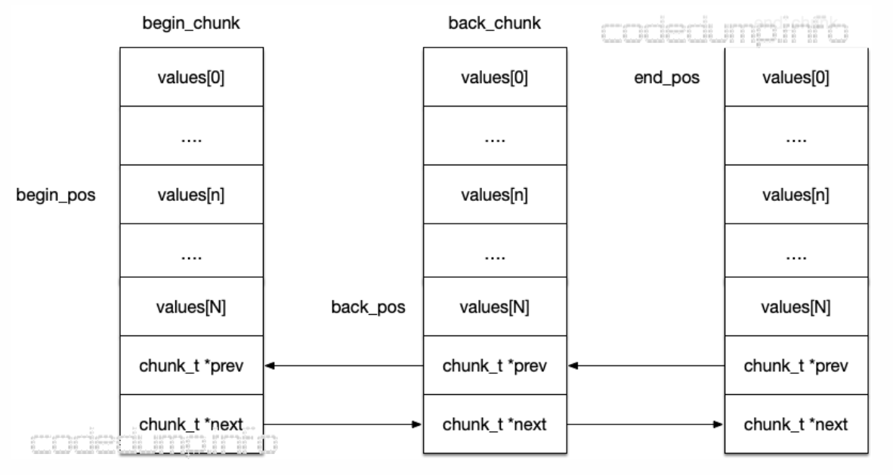
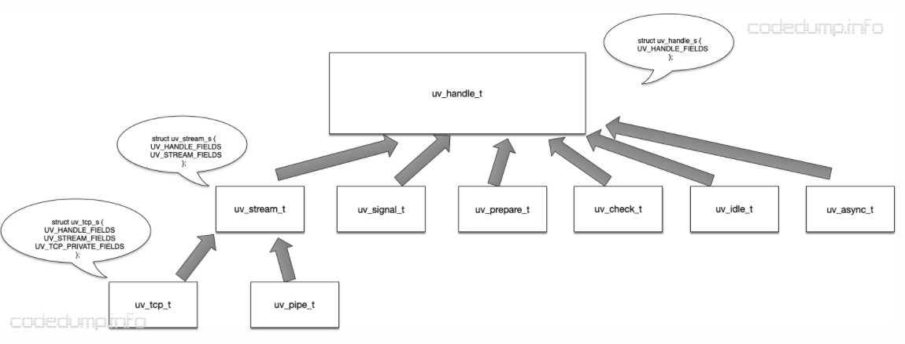
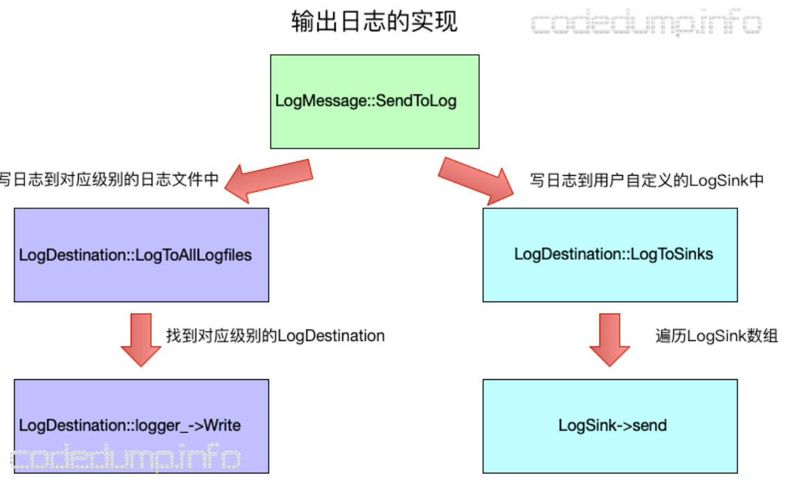

### Zeromq

zeromq网络库从以往的面向TCP流的网络开发，变成了面向消息的开发。应用层关注的是什么类型的消息，库本身解决网络收发、断线重连等问题。zeromq内部运行着多个io线程，每个io线程内部有以下两个核心组件
* poller：即针对epoll、select等事件轮询器的封装。
* mailbox：负责接收消息的消息邮箱。

简单理解IO线程做的事情是：内部通过一个poller，监听着各种事件，其中包括针对IO线程的mailbox的消息，以及绑定在该IO线程上的IO对象的消息。即这是一个per-thread-per-loop的线程设计，线程之间的通信通过消息邮箱来进行。

zeromq内部类似actor模型，每个actor内部有一个mailbox，负责收发消息，对外暴露的接口就是收发相关的send、recv接口。负责收发消息的类是mailbox_t，内部实现使用了ypipe_t来实现无锁消息队列

yqueue_t内部由一个一个chunk组成，每个chunk保存N个元素。chunk可以充当类似内存池的作用, chunk_t来管理数据，这样每次需要新分配元素的时候，如果当前已经没有可用元素，可以一次性分配一个chunk_t，这里面有N个元素；另外在回收的时候，也不是马上被释放，根据局部性原理可以先回收到spare_chunk里面，当再次需要分配chunk_t的时候从spare_chunk中获取。

有三块chunk，分别由begin_chunk、back_chunk、end_chunk组成。begin_pos指向begin_chunk中的第n个元素。back_pos指向back_chunk的最后一个元素。由于back_pos已经指向了back_chunk的最后一个元素，所以end_pos就指向了end_chunk的第一个元素。



<!-- more -->

ypipe_t在yqueue_t之上，构建了一个单写单读的无锁队列。
```
yqueue_t _queue：由yqueue_t实现的队列。
T *_w：指向第一个没有被flush的元素，只能被写线程使用。
T *_r：指向第一个未读的元素，只能被读线程使用。
T *_f：指向第一个写入但是还没有被刷新的元素。
atomic_ptr_t _c：读写线程都能使用的指针，指向最后一个被刷新的元素。如果为空，那么读线程将休眠。
```

ypipe_t构造函数在初始化的时候，将push进去一个哑元素在队列尾部，然后_r、_w、_c、_f指针都同时指向队列头。 而经过这个操作之后，begin_pos和back_pos都为0，end_pos为1（因为push了一个元素）

`write('a', true)`写入一个元素a，同时incomplete为true，意味着写入还未完成，所以并没有更新flush指针，_w指针也没有在这个函数中被更新，因此当incomplete为true时不会更新上面的四个指针。`write('b', false)`写入一个元素b，同时incomplete为false，意味着写入完成，此时需要修改flush指针指向队列尾，即新的back_pos位置2。
```cpp
//  incomplete_为true意味着这只是写入数据的一部分，此时不需要修改flush的指针指向
inline void write (const T &value_, bool incomplete_)
{
  // 注意在这里写入数据的时候修改的是_f指针
  //  Place the value to the queue, add new terminator element.
  _queue.back () = value_;
  _queue.push ();
  //  Move the "flush up to here" poiter.
  if (!incomplete_)
    // incomplete_为false表示写完毕数据了，可以修改flush指针指向
    _f = &_queue.back ();
}
```

虽然ypipe_t的实现了一个单写单读的无锁队列，但是由于没有解决多写多读问题，还是需要在写入数据的时候加锁。 因此，zeromq号称的无锁消息队列设计，其实准确的说只是针对读写线程无锁，对于多个写线程而言还是有锁的。

另外，由于在没有元素可读的情况下，读线程会休眠，因此需要一个唤醒读线程的机制，这里采用了signaler_t类型的成员变量_signaler，内部实现实际上一个pipe，向这个pipe写入一个字符用于唤醒读线程。
```cpp
void zmq::mailbox_t::send (const command_t &cmd_)
{
    // 这里需要加锁，因为是多写一读的邮箱
    _sync.lock ();
    _cpipe.write (cmd_, false);
    const bool ok = _cpipe.flush ();
    _sync.unlock ();
    if (!ok)  // flush操作返回false意味着读线程在休眠，signal发送信号唤醒读线程
        _signaler.send ();
}
```

### Libuv

libuv 是一个专注于异步 I/O 的跨平台的程序库，它主要是用于支持 Node.js, 

#### 数据结构

* uv__io_t用来表示一个IO事件。

```
uv__io_cb cb	IO事件被触发的回调函数
void* pending_queue[2]	pending队列
void* watcher_queue[2]	watcher队列
unsigned int pevents	pending的事件mask，等待下一次被添加到事件中
unsigned int events	当前的事件mask
int fd	事件fd
```

* queue, 一个queue里面的元素会有两个指针，一个指向队列前一个成员，一个指向队列下一个成员

* uv_timer_t定时器, libuv中使用最小堆来维护定时器。

一般而言，都是首先从这个最小堆数据结构中获得距离当前最近的定时器，然后拿到它的超时时间，以该超时时间做为下一次loop事件循环的时间，某些情况下会无视这个值，比如存在idle handler的情况下，此时会以0做为超时时间。

* uv_handle_t

uv_handle_t是libuv中所有handler的基类，


uv_async_t, 该结构体用于线程之间消息通知之用

uv_check_t, check handler，用于注册在每次loop循环时需要被调用的回调函数，这些回调函数会在IO事件处理之后被回调。

uv_idle_t, idle handler与prepare handler已经，在每次loop循环中处理IO事件之前被调用。

* uv_req_t

handler主要应对一定与某个文件fd相关联的事件，除了这些以外，libuv希望把所有可能导致阻塞的操作全部异步化，包括：文件操作、查询域名操作等。每个uv_req_t子类中，都有一个类型为struct uv__work的成员, 表示回调函数

```cpp
struct uv__work {
  // 工作时回调函数
  void (*work)(struct uv__work *w);
  // 工作结束时回调函数
  void (*done)(struct uv__work *w, int status);
  // 对应的loop指针
  struct uv_loop_s* loop;
  // 工作队列指针
  void* wq[2];
};
```

uv_req_t有以下子类：
```
uv_getaddrinfo_t：用于getaddrinfo调用。
uv_getnameinfo_t：用于getnameinfo调用。
uv_shutdown_t：用于shutdown操作。
uv_write_t：用于写操作。
uv_connect_t：用于TCP连接。
uv_udp_send_t：
uv_fs_t：用于文件的IO读写请求。
uv_worker_t：用于向线程提交一个任务。
```

* uv_loop_t

uv_loop_t用于表达一个事件循环，即内部封装了epoll、kqueue这类的事件通知API

```
unsigned int active_handles	活跃的handler计数，每增加一个加一，相反减一
void* handle_queue[2]	存储handler的队列，每个添加到uv_loop_t的handler都会存储到这里来
active_reqs	存储活跃的req计数，不理解为什么这个成员要定义成union
unsigned int stop_flag	事件循环终止标志位

int backend_fd	事件监听fd，如epoll_create返回的fd就保存到这里
void* pending_queue[2]	pending事件队列，后面会加以说明
void* watcher_queue[2]	观察事件队列，还没有加入事件监听的事件会先放在这里，后面会加以说明
uv__io_t** watchers	存储uv__io_t*数组，其数组索引是fd
unsigned int nwatchers	watchers的大小，不够的时候需要扩容
unsigned int nfds	watchers数组中实际存储的watcher数量
void* wq[2]	存储worker的队列
void* process_handles[2]	存储process handler的队列
void* prepare_handles[2]	存储prepare handler的队列
void* check_handles[2]	存储check handler的队列
void* idle_handles[2]	存储idle handler的队列
```

uv_loop_t结构体中有watcher_queue队列，新增加进来的IO事件，并不首先直接添加到epoll事件中，而是首先放在watcher队列，待到下一次进行poll操作时，会首先将watcher队列中的IO事件添加进来，然后再执行poll操作。

uv_req_t系列的子类，最后都会放到某个线程中处理，完成操作了之后再进行回调。这样不存在这些可能导致阻塞的操作，而是把这些操作全部异步化。

### glog

一般有两种生成日志数据的方式：

* 类printf的方式，将需要输入的数据格式化。
* 类C++ stream流的方式，提供出来operator <<操作符供输入数据。

前者的好处在于可以对输入的数据格式进行严格检查，不匹配的情况下编译器会进行告警。缺点则是不够灵活。 后者的好处是灵活，除了用了进行一般的日志输入，还可以写出类似`CHECK_IF(某条件不成立) << 输出日志`

glog选择了第二种模式, glog中每一条日志，都对应一个LogMessage的类，然后将返回其中的stream()对象输入日志数据。

```#define LOG(severity) COMPACT_GOOGLE_LOG_ ## severity.stream()
#define COMPACT_GOOGLE_LOG_INFO google::LogMessage( \
    __FILE__, __LINE__)
#define COMPACT_GOOGLE_LOG_WARNING google::LogMessage( \
    __FILE__, __LINE__, google::GLOG_WARNING)
```

LOG之类的宏，实际返回的就是LogMessageData的stream指针，待到一切的输入完毕，这一条日志对应的LogMessage就会被析构，其析构函数内又会调用成员函数Flush，这个函数最终完成将日志输出的操作
```cpp
void LogMessage::Flush() {
  // ...
  {
    MutexLock l(&log_mutex);
    (this->*(data_->send_method_))();
    ++num_messages_[static_cast<int>(data_->severity_)];
  }
  // ...
}
```

日志的分发由类LogDestination来负责，其提供出去的接口多为静态函数。 以某个send_method函数的实现来看，如LogMessage::SendToLog。

LogDestination::LogToAllLogfiles：写日志到对应级别的日志文件中。
LogDestination::LogToSinks：写到用户自定义的sink输出中，传递那么多参数是为了去掉添加进去的logprefix，包括severity，ts，线程id，文件basename等。

```cpp
void LogMessage::SendToLog() EXCLUSIVE_LOCKS_REQUIRED(log_mutex) {
    // ...
    // log this message to all log files of severity <= severity_
    LogDestination::LogToAllLogfiles(data_->severity_, data_->timestamp_,
                                     data_->message_text_,
                                     data_->num_chars_to_log_);
    LogDestination::LogToSinks(data_->severity_,
                           data_->fullname_, data_->basename_,
                           data_->line_, &data_->tm_time_,
                           data_->message_text_ + data_->num_prefix_chars_,
                           (data_->num_chars_to_log_
                            - data_->num_prefix_chars_ - 1));
    // ...
}
```

* 写到对应级别的日志

LogDestination内部有一个与不同日志级别相关的LogDestination数组， 对某个级别的日志而言，会依次调用级别值更小的日志输出，比如WARN级别的日志也会输出到INFO级别的日志文件中。

```cpp
static LogDestination* log_destinations_[NUM_SEVERITIES];


inline void LogDestination::LogToAllLogfiles(LogSeverity severity,
                                             time_t timestamp,
                                             const char* message,
                                             size_t len) {
  if ( FLAGS_logtostderr ) {           // global flag: never log to file
    ColoredWriteToStderr(severity, message, len);
  } else {
    for (int i = severity; i >= 0; --i)
      LogDestination::MaybeLogToLogfile(i, timestamp, message, len);
  }
}

```

* 写到用户自定义sink中

每个LogDestination内部又有一个叫LogSink的类来真正负责日志的输出，该类也是一个纯虚类，用户需要实现其中的send方法来完成日志的输出。对于每个级别的日志而言，会将同级别的LogSink一起放在一个向量中：

```cpp
static vector<LogSink*>* sinks_

// 输出自定义的日志
inline void LogDestination::LogToSinks(LogSeverity severity,
                                       const char *full_filename,
                                       const char *base_filename,
                                       int line,
                                       const struct ::tm* tm_time,
                                       const char* message,
                                       size_t message_len) {
  ReaderMutexLock l(&sink_mutex_);
  if (sinks_) {
    for (int i = sinks_->size() - 1; i >= 0; i--) {
      (*sinks_)[i]->send(severity, full_filename, base_filename,
                         line, tm_time, message, message_len);
    }
  }
}
```

