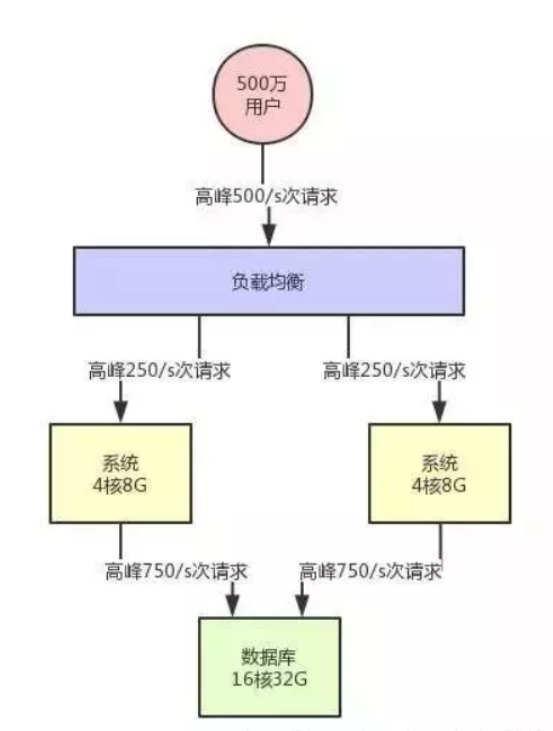
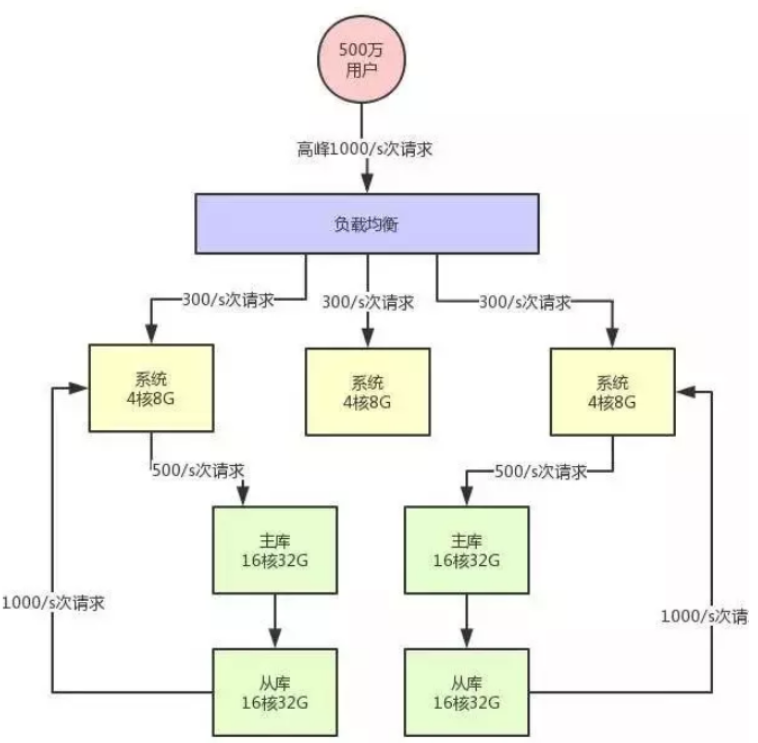
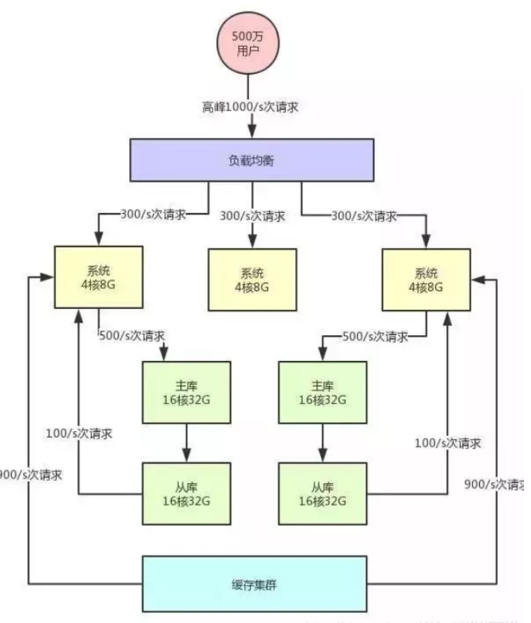

### 高并发系统

高并发系统的并发意味着请求量大。比如每秒百万并发的中间件系统、每日百亿请求的网关系统、瞬时每秒几十万请求的秒杀大促系统。他们在应对高并发的时候，因为系统各自特点的不同，所以应对架构都是不一样的。另外，比如电商平台中的订单系统、商品系统、库存系统，在高并发场景下的架构设计也是不同的，因为背后的业务场景什么的都不一样。

* 负载均衡

请求量大首先想到的是负载均衡, 将请求均匀打到系统层

* 分库分表和读写分离

处理层分流, 数据库请求层也需要分流。对系统做分库分表 + 读写分离，也就是把一个库拆分为多个库(相当于分片)，部署在多个数据库服务上，这是作为主库承载写入请求的。然后每个主库都挂载至少一个从库，由从库来承载读请求(master和follower)。

假设对数据库层面的读写并发是 3000/s，其中写并发占到了 1000/s，读并发占到了 2000/s。那么分库分表之后，采用两台数据库服务器上部署主库来支撑写请求，每台服务器承载的写并发就是 500/s。每台主库挂载一个服务器部署从库，那么 2 个从库每个从库支撑的读并发就是 1000/s。

注意高并发包括每个层的高并发, 请求处理层可能只有1000/s, 但数据库读写层可能有3000/s, 每个层都要考虑到, 因为一层崩了所有的服务都失去效用

* 缓存

可以根据系统的业务特性，对那种写少读多的请求，引入缓存集群。具体来说，就是在写数据库的时候同时写一份数据到缓存集群里，然后用缓存集群来承载大部分的读请求。
这样的话，通过缓存集群，就可以用更少的机器资源承载更高的并发。

* 消息中间件

缓存解决了数据库的读压力, 而对于写压力用消息中间件解决。引入消息中间件集群，把允许异步化的每秒 500 次请求写入 MQ，然后基于 MQ 做一个削峰填谷。比如就以平稳的 100/s 的速度消费出来，然后落入数据库中即可，此时就会大幅度降低数据库的写入压力。

1. 数据库层面的分库分表+读写分离。
2. 针对读多写少的请求，引入缓存集群。
3. 针对高写入的压力，引入消息中间件集群。

<!-- more -->