### 文件系统

Unix操作系统的设计思想集中反映在其文件系统上。文件系统主要有以下几个概念

#### 文件

Unix文件是以字节序列组成的信息载体(container), 内核控制文件而不包含文件内容。从用户的观点看, 文件被组织在一个树结构的命名空间中, 除了叶节点外, 树的所有节点都表示目录名, 目录节点包含它下面文件及目录的所有信息。
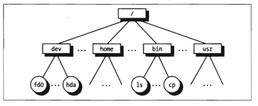

Unix的每个进程都有一个当前工作目录, 它属于进程执行上下文(execution context), 标识出进程所用的当前目录。为了标识特定的文件, 进程使用路径名。如果路径名第一个字符是/, 则是绝对路径; 反之则是相对路径, 相对路径起点是进程的当前目录。

#### 硬链接和软链接

包含在目录中的文件名就是一个文件的硬链接(hard link), 通过命令`ln P1 P2`, 硬链接类似指针标记文件的物理地址。硬链接有两个限制。

1. 不允许给目录创建硬链接, 因为这可能把目录树变为环形树, 从而不可能通过名字定位文件

2. 只有同一文件系统的文件之间才可以创建链接, 这就带来比较大的限制

为了克服以上限制, 引入了软链接(soft link)也称符号链接(symbolic link)。符号链接是段文件, 这些文件包含另一个文件的路径名, 通过`ln -s P1 P2`。

#### 文件类型

Unix的文件可以是下列类型之一

1. 普通文件; 目录; 符号链接; 

2. 面向块的设备文件(block-oriented device file); 面向字符的设备文件(character-oriented device file); 

3. 管道(pipe)和命名管道(named pipe); 套接字(socket)

前三种文件类型是基本类型, 设备文件与I/O设备以及集成到内核中的设备驱动程序相关。管道和套接字是用于进程间通信的特殊文件。

<!-- more -->

#### 访问权限和文件模式

文件的潜在用户分为三种类型
* 文件所有者owner
* 同组用户，不包括文件所有者 user
* 所有剩下的用户 other

新创建文件的默认权限
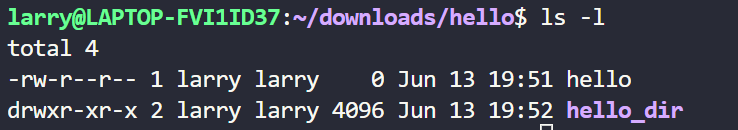
可见新建空目录显示空间为4K, 且给予执行权限。

只有执行权限只能进入目录，不能看到目录下的内容，要想看到目录下的文件名和目录名，需要可读权限

此外还有三种附加的标记, suid(set user id), sgid(set group id), sticky来定义文件的模式。当这三种标记应用到可执行文件时, suid使执行文件的进程获得文件拥有者的uid; sgid使执行可执行文件的进程获得文件用户组的id; sticky标记的可执行文件相当于向内核发出一个请求，当程序执行结束以后仍然将文件保存在内存(不常用)

当文件由一个进程创建时, 文件所有者ID就是进程的UID, 而文件用户组id可以使进程创建者的ID, 也可以是父目录的id, 这取决于sgid标志位。

#### 文件操作的系统调用

当用户访问一个普通文件或目录文件的内容时, 他实际上是访问存储在硬件设备上的一些数据, 文件系统可以看作硬盘分区物理组织的用户试图。因为处于用户态的进程不能直接与底层硬件交互, 所以每个实际的文件操作必须在内核态下完成。

```cpp
fd = open(path, flag, mode)
/*
path是文件的相对或绝对路径
flag指定文件打开的方式, 例如读, 写, 读/写, 追加), 它也指定是否应当创建一个不存在的文件
mode 指定新创建文件的访问权限
*/
newoffset=lseek(fd, offset, whence);
/*
fd 打开文件地fd
offset, 指定一个有符号整数值, 用来计算文件指针的新位置
whence, 指定文件指针新位置的计算方式, 可以是offset+0表示文件指针从头移动, 或者offset+当前位置表示从当前位置移动, 还可以是文件最后一个字节位置, 表示从末尾移动
*/

nread = read(fd, buf, count);
/*
buf表示进程地址空间(用户空间)中缓存区的地址, 所读的数据自动放到这个缓冲区
count表示所读的字节数

内核会自动尝试从fd文件中读count个字节,起始位置是打开文件offset字段的当前值。某些情况下可能遇到EOF, 因此内核可能无法读出count个字节,返回的nread是实际读的字节
*/
write()参数和read类似

res=close(fd)
/*
将释放与文件描述符对应的打开文件对象, 当一个进程终止时, 内核会关闭所有其仍然打开的文件。
*/
```
随机访问文件由lseek决定, 事实上追加写文件只不过设置lseek到文件末尾。每个文件inode都会维护当前用户文件存储的若干物理地址区间, 随机写往往是操作系统开辟一页(4K)区域, 写完被链接到inode指定位置。因此在文件系统中随机写和追加写效率差别并不明显

此外, 设备文件, 管道文件等只支持顺序读取

### 虚拟文件系统
虚拟文件系统(Virtual Filesystem), 用来处于与Unix标准文件系统相关的所有系统调用。位于用户进程(C标准库)和文件系统之间的抽象层。
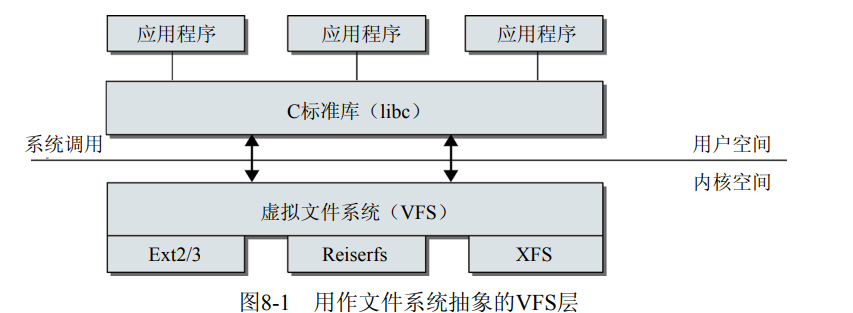

#### inode和fd

处理文件时，内核空间和用户空间使用的主要对象是不同的。对用户程序来说,一个文件由一个文件描述符标识。文件描述符在打开文件时由内核分配, 只在一个进程内部有效, 两个不同进程可以使用同样的文件描述符, 但不一定指向一个文件(也有例外比如标准输入，输出，错误0,1,2)

内核处理文件的关键是inode, 每个文件和目录都有且只有一个对应的inode, 其中包含元数据(如访问权限, 上次修改日期)和指向文件数据的指针(可以是设备文件, 管道文件)。(值得一提读取文件到内存, 内存的逻辑地址是固定的, 一般需要先预先分配若干内存操作系统并给好地址, 然后将文件内容读取到这块内存中。如果内存不够, 操作系统调度虚拟内存将某些地址的数据放回到磁盘, 空间就空出来了。自然的, 内存逻辑地址变化了但物理地址没变, 因为内存硬件结构还是那样


```cpp
struct inode {
	/* RCU path lookup touches following: */
	umode_t			i_mode;
	uid_t			i_uid;
	gid_t			i_gid;
	const struct inode_operations	*i_op;
	struct super_block	*i_sb;

	spinlock_t		i_lock;	/* i_blocks, i_bytes, maybe i_size */
	unsigned int		i_flags;
	unsigned long		i_state;
	struct mutex		i_mutex;
	unsigned long		dirtied_when;	/* jiffies of first dirtying */

	struct hlist_node	i_hash;
	struct list_head	i_wb_list;	/* backing dev IO list */
	struct list_head	i_lru;		/* inode LRU list */
	struct list_head	i_sb_list;
	union {
		struct list_head	i_dentry;
		struct rcu_head		i_rcu;
	};
	unsigned long		i_ino;  // inode唯一标识
	atomic_t		i_count;
	unsigned int		i_nlink;
	dev_t			i_rdev;  // 用于块设备
	unsigned int		i_blkbits;
	u64			i_version;
	loff_t			i_size;

	struct timespec		i_atime;
	struct timespec		i_mtime;
	struct timespec		i_ctime;
	blkcnt_t		i_blocks;
	unsigned short          i_bytes;
	struct rw_semaphore	i_alloc_sem;
	const struct file_operations	*i_fop;	/* former ->i_op->default_file_ops */
	struct file_lock	*i_flock;
	struct address_space	*i_mapping;
	struct address_space	i_data;

	struct list_head	i_devices;  // 设备文件
	union {
		struct pipe_inode_info	*i_pipe;  // 管道文件
		struct block_device	*i_bdev;
		struct cdev		*i_cdev;
	};

	__u32			i_generation;
};
```
硬链接和原始文件共享一个inode, 这时候处理inode需要设置一下引用计数。

查看inode信息最简单的方式调用linux的stat工具, 即 stat [文件名]
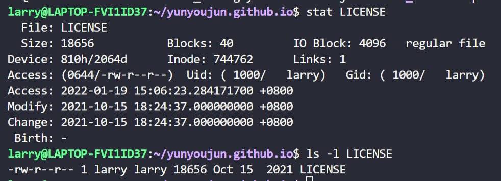

可以对inode的操作
```cpp
struct inode_operations {
	// 根据文件名(字符串)查找inode
	struct dentry * (*lookup) (struct inode *,struct dentry *, struct nameidata *);
	void * (*follow_link) (struct dentry *, struct nameidata *);
	int (*permission) (struct inode *, int, unsigned int);
	int (*check_acl)(struct inode *, int, unsigned int);

	int (*readlink) (struct dentry *, char __user *,int);
	void (*put_link) (struct dentry *, struct nameidata *, void *);

	int (*create) (struct inode *,struct dentry *,int, struct nameidata *);
	int (*link) (struct dentry *,struct inode *,struct dentry *);
	int (*unlink) (struct inode *,struct dentry *);
	int (*symlink) (struct inode *,struct dentry *,const char *);
	int (*mkdir) (struct inode *,struct dentry *,int);
	int (*rmdir) (struct inode *,struct dentry *);
	int (*mknod) (struct inode *,struct dentry *,int,dev_t);
	// 同时包含了move, rename很重要
	int (*rename) (struct inode *, struct dentry *,
			struct inode *, struct dentry *);
	// 修改inode的长度
	void (*truncate) (struct inode *);
	int (*setattr) (struct dentry *, struct iattr *);
	int (*getattr) (struct vfsmount *mnt, struct dentry *, struct kstat *);
	int (*setxattr) (struct dentry *, const char *,const void *,size_t,int);
	ssize_t (*getxattr) (struct dentry *, const char *, void *, size_t);
	ssize_t (*listxattr) (struct dentry *, char *, size_t);
	int (*removexattr) (struct dentry *, const char *);
	void (*truncate_range)(struct inode *, loff_t, loff_t);
	int (*fiemap)(struct inode *, struct fiemap_extent_info *, u64 start,
		      u64 len);
} ____cacheline_aligned;
```

#### 注册和挂载

* 注册文件系统

fs/super.c中的register_filesystem用来向内核注册文件系统。每个已经装载的文件系统, 在内存中都创建了一个超级块结构。
```cpp
<fs.h>
struct file_system_type
{
    const char* name;
    int fs_flags;
    struct super_block *(*get_sb) (struct file_system_type*, int, const char*, void*, struct vfsmount*);
    void (*kill_sb) (struct super_block* );
    struct module* owner;
    struct file_system_type* type;
    struct list_head fs_supers;
};
```

* 装载mount

通过mount, 文件系统被装载到了某个目录, 但卸载文件系统之后目录原本的文件就会出现。每个被装载的文件系统都对应一个vfsmount结构的实例. 内部实现是将当前目录链接到挂载文件系统超级块的地址。

```cpp
// include/linux/mount.h
struct vfsmount {
	struct list_head mnt_hash;
	struct vfsmount *mnt_parent;	/* fs we are mounted on 装载的父文件系统 */
	struct dentry *mnt_mountpoint;	/* dentry of mountpoint */
	struct dentry *mnt_root;	/* root of the mounted tree */
	struct super_block *mnt_sb;	/* pointer to superblock 指向超级块*/
	struct list_head mnt_mounts;	/* list of children, anchored here */
	struct list_head mnt_child;	/* and going through their mnt_child */
	int mnt_flags;
	/* 4 bytes hole on 64bits arches without fsnotify */
	const char *mnt_devname;	/* Name of device e.g. /dev/dsk/hda1 */
	struct list_head mnt_list;
	struct list_head mnt_expire;	/* link in fs-specific expiry list */
	struct list_head mnt_share;	/* circular list of shared mounts */
	struct list_head mnt_slave_list;/* list of slave mounts */
    ...
};
```

#### 超级块

超级块记录文件系统的元信息
```cpp
struct super_block {
	struct list_head	s_list;		/* Keep this first */
	dev_t			s_dev;		/* search index; _not_ kdev_t */
	unsigned char		s_dirt;
	unsigned char		s_blocksize_bits;
	unsigned long		s_blocksize;
	loff_t			s_maxbytes;	/* Max file size */
	struct file_system_type	*s_type;
	const struct super_operations	*s_op;
	const struct dquot_operations	*dq_op;
	const struct quotactl_ops	*s_qcop;
	const struct export_operations *s_export_op;
	unsigned long		s_flags;
	unsigned long		s_magic;
	struct dentry		*s_root;
	struct rw_semaphore	s_umount;
	struct mutex		s_lock;
    struct list_head	s_inodes;	/* all inodes */
	struct hlist_bl_head	s_anon;		/* anonymous dentries for (nfs) exporting */
    ...
}
```

可以对super_block执行的操作, 主要是对inode的操作。
```cpp
struct super_operations {
   	struct inode *(*alloc_inode)(struct super_block *sb);
	void (*destroy_inode)(struct inode *);

   	void (*dirty_inode) (struct inode *, int flags);
	int (*write_inode) (struct inode *, struct writeback_control *wbc);
	int (*drop_inode) (struct inode *);
	void (*evict_inode) (struct inode *);
	void (*put_super) (struct super_block *);
	void (*write_super) (struct super_block *);
	int (*sync_fs)(struct super_block *sb, int wait);
	int (*freeze_fs) (struct super_block *);
	int (*unfreeze_fs) (struct super_block *);
	int (*statfs) (struct dentry *, struct kstatfs *);
	int (*remount_fs) (struct super_block *, int *, char *);
	void (*umount_begin) (struct super_block *);

	int (*show_options)(struct seq_file *, struct vfsmount *);
	int (*show_devname)(struct seq_file *, struct vfsmount *);
	int (*show_path)(struct seq_file *, struct vfsmount *);
	int (*show_stats)(struct seq_file *, struct vfsmount *);
```

#### dentry

文件系统内的文件可能非常庞大，目录树结构可能很深，该树状结构中，可能存在几千万，几亿的文件。dentry就是建立文件名到inode的mapping关系, 涉及到hash等算法。dentry的hash值，取决于两个值：父dentry的地址和该dentry路径的basename (突然想起裴哥说的XXXX直接用文件地址作为文件名, 从而可以直接用文件名定位文件, 差不多也是dentry的原理了)

Linux使用目录项缓存(dentry缓存)来快速访问此前查找操作的结果, 该缓存围绕struct dentry建立

```cpp
struct dentry {
	/* RCU lookup touched fields */
	unsigned int d_flags;		/* protected by d_lock */
	seqcount_t d_seq;		/* per dentry seqlock */
	struct hlist_bl_node d_hash;	/* lookup hash list */
	struct dentry *d_parent;	/* parent directory */
	struct qstr d_name;
	struct inode *d_inode;		/* Where the name belongs to - NULL is
					 * negative */
	unsigned char d_iname[DNAME_INLINE_LEN];	/* small names */

	/* Ref lookup also touches following */
	unsigned int d_count;		/* protected by d_lock */
	spinlock_t d_lock;		/* per dentry lock */
	const struct dentry_operations *d_op;
	struct super_block *d_sb;	/* The root of the dentry tree */
	unsigned long d_time;		/* used by d_revalidate */
	void *d_fsdata;			/* fs-specific data */

	struct list_head d_lru;		/* LRU list */
	/*
	 * d_child and d_rcu can share memory
	 */
	union {
		struct list_head d_child;	/* child of parent list */
	 	struct rcu_head d_rcu;
	} d_u;
	struct list_head d_subdirs;	/* our children */
	struct list_head d_alias;	/* inode alias list */
};

```

#### file

file struct相当于用户访问user file的上下文信息, 记录了一些f_mode, f_pos等

```cpp
struct path {
	struct vfsmount *mnt;
	struct dentry *dentry;  // 可以loopup
};

struct file {
	/*
	 * fu_list becomes invalid after file_free is called and queued via
	 * fu_rcuhead for RCU freeing
	 */
	union {
		struct list_head	fu_list;
		struct rcu_head 	fu_rcuhead;
	} f_u;
	struct path		f_path;  // 应该可以通过这个look_up inode
	const struct file_operations	*f_op;
	spinlock_t		f_lock;  /* f_ep_links, f_flags, no IRQ */
#ifdef CONFIG_SMP
	int			f_sb_list_cpu;
#endif
	atomic_long_t		f_count;
	unsigned int 		f_flags;
	fmode_t			f_mode;
	loff_t			f_pos;
	struct fown_struct	f_owner;
	const struct cred	*f_cred;
	struct file_ra_state	f_ra;

	u64			f_version;
	/* needed for tty driver, and maybe others */
	void			*private_data;

#ifdef CONFIG_EPOLL
	/* Used by fs/eventpoll.c to link all the hooks to this file */
	struct list_head	f_ep_links;
#endif /* #ifdef CONFIG_EPOLL */
	struct address_space	*f_mapping;
#ifdef CONFIG_DEBUG_WRITECOUNT
	unsigned long f_mnt_write_state;
#endif
};

struct file_handle {
	__u32 handle_bytes;
	int handle_type;
	/* file identifier */
	unsigned char f_handle[0];
};
```

file struct位于fdtable中, 
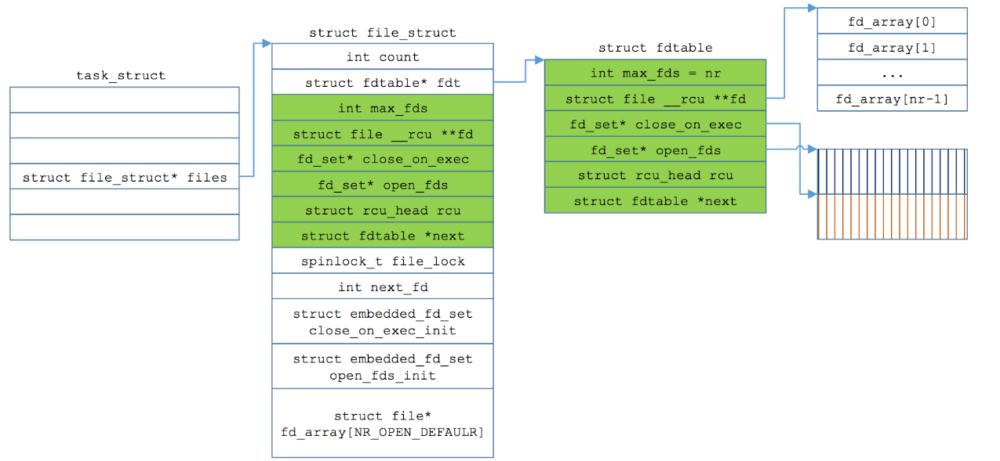
后面还有, 通过struct file可以look_up内部的inode结构。这就是基于fd访问到inode的过程, 另一种访问inode的方法是通过inode number

```cpp
struct fdtable {
	unsigned int max_fds;
	struct file __rcu **fd;      /* current fd array */
	fd_set *close_on_exec;
	fd_set *open_fds;
	struct rcu_head rcu;
	struct fdtable *next;
};

/*
 * Open file table structure
 */
struct files_struct {
  /*
   * read mostly part
   */
	atomic_t count;
	struct fdtable __rcu *fdt;
	struct fdtable fdtab;
  /*
   * written part on a separate cache line in SMP
   */
	spinlock_t file_lock ____cacheline_aligned_in_smp;
	int next_fd;
	struct embedded_fd_set close_on_exec_init;
	struct embedded_fd_set open_fds_init;
	struct file __rcu * fd_array[NR_OPEN_DEFAULT];
};
```


#### 文件操作

inode和文件包含了对于文件可能的操作
1. inode操作, 创建链接, 文件重命名, 在目录中生成新文件, 删除文件
2. 文件操作, 作用于文件的数据内容, 包括读写, 以及设置文件位置指针, 内存映射等

针对file的操作, file是对进程fd直接可见的
```cpp
struct file_operations {
	struct module *owner;
	loff_t (*llseek) (struct file *, loff_t, int);
	ssize_t (*read) (struct file *, char __user *, size_t, loff_t *);
	ssize_t (*write) (struct file *, const char __user *, size_t, loff_t *);
	ssize_t (*aio_read) (struct kiocb *, const struct iovec *, unsigned long, loff_t);
	ssize_t (*aio_write) (struct kiocb *, const struct iovec *, unsigned long, loff_t);
	int (*readdir) (struct file *, void *, filldir_t);
	unsigned int (*poll) (struct file *, struct poll_table_struct *);
	long (*unlocked_ioctl) (struct file *, unsigned int, unsigned long);
	long (*compat_ioctl) (struct file *, unsigned int, unsigned long);
	int (*mmap) (struct file *, struct vm_area_struct *);
	int (*open) (struct inode *, struct file *);
	int (*flush) (struct file *, fl_owner_t id);
	int (*release) (struct inode *, struct file *);
	int (*fsync) (struct file *, int datasync);
	int (*aio_fsync) (struct kiocb *, int datasync);
	int (*fasync) (int, struct file *, int);
	int (*lock) (struct file *, int, struct file_lock *);
	ssize_t (*sendpage) (struct file *, struct page *, int, size_t, loff_t *, int);
	unsigned long (*get_unmapped_area)(struct file *, unsigned long, unsigned long, unsigned long, unsigned long);
	int (*check_flags)(int);
	int (*flock) (struct file *, int, struct file_lock *);
	ssize_t (*splice_write)(struct pipe_inode_info *, struct file *, loff_t *, size_t, unsigned int);
	ssize_t (*splice_read)(struct file *, loff_t *, struct pipe_inode_info *, size_t, unsigned int);
	int (*setlease)(struct file *, long, struct file_lock **);
	long (*fallocate)(struct file *file, int mode, loff_t offset,
			  loff_t len);
};
```

* 查找inode, look_up

首先试图在dentry缓存中查找inode, 找到之后还需要检查缓存项是否仍然有效。根据文件名寻找inode并非挨个找, 中间涉及大量字符串散列优化。

* 打开文件, open

将创建的file实例放置在超级块的s_files链表中, 然后调用底层的open函数。do_flip_open用来找到文件的inode, fd_install最后将fd放置到task_struct的file->fd数组中


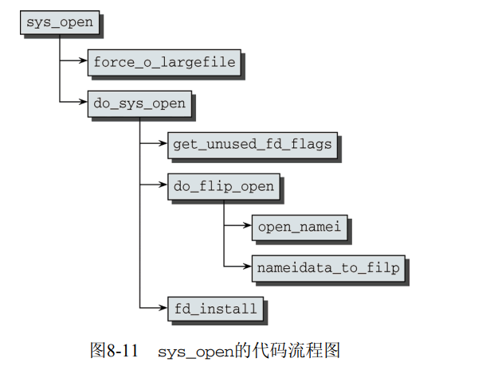

* 读取和写入

根据fd, 内核调用fget_light从进程的task_struct中找到与之关联的file实例; 然后用file_pos_read找到读写位置。read操作委托给vfs_read执行。
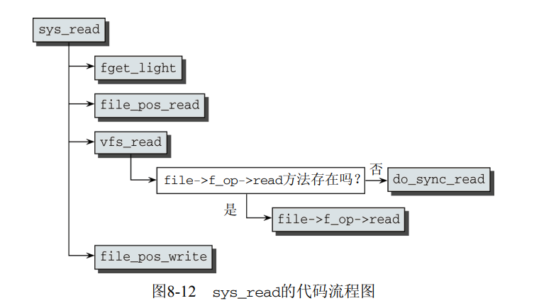

mmap, 通过该文件的文件结构体, 调用file.file_operations.mmap函数, 实现了文件fd和内存虚拟地址的映射关系。通过修改这块内存, 是可以直接做到修改文件的。

缺点, 通过mmap无法追加文件内容; mmap减少了内核态到用户态的数据拷贝，更多在于读效率的提升, 当写操作过多时，从page cache写回磁盘的操作无法避免(其耗时远远大于内存的相互拷贝)，这大大减少了mmap的作用。

#### Access Control Lists ACL

access ACL：我们可以认为每一个对象(文件/目录)都可以关联一个 ACL 来控制其访问权限，这样的 ACL 被称为 access ACL。


通用文件模型由下列对象类型组成
1. 超级块对象(superblock object), 存放已安装文件系统的有关信息, 通常对应于磁盘上的文件系统控制块(filesystem control block)
2. 索引节点对象(inode object), 存放关于具体文件的一般信息, 通常对应于磁盘上的文件控制块file control block。每个索引节点对象都有一个索引节点号，这个节点号唯一标识文件系统的文件
3. 文件对象(file object), 存放打开文件与进程之间交互的有关信息, 这类信息仅当进程访问文件期间存放于内核内存中。
4. 目录项对象(dentry object), 存放目录项与对应文件链接的有关信息。

最近最常使用的目录项对象被放在目录项高速缓存(dentry cache)的磁盘高速缓冲中, 加速从文件路径名到最后一个路径分量索引节点的转换过程。

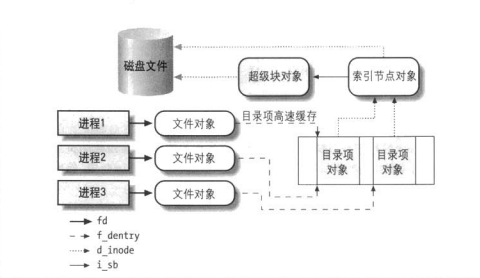

#### file与进程

每个进程都有它自己当前的工作目录和它自己的根目录, 其中进程的files_struct结构用来表示进程当前打开的文件, 表的地址存放于进程描述符的files字段。
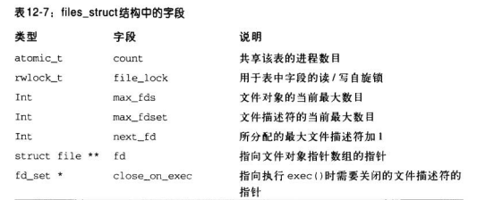
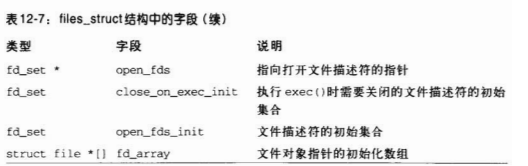

注意`strict file*[] fd_array`, fd字段指向文件对象的指针数组, 而数组的索引就是我们将的文件描述符。通常数组的前三个元素(索引分别为0,1,2)为进程的标准输入文件, 标准输出文件, 标准错误文件。
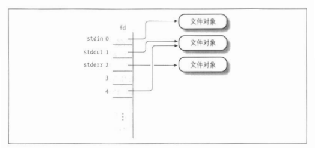

进程不能使用多于NR_OPEN(通常104 8576)个文件描述符, 并且内核也在进程描述符的`signal->rlim[RLIMIT_NOFILE]`强制限制动态文件描述符的最大值, 这个值通常为1024但可以修改。

狭义的文件系统是进程的文件系统。每个进程可拥有自己的已安装文件系统树, 叫做**进程的命名空间**(namespace).通常大多数进程共享同一个命名空间, 即位于系统的跟文件系统且被init进程使用的已安装文件系统树。当然可以安装进程的文件系统, 使进程可以独享资源(除cpu外的一切资源皆文件), 这就是容器的原理。

当进程根据路径名查找文件时, 如果路径名第一个字符是'/'. 那这个路径名是绝对路径, 将从进程的根目录开始搜索; 否则该路径就是相对路径, 从进程的当前目录开始搜索。虚拟文件系统可以找到目标索引节点和文件对象。而进一步操作文件是将文件看成细分数据页(每页4kb), 读写缓存中的页, 将这些缓冲页标记为脏, 最后再刷入磁盘。

### 文件系统与硬件相关

#### I/O设备

所有计算机都拥有一条系统总线, 它连接大部分内部硬件设备。一种典型的系统总线是PCI(Peripheral Component Interconnect), 除此之外还有ISA, SCSI, USB等。这几种不同的总线通过桥的硬件设备连接在一起。前端总线将CPU连接到RAM控制器, 后端总线将CPU直接连接到外部硬件的高速缓存上。

CPU和I/O设备中的数据通路称为I/O总线, 每个I/O设备都有自己的I/O地址集, 通常称为I/O端口， I/O端口可用于数据读写。I/O接口和控制器连接在一起, 将I/O端口的值转换成设备控制所需要的命令和数据。常用的I/O接口包括键盘接口, 图形接口, 磁盘接口, 鼠标接口, 网络接口。将I/O端口映射到普通内存中, 可以像处理普通内存那样操作外设, 例如GPU通过内存映射的操作往往像操作内存那样。
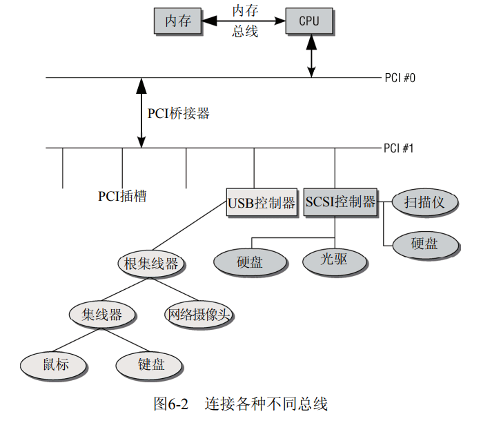

至于系统怎样知道某个设备已经就绪, 这和网络编程的事件驱动类似。一种方式是轮询, 系统遍历设备端口但缺点是大多数端口可能设备没有就绪, 因为浪费大量事件; 另一种方式是中断, 就绪的设备通过中断号主动通知系统, 这种效率会很高。(中断像一种进程通信, 类似epoll)

设备文件
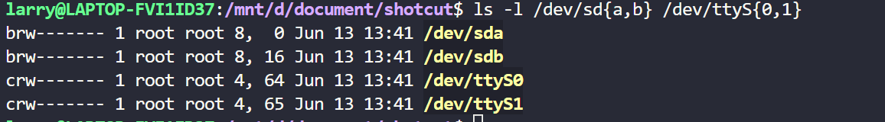

设备控制器通过I/O接口从微处理器接收诸如写地址为XXX数据块的命令, 将其转换为诸如"把磁头定位在正确的磁道上", "把数据写入磁道"的磁盘操作, 设备控制器往往相当复杂。

如果一个进程在某个磁盘文件上发出一个read()系统调用
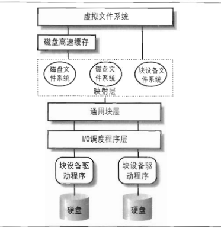
1. read()系统调用的服务例程调用适当的VFS函数, 将文件描述符和偏移量传给它, VFS提供了通用的文件模型
2. VFS确定请求的数据是否存在, 是否需要访问磁盘的数据还是缓存读取
3. 如果需访问磁盘数据, 就需要确定数据的物理位置。首先内核确定该文件所在文件系统的块block大小, 请求数据所在的块号(blockId)。然后映射层调用具体文件系统的函数, 它访问文件的磁盘节点, 根据逻辑块号确定所请求数据在磁盘上的位置
4. 内核对块设备发出读请求, 块设备驱动程序向磁盘控制器的硬件接口发出适当的命令, 引起数据传送

其中硬件块设备控制器采用扇区的固定长度的块的传送数据, I/O调度程序和块设备驱动程序必须管理扇区。通过虚拟文件系统, 可以实现无需挂载ext2, ext3等文件系统条件下直接读写块设备(通过BIO).例如socket套接字的读写, 只是经过了虚拟文件系统没有经过ext2等具体文件系统 (感受到了块存储和文件存储的区别

虚拟文件系统，映射层，文件系统将磁盘数据存放在称为块的逻辑单元中, 一个块是文件系统最小的磁盘存储单元。而磁盘缓存作用于磁盘数据的页单元(内存的页框同样大小)。
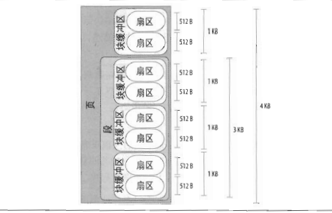

磁盘读取并不费时, 而磁道的寻址是相当费时的。因此只要可能，内核就试图把几个扇区合并在一起作为整体处理, 减少磁头平均移动时间。因此这里执行会延迟, 不是请求一发生内核就满足它。每个块设备驱动程序都维持着自己的请求队列, 它包含设备待处理的请求链表。为了防止块设备驱动程序被挂起, 每个I/O操作都是异步处理的, 当I/O操作终止时, 磁盘控制器会产生一个中断提醒处理已完成(很像一般的异步编程)。

I/O调度程序会通过扇区将请求队列排序，这样顺序的从请求链表拿走要处理的请求会大大减少I/O次数, 因为磁头寻找是由内而外或由外而内顺序寻道而不是跳跃, 这种根据请求扇区的位置排序的算法也称为电梯算法(因为磁头比较像电梯一层一层的来回移动)。

#### Volume卷

在操作系统和RAID(Redundant Array of Independent Disks或直接的磁盘控制器)之间产生了一种叫卷管理器(Volume Manager)的软件。卷管理器将RAID提交上来的磁盘进行再划分和再重组，使得操作系统可以自由的对卷进行管理。

概念
1. PV(Physical Volume)物理卷：即是RAID提交上来的物理磁盘
2. PE(Physical Extends)物理段：将PV进行等大小划分出来的物理区块，每个PE都代表着PV上从几号扇区到几号扇区，PE是分割和合并的最小单位
3. VG(Volume Group)：卷管理器将PE进行组合，组成逻辑上的大的容器池，称为VG
4. LV(Logical Volume)：从VG中将若干数量的PE组合成逻辑卷。在Linux中，一个逻辑卷就可以被挂在到相应的目录。

常看到的就是物理卷-逻辑卷-挂载。

分区实际上也可以看成一种简单的卷管理，是操作系统自带的卷管理程序，但是只能管理单个磁盘。一般的卷管理是可以管理多个磁盘的.

BIOS在进行引导时，总是会执行LBA1扇区上的指令，以加载操作系统，这个扇区称为MBR(Master Boot Recorder)，其中还保存着分区表。通常第一条指令都是跳转到活动分区读取操作系统的代码并执行。卷管理程序同样需要遵从BIOS和MBR，划分出一个小分区，将启动操作系统的代码放在这个分区中, 例如efi

Linux中，每一个硬件设备都映射到一个系统的文件，Linux 把各种IDE设备(Integrated Drive Electronics, 一般就是磁盘驱动器)分配了一个由hd前缀组成的文件, 例如hda, hdb；而对于各种SCSI(Small Computer System Interface, 一般热插拔比如U盘)设备，则分配了一个由sd前缀组成的文件, 例如sda, sdb。

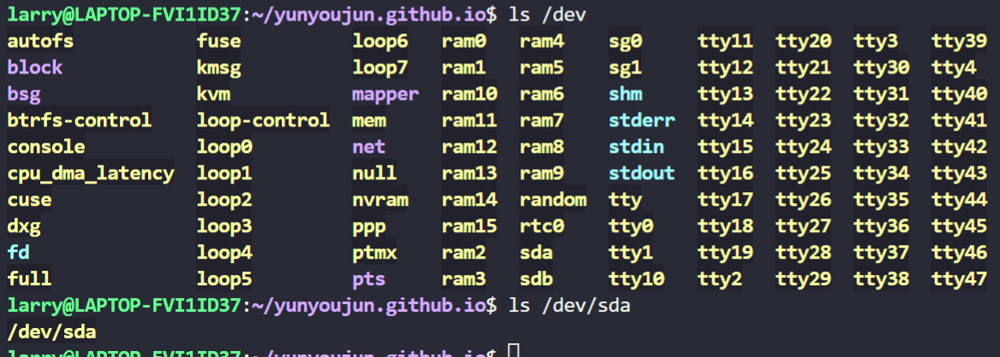

以上块设备, 其实就是逻辑卷。块设备只有挂载了才能够被操作系统使用, 一般挂载目录在/mnt
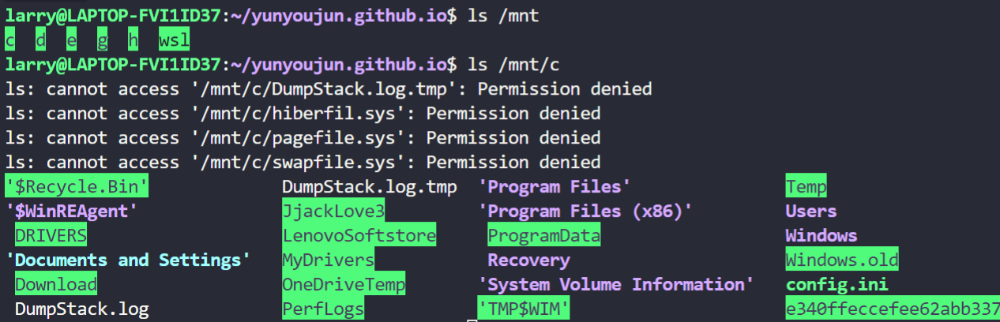

磁盘的角度，读写的最小单位是扇区，但是如果读取文件都以扇区为单位的话，效率将是低下的。因为，扇区的只有512字节，读取较大体积的文件将极大增加IO的次数。

一般，逻辑块的大小为4KB，这样比以扇区为单位读写数据要减少了8倍的IO数量。不过，由于逻辑块是文件系统的最小存储单位，所以，如果存储的文件小于4KB，也必须占用完整的4KB，因此，逻辑块也不是越大越好，太大的话会导致空间利用率下降。

具体的文件系统其实就是datafile表示, volume则可认为是逻辑卷, 文件系统可以跨volume也可以只位于一个volume中。(似乎稍微理解shared_datafile和volume_datafile了)

### EXT系列文件系统

Ext2文件系统已经成为许多服务器和桌面系统的支柱。Ext2文件系统的设计利用与虚拟文件系统非常类似的结构, 因为开发ext2时目标就是要优化与Linux的互操作。

Ext3文件系统仍然与Ext2兼容, 但提供了扩展日志功能等一些数据安全选项。

#### inode与block

块的概念, 可以是面向块的设备, 与设备之间的数据传输以块为单位进行, 不会传输单个字节; 另外ext2也是基于块的文件系统, 它把硬盘划分为长度相同的若干块, 按块管理元数据和文件内容

在磁盘上, 除了启动扇区, 其他区域划分为多个块组装载文件系统。在系统加电启动时, 启动扇区内容由BIOS自动装载并执行, 该区域不可能填充文件系统数据。但一般来说, 整个硬盘除了一小块启动区域都装在上了文件系统。


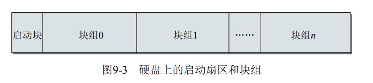

每个块组的内部结构如下, 由一个超级块等组成。事实上同一个文件系统可能跨多个快组, 他们的超级块是一样的, 这为数据安全考虑, 一般只用到第一个副本。
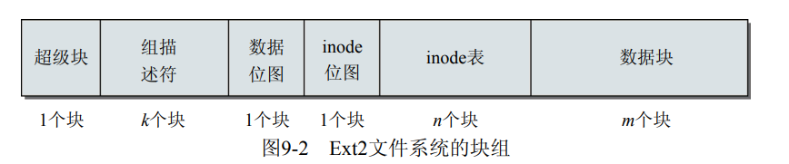

超级块是用于存储文件系统自身元数据的核心结构, 其中的信息包括空闲与已使用块的数目, 块长度, 当前文件系统状态(启动时用于检测前一次崩溃), 各种时间戳(例如上一次装载文件系统的时间和上次写入操作的时间)。还包括一个表示文件系统类型的魔数, 这样mount可以确认文件系统类型是否正确。

组描述符反映了文件系统中各个块组的状态, 例如空闲块和inode的数目。每个块组都包含了文件系统中所有组描述符的信息, 可见组描述符和超级块一样也是冗余的。

数据块位图和inode位图保存长的比特位串, 每个比特位都对应一个数据块或者inode, 用来表示是否空闲

inode表记录块组中所有的inode, inode用来保持文件系统中与各个文件和目录相关的所有元数据

数据块部分包含了文件的有用数据。

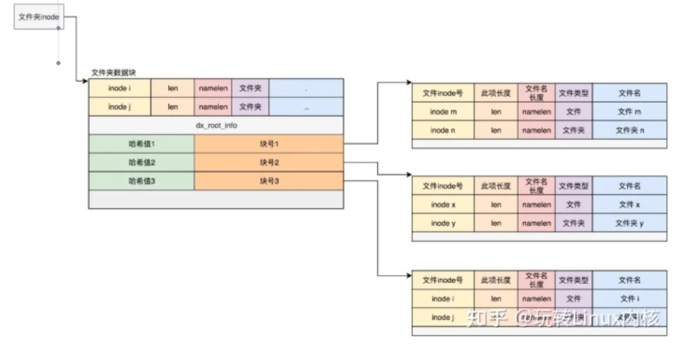

#### indirection 间接

在系统内存中，从内核的角度来看, 内存划分为长度相同的页, 按唯一的页号或地址寻址, 硬盘块也通过编号唯一标识。inode结构中的文件元数据存储数据块的地址, 从而关联到文件内容。

一个问题是, 若文件很大例如若干GB, 块只有4k大小, 这样一个文件需要很多块, inode要储存文件占用所有的block号。单纯存储块号信息都需要inode很大的空间。

方法是使用间接块, 也就是inode不存储文件占的所有数据块号, 只存储间接块号, 间接块再映射到数据块。当然对于小文件, 只需要一两个块那种, 直接将块号存储在inode中就行了。

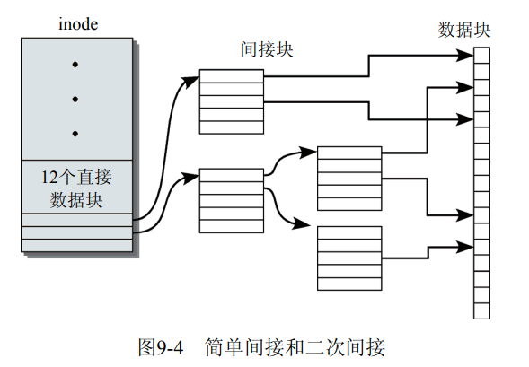

#### 碎片

内存和磁盘存储在块结构管理的相似性, 甚至内存的页和文件系统的block都是相同的大小, 4K。这样许多文件从硬盘的随机位置删除, 又增加了许多新文件, 就会产生碎片。

碎片会导致文件块在硬盘上分散分布, 会增加磁头寻道次数, 降低访问速度。Ext2系统在无法避免碎片时, 会试图将同一个文件的块维持在同一个块组中。

#### 数据结构

超级块super_block
```cpp
struct ext2_super_block {
	__le32	s_inodes_count;		/* Inodes count */
	__le32	s_blocks_count;		/* Blocks count */
	__le32	s_r_blocks_count;	/* Reserved blocks count */
	__le32	s_free_blocks_count;	/* Free blocks count */
	__le32	s_free_inodes_count;	/* Free inodes count */
	__le32	s_first_data_block;	/* First Data Block */
	__le32	s_log_block_size;	/* Block size */
	__le32	s_log_frag_size;	/* Fragment size */
	__le32	s_blocks_per_group;	/* # Blocks per group */
	__le32	s_frags_per_group;	/* # Fragments per group */
	__le32	s_inodes_per_group;	/* # Inodes per group */
	__le32	s_mtime;		/* Mount time */
	__le32	s_wtime;		/* Write time */
	__le16	s_mnt_count;		/* Mount count */
	__le16	s_max_mnt_count;	/* Maximal mount count */
	// 魔数, 标记文件系统类型
	__le16	s_magic;		/* Magic signature */
	__le16	s_state;		/* File system state */
	__le16	s_errors;		/* Behaviour when detecting errors */
```

块组描述符，每个块组都包含一个inode位图和inode表
```cpp
/*
 * Structure of a blocks group descriptor
 */
struct ext2_group_desc
{
	// __le32 基于宏定义__attribute__((bitwise))
	__le32	bg_block_bitmap;		/* Blocks bitmap  位图表示某个block是否正在使用 */
	__le32	bg_inode_bitmap;		/* Inodes bitmap block */
	__le32	bg_inode_table;		/* Inodes table block */
	__le16	bg_free_blocks_count;	/* Free blocks count 空闲块数目 */
	__le16	bg_free_inodes_count;	/* Free inodes count */
	__le16	bg_used_dirs_count;	/* Directories count */
	__le16	bg_pad;
	__le32	bg_reserved[3];
};
```

inode数据保存在inode表中, 值得注意的是i_size显示用户文件大小, 但对于文件洞的文件, 实际不占磁盘空间, i_blocks相当于实际占用磁盘大小

i_size和ls命令显示大小相同，所以这是我们以为的大小，比如我写了一个字符到一个文件，我们会以为这个文件大小为1个字节

i_blocks和du命令显示大小相同，所以这个是我们磁盘存储的实际大小，比如我写了一个字符到一个文件，但实际磁盘占据了一个块（一般是4096byte）大小
```cpp
struct ext2_inode {
	__le16	i_mode;		/* File mode */
	__le16	i_uid;		/* Low 16 bits of Owner Uid */
	__le32	i_size;		/* Size in bytes */
	// 四个时间, 表示访问, 创建, 修改, 删除
	__le32	i_atime;	/* Access time */
	__le32	i_ctime;	/* Creation time */
	__le32	i_mtime;	/* Modification time */
	__le32	i_dtime;	/* Deletion Time */
	__le16	i_gid;		/* Low 16 bits of Group Id */
	__le16	i_links_count;	/* Links count */
	__le32	i_blocks;	/* Blocks count 这里总是假设块长度为512bytes */
	__le32	i_flags;	/* File flags */
	union {
		struct {
			__le32  l_i_reserved1;
		} linux1;
		struct {
			__le32  h_i_translator;
		} hurd1;
		struct {
			__le32  m_i_reserved1;
		} masix1;
	} osd1;				/* OS dependent 1 */
	__le32	i_block[EXT2_N_BLOCKS];/* Pointers to blocks 这个很重要 */
	__le32	i_generation;	/* File version (for NFS) */
	__le32	i_file_acl;	/* File ACL */
	__le32	i_dir_acl;	/* Directory ACL */
	__le32	i_faddr;	/* Fragment address */
	union {
		struct {
			__u8	l_i_frag;	/* Fragment number */
			__u8	l_i_fsize;	/* Fragment size */
			__u16	i_pad1;
			__le16	l_i_uid_high;	/* these 2 fields    */
			__le16	l_i_gid_high;	/* were reserved2[0] */
			__u32	l_i_reserved2;
		} linux2;
		struct {
			__u8	h_i_frag;	/* Fragment number */
			__u8	h_i_fsize;	/* Fragment size */
			__le16	h_i_mode_high;
			__le16	h_i_uid_high;
			__le16	h_i_gid_high;
			__le32	h_i_author;
		} hurd2;
		struct {
			__u8	m_i_frag;	/* Fragment number */
			__u8	m_i_fsize;	/* Fragment size */
			__u16	m_pad1;
			__u32	m_i_reserved2[2];
		} masix2;
	} osd2;				/* OS dependent 2 */
};
```

* 目录和文件

经典unix系统中, 目录只不过是一种特殊的文件, 在ext2中, 每个目录和文件一样也被表示为一个inode, 会对其分配数据块

文件的类型
```cpp
/*
 * Ext2 directory file types.  Only the low 3 bits are used.  The
 * other bits are reserved for now.
 */
enum {
	EXT2_FT_UNKNOWN		= 0,
	EXT2_FT_REG_FILE	= 1,  // 普通文件
	EXT2_FT_DIR		= 2,
	EXT2_FT_CHRDEV		= 3,
	EXT2_FT_BLKDEV		= 4,
	EXT2_FT_FIFO		= 5,
	EXT2_FT_SOCK		= 6,
	EXT2_FT_SYMLINK		= 7,
	EXT2_FT_MAX
};

struct ext2_dir_entry {
	__le32	inode;			/* Inode number 注意区分ext2_inode和这里的inode*/
	__le16	rec_len;		/* Directory entry length */
	__le16	name_len;		/* Name length */
	char	name[EXT2_NAME_LEN];	/* File name */
};
```

注意区分inode号和inode结构的, inode号是一个整数对用户可见, 通过inode号和inode表可以得到inode结构。基于inode结构就可以找到文件内容的物理位置。

#### 与虚拟文件系统

虚拟文件系统和具体文件系统实现关联大体由三个结构建立
1. 用于操作文件内容保存在`file_operations`中
2. 用于操作inode保存在`inode_operations`中
3. 用于一般地址空间操作保存在`address_space_operations`中

Ext2文件系统对不同的文件类型提供了不同的file_operations实例
```cpp
extern const struct file_operations ext2_dir_operations;

/* file.c */
extern int ext2_fsync(struct file *file, int datasync);
extern const struct inode_operations ext2_file_inode_operations;
extern const struct file_operations ext2_file_operations;
extern const struct file_operations ext2_xip_file_operations;

/* inode.c */
extern const struct address_space_operations ext2_aops;
extern const struct address_space_operations ext2_aops_xip;
extern const struct address_space_operations ext2_nobh_aops;

/* namei.c */
extern const struct inode_operations ext2_dir_inode_operations;
extern const struct inode_operations ext2_special_inode_operations;

/* symlink.c */
extern const struct inode_operations ext2_fast_symlink_inode_operations;
extern const struct inode_operations ext2_symlink_inode_operations;

struct file_operations {
	struct module *owner;
	loff_t (*llseek) (struct file *, loff_t, int);
	ssize_t (*read) (struct file *, char __user *, size_t, loff_t *);
	ssize_t (*write) (struct file *, const char __user *, size_t, loff_t *);
	ssize_t (*aio_read) (struct kiocb *, const struct iovec *, unsigned long, loff_t);
	ssize_t (*aio_write) (struct kiocb *, const struct iovec *, unsigned long, loff_t);
	int (*readdir) (struct file *, void *, filldir_t);
	unsigned int (*poll) (struct file *, struct poll_table_struct *);
	long (*unlocked_ioctl) (struct file *, unsigned int, unsigned long);
	long (*compat_ioctl) (struct file *, unsigned int, unsigned long);
	int (*mmap) (struct file *, struct vm_area_struct *)
	...
};

const struct file_operations ext2_file_operations = {
	.llseek		= generic_file_llseek,
	.read		= do_sync_read,
	.write		= do_sync_write,  // 实现方法
	.aio_read	= generic_file_aio_read,
	.aio_write	= generic_file_aio_write,
	.unlocked_ioctl = ext2_ioctl,
	.mmap		= generic_file_mmap,
	.open		= dquot_file_open,
	.release	= ext2_release_file,
	.fsync		= ext2_fsync,
	.splice_read	= generic_file_splice_read,
	.splice_write	= generic_file_splice_write,
};
```

在文件系统装载后, 用户进程调用函数访问文件的内容, 系统调用首先转到VFS层, 然后根据文件类型, 调用底层操作系统的适当例程。

从VFS的角度看, 文件系统的目的在于建立文件内容和相关存储介质对应块上的关联。`ext2_get_block`是一个关键函数, 它将Ext2的实现与虚拟文件系统的默认函数关联起来, 所有希望使用VFS标准函数的文件系统, 都必须定义一个类型为get_block_t的函数。
```cpp
typedef int (get_block_t)(struct inode *inode, sector_t iblock,
			struct buffer_head *bh_result, int create);
typedef void (dio_iodone_t)(struct kiocb *iocb, loff_t offset,
			ssize_t bytes, void *private, int ret,
			bool is_async);
```

总之ext2某种意义上可以看作vfs接口的实现

#### ext3

Ext3的基本思想在于，将对文件系统元数据的每个操作都认为事务。在执行之前要记录到日志中, 如果写失败则应该正确回滚。

日志记录是日志的最小单位, 每个记录表示某个块的记录。


### 无持久存储的文件系统

vfs是linux实现"一切皆文件"的基础, 不只是文件系统, 其他资源例如设备, 监控程序也可通过实现vfs接口被用户如同访问文件那样访问

#### proc

proc文件系统是的内核可以生成与系统状态和配置有关的信息, 用户调用vfs的read接口就会生成信息

/proc/主要文件及内容

1. /proc/$PID 进程信息

以文件的形式查看进程信息
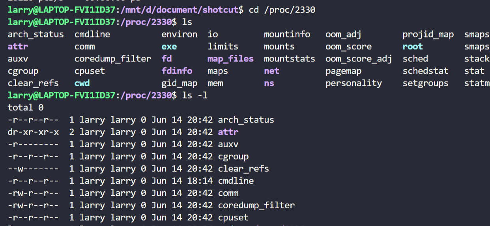

2. /proc/net包含了一些网络信息

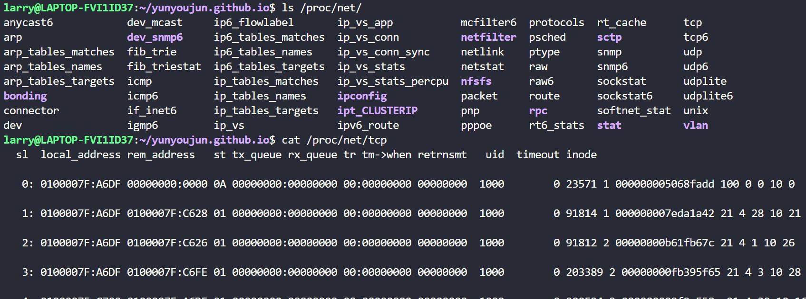


#### sysfs

Sysfs文件系统是一个类似于proc文件系统的特殊文件系统，用于将系统中的设备组织成层次结构，并向用户模式程序提供详细的内核数据结构信息。其实，就是在用户态可以通过对sys文件系统的访问，来看内核态的一些驱动或者设备等。

/sys/devices, 该目录下是全局设备结构体系，包含所有被发现的注册在各种总线上的各种物理设备。

/sys/dev 该目录下有字符设备(block)和块设备(char)两个子目录
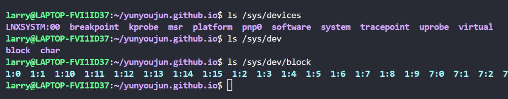