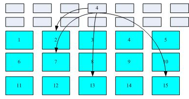
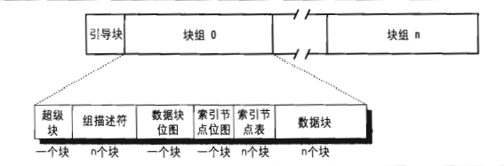
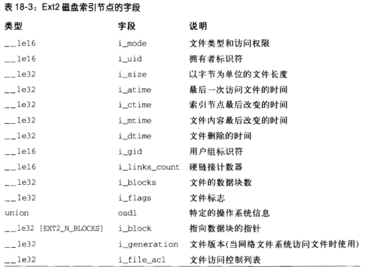
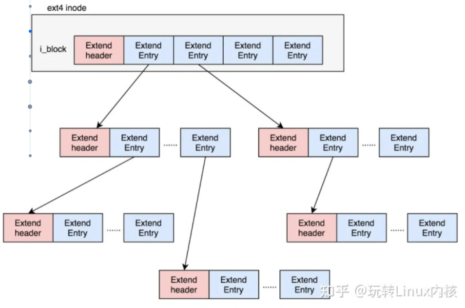
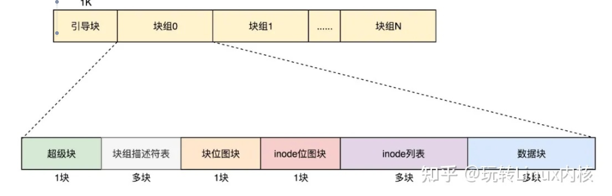
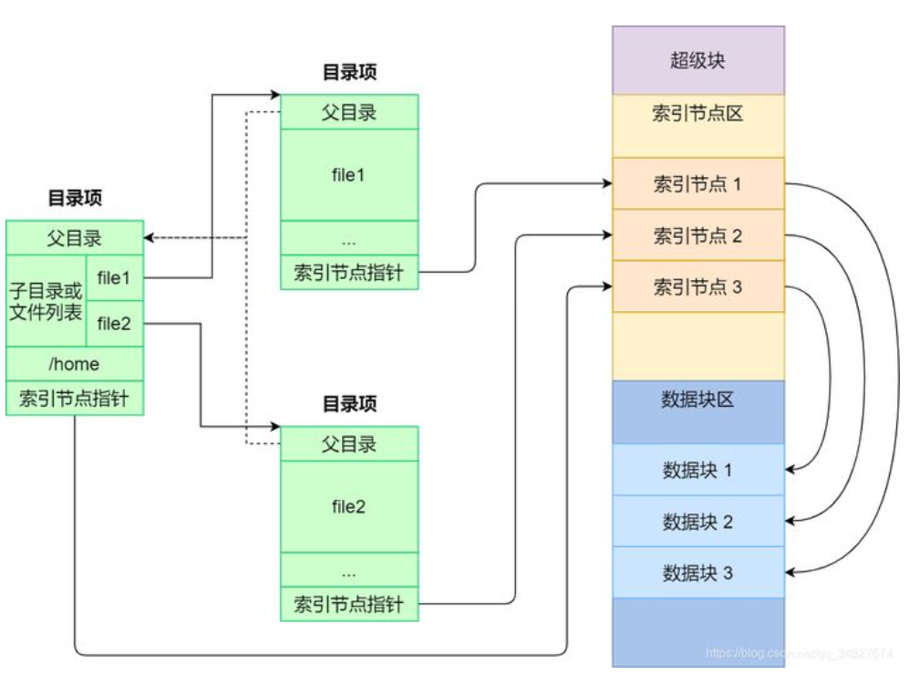

### 文件系统

Unix操作系统的涉及集中反映在其文件系统上。文件系统主要有以下几个概念

#### 文件

Unix文件是以字节序列组成的信息载体(container), 内核控制文件而不包含文件内容。从用户的观点看, 文件被组织在一个树结构的命名空间中, 除了叶节点外, 树的所有节点都表示目录名, 目录节点包含它下面文件及目录的所有信息。


Unix的每个进程都有一个当前工作目录, 它属于进程执行上下文(execution context), 标识出进程所用的当前目录。为了标识特定的文件, 进程使用路径名。如果路径名第一个字符是/, 则是绝对路径; 反之则是相对路径, 相对路径起点是进程的当前目录。

#### 硬链接和软链接

包含在目录中的文件名就是一个文件的硬链接(hard link), 通过命令`ln P1 P2`, 硬链接有两个限制。

不允许给目录创建硬链接, 因为这可能把目录树变为环形树, 从而不可能通过名字定位文件

只有同一文件系统的文件之间才可以创建链接, 这就带来比较大的限制

为了克服以上限制, 引入了软链接(soft link)也称符号链接(symbolic link)。符号链接是段文件, 这些文件包含另一个文件的路径名, 通过`ln -s P1 P2`。

#### 文件类型

Unix的文件可以是下列类型之一

普通文件; 目录; 符号链接; 

面向块的设备文件(block-oriented device file); 面向字符的设备文件(character-oriented device file); 

管道(pipe)和命名管道(named pipe); 套接字(socket)

前三种文件类型是基本类型, 设备文件与I/O设备以及集成到内核中的设备驱动程序相关。管道和套接字是用于进程间通信的特殊文件。

#### 文件描述符与索引节点

Unix对文件的内容描述文件的信息给出了清楚的区分, 除了设备文件和特殊文件系统外, 每个字符都由字符序列组成。文件内容不含任何控制信息, 如文件长度或文件结束符(end-of-file, EOF)

文件系统处理文件需要的所有信息包含在一个名为索引节点(inode)的数据结构中, 每个文件都有自己的索引节点, 文件系统用索引节点来标识文件。索引节点必须提供POSIX标准中指定的如下属性

1. 文件类型
2. 与文件相关的硬链接个数
3. 以字节为单位的文件长度
4. 设备标识符(包含文件的设备)
5. 文件系统中标识文件的索引节点号
6. 文件的拥有者UID
7. 文件的用户组ID
8. 几个时间戳, 表示索引节点状态改变的时间, 最后访问时间,最后修改时间
9. 访问权限和文件模式

#### 访问权限和文件模式

文件的潜在用户分为三种类型
* 文件所有者
* 同组用户，不包括文件所有者
* 所有剩下的用户

有三种类型的访问权限, 读, 写, 执行，因此文件访问权限的组合用九种不同的二进制标记。

此外还有三种附加的标记, suid(set user id), sgid(set group id), sticky来定义文件的模式。当这三种标记应用到可执行文件时, suid使执行文件的进程获得文件拥有者的uid; sgid使执行可执行文件的进程获得文件用户组的id; sticky标记的可执行文件相当于向内核发出一个请求，当程序执行结束以后仍然将文件保存在内存(不常用)

当文件由一个进程创建时, 文件所有者者ID就是进程的UID, 而文件用户组id可以使进程创建者的ID, 也可以是父目录的id, 这取决于sgid标志位。

#### 文件操作的系统调用

当用户访问一个普通文件或目录文件的内容时, 他实际上是访问存储在硬件设备上的一些数据, 文件系统可以看作硬盘分区物理组织的用户试图。因为处于用户态的进程不能直接与底层硬件交互, 所以每个实际的文件操作必须在内核态下完成。

* 打开文件

进程只能访问打开的文件, 打开一个文件执行系统调用
```cpp
fd = open(path, flag, mode)
path是文件的相对或绝对路径
flag指定文件打开的方式, 例如读, 写, 读/写, 追加), 它也指定是否应当创建一个不存在的文件
mode 指定新创建文件的访问权限
```

这个系统调用将创建一个描述打开文件的对象, 返回文件描述符(file descriptor), 一个打开文件对象包括
* 文件操作的一些数据结构, 如指定文件打开方式的一组标志; 表示文件当前位置的offset字段,文件指针等
* 进程可以调用的一些内核函数指针, 这组允许调用的函数集合由flag参数决定

文件描述符表示进程与打开文件的交互, 而打开文件对象包含了于这种交互相关的数据。同一打开文件对象可以由同一个进程的几个文件描述符标识。

几个进程也许同时打开同一文件, 这种情况下文件系统给每个文件分片一个单独的打开文件对象以及单独的文件描述符。这种情况发生时，Unix文件系统对进程在同一文件发出的I/O操作之间不提供任何形式的同步进程。

* 访问打开的文件

对普通Unix文件, 可以顺序地访问, 也可以随机地访问, 而对设备文件和管道文件往往只能顺序访问。这两种访问方式中，内核把文件指针存放在打开文件对象中，从而使当前位置就是下一次进程读写的位置(多线程处理文件只需要保证文件指针的线程安全)。

顺序访问时文件地默认访问方式, 即read()和write()系统调用总是从文件指针的当前位置开始读或写。为了修改文件指针的值, 必须在程序中显式地调用lseek()系统调用。当打开文件时, 内核让文件指针指向文件地第一个字节(偏移量为0)
```cpp
newoffset=lseek(fd, offset, whence);
fd 打开文件地fd
offset, 指定一个有符号整数值, 用来计算文件指针的新位置
whence, 指定文件指针新位置的计算方式, 可以是offset+0表示文件指针从头移动, 或者offset+当前位置表示从当前位置移动, 还可以是文件最后一个字节位置, 表示从末尾移动
```

```cpp
nread = read(fd, buf, count);
buf表示进程地址空间(用户空间)中缓存区的地址, 所读的数据自动放到这个缓冲区
count表示所读的字节数

内核会自动尝试从fd文件中读count个字节,起始位置是打开文件offset字段的当前值。某些情况下可能遇到EOF, 因此内核可能无法读出count个字节,返回的nread是实际读的字节

write()参数和read类似
```

* 关闭文件

调用
```cpp
res=close(fd)
```
将释放与文件描述符对应的打开文件对象, 当一个进程终止时, 内核会关闭所有其仍然打开的文件。

### 虚拟文件系统
虚拟文件系统(Virtual Filesystem), 用来处于与Unix标准文件系统相关的所有系统调用。通用文件模型由下列对象类型组成
1. 超级块对象(superblock object), 存放已安装文件系统的有关信息, 通常对应于磁盘上的文件系统控制块(filesystem control block)
2. 索引节点对象(inode object), 存放关于具体文件的一般信息, 通常对应于磁盘上的文件控制块file control block。每个索引节点对象都有一个索引节点号，这个节点号唯一标识文件系统的文件
3. 文件对象(file object), 存放打开文件与进程之间交互的有关信息, 这类信息仅当进程访问文件期间存放于内核内存中。
4. 目录项对象(dentry object), 存放目录项与对应文件链接的有关信息。

最近最常使用的目录项对象被放在目录项高速缓存(dentry cache)的磁盘高速缓冲中, 加速从文件路径名到最后一个路径分量索引节点的转换过程。


#### 文件对象

文件对象描述进程怎样与一个打开的文件进行交互, 文件对象是在文件被打开时创建的。存放在文件对象中的主要信息是文件指针, 即文件当前的位置, 下一个操作将在该位置发生。由于几个进程可能同时访问同一文件, 因此文件指针必须放在文件对象而不是索引节点中。

DA


每个进程都有它自己当前的工作目录和它自己的根目录, 其中进程的files_struct结构用来表示进程当前打开的文件, 表的地址存放于进程描述符的files字段。


fd字段指向文件对象的指针数组, 而数组的索引就是我们将的文件描述符。通常数组的前三个元素(索引分别为0,1,2)为进程的标准输入文件, 标准输出文件, 标准错误文件。


进程不能使用多于NR_OPEN(通常104 8576)个文件描述符, 并且内核也在进程描述符的`signal->rlim[RLIMIT_NOFILE]`强制限制动态文件描述符的最大值, 这个值通常为1024但可以修改。

狭义的文件系统是进程的文件系统。每个进程可拥有自己的已安装文件系统树, 叫做进程的命名空间(namespace).通常大多数进程共享同一个命名空间, 即位于系统的跟文件系统且被init进程使用的已安装文件系统树。当然可以安装进程的文件系统, 使进程可以独享资源(除cpu外的一切资源皆文件), 这就是容器的原理。

当进程根据路径名查找文件时, 如果路径名第一个字符是'/'. 那这个路径名是绝对路径, 将从进程的根目录开始搜索; 否则该路径就是相对路径, 从进程的当前目录开始搜索。虚拟文件系统可以找到目标索引节点和文件对象。而进一步操作文件是将文件看成细分数据页(每页4kb), 读写缓存中的页, 将这些缓冲页标记为脏, 最后再刷入磁盘。

#### I/O设备

所有计算机都拥有一条系统总线, 它连接大部分内部硬件设备。一种典型的系统总线是PCI(Peripheral Component Interconnect), 除此之外还有ISA, SCSI, USB等。这几种不同的总线通过桥的硬件设备连接在一起。前端总线将CPU连接到RAM控制器, 后端总线将CPU直接连接到外部硬件的高速缓存上。

CPU和I/O设备中的数据通路称为I/O总线, 每个I/O设备都有自己的I/O地址集, 通常称为I/O端口， I/O端口可用于数据读写。I/O接口和控制器连接在一起, 将I/O端口的值转换成设备控制所需要的命令和数据。常用的I/O接口包括键盘接口, 图形接口, 磁盘接口, 鼠标接口, 网络接口。

设备控制器通过I/O接口从微处理器接收诸如写地址为XXX数据块的命令, 将其转换为诸如"把磁头定位在正确的磁道上", "把数据写入磁道"的磁盘操作, 设备控制器往往相当复杂。

如果一个进程在某个磁盘文件上发出一个read()系统调用

1. read()系统调用的服务例程调用适当的VFS函数, 将文件描述符和偏移量传给它, VFS提供了通用的文件模型
2. VFS确定请求的数据是否存在, 是否需要访问磁盘的数据还是缓存读取
3. 如果需访问磁盘数据, 就需要确定数据的物理位置。首先内核确定该文件所在文件系统的块大小, 请求数据所在的块号。然后映射层调用具体文件系统的函数, 它访问文件的磁盘节点, 根据逻辑块号确定所请求数据在磁盘上的位置
4. 内核对块设备发出读请求, 块设备驱动程序向磁盘控制器的硬件接口发出适当的命令, 引起数据传送

其中硬件块设备控制器采用扇区的固定长度的块的传送数据, I/O调度程序和块设备驱动程序必须管理扇区。

虚拟文件系统，映射层，文件系统将磁盘数据存放在称为块的逻辑单元中, 一个块是文件系统最小的磁盘存储单元。而磁盘缓存作用于磁盘数据的页单元(内存的页框同样大小)。


磁盘读取并不费时, 而磁道的寻址是相当费时的。因此只要可能，内核就试图把几个扇区合并在一起作为整体处理, 减少磁头平均移动时间。因此这里执行会延迟, 不是请求一发生内核就满足它。每个块设备驱动程序都维持着自己的请求队列, 它包含设备待处理的请求链表。为了防止块设备驱动程序被挂起, 每个I/O操作都是异步处理的, 当I/O操作终止时, 磁盘控制器会产生一个中断提醒处理已完成(很像一般的异步编程)。

I/O调度程序会通过扇区将请求队列排序，这样顺序的从请求链表拿走要处理的请求会大大减少I/O次数, 因为磁头寻找是由内而外或由外而内顺序寻道而不是跳跃, 这种根据请求扇区的位置排序的算法也称为电梯算法(因为磁头比较像电梯一层一层的来回移动)。

#### 文件系统

磁盘分区完毕后还需要进行格式化（format）, 格式化就是设置文件系统的元数据使成为文件的组织形式。文件系统主要由三部分组成,  权限与属性等元素据放置到 inode 中，实际数据则放置到 data block 区块中。 另外，还有一个超级区块 （superblock） 会记录整个文件系统的整体信息，包括 inode 与 block 的总量、使用量、剩余量等。这样在寻找文件时, 只需要找到文件索引节点inode就可以找到对应的数据区块。

根据inode可以找到存放文件的一些data block(可能不唯一)


linux ext2文件系统的组织结构


ext2支持的文件类型
```
0  未知
1  普通文件
2  目录
3  字符设备
4  块设备
5  命名管道
6  套接字
7  符号链接
```

Ext3以特殊的文件实现了目录, 这种文件的数据块把文件名和目录下文件的索引节点号存放在了一起。设备文件，管道，套接字不需要数据块，必要信息都存放在索引节点中。索引节点表由一连串连续的块组成, 所有索引节点的大小相同均为128字节, 1个4k的块能存放32个索引节点。一个索引节点表征一个文件(可见索引节点很多), 索引节点包含指向数据块的指针。而文件路径的作用就是寻找到索引节点的位置。



从索引节点映射到数据块的地址就逐渐到虚拟内存换页的逻辑。linux 进程调用read()读文件的基本流程

1. 进程调用库函数向内核发起读文件请求; 内核通过检查进程的文件描述符定位到虚拟文件系统的已打开文件列表表项; 调用该文件可用的系统调用函数read()

2. read()函数通过文件表项链接到目录项模块，根据传入的文件路径，在目录项模块中检索，找到该文件的inode; 在inode中，通过文件内容偏移量计算出要读取的页(位于数据块; 通过inode找到文件对应的address_space；
3. 在address_space中访问该文件的页缓存树，查找对应的页缓存结点：如果页缓存命中，那么直接返回文件内容(如果其他进程在写要上锁等待)；如果页缓存缺失，那么产生一个页缺失异常，创建一个页缓存页，**同时通过inode找到文件该页的磁盘地址**，读取相应的页填充该缓存页；重新进行第6步查找页缓存；
4. 文件内容读取成功。

write()写文件步骤, 前2步和读文件一致，

3. 在address_space中查询对应页的页缓存是否存在：如果页缓存命中，直接把文件内容修改更新在页缓存的页中。写文件就结束了。这时候文件修改位于页缓存，并没有写回到磁盘文件中去。

4. 如果页缓存缺失，那么产生一个页缺失异常，创建一个页缓存页，同时通过inode找到文件该页的磁盘地址，读取相应的页填充该缓存页。以上中断处理执行完, 进程苏醒, 此时缓存页命中.

一个页缓存中的页如果被修改，那么会被标记成脏页。脏页需要写回到磁盘中的文件块。有两种方式可以把脏页写回磁盘：
1. 手动调用sync()或者fsync()系统调用把脏页写回
2. pdflush进程会定时把脏页写回到磁盘

### EXT系列文件系统

#### inode与块

硬盘被分成大小相同的单元，我们称为块(Block)。一块的大小是扇区大小(512字节)的整数倍，默认是4K。

inode结构, 包括文件的读写权限i_mode，属于哪个用户i_uid，哪个组i_gid，大小是多少i_size_io，占用多少个块i_blocks_io，i_atime是access time，是最近一次访问文件的时间；i_ctime是change time，是最近一次更改inode的时间；i_mtime是modify time，是最近一次更改文件的时间等
```cpp

struct ext4_inode {
    __le16  i_mode;     /* File mode */
    __le16  i_uid;      /* Low 16 bits of Owner Uid */
    __le32  i_size_lo;  /* Size in bytes */
    __le32  i_atime;    /* Access time */
    __le32  i_ctime;    /* Inode Change time */
    __le32  i_mtime;    /* Modification time */
    __le32  i_dtime;    /* Deletion Time */
    __le16  i_gid;      /* Low 16 bits of Group Id */
    __le16  i_links_count;  /* Links count */
    __le32  i_blocks_lo;    /* Blocks count */
    __le32  i_flags;    /* File flags */
......
    __le32  i_block[EXT4_N_BLOCKS];/* Pointers to blocks */
    __le32  i_generation;   /* File version (for NFS) */
    __le32  i_file_acl_lo;  /* File ACL */
    __le32  i_size_high;
......
};
```


所有文件保存在i_block里面。具体保存规则由EXT4_N_BLOCKS决定，EXT4_N_BLOCKS有如下的定义, 其中前12项直接保存了块的位置。如果一个文件比较大，12块放不下, 可以让i_block[12]指向一个新的块继续存放文件。里面有一个非常显著的问题，对于大文件来讲，我们要多次读取硬盘才能找到相应的块，这样访问速度就会比较慢。为了解决这个问题，ext4做了一定的改变。它引入Extents来存放大文件
```cpp
#define    EXT4_NDIR_BLOCKS        12
#define    EXT4_IND_BLOCK          EXT4_NDIR_BLOCKS
#define    EXT4_DIND_BLOCK         (EXT4_IND_BLOCK + 1)
#define    EXT4_TIND_BLOCK         (EXT4_DIND_BLOCK + 1)
#define    EXT4_N_BLOCKS           (EXT4_TIND_BLOCK + 1)
```

Extents是一个树状结构, 每个i_block由ext4_extent_header和4项ext4_extent构成, 每个extent可保存128MB。如果文件比较大，4个extent放不下，就要分裂成为一棵树，eh_depth>0的节点就是索引节点，其中根节点深度最大，在inode中。最底层eh_depth=0的是叶子节点。需要注意, inode是用来保存文件的



ext4_extent_header可以用来描述某个节点
```cpp
struct ext4_extent_header {
    __le16  eh_magic;   /* probably will support different formats */
    __le16  eh_entries; /* number of valid entries */
    __le16  eh_max;     /* capacity of store in entries */
    __le16  eh_depth;   /* has tree real underlying blocks? */
    __le32  eh_generation;  /* generation of the tree */
};
```

eh_entries表示这个节点里面有多少项。这里的项分两种，如果是叶子节点，这一项会直接指向硬盘上的连续块的地址，我们称为数据节点ext4_extent；如果是分支节点，这一项会指向下一层的分支节点或者叶子节点，我们称为索引节点ext4_extent_idx。这两种类型的项的大小都是12个byte。

```cpp
/*
 * This is the extent on-disk structure.
 * It's used at the bottom of the tree.
 */
struct ext4_extent {
    __le32  ee_block;   /* first logical block extent covers */
    __le16  ee_len;     /* number of blocks covered by extent */
    __le16  ee_start_hi;    /* high 16 bits of physical block */
    __le32  ee_start_lo;    /* low 32 bits of physical block */
};
/*
 * This is index on-disk structure.
 * It's used at all the levels except the bottom.
 */
struct ext4_extent_idx {
    __le32  ei_block;   /* index covers logical blocks from 'block' */
    __le32  ei_leaf_lo; /* pointer to the physical block of the next *
                 * level. leaf or next index could be there */
    __le16  ei_leaf_hi; /* high 16 bits of physical block */
    __u16   ei_unused;
};
```

Ext使用位图表示磁盘盘块的使用情况, inode的位图大小为4k，每一位对应一个inode。如果是1，表示这个inode已经被用了；如果是0，则表示没被用。block的位图同理。

#### 文件系统的格式

一个个块组，就基本构成了我们整个文件系统的结构。因为块组有多个，块组描述符也同样组成一个列表，我们把这些称为块组描述符表。还需要有一个数据结构，对整个文件系统的情况进行描述，这个就是超级块ext4_super_block。里面有整个文件系统一共有多少inode，s_inodes_count；一共有多少块，s_blocks_count_lo，每个块组有多少inode，s_inodes_per_group，每个块组有多少块，s_blocks_per_group等。这些都是这类的全局信息。



目录本身也是文件，也有inode。inode里面也是指向一些块。和普通文件不同的是，普通文件的块里面保存的是文件数据，而目录文件的块里面保存的是目录里面一项一项的文件信息。这些信息我们称为ext4_dir_entry。

如果在inode中设置EXT4_INDEX_FL标志，那么就表示根据索引查找文件。索引项会维护一个文件名的哈希值和数据块的一个映射关系。


