### ceph架构

A Ceph Storage Cluster requires at least one Ceph Monitor, Ceph Manager, and Ceph OSD (Object Storage Daemon). Ceph的架构以中间件Ceph Storge Cluster为界, 上层面向具体应用接口, 下层是存储引擎 即 RADOS. RADOS是一种Object Store。 https://docs.ceph.com/en/latest/rados/

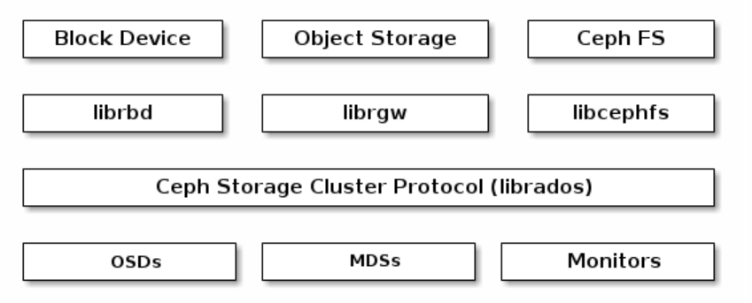

Monitors: A Ceph Monitor (ceph-mon) maintains maps of the cluster state, including the monitor map, manager map, the OSD map, the MDS map, and the CRUSH map. These maps are critical cluster state required for Ceph daemons to coordinate with each other. Monitors are also responsible for managing authentication between daemons and clients. At least three monitors are normally required for redundancy and high availability. Monitors维护到cluster state的映射, 这些映射使Ceph daemon可以与其他daemon协调状态

Managers: A Ceph Manager daemon (ceph-mgr) is responsible for keeping track of runtime metrics and the current state of the Ceph cluster, including storage utilization, current performance metrics, and system load. 

Ceph OSDs: A Ceph OSD (object storage daemon, ceph-osd) stores data, handles data replication, recovery, rebalancing, and provides some monitoring information to Ceph Monitors and Managers by checking other Ceph OSD Daemons for a heartbeat. At least 3 Ceph OSDs are normally required for redundancy and high availability.

MDSs: A Ceph Metadata Server (MDS, ceph-mds) stores metadata on behalf of the Ceph File System (i.e., **MDSs provide POSIX metadata for objects in the RADOS object store** Ceph Block Devices and Ceph Object Storage do not use MDS). Ceph Metadata Servers allow POSIX file system users to execute basic commands (like ls, find, etc.) without placing an enormous burden on the Ceph Storage Cluster.

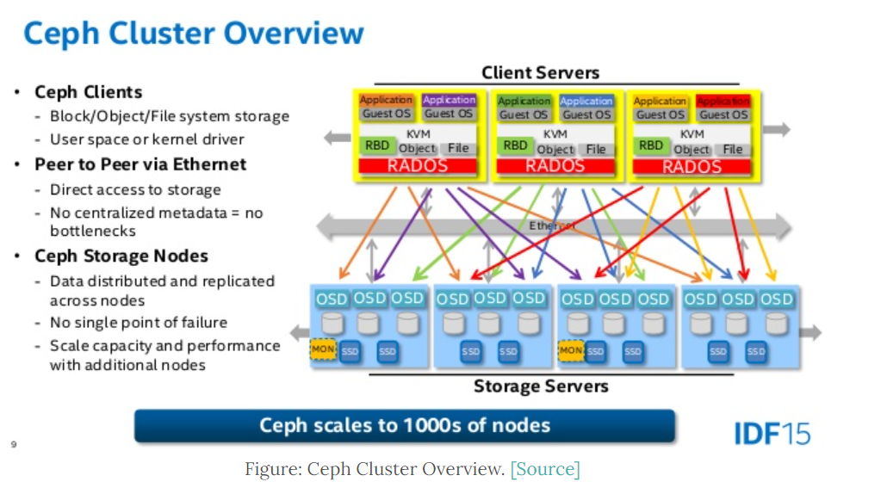
client server维护了外界的文件, 块, 对象接口, 并通过网络与存储的数据OSD结构交互。Ceph client可以通过四种接口访问存储引擎, 分别是libRADOS, RADOSGW (object storage), RBD (block storage), or CephFS (file storage).

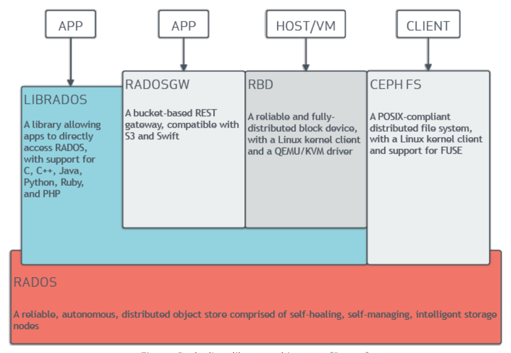

<!-- more -->

#### 总览

Ceph uniquely delivers object, block, and file storage in one unified system. Ceph is highly reliable, easy to manage, and free. A Ceph Storage Cluster consists of multiple types of daemons: 1. Ceph Monitor 2. Ceph OSD Daemon 3. Ceph Manager 4. Ceph Metadata Server 核心组件即Monitor, OSD, Manager, Metadata Server

Ceph Monitor通过监视保证了高可用, OSD Daemon定期检查状态并报告给Monitor, Ceph Metadata Server存储了系统的元数据。client和daemon使用CRUSH algorithm搞笑获得数据的位置信息  Ceph eliminates the centralized gateway to enable clients to interact with Ceph OSD Daemons directly. Ceph OSD Daemons create object replicas on other Ceph Nodes to ensure data safety and high availability. Ceph also uses a cluster of monitors to ensure high availability. To eliminate centralization, Ceph uses an algorithm called CRUSH. Ceph使用分布式网关使client直接和OSD Daemons交互, OSD Daemons创建了对象副本和监听来保证高可用性, 同时使用CRUSH算法去中心化。

For added reliability and fault tolerance, Ceph supports a cluster of monitors. In a cluster of monitors, latency and other faults can cause one or more monitors to fall behind the current state of the cluster. For this reason, Ceph must have agreement among various monitor instances regarding the state of the cluster. Ceph always uses a majority of monitors (e.g., 1, 2:3, 3:5, 4:6, etc.) and the Paxos algorithm to establish a consensus among the monitors about the current state of the cluster. Ceph的监听monitors结构需要保持一致性， 因此用Paxos algorithm来协调一致性。它使用一些map来记录系统的状态, monitor map, manager map, the OSD map, and the CRUSH map

1. The Monitor Map: Contains the cluster fsid, the position, name address and port of each monitor. It also indicates the current epoch, when the map was created, and the last time it changed. 监控信息

2. The OSD Map: Contains the cluster fsid, when the map was created and last modified, a list of pools, replica sizes, PG numbers, a list of OSDs and their status OSD存储信息

3. The PG Map: Contains the PG version, its time stamp, the last OSD map epoch, the full ratios, and details on each placement group such as the PG ID, the Up Set, the Acting Set, the state of the PG Placement group信息
4. The CRUSH Map: Contains a list of storage devices, the failure domain hierarchy (e.g., device, host, rack, row, room, etc.), and rules for traversing the hierarchy when storing data. CRUSH算法节点选取信息

5. The MDS Map: Contains the current MDS map epoch, when the map was created, and the last time it changed. It also contains the pool for storing metadata, a list of metadata servers, and which metadata servers are up and in. 元数据存储信息

In many clustered architectures, the primary purpose of cluster membership is so that a centralized interface knows which nodes it can access. Then the centralized interface provides services to the client through a double dispatch–which is a huge bottleneck at the petabyte-to-exabyte scale. 大多数簇的架构中往往中心节点向客户提供服务, 这个中心节点是巨大的瓶颈。Ceph eliminates the bottleneck: Ceph’s OSD Daemons AND Ceph Clients are cluster aware. Like Ceph clients, each Ceph OSD Daemon knows about other Ceph OSD Daemons in the cluster. This enables Ceph OSD Daemons to interact directly with other Ceph OSD Daemons and Ceph Monitors. Additionally, it enables Ceph Clients to interact directly with Ceph OSD Daemons. Ceph克服这种瓶颈, 每个OSD Daemon都知道其他OSD Daemon的状态,通过和OSD daemon和monitor的通信(monitor记录相关的状态)。 因此这些OSD Daemon每一个都可以和client直接交互. ceph数据的读写通过client和OSD的交互进行。

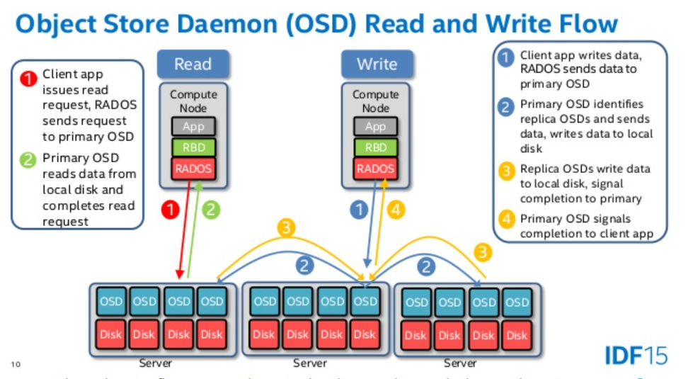

OSD由存储引擎组成, 一种是Filestore, In filestore, objects are written to a file system (xfs, ext4, btrfs). 另一种存储引擎是Bluestore, 后者直接将数据写入到块设备, 元数据存放在RockDB中, 效率更高

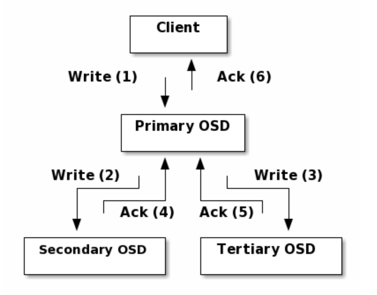

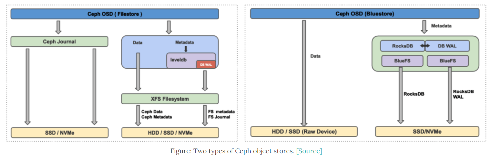

#### DYNAMIC CLUSTER MANAGEMENT 动态节点管理

The Ceph storage system supports the notion of 'Pools', which are logical partitions for storing objects. Ceph Clients retrieve a Cluster Map from a Ceph Monitor, and write objects to pools. Pool是逻辑上存储数据和分片的单位, Pool可以包括若干OSD。When you first deploy a cluster without creating a pool, Ceph uses the default pools for storing data. 

引入pool和Placement Group之后的RADOS架构图

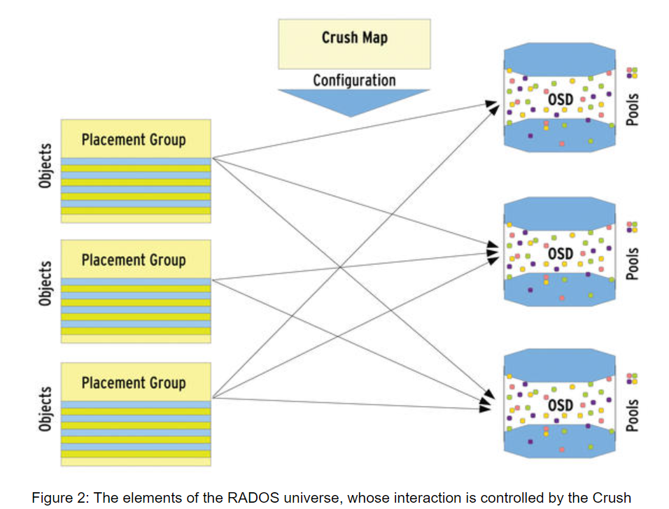

Each pool has a number of placement groups. CRUSH maps PGs to OSDs dynamically. When a Ceph Client stores objects, CRUSH will map each object to a placement group. 每个pool具有若干PGs, CPUSH将PGs动态和OSDs映射 CRUSH algorithm maps each object to a placement group and then maps each placement group to one or more Ceph OSD Daemons. This layer of indirection allows Ceph to rebalance dynamically when new Ceph OSD Daemons and the underlying OSD devices come online.  当新的OSDdaemon和OSD 设备(存储设备)上线时可以动态映射， client可以通过pool name和objectID得到存储的值, 怎么得到呢, 这是CRUSH算法的范围

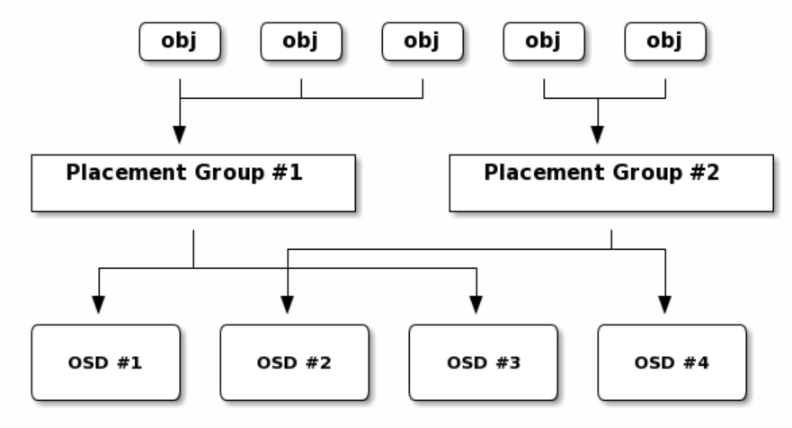

1. The client inputs the pool name and the object ID. (e.g., pool = “liverpool” and object-id = “john”)
2. Ceph takes the object ID and hashes it.
3. Ceph calculates the hash modulo the number of PGs. (e.g., 58) to get a PG ID.
4. Ceph gets the pool ID given the pool name (e.g., “liverpool” = 4)
5. Ceph prepends the pool ID to the PG ID (e.g., 4.58).

Computing object locations is much faster than performing object location query over a chatty session. 基于用输入的poolname和objectId计算位置比通过输入的path定位要快速的多

When you add a Ceph OSD Daemon to a Ceph Storage Cluster, the cluster map gets updated with the new OSD. Referring back to Calculating PG IDs, this changes the cluster map. Consequently, it changes object placement, because it changes an input for the calculations. 当增加新的 OSD Daemon到cluster时, cluster map需要被更新, 同时更改了object的放置位置

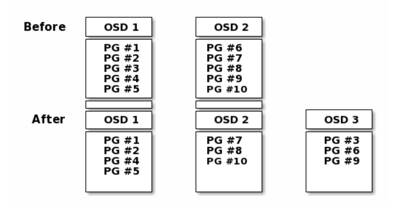

#### CRUSH算法

论文: https://ceph.com/assets/pdfs/weil-crush-sc06.pdf ,是2006年的

同时参考: https://www.dovefi.com/post/

分布式存储系统中，数据的位置存放规则一直是研究的热门话题之一。一般来说，系统中所有角色（Clients、Servers）需要有一个统一的数据寻址算法Locator，满足
```
Locator(ID) -> [Device_1, Device_2, Device_3, ...]
```

其中输入ID是数据的唯一标识符，输出Device列表是一系列存储设备(多设备冗余以达到多份数据保护或切分提高并发等效果)。早期的直观方案是维护一张全局的Key-Value表，任何角色操作数据时查询该表即可。显然，随着数据量的增多和集群规模的扩大，要在整个系统中维护这么一张不断扩大的表变得越来越困难。

**CRUSH规定了某数据应该用何种OSD存储, 具体是用一系列规则确定**

CRUSH(Controlled Replication Under Scalable Hashing)即为解决此问题而生，她仅需要一份描述集群物理架构的信息和预定义的规则（均包含在CRUSH map中），便可实现确定数据存储位置的功能。在Ceph的RADOS中，还引入了PG的概念用以更好地管理数据。ceph将所有要存储的数据看作是object, object的唯一标识符会先通过简单的Hash算法归到一个PG中，PGID再作为入参通过CRUSH计算将object置入到多个OSD中。论文对CRUSH的总结为 a scalable pseudorandom data distribution function designed for distributed
object-based storage systems that efficiently maps data objects to storage devices without relying on a central directory. 同时CRUSH算法可以灵活应对系统容量的伸缩 Because large systems are inherently dynamic, CRUSH is designed to facilitate the addition and removal of storage while minimizing unnecessary data movement. 所谓的OSD, 也就是 object-based storage devices

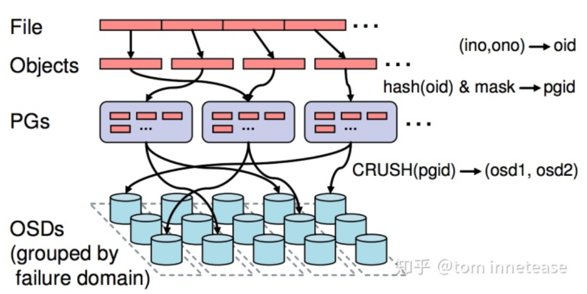

* 层次结构

The CRUSH map contains at least one hierarchy of nodes and leaves. The nodes of a hierarchy—​called "buckets". Each leaf of the hierarchy consists essentially of one of the storage devices. A CRUSH map also has a list of rules that tell CRUSH how it should store and retrieve data. CRUSH map是一个层次结构, 即OSD本身也组成了一个层次结构。层次结构的每个节点称为bucket, 每个叶子节点表示存储设备, 同时可以制定一些规则。由于层次结构, 每个OSD由于所处的父节点不同, 层级不同, 也就不同。

* 分配数据

The CRUSH algorithm distributes data objects among storage devices according to a per-device weight value, approximating a uniform probability distribution. 此外CRUSH可以制定存储策略, 例如，将热数据存放于SSD中，而将冷数据放在HDD中(不同类型的存储设备OSD可以抽象为不同层级的OSD)。称为placement rule, 一般如下

```
rule <rulename> {
    ruleset <ruleset>
    type [replicated|erasure]
    min_size <min-size>
    max_size <max-size>
    step take <bucket-name>
    step select [choose|chooseleaf] [firstn|indep] <num> type <bucket-type>
    step emit
}

/*
ruleset : 相当于rule的id
type : 存储池pool的类型，是副本还是纠删码
min_size : 如果副本数小于这个数值，就不会应用这条rule
max_size : 如果副本数大于这个数值，就不会应用这条rule
step take : crush规则的入口，一般是类型为root的bucket
step select : 分为choose 和chooseleaf两种， num 代表选择的数量，bucket-type是预期的bucket类型
step emit : 代表从take开始到这个操作结束。
*/
```

select是最重要的一条, 它主要是两个参数。num : 是期望选择的数量，如果是0 代表选择 repnum （副本数, 一般为3） 个，如果是负数， 代表选择 |repnum - num| 个, 如果是正数则是实际的数量。另一个type是bucket的类型, bucket组成的层次结构对应于实际存储中"数据中心->机架->主机->磁盘" 这样的层级拓扑

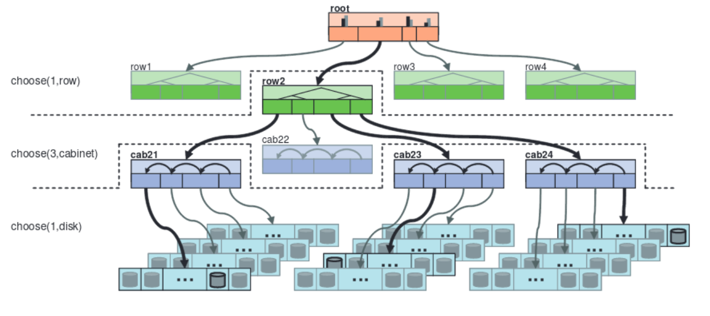

可以写成crush rule
```
rule replicated_rule1 {
    ruleset 0
    type replicated
    min_size 1
    max_size 10
    // 以下表示检索层级为先找到一个row, 在找到下辖的三个cabint, 最后再是osd
    step take root
    step choose firstn 1 type row
    step choose firstn 3 type cabinet
    step choose firstn 1 type osd
    step emit
}
    
或者
    
rule replicated_rule1 {
    ruleset 0
    type replicated
    min_size 1
    max_size 10
    step take root
    step choose firstn 1 type row
    step chooseleaf firstn 3 type cabinet 
    step emit
}

/*
chooseleaf firstn type 等价于 choose firstn type + step choose firstn 1 type osd
*/
```

例子, 集群总共三台主机，其中一台为纯ssd主机，另外两台为HDD主机，要求主副本分布在ssd 上，其他副本分布在hdd上。cursh map 结构如下图所示

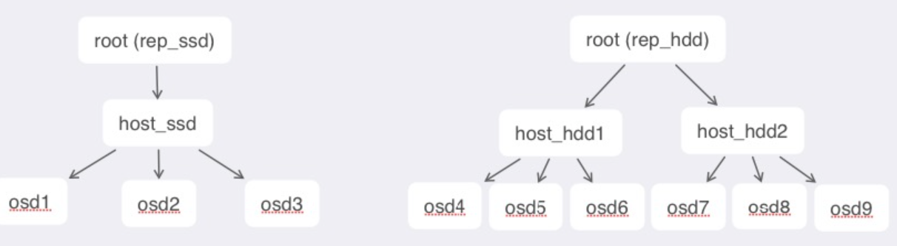

crush rule 为

```
rule ssd_primary {
    ruleset 1
    type replicated
    min_size 1
    max_size 10
    step take rep_ssd                   // 首先从rep_ssd 入口 
    step chooseleaf firstn 1 type host  // 选择一个ssd host并找到一个osd(作为主osd)
    step emit                           // 结束第一次查找
    step take rep_hdd                   // 从rep_hdd 入口欧
    step chooseleaf firstn -1 type host // 选择两个HDD host并各找到一个osd作为2个副本osd
    step emit                           // 结束
}

// 以上结果, 选择了三个osd, 一个位于host_ssd下, 两个位于 rep_hdd下
```

* 映射

ceph rados对象的映射过程分为两个阶段： - 第一阶段：object 到PG的映射 - 第二阶段：PG 到OSD的映射

OBJECT->PG 映射的流程
1. hash(obj, nspace) ： 获取object的哈希值 ps 
2. ceph_stable_mod(ps, pgp_num, pgp_mask) ：这一步是获取真实pg的id
3. hash(pg, pool_id) ：这一步是将 pg 和poolid进行哈希得到唯一值 pps, 这个数值是作为选择osd的参数。

PG至OSD映射

比较复杂, 因为该映射必须与选取osd的crush算法兼容, 且能够处理故障osd, 新添加osd等情况。


#### 读写

数据是分chunk存储的, 例如When the object NYAN containing ABCDEFGHI is written to the pool, the erasure encoding function splits the content into three data chunks simply by dividing the content in three: the first contains ABC, the second DEF and the last GHI. The content will be padded if the content length is not a multiple of K. The chunks are stored in objects that have the same name (NYAN) but reside on different OSDs. 每个chunk存储在object中且会有相同的名字但存储在不同的OSD中

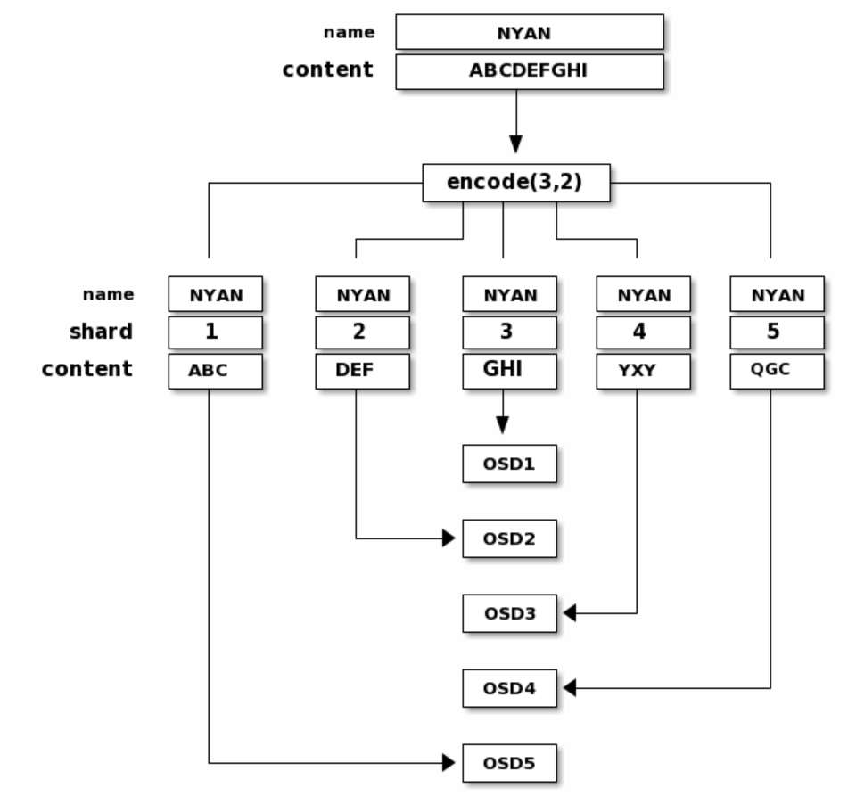

A client can register a persistent interest with an object and keep a session to the primary OSD open. The client can send a notification message and a payload to all watchers and receive notification when the watchers receive the notification. This enables a client to use any object as a synchronization/communication channel.

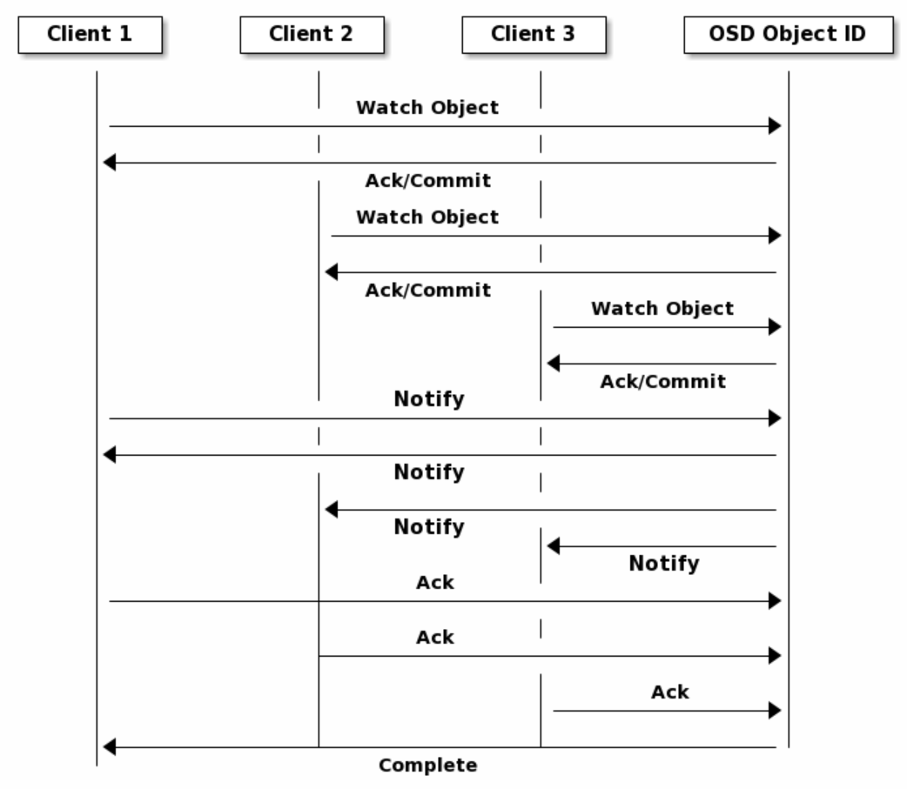

#### 接口

Ceph Clients include a number of service interfaces, Block Devices, Object Storage, Filesystem

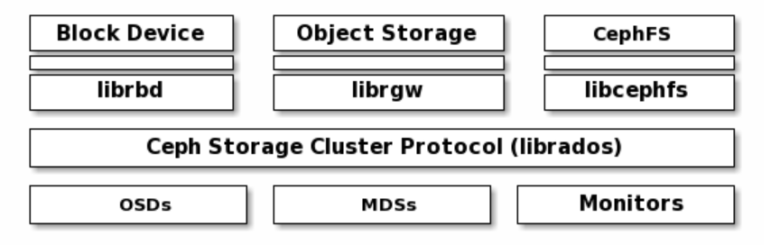

The Ceph File System (CephFS) provides a POSIX-compliant filesystem as a service that is layered on top of the object-based Ceph Storage Cluster. CephFS files get mapped to objects that Ceph stores in the Ceph Storage Cluster. Ceph Clients mount a CephFS filesystem as a kernel object or as a Filesystem in User Space (FUSE). Ceph文件存储提供了POSIX-compliant 符合POSIX标准的文件系统

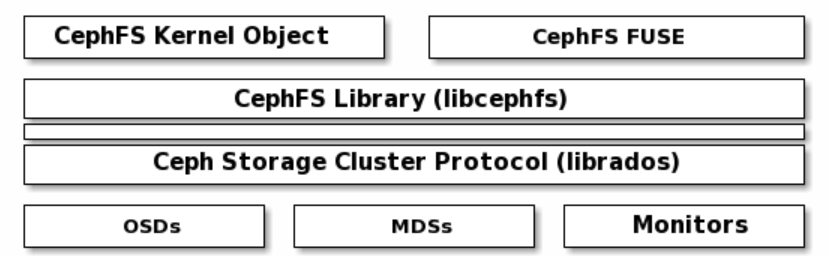

The Ceph File System service includes the Ceph Metadata Server (MDS) deployed with the Ceph Storage cluster. The purpose of the MDS is to store all the filesystem metadata (directories, file ownership, access modes, etc) in high-availability Ceph Metadata Servers where the metadata resides in memory. The reason for the MDS (a daemon called ceph-mds) is that simple filesystem operations like listing a directory or changing a directory (ls, cd) would tax the Ceph OSD Daemons unnecessarily. So separating the metadata from the data means that the Ceph File System can provide high performance services without taxing the Ceph Storage Cluster. Ceph文件存储包括MDS存储元数据, MDS支持ls, cd这样的文件系统操作来查询数据信息

简而言之, CephFS separates the metadata from the data, storing the metadata in the MDS, and storing the file data in one or more objects in the Ceph Storage Cluster. The Ceph filesystem aims for POSIX compatibility. ceph-mds can run as a single process, or it can be distributed out to multiple physical machines, either for high availability or for scalability.

### CEPH FILE SYSTEM

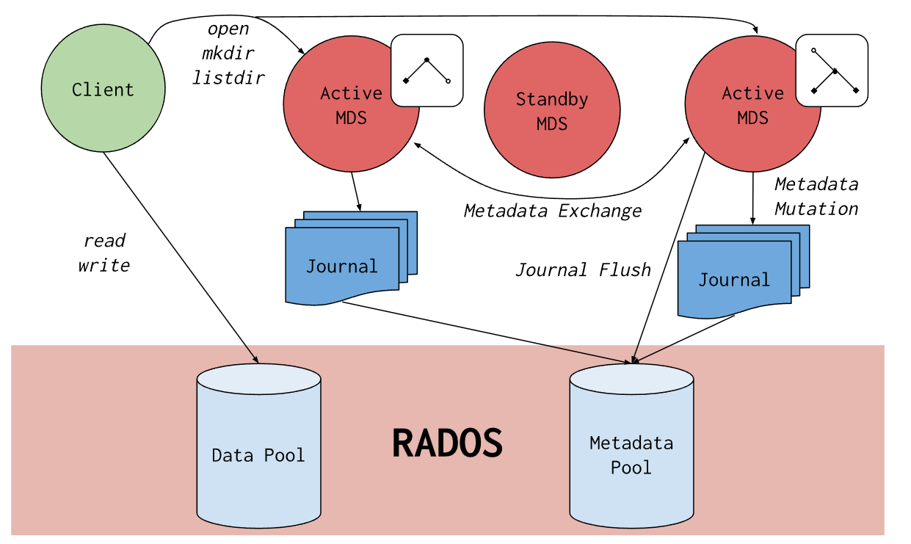

The architecture of CephFS is shown below
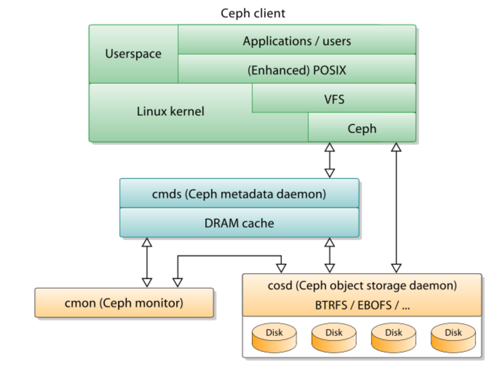

只通过metadata来表征文件系统的层次结构在实现起来是相当复杂的, 因为还需要涉及到动态添加或者删除文件, 且会涉及到多线程的竞态问题。When there are multiple active MDSs, a part of the directory structure (subtree) can be dynamically assigned to an MDS and completely processed by it to achieve horizontal expansion. 相比于GFS, cephFS更加强调存储, 牺牲了一定的文件系统存取效率, 但是实现优秀存取效率的文件层级系统且兼顾大规模存储是很难的。

比较一些文件系统: https://juicefs.com/blog/en/posts/distributed-filesystem-comparison/


### HDFS
HDFS出自2010年发表的论文`The Hadoop Distributed File System`, 它的摘要如下

The Hadoop Distributed File System (HDFS) is designed to store very large data sets reliably, and to stream
those data sets at high bandwidth to user applications. In a large cluster, thousands of servers both host directly attached storage and execute user application tasks. By distributing storage and computation across many servers, the resource can grow with demand while remaining economical at every size. cluster中上千的服务器直接挂载存储设备和执行用户应用任务。

#### Introdution

Hadoop [1][16][19] provides a distributed file system and a framework for the analysis and transformation of very large data sets using the MapReduce [3] paradigm. HDFS的作用是为Hadoop的MapReduce提供文件系统支持 An important characteristic of Hadoop is the partitioning of data and computation across many (thousands) of hosts, and executing application computations in parallel close to their data. A Hadoop cluster scales computation capacity, storage capacity and IO bandwidth by simply adding commodity servers. Hadoop的重要特性是数据分片和在多个hosts中计算和并行执行。并且Hadoop集群通过简单地增加商品服务器来扩展计算能力、存储能力和IO带宽

主要特性：

HDFS is the file system component of Hadoop. While the interface to HDFS is patterned after the UNIX file system, faithfulness to standards was sacrificed in favor of improved performance for the applications at hand. 虽然HDFS也提供了UNIX文件系统接口, 但为了提高性能牺牲了对标准的faithfulness(忠诚)

HDFS stores file system metadata and application data separately. As in other distributed file systems, like PVFS [2][14], Lustre [7] and GFS [5][8], HDFS stores metadata on a dedicated server, called the NameNode. Application data are stored on other servers called DataNodes. All servers are fully connected and communicate with each other using TCP-based protocols. HDFS把metadata存储在NameNode, 应用数据存储在DataNodes

Unlike Lustre and PVFS, the DataNodes in HDFS do not use data protection mechanisms such as RAID to make the data durable. Instead, like GFS, the file content is replicated on multiple DataNodes for reliability 数据保证机制并没有太多在硬件上下功夫, 例如RAID, Redundant Array of Independent Disks独立硬盘冗余阵列, 而只需要增加副本即可。

Several distributed file systems have or are exploring truly distributed implementations of the namespace. Ceph [17] has a cluster of namespace servers (MDS) and uses a dynamic subtree partitioning algorithm in order to map the namespace tree to MDSs evenly. GFS is also evolving into a distributed namespace implementation [8]. The new GFS will have hundreds of namespace servers (masters) with 100 million files per master. Lustre [7] has an implementation of clustered namespace on its roadmap for Lustre 2.2 release. The intent is to stripe a directory over multiple metadata servers (MDS), each of which contains a disjoint portion of the namespace. A file is assigned to a particular MDS using a hash function on the file name. 对于namespace这个结构的实现在分布式文件系统中各有千秋，Ceph有一簇namespace服务器(称为MDS), 使用动态子树分片算法将namespace逻辑树节点映射到具体的MDS。GFS将master作为namespace server, 每个master有超过1个文件。文件到MDS的映射往往通过hash函数进行

#### Namenode

The HDFS namespace is a hierarchy of files and directories. Files and directories are represented on the NameNode by inodes, which record attributes like permissions, modification and access times, namespace and disk space quotas. HDFS的namespace 逻辑上是层次的文件和目录构成, 文件目录在NameNode中都用inode表示(和linux文件系统一致), inode记录了特性例如权限, 访问和修改时间, 磁盘信息等

The NameNode maintains the namespace tree and the mapping of file blocks to DataNodes (the physical location of file data). An HDFS client wanting to read a file first contacts the NameNode for the locations of data blocks comprising the file and then reads block contents from the DataNode closest to the client. When writing data, the client requests the NameNode to nominate a suite of three DataNodes to host the block replicas. The client then writes data to the DataNodes in a pipeline fashion. NameNode维护了metadata到DataNode的数据块的映射。读文件时HDFS client与NameNode通信获得data block的位置然后从位置最近的DataNode处读取; 写文件时与NameNode通信并提名三个DataNode来存储写的数据, 然后向DataNode中写数据。

HDFS keeps the entire namespace in RAM. The inode data and the list of blocks belonging to each file comprise the metadata of the name system called the image. The persistent record of the image stored in the local host’s native files system is called a checkpoint. The NameNode also stores the modification log of the image called the journal in the local host’s native file system. For improved durability, redundant copies of the checkpoint and journal can be made at other servers. During restarts the NameNode restores the namespace by reading the namespace and replaying the journal. The locations of block replicas may change over time and are not part of the persistent checkpoint. HDFS将namespace的信息存储在RAM中, innode数据和包含name system的metadata信息称为image, 持久化的image记录称为checkpoint, namenode存储的对image的修改日志称为journal(WSL). 使用副本数据时checkpoint和journal也存在于副本节点中, 重启namenode会通过读取checkpoint和jornal恢复状态, 块的位置信息可能随着时间而发生变化, 这不存放在持久化的checkpoint中。

#### DataNode

During startup each DataNode connects to the NameNode and performs a handshake. The purpose of the handshake is to verify the namespace ID and the software version of the DataNode. If either does not match that of the NameNode the DataNode automatically shuts down. 开始时DataNode通过握手连接到NameNode, 目的是验证namespaceID和软件版本。namespace ID是整个文件系统的唯一ID,这可以保护文件系统的完整性 The namespace ID is persistently stored on all nodes of the cluster. Nodes with a different namespace ID will not be able to join the cluster, thus preserving the integrity of the file system.

After the handshake the DataNode registers with the NameNode. DataNodes persistently store their unique storage IDs. The storage ID is an internal identifier of the DataNode, which makes it recognizable even if it is restarted with a different IP address or port. The storage ID is assigned to the DataNode when it registers with the NameNode for the first time and never changes after that 握手之后DataNode需要向NameNode注册并获得一个storageID. storageID可以唯一标识一个DataNode, 即使DataNode重新上线后ip和port发生变化。storage一旦赋予将永远不会发生改变。

A DataNode identifies block replicas in its possession to the NameNode by sending a block report. A block report contains the block id, the generation stamp and the length for each block replica the server hosts. The first block report is sent immediately after the DataNode registration. Subsequent block reports are sent every hour and provide the NameNode with an up-todate view of where block replicas are located on the cluster. block DataNode会向NameNode发送block report. block report包含了blockID, 生成block的时间戳和block的长度, 目的是通知NameNode某个block的位置是什么cluster  

During normal operation DataNodes send heartbeats to the NameNode to confirm that the DataNode is operating and the block replicas it hosts are available The default heartbeat interval is three seconds. If the NameNode does not receive a heartbeat from a DataNode in ten minutes the NameNode considers the DataNode to be out of service and the block replicas hosted by that DataNode to be unavailable. The NameNode then schedules creation of new replicas of those blocks on other DataNodes.DataNode还会向NameNode发送心跳heartbeats来确认DataNode执行操作以及DataNode上的block副本是否可用, 入股超过10分钟NameNode没有接收到某个DataNode的心跳就会认为该DataNode已经下线, 并用其他DataNode来维护下线节点的block replicas数据


Heartbeats from a DataNode also carry information about total storage capacity, fraction of storage in use, and the number of data transfers currently in progress. These statistics are used for the NameNode’s space allocation and load balancing decisions. hertbeats还包含存储容量, 使用存储量, 当前数据传输速率等, 这些统计信息NameNode的空间分配和负载均衡会进行使用

The NameNode does not directly call DataNodes. It uses replies to heartbeats to send instructions to the DataNodes. The instructions include commands to: 1.replicate blocks to other nodes; 2.remove local block replicas; 3.re-register or to shut down the node; 4.send an immediate block report. These commands are important for maintaining the overall system integrity and therefore it is critical to keep heartbeats frequent even on big clusters. The NameNode can process thousands of heartbeats per second without affecting other NameNode operations.

#### HDFS Client

Similar to most conventional file systems, HDFS supports operations to read, write and delete files, and operations to create and delete directories. The user references files and directories by paths in the namespace. The user application generally does not need to know that file system metadata and storage are on different servers, or that blocks have multiple replicas HDFS client可用任务是暴露的用户接口使用, 这些接口包括读写删除等, 用户不需要知道系统元数据, 不同server的存储, 不同的block副本

When an application reads a file, the HDFS client first asks the NameNode for the list of DataNodes that host replicas of the blocks of the file. It then contacts a DataNode directly and requests the transfer of the desired block. When a client writes, it first asks the NameNode to choose DataNodes to host replicas of the first block of the file. The client organizes a pipeline from node-to-node and sends the data. When the first block is filled, the client requests new DataNodes to be chosen to host replicas of the next block. 读操作时client先向NameNode请求读的block, 再直接与DataNode通信并获得数据, 写操作时会首先向NameNode请求DataNode的可用block, 然后写数据, 如果block满则重复请求block

#### Image and Journal

The namespace image is the file system metadata that describes the organization of application data as directories and files. A persistent record of the image written to disk is called a checkpoint. The journal is a write-ahead commit log for changes to the file system that must be persistent. For each client-initiated transaction, the change is recorded in the journal, and the journal file is flushed and synched before the change is committed to the HDFS client. During startup the NameNode initializes the namespace image from the checkpoint, and then replays changes from the journal until the image is up-to-date with the last state of the file system. namespace image是文件系统元数据, 用来描述directories和files的组织状态, 持久化的image称为checkpoint, journal是WSL; 当启动NameNode时, 首先从checkpoint恢复持久化的image, 然后从journal恢复完整的image。为了防止数据丢失, checkpoint和journal也是多副本存储的

The NameNode is a multithreaded system and processes requests simultaneously from multiple clients. Saving a transaction to disk becomes a bottleneck since all other threads need to wait until the synchronous flush-and-sync procedure initiated by one of them is complete. In order to optimize this process the NameNode batches multiple transactions initiated by different clients. 为了提高多线程多事务写磁盘的I/O瓶颈和多线程的竞争, 使用一个线程批处理来持久化

#### Block Placement

For a large cluster, it may not be practical to connect all nodes in a flat topology. A common practice is to spread the nodes across multiple racks. Nodes of a rack share a switch, and rack switches are connected by one or more core switches. Communication between two nodes in different racks has to go through multiple switches In most cases, network bandwidth between nodes in the same rack is greater than network bandwidth between nodes in different racks. 在网络拓扑中一个交换机switch下的节点作为一个rack机架, rack内的节点传输网络快, 跨rack的节点传输网络较慢

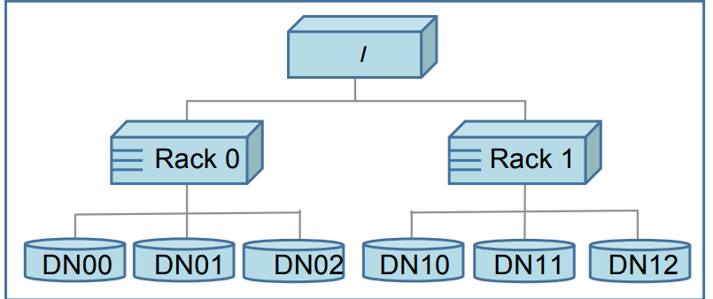

HDFS estimates the network bandwidth between two nodes by their distance. HDFS内部需要有根据距离估计带宽的开销, 且涉及到拓扑结构的最短路问题。 The placement of replicas is critical to HDFS data reliability and read/write performance. A good replica placement policy should improve data reliability, availability, and network
bandwidth utilization. Currently HDFS provides a configurable block placement policy interface so that the users and researchers can experiment and test any policy that’s optimal for their applications. HDFS提供了接口使用户配置block的放置位置以最优, 最优放置考虑到数据可靠性reliability, 可用性availability, 网络带宽利用率nework bandwidth utilization

The default HDFS replica placement policy can be summarized as follows: 1. No Datanode contains more than one replica of any block. 2. No rack contains more than two replicas of the same block, provided there are sufficient racks on the cluster. 一个DataNode不能包含重复block(即block的副本), 一个rack最多存在一个重复的block, 这种逻辑是rack出错的概率比cluster小, 因此block和block副本别放到一个cluster上, 放到同rack下的其他cluster上。

#### Replication management

The NameNode endeavors to ensure that each block always has the intended number of replicas. The NameNode detects that a block has become under- or over-replicated when a block report from a DataNode arrives. When a block becomes over replicated, the NameNode chooses a replica to remove. The NameNode will prefer not to reduce the number of racks that host replicas, and secondly prefer to remove a replica from the DataNode with the least amount of available disk space. The goal is to balance storage utilization across DataNodes without reducing the block’s availability. NameNode尽力确保每个block会有确定数量的副本, 如果某个block副本偏多NameNode会选择删除, 删除规则以尽量不降低rack数量, 尽量减少最小的使用空间为准。尽量不降低block的可用性

When a block becomes under-replicated, it is put in the replication priority queue. A block with only one replica has the highest priority, while a block with a number of replicas that is greater than two thirds of its replication factor has the lowest priority. If the number of existing replicas is one, HDFS places the next replica on a different rack. In case that the block has two existing replicas, if the two existing replicas are on the same rack, the third replica is placed on a different rack; otherwise, the third replica is placed on a different node in the same rack as an existing replica. 对于副本数量不足的block来说, 会形成优先队列, 副本越少的block优先级越大, 增长副本的规则也遵循rack的放置规则。If the NameNode detects that a
block’s replicas end up at one rack, the NameNode treats the block as under-replicated and replicates the block to a different rack using the same block placement policy described above.

#### Balancer

The balancer is a tool that balances disk space usage on an HDFS cluster. It takes a threshold value as an input parameter, which is a fraction in the range of (0, 1). A cluster is balanced if for each DataNode, the utilization of the node (ratio of used space at the node to total capacity of the node) differs from the utilization of the whole cluster (ratio of used space in the cluster to total capacity of the cluster) by no more than the threshold value. 负载均衡器在cluster设置了(0,1)区别的阈值, 如果node使用率超过阈值将启动负载均衡

When choosing a replica to move and deciding its destination, the balancer guarantees that the decision does not reduce either the number of replicas or the number of racks. The balancer optimizes the balancing process by minimizing the inter-rack data copying.当移动replica时不会减少rack, 保证可用性。且优先进行rack内部的调整(而不是跨rack)

Whenever a read client or a block scanner detects a corrupt block, it notifies the NameNode. The NameNode marks the replica as corrupt, but does not schedule deletion of the replica immediately. Instead, it starts to replicate a good copy of the block. Only when the good replica count reaches the replication factor of the block the corrupt replica is scheduled to be removed. This policy aims to preserve data as long as possible. 当检查到崩溃的block, 通知NameNode, NameNode首先是拷贝崩溃block的数据到新block, 只有当block副本数量到达阈值时才会执行删除操作。