> 最近在做图形学的作业, 因此一记

### 概念

#### Rasterization 栅格化

即基于像素的栅格化

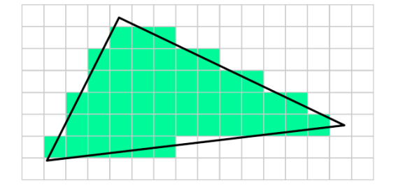

A triangle in terms of vectors 三角形, 可以认为由两条向量组成.三角形有三个顶点a, b, c, 两条边组成的向量c-a, b-a可以称作基向量Basis vectors

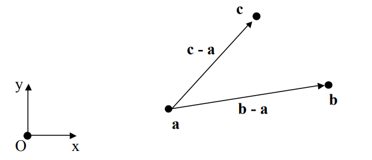

Barycentric coordinates 重心坐标系, 任何点可以表示成三角形三个点坐标的和, 推导如下。从向量的角度看, 重心坐标是齐次坐标的一种。

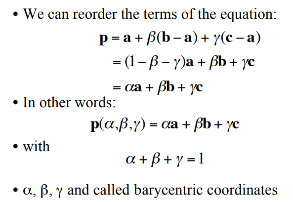

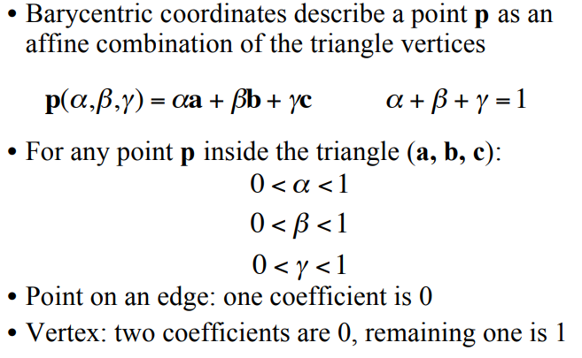

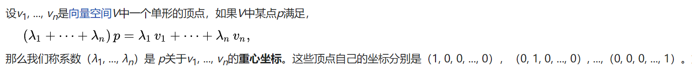

在三角形情形中，重心坐标也叫面积坐标，因为P点(重心)关于三角形ABC的重心坐标和三角形PBC, PCA及PAB的（有向）面积成比例。换言之, 三角形PBC, PCA及PAB的面积比a1, a2, a3就是重心P的重心坐标(a1, a2, a3)


给定三角形平面一点的坐标, 可基于面积计算其重心坐标系下的坐标, 而面积可以通过行列式求得。

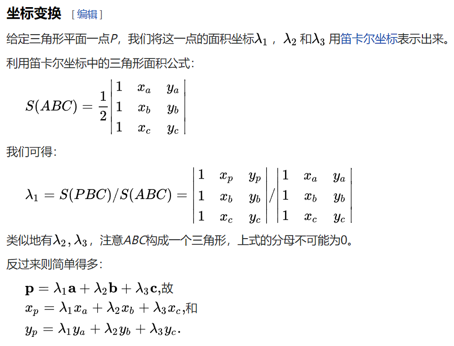

<!-- more -->

### opengl

OpenGL(Open Graphics Library，开放式图形库) 是用于渲染2D、3D矢量图形的跨语言、跨平台的应用程序编程接口(API)。这个接口由近350个不同的函数调用组成，用来从简单的图形比特绘制复杂的三维景象。除了Opengl外, 另一种程序接口系统是仅用于Microsoft Windows上的Direct3D。OpenGL常用于CAD、虚拟现实、科学可视化程序和电子游戏开发。

OpenGL的高效实现(利用图形加速硬件)存在于Windows，部分UNIX平台和Mac OS。这些实现一般由显示设备厂商提供，而且非常依赖于该厂商提供的硬件。开放源代码库Mesa是一个纯基于软件的图形API，它的代码兼容于OpenGL。但是，由于许可证的原因，它只声称是一个"非常相似"的API。OpenGL规范描述了绘制2D和3D图形的抽象API。尽管这些API可以完全通过软件实现，但它是为大部分或者全部使用硬件加速而设计的。

OpenGL规范由1992年成立的OpenGL架构评审委员会（ARB）维护。ARB由一些对创建一个统一的、普遍可用的API特别感兴趣的公司组成。根据OpenGL官方网站，2002年6月的ARB投票成员包括3Dlabs、Apple Computer、ATI Technologies、Dell Computer、Evans & Sutherland、Hewlett-Packard、IBM、Intel、Matrox、NVIDIA、SGI和Sun Microsystems，Microsoft曾是创立成员之一，但已于2003年3月退出。

#### 常用库实现

opengl规定了图形接口，相当于提供了头文件，源文件由厂商自己实现，实现这些接口的库大体有以下几种。

* OpenGL工具库 OpenGL Utility Toolkit, 函数以glut开头

glut是不依赖于窗口平台的OpenGL工具包，由Mark KLilgrad在SGI编写（现在在Nvidia），目的是隐藏不同窗口平台API的复杂度。 ，它们作为aux库功能更强的替代品，提供更为复杂的绘制功能，此函数由glut.dll来负责解释执行。由于glut中的窗口管理函数是不依赖于运行环境的，因此OpenGL中的工具库可以在X-Window, Windows NT, OS/2等系统下运行，特别适合于开发不需要复杂界面的OpenGL示例程序。对于有经验的程序员来说，一般先用glut理顺3D图形代码，然后再集成为完整的应用程序。

这部分函数主要包括,

窗口操作函数，窗口初始化、窗口大小、窗口位置等函数glutInit() glutInitDisplayMode() glutInitWindowSize() glutInitWindowPosition()等

回调函数。响应刷新消息、键盘消息、鼠标消息、定时器函数等，GlutDisplayFunc() glutPostRedisplay() glutReshapeFunc() glutTimerFunc() glutKeyboardFunc() glutMouseFunc()

创建复杂的三维物体。这些和aux库的函数功能相同。创建网状体和实心体。如glutSolidSphere()、glutWireSphere()等

菜单函数。创建添加菜单的函数GlutCreateMenu()、glutSetMenu()、glutAddMenuEntry()、glutAddSubMenu() 和glutAttachMenu()

程序运行函数，glutMainLoop()

glut是基本的窗口界面，是独立于gl和glu的，如果不喜欢用glut可以用MFC和Win32窗口等代替，但是glut是跨平台的，这就保证了我们编出的程序是跨平台的，如果用MFC或者Win32只能在windows操作系统上使用。选择OpenGL的一个很大原因就是因为它的跨平台性，所以我们可以尽量的使用glut库.

* OpenGL核心库 函数名以gl开头

GLEW是一个基于OpenGL图形接口的跨平台的C++扩展库。GLEW能自动识别当前平台所支持的全部OpenGL高级扩展涵数。只要包含glew.h头文件，就能使用gl,glu,glext,wgl,glx的全部函数。GLEW支持目前流行的各种操作系统。

函数名的前缀为gl, 这部分函数用于常规的、核心的图形处理。此函数由gl.dll来负责解释执行。核心库中的函数主要可以分为以下几类函数。

绘制基本几何图元的函数。如绘制图元的函数glBegain()、glEnd()、glNormal*()、glVertex*()

矩阵操作、几何变换和投影变换的函数。如矩阵入栈函数glPushMatrix()、矩阵出栈 函数glPopMatrix()

颜色、光照和材质的函数。如设置颜色模式函数glColor*()、glIndex*()，设置光照效果的函数glLight*() 、glLightModel*()

显示列表函数、主要有创建、结束、生成、删除和调用显示列表的函数glNewList()、 glEndList()、glGenLists()

纹理映射函数，主要有一维纹理函数glTexImage1D()、二维纹理函数glTexImage2D()、 设置纹理参数

* OpenGL实用库The OpenGL Utility Library (GLU) 函数名以glu开头

函数名的前缀为glu, OpenGL提供了强大的但是为数不多的绘图命令，所有较复杂的绘图都必须从点。线、面开始。Glu 为了减轻繁重的编程工作，封装了OpenGL函数，Glu函数通过调用核心库的函数，为开发者提供相对简单的用法，实现一些较为复杂的操作。此函数由glu.dll来负责解释执行。

* OpenGL辅助库  

函数名前缀为aux, 这部分函数提供窗口管理、输入输出处理以及绘制一些简单三维物体。此函数由glaux.dll来负责解释执行。aux很大程度上已经被glut库取代

总之opengl 核心库头文件 `glew`, 跨平台窗口创建`glfw`, `glut`

If we use an ancient version of OpenGL then we can access the OpenGL functions simply including as #include <GL/gl.h>. But in modern OpenGL, the API functions are determined at run time, not compile time.
GLEW is a cross-platform open-source C/C++ extension loading library. GLEW provides efficient run-time mechanisms for determining which OpenGL extensions are supported on the target platform. GLEW will handle the run time loading of the OpenGL API.

GLFW or freeglut will allow us to create a window, and receive mouse and keyboard input in a cross-platform way. OpenGL does not handle window creation or input, so we have to use these library for handling window, keyboard, mouse, joysticks, input and other purpose.

* GLFW轻量级工具程序库， 函数名以glfw开头

GLFW 是配合 OpenGL 使用的轻量级工具程序库，缩写自 Graphics Library Framework（图形库框架）。GLFW 的主要功能是创建并管理窗口和 OpenGL 上下文，同时还提供了处理手柄、键盘、鼠标输入的功能。有类似功能的库还有 GLUT和 SDL。

glad (Multi-Language GL/GLES/EGL/GLX/WGL Loader-Generator), Glad is pretty similiar to glLoadGen, it generates a loader for your exact needs based on the official specifications from the Khronos SVN. 

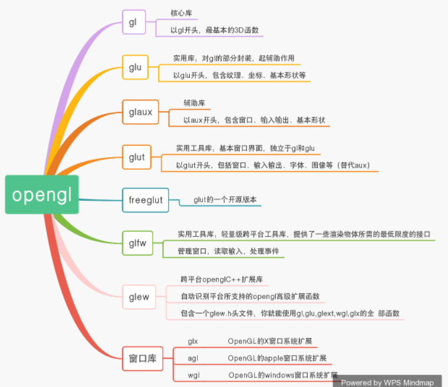

opengl安装就是安装一堆库文件(主要就是glew, glfw, glut, glad, glm等)

https://zhuanlan.zhihu.com/p/283696937

https://blog.csdn.net/qq_38962621/article/details/104017853


#### 窗口

应用程序使用单缓冲绘图时可能会存在图像闪烁的问题。 这是因为生成的图像不是一下子被绘制出来的，而是按照从左到右，由上而下逐像素地绘制而成的。为了规避这些问题，我们应用双缓冲渲染窗口应用程序。前缓冲保存着最终输出的图像，它会在屏幕上显示；而所有的的渲染指令都会在后缓冲上绘制。当所有的渲染指令执行完毕后，我们交换(Swap)前缓冲和后缓冲，这样图像就立即呈显出来，之前提到的不真实感就消除了。

```cpp
#include <glad/glad.h>
#include <GLFW/glfw3.h>

#include <iostream>

// 函数声明
void framebuffer_size_callback(GLFWwindow* window, int width, int height);
void processInput(GLFWwindow *window);

// settings
const unsigned int SCR_WIDTH = 800;
const unsigned int SCR_HEIGHT = 600;

int main()
{
    // glfw: initialize and configure
    // ------------------------------
    glfwInit(); // 初始化GLFW
    glfwWindowHint(GLFW_CONTEXT_VERSION_MAJOR, 3);  // 使用的OpenGL版本是3.3, 主版本号(Major)和次版本号(Minor)都设为3
    glfwWindowHint(GLFW_CONTEXT_VERSION_MINOR, 3);
    glfwWindowHint(GLFW_OPENGL_PROFILE, GLFW_OPENGL_CORE_PROFILE);  // 告诉GLFW我们使用的是核心模式(Core-profile)

#ifdef __APPLE__  // 如果是MaxOS系统, 需要再加一行
    glfwWindowHint(GLFW_OPENGL_FORWARD_COMPAT, GL_TRUE);
#endif

    // glfw window creation
    // --------------------
    GLFWwindow* window = glfwCreateWindow(SCR_WIDTH, SCR_HEIGHT, "LearnOpenGL", NULL, NULL);  // glfw创建窗口
    if (window == NULL)
    {
        std::cout << "Failed to create GLFW window" << std::endl;
        glfwTerminate();
        return -1;
    }
    glfwMakeContextCurrent(window); // 将我们窗口设置为当前线程的主上下文了。
    glfwSetFramebufferSizeCallback(window, framebuffer_size_callback); //帧缓冲大小函数需要一个GLFWwindow作为它的第一个参数，以及两个整数表示窗口的新维度。每当窗口改变大小，GLFW会调用这个函数并填充相应的参数
    // glad: load all OpenGL function pointers
    // ---------------------------------------
    if (!gladLoadGLLoader((GLADloadproc)glfwGetProcAddress))  // glad load opengl的核心函数, 初始化
    {
        std::cout << "Failed to initialize GLAD" << std::endl;
        return -1;
    }    

    // render loop
    // -----------
    while (!glfwWindowShouldClose(window))  // 检查GLFW是否被要求退出
    {
        // input
        // -----
        processInput(window);

        // render
        // ------
        glClearColor(0.2f, 0.3f, 0.3f, 1.0f); // 初始化颜色
        glClear(GL_COLOR_BUFFER_BIT);

        // glfw: swap buffers and poll IO events (keys pressed/released, mouse moved etc.)
        // -------------------------------------------------------------------------------
        glfwSwapBuffers(window); // 交换颜色缓冲（它是一个储存着GLFW窗口每一个像素颜色值的大缓冲），它在这一迭代中被用来绘制，并且将会作为输出显示在屏幕上。
        glfwPollEvents(); // 检查有没有触发什么事件（比如键盘输入、鼠标移动等）
    }

    // glfw: terminate, clearing all previously allocated GLFW resources.
    // ------------------------------------------------------------------
    glfwTerminate();
    return 0;
}

// process all input: query GLFW whether relevant keys are pressed/released this frame and react accordingly
// ---------------------------------------------------------------------------------------------------------
void processInput(GLFWwindow *window)
{
    if(glfwGetKey(window, GLFW_KEY_ESCAPE) == GLFW_PRESS)
        glfwSetWindowShouldClose(window, true); // 应该关闭窗口了
}

// glfw: whenever the window size changed (by OS or user resize) this callback function executes
// ---------------------------------------------------------------------------------------------
void framebuffer_size_callback(GLFWwindow* window, int width, int height)
{
    // make sure the viewport matches the new window dimensions; note that width and 
    // height will be significantly larger than specified on retina displays.
    glViewport(0, 0, width, height);  // OpenGL渲染窗口的尺寸大小，即视口(Viewport)，
}
```


#### 三角形绘制

顶点数组对象：Vertex Array Object，VAO

顶点缓冲对象：Vertex Buffer Object，VBO

索引缓冲对象：Element Buffer Object，EBO或Index Buffer Object，IBO


在OpenGL中，任何事物都在3D空间中，而屏幕和窗口却是2D像素数组，这导致OpenGL的大部分工作都是关于把3D坐标转变为适应你屏幕的2D像素。3D坐标转为2D坐标的处理过程是由OpenGL的图形渲染管线（Graphics Pipeline，大多译为管线，实际上指的是一堆原始图形数据途经一个输送管道，期间经过各种变化处理最终出现在屏幕的过程）管理的。图形渲染管线可以被划分为两个主要部分：第一部分把你的3D坐标转换为2D坐标，第二部分是把2D坐标转变为实际的有颜色的像素。

图形渲染管线接受一组3D坐标，然后把它们转变为你屏幕上的有色2D像素输出。图形渲染管线可以被划分为几个阶段，每个阶段将会把前一个阶段的输出作为输入。所有这些阶段都是高度专门化的（它们都有一个特定的函数），并且很容易并行执行。正是由于它们具有并行执行的特性，当今大多数显卡都有成千上万的小处理核心，它们在GPU上为每一个（渲染管线）阶段运行各自的小程序，从而在图形渲染管线中快速处理你的数据。这些小程序叫做着色器(Shader)。

我们以数组的形式传递3个3D坐标作为图形渲染管线的输入，用来表示一个三角形，这个数组叫做顶点数据(Vertex Data)；顶点数据是一系列顶点的集合。

图形渲染管线的第一个部分是顶点着色器(Vertex Shader)，它把一个单独的顶点作为输入。顶点着色器主要的目的是把3D坐标转为另一种3D坐标

图元装配(Primitive Assembly)阶段将顶点着色器输出的所有顶点作为输入（如果是GL_POINTS，那么就是一个顶点），并所有的点装配成指定图元的形状, 例如三角形

图元装配阶段的输出会传递给几何着色器(Geometry Shader)。几何着色器把图元形式的一系列顶点的集合作为输入，它可以通过产生新顶点构造出新的（或是其它的）图元来生成其他形状。

几何着色器的输出会被传入光栅化阶段(Rasterization Stage)，这里它会把图元映射为最终屏幕上相应的像素，生成供片段着色器(Fragment Shader)使用的片段(Fragment)。在片段着色器运行之前会执行裁切(Clipping)。裁切会丢弃超出你的视图以外的所有像素，用来提升执行效率。

片段着色器的主要目的是计算一个像素的最终颜色，这也是所有OpenGL高级效果产生的地方。通常，片段着色器包含3D场景的数据（比如光照、阴影、光的颜色等等），这些数据可以被用来计算最终像素的颜色。

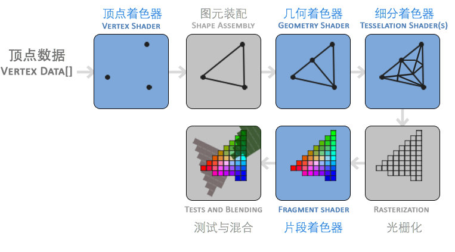

* 顶点输入

标准化设备坐标(Normalized Device Coordinates, NDC), 标准化设备坐标是一个x、y和z值在-1.0到1.0的一小段空间

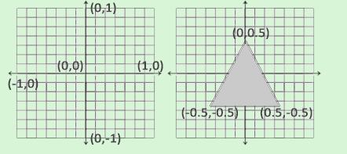

我们通过顶点缓冲对象(Vertex Buffer Objects, VBO)管理这个内存，它会在GPU内存（通常被称为显存）中储存大量顶点。使用这些缓冲对象的好处是我们可以一次性的发送一大批数据到显卡上，而不是每个顶点发送一次。从CPU把数据发送到显卡相对较慢(注意集显也是显卡, 但集显和核显都是不自带显存的，需要占用计算机内存。)，所以只要可能我们都要尝试尽量一次性发送尽可能多的数据。当数据发送至显卡的内存中后，顶点着色器几乎能立即访问顶点，这是个非常快的过程。

* 顶点着色器

顶点着色器(Vertex Shader)是几个可编程着色器中的一个。如果我们打算做渲染的话，现代OpenGL需要我们至少设置一个顶点和一个片段着色器。

用着色器语言GLSL(OpenGL Shading Language)编写顶点着色器，然后编译这个着色器。每个着色器都起始于一个版本声明。OpenGL 3.3以及和更高版本中, 下一步，使用in关键字，在顶点着色器中声明所有的输入顶点属性(Input Vertex Attribute)。由于每个顶点都有一个3D坐标，我们就创建一个vec3输入变量aPos。我们同样也通过layout (location = 0)设定了输入变量的位置值(Location)

在GLSL中一个向量有最多4个分量，每个分量值都代表空间中的一个坐标，它们可以通过vec.x、vec.y、vec.z和vec.w来获取。由于我们的输入是一个3分量的向量，我们必须把它转换为4分量的。我们可以把vec3的数据作为vec4构造器的参数，同时把w分量设置为1.0f
```
#version 330 core
layout (location = 0) in vec3 aPos;

void main()
{
    gl_Position = vec4(aPos.x, aPos.y, aPos.z, 1.0);
}
```


创建一个着色器对象，注意还是用ID来引用的。所以我们储存这个顶点着色器为unsigned int，然后用glCreateShader创建这个着色器：下一步我们把这个着色器源码附加到着色器对象上，然后编译它：
```cpp
unsigned int vertexShader;
vertexShader = glCreateShader(GL_VERTEX_SHADER);

const char *vertexShaderSource = "#version 330 core\n"
    "layout (location = 0) in vec3 aPos;\n"
    "void main()\n"
    "{\n"
    "   gl_Position = vec4(aPos.x, aPos.y, aPos.z, 1.0);\n"
    "}\0";  // 着色器源代码
glShaderSource(vertexShader, 1, &vertexShaderSource, NULL);
glCompileShader(vertexShader);
```

* 片段着色器

片段着色器所做的是计算像素最后的颜色输出。片段着色器只需要一个输出变量，这个变量是一个4分量向量，它表示的是最终的输出颜色，我们应该自己将其计算出来。声明输出变量可以使用out关键字，这里我们命名为FragColor。
```cpp
#version 330 core
out vec4 FragColor;

void main()
{
    FragColor = vec4(1.0f, 0.5f, 0.2f, 1.0f);
} 
```

编译, 使用GL_FRAGMENT_SHADER常量作为着色器类型
```cpp
unsigned int fragmentShader;
fragmentShader = glCreateShader(GL_FRAGMENT_SHADER);
glShaderSource(fragmentShader, 1, &fragmentShaderSource, NULL);
glCompileShader(fragmentShader);
```

在Vertex Shader阶段，我们要处理的数据只是3个顶点，而在Fragment Shader阶段，我们要处理的则是（大致上）被这三个顶点围住的所有像素对应的Fragments。Vertex的数量远远少于Fragment。

* 着色器程序

两个着色器现在都编译了，剩下的事情是把两个着色器对象链接到一个用来渲染的着色器程序(Shader Program)中。当链接着色器至一个程序的时候，它会把每个着色器的输出链接到下个着色器的输入。当输出和输入不匹配的时候，你会得到一个连接错误。

```cpp
unsigned int shaderProgram;
shaderProgram = glCreateProgram();

glAttachShader(shaderProgram, vertexShader);
glAttachShader(shaderProgram, fragmentShader);
glLinkProgram(shaderProgram);
```

顶点缓冲数据会被解析为下面这样子, 如下三个顶点, 每个顶点有三个维度的坐标, 每个数值用4字节表示, 这些组成一个连续的数组
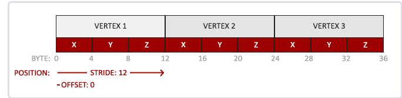

```cpp
glVertexAttribPointer(0, 3, GL_FLOAT, GL_FALSE, 3 * sizeof(float), (void*)0);
glEnableVertexAttribArray(0);

// 第一个参数指定我们要配置的顶点属性。我们在顶点着色器中使用layout(location = 0)定义了position顶点属性的位置值(Location)吗？它可以把顶点属性的位置值设置为0。

// 第二个参数指定顶点属性的大小。顶点属性是一个vec3，它由3个值组成，所以大小是3
// 第三个参数指定数据的类型，这里是GL_FLOAT(GLSL中vec*都是由浮点数值组成的)。
// 下个参数定义我们是否希望数据被标准化(Normalize)。如果我们设置为GL_TRUE，所有数据都会被映射到0（对于有符号型signed数据是-1）到1之间。我们把它设置为GL_FALSE。

// 第五个参数叫做步长(Stride)，它告诉我们在连续的顶点属性组之间的间隔。由于下个组位置数据在3个float之后，我们把步长设置为3 * sizeof(float)
//最后一个参数的类型是void*，所以需要我们进行这个奇怪的强制类型转换。它表示位置数据在缓冲中起始位置的偏移量(Offset)。

// 0. 复制顶点数组到缓冲中供OpenGL使用
glBindBuffer(GL_ARRAY_BUFFER, VBO);
glBufferData(GL_ARRAY_BUFFER, sizeof(vertices), vertices, GL_STATIC_DRAW);
// 1. 设置顶点属性指针
glVertexAttribPointer(0, 3, GL_FLOAT, GL_FALSE, 3 * sizeof(float), (void*)0);
glEnableVertexAttribArray(0);
// 2. 当我们渲染一个物体时要使用着色器程序
glUseProgram(shaderProgram);
// 3. 绘制物体
someOpenGLFunctionThatDrawsOurTriangle();
```

* VAO 顶点数组对象(Vertex Array Object, VAO)

要想使用VAO，要做的只是使用glBindVertexArray绑定VAO。从绑定之后起，我们应该绑定和配置对应的VBO和属性指针，之后解绑VAO供之后使用。VAO用来管理VBO。 VBO（vertex buffer object）顶点缓冲对象，用来缓存用户传入的顶点数据。


代码
```cpp
const unsigned int SCR_WIDTH = 800;
const unsigned int SCR_HEIGHT = 600;

const char *vertexShaderSource = "#version 330 core\n"
    "layout (location = 0) in vec3 aPos;\n"
    "void main()\n"
    "{\n"
    "   gl_Position = vec4(aPos.x, aPos.y, aPos.z, 1.0);\n"
    "}\0";
const char *fragmentShaderSource = "#version 330 core\n"
    "out vec4 FragColor;\n"
    "void main()\n"
    "{\n"
    "   FragColor = vec4(1.0f, 0.5f, 0.2f, 1.0f);\n"
    "}\n\0";

int main()
{
    // glfw: initialize and configure
    // ------------------------------
    glfwInit();
    glfwWindowHint(GLFW_CONTEXT_VERSION_MAJOR, 3);
    glfwWindowHint(GLFW_CONTEXT_VERSION_MINOR, 3);
    glfwWindowHint(GLFW_OPENGL_PROFILE, GLFW_OPENGL_CORE_PROFILE);

#ifdef __APPLE__
    glfwWindowHint(GLFW_OPENGL_FORWARD_COMPAT, GL_TRUE);
#endif

    // glfw window creation
    // --------------------
    GLFWwindow* window = glfwCreateWindow(SCR_WIDTH, SCR_HEIGHT, "LearnOpenGL", NULL, NULL);
    if (window == NULL)
    {
        std::cout << "Failed to create GLFW window" << std::endl;
        glfwTerminate();
        return -1;
    }
    glfwMakeContextCurrent(window);
    glfwSetFramebufferSizeCallback(window, framebuffer_size_callback);

    // glad: load all OpenGL function pointers
    // ---------------------------------------
    if (!gladLoadGLLoader((GLADloadproc)glfwGetProcAddress))
    {
        std::cout << "Failed to initialize GLAD" << std::endl;
        return -1;
    }

    // 编译vertex shader到vertexShader
    unsigned int vertexShader = glCreateShader(GL_VERTEX_SHADER);
    glShaderSource(vertexShader, 1, &vertexShaderSource, NULL);
    glCompileShader(vertexShader);

    // 编译fragment shader到fragmentShader
    unsigned int fragmentShader = glCreateShader(GL_FRAGMENT_SHADER);
    glShaderSource(fragmentShader, 1, &fragmentShaderSource, NULL);
    glCompileShader(fragmentShader);
    // check for shader compile errors
    glGetShaderiv(fragmentShader, GL_COMPILE_STATUS, &success);
    if (!success)
    {
        glGetShaderInfoLog(fragmentShader, 512, NULL, infoLog);
        std::cout << "ERROR::SHADER::FRAGMENT::COMPILATION_FAILED\n" << infoLog << std::endl;
    }
    // link shaders 到shaderProgram
    unsigned int shaderProgram = glCreateProgram();
    glAttachShader(shaderProgram, vertexShader);
    glAttachShader(shaderProgram, fragmentShader);
    glLinkProgram(shaderProgram);
    // check for linking errors
    glGetProgramiv(shaderProgram, GL_LINK_STATUS, &success);
    if (!success) {
        glGetProgramInfoLog(shaderProgram, 512, NULL, infoLog);
        std::cout << "ERROR::SHADER::PROGRAM::LINKING_FAILED\n" << infoLog << std::endl;
    }
    glDeleteShader(vertexShader);
    glDeleteShader(fragmentShader);

    // set up vertex data (and buffer(s)) and configure vertex attributes
    // 顶点数组, 一维数组
    float vertices[] = {
        -0.5f, -0.5f, 0.0f, // left  
         0.5f, -0.5f, 0.0f, // right 
         0.0f,  0.5f, 0.0f  // top   
    }; 

    unsigned int VBO, VAO;
    glGenVertexArrays(1, &VAO);
    glGenBuffers(1, &VBO);
    // bind the Vertex Array Object first, then bind and set vertex buffer(s), and then configure vertex attributes(s).
    glBindVertexArray(VAO); // VAO

    glBindBuffer(GL_ARRAY_BUFFER, VBO); // VBO
    glBufferData(GL_ARRAY_BUFFER, sizeof(vertices), vertices, GL_STATIC_DRAW);

    glVertexAttribPointer(0, 3, GL_FLOAT, GL_FALSE, 3 * sizeof(float), (void*)0);
    glEnableVertexAttribArray(0);

    // note that this is allowed, the call to glVertexAttribPointer registered VBO as the vertex attribute's bound vertex buffer object so afterwards we can safely unbind
    glBindBuffer(GL_ARRAY_BUFFER, 0); 

    // You can unbind the VAO afterwards so other VAO calls won't accidentally modify this VAO, but this rarely happens. Modifying other
    // VAOs requires a call to glBindVertexArray anyways so we generally don't unbind VAOs (nor VBOs) when it's not directly necessary.
    glBindVertexArray(0); 


    // render loop
    // -----------
    while (!glfwWindowShouldClose(window))
    {
        // input
        // -----
        processInput(window);

        // render
        // ------
        glClearColor(0.2f, 0.3f, 0.3f, 1.0f);
        glClear(GL_COLOR_BUFFER_BIT);

        // draw our first triangle
        glUseProgram(shaderProgram);
        glBindVertexArray(VAO); // seeing as we only have a single VAO there's no need to bind it every time, but we'll do so to keep things a bit more organized
        glDrawArrays(GL_TRIANGLES, 0, 3);
        // glBindVertexArray(0); // no need to unbind it every time 
 
        // glfw: swap buffers and poll IO events (keys pressed/released, mouse moved etc.)
        // -------------------------------------------------------------------------------
        glfwSwapBuffers(window);
        glfwPollEvents();
    }

    // optional: de-allocate all resources once they've outlived their purpose:
    // ------------------------------------------------------------------------
    glDeleteVertexArrays(1, &VAO);
    glDeleteBuffers(1, &VBO);
    glDeleteProgram(shaderProgram);

    // glfw: terminate, clearing all previously allocated GLFW resources.
    // ------------------------------------------------------------------
    glfwTerminate();
    return 0;
}
```

* 索引缓冲对象

索引缓冲对象(Element Buffer Object，EBO，也叫Index Buffer Object，IBO)。要解释索引缓冲对象的工作方式最好还是举个例子：假设我们不再绘制一个三角形而是绘制一个矩形。我们可以绘制两个三角形来组成一个矩形（OpenGL主要处理三角形）

```cpp
float vertices[] = {
    // 第一个三角形
    0.5f, 0.5f, 0.0f,   // 右上角
    0.5f, -0.5f, 0.0f,  // 右下角
    -0.5f, 0.5f, 0.0f,  // 左上角
    // 第二个三角形
    0.5f, -0.5f, 0.0f,  // 右下角
    -0.5f, -0.5f, 0.0f, // 左下角
    -0.5f, 0.5f, 0.0f   // 左上角
};
```

和顶点缓冲对象一样，EBO也是一个缓冲，它专门储存索引，OpenGL调用这些顶点的索引来决定该绘制哪个顶点。通过EBO我们可以只定义四个顶点建立矩形而不是六个，虽然该举行仍然是两个三角形组成的, 这样可以防止重复绘制，降低开销

需要主要到VBO和EBO都是需要VAO来进行管理

```cpp
float vertices[] = {
    0.5f, 0.5f, 0.0f,   // 右上角
    0.5f, -0.5f, 0.0f,  // 右下角
    -0.5f, -0.5f, 0.0f, // 左下角
    -0.5f, 0.5f, 0.0f   // 左上角
};

unsigned int indices[] = { // 注意索引从0开始! 
    0, 1, 3, // 第一个三角形
    1, 2, 3  // 第二个三角形
};

unsigned int EBO;
glGenBuffers(1, &EBO);

// ..:: 初始化代码 :: ..
// 1. 绑定顶点数组对象
glBindVertexArray(VAO);
// 2. 把我们的顶点数组复制到一个顶点缓冲中，供OpenGL使用
glBindBuffer(GL_ARRAY_BUFFER, VBO);
glBufferData(GL_ARRAY_BUFFER, sizeof(vertices), vertices, GL_STATIC_DRAW);
// 3. 复制我们的索引数组到一个索引缓冲中，供OpenGL使用
glBindBuffer(GL_ELEMENT_ARRAY_BUFFER, EBO);
glBufferData(GL_ELEMENT_ARRAY_BUFFER, sizeof(indices), indices, GL_STATIC_DRAW);
// 4. 设定顶点属性指针
glVertexAttribPointer(0, 3, GL_FLOAT, GL_FALSE, 3 * sizeof(float), (void*)0);
glEnableVertexAttribArray(0);

[...]

// ..:: 绘制代码（渲染循环中） :: ..
glUseProgram(shaderProgram);
glBindVertexArray(VAO);
glDrawElements(GL_TRIANGLES, 6, GL_UNSIGNED_INT, 0)
glBindVertexArray(0);
```

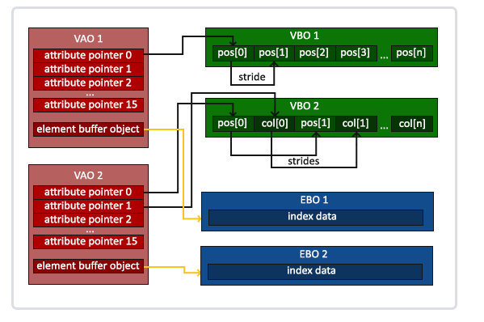


#### 着色器GLSL GL Shader Language

以上VAO, VBO, EBO用来描述形状, 而描述颜色则使用GLSL, 着色器是使用一种叫GLSL的类C语言写成的。

```
空	void	用于无返回值的函数或空的参数列表
标量	float, int, bool	浮点型，整型，布尔型的标量数据类型
浮点型向量	float, vec2, vec3, vec4	包含1，2，3，4个元素的浮点型向量
整数型向量	int, ivec2, ivec3, ivec4	包含1，2，3，4个元素的整型向量
布尔型向量	bool, bvec2, bvec3, bvec4	包含1，2，3，4个元素的布尔型向量
矩阵	mat2, mat3, mat4	尺寸为2x2，3x3，4x4的浮点型矩阵
纹理句柄	sampler2D, samplerCube	表示2D，立方体纹理的句柄
```

向量和矩阵的分量
```cpp
(x,y,z,w)	与位置相关的分量
(r,g,b,a)	与颜色相关的分量
(s,t,p,q)	与纹理坐标相关的分量

vec3 myVec3 = vec3(0.0, 1.0, 2.0); // myVec3 = {0.0, 1.0, 2.0}
vec3 temp;
temp = myVec3.xyz; // temp = {0.0, 1.0, 2.0}
temp = myVec3.xxx; // temp = {0.0, 0.0, 0.0}
temp = myVec3.zyx; // temp = {2.0, 1.0, 0.0}
```

GLSL对于向量矩阵的乘法采用矩阵乘法, 而不是bit-wise
```
vec3 v, u;
mat3 m;
u = v * m;

等价于
u.x = dot(v, m[0]); // m[0] is the left column of m
u.y = dot(v, m[1]); // dot(a,b) is the inner (dot) product of a and b
u.z = dot(v, m[2]);
```

GLSL可以还可以声明结构体和函数

```cpp
struct customStruct
{
	vec4 color;
	vec2 position;
} customVertex;

customVertex = customStruct(vec4(0.0, 1.0, 0.0, 0.0), // color
							vec2(0.5, 0.5)); 		  // position
// 数组
float floatArray[4];
vec4 vecArray[2];

// 函数
vec4 getPosition(){ 
    vec4 v4 = vec4(0.,0.,0.,1.);
    return v4;
}

void doubleSize(inout float size){
    size= size*2.0  ;
}
void main() {
    float psize= 10.0;
    doubleSize(psize);
    gl_Position = getPosition();
    gl_PointSize = psize;
}
```

每个着色器都有输入和输出，这样才能进行数据交流和传递。GLSL定义了in和out关键字专门来实现这个目的。每个着色器使用这两个关键字设定输入和输出，只要一个输出变量与下一个着色器阶段的输入匹配，它就会传递下去。但在顶点和片段着色器中会有点不同。

顶点着色器应该接收的是一种特殊形式的输入，否则就会效率低下。顶点着色器的输入特殊在，它从顶点数据中直接接收输入。为了定义顶点数据该如何管理，我们使用location这一元数据指定输入变量，这样我们才可以在CPU上配置顶点属性。

片段着色器，它需要一个vec4颜色输出变量，因为片段着色器需要生成一个最终输出的颜色。如果你在片段着色器没有定义输出颜色，OpenGL会把你的物体渲染为黑色（或白色）。

顶点着色器, layout(location=0)结合vec3, 表示每一行有三列数据输入, 通过vec3来接收
```
#version 330 core
layout (location = 0) in vec3 aPos; // 位置变量的属性位置值为0

out vec4 vertexColor; // 为片段着色器指定一个颜色输出

void main()
{
    gl_Position = vec4(aPos, 1.0); // 注意我们如何把一个vec3作为vec4的构造器的参数
    vertexColor = vec4(0.5, 0.0, 0.0, 1.0); // 把输出变量设置为暗红色
}
```

其中gl_Position固定的表示顶点坐标, 是一个四维向量
```cpp
    out gl_PerVertex {
        vec4 gl_Position;
        float gl_PointSize;
        float gl_ClipDistance[];
    };
```

片段着色器
```cpp
#version 330 core
out vec4 FragColor;

in vec4 vertexColor; // 从顶点着色器传来的输入变量（名称相同、类型相同） 为vec4

void main()
{
    FragColor = vertexColor;
}
```

* Uniform

uniform 是 GLSL 中的一种变量类型限定符，用于存储应用程序通过 GLSL 传递给着色器的只读值。uniform 可以用来存储着色器需要的各种数据，如变换矩阵、光参数和颜色等。传递给着色器的在所有的顶点着色器和片段着色器中保持不变的的任何参数，基本上都应该通过 uniform 来存储。


片段着色器中声明了一个uniform vec4的ourColor，并把片段着色器的输出颜色设置为uniform值的内容。

```
#version 330 core
out vec4 FragColor;

uniform vec4 ourColor; // 在OpenGL程序代码中设定这个变量

void main()
{
    FragColor = ourColor;
}
```

这次我们不去给像素传递单独一个颜色，而是让它随着时间改变颜色：
```cpp
while(!glfwWindowShouldClose(window))
{
    // 输入
    processInput(window);

    // 渲染
    // 清除颜色缓冲
    glClearColor(0.2f, 0.3f, 0.3f, 1.0f);
    glClear(GL_COLOR_BUFFER_BIT);

    // 记得激活着色器
    glUseProgram(shaderProgram);

    // 更新uniform颜色
    float timeValue = glfwGetTime();
    float greenValue = sin(timeValue) / 2.0f + 0.5f;
    int vertexColorLocation = glGetUniformLocation(shaderProgram, "ourColor");
    glUniform4f(vertexColorLocation, 0.0f, greenValue, 0.0f, 1.0f);

    // 绘制三角形
    glBindVertexArray(VAO);
    glDrawArrays(GL_TRIANGLES, 0, 3);

    // 交换缓冲并查询IO事件
    glfwSwapBuffers(window);
    glfwPollEvents();
}
```

自定义着色器类
```cpp
class Shader
{
public:
    unsigned int ID;
    // constructor generates the shader on the fly
    // ------------------------------------------------------------------------
    Shader(const char* vertexPath, const char* fragmentPath)
    {
      // 从文件中读取顶点着色器和片段着色器
        // 1. retrieve the vertex/fragment source code from filePath
        std::string vertexCode;
        std::string fragmentCode;
        std::ifstream vShaderFile;
        std::ifstream fShaderFile;
        // ensure ifstream objects can throw exceptions:
        vShaderFile.exceptions (std::ifstream::failbit | std::ifstream::badbit);
        fShaderFile.exceptions (std::ifstream::failbit | std::ifstream::badbit);
        try 
        {
            // open files
            vShaderFile.open(vertexPath);
            fShaderFile.open(fragmentPath);
            std::stringstream vShaderStream, fShaderStream;
            // read file's buffer contents into streams
            vShaderStream << vShaderFile.rdbuf();
            fShaderStream << fShaderFile.rdbuf();
            // close file handlers
            vShaderFile.close();
            fShaderFile.close();
            // convert stream into string
            vertexCode   = vShaderStream.str();
            fragmentCode = fShaderStream.str();
        }
        catch (std::ifstream::failure& e)
        {
            std::cout << "ERROR::SHADER::FILE_NOT_SUCCESFULLY_READ: " << e.what() << std::endl;
        }
        const char* vShaderCode = vertexCode.c_str();
        const char * fShaderCode = fragmentCode.c_str();
        // 2. compile shaders
        unsigned int vertex, fragment;
        // vertex shader
        vertex = glCreateShader(GL_VERTEX_SHADER);
        glShaderSource(vertex, 1, &vShaderCode, NULL);
        glCompileShader(vertex);
        checkCompileErrors(vertex, "VERTEX");
        // fragment Shader
        fragment = glCreateShader(GL_FRAGMENT_SHADER);
        glShaderSource(fragment, 1, &fShaderCode, NULL);
        glCompileShader(fragment);
        checkCompileErrors(fragment, "FRAGMENT");
        // shader Program 链接
        ID = glCreateProgram();
        glAttachShader(ID, vertex);
        glAttachShader(ID, fragment);
        glLinkProgram(ID);
        checkCompileErrors(ID, "PROGRAM");
        // delete the shaders as they're linked into our program now and no longer necessary
        glDeleteShader(vertex);
        glDeleteShader(fragment);
    }
    // activate the shader
    // ------------------------------------------------------------------------
    void use() 
    { 
        glUseProgram(ID); // 当前进程执行渲染工作
    }

        // utility function for checking shader compilation/linking errors.
    // ------------------------------------------------------------------------
    void checkCompileErrors(unsigned int shader, std::string type)
    {
        int success;
        char infoLog[1024];
        if (type != "PROGRAM")
        {
            glGetShaderiv(shader, GL_COMPILE_STATUS, &success);
            if (!success)
            {
                glGetShaderInfoLog(shader, 1024, NULL, infoLog);
                std::cout << "ERROR::SHADER_COMPILATION_ERROR of type: " << type << "\n" << infoLog << "\n -- --------------------------------------------------- -- " << std::endl;
            }
        }
        else
        {
            glGetProgramiv(shader, GL_LINK_STATUS, &success);
            if (!success)
            {
                glGetProgramInfoLog(shader, 1024, NULL, infoLog);
                std::cout << "ERROR::PROGRAM_LINKING_ERROR of type: " << type << "\n" << infoLog << "\n -- --------------------------------------------------- -- " << std::endl;
            }
        }
    }
};
```