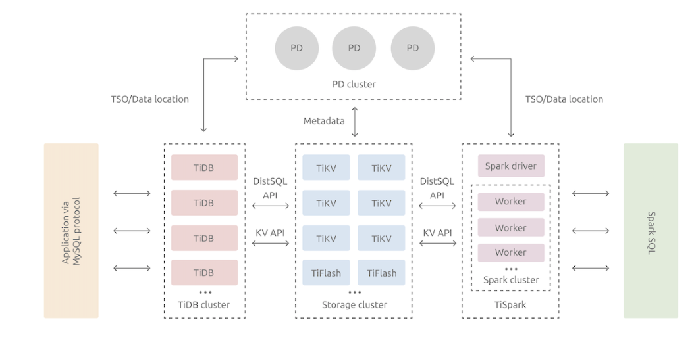
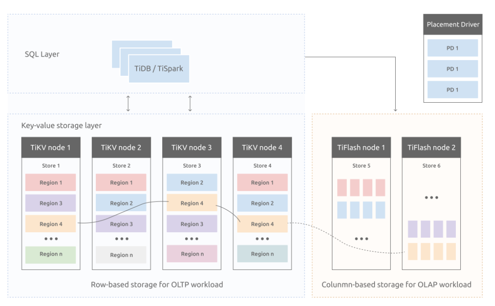
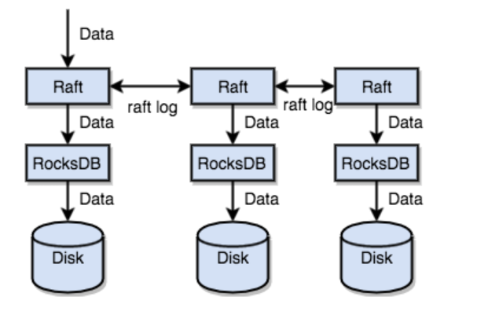
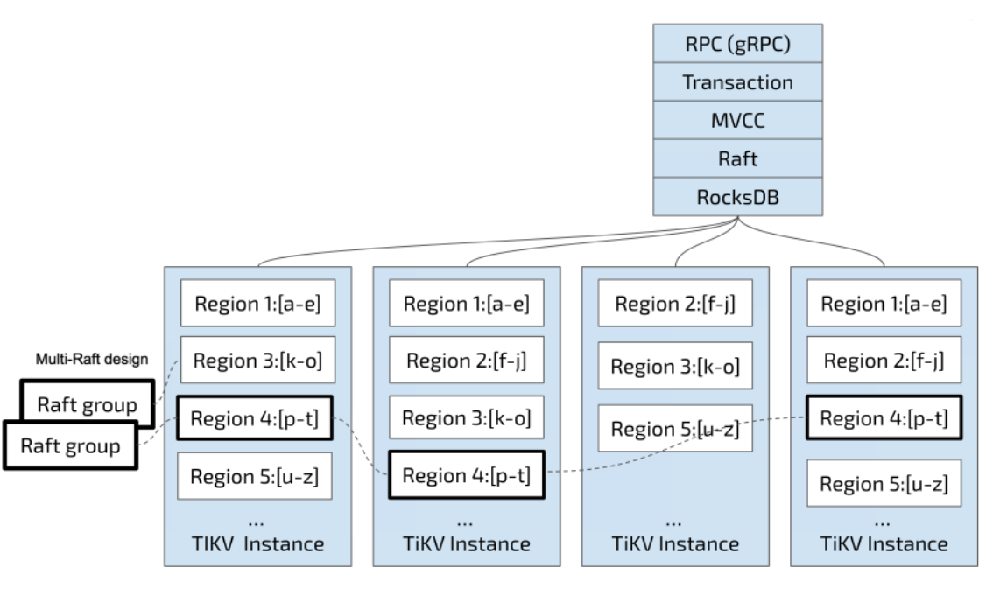

> TiDB

### 架构

As a distributed database, TiDB is designed to consist of multiple components. These components communicate with each other and form a complete TiDB system. The architecture is as follows:

<!-- more -->

The TiDB server is a stateless SQL layer that exposes the connection endpoint of the MySQL protocol to the outside. The TiDB server receives SQL requests, performs SQL parsing and optimization, and ultimately generates a distributed execution plan. It is horizontally scalable and provides the unified interface to the outside through the load balancing components such as Linux Virtual Server (LVS), HAProxy, or F5. It does not store data and is only for computing and SQL analyzing, transmitting actual data read request to TiKV nodes (or TiFlash nodes). TiDB server暴露了遵循MYSQL协议的SQL接口, TiDB server可以接收SQL请求, 解析和优化SQL, 最终生成分布式执行计划。服务可以支持横向扩展和负载均衡, 其不存储数据只会分析SQL, 将请求转发到TiKV 节点。

The PD server is the metadata managing component of the entire cluster. It stores metadata of real-time data distribution of every single TiKV node and the topology structure of the entire TiDB cluster, provides the TiDB Dashboard management UI, and allocates transaction IDs to distributed transactions. The PD server is "the brain" of the entire TiDB cluster because it not only stores metadata of the cluster, but also sends data scheduling command to specific TiKV nodes according to the data distribution state reported by TiKV nodes in real time. In addition, the PD server consists of three nodes at least and has high availability. It is recommended to deploy an odd number of PD nodes. PD server存放管理cluster的metaddata, 包括实时数据在TiKV节点的分布, TiDB cluster的拓扑结构, 分布式事务的ID. PD server可以认为是TiDB cluster的大脑因为它还肩负着向TiKV节点实时发送命令的功能, 为了保证可用性一般包含三个PD server

The TiKV server is responsible for storing data. TiKV is a distributed transactional key-value storage engine. Region is the basic unit to store data. Each Region stores the data for a particular Key Range which is a left-closed and right-open interval from StartKey to EndKey. Multiple Regions exist in each TiKV node. TiKV APIs provide native support to distributed transactions at the key-value pair level and supports the Snapshot Isolation level isolation by default. This is the core of how TiDB supports distributed transactions at the SQL level. After processing SQL statements, the TiDB server converts the SQL execution plan to an actual call to the TiKV API. Therefore, data is stored in TiKV. All the data in TiKV is automatically maintained in multiple replicas (three replicas by default), so TiKV has native high availability and supports automatic failover. TiKV server负责存储数据, 其作为分布式事务K-V存储引擎。 Regin是存储数据的基本单元, 每个Regin存储一定范围Key的数据. TiDB server将解析SQL得到的指令即调用TiKV的接口, 所有的数据自动维护多个副本

The TiFlash Server is a special type of storage server. Unlike ordinary TiKV nodes, TiFlash stores data by column, mainly designed to accelerate analytical processing. TiFlash是列式存储的引擎。

TiKV's choice is the Key-Value model and provides an ordered traversal method. TiKV does not write data directly on the disk, but stores data in RocksDB, which is responsible for the data storage. TiKV存储的Key是有序的, 底层存储引擎是RocksDB

A simple way is to replicate data to multiple machines, so that even if one machine fails, the replicas on other machines are still available. In other words, you need a data replication scheme that is reliable, efficient, and able to handle the situation of a failed replica. All of these are made possible by the Raft algorithm. 保持TiKV多副本高可用的手段是Raft共识算法 The Raft has several important features: 1.Leader election 2Membership changes (such as adding replicas, deleting replicas, transferring leaders, and so on)  3.Log replication

As mentioned earlier, TiKV can be regarded as a large, orderly KV Map, so data is distributed across multiple machines in order to achieve horizontal scalability. For a KV system, there are two typical solutions to distributing data across multiple machines: 一个KV Map往往要存放在多台机器上, 两种方法实现。一种是hash, 将key根据hash函数映射到某个节点上; 第二种是范围, 根据key所处的范围分配的对应的节点中. TiKV使用第二种方案

1. Hash: Create Hash by Key and select the corresponding storage node according to the Hash value.
2. Range: Divide ranges by Key, where a segment of serial Key is stored on a node.

First, data is divided into many Regions according to Key. 数据根据key分布在多个Region中, 每个Region可以存储在多个节点。由PD component确保Region均匀的分布在节点中(负载均衡)。使用Region逻辑存储key的原因是便于水平扩展。当然PD component会记住key位于哪个region中。The TiDB system has a PD component that is responsible for spreading Regions as evenly as possible across all nodes in the cluster. In this way, on one hand, the storage capacity is scaled horizontally (Regions on the other nodes are automatically scheduled to the newly added node); on the other hand, load balancing is achieved (the situation where one node has a lot of data while the others have little will not occur).

For the second task, TiKV replicates data in Regions, which means that data in one Region will have multiple replicas with the name “Replica”. Multiple Replicas of a Region are stored on different nodes to form a Raft Group, which is kept consistent through the Raft algorithm. 以region为单位的多副本基于Raft算法保持一致性, 对外数据可用性。

By default, all reads and writes are processed through the Leader, where reads are done and write are replicated to followers. The following diagram shows the whole picture about Region and Raft group.

Note that for multiple versions of the same Key, versions with larger numbers are placed first (see the Key-Value section where Keys are arranged in order), so that when you obtain Value through Key + Version, the Key of MVCC can be constructed with Key and Version, which is Key_Version. Then you can directly locate the first position greater than or equal to this Key_Version through RocksDB's SeekPrefix(Key_Version) API. 对多版本的同一个key, version值大的优先放置(在有序的key Map中, version值大的key放在前面)

