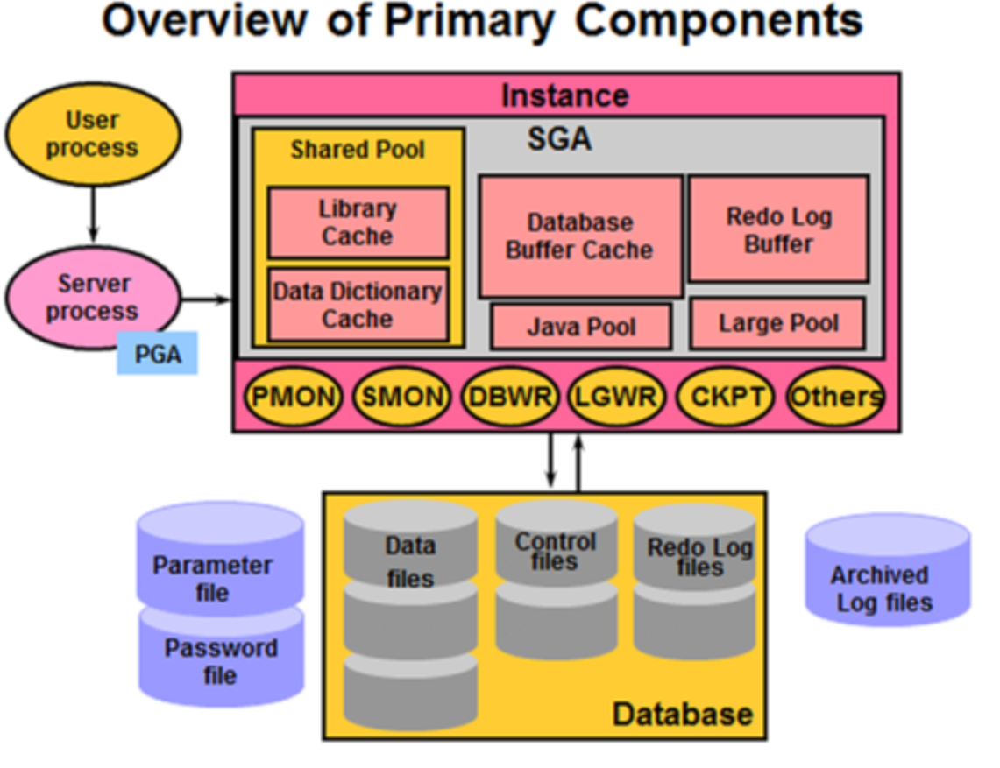
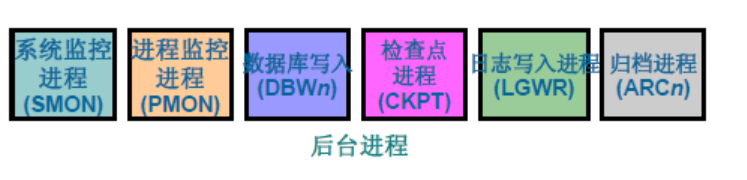
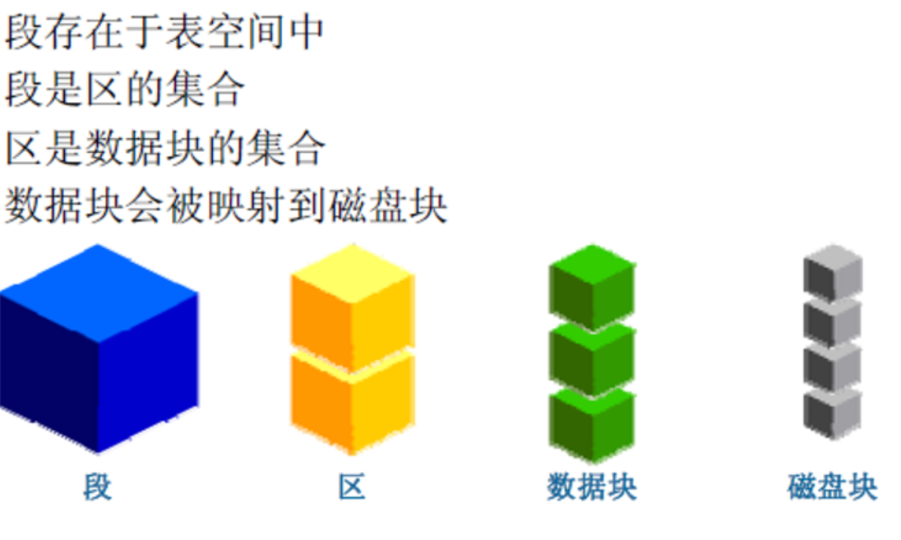
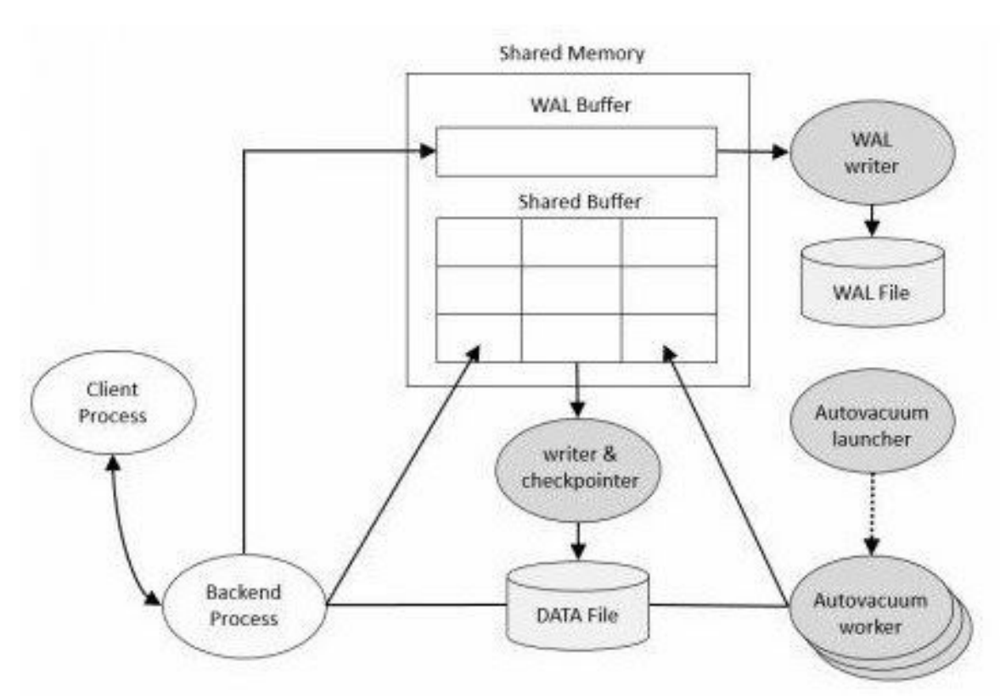
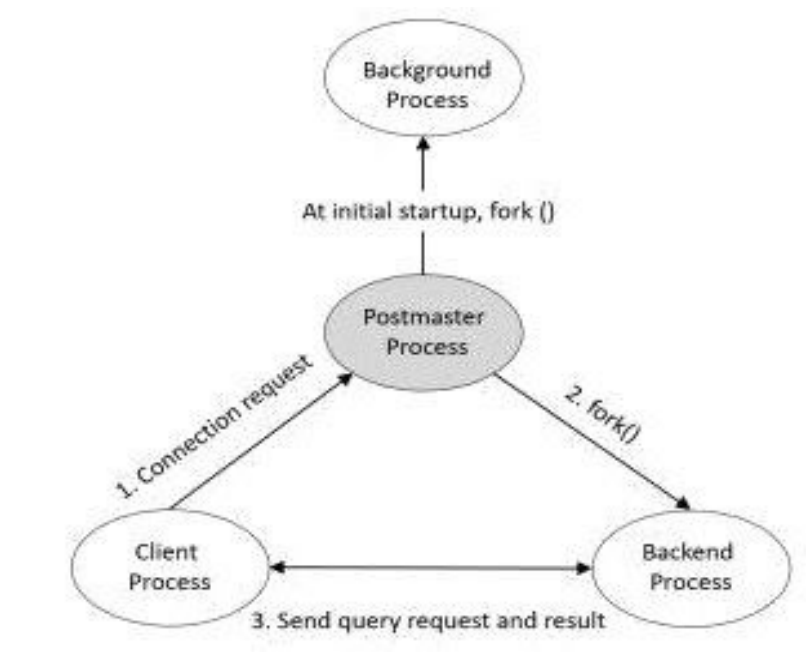
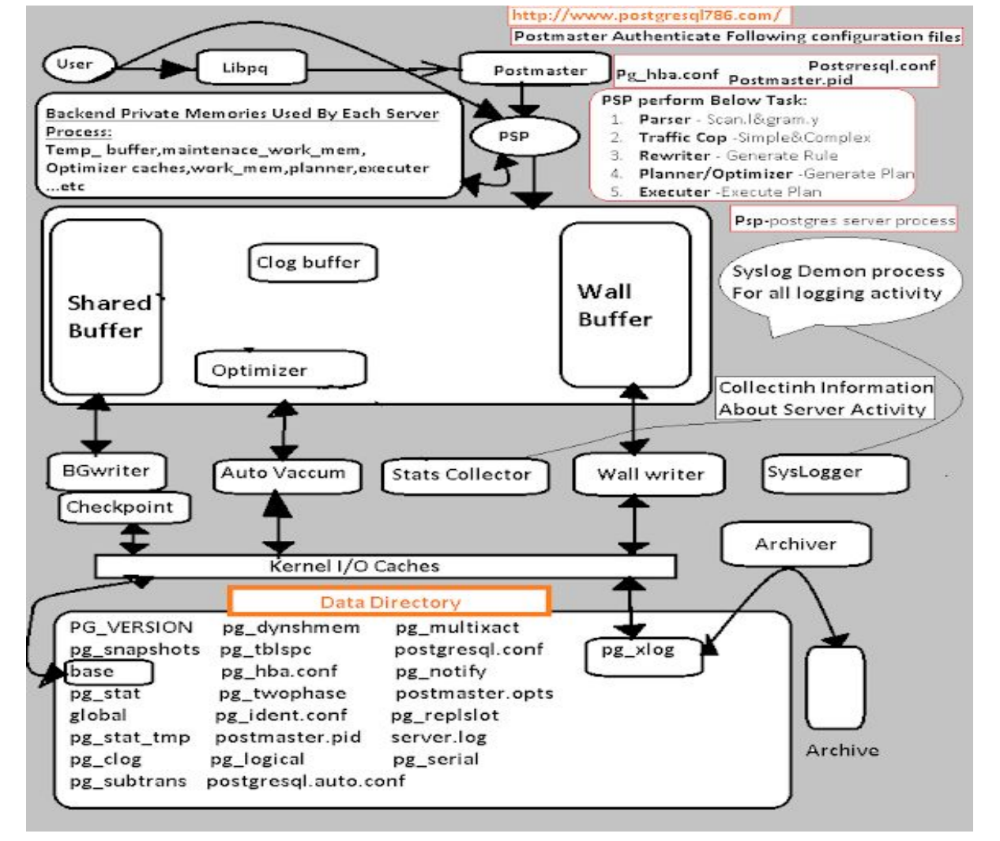
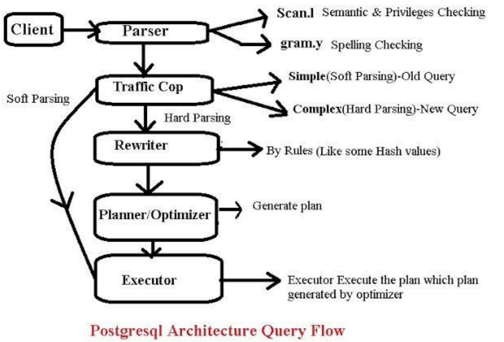
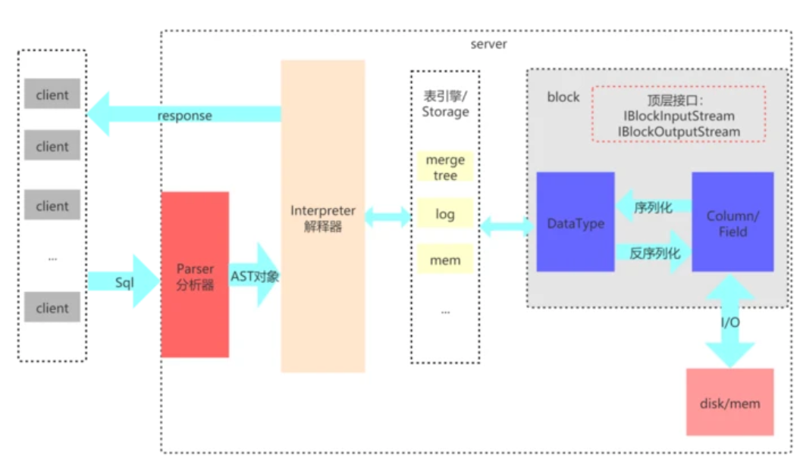
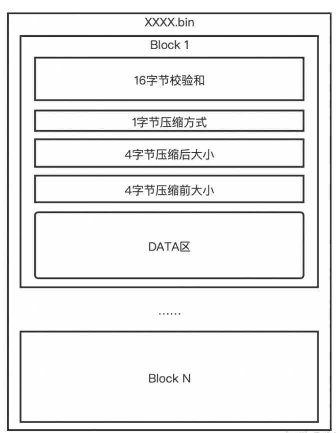

### oracle

一般所说的Oracle指的是Oracle RDBMS(Relational databases Management system)，一套Oracle数据库管理系统，也称之为Oracle Server。而Oracle Server主要有两大部分：Oracle Server = 实例 + 数据库 (Instance和Database是相互独立的)

数据库 = 数据文件 + 控制文件 +日志文件; 实例 = 内存池 + 后台进程

一台Oracle Server支持创建多个Database，而且每个Datacase是互相隔离而独立的。不同的Database拥有属于自己的全套相关文件，例如：有各自的密码文件，参数文件，数据文件，控制文件和日志文件。二维表存储在Database中，但Database的内容不能被用户直接读取，用户必须通过Oracle instance才能够访问Database，一个Instance只能连接一个Database，但是一个Database可以被多个Instance连接。

<!-- more -->

#### Instance

Oracle Instance主要由内存池SGA和后台进程组成。

进程结构主要有后台进程和用户连接进程两大类。后台进程主要是完成数据库管理任务 ，后台进程是Oracle Instance和Oracle Database的联系纽带，分为核心进程和非核心进程。

#### storage

表空间就是典型的Oracle逻辑结构类型 —— 里面存放着若干的数据文件

Database物理结构由若干文件组成即：磁盘上的物理文件，主要由数据文件、控制文件、重做日志文件、归档日志文件、参数文件、口令文件组成。

#### mysql和oracle区别

* 并发

MySQL以表级锁为主，对资源锁定的粒度很大，如果一个session对一个表加锁时间过长，会让其他session无法更新此表中的数据。虽然InnoDB引擎的表可以用行级锁，但这个行级锁的机制依赖于表的索引，如果表没有索引，或者sql语句没有使用索引，那么仍然使用表级锁。

Oracle使用行级锁，对资源锁定的粒度要小很多，只是锁定sql需要的资源，并且加锁是在数据库中的数据行上，不依赖与索引。所以Oracle对并发性的支持要好很多。

* 事务

MySQL在innodb存储引擎的行级锁的情况下才可支持事务，而Oracle则完全支持事务

* 工具

MySQL管理工具较少，在linux下的管理工具的安装有时要安装额外的包(phpmyadmin， etc)，有一定复杂性。

Oracle有多种成熟的命令行、图形界面、web管理工具，还有很多第三方的管理工具，管理极其方便高效。

* 存储引擎

Oracle和SQL Server等数据库中只有一种存储引擎,所有数据存储管理机制都是一样的

### PostgreSQL

In database jargon, PostgreSQL uses a client/server model. A PostgreSQL session
consists of the following cooperating processes (programs):

* A server process, which manages the database files, accepts connections to the database from client applications and performs database actions on behalf of the clients. The database server program is called Postgres.

* The user's client (frontend) application that wants to perform database operations. Client applications can be very diverse in nature: a client could be a text-oriented tool, a graphical application, a web server that accesses the database to display web pages, or a specialized database maintenance tool. Some client applications are supplied with the PostgreSQL distribution; most
are developed by users.

#### shared memory

Shared Memory refers to the memory reserved for database caching and transaction log caching. The most important elements in shared memory are Shared Buffer and WAL buffers

Shared Buffer, The purpose of Shared Buffer is to minimize DISK IO

WAL Buffer, The WAL buffer is a buffer that temporarily stores changes to the database

PostgreSQL has four process types.
1. Postmaster (Daemon) Process
2. Background Process
3. Backend Process
4. Client Process

Architecture Explanation With Query Flow

Postgresql Query Flow

#### storage

* databases

PostgreSQL consists of several databases. This is called a database cluster. When initdb () is executed, template0 , template1 , and postgres databases
are created.

The template0 and template1 databases are template databases for user database creation and contain the system catalog tables.
The list of tables in the template0 and template1 databases is the same immediately after initdb (). However, the template1 database can create
objects that the user needs.

The user database is created by cloning the template1 database.

* tablespaces

The pg_default and pg_global tablespaces are created immediately after initdb(). If you do not specify a tablespace at the time of table creation, it is stored in the pg_dafault tablespace. Tables managed at the database cluster level are stored in the pg_global tablespace.

The physical location of the pg_default tablespace is $PGDATA\base.
The physical location of the pg_global tablespace is $PGDATA\global.

One tablespace can be used by multiple databases. At this time, adatabase-specific subdirectory is created in the table space directory.Creating a user tablespace creates a symbolic link to the user tablespace in the $PGDATA\tblspc directory

#### 和mysql的区别

PostgreSQL 的稳定性极强， Innodb 等引擎在崩溃、断电之类的灾难场景下抗打击能力有了长足进步，然而很多 MySQL 用户都遇到过Server级的数据库丢失的场景——mysql系统库是MyISAM的，相比之下，PG数据库这方面要好一些。

任何系统都有它的性能极限，在高并发读写，负载逼近极限下，PG的性能指标仍可以维持双曲线甚至对数曲线，到顶峰之后不再下降，而 MySQL 明显出现一个波峰后下滑（5.5版本之后，在企业级版本中有个插件可以改善很多，不过需要付费）

PG 多年来在 GIS 领域处于优势地位，因为它有丰富的几何类型，实际上不止几何类型，PG有大量字典、数组、bitmap 等数据类型，相比之下mysql就差很多，instagram就是因为PG的空间数据库扩展POSTGIS远远强于MYSQL的my spatial而采用PGSQL的。

PG有极其强悍的 SQL 编程能力（9.x 图灵完备，支持递归！），有非常丰富的统计函数和统计语法支持，比如分析函数（ORACLE的叫法，PG里叫window函数），还可以用多种语言来写存储过程，对于R的支持也很好。这一点上MYSQL就差的很远，很多分析功能都不支持

http://bbs.chinaunix.net/thread-1688208-1-1.html

### clickhouse

* Parser与Interpreter

Parser和Interpreter是非常重要的两组接口：Parser分析器是将sql语句已递归的方式形成AST语法树的形式，并且不同类型的sql都会调用不同的parse实现类。而Interpreter解释器则负责解释AST，并进一步创建查询的执行管道。Interpreter解释器的作用就像Service服务层一样，起到串联整个查询过程的作用，它会根据解释器的类型，聚合它所需要的资源。首先它会解析AST对象；然后执行"业务逻辑" ( 例如分支判断、设置参数、调用接口等 )；最终返回IBlock对象，以线程的形式建立起一个查询执行管道。

* 表引擎

clickhouse有很多种表引擎。不同的表引擎由不同的子类实现。表引擎是使用IStorage接口的，该接口定义了DDL ( 如ALTER、RENAME、OPTIMIZE和DROP等 ) 、read和write方法，它们分别负责数据的定义、查询与写入。

* DataType

数据的序列化和反序列化工作由DataType负责。根据不同的数据类型，IDataType接口会有不同的实现类。DataType虽然会对数据进行正反序列化，但是它不会直接和内存或者磁盘做交互，而是转交给Column和Field处理。

* Column与Field

Column和Field是ClickHouse数据最基础的映射单元。作为一款百分之百的列式存储数据库，ClickHouse按列存储数据，内存中的一列数据由一个Column对象表示。Column对象分为接口和实现两个部分，在IColumn接口对象中，定义了对数据进行各种关系运算的方法，例如插入数据的insertRangeFrom和insertFrom方法、用于分页的cut，以及用于过滤的filter方法等, 显然给予列式存储的数据更容易执行数据运算, 也就是数据分析。

* Block

ClickHouse内部的数据操作是面向Block对象进行的，并且采用了流的形式。虽然Column和Filed组成了数据的基本映射单元，但对应到实际操作，它们还缺少了一些必要的信息，比如数据的类型及列的名称。于是ClickHouse设计了Block对象，Block对象可以看作数据表的子集。Block对象的本质是由数据对象、数据类型和列名称组成的三元组，即Column、DataType及列名称字符串。

#### storage

clickhouse通过block的设计来实现批处理。clickhouse能处理的最小单位是block，block就是一群行的集合，默认最大8192行组成一个block。批处理可以执行压缩, 通过批处理压缩，再次降低了6倍的文件大小,也就是说再次减少6倍的磁盘IO时间。

clickhouse通过lsm实现预排序, 在都使用了索引的情况下，如果是按值查询那么有序存储和无序存储基本都能做到一次磁盘IO就能实现数据读取。但按范围读取，因为是有序存储，因此只需要一次对磁盘的访问即可读取所有数据。而对于无序存储的数据来说，最坏的情况可能需要读取n次磁盘。

任何架构都有两面性，在节省磁盘读取时间的情况下，也带来了如下缺点：
1. 适合数据的大批量写入，如果写入频繁，会影响写入性能
2. 如果范围查询的数据量小，那么性能提升会低。因此数据量太小时无法发挥最大优势。
3. 由于按照block作为最小处理单位，因此删除单条数据性能不高。修改的性能很差，尤其是修改了用于排序的列(改完要重新排序)。因此不适合做事务型数据库。

数据文件结构

* 索引

其实clickhouse的一级索引非常简单，只需要记录每一个block第一个值即可。clickhouse的数据存储文件中，一级索引存在于primary.idx中。一级索引的本质是存储了每个block中数据的最小值，从而为确定需要查询的数据确定好其所在的block。

1亿条数据只需要1万多行的索引，因此一级索引可以常驻内存，加速查找

LSM tree相关论文 

https://link.springer.com/content/pdf/10.1007/s00778-019-00555-y.pdf