> 游戏开发http://www.aisharing.com/sitemap

### OpenGL

#### 纹理Texture

我们可以为每个顶点添加颜色来增加图形的细节，从而创建出有趣的图像。但是，如果想让图形看起来更真实，我们就必须有足够多的顶点，从而指定足够多的颜色。这将会产生很多额外开销，因为每个模型都会需求更多的顶点，每个顶点又需求一个颜色属性。

艺术家和程序员更喜欢使用纹理(Texture)。纹理是一个2D图片（甚至也有1D和3D的纹理），它可以用来添加物体的细节；你可以想象纹理是一张绘有砖块的纸，无缝折叠贴合到你的3D的房子上，这样你的房子看起来就像有砖墙外表了。因为我们可以在一张图片上插入非常多的细节，这样就可以让物体非常精细而不用指定额外的顶点。

每个顶点就会关联着一个纹理坐标(Texture Coordinate)，用来标明该从纹理图像的哪个部分采样（顶点需要从该位置读取纹理图像的数据）。之后在图形的其它片段上进行片段插值(Fragment Interpolation)。 纹理坐标在x和y轴上，范围为0到1之间（注意我们使用的是2D纹理图像）。使用纹理坐标获取纹理颜色叫做采样(Sampling)。纹理坐标起始于(0, 0)，也就是纹理图片的左下角，终始于(1, 1)，即纹理图片的右上角。

纹理坐标的范围通常是从(0, 0)到(1, 1)，那如果我们把纹理坐标设置在范围之外会发生什么？OpenGL默认的行为是重复这个纹理图像

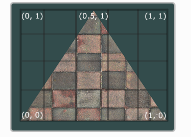

```cpp
GLfloat texCoords[] = {
    0.0f, 0.0f, // 左下角
    1.0f, 0.0f, // 右下角
    0.5f, 1.0f // 上中
};
```

<!-- more -->

* 纹理过滤

纹理坐标不依赖于分辨率(Resolution)，它可以是任意浮点值，所以OpenGL需要知道怎样将纹理像素(Texture Pixel，也叫Texel，译注1)映射到纹理坐标。

GL_NEAREST（也叫邻近过滤，Nearest Neighbor Filtering）是OpenGL默认的纹理过滤方式。当设置为GL_NEAREST的时候，OpenGL会选择中心点最接近纹理坐标的那个像素。

GL_LINEAR（也叫线性过滤，(Bi)linear Filtering）它会基于纹理坐标附近的纹理像素，计算出一个插值，近似出这些纹理像素之间的颜色。

GL_NEAREST产生了颗粒状的图案，我们能够清晰看到组成纹理的像素，而GL_LINEAR能够产生更平滑的图案，很难看出单个的纹理像素。


* 生成纹理

和之前生成的OpenGL对象一样，纹理也是使用ID引用的

```cpp
GLuint texture;
glGenTextures(1, &texture);
glBindTexture(GL_TEXTURE_2D, texture);
// 为当前绑定的纹理对象设置环绕、过滤方式
...
// 加载并生成纹理
int width, height;
unsigned char* image = SOIL_load_image("container.jpg", &width, &height, 0, SOIL_LOAD_RGB);
// 使用前面载入的图片数据生成一个纹理了
glTexImage2D(GL_TEXTURE_2D, 0, GL_RGB, width, height, 0, GL_RGB, GL_UNSIGNED_BYTE, image);
glGenerateMipmap(GL_TEXTURE_2D);
// 生成了纹理和相应的多级渐远纹理后，释放图像的内存并解绑纹理对象是一个很好的习惯。
SOIL_free_image_data(image);
glBindTexture(GL_TEXTURE_2D, 0); 
```

纹理特征放到坐标中
```cpp
GLfloat vertices[] = {
//     ---- 位置 ----       ---- 颜色 ----     - 纹理坐标 -
     0.5f,  0.5f, 0.0f,   1.0f, 0.0f, 0.0f,   1.0f, 1.0f,   // 右上
     0.5f, -0.5f, 0.0f,   0.0f, 1.0f, 0.0f,   1.0f, 0.0f,   // 右下
    -0.5f, -0.5f, 0.0f,   0.0f, 0.0f, 1.0f,   0.0f, 0.0f,   // 左下
    -0.5f,  0.5f, 0.0f,   1.0f, 1.0f, 0.0f,   0.0f, 1.0f    // 左上
};

glVertexAttribPointer(2, 2, GL_FLOAT,GL_FALSE, 8 * sizeof(GLfloat), (GLvoid*)(6 * sizeof(GLfloat)));
glEnableVertexAttribArray(2);
```

我们需要调整顶点着色器使其能够接受顶点坐标为一个顶点属性，并把坐标传给片段着色器
```cpp
#version 330 core
layout (location = 0) in vec3 position;
layout (location = 1) in vec3 color;
layout (location = 2) in vec2 texCoord;

out vec3 ourColor;
out vec2 TexCoord;

void main()
{
    gl_Position = vec4(position, 1.0f);
    ourColor = color;
    TexCoord = texCoord;
}
```

片段着色器也应该能访问纹理对象，但是我们怎样能把纹理对象传给片段着色器呢？GLSL有一个供纹理对象使用的内建数据类型，叫做采样器(Sampler)，它以纹理类型作为后缀，比如sampler1D、sampler3D，或在我们的例子中的sampler2D。我们可以简单声明一个uniform sampler2D把一个纹理添加到片段着色器中，稍后我们会把纹理赋值给这个uniform。

```cpp
#version 330 core
in vec3 ourColor;
in vec2 TexCoord;

out vec4 color;
// ourTexture表示纹理图片
uniform sampler2D ourTexture;

void main()
{
    color = texture(ourTexture, TexCoord);
}
```

调用glDrawElements之前绑定纹理了，它会自动把纹理赋值给片段着色器的采样器：
```cpp
glBindTexture(GL_TEXTURE_2D, texture);
glBindVertexArray(VAO);
glDrawElements(GL_TRIANGLES, 6, GL_UNSIGNED_INT, 0);
glBindVertexArray(0);
```

#### 变换

向量与标量运算, 向量取反, 向量加减, 向量点乘, 向量叉乘

矩阵的加减, 矩阵的数乘, 矩阵相乘

单位矩阵, 缩放, 

位移, 旋转

缩放

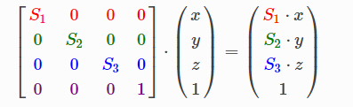

位移

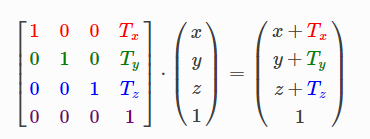

沿x轴旋转

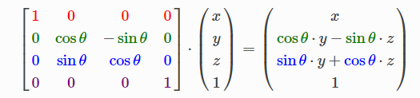

沿y轴旋转

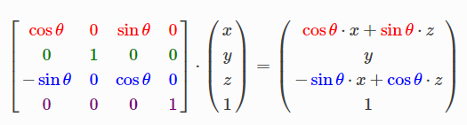

让图形旋转


我们通过在顶点着色器的

```cpp
// transform.vs

#version 330 core
layout (location = 0) in vec3 aPos;
layout (location = 1) in vec2 aTexCoord;

out vec2 TexCoord;

uniform mat4 transform; // uniform可以理解为着色器和程序交换数据的变量, 着色器运行在GPU而程序运行在CPU

void main()
{
	gl_Position = transform * vec4(aPos, 1.0);  //  gl_Position 是顶点着色器裁切空间输出的位置向量。如果你想让屏幕上渲染出东西 gl_Position 必须使用
	TexCoord = vec2(aTexCoord.x, aTexCoord.y);
}

// transform.fs
#version 330 core
out vec4 FragColor;

in vec2 TexCoord;

// texture samplers
uniform sampler2D texture1;
uniform sampler2D texture2;

void main()
{
	// linearly interpolate between both textures (80% container, 20% awesomeface)
	FragColor = mix(texture(texture1, TexCoord), texture(texture2, TexCoord), 0.2);
}
```


```cpp
#include <glad/glad.h>
#include <GLFW/glfw3.h>
#include <stb/stb_image.h>

#include <glm/glm.hpp>
#include <glm/gtc/matrix_transform.hpp>
#include <glm/gtc/type_ptr.hpp>

#include "shader_s.h"

#include <iostream>

void framebuffer_size_callback(GLFWwindow* window, int width, int height);
void processInput(GLFWwindow* window);

// settings
const unsigned int SCR_WIDTH = 800;
const unsigned int SCR_HEIGHT = 600;

int main()
{
    // glfw: initialize and configure
    // ------------------------------
    glfwInit();
    glfwWindowHint(GLFW_CONTEXT_VERSION_MAJOR, 3);
    glfwWindowHint(GLFW_CONTEXT_VERSION_MINOR, 3);
    glfwWindowHint(GLFW_OPENGL_PROFILE, GLFW_OPENGL_CORE_PROFILE);

#ifdef __APPLE__
    glfwWindowHint(GLFW_OPENGL_FORWARD_COMPAT, GL_TRUE);
#endif

    // glfw window creation
    // --------------------
    GLFWwindow* window = glfwCreateWindow(SCR_WIDTH, SCR_HEIGHT, "LearnOpenGL", NULL, NULL);
    if (window == NULL)
    {
        std::cout << "Failed to create GLFW window" << std::endl;
        glfwTerminate();
        return -1;
    }
    glfwMakeContextCurrent(window);
    glfwSetFramebufferSizeCallback(window, framebuffer_size_callback);

    // glad: load all OpenGL function pointers
    // ---------------------------------------
    if (!gladLoadGLLoader((GLADloadproc)glfwGetProcAddress))
    {
        std::cout << "Failed to initialize GLAD" << std::endl;
        return -1;
    }

    // build and compile our shader zprogram
    // ------------------------------------
    Shader ourShader("transform.vs", "transform.fs");

    // set up vertex data (and buffer(s)) and configure vertex attributes
    // ------------------------------------------------------------------
    float vertices[] = {
        // positions          // texture coords
         0.5f,  0.5f, 0.0f,   1.0f, 1.0f, // top right
         0.5f, -0.5f, 0.0f,   1.0f, 0.0f, // bottom right
        -0.5f, -0.5f, 0.0f,   0.0f, 0.0f, // bottom left
        -0.5f,  0.5f, 0.0f,   0.0f, 1.0f  // top left 
    };
    unsigned int indices[] = {
        0, 1, 3, // first triangle
        1, 2, 3  // second triangle
    };
    unsigned int VBO, VAO, EBO;
    glGenVertexArrays(1, &VAO);
    glGenBuffers(1, &VBO);
    glGenBuffers(1, &EBO);

    glBindVertexArray(VAO);

    glBindBuffer(GL_ARRAY_BUFFER, VBO);
    glBufferData(GL_ARRAY_BUFFER, sizeof(vertices), vertices, GL_STATIC_DRAW);

    glBindBuffer(GL_ELEMENT_ARRAY_BUFFER, EBO);
    glBufferData(GL_ELEMENT_ARRAY_BUFFER, sizeof(indices), indices, GL_STATIC_DRAW);

    // position attribute
    glVertexAttribPointer(0, 3, GL_FLOAT, GL_FALSE, 5 * sizeof(float), (void*)0);
    glEnableVertexAttribArray(0);
    // texture coord attribute
    glVertexAttribPointer(1, 2, GL_FLOAT, GL_FALSE, 5 * sizeof(float), (void*)(3 * sizeof(float)));
    glEnableVertexAttribArray(1);


    // load and create a texture 
    // -------------------------
    unsigned int texture1, texture2;
    // texture 1
    // ---------
    glGenTextures(1, &texture1);
    glBindTexture(GL_TEXTURE_2D, texture1);
    // set the texture wrapping parameters
    glTexParameteri(GL_TEXTURE_2D, GL_TEXTURE_WRAP_S, GL_REPEAT);
    glTexParameteri(GL_TEXTURE_2D, GL_TEXTURE_WRAP_T, GL_REPEAT);
    // set texture filtering parameters
    glTexParameteri(GL_TEXTURE_2D, GL_TEXTURE_MIN_FILTER, GL_LINEAR);
    glTexParameteri(GL_TEXTURE_2D, GL_TEXTURE_MAG_FILTER, GL_LINEAR);
    // load image, create texture and generate mipmaps
    int width, height, nrChannels;
    stbi_set_flip_vertically_on_load(true); // tell stb_image.h to flip loaded texture's on the y-axis.
    unsigned char* data = stbi_load("D:\\container.jpg", &width, &height, &nrChannels, 0);  // 读入图片
    if (data)
    {
        glTexImage2D(GL_TEXTURE_2D, 0, GL_RGB, width, height, 0, GL_RGB, GL_UNSIGNED_BYTE, data);
        glGenerateMipmap(GL_TEXTURE_2D);
    }
    else
    {
        std::cout << "Failed to load texture" << std::endl;
    }
    stbi_image_free(data);
    // texture 2
    // ---------
    glGenTextures(1, &texture2);
    glBindTexture(GL_TEXTURE_2D, texture2);
    // set the texture wrapping parameters
    glTexParameteri(GL_TEXTURE_2D, GL_TEXTURE_WRAP_S, GL_REPEAT);
    glTexParameteri(GL_TEXTURE_2D, GL_TEXTURE_WRAP_T, GL_REPEAT);
    // set texture filtering parameters
    glTexParameteri(GL_TEXTURE_2D, GL_TEXTURE_MIN_FILTER, GL_LINEAR);
    glTexParameteri(GL_TEXTURE_2D, GL_TEXTURE_MAG_FILTER, GL_LINEAR);
    // load image, create texture and generate mipmaps
    data = stbi_load("D:\\awesomeface.png", &width, &height, &nrChannels, 0);
    if (data)
    {
        // note that the awesomeface.png has transparency and thus an alpha channel, so make sure to tell OpenGL the data type is of GL_RGBA
        glTexImage2D(GL_TEXTURE_2D, 0, GL_RGB, width, height, 0, GL_RGBA, GL_UNSIGNED_BYTE, data);
        glGenerateMipmap(GL_TEXTURE_2D);
    }
    else
    {
        std::cout << "Failed to load texture" << std::endl;
    }
    stbi_image_free(data);

    // tell opengl for each sampler to which texture unit it belongs to (only has to be done once)
    // -------------------------------------------------------------------------------------------
    ourShader.use();
    ourShader.setInt("texture1", 0);
    ourShader.setInt("texture2", 1);


    // render loop
    // -----------
    while (!glfwWindowShouldClose(window))
    {
        // input
        // -----
        processInput(window);

        // render
        // ------
        glClearColor(0.2f, 0.3f, 0.3f, 1.0f);
        glClear(GL_COLOR_BUFFER_BIT);

        // bind textures on corresponding texture units
        glActiveTexture(GL_TEXTURE0);
        glBindTexture(GL_TEXTURE_2D, texture1);
        glActiveTexture(GL_TEXTURE1);
        glBindTexture(GL_TEXTURE_2D, texture2);

        // create transformations
        glm::mat4 transform = glm::mat4(1.0f); // make sure to initialize matrix to identity matrix first
        transform = glm::translate(transform, glm::vec3(0.5f, -0.5f, 0.0f));
        // transform随着时间增大, 起到旋转的作用
        transform = glm::rotate(transform, (float)glfwGetTime(), glm::vec3(0.0f, 0.0f, 1.0f));

        // get matrix's uniform location and set matrix 更新着色器 实际调用glUseProgram(ID);
        ourShader.use();
        unsigned int transformLoc = glGetUniformLocation(ourShader.ID, "transform");
        // 将矩阵transform发送给着色器transform的位置transformLoc
        glUniformMatrix4fv(transformLoc, 1, GL_FALSE, glm::value_ptr(transform));

        // render container
        glBindVertexArray(VAO);
        glDrawElements(GL_TRIANGLES, 6, GL_UNSIGNED_INT, 0);

        // glfw: swap buffers and poll IO events (keys pressed/released, mouse moved etc.)
        // -------------------------------------------------------------------------------
        glfwSwapBuffers(window);
        glfwPollEvents();
    }

    // optional: de-allocate all resources once they've outlived their purpose:
    // ------------------------------------------------------------------------
    glDeleteVertexArrays(1, &VAO);
    glDeleteBuffers(1, &VBO);
    glDeleteBuffers(1, &EBO);

    // glfw: terminate, clearing all previously allocated GLFW resources.
    // ------------------------------------------------------------------
    glfwTerminate();
    return 0;
}

// process all input: query GLFW whether relevant keys are pressed/released this frame and react accordingly
// ---------------------------------------------------------------------------------------------------------
void processInput(GLFWwindow* window)
{
    if (glfwGetKey(window, GLFW_KEY_ESCAPE) == GLFW_PRESS)
        glfwSetWindowShouldClose(window, true);
}

// glfw: whenever the window size changed (by OS or user resize) this callback function executes
// ---------------------------------------------------------------------------------------------
void framebuffer_size_callback(GLFWwindow* window, int width, int height)
{
    // make sure the viewport matches the new window dimensions; note that width and 
    // height will be significantly larger than specified on retina displays.
    glViewport(0, 0, width, height);
}
```


#### 坐标系统
坐标系统是实现3d对象的必要手段, 核心是投影和三个矩阵, 模型(Model)、观察(View)、投影(Projection)三个矩阵

将坐标转换为标准化设备坐标，接着再转化为屏幕坐标的过程通常是分步, 比较重要的总共有5个不同的坐标系统

```
局部空间(Local Space，或者称为物体空间(Object Space))
世界空间(World Space)
观察空间(View Space，或者称为视觉空间(Eye Space))
裁剪空间(Clip Space)
屏幕空间(Screen Space)
```

为了将坐标从一个坐标系转换到另一个坐标系，我们需要用到几个转换矩阵，最重要的几个分别是模型(Model)、视图(View)、投影(Projection)三个矩阵。首先，顶点坐标开始于局部空间(Local Space)，称为局部坐标(Local Coordinate)，然后经过世界坐标(World Coordinate)，观察坐标(View Coordinate)，裁剪坐标(Clip Coordinate)，并最后以屏幕坐标(Screen Coordinate)结束。坐标系统的转换是通过矩阵实现的

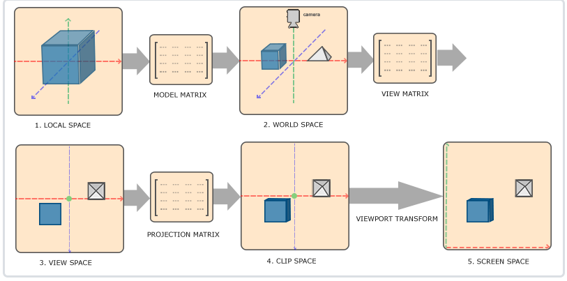

1. 局部坐标是对象相对于局部原点的坐标，也是物体起始的坐标。

2. 下一步是将局部坐标变换为世界空间坐标，世界空间坐标是处于一个更大的空间范围的。这些坐标相对于世界的全局原点，它们会和其它物体一起相对于世界的原点进行摆放。一般的在游戏中, 世界坐标指的是指顶点相对于（游戏）世界的坐标。物体的坐标将会从局部变换到世界空间；该变换是由模型矩阵(Model Matrix)实现的。

3. 接下来我们将世界坐标变换为观察空间坐标，使得每个坐标都是从摄像机或者说观察者的角度进行观察的。观察空间经常被人们称之OpenGL的摄像机(Camera)（所以有时也称为摄像机空间(Camera Space)或视觉空间(Eye Space)）。通常是由一系列的位移和旋转的组合来完成，平移/旋转场景从而使得特定的对象被变换到摄像机的前方。这些组合在一起的变换通常存储在一个观察矩阵(View Matrix)里, 观察空间后就有立体的感觉了。

4. 坐标到达观察空间之后，我们需要将其投影到裁剪坐标。裁剪坐标会被处理至-1.0到1.0的范围内，并判断哪些顶点将会出现在屏幕上。将顶点坐标从观察变换到裁剪空间，我们需要定义一个投影矩阵(Projection Matrix)，裁剪坐标下呈现出透视(越远的越小)或者平行的感觉


5. 最后，我们将裁剪坐标变换为屏幕坐标，我们将使用一个叫做视口变换(Viewport Transform)的过程。视口变换将位于-1.0到1.0范围的坐标变换到由glViewport函数所定义的坐标范围内。最后变换出来的坐标将会送到光栅器，将其转化为片段。

$V_{clip} = M_{projection} * M_{view} * M_{model} * V_{local}$

以上最终的效果是, 将一个3D坐标转换成在屏幕现实的2D坐标


* 投影

为了将顶点坐标从观察空间转换到裁剪空间，我们需要定义一个投影矩阵(Projection Matrix)，它指定了坐标的范围

正射投影(Orthographic Projection)矩阵定义了一个类似立方体的平截头体，指定了一个裁剪空间，每一个在这空间外面的顶点都会被裁剪。

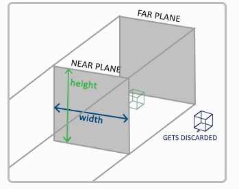

透视投影

它是使用透视投影矩阵来完成的。这个投影矩阵不仅将给定的平截头体范围映射到裁剪空间，同样还修改了每个顶点坐标的w值，从而使得离观察者越远的顶点坐标w分量越大。

* 右手坐标系(Right-handed System)

OpenGL表示3D场景的是一个右手坐标系

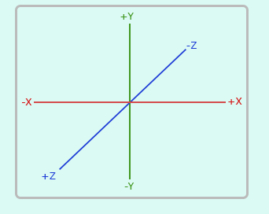

#### 3D形状

在显示3D形状时, OpenGL存储它的所有深度信息于一个Z缓冲(Z-buffer)中，也被称为深度缓冲(Depth Buffer), 对不透光的物体,用户只能看到最近的平面。GLFW会自动为你生成这样一个缓冲（就像它也有一个颜色缓冲来存储输出图像的颜色）。深度值存储在每个片段里面（作为片段的z值），当片段想要输出它的颜色时，OpenGL会将它的深度值和z缓冲进行比较，如果当前的片段在其它片段之后，它将会被丢弃，否则将会覆盖。这个过程称为深度测试(Depth Testing)，它是由OpenGL自动完成的。

#### 摄像机Camera

摄像机/观察空间(Camera/View Space)的时候，是在讨论以摄像机的视角作为场景原点时场景中所有的顶点坐标：观察矩阵把所有的世界坐标变换为相对于摄像机位置与方向的观察坐标。

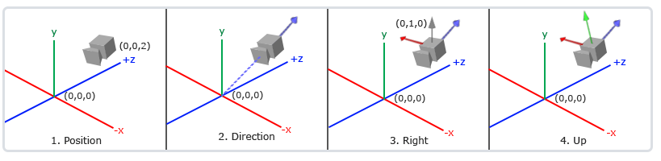

* 设置摄像机位置

```cpp
glm::vec3 cameraPos = glm::vec3(0.0f, 0.0f, 3.0f);  、// 摄像机位置是(0,0,3)
```

* 摄像机方向

```cpp
glm::vec3 cameraTarget = glm::vec3(0.0f, 0.0f, 0.0f);   // 摄像机指向原点位置
glm::vec3 cameraDirection = glm::normalize(cameraPos - cameraTarget);   // 摄像机指向射线构成的向量
```

* 右轴

右向量(Right Vector)，它代表摄像机空间的x轴的正方向。为获取右向量我们可以: 先定义一个上向量(Up Vector)。接下来把上向量和第二步得到的方向向量进行叉乘。两个向量叉乘的结果会同时垂直于两向量，因此我们会得到指向x轴正方向的那个向量

```cpp
glm::vec3 up = glm::vec3(0.0f, 1.0f, 0.0f); 
glm::vec3 cameraRight = glm::normalize(glm::cross(up, cameraDirection));    // 右向量， glm::normalize归一化

glm::vec3 cameraUp = glm::cross(cameraDirection, cameraRight);  
```

* Look At

LookAt矩阵作用是, 通过与某向量来将其该向量变换到LookAt矩阵定义的坐标空间(即以摄像机为原点定义的坐标系)

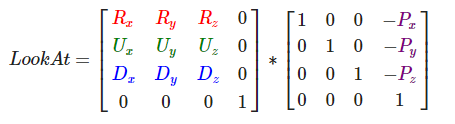

其中R是右向量，U是上向量，D是方向向量P是摄像机位置向量。注意，位置向量是相反的，因为我们最终希望把世界平移到与我们自身移动的相反方向。

GLM已经提供了这些支持。我们要做的只是定义一个摄像机位置，一个目标位置和一个表示世界空间中的上向量的向量（我们计算右向量使用的那个上向量）。

```cpp
glm::mat4 view;
view = glm::lookAt(glm::vec3(0.0f, 0.0f, 3.0f),     // 摄像机坐标
           glm::vec3(0.0f, 0.0f, 0.0f),     // 摄像机指向的位置
           glm::vec3(0.0f, 1.0f, 0.0f));    // 上向量
``` 

#### 视角移动

为了能够改变视角，我们需要根据鼠标的输入改变cameraFront向量

* 欧拉角

欧拉角(Euler Angle)是可以表示3D空间中任何旋转的3个值，由莱昂哈德·欧拉(Leonhard Euler)在18世纪提出。一共有3种欧拉角：俯仰角(Pitch)、偏航角(Yaw)和滚转角(Roll)，三个角定义了三维空间的三种旋转, 分别以三个坐标轴为轴旋转, 对于我们的摄像机系统来说，我们只关心俯仰角和偏航角, 表示摄像机针对物体可以移动的位置

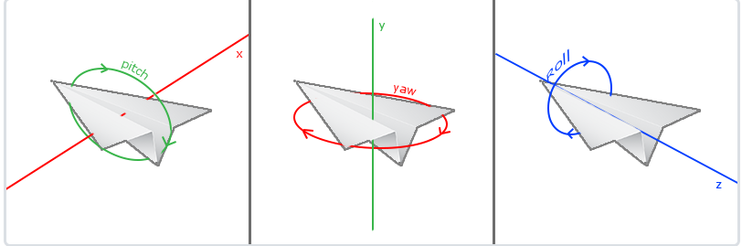

基于pitch和yaw, 可以进一步设置摄像机的方向, 角度随时间变换, 相当于摄像机方向也随世界变化
```cpp
direction.x = cos(glm::radians(pitch)) * cos(glm::radians(yaw)); // 译注：direction代表摄像机的前轴(Front)，这个前轴是和本文第一幅图片的第二个摄像机的方向向量是相反的
direction.y = sin(glm::radians(pitch));
direction.z = cos(glm::radians(pitch)) * sin(glm::radians(yaw));
```

我们可以通过鼠标移动动态设置角度

```cpp
void mouse_callback(GLFWwindow* window, double xpos, double ypos)  // GLFW监听鼠标移动事件
{
    if(firstMouse)
    {
        lastX = xpos;
        lastY = ypos;
        firstMouse = false;
    }

    float xoffset = xpos - lastX; // 计算当前帧和上一帧鼠标位置的偏移量
    float yoffset = lastY - ypos; 
    lastX = xpos;   
    lastY = ypos;

    float sensitivity = 0.05;   // 灵敏度
    xoffset *= sensitivity;
    yoffset *= sensitivity;

    yaw   += xoffset;   // 鼠标的移动量, 粗暴的转换成角度偏移量
    pitch += yoffset;

    if(pitch > 89.0f)
        pitch = 89.0f;
    if(pitch < -89.0f)
        pitch = -89.0f;

    glm::vec3 front;
    front.x = cos(glm::radians(yaw)) * cos(glm::radians(pitch));
    front.y = sin(glm::radians(pitch));
    front.z = sin(glm::radians(yaw)) * cos(glm::radians(pitch));
    cameraFront = glm::normalize(front);
}
```

此外, 还用鼠标滚轮调节大小(缩放)

```cpp
void scroll_callback(GLFWwindow* window, double xoffset, double yoffset)
{
    // 因为45.0f是默认的视野值，我们将会把缩放级别(Zoom Level)限制在1.0f到45.0f。
  if(fov >= 1.0f && fov <= 45.0f)
    fov -= yoffset;
  if(fov <= 1.0f)
    fov = 1.0f;
  if(fov >= 45.0f)
    fov = 45.0f;
}

// fov调整视野
projection = glm::perspective(glm::radians(fov), 800.0f / 600.0f, 0.1f, 100.0f);
```

#### 光照

光照机制能创造自然界更真实的颜色。

一些常识: 

现实生活中看到某一物体的颜色并不是这个物体真正拥有的颜色，而是它所反射的(Reflected)颜色。换句话说，那些不能被物体所吸收(Absorb)的颜色（被拒绝的颜色）就是我们能够感知到的物体的颜色。

白色的阳光实际上是所有可见颜色的集合，物体吸收了其中的大部分颜色。它仅反射了代表物体颜色的部分，被反射颜色的组合就是我们所感知到的颜色。在不同光源下物体表现的颜色，可以用向量的乘法表示, 表示能反射光源的颜色(也就是呈现的颜色)。

```cpp
glm::vec3 lightColor(1.0f, 1.0f, 1.0f);
glm::vec3 toyColor(1.0f, 0.5f, 0.31f);  
glm::vec3 result = lightColor * toyColor; // = (1.0f, 0.5f, 0.31f);

glm::vec3 lightColor(0.0f, 1.0f, 0.0f); // 光源颜色
glm::vec3 toyColor(1.0f, 0.5f, 0.31f);  // 白光下物体的颜色
glm::vec3 result = lightColor * toyColor; // = (0.0f, 0.5f, 0.0f);, 在该光源照射下物体应该呈现的颜色
```

实现时只需要在片段着色器乘对应的颜色即可。

```cpp
// .frag
#version 330 core
out vec4 FragColor;

uniform vec3 objectColor;
uniform vec3 lightColor;

void main()
{
    FragColor = vec4(lightColor * objectColor, 1.0);
}
```

OpenGL的光照仅仅使用了简化的模型并基于对现实的估计来进行模拟，这样处理起来会更容易一些，而且看起来也差不多一样。这些光照模型都是基于我们对光的物理特性的理解。其中一个模型被称为冯氏光照模型(Phong Lighting Model)。冯氏光照模型的主要结构由3个元素组成：环境(Ambient)、漫反射(Diffuse)和镜面(Specular)光照。


1. 环境光照(Ambient Lighting)：即使在黑暗的情况下，世界上也仍然有一些光亮(月亮、一个来自远处的光)，所以物体永远不会是完全黑暗的。我们使用环境光照来模拟这种情况，也就是无论如何永远都给物体一些颜色。

2. 漫反射光照(Diffuse Lighting)：模拟一个发光物对物体的方向性影响(Directional Impact)。它是冯氏光照模型最显著的组成部分。面向光源的一面比其他面会更亮。

3. 镜面光照(Specular Lighting)：模拟有光泽物体上面出现的亮点。镜面光照的颜色，相比于物体的颜色更倾向于光的颜色。

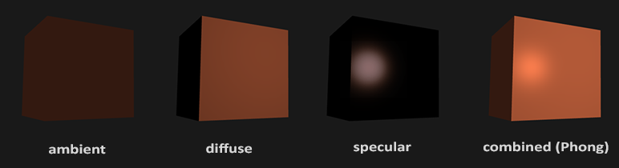

* 环境光照

把环境光照添加到场景里非常简单。在片段着色器中将光的颜色乘以一个很小的常量环境因子，再乘以物体的颜色，然后将最终结果作为片段的颜色：

```cpp
void main()
{
    float ambientStrength = 0.1;
    vec3 ambient = ambientStrength * lightColor;

    vec3 result = ambient * objectColor;
    FragColor = vec4(result, 1.0);
}
```

* 漫反射光照

漫反射光照使物体上与光线方向越接近的片段能从光源处获得更多的亮度。计算漫反射光照需要, 法向量：一个垂直于顶点表面的向量。定向的光线：作为光源的位置与片段的位置之间向量差的方向向量。为了计算这个光线，我们需要光的位置向量和片段的位置向量。

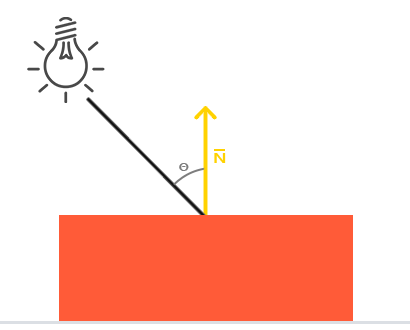

顶点着色器应该需要接收顶点的法向量信息
```cpp
#version 330 core
layout (location = 0) in vec3 aPos;
layout (location = 1) in vec3 aNormal;

out vec3 FragPos;
out vec3 Normal;

uniform mat4 model;
uniform mat4 view;
uniform mat4 projection;

void main()
{
    FragPos = vec3(model * vec4(aPos, 1.0));    // 世界空间内的顶点位置
    Normal = aNormal;   // 顶点法向量
    
    gl_Position = projection * view * vec4(FragPos, 1.0);
}
...

glVertexAttribPointer(0, 3, GL_FLOAT, GL_FALSE, 6 * sizeof(float), (void*)0);   // 
glEnableVertexAttribArray(0);
```

着色任务在片段着色器中进行

```cpp
#version 330 core
out vec4 FragColor;

in vec3 Normal;  // 法向量
in vec3 FragPos;   // 世界空间的坐标
  
uniform vec3 lightPos; 
uniform vec3 lightColor;
uniform vec3 objectColor;

void main()
{
    // ambient
    float ambientStrength = 0.1;
    vec3 ambient = ambientStrength * lightColor;    // 环境光
  	
    // diffuse 
    vec3 norm = normalize(Normal);
    vec3 lightDir = normalize(lightPos - FragPos);
    float diff = max(dot(norm, lightDir), 0.0);     // 利用向量内积得到漫反射大小, 入射光和法向量角度越大, 漫反射越小
    vec3 diffuse = diff * lightColor;
            
    vec3 result = (ambient + diffuse) * objectColor;    // 环境光分量和漫反射分量相加，把结果乘以物体的颜色
    FragColor = vec4(result, 1.0);
} 
```

* 法向量坐标转换

以上, 片段着色器里的计算都是在世界空间坐标中进行的。但法向量只是一个方向向量，不能表达空间中的特定位置。同时，法向量没有齐次坐标（顶点位置中的w分量）, 对于法向量，我们只希望对它实施缩放和旋转变换。如果模型矩阵执行了不等比缩放，顶点的改变会导致法向量不再垂直于表面了。

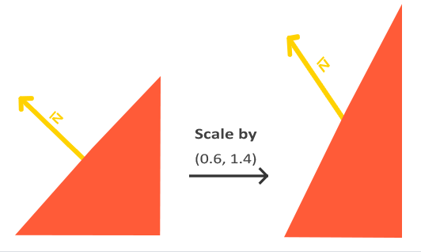

修复这个行为的诀窍是使用一个为法向量专门定制的模型矩阵。这个矩阵称之为法线矩阵(Normal Matrix)，它使用了一些线性代数的操作来移除对法向量错误缩放的影响。法线矩阵被定义为model矩阵左上角的逆矩阵的转置矩阵

```cpp
Normal = mat3(transpose(inverse(model))) * aNormal;
```


* 镜面光照

漫反射光照一样，镜面光照也是依据光的方向向量和物体的法向量来决定的，但是它也依赖于观察方向

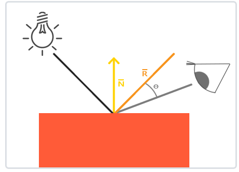

我们计算反射向量和视线方向的角度差，如果夹角越小，那么镜面光的影响就会越大。它的作用效果就是，当我们去看光被物体所反射的那个方向的时候，我们会看到一个高光。观察者的坐标可以设置成摄像机的坐标

```cpp
// .frac
#version 330 core
out vec4 FragColor;

in vec3 Normal;  
in vec3 FragPos;  
  
uniform vec3 lightPos; 
uniform vec3 viewPos; 
uniform vec3 lightColor;
uniform vec3 objectColor;

void main()
{
    // ambient
    float ambientStrength = 0.1;
    vec3 ambient = ambientStrength * lightColor;
  	
    // diffuse 
    vec3 norm = normalize(Normal);
    vec3 lightDir = normalize(lightPos - FragPos);
    float diff = max(dot(norm, lightDir), 0.0);
    vec3 diffuse = diff * lightColor;
    
    // specular
    float specularStrength = 0.5;
    vec3 viewDir = normalize(viewPos - FragPos);
    vec3 reflectDir = reflect(-lightDir, norm);  
    float spec = pow(max(dot(viewDir, reflectDir), 0.0), 32);   // 视线方向与反射方向的点乘, 然后再32次幂, 个32是高光的反光度(Shininess)。一个物体的反光度越高，反射光的能力越强，散射得越少，高光点就会越小。
    vec3 specular = specularStrength * spec * lightColor;  // 
        
    vec3 result = (ambient + diffuse + specular) * objectColor;
    FragColor = vec4(result, 1.0);
} 
```

#### 反射率和纹理

不同物体的反射率不同, 这与物体的材质有关

.vert
```cpp
#version 330 core
layout (location = 0) in vec3 aPos;
layout (location = 1) in vec3 aNormal;

out vec3 FragPos;
out vec3 Normal;

uniform mat4 model;
uniform mat4 view;
uniform mat4 projection;

void main()
{
    FragPos = vec3(model * vec4(aPos, 1.0));
    Normal = mat3(transpose(inverse(model))) * aNormal;  
    
    gl_Position = projection * view * vec4(FragPos, 1.0);
}
```

.frac
```cpp
#version 330 core
out vec4 FragColor;

// 材质和光源属性, 在环境光, 漫反射, 镜面反射的条件下, 均不同
struct Material {
    vec3 ambient;
    vec3 diffuse;
    vec3 specular;    
    float shininess;
}; // 材质

struct Light {
    vec3 position;

    vec3 ambient;
    vec3 diffuse;
    vec3 specular;
};  // 光源属性

in vec3 FragPos;  
in vec3 Normal;  
  
uniform vec3 viewPos;
uniform Material material;
uniform Light light;

void main()
{
    // ambient
    vec3 ambient = light.ambient * material.ambient;
  	
    // diffuse 
    vec3 norm = normalize(Normal);
    vec3 lightDir = normalize(light.position - FragPos);
    float diff = max(dot(norm, lightDir), 0.0);
    vec3 diffuse = light.diffuse * (diff * material.diffuse);
    
    // specular
    vec3 viewDir = normalize(viewPos - FragPos);
    vec3 reflectDir = reflect(-lightDir, norm);  
    float spec = pow(max(dot(viewDir, reflectDir), 0.0), material.shininess);
    vec3 specular = light.specular * (spec * material.specular);  
        
    vec3 result = ambient + diffuse + specular;
    FragColor = vec4(result, 1.0);
} 
```

同样的, 我们可以在物体表面进行贴图, 也就是纹理

.vert
```cpp
#version 330 core
layout (location = 0) in vec3 aPos;
layout (location = 1) in vec3 aNormal;
layout (location = 2) in vec2 aTexCoords;

out vec3 FragPos;
out vec3 Normal;
out vec2 TexCoords;

uniform mat4 model;
uniform mat4 view;
uniform mat4 projection;

void main()
{
    FragPos = vec3(model * vec4(aPos, 1.0));
    Normal = mat3(transpose(inverse(model))) * aNormal;  
    TexCoords = aTexCoords;
    
    gl_Position = projection * view * vec4(FragPos, 1.0);
}
```

.frac
```cpp
#version 330 core
out vec4 FragColor;

struct Material {
    sampler2D diffuse;
    sampler2D specular;    
    float shininess;
}; 

struct Light {
    vec3 position;

    vec3 ambient;
    vec3 diffuse;
    vec3 specular;
};

in vec3 FragPos;  
in vec3 Normal;  
in vec2 TexCoords;
  
uniform vec3 viewPos;
uniform Material material;
uniform Light light;

void main()
{
    // ambient
    vec3 ambient = light.ambient * texture(material.diffuse, TexCoords).rgb;
  	
    // diffuse 
    vec3 norm = normalize(Normal);
    vec3 lightDir = normalize(light.position - FragPos);
    float diff = max(dot(norm, lightDir), 0.0);
    vec3 diffuse = light.diffuse * diff * texture(material.diffuse, TexCoords).rgb;  
    
    // specular
    vec3 viewDir = normalize(viewPos - FragPos);
    vec3 reflectDir = reflect(-lightDir, norm);  
    float spec = pow(max(dot(viewDir, reflectDir), 0.0), material.shininess);
    vec3 specular = light.specular * spec * texture(material.specular, TexCoords).rgb;  
        
    vec3 result = ambient + diffuse + specular;
    FragColor = vec4(result, 1.0);
} 
```