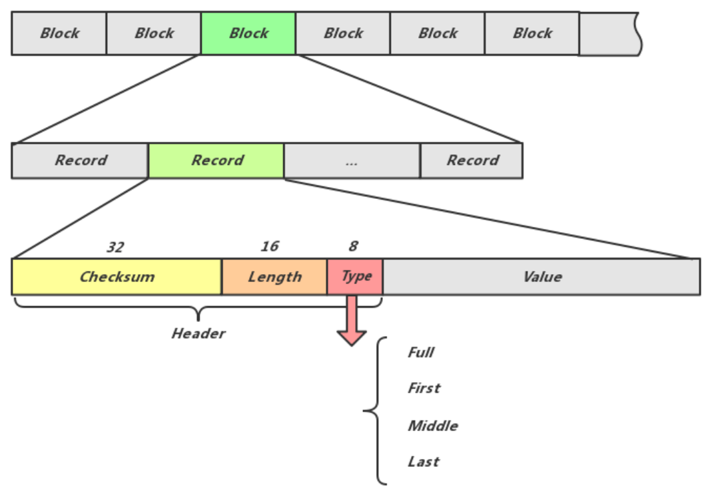
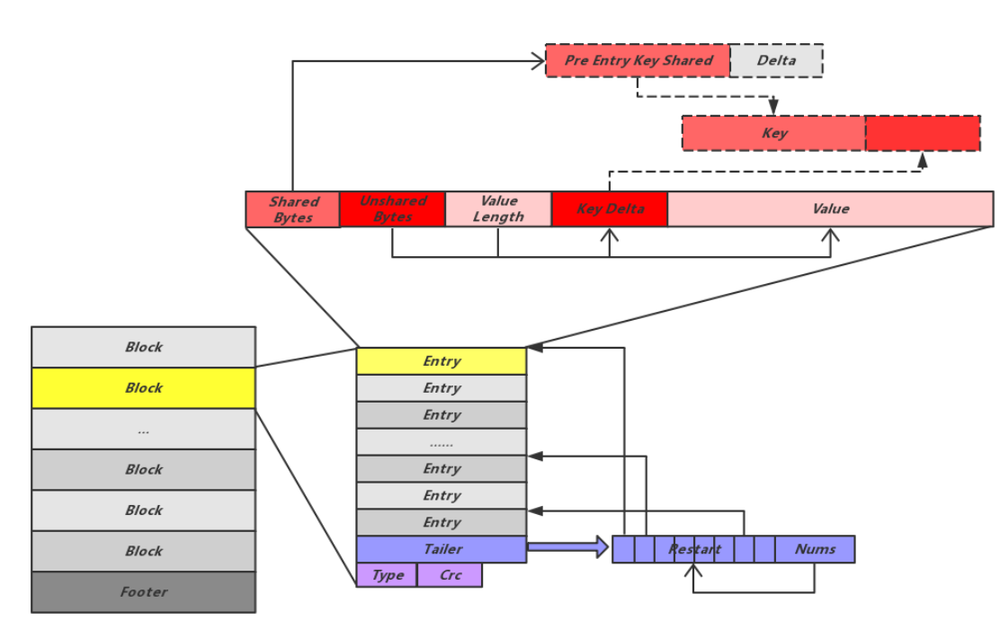
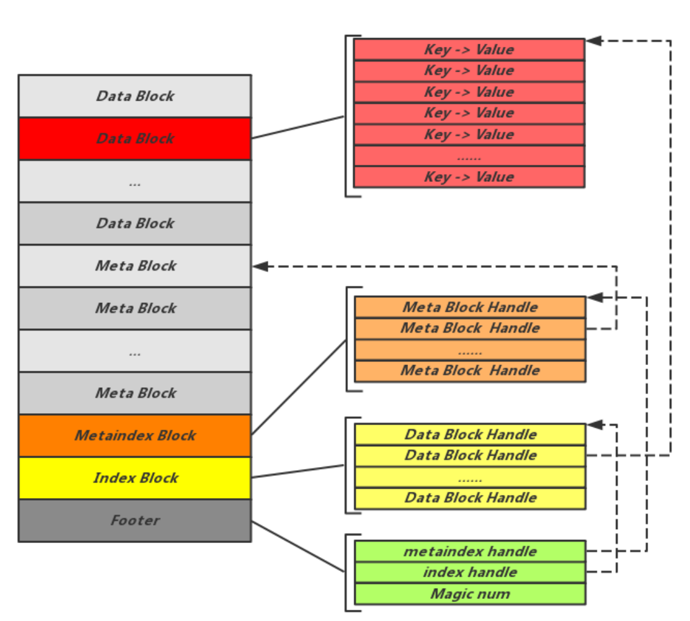
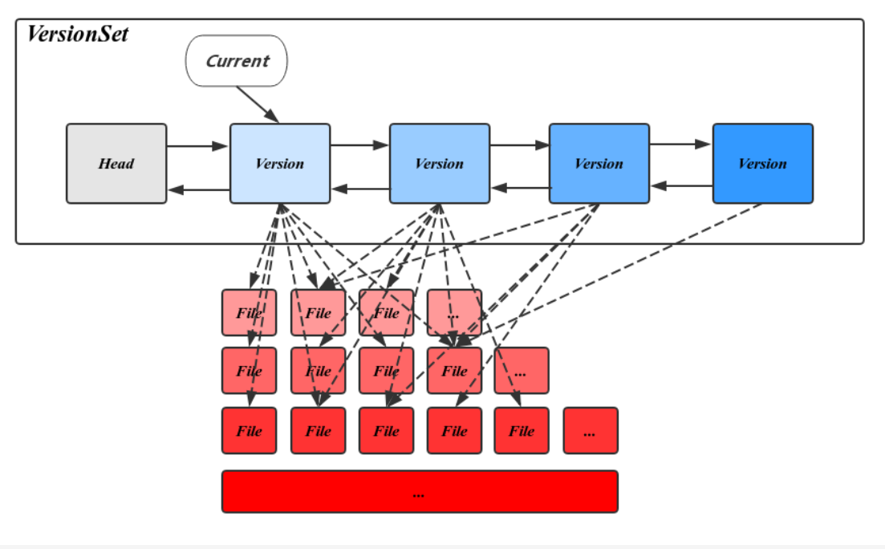
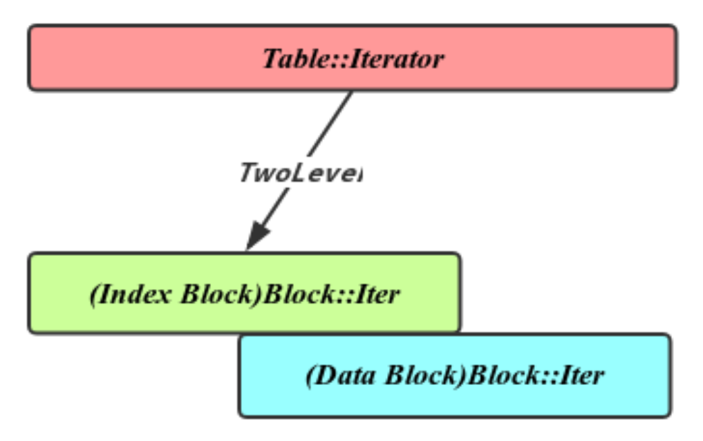
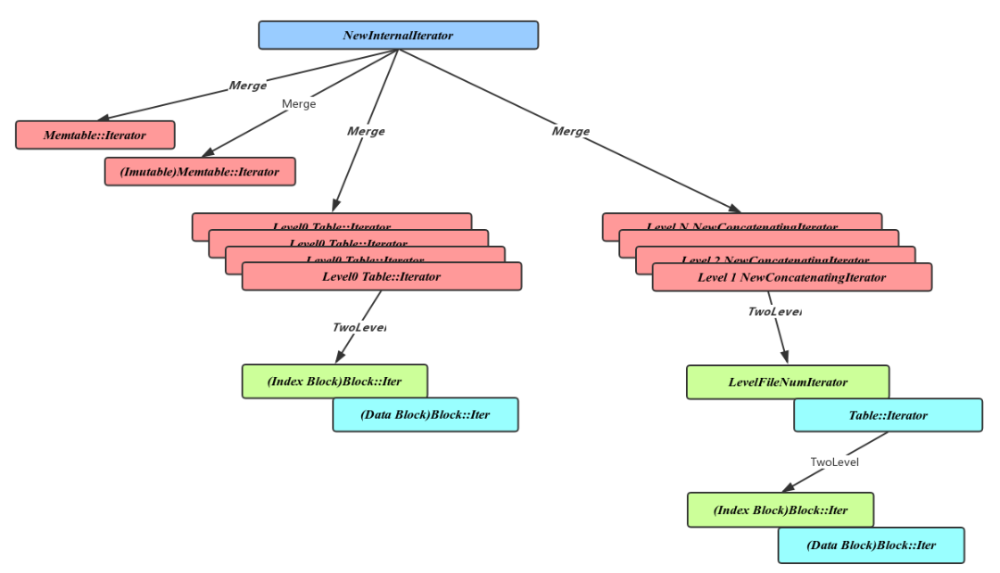

> 转载http://catkang.github.io/2017/02/12/leveldb-iterator.html, 实习一个月发现能看懂了2333

### 概况

LevelDB采用LSM-Tree的结构实现。LSM-Tree将磁盘的随机写转化为顺序写，从而大大提高了写速度。相比之下, mysql采用B+ tree实现的存储引擎InnoDB读效率比LSM高, 但由于支持复杂的随机写,写效率不如LSM。

LevelDB主要采用的文件
1. Memtable：内存数据结构，跳表实现，新的数据会首先写入这里
2. Log文件：写Memtable前会先写Log文件，Log通过append的方式顺序写入。作用是恢复memtable
3. Immutable Memtable：达到Memtable设置的容量上限后，Memtable会变为Immutable为之后向SST文件的归并做准备。Immutable Memtable不支持用户写入
4. SST文件：磁盘数据存储文件。分为Level 0到Level N多层，每一层包含多个SST文件；单层SST文件总量随层次增加成倍增长；文件内数据有序(根据key)；Level0的SST文件由Immutable直接Dump产生，其他Level的SST文件由其上一层的文件和本层文件归并产生。SST文件在归并过程中顺序写生成，生成后仅可能在之后的归并中被删除，而不会有任何的修改操作。
5. Manifest文件： Manifest文件中记录SST文件在不同Level的分布，单个SST文件的最大最小key，以及其他一些LevelDB需要的元信息。
6. Current文件:LevelDB启动时的首要任务就是找到当前的Manifest，而Manifest可能有多个。Current文件简单的记录了当前Manifest的文件名

<!-- more -->

### 读写

#### 写

LevelDB的写操作包括设置key-value和删除key两种。删除操作其实是向LevelDB插入一条标识为删除的数据。DB提供的接口
```cpp
  // Set the database entry for "key" to "value".  Returns OK on success,
  // and a non-OK status on error.
  // Note: consider setting options.sync = true.
  virtual Status Put(const WriteOptions& options, const Slice& key,
                     const Slice& value) = 0;

  // Remove the database entry (if any) for "key".  Returns OK on
  // success, and a non-OK status on error.  It is not an error if "key"
  // did not exist in the database.
  // Note: consider setting options.sync = true.
  virtual Status Delete(const WriteOptions& options, const Slice& key) = 0;

  // Apply the specified updates to the database.
  // Returns OK on success, non-OK on failure.
  // Note: consider setting options.sync = true.
  virtual Status Write(const WriteOptions& options, WriteBatch* updates) = 0;

  // If the database contains an entry for "key" store the
  // corresponding value in *value and return OK.
  //
  // If there is no entry for "key" leave *value unchanged and return
  // a status for which Status::IsNotFound() returns true.
  //
  // May return some other Status on an error.
  virtual Status Get(const ReadOptions& options, const Slice& key,
                     std::string* value) = 0;
```

WriteBatch是一批写操作的集合，其存在的意义在于提高写入效率，并提供Batch内所有写入的原子性。

Write函数中会首先用当前的WriteBatch封装一个Writer，代表一个完整的写入请求。LevelDB加锁保证同一时刻只能有一个Writer工作。其他Writer挂起等待，直到前一个Writer执行完毕后唤醒。

所有的值写入完成后才将Sequence真正更新，而LevelDB的读请求又是基于Sequence的。这样就保证了在WriteBatch写入过程中，不会被读请求部分看到，从而提供了原子性。

#### 读

生成内部查询所用的Key，该Key是由用户请求的UserKey拼接上Sequence生成的。其中Sequence可以用户提供或使用当前最新的Sequence，LevelDB可以保证仅查询在这个Sequence之前的写入

得益于Manifest中记录的SST文件的key区间，可以很方便的知道某个key是否在文件中。Level0的文件由于直接由Immutable Dump 产生，不可避免的会相互重叠，所以需要对每个文件依次查找。对于其他层次，由于归并过程保证了其互相不重叠且有序，二分查找的方式提供了更好的查询效率。

同一个Key出现在上层的操作会屏蔽下层的。也因此删除Key时只需要在Memtable压入一条标记为删除的条目即可。被其屏蔽的所有条目会在之后的归并过程中清除。

#### compaction

CompactMemTable会将Immutable中的数据整体Dump为Level 0的一个文件，这个过程会在Immutable Memtable存在时被Compaction后台线程调度。过程比较简单，首先会获得一个Immutable的Iterator用来遍历其中的所有内容，创建一个新的Level 0 SST文件，并将Iterator读出的内容依次顺序写入该文件(直接追加写, key无序)。之后更新元信息并删除Immutable Memtable。

compaction结果是本层某个SST文件被删除, 内容移动到下层。由于Level0的SST文件由Memtable在不同时间Dump而成，所以可能有Key重叠。因此除该文件外还需要获得所有与之重叠的Level0文件。在Level+1层获取所有与当前的文件集合有Key重合的文件, 进行归并操作并将结果输出到Level + 1层的一个新的SST文件，归并的过程中删除所有过期的数据。

* compaction时机

容量触发Compaction：每个Version在其生成的时候会初始化两个值compaction_level_、compaction_score_，记录了当前Version最需要进行Compaction的Level，以及其需要进行Compaction的紧迫程度，score大于1被认为是需要马上执行的。

Seek触发Compaction：Version中会记录file_to_compact_和file_to_compact_level_，这两个值会在Get操作每次尝试从文件中查找时更新。LevelDB认为每次查找同样会消耗IO，这个消耗在达到一定数量可以抵消一次Compaction操作消耗的IO，所以对Seek较多的文件应该主动触发一次Compaction。

手动Compaction：LevelDB提供了外部接口CompactRange，用户可以指定触发某个Key Range的Compaction，LevelDB默认手动Compaction的优先级高于两种自动触发。

### 数据存储

#### log

对Log的需求是1. 磁盘存储 2. 大量的Append操作 3. 没有删除单条数据的操作 4. 遍历的读操作

LevelDB首先将每条写入数据序列化为一个Record，单个Log文件中包含多个Record。同时，Log文件又划分为固定大小的Block单位，并保证Block的开始位置一定是一个新的Record。不同的Record可能共存于一个Block，同时，一个Record也可能横跨几个Block。

8位的Type可以是Full、First、Middle或Last中的一种，表示该Record是否完整的在当前的Block中



#### SST

对SST文件的需求是, 支持顺序写操作, 支持遍历操作, 查找操作

LevelDB将SST文件定义为Table，每个Table又划分为多个连续的Block，每个Block中又存储多条数据Entry。Block中每条数据Entry是以Key-Value方式存储的，并且是按Key有序存储。

每个Entry只记录自己的Key与前一个Entry Key的不同部分, leveldb引入了重启点，每隔固定条数Entry会强制加入一个重启点，这个位置的Entry会完整的记录自己的Key，并将其shared值设置为0。

Block会将这些重启点的偏移量及个数记录在所有Entry后边的Tailer中。



* 逻辑格式

Table中不同的Block物理上的存储方式一致，如上文所示，但在逻辑上可能存储不同的内容，包括存储数据的Block，存储索引信息的Block，存储Filter的Block：



Footer：记录指向Metaindex Block的Handle和指向Index Block的Handle。Footer是SST文件解析开始的地方，通过Footer中记录的这两个关键元信息Block的位置，可以方便的开启之后的解析工作。

Index Block：记录Data Block位置信息的Block，其中的每一条Entry指向一个Data Block，其Key值为所指向的Data Block最后一条数据的Key，Value为指向该Data Block位置的Handle。可以通过Index Block快速判断该table是否存在key, 以及二分查找查找对应block

Meta Block：比较特殊的Block，用来存储元信息，目前LevelDB使用的仅有对布隆过滤器的存储。

Data Block：以Key-Value的方式存储实际数据


Block查找 1. 二分查找 restart points：找到最后一个 key < target 的 restart point。2. 然后从 restart point 开始顺序遍历，直到找到第一个 key >= target

### 版本控制

leveldb的元信息, 
1. 记录Compaction相关信息，使得Compaction按需后台触发；
2. 维护SST文件索引信息及层次信息
3. 负责元信息数据的持久化，使得整个库可以从进程重启或机器宕机中恢复到正确的状态；
4. 记录LogNumber，Sequence，下一个SST文件编号等状态信息
5. 以版本的方式维护元信息，使得用快照的方式使用文件和数据 

#### Version

LeveDB用Version表示一个版本的元信息，Version中主要包括一个FileMetaData指针的二维数组，分层记录了所有的SST文件信息。

```cpp
class Version {
 public:
  // Lookup the value for key.  If found, store it in *val and
  // return OK.  Else return a non-OK status.  Fills *stats.
  // REQUIRES: lock is not held
  struct GetStats {
    FileMetaData* seek_file;
    int seek_file_level;
  };

  // Append to *iters a sequence of iterators that will
  // yield the contents of this Version when merged together.
  // REQUIRES: This version has been saved (see VersionSet::SaveTo)
  void AddIterators(const ReadOptions&, std::vector<Iterator*>* iters);

  Status Get(const ReadOptions&, const LookupKey& key, std::string* val,
             GetStats* stats);

  // Adds "stats" into the current state.  Returns true if a new
  // compaction may need to be triggered, false otherwise.
  // REQUIRES: lock is held
  bool UpdateStats(const GetStats& stats);

  // Record a sample of bytes read at the specified internal key.
  // Samples are taken approximately once every config::kReadBytesPeriod
  // bytes.  Returns true if a new compaction may need to be triggered.
  // REQUIRES: lock is held
  bool RecordReadSample(Slice key);

  // Reference count management (so Versions do not disappear out from
  // under live iterators)
  void Ref();
  void Unref();

  void GetOverlappingInputs(
      int level,
      const InternalKey* begin,  // nullptr means before all keys
      const InternalKey* end,    // nullptr means after all keys
      std::vector<FileMetaData*>* inputs);

  // Returns true iff some file in the specified level overlaps
  // some part of [*smallest_user_key,*largest_user_key].
  // smallest_user_key==nullptr represents a key smaller than all the DB's keys.
  // largest_user_key==nullptr represents a key largest than all the DB's keys.
  bool OverlapInLevel(int level, const Slice* smallest_user_key,
                      const Slice* largest_user_key);

  // Return the level at which we should place a new memtable compaction
  // result that covers the range [smallest_user_key,largest_user_key].
  int PickLevelForMemTableOutput(const Slice& smallest_user_key,
                                 const Slice& largest_user_key);

  int NumFiles(int level) const { return files_[level].size(); }

  // Return a human readable string that describes this version's contents.
  std::string DebugString() const;

 private:
  friend class Compaction;
  friend class VersionSet;

  class LevelFileNumIterator;

  explicit Version(VersionSet* vset)
      : vset_(vset),
        next_(this),
        prev_(this),
        refs_(0),
        file_to_compact_(nullptr),
        file_to_compact_level_(-1),
        compaction_score_(-1),
        compaction_level_(-1) {}

  Iterator* NewConcatenatingIterator(const ReadOptions&, int level) const;

  // Call func(arg, level, f) for every file that overlaps user_key in
  // order from newest to oldest.  If an invocation of func returns
  // false, makes no more calls.
  //
  // REQUIRES: user portion of internal_key == user_key.
  void ForEachOverlapping(Slice user_key, Slice internal_key, void* arg,
                          bool (*func)(void*, int, FileMetaData*));

  VersionSet* vset_;  // VersionSet to which this Version belongs
  Version* next_;     // Next version in linked list
  Version* prev_;     // Previous version in linked list
  int refs_;          // Number of live refs to this version

  // List of files per level
  std::vector<FileMetaData*> files_[config::kNumLevels];

  // Next file to compact based on seek stats.
  FileMetaData* file_to_compact_;
  int file_to_compact_level_;

  // Level that should be compacted next and its compaction score.
  // Score < 1 means compaction is not strictly needed.  These fields
  // are initialized by Finalize().
  double compaction_score_;
  int compaction_level_;
};
```

FileMetaData数据结构用来维护一个文件的元信息，包括文件大小，文件编号，最大最小值，引用计数等，其中引用计数记录了被不同的Version引用的个数，保证被引用中的文件不会被删除。

```cpp
struct FileMetaData {
  FileMetaData() : refs(0), allowed_seeks(1 << 30), file_size(0) {}

  int refs;
  int allowed_seeks;  // Seeks allowed until compaction
  uint64_t number;
  uint64_t file_size;    // File size in bytes
  InternalKey smallest;  // Smallest internal key served by table
  InternalKey largest;   // Largest internal key served by table
};
```

在CompactMemTable和BackgroundCompaction过程中会导致新文件的产生和旧文件的删除。每当这个时候都会有一个新的对应的Version生成，并插入VersionSet链表头部。

VersionSet是一个Version构成的双向链表，这些Version按时间顺序先后产生，记录了当时的元信息，链表头指向当前最新的Version，



```cpp
class VersionSet {
 public:
  VersionSet(const std::string& dbname, const Options* options,
             TableCache* table_cache, const InternalKeyComparator*);
  VersionSet(const VersionSet&) = delete;
  VersionSet& operator=(const VersionSet&) = delete;

  ~VersionSet();

  // Apply *edit to the current version to form a new descriptor that
  // is both saved to persistent state and installed as the new
  // current version.  Will release *mu while actually writing to the file.
  // REQUIRES: *mu is held on entry.
  // REQUIRES: no other thread concurrently calls LogAndApply()
  Status LogAndApply(VersionEdit* edit, port::Mutex* mu)
      EXCLUSIVE_LOCKS_REQUIRED(mu);

  // Recover the last saved descriptor from persistent storage.
  Status Recover(bool* save_manifest);

  // Return the current version.
  Version* current() const { return current_; }

  // Return the current manifest file number
  uint64_t ManifestFileNumber() const { return manifest_file_number_; }

  // Allocate and return a new file number
  uint64_t NewFileNumber() { return next_file_number_++; }

  // Arrange to reuse "file_number" unless a newer file number has
  // already been allocated.
  // REQUIRES: "file_number" was returned by a call to NewFileNumber().
  void ReuseFileNumber(uint64_t file_number) {
    if (next_file_number_ == file_number + 1) {
      next_file_number_ = file_number;
    }
  }

  // Return the number of Table files at the specified level.
  int NumLevelFiles(int level) const;

  // Return the combined file size of all files at the specified level.
  int64_t NumLevelBytes(int level) const;

  // Return the last sequence number.
  uint64_t LastSequence() const { return last_sequence_; }

  // Set the last sequence number to s.
  void SetLastSequence(uint64_t s) {
    assert(s >= last_sequence_);
    last_sequence_ = s;
  }

  // Mark the specified file number as used.
  void MarkFileNumberUsed(uint64_t number);

  // Return the current log file number.
  uint64_t LogNumber() const { return log_number_; }

  // Return the log file number for the log file that is currently
  // being compacted, or zero if there is no such log file.
  uint64_t PrevLogNumber() const { return prev_log_number_; }

  // Pick level and inputs for a new compaction.
  // Returns nullptr if there is no compaction to be done.
  // Otherwise returns a pointer to a heap-allocated object that
  // describes the compaction.  Caller should delete the result.
  Compaction* PickCompaction();

  // Return a compaction object for compacting the range [begin,end] in
  // the specified level.  Returns nullptr if there is nothing in that
  // level that overlaps the specified range.  Caller should delete
  // the result.
  Compaction* CompactRange(int level, const InternalKey* begin,
                           const InternalKey* end);

  // Return the maximum overlapping data (in bytes) at next level for any
  // file at a level >= 1.
  int64_t MaxNextLevelOverlappingBytes();

  // Create an iterator that reads over the compaction inputs for "*c".
  // The caller should delete the iterator when no longer needed.
  Iterator* MakeInputIterator(Compaction* c);

  // Returns true iff some level needs a compaction.
  bool NeedsCompaction() const {
    Version* v = current_;
    return (v->compaction_score_ >= 1) || (v->file_to_compact_ != nullptr);
  }

  // Add all files listed in any live version to *live.
  // May also mutate some internal state.
  void AddLiveFiles(std::set<uint64_t>* live);

  // Return the approximate offset in the database of the data for
  // "key" as of version "v".
  uint64_t ApproximateOffsetOf(Version* v, const InternalKey& key);

  // Return a human-readable short (single-line) summary of the number
  // of files per level.  Uses *scratch as backing store.
  struct LevelSummaryStorage {
    char buffer[100];
  };
  const char* LevelSummary(LevelSummaryStorage* scratch) const;

 private:
  class Builder;

  friend class Compaction;
  friend class Version;

  bool ReuseManifest(const std::string& dscname, const std::string& dscbase);

  void Finalize(Version* v);

  void GetRange(const std::vector<FileMetaData*>& inputs, InternalKey* smallest,
                InternalKey* largest);

  void GetRange2(const std::vector<FileMetaData*>& inputs1,
                 const std::vector<FileMetaData*>& inputs2,
                 InternalKey* smallest, InternalKey* largest);

  void SetupOtherInputs(Compaction* c);

  // Save current contents to *log
  Status WriteSnapshot(log::Writer* log);

  void AppendVersion(Version* v);

  Env* const env_;
  const std::string dbname_;
  const Options* const options_;
  TableCache* const table_cache_;
  const InternalKeyComparator icmp_;
  uint64_t next_file_number_;
  uint64_t manifest_file_number_;
  uint64_t last_sequence_;
  uint64_t log_number_;
  uint64_t prev_log_number_;  // 0 or backing store for memtable being compacted

  // Opened lazily
  WritableFile* descriptor_file_;
  log::Writer* descriptor_log_;
  Version dummy_versions_;  // Head of circular doubly-linked list of versions.
  Version* current_;        // == dummy_versions_.prev_

  // Per-level key at which the next compaction at that level should start.
  // Either an empty string, or a valid InternalKey.
  std::string compact_pointer_[config::kNumLevels];
};

```

LevelDB用VersionEdit来表示这种相邻Version的差值。用来产生新的Version

```cpp
class VersionEdit {
 public:
  VersionEdit() { Clear(); }
  ~VersionEdit() = default;

  void Clear();

  void SetComparatorName(const Slice& name) {
    has_comparator_ = true;
    comparator_ = name.ToString();
  }
  void SetLogNumber(uint64_t num) {
    has_log_number_ = true;
    log_number_ = num;
  }
  void SetPrevLogNumber(uint64_t num) {
    has_prev_log_number_ = true;
    prev_log_number_ = num;
  }
  void SetNextFile(uint64_t num) {
    has_next_file_number_ = true;
    next_file_number_ = num;
  }
  void SetLastSequence(SequenceNumber seq) {
    has_last_sequence_ = true;
    last_sequence_ = seq;
  }
  void SetCompactPointer(int level, const InternalKey& key) {
    compact_pointers_.push_back(std::make_pair(level, key));
  }

  // Add the specified file at the specified number.
  // REQUIRES: This version has not been saved (see VersionSet::SaveTo)
  // REQUIRES: "smallest" and "largest" are smallest and largest keys in file
  void AddFile(int level, uint64_t file, uint64_t file_size,
               const InternalKey& smallest, const InternalKey& largest) {
    FileMetaData f;
    f.number = file;
    f.file_size = file_size;
    f.smallest = smallest;
    f.largest = largest;
    new_files_.push_back(std::make_pair(level, f));
  }

  // Delete the specified "file" from the specified "level".
  void RemoveFile(int level, uint64_t file) {
    deleted_files_.insert(std::make_pair(level, file));
  }

  void EncodeTo(std::string* dst) const;
  Status DecodeFrom(const Slice& src);

  std::string DebugString() const;

 private:
  friend class VersionSet;

  typedef std::set<std::pair<int, uint64_t>> DeletedFileSet;

  std::string comparator_;
  uint64_t log_number_;
  uint64_t prev_log_number_;
  uint64_t next_file_number_;
  SequenceNumber last_sequence_;
  bool has_comparator_;
  bool has_log_number_;
  bool has_prev_log_number_;
  bool has_next_file_number_;
  bool has_last_sequence_;

  std::vector<std::pair<int, InternalKey>> compact_pointers_;
  DeletedFileSet deleted_files_;
  std::vector<std::pair<int, FileMetaData>> new_files_;
};
```

Compaction结束后这个VersionEdit会被用来构造新的VersionSet中的Version。同时为了数据安全，这个VersionEdit会被Append写入到Manifest中。

在库重启时，会首先尝试从Manifest中恢复出当前的元信息状态，也就是恢复VersionSet

1. 依次读取Manifest文件中的每一个Block， 将从文件中读出的Record反序列化为VersionEdit
2. 将每一个的VersionEdit Apply到VersionSet::Builder中，之后从VersionSet::Builder的信息中生成Version；
3. 将新生成的Version挂到VersionSet中，并初始化VersionSet的manifest_file_number_， next_file_number_，last_sequence_，log_number_，prev_log_number_ 信息

重启后的VersionSet只有一个Version, 也就是当前信息。

#### Manifest

为了避免进程崩溃或机器宕机导致的数据丢失，LevelDB需要将元信息数据持久化到磁盘，承担这个任务的就是Manifest文件。每当有新的Version产生都需要更新Manifest，很自然的发现这个新增数据正好对应于VersionEdit内容

恢复元信息的过程也变成了依次应用VersionEdit的过程，这个过程中有大量的中间Version产生，但这些并不是我们所需要的。LevelDB引入VersionSet::Builder来避免这种中间变量，方法是先将所有的VersoinEdit内容整理到VersionBuilder中，然后一次应用产生最终的Version


#### 版本与读写

一般的, 读写都是操作最近的Version, 读写对应的文件。并非检索全部的数据库文件。也就是说，读的文件由Version确定

Version中记录了当前每个文件的key最大最小值，使得这个问题变成比较Key值与文件的Key Range的过程。

LevelDB的写操作会直接写入Memtable并通过异步的Compaction过程写入到不同层次的SST文件中，因此，上层文件拥有较新的数据，利用这个特征，LevelDB的Get接口会由上至下的依次从每一层中尝试查找，一旦查找成功，便可以忽略下层的相同Key的记录

到SST层, 如果是L0层, 会遍历Version包括的L0层全部SST文件; L1层及以下, 先根据Version确定要查找的SST文件, 再对SST文件的index block执行二分查找。

### Iterator

Iterator用确定的遍历接口将上层需求和下层实现解耦和。无须了解下层存储细节的情况下，通过统一接口对下层数据进行遍历的能力。

1. Seek到某一位置：Seek，SeekToFirst，SeekToLast
2. 访问前驱后继：Next，Prev
3. 判断当前位置是否有效：Valid
4. 获取当前位置数据信息：key，value，status

#### 基本Iterator

1. MemTableIterator

Memtable Skiplist的格式上的Iterator实现

2. Block::Iter

SST文件Block存储格式的Iterator实现。遍历的过程中解析重启点，拼接key的共享部分和特有部分，获取对应的value值。SST虽然是存在磁盘中, 解析到内存和磁盘是一致的, 没有压缩

3. Version::LevelFileNumIterator


#### 组合Iterator

1. TwoLevelIterator

TwoLevelIterator实现逻辑上有层次关系的数据的遍历操作。组合了index iterator和data iterator两层迭代器，其中index iterator记录从数据key值到data iterator的映射，而data iterator则负责真正数据key到value的映射。

显然TwoLevelIterator是为了处理SSTindex block和data block的逻辑层次

2. MergingIterator

MergingIterator可以实现多个有序数据集合的归并操作。其中包含多个child iterator组成的集合。对MergingIterator的遍历会有序的遍历其child iterator中的每个元素。

#### 功能Iterator

1. Table::Iterator

对SST文件的遍历，有明显的层级关系，可以利用上面介绍的TwoLevelIterator，其index iterator为Index Block的Block::Iter，data iterator为Data Block的Block::Iter




2. compaction过程Iterator

Compaction过程中需要对多个文件进行归并操作，并将结果输出到新的下层文件。LevelDB用MergingIterator来实现这个过程, 其childIterator包括

有Level0文件，则包含所有level0文件的Table::Iterator;其他Level文件，加入NewConcatenationIterator，作为一个TwoLevelIterator，由Version::LevelFileNumIterator作为index iterator，Table::Iterator作为data iterator




### 一些注意的点

leveldb 不支持多个写操作同时执行，写操作会保存在 deque 中，只有队首的才会执行;

#### sequence和MVCC

每个写操作都有 sequence，会一同记录在 key 中，通过 sequence 实现 MVCC(因为sequence唯一)

sequence也简易实现了快照, 发生读操作时，无论是通过 Get()，还是通过 Iterator，leveldb 会过滤 sequence > snapshot 时间戳的 kv 版本

在快照释放以前，小于等于snapshot 时间戳的 kv 操作不能被Compact清理掉，以防止快照还在

leveldb 使用了一个 VersionSet 类，里面维护了当前活动的多个版本，每个版本包含它的 sequence number，sstables 文件列表和 log 文件(对应内存表的数据，当内存表生成 sstable 文件后，对应的 log 文件就不再需要，会被清理掉)。当版本不再被引用时，会释放掉版本，清理已删除的 sstable 文件。leveldb 使用 VersionEdit 类记录版本的增量操作，比如增加了哪个 sstable 文件，删除了哪个 sstable 文件，那个 sstable 文件的迁移到了新的 level 等。

额, leveldb不支持事务, 所谓MVCC只是控制多个版本而已, 不涉及多事务的并发处理

#### leveldb的缺陷

1. 不支持事务
2. 缺乏范围查询上的优化