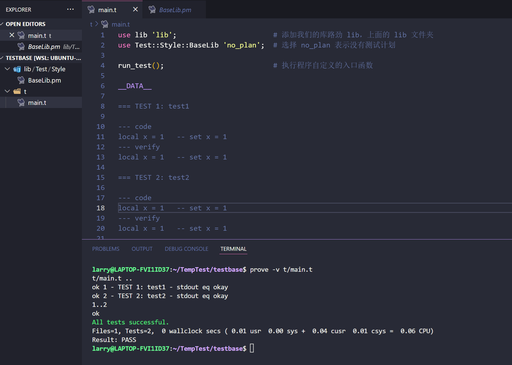
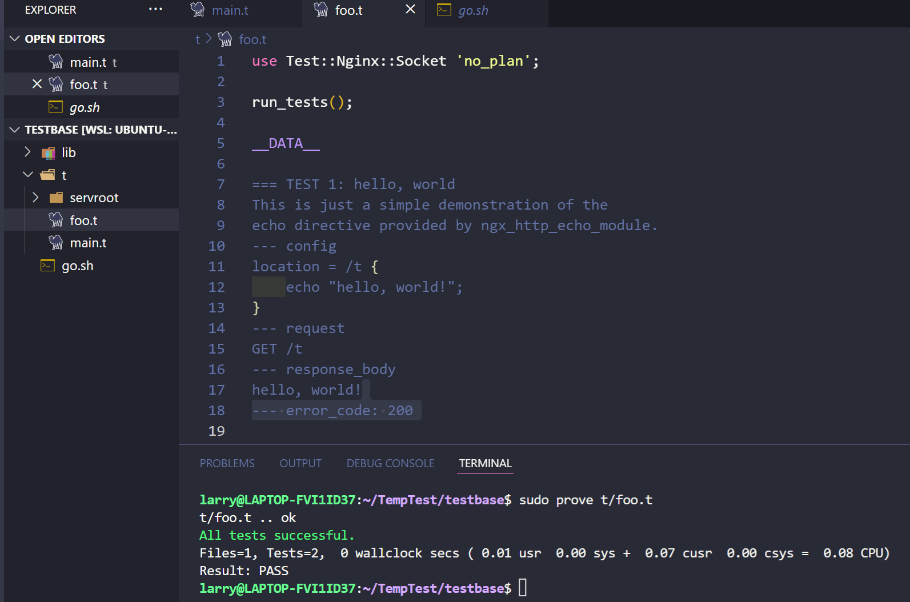

> 由openresty引发而来

### 相关

#### openresty

OpenResty is a full-fledged web application server by bundling the standard nginx core, lots of 3rd-party nginx modules, as well as most of their external dependencies.OpenResty 是一个成熟的 Web 应用服务器，它捆绑了标准的 nginx 核心、许多 3rd-party nginx 模块以及它们的大部分外部依赖项。这让Web 开发人员可以使用 Lua 脚本语言调动 Nginx 支持的各种 C 以及 Lua 模块,更主要的是在性能方面，OpenResty可以 快速构造出足以胜任 10K 以上并发连接响应的超高性能 Web 应用系统。

OpenResty 依赖库有： perl 5.6.1+, libreadline, libpcre, libssl。
```
apt-get install libreadline-dev libpcre3-dev libssl-dev perl

wget https://openresty.org/download/ngx_openresty-1.9.7.1.tar.gz   # 下载
tar xzvf ngx_openresty-1.9.7.1.tar.gz       # 解压
cd ngx_openresty-1.9.7.1/ 
./configure
make 
make install
```

<!-- more -->

#### perl和cpan

Perl 模块是 Perl 的库, CPAN （Comprehensive Perl Archive Network）里面有上百万的 Perl 模块，用来支撑 Perl 强大的功能

cpan离线安装模块
```cpp
1、在如下网站查找所需安装包，并下载
https://metacpan.org/
2、解开压缩包， root 执行
% perl Makefile.PL
% make
% make install

// 以Test::Nginx为例
git clone https://github.com/agentzh/test-nginx.git
cd test-nginx & perl Makefile.PL
sudo make install
```

还有更强大的cpanm
```
$apt-get install cpanminus
$cpanm Test::Base
```

perl简单使用, 类似shell
```perl
#!/usr/bin/perl
 
print "Hello, world\n";    # 双引号
print 'Hello, world\n';    # 单引号

# 访问键值对, ${key}
#!/usr/bin/perl
 
%data = ('google', 'google.com', 'runoob', 'runoob.com', 'taobao', 'taobao.com');
 
print "\$data{'google'} = $data{'google'}\n";
print "\$data{'runoob'} = $data{'runoob'}\n";
print "\$data{'taobao'} = $data{'taobao'}\n";

#函数
#!/usr/bin/perl
 
# 定义函数
sub PrintList{
   my @list = @_;
   print "列表为 : @list\n";
}
$a = 10;
@b = (1, 2, 3, 4);
 
# 列表参数
PrintList($a, @b);
```

* 变量定义

Perl的三个基本的数据类型：标量、数组、哈希
1. 标量 $ 开始， 如$a $b 是两个标量。标量可以是数字，字符串，浮点数，不作严格的区分
2. 数组 @ 开始 ， 如 @a @b 是两个数组
3. 哈希 % 开始 ， %a %b 是两个哈希

正则表达式匹配是perl最方便的,perl处理完后会给匹配到的值存在三个特殊变量名:
$`: 匹配部分的前一部分字符串; $&: 匹配的字符串 $': 还没有匹配的剩余字符串

Perl 语言中定义了一些特殊的变量，通常以 $, @, 或 % 作为前缀，例如：$_。

```perl
#!/usr/bin/perl
 
$string = "welcome to runoob site.";
$string =~ m/run/;
print "匹配前的字符串: $`\n";
print "匹配的字符串: $&\n";
print "匹配后的字符串: $'\n";
```

变量, Perl中，定义变量，可以使用关键字local、my或our。our所定义的变量，看成是全局变量, local和my定义的都是局部变量

local所定义的变量，可以在后续被调用的子程序中使用，而my定义的变量会更严格，只能在当前代码块内使用

#### Test::Base

安装 `cpanm Test::Base`

目录结构参照
```
|——lib
|  |——Test
|     |——Style
|        |——BaseLib.pm
|        |——Util.pm
|——t
   |——main.t
```

编辑 mian.t 文件

```perl
use lib 'lib';                       # 添加我们的库lib，上面的 lib 文件夹
use Test::Style::BaseLib 'no_plan';  # 选择 no_plan 表示没有测试计划

run_test();                          # 执行程序自定义的入口函数

__DATA__                             # 数据块

=== TEST 1: test1                    # 一个block

--- code
local x = 1   -- set x = 1
--- verify
local x = 1   -- set x = 1

=== TEST 2: test2

--- code
local x = 1   -- set x = 1
--- verify
local x = 1   -- set x = 1
```

编辑 BaseLib.pm 
```perl
sub run_test(){
    for my $block (Test::Base::blocks()) {   # 对每个block执行
        run_block($block);
    } 
}

sub run_block($) {

    my $block = shift;
    
    my $name = $block->name;                # 分别对应片段
    
    my $code= $block->code; 
    
    my $verify= $block->verify;

    is $verify, $code, "$name - stdout eq okay";  # 判断 is 函数的第一个和第二个参数是否一致, 即$verify，  $code
}

1;

__END__

NONE
```

通常使用prove来启动每个测试perl脚本来获取测试结果

运行`prove -v t/main.t`



#### Test::Nginx

Test::Nginx是可以快速对Nginx进行功能测试的工具，例如通过修改`--config`块可以直接修改nginx的配置。



Make sure there is at least one newline character at the end of your .t file. That error message is a clear indication for the lack of newline character right after the --- error_code: 200 line.