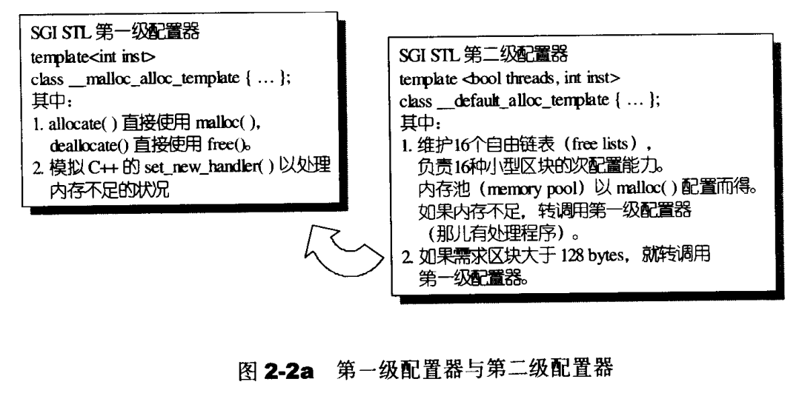
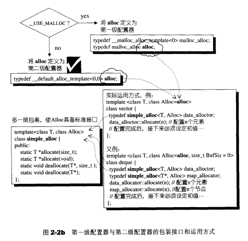
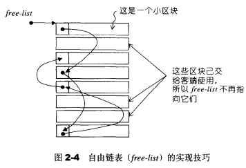
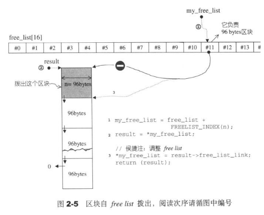
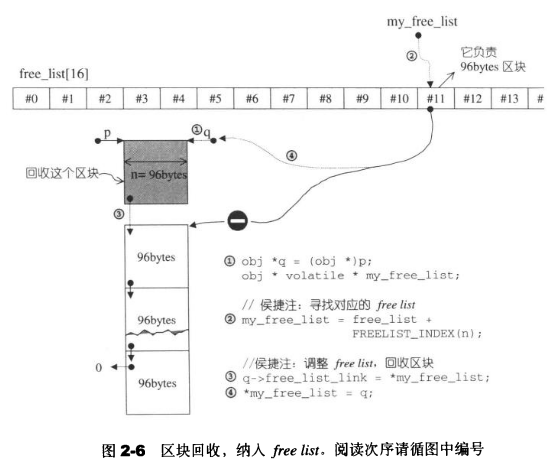
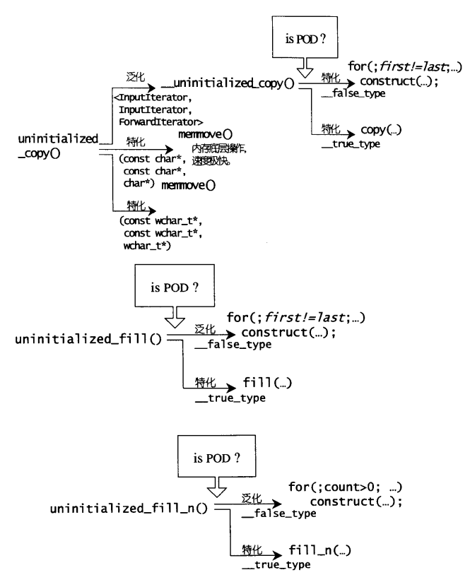

### 可能困惑的C++语法
#### 临时对象的产生和运用

所谓临时对象，是一种无名对象，例如任何pass by value操作都会引发copy操作，形成一个临时对象。    
临时对象往往造成效率的负担，但有时刻意制造是程序干净清爽的表现。例如Shape(3,5), int(8)，其意义相当于调用相应的constructor且不指定对象名称。STL最常将该技巧用于仿函数functor与算法的搭配上。
```cpp
template <typename T>
class print
{
public:
    void operator() (const T& elem)
    {   cout << elem << " ";}
};

int main(){
    int ia[6] = {0,1,2,3,4,5};
    vector<int> iv(ia, ia+6);

    for_each(iv.begin(), iv.end(), print<int>());
}
```
最后一行`print<int>()`是一个临时对象，该对象被传入到`for_each`之中起作用，当`for_each`结束，这个临时对象也结束了生命。

<!-- more -->

#### 静态常量整数成员在class内部直接初始化
若class内含const static intrgral data member，在class内部直接取初值。
```cpp
template<typename T>
class testClass {
public:
    static const int _datai = 5;
    static const long _datal = 3L;
    static const char _datac = 'c';
};

int main(){
    cout << testClass<int>::_datai << endl;
}
```

#### increment/decrement/dereference操作符
increment/dereference操作符在迭代器的实现，任何迭代器都需要实现前进(increment,operator++)和取值(dereference,operator*)功能。前者分为前置式(prefix)和后置式(postfix)两种。

```cpp
class INT{
friend ostream& operator <<(ostream& os, const INT& i);

public:
    INT(int i) : m_i(i) { };
    // 前置式 prefix
    INT& operator++(){
        ++ (this->m_i);
        return *this;
    }
    // 后置式 postfix
    const INT operator++(int)
    {
        INT temp = *this;
        ++(*this);
        return temp;
    }
    // dereference
    int& operator*() const
    {
        return (int&) m_i;
    }

private:
    int m_i;
};

ostream& operator<< (ostream& os, const INT& i){
    os << "[" << i.m_i <<"]";
    return os;
}

int main(){
    int I(5);
    cout << I++;
    cout << *I;
}
```

#### 前闭后开区间表示法`[)`
一般的，迭代器表示的实际范围从first开始，直到last-1。这种表示法带来许多方便，例如迭代器遍历
```cpp
template <class InputIterator, class Function>
Function for_each(InputIterator first, InputIterator last, Function f){
    for ( ; first != last; ++first)
        f(*first);
    return f;
}
```

#### operator()操作符
STL算法，有时需要用户指定某个条件或某个策略，代表这个策略的往往是函数。在C语言中，将函数作为参数传递，是通过函数指针。
```cpp
int fcmp(const void* elem1, const void* elem2){
    const int* i1 = (const int*)elem1;
    const int* i2 = (const int*)elem2;

    if (*i1 < *i2)
        return -1;
    else if(*i1 == *i2)
        return 0;
    else if(*i1 > *i2)
        return 1;
}

int main(){
    int ia[5] = {32, 92, 67, 58, 10};
    qsort(ia, sizeof(ia)/sizeof(int), sizeof(int), fcmp);
}
```

STL用仿函数实现以上策略，简而言之，对某个class重载operator()，它就成了一个仿函数。
```cpp
template <class T>
struct plus{
    T operator() (const T& x, const T& y) const
    { return  x + y; }
};

int main(){
    plus<int> plusobj;
    cout << plusobj(3,5)<<endl; // 使用仿函数

    cout<<plus<int>()(43,50) <<endl; // 使用产生防函数的临时对象
}
```

### 空间配置器

#### 空间配置的一些接口
```cpp
// default constructor
allocator::allocator()
// copy constructor
allocator::allocator(const allocator&)
// 泛化的copy constructor
template <class U>
allocator::allocator(const allocator<U>&)
// default destructor
allocator::~allocator()

// 配置空间，足以存储n个T对象。
pointer allocator::allocate(size_type n, const void* = 0)
// 归还先前配置的空间
void allocator::deallocate(pointer p, size_type n)
// 构造对象，等同于new ((const void*) p) T(x)
void allocator::construct(pointer p, const T& x)
// 销毁对象，等同于p->~T()
void allocator::destroy(pointer p)
```

一般习惯的C++内存配置操作和释放操作如下
```cpp
class Foo {...};
Foo* pf = new Foo;
delete pf;
```
其中`new`包含两阶段操作，(1)调用`operator new`配置内存; (2)调用`Foo:Foo()`构造对象内容。对应的delete,(1) 调用`Foo:~Foo()`将对象析构 (2)调用`operator delete`释放内存。   
`STL allocator`将这两阶段操作分开，内存配置由`alloc::allocate()`负责，内存释放由`alloc::deallocate()`负责。对象构造由`construct()`负责，对象析构由`destroy()`负责。   
考虑到C++并非每个对象都会调用析构函数，如果对象存在`trivial destructor`一种默认的析构函数，这时不应该调用析构函数（例如`int`类型)。这时就要判断对象类型，也就是利用`value_type`成员获得迭代器所指对象的类型，再利用`__type_traits<T>`判断是否为trivial类型。

#### 空间配置和释放 std::alloc
考虑到小型区块可能造成的内存碎片问题，STL使用双层级配置器，第一级配置器直接使用`malloc`和`free`，第二级配置器通过维护16个链表负责小型区块的空间，减少内存碎片。注意当需求区块大于128bytes，转调用第一级配置器。

SGI还需要对`alloc`再包装一个接口，使配置其能够符合STL规格
```cpp
template<class T, class Alloc>
class simple_alloc {
public:
    static T* allocate(size_t n){
        return 0 == n?0 : (T*) Alloc::allocate(n * sizeof(T));
    }

    static T* allocate(){
        return (T*) Alloc::allocate(sizeof (T));
    }
    ...
}


#ifdef __USE_MALLOC
typedef __malloc__alloc_template<0> malloc_alloc;
typedef malloc_alloc alloc; // 令alloc为第一级配置器

#else
// 令alloc为第二级配置器
typedef __default_alloc_template<__NODE_ALLOCATOR_THREADS,0> alloc;
#endif
```

具体调用方式如下图所示


#### 一级配置器剖析
第一级配置器以`malloc`,`free`,`relloc`等C函数执行实际的内存配置，释放，重配置操作，并实现出类似C++ new handler的机制。所谓C++ new handler,指当 `operator new` 不能满足一个内存分配请求时，它在抛出一个 exception（`std::bad_alloc`异常）之前，会先去调用用户指定的函数：`error-handling function`（错误处理函数）。
STL的第一级配置器的`alllocate`和`realloc`在调用对应的`malloc`和`realloc`不成功后，改调用`oom_malloc`和`oom_realloc`。后两者会循环调用用户定义的`handler`，倘若用户未定义`handler`，后两者会直接调用`__THROW_BAD_ALLOC`丢出bad_alloc异常信息，或利用`exit(1)`中止程序。
#### 二级配置器

第二级配置器，如果区块超过128bytes,移交第一级配置器处理，小于128bytes,则以内存池memory pool和freelist管理。 **momory pool会配置一大块内存，但用自由链表free-lists来进行用户内存的配置和回收**。共有16个free-lists（也就是16个链表），每个list管理大小为8,16,24,32,40,48,56,64,72,80,88,96,104,112,120,128的小额区块。

每次配置器需要向系统要内存的时候，会一次性向系统要了比需求更多的内存，放在内存池里(一块大内存)，有一个free_start和 free_end指示剩余的空间。当free-list中没有可用区块了的时候，会首先从内存池里要内存。如果内存池中没有, 则调用malloc从进程的堆中尝试获取内存; 如果还是没有, 则向比较大的freelist中拿内存, 如果还是没有则调用第一级内存配置器(其实还是malloc, 但这次会调用linux系统的OOM机制), 如果再没有则报bad_alloc错误。

OOM机制是linux系统在内存耗尽时将启动选择一个最坏的进程, 杀死该进程从而腾出一点内存使用。


下面是一个内存配置例子

假设一开始，用户调用`chunk_alloc(32,20)`请求20个32bytes的区块，这时`malloc`配置40个32bytes的区块，其中第1个交出，19个交给`free_list[3]`(也就是维护32bytes区块的链表)维护，剩余20个给内存池。
如果接下来调用`chunk_alloc(64,20)`，但`free_list[7]`是空的，内存池只够供应32*20/64=10个64bytes的区块，这时只能把这10个区块，内存池全空。之后再来请求需重新调用malloc分配内存。

free_lists链表使用`union`共用体维护的
```cpp
union obj{
    union obj* free_list_link;
    char client data[1];
}
```
以上，`union obj*`共用体指针和`char*`数组指针共用同一块空间，当区块未分配内存时，`union obj* free_list_link`起作用，指向其他某一个未分配的`free_list`，当区块分配内存时，`char client data[1]`起作用，成为指向这一块区块的指针。当空间释放后, 会重新设置指针使其加入链表。

使用共用体前提是两个成分是互斥的，同一时刻要么使用`union obj* free_list_link`指向下一个块，要么使用`char client data[1];`表示当前块的内容，不可能同时使用。


##### 空间配置函数allocate()
空间配置allocate()本质是对链表的操作
```cpp
static void* allocate(size_t n){
    obj* volatile *my_free_list;
    obj* result;
    // 大于128调用第一级配置器
    if (n > (size_t) __MAX_BYTES){
        return (malloc_alloc::allocate(n));
    }
    // 寻找16个free_lists中适当的区块list
    my_free_list = free_list + FREELIST_INDEX(n);
    result = *my_free_list; // 头节点就是要分配内存的结点
    if (result == 0){
        // 没找到可用的free_list, 准备填充free_list
        void *r - refill(ROUND_UP(n));
        return r;
    }
    *my_free_list = result -> free_list_link;   // 更改链表头节点，从而指向要分配的节点
    return (result);
}
```


#### 空间释放函数 deallocate()
空间释放函数与allocate()类是，本质也是对链表的操作
```cpp
static void deallocate(void *p, size_t n){
    obj *q = (obj* )p;  // obj是维护链表的union
    obj* volatile * my_free_list;
    
    // 大于128就调用第一级配置器
    if (n > (size_t) __MAX_BYTES){
        malloc_alloc::deallocate(p, n));
        return ;
    }
    // 寻找16个free_lists中适当的区块list
    my_free_list = free_list + FREELIST_INDEX(n);
    // 将p添加到free_lists,回收区块
    q -> free_list_link = *my_free_list;
    *my_free_list = q;  // q变成了头节点
}
```


当free_list没去可用区块时，调用`refill`为free_list重新填充空间，**新的空间取自内存池**由`chunk_alloc`完成，默认获得20的新区块（即20个链表节点）。这也是一个链表操作，用`(obj*)chunk+n)`获得第n个chunk返回的块，用来创建链表节点，然后将free_list各节点串联起来。

`chunk_alloc`默认调出20个区块返回给free_list。如果内存池不足20个区块但多于1个，则返回这不足20个区块的空间，如果连一个都不能供应，**即内存池中也不能供应区块了, 则利用`malloc`从heap中配置内存**。这一步如果失败说明没内存了，但还是会采取一些没啥用的措施。即若`malloc`也失败，则四处找其他足够大之free_list，找到就挖一块交出，找不到就调用第一级配置器。第一级同样用`malloc`配置内存，但是有类似`new-handler`的OOM处理机制。

#### 内存基本处理工具、
STL定义有五个全局函数，作用于未初始化空间上，前两个函数是`construct`和`destroy`，后三个函数是`uninitialized_copy`,`uninitialized_fill`和`uninitiailized_fill_n`，分别对应高层次的STL函数`copy`,`fill`,`fill_n`。
* uninitialized_copy 
```cpp
template <class InputIterator, class ForwardIterator>
ForwardIterator uninitialized_copy(
    InputIterator first, InputIterator last, ForwardIterator result
)
```
若目的地`[result,result+(last-first)]`范围内的每一个迭代器都指向未初始化区域，则`uninitialized_copy`会使用copy constructor,对输入来源`[first,last)`范围内的每一个对象产生一份复制品，送入到输出范围中，也就是针对输入范围内的每一个迭代器i,该函数会调用`construct(result + (i-first), *i)`产生\*i的复制品放置于输出的相应位置上。

* uninitialized_fill
```cpp
template <class InputIterator, class T>
ForwardIterator uninitialized_fill(
    InputIterator first, InputIterator last, const T& x
)
```
如果`[first,last)`范围内的每个迭代器都指向未初始化的内存，`uninitialized_fill`会在该范围内产生对象`x`的复制品。

* uninitialized_fill_n
```cpp
template <class InputIterator, class Size, class T>
ForwardIterator uninitialized_fill_n(
    InputIterator first, Size n, const T& x
)
```
和`uninitialized_fill`相比，范围变成`[first,first+n)`

注意以上复制行为，会先萃取出`value_type`，判断该类型是否为POD类型。POD也就是Plain Old Data，标量型别或传统的C struct型别，针对POD型别可以采用最有效率的复制手法，而对non-POD型别采用保险安全的做法。


### 源码分析

#### allocator 

_Tp是要分配空间的object， allocator类继承自public __allocator_base<_Tp>
```cpp
// allocator.h
template<typename _Tp>
    class allocator: public __allocator_base<_Tp>
    {
   public:
      typedef size_t     size_type;
      typedef ptrdiff_t  difference_type;
      typedef _Tp*       pointer;
      typedef const _Tp* const_pointer;
      typedef _Tp&       reference;
      typedef const _Tp& const_reference;
      typedef _Tp        value_type;

allocator(const allocator& __a) throw()
      : __allocator_base<_Tp>(__a) { }

      template<typename _Tp1>
        allocator(const allocator<_Tp1>&) throw() { }

      ~allocator() throw() { }

// c++ allocator.h
#include <ext/new_allocator.h>

#if __cplusplus >= 201103L
namespace std
{
  /**
   *  @brief  An alias to the base class for std::allocator.
   *  @ingroup allocators
   *
   *  Used to set the std::allocator base class to
   *  __gnu_cxx::new_allocator.
   *
   *  @tparam  _Tp  Type of allocated object.
    */
  template<typename _Tp>
    using __allocator_base = __gnu_cxx::new_allocator<_Tp>;
}
#else
// Define new_allocator as the base class to std::allocator.
# define __allocator_base  __gnu_cxx::new_allocator
#endif
```

默认情况下, allocator会调用C++内部的operator new来分配内存, 实际上就是直接使用malloc分配器。
```cpp
/** @file ext/new_allocator.h
 *  This file is a GNU extension to the Standard C++ Library.
 */

// new_allocator.h 基于new的allocator
template<typename _Tp>
    class new_allocator
    {
    public:
      typedef size_t     size_type;
      typedef ptrdiff_t  difference_type;
      typedef _Tp*       pointer;
      typedef const _Tp* const_pointer;
      typedef _Tp&       reference;
      typedef const _Tp& const_reference;
      typedef _Tp        value_type;

      template<typename _Tp1>
        struct rebind
        { typedef new_allocator<_Tp1> other; };

#if __cplusplus >= 201103L
      // _GLIBCXX_RESOLVE_LIB_DEFECTS
      // 2103. propagate_on_container_move_assignment
      typedef std::true_type propagate_on_container_move_assignment;
#endif

      new_allocator() _GLIBCXX_USE_NOEXCEPT { }

      new_allocator(const new_allocator&) _GLIBCXX_USE_NOEXCEPT { }

      template<typename _Tp1>
        new_allocator(const new_allocator<_Tp1>&) _GLIBCXX_USE_NOEXCEPT { }

      ~new_allocator() _GLIBCXX_USE_NOEXCEPT { }

      pointer
      address(reference __x) const _GLIBCXX_NOEXCEPT
      { return std::__addressof(__x); }

      const_pointer
      address(const_reference __x) const _GLIBCXX_NOEXCEPT
      { return std::__addressof(__x); }

      // NB: __n is permitted to be 0.  The C++ standard says nothing
      // about what the return value is when __n == 0.
      pointer
      allocate(size_type __n, const void* = 0)
      { 
	if (__n > this->max_size())
	  std::__throw_bad_alloc();

	return static_cast<_Tp*>(::operator new(__n * sizeof(_Tp)));
      }

      // __p is not permitted to be a null pointer.
      void
      deallocate(pointer __p, size_type)
      { ::operator delete(__p); }

      size_type
      max_size() const _GLIBCXX_USE_NOEXCEPT
      { return size_t(-1) / sizeof(_Tp); }
```

#### 其他分配策略

STL也提供了自身的内存池分配机制，如果`<<STL源码解析>>`里的那样。在真正使用内存之前，预先申请分配一定数量、大小预设的内存块留作备用。当有新的内存需求时，就从内存池中分出一部分内存块，若内存块不够再继续申请新的内存，当内存释放后就回归到内存块留作后续的复用，使得内存使用效率得到提升，一般也不会产生不可控制的内存碎片。

1. 预申请一个内存区chunk，将内存中按照对象大小划分成多个内存块block
2. 维持一个空闲内存块链表(malloc里的bin)，通过指针相连，标记头指针为第一个空闲块每次新申请一个对象的空间，则将该内存块从空闲链表中去除，
3. 更新空闲链表头指针每次释放一个对象的空间，则重新将该内存块加到空闲链表头
4. 如果一个内存区占满了，则新开辟一个内存区，维持一个内存区的链表，同指针相连，头指针指向最新的内存区，新的内存块从该区内重新划分和申请

事实上这个分配策略是malloc的ptmalloc的简化版, malloc内部也是内存池的组织方法。默认情况下直接使用malloc就行。

基于malloc的分配器malloc_allocator
```cpp
/** @file ext/malloc_allocator.h
 *  This file is a GNU extension to the Standard C++ Library.
 */

  template<typename _Tp>
    class malloc_allocator
    {
    public:
      typedef size_t     size_type;
      typedef ptrdiff_t  difference_type;
      typedef _Tp*       pointer;
      typedef const _Tp* const_pointer;
      typedef _Tp&       reference;
      typedef const _Tp& const_reference;
      typedef _Tp        value_type;

      template<typename _Tp1>
        struct rebind
        { typedef malloc_allocator<_Tp1> other; };

      pointer
      address(reference __x) const _GLIBCXX_NOEXCEPT
      { return std::__addressof(__x); }

      const_pointer
      address(const_reference __x) const _GLIBCXX_NOEXCEPT
      { return std::__addressof(__x); }

      pointer
      allocate(size_type __n, const void* = 0)
      {
	if (__n > this->max_size()) // 空间不够
	  std::__throw_bad_alloc();

	pointer __ret = static_cast<_Tp*>(std::malloc(__n * sizeof(_Tp)));
	if (!__ret)
	  std::__throw_bad_alloc();
	return __ret;
      }

      void
      deallocate(pointer __p, size_type)
      { std::free(static_cast<void*>(__p)); }

      size_type
      max_size() const _GLIBCXX_USE_NOEXCEPT 
      { return size_t(-1) / sizeof(_Tp); }

      template<typename _Up, typename... _Args>
        void
        construct(_Up* __p, _Args&&... __args)
	{ ::new((void *)__p) _Up(std::forward<_Args>(__args)...); }

      template<typename _Up>
        void 
        destroy(_Up* __p) { __p->~_Up(); }
    };
```

pool allocator 基于内存池的内存分配, 自由链表
```cpp
/** @file ext/pool_allocator.h
 *  This file is a GNU extension to the Standard C++ Library.
 */
    class __pool_alloc_base
    {
    protected:

      enum { _S_align = 8 };
      enum { _S_max_bytes = 128 };  // 最大字节
      enum { _S_free_list_size = (size_t)_S_max_bytes / (size_t)_S_align };
      
      union _Obj
      {
	union _Obj* _M_free_list_link;
	char        _M_client_data[1];    // The client sees this.
      };
      
      static _Obj* volatile         _S_free_list[_S_free_list_size];

      // Chunk allocation state.
      static char*                  _S_start_free;
      static char*                  _S_end_free;
      static size_t                 _S_heap_size;     
      
      size_t
      _M_round_up(size_t __bytes)
      { return ((__bytes + (size_t)_S_align - 1) & ~((size_t)_S_align - 1)); }
      
      _GLIBCXX_CONST _Obj* volatile*
      _M_get_free_list(size_t __bytes) throw ();
    
      __mutex&
      _M_get_mutex() throw ();

      // Returns an object of size __n, and optionally adds to size __n
      // free list.
      void*
      _M_refill(size_t __n);
      // 分配区块
      char*
      _M_allocate_chunk(size_t __n, int& __nobjs);
    };

  template<typename _Tp>
    class __pool_alloc : private __pool_alloc_base
    {
    private:
      static _Atomic_word	    _S_force_new;

    public:
      typedef size_t     size_type;
      typedef ptrdiff_t  difference_type;
      typedef _Tp*       pointer;
      typedef const _Tp* const_pointer;
      typedef _Tp&       reference;
      typedef const _Tp& const_reference;
      typedef _Tp        value_type;

      template<typename _Tp1>
        struct rebind
        { typedef __pool_alloc<_Tp1> other; };

      pointer
      address(reference __x) const _GLIBCXX_NOEXCEPT
      { return std::__addressof(__x); }

      size_type
      max_size() const _GLIBCXX_USE_NOEXCEPT 
      { return size_t(-1) / sizeof(_Tp); }

      template<typename _Up, typename... _Args>
        void
        construct(_Up* __p, _Args&&... __args)
	{ ::new((void *)__p) _Up(std::forward<_Args>(__args)...); }

      template<typename _Up>
        void 
        destroy(_Up* __p) { __p->~_Up(); }

      pointer
      allocate(size_type __n, const void* = 0);

      void
      deallocate(pointer __p, size_type __n);      
    };

  template<typename _Tp>
    _Atomic_word
    __pool_alloc<_Tp>::_S_force_new;

  template<typename _Tp>
    _Tp*
    __pool_alloc<_Tp>::allocate(size_type __n, const void*)
    {
      pointer __ret = 0;
      if (__builtin_expect(__n != 0, true))

	  const size_t __bytes = __n * sizeof(_Tp);	      
	  if (__bytes > size_t(_S_max_bytes) || _S_force_new > 0)
      // 调用::operator new分配空间
	    __ret = static_cast<_Tp*>(::operator new(__bytes));
	  else
	    {
	      _Obj* volatile* __free_list = _M_get_free_list(__bytes);
	      
	      __scoped_lock sentry(_M_get_mutex());
	      _Obj* __restrict__ __result = *__free_list;
	      if (__builtin_expect(__result == 0, 0))
		__ret = static_cast<_Tp*>(_M_refill(_M_round_up(__bytes)));
	      else
		{
		  *__free_list = __result->_M_free_list_link;
		  __ret = reinterpret_cast<_Tp*>(__result);
		}
	      if (__ret == 0)
		std::__throw_bad_alloc();
	    }
	}
      return __ret;
    }

  template<typename _Tp>
    void
    __pool_alloc<_Tp>::deallocate(pointer __p, size_type __n)
    {
      if (__builtin_expect(__n != 0 && __p != 0, true))
	{
	  const size_t __bytes = __n * sizeof(_Tp);
	  if (__bytes > static_cast<size_t>(_S_max_bytes) || _S_force_new > 0)
	    ::operator delete(__p);
	  else
	    {
	      _Obj* volatile* __free_list = _M_get_free_list(__bytes);
	      _Obj* __q = reinterpret_cast<_Obj*>(__p);

	      __scoped_lock sentry(_M_get_mutex());
	      __q ->_M_free_list_link = *__free_list;
	      *__free_list = __q;
	    }
	}
```

#### new 关键字

C++的new关键字本身是一种运算符, 准确的说是运算符函数。如同我们可以用`void operator*(A& a)`运算符函数实现class A的对象的乘法操作, 我们自然