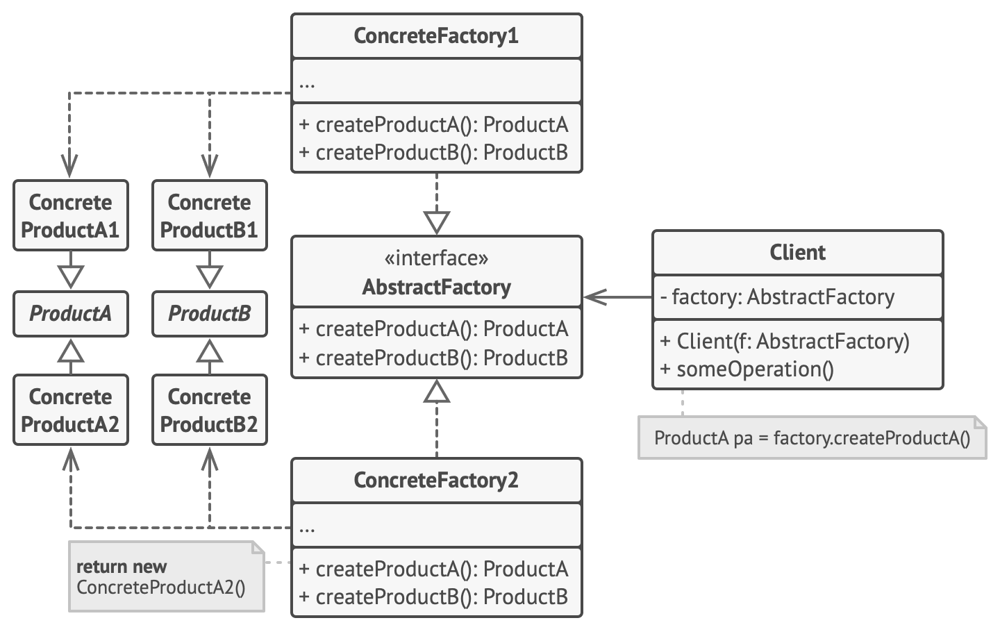
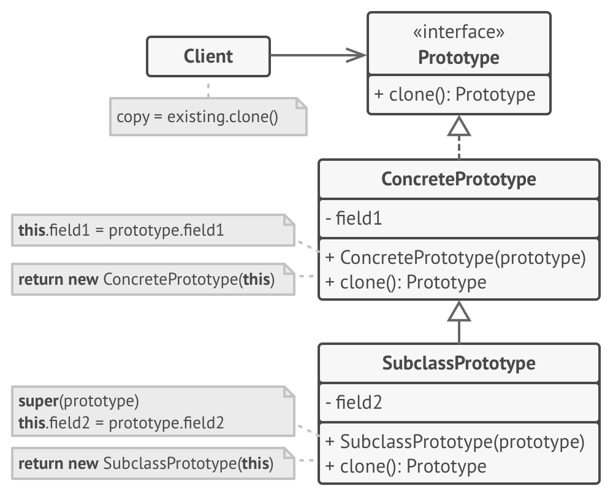
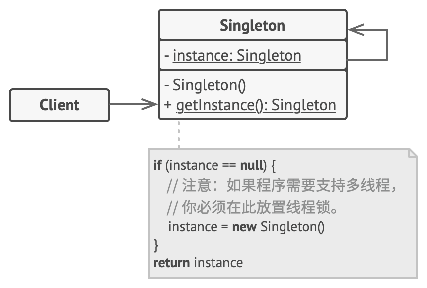
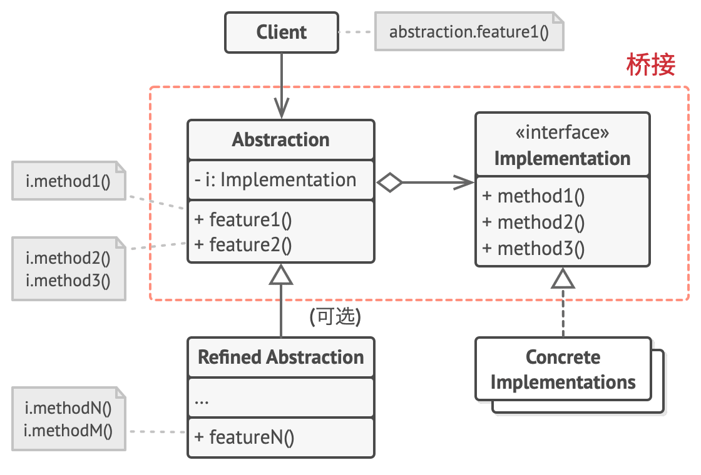
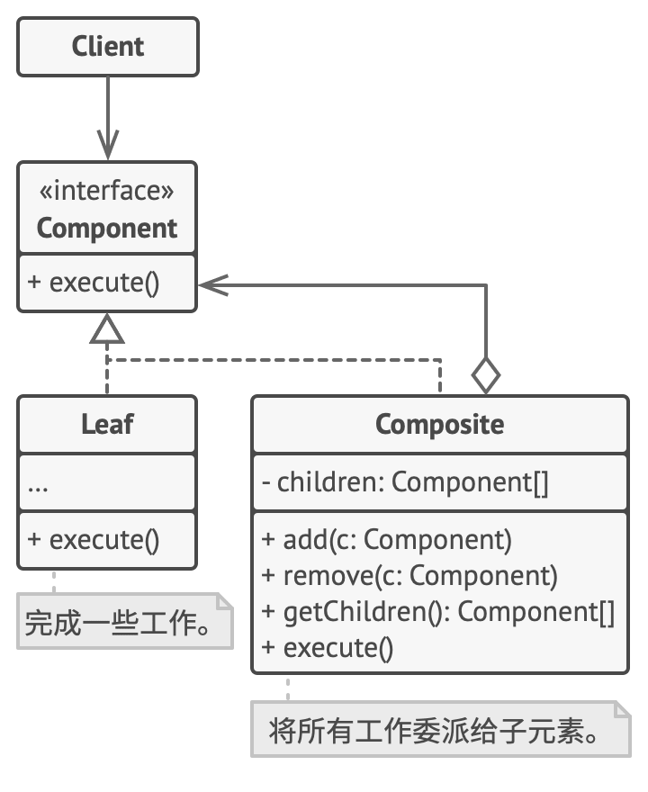
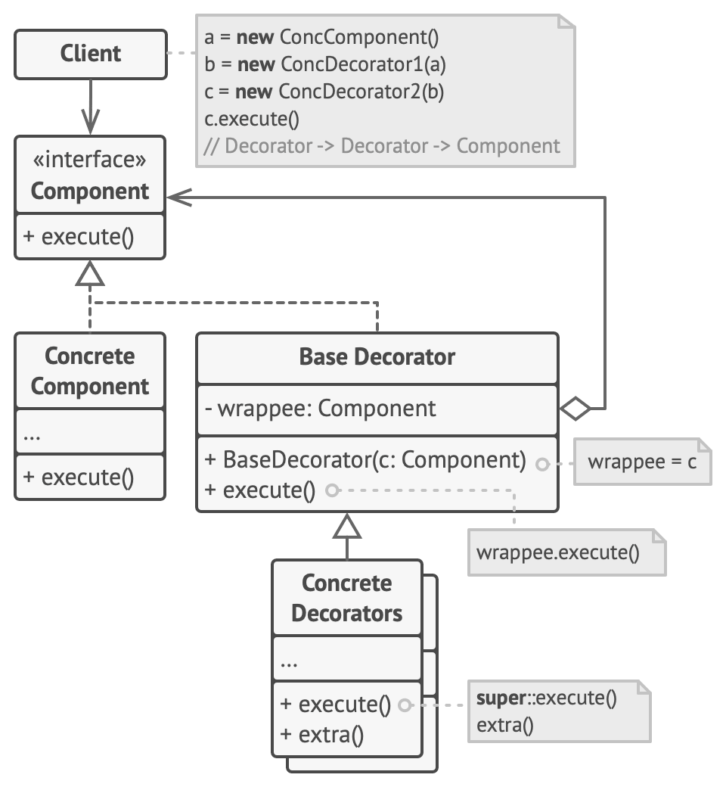
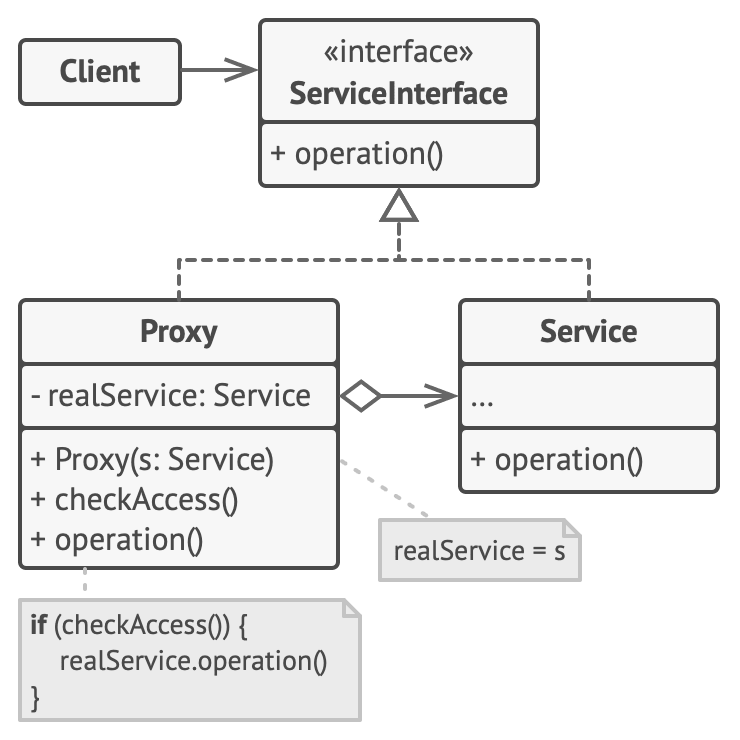
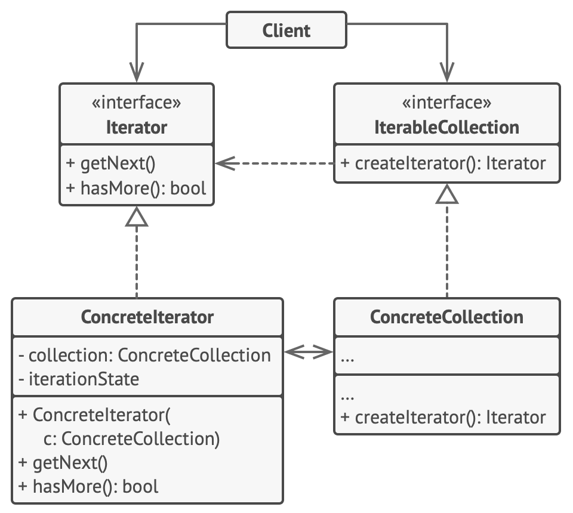

> https://refactoring.guru/design-patterns/cpp

### 创建型模式Creational Patterns

#### 抽象工厂 Abstract Factory
抽象工厂模式是一种创建型设计模式， 它能创建一系列相关的对象， 而无需指定其具体类。

抽象工厂类型利用多态指向了具体工厂, 具体工厂重写待抽象工厂的虚函数, client调用抽象工厂的函数等价于调用具体工厂的函数, 从而实现client只需要知道抽象工厂的接口就能从具体工厂中获得想要的产品



```cpp
// 两个类，分别是产品类和工厂类
// 工厂类是抽象类，可以实现多种具体工厂
// 产品类也是抽象类，可以实现多种具体产品
// 具体工厂返回具体产品，用户只需要调用抽象工厂的某个函数即可经具体工厂返回产品
class AbstractProduct {
public:
    virtual ~AbstractProduct() {};
    virtual std::string UsefulFunction() const  = 0;
};


class ConcreteProductA : public AbstractProduct {
public:
    std::string UsefulFunction() const override {
        return "The result of the product A.";
    }
};

class ConcreteProductB : public AbstractProduct {
  std::string UsefulFunction() const override {
    return "The result of the product B.";
  }
};

class AbstractFactory {
public:
    virtual AbstractProduct* CreateProductA() const = 0;
     virtual AbstractProduct* CreateProductB() const = 0;
};

class ConcreteFactory : public AbstractFactory {
 public:
  AbstractProduct *CreateProductA() const override {
    return new ConcreteProductA();
  }
  AbstractProduct *CreateProductB() const override {
    return new ConcreteProductB();
  }
};


void ClientCode(const AbstractFactory &factory) {
  const AbstractProduct *product_a = factory.CreateProductA();
  const AbstractProduct *product_b = factory.CreateProductB();
  std::cout << product_a->UsefulFunction() << "\n";
  std::cout << product_b->UsefulFunction() << "\n";
  delete product_a;
  delete product_b;
}

int main() {
  std::cout << "Client: Testing client code with the first factory type:\n";
  ConcreteFactory1 *f1 = new ConcreteFactory1();
  ClientCode(*f1);
  delete f1;
  std::cout << std::endl;
  std::cout << "Client: Testing the same client code with the second factory type:\n";
  ConcreteFactory2 *f2 = new ConcreteFactory2();
  ClientCode(*f2);
  delete f2;
  return 0;
}
```

<!-- more -->

#### 工厂模式 Factory Method

工厂方法模式是一种创建型设计模式， 其在父类中提供一个创建对象的方法， 允许子类决定实例化对象的类型。
创建者(Creator)类声明返回产品对象的工厂方法。 该方法的返回对象类型必须与产品接口相匹配。用户需要指定返回对象的类型，也就是产品。

简单的, 一个基类表示产品类, 每种产品都继承该类; 同样一个基类表示工厂类, 每种工厂也继承自该类; client需要构造具体工厂类, 从而获取到产品。

和抽象工厂相比, 抽象工厂的工厂基类是接口, 内部为纯虚函数,抽象工厂内部可以返回抽象产品

工厂方法模式的工厂是创建出一种产品，而抽象工厂是创建出一类产品。


```cpp
// 用户访问Creator，Creator通过Product间接创建产品。
class Product { // 产品基类
 public:
  virtual ~Product() {}
  virtual std::string Operation() const = 0;
};

/**
 * Concrete Products provide various implementations of the Product interface.
 两种产品
 */
class ConcreteProduct1 : public Product {
 public:
  std::string Operation() const override {
    return "{Result of the ConcreteProduct1}";
  }
};
class ConcreteProduct2 : public Product {
 public:
  std::string Operation() const override {
    return "{Result of the ConcreteProduct2}";
  }
};

class Creator { // 工厂基类
  /**
   * Note that the Creator may also provide some default implementation of the
   * factory method.
   */
 public:
  virtual ~Creator(){};
  // 返回制造的产品
  virtual Product* FactoryMethod() const = 0;

  std::string SomeOperation() const {
    // Call the factory method to create a Product object.
    Product* product = this->FactoryMethod();
    // Now, use the product.
    std::string result = "Creator: The same creator's code has just worked with " + product->Operation();
    delete product;
    return result;
  }
};

/**
 * Concrete Creators override the factory method in order to change the
 * resulting product's type.
 */
class ConcreteCreator1 : public Creator {
// 工厂派生类返回制造产品
 public:
  Product* FactoryMethod() const override {
    return new ConcreteProduct1();
  }
};

class ConcreteCreator2 : public Creator {
 public:
  Product* FactoryMethod() const override {
    return new ConcreteProduct2();
  }
};

/**
 * The client code works with an instance of a concrete creator, albeit through
 * its base interface. As long as the client keeps working with the creator via
 * the base interface, you can pass it any creator's subclass.
 */
void ClientCode(const Creator& creator) {
  // ...
  std::cout << "Client: I'm not aware of the creator's class, but it still works.\n"
            << creator.SomeOperation() << std::endl;
  // ...
}

/**
 * The Application picks a creator's type depending on the configuration or
 * environment.
 */

int main() {
  std::cout << "App: Launched with the ConcreteCreator1.\n";
  Creator* creator = new ConcreteCreator1();
  ClientCode(*creator);
  std::cout << std::endl;
  std::cout << "App: Launched with the ConcreteCreator2.\n";
  Creator* creator2 = new ConcreteCreator2();
  ClientCode(*creator2);

  delete creator;
  delete creator2;
  return 0;
}
```

#### 建造者模式 Builder

生成器模式建议将对象构造代码从产品类中抽取出来， 并将其放在一个名为生成器的独立对象中。   

该模式会将对象构造过程划分为一组步骤， 比如 build­Walls创建墙壁和 build­Door创建房门创建房门等。 每次创建对象时, 你都需要通过生成器对象执行一系列步骤。 无需调用所有步骤， 而只需调用创建特定对象配置所需的那些步骤即可。


```cpp
// Director决定建造的方式
class Product{

public:
    std::vector<std::string> parts_;
    void ListParts() const{
        std::cout << "Product parts: ";
        for (size_t i = 0; i < parts_.size(); i++){
            if (parts_[i] == parts_.back()){
                std::cout << parts_[i];
            }else{
                std::cout << parts_[i] << ", ";
            }
        }
        std::cout<< "\n\n";
    }
};

// 生成器接口
class Builder{
    public:
    virtual ~Builder(){}
    virtual void ProducePartA() const =0;
    virtual void ProducePartB() const =0;
    virtual void ProducePartC() const =0;
};

// 第一种生成方法
class ConcreteBuilder : public Builder {
private:
    Product* product;
public:
    ConcreteBuilder(){
        this->Reset();
    }
    ~ConcreteBuilder(){
        delete product;
    }

    void Reset(){
        this->product = new Product();
    }
    void ProducePartA()const override{
        this->product->parts_.push_back("PartA");
    }

    void ProducePartB()const override{
        this->product->parts_.push_back("PartB");
    }

    void ProducePartC()const override{
        this->product->parts_.push_back("PartC");
    }
    Product* GetProduct() {
        Product* result= this->product;
        this->Reset();
        return result;
    }
};

class Director{
private:
    Builder* builder;
public:
    void set_builder(Builder* builder){
        this->builder = builder;
    }
    void BuildMinimalViableProduct(){
        this->builder->ProducePartA();
    }
    
    void BuildFullFeaturedProduct(){
        this->builder->ProducePartA();
        this->builder->ProducePartB();
        this->builder->ProducePartC();
    }
};

void ClientCode(Director& director)
{
    ConcreteBuilder1* builder = new ConcreteBuilder1(); // 具体builder
    director.set_builder(builder);
    std::cout << "Standard basic product:\n"; 
    director.BuildMinimalViableProduct();
    
    Product1* p= builder->GetProduct();
    p->ListParts();
    delete p;

    std::cout << "Standard full featured product:\n"; 
    director.BuildFullFeaturedProduct();

    p= builder->GetProduct();
    p->ListParts();
    delete p;

    // Remember, the Builder pattern can be used without a Director class.
    std::cout << "Custom product:\n";
    builder->ProducePartA();
    builder->ProducePartC();
    p=builder->GetProduct();
    p->ListParts();
    delete p;

    delete builder;
}

int main(){
    Director* director= new Director();
    ClientCode(*director);
    delete director;
    return 0;    
}
```

### 原型模式 Prototype

原型模式是一种创建型设计模式， 使你能够复制已有对象， 而又无需使代码依赖它们所属的类。

原型 （Prototype） 接口将对克隆方法进行声明。 在绝大多数情况下， 其中只会有一个名为 clone克隆的方法。


```cpp
using std::string;

// Prototype Design Pattern
//
// Intent: Lets you copy existing objects without making your code dependent on
// their classes.

enum Type {
  PROTOTYPE_1 = 0,
  PROTOTYPE_2
};

/**
 * The example class that has cloning ability. We'll see how the values of field
 * with different types will be cloned.
 */

class Prototype {
 protected:
  string prototype_name_;
  float prototype_field_;

 public:
  Prototype() {}
  Prototype(string prototype_name)
      : prototype_name_(prototype_name) {
  }
  virtual ~Prototype() {}
  virtual Prototype *Clone() const = 0; // clone方法
  virtual void Method(float prototype_field) {
    this->prototype_field_ = prototype_field;
    std::cout << "Call Method from " << prototype_name_ << " with field : " << prototype_field << std::endl;
  }
};

/**
 * ConcretePrototype1 is a Sub-Class of Prototype and implement the Clone Method
 * In this example all data members of Prototype Class are in the Stack. If you
 * have pointers in your properties for ex: String* name_ ,you will need to
 * implement the Copy-Constructor to make sure you have a deep copy from the
 * clone method
 */

class ConcretePrototype1 : public Prototype {
 private:
  float concrete_prototype_field1_;

 public:
  ConcretePrototype1(string prototype_name, float concrete_prototype_field)
      : Prototype(prototype_name), concrete_prototype_field1_(concrete_prototype_field) {
  }

  /**
   * Notice that Clone method return a Pointer to a new ConcretePrototype1
   * replica. so, the client (who call the clone method) has the responsability
   * to free that memory. I you have smart pointer knowledge you may prefer to
   * use unique_pointer here.
   */
  Prototype *Clone() const override {
    return new ConcretePrototype1(*this);
  }
};

class ConcretePrototype2 : public Prototype {
 private:
  float concrete_prototype_field2_;

 public:
  ConcretePrototype2(string prototype_name, float concrete_prototype_field)
      : Prototype(prototype_name), concrete_prototype_field2_(concrete_prototype_field) {
  }
  Prototype *Clone() const override {
    return new ConcretePrototype2(*this);
  }
};

/**
 * In PrototypeFactory you have two concrete prototypes, one for each concrete
 * prototype class, so each time you want to create a bullet , you can use the
 * existing ones and clone those.
 */

class PrototypeFactory {
 private:
  std::unordered_map<Type, Prototype *, std::hash<int>> prototypes_;

 public:
  PrototypeFactory() {
    prototypes_[Type::PROTOTYPE_1] = new ConcretePrototype1("PROTOTYPE_1 ", 50.f);
    prototypes_[Type::PROTOTYPE_2] = new ConcretePrototype2("PROTOTYPE_2 ", 60.f);
  }

  /**
   * Be carefull of free all memory allocated. Again, if you have smart pointers
   * knowelege will be better to use it here.
   */

  ~PrototypeFactory() {
    delete prototypes_[Type::PROTOTYPE_1];
    delete prototypes_[Type::PROTOTYPE_2];
  }

  /**
   * Notice here that you just need to specify the type of the prototype you
   * want and the method will create from the object with this type.
   */
  Prototype *CreatePrototype(Type type) {
    return prototypes_[type]->Clone();
  }
};

void Client(PrototypeFactory &prototype_factory) {
  std::cout << "Let's create a Prototype 1\n";

  Prototype *prototype = prototype_factory.CreatePrototype(Type::PROTOTYPE_1);
  prototype->Method(90);
  delete prototype;

  std::cout << "\n";

  std::cout << "Let's create a Prototype 2 \n";

  prototype = prototype_factory.CreatePrototype(Type::PROTOTYPE_2);
  prototype->Method(10);

  delete prototype;
}

int main() {
  PrototypeFactory *prototype_factory = new PrototypeFactory();
  Client(*prototype_factory);
  delete prototype_factory;

  return 0;
}
```

#### 单例模式 Singleton

保证一个类只有一个实例， 并提供一个访问该实例的全局节点。具体运用场景如：设备管理器，系统中可能有多个设备，但是只有一个设备管理器，用于管理设备驱动; 数据池，用来缓存数据的数据结构，需要在一处写，多处读取或者多处写，多处读取;

所有单例的实现都包含以下两个相同的步骤：

1. 将**默认构造函数设为私有**，防止其他对象使用单例类的new运算符。
2. 新建**一个静态构建方法作为构造函数**。 该函数会调用私有构造函数来创建对象，并将其保存在一个静态成员变量中。 此后所有对于该函数的调用都将返回这一缓存对象。




懒汉版(Lazy Singleton)：单例实例在第一次被使用时才进行初始化，这叫做延迟初始化。
```cpp
class Singleton {
public:
// 一个class只能通过GetInstance创建一个对象
    static Singleton* GetInstance() {
        if (!instance_){    // 当访问对象时才进行创建
            std::lock_guard<std::mutex> lock(lock_);    // 通过加锁保证多线程安全
            if (!instance_){
                instance_ = new Singleton();
            }
        }
        return instance_;
    }
private:
    static std::mutex lock_;
    static Singleton* instance_;

private:
    Singleton() {};
    virtual ~Singleton() {};
    Singleton(const Singleton& ) = delete;
    Singleton& operator=(const Singleton& ) = delete;
};
```

C++11规定了local static(局部静态变量)在多线程条件下的初始化行为，要求编译器保证了内部静态变量的线程安全性。在C++11标准下，《Effective C++》提出了一种更优雅的单例模式实现，使用函数内的 local static 对象。这样，只有当第一次访问getInstance()方法时才创建实例。这种方法也被称为Meyers' Singleton。C++0x之后该实现是线程安全的，C++0x之前仍需加锁。

```cpp
class Singleton
{
private:
	Singleton() { };
	~Singleton() { };
	Singleton(const Singleton&);
	Singleton& operator=(const Singleton&);
public:
	static Singleton& getInstance() 
  {
		static Singleton instance;
		return instance;
	}
};
```

饿汉版(Eager Singleton)：指单例实例在程序运行时被立即执行初始化, 通过设置静态变量可以达到这个目的
```cpp
class Singleton
{
private:
	static Singleton instance;
private:
	Singleton();
	~Singleton();
	Singleton(const Singleton&);
	Singleton& operator=(const Singleton&);
public:
	static Singleton& getInstance() {
		return instance;
	}
}

// initialize defaultly
Singleton Singleton::instance;
```

基于C++11保证的局部静态变量的Lazy Singleton版本是合理的

* C++中static对象的初始化

C++规定，non-local static 对象的初始化发生在main函数执行之前，也即main函数之前的单线程启动阶段，所以不存在线程安全问题。但C++没有规定多个non-local static 对象的初始化顺序，尤其是来自多个编译单元的non-local static对象，他们的初始化顺序是随机的(虽然肯定都在main函数之前进行), 因此设置太多的non-local static对象在大型项目中可能出现问题。

对于local static 对象，其初始化发生在控制流第一次执行到该对象的初始化语句时。多个线程的控制流可能同时到达其初始化语句。在C++11之前，在多线程环境下local static对象的初始化并不是线程安全的。具体表现就是：如果一个线程正在执行local static对象的初始化语句但还没有完成初始化，此时若其它线程也执行到该语句，那么这个线程会认为自己是第一次执行该语句并进入该local static对象的构造函数中。这会造成这个local static对象的重复构造，进而产生内存泄露问题(local static存放在线程共享区的静态区, 多线程下只会析构一次)。

C++11则在语言规范中解决了这个问题。C++11规定，在一个线程开始local static 对象的初始化后到完成初始化前，其他线程执行到这个local static对象的初始化语句就会等待，直到该local static 对象初始化完成。

### 结构型模式Structural Patterns

#### Adapter

适配器模式是一种结构型设计模式， 它能使接口不兼容的对象能够相互合作。

1. 适配器实现与其中一个现有对象兼容的接口。
2. 现有对象可以使用该接口安全地调用适配器方法。
3. 适配器方法被调用后将以另一个对象兼容的格式和顺序将请求传递给该对象。

适配器模式实现的原理, **适配器实现了其中一个对象的接口， 并对另一个对象进行封装**。


```cpp
/**
 * The Target defines the domain-specific interface used by the client code.
 */
class Target {
 public:
  virtual ~Target() = default;

  virtual std::string Request() const {
    return "Target: The default target's behavior.";
  }
};

/**
 * The Adaptee contains some useful behavior, but its interface is incompatible
 * with the existing client code. The Adaptee needs some adaptation before the
 * client code can use it.
 */
class Adaptee {
 public:
  std::string SpecificRequest() const {
    return ".eetpadA eht fo roivaheb laicepS";
  }
};

/**
 * The Adapter makes the Adaptee's interface compatible with the Target's
 * interface.
 * Adapter重写了Target的Request()接口, 因为作为Target的子类, 对外表现的如同Target
 */
class Adapter : public Target {
 private:
  Adaptee *adaptee_;

 public:
  Adapter(Adaptee *adaptee) : adaptee_(adaptee) {}
  std::string Request() const override {
    std::string to_reverse = this->adaptee_->SpecificRequest();
    std::reverse(to_reverse.begin(), to_reverse.end());
    return "Adapter: (TRANSLATED) " + to_reverse;
  }
};

/**
 * The client code supports all classes that follow the Target interface.
 */
void ClientCode(const Target *target) {
  std::cout << target->Request();
}

int main() {
  std::cout << "Client: I can work just fine with the Target objects:\n";
  Target *target = new Target;
  ClientCode(target);
  std::cout << "\n\n";
  Adaptee *adaptee = new Adaptee;
  std::cout << "Client: The Adaptee class has a weird interface. See, I don't understand it:\n";
  std::cout << "Adaptee: " << adaptee->SpecificRequest();
  std::cout << "\n\n";
  std::cout << "Client: But I can work with it via the Adapter:\n";
  Adapter *adapter = new Adapter(adaptee);
  ClientCode(adapter);
  std::cout << "\n";

  delete target;
  delete adaptee;
  delete adapter;

  return 0;
}
```

#### 桥接模式 Bridge
桥接模式是一种结构型设计模式， 可将一个大类或一系列紧密相关的类拆分为抽象和实现两个独立的层次结构， 从而能在开发时分别使用。

抽象部分 （Abstraction） 提供高层控制逻辑， 依赖于完成底层实际工作的实现对象。

实现部分 （Implementation） 为所有具体实现声明通用接口。 抽象部分仅能通过在这里声明的方法与实现对象交互。

桥接模式通常会于开发前期进行设计， 使你能够将程序的各个部分独立开来以便开发。 另一方面， 适配器模式通常在已有程序中使用， 让相互不兼容的类能很好地合作。



#### 组合模式 Composite
组合模式是一种结构型设计模式， 你可以使用它将对象组合成树状结构， 并且能像使用独立对象一样使用它们。类似一种层次结构，上层由下层所组成。



#### 装饰器模式 Wrapper、Decorator
装饰模式是一种结构型设计模式， 允许你通过将对象放入包含行为的特殊封装对象中来为原对象绑定新的行为。

当你需要更改一个对象的行为时， 第一个想法就是扩展它所属的类。 但是可能存在几个严重问题。
1. 继承是静态的。 你无法在运行时更改已有对象的行为， 只能使用由不同子类创建的对象来替代当前的整个对象。
2. 子类只能有一个父类。 大部分编程语言不允许一个类同时继承多个类的行为。

封装器是一个能与目标对象连接的对象。 封装器包含与目标对象相同的一系列方法， 它会将所有接收到的请求委派给目标对象。 但是， 封装器可以在将请求委派给目标前后对其进行处理， 这样就起到了装饰的效果。



具体部件 （Concrete Component） 类是被封装对象所属的类。 它定义了基础行为， 但装饰类可以改变这些行为。

基础装饰 （Base Decorator） 类拥有一个指向被封装对象的引用成员变量。装饰基类会将所有操作委派给被封装的对象。

具体装饰类 （Concrete Decorators） 定义了可动态添加到部件的额外行为。 

```cpp
class Component {
public:
    virtual ~Component() {}
    virtual std::string Operation() const = 0;
};

class ConcreteComponent : public Component {
public:
  std::string Operation() const override {
    return "ConcreteComponent";
  }
};

class Decorator : public Component {
protected:
    Component* component_;  // 引用
public:
    Decorator(Component* component) : component_(component){}

    std::string Operation() const override {
        return this->component_->Operation();
    }
};

class ConcreteDecoratorA : public Decorator {
public:
    ConcreteDecoratorA(Component* component) : Decorator(component) {
    }
    std::string Operation() const override {
        return "ConcreteDecoratorA(" + Decorator::Operation() + ")";
    }
};

class ConcreteDecoratorB : public Decorator {
public:
  ConcreteDecoratorB(Component* component) : Decorator(component) {
  }

  std::string Operation() const override {
    return "ConcreteDecoratorB(" + Decorator::Operation() + ")";
  }
};

void ClientCode(Component* component) {
  std::cout << "RESULT: " << component->Operation();
}
```

### 代理模式
代理模式是一种结构型设计模式， 代理控制着对于原对象的访问， 并允许在将请求提交给对象前后进行一些处理。

代理模式建议新建一个与原服务对象接口相同的代理类， 然后更新应用以将代理对象传递给所有原始对象客户端。 


服务接口 （Service Interface） 声明了服务接口。 代理必须遵循该接口才能伪装成服务对象。

代理 （Proxy） 类包含一个指向服务对象的引用成员变量。 代理完成其任务 （例如延迟初始化、 记录日志、 访问控制和缓存等） 后会将请求传递给服务对象。 


### 行为模式

#### 迭代器模式 Iterator
迭代器模式是一种行为设计模式， 让你能在不暴露集合底层表现形式 （列表、 栈和树等） 的情况下遍历集合中所有的元素。


迭代器 （Iterator） 接口声明了遍历集合所需的操作。

集合 （Collection） 接口声明一个或多个方法来获取与集合兼容的迭代器。

具体迭代器 （Concrete Iterators） 实现遍历集合的一种特定算法。

```cpp
/**
 * Iterator Design Pattern
 *
 * Intent: Lets you traverse elements of a collection without exposing its
 * underlying representation (list, stack, tree, etc.).
 */

#include <iostream>
#include <string>
#include <vector>

/**
 * C++ has its own implementation of iterator that works with a different
 * generics containers defined by the standard library.
 */

template <typename T, typename U>
class Iterator {
 public:
  typedef typename std::vector<T>::iterator iter_type;
  Iterator(U *p_data, bool reverse = false) : m_p_data_(p_data) {
    m_it_ = m_p_data_->m_data_.begin();
  }

  void First() {
    m_it_ = m_p_data_->m_data_.begin();
  }

  void Next() {
    m_it_++;
  }

  bool IsDone() {
    return (m_it_ == m_p_data_->m_data_.end());
  }

  iter_type Current() {
    return m_it_;
  }

 private:
  U *m_p_data_;
  iter_type m_it_;
};

/**
 * Generic Collections/Containers provides one or several methods for retrieving
 * fresh iterator instances, compatible with the collection class.
 */

template <class T>
class Container {
  friend class Iterator<T, Container>;

 public:
  void Add(T a) {
    m_data_.push_back(a);
  }

  Iterator<T, Container> *CreateIterator() {
    return new Iterator<T, Container>(this);
  }

 private:
  std::vector<T> m_data_;
};

class Data {
 public:
  Data(int a = 0) : m_data_(a) {}

  void set_data(int a) {
    m_data_ = a;
  }

  int data() {
    return m_data_;
  }

 private:
  int m_data_;
};

/**
 * The client code may or may not know about the Concrete Iterator or Collection
 * classes, for this implementation the container is generic so you can used
 * with an int or with a custom class.
 */
void ClientCode() {
  std::cout << "________________Iterator with int______________________________________" << std::endl;
  Container<int> cont;

  for (int i = 0; i < 10; i++) {
    cont.Add(i);
  }

  Iterator<int, Container<int>> *it = cont.CreateIterator();
  for (it->First(); !it->IsDone(); it->Next()) {
    std::cout << *it->Current() << std::endl;
  }

  Container<Data> cont2;
  Data a(100), b(1000), c(10000);
  cont2.Add(a);
  cont2.Add(b);
  cont2.Add(c);

  std::cout << "________________Iterator with custom Class______________________________" << std::endl;
  Iterator<Data, Container<Data>> *it2 = cont2.CreateIterator();
  for (it2->First(); !it2->IsDone(); it2->Next()) {
    std::cout << it2->Current()->data() << std::endl;
  }
  delete it;
  delete it2;
}

int main() {
  ClientCode();
  return 0;
}
```

#### 观察者模式 Observer

观察者模式是一种行为设计模式， 允许你定义一种订阅机制， 可在对象事件发生时通知多个 "观察" 该对象的其他对象。

拥有一些值得关注的状态的对象通常被称为目标， 由于它要将自身的状态改变通知给其他对象， 我们也将其称为发布者 publisher。 所有希望关注发布者状态变化的其他对象被称为订阅者 （subscribers）。

**所有订阅者都必须实现同样的接口， 发布者仅通过该接口与订阅者交互**。 接口中必须声明通知方法及其参数， 这样发布者在发出通知时还能传递一些上下文数据。

发布者持有订阅者接口的列表，可通过列表访问订阅者，例如发布信息。同样每个订阅者持有发布者对象的指针，可调用之实现Attach，Detach等功能。


```cpp
/**
 * Observer Design Pattern
 *
 * Intent: Lets you define a subscription mechanism to notify multiple objects
 * about any events that happen to the object they're observing.
 *
 */

#include <iostream>
#include <list>
#include <string>

class IObserver {
 public:
  virtual ~IObserver(){};
  virtual void Update(const std::string &message_from_subject) = 0;
};

class ISubject {
 public:
  virtual ~ISubject(){};
  virtual void Attach(IObserver *observer) = 0;
  virtual void Detach(IObserver *observer) = 0;
  virtual void Notify() = 0;
};

/**
 * The Subject owns some important state and notifies observers when the state
 * changes.
 */

// 实现了subject
class Subject : public ISubject {
 public:
  virtual ~Subject() {
    std::cout << "Goodbye, I was the Subject.\n";
  }

  /**
   * The subscription management methods.
   */
  // 注册的ui对象
  void Attach(IObserver *observer) override {
    list_observer_.push_back(observer);
  }
  // 删除对象注册
  void Detach(IObserver *observer) override {
    list_observer_.remove(observer);
  }
  void Notify() override {
    std::list<IObserver *>::iterator iterator = list_observer_.begin();
    HowManyObserver();
    while (iterator != list_observer_.end()) {
      (*iterator)->Update(message_);
      ++iterator;
    }
  }

  void CreateMessage(std::string message = "Empty") {
    this->message_ = message;
    Notify();
  }
  void HowManyObserver() {
    std::cout << "There are " << list_observer_.size() << " observers in the list.\n";
  }

  /**
   * Usually, the subscription logic is only a fraction of what a Subject can
   * really do. Subjects commonly hold some important business logic, that
   * triggers a notification method whenever something important is about to
   * happen (or after it).
   */
  void SomeBusinessLogic() {
    this->message_ = "change message message";
    Notify();
    std::cout << "I'm about to do some thing important\n";
  }

 private:
  std::list<IObserver *> list_observer_;
  std::string message_;
};

class Observer : public IObserver {
 public:
 // 用subject_创建Observer, 效果是将subject_添加到Observer中
  Observer(Subject &subject) : subject_(subject) {
    this->subject_.Attach(this);
    std::cout << "Hi, I'm the Observer \"" << ++Observer::static_number_ << "\".\n";
    this->number_ = Observer::static_number_;
  }
  virtual ~Observer() {
    std::cout << "Goodbye, I was the Observer \"" << this->number_ << "\".\n";
  }

  void Update(const std::string &message_from_subject) override {
    message_from_subject_ = message_from_subject;
    PrintInfo();
  }
  void RemoveMeFromTheList() {
    subject_.Detach(this);
    std::cout << "Observer \"" << number_ << "\" removed from the list.\n";
  }
  void PrintInfo() {
    std::cout << "Observer \"" << this->number_ << "\": a new message is available --> " << this->message_from_subject_ << "\n";
  }

 private:
  std::string message_from_subject_;
  Subject &subject_;
  static int static_number_;
  int number_;
};

int Observer::static_number_ = 0;

void ClientCode() {
  Subject *subject = new Subject;
  Observer *observer1 = new Observer(*subject);
  Observer *observer2 = new Observer(*subject);
  Observer *observer3 = new Observer(*subject);
  Observer *observer4;
  Observer *observer5;

  subject->CreateMessage("Hello World! :D");
  observer3->RemoveMeFromTheList();

  subject->CreateMessage("The weather is hot today! :p");
  observer4 = new Observer(*subject);

  observer2->RemoveMeFromTheList();
  observer5 = new Observer(*subject);

  subject->CreateMessage("My new car is great! ;)");
  observer5->RemoveMeFromTheList();

  observer4->RemoveMeFromTheList();
  observer1->RemoveMeFromTheList();

  delete observer5;
  delete observer4;
  delete observer3;
  delete observer2;
  delete observer1;
  delete subject;
}

int main() {
  ClientCode();
  return 0;
}

```

#### 策略模式 Strategy

策略模式是一种行为设计模式， 策略模式建议找出负责用许多不同方式完成特定任务的类， 然后将其中的算法抽取到一组被称为策略的独立类中。


上下文 （Context） 维护指向具体策略的引用。

策略 （Strategy） 接口是所有具体策略的通用接口， 它声明了一个上下文用于执行策略的方法。

具体策略 （Concrete Strategies） 实现了上下文所用算法的各种不同变体。

```cpp
class Strategy{
public:
    virtual ~Strategy() {}
    virtual std::string DoAlgorithm(const std::vector<std::string>& data) const = 0;
};

class Context{
private:
    Strategy* strategy_;
public:
    Context(Strategy* strategy = nullptr) : strategy_(strategy){}
    ~Context(){
        delete this->strategy_;
    }
    void set_strategy(Strategy* strategy){
        delete this->strategy_;
        this->strategy_ = strategy;
    }
    void DoSomeBusinessLogic() const{
        std::cout << "Context: Sorting data using the strategy (not sure how it'll do it)\n";
        std::string result = this->strategy_->DoAlgorithm(std::vector<std::string>{"a", "e", "c", "b", "d"});
        std::cout << result << "\n";    
    }
};

class ConcreteStrategyA : public Strategy
{
public:
    std::string DoAlgorithm(const std::vector<std::string> &data) const override
    {
        std::string result;
        std::for_each(std::begin(data), std::end(data), [&result](const std::string &letter) {
            result += letter;
        });
        std::sort(std::begin(result), std::end(result));

        return result;
    }
};
class ConcreteStrategyB : public Strategy
{
    std::string DoAlgorithm(const std::vector<std::string> &data) const override
    {
        std::string result;
        std::for_each(std::begin(data), std::end(data), [&result](const std::string &letter) {
            result += letter;
        });
        std::sort(std::begin(result), std::end(result));
        for (int i = 0; i < result.size() / 2; i++)
        {
            std::swap(result[i], result[result.size() - i - 1]);
        }

        return result;
    }
};

void ClientCode()
{
    Context *context = new Context(new ConcreteStrategyA);
    std::cout << "Client: Strategy is set to normal sorting.\n";
    context->DoSomeBusinessLogic();
    std::cout << "\n";
    std::cout << "Client: Strategy is set to reverse sorting.\n";
    context->set_strategy(new ConcreteStrategyB);
    context->DoSomeBusinessLogic();
    delete context;
}
```
