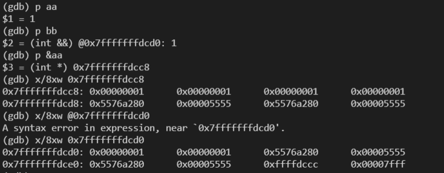

> 现代stl是模板编程的优秀例子, 而左值和右值实际是编译期的问题, 具体的, 就是模板和模板元编程的问题

### 容器的左值和右值

#### 左值还是右值

`vector` 内部元素返回的是左值还是右值呢? 答案是左值(具名对象)

```cpp
vector<int> vect = {1,2,3,4};

int b = vect[0];
int& b2 = vect[0];
// 输出
1
1

int& b2 = vect[0];
// 无法通过编译
param.cpp:19:11: error: conflicting declaration ‘int&& b’

// stl源码, 返回reference
  reference
  operator[](size_type __n)
  { return *(this->_M_impl._M_start + __n); }
```

但`vector`的成员变量方法以右值(字面值)形式返回

```cpp
size_t& size = vect.size();
// 不能通过编译
error: cannot bind non-const lvalue reference of type ‘size_t& {aka long unsigned int&}’ to an rvalue of type ‘std::vector<int>::size_type {aka long unsigned int}

/// 迭代器返回的也是右值
auto& iter = vect.begin();
// 报错
cannot bind non-const lvalue reference of type ‘__gnu_cxx::__normal_iterator<int*, std::vector<int> >&’ to an rvalue of type ‘std::vector<int>::iterator {aka __gnu_cxx::__normal_iterator<int*, std::vector<int> >}’
/// 可见auto 解析成了std::vector<int>::iterator

/// 元素返回的是左值
vector<int>&& num = *vect.begin();
// 报错
invalid initialization of reference of type ‘std::vector<int>&&’ from expression of type ‘int’
```

<!-- more -->
#### swap

现代的`swap`实现
```cpp
template<typename T> void swap(T& t1, T& t2) {
    T temp = std::move(t1); // or T temp(std::move(t1));
    t1 = std::move(t2);
    t2 = std::move(temp);
}
```

vector的`swap`函数,**只是对内部主要迭代器(指针)进行了swap, 不是拷贝内存**。
```cppp
	void _M_swap_data(_Vector_impl& __x)
	{
	  std::swap(_M_start, __x._M_start);
	  std::swap(_M_finish, __x._M_finish);
	  std::swap(_M_end_of_storage, __x._M_end_of_storage);
	}
```

`std::swap`位于`move.h`文件中, 核心就是`std::move`,实现如下
```cpp
    void
    swap(_Tp& __a, _Tp& __b)
    {
      // concept requirements
      __glibcxx_function_requires(_SGIAssignableConcept<_Tp>)

      _Tp __tmp = _GLIBCXX_MOVE(__a);
      __a = _GLIBCXX_MOVE(__b);
      __b = _GLIBCXX_MOVE(__tmp);
    }
    // ..其中
    #define _GLIBCXX_MOVE(__val) std::move(__val)

  template<typename _Tp>
    constexpr typename std::remove_reference<_Tp>::type&&
    move(_Tp&& __t) noexcept
    { return static_cast<typename std::remove_reference<_Tp>::type&&>(__t); }
```

`std::move` 编译器层面将传入的参数用通用引用接受(这样没有拷贝的开销), 然后基于static_cast转为右值引用返回(传入的左值, 右值, 左值引用, 右值引用均转为右值引用)。

左值引用在传参时不会考虑临时对象生成等开销, 但是在拷贝时
```cpp
	Person(const Person& p)
	{
		cout << "Copy Constructor" << endl;
	}

	Person& operator=(const Person& p)
	{
		cout << "Assign" << endl;
		return *this;
	}
```
显然对于swap的_Tp temp = __a, `std::swap`的参数__a和__b都是_Tp类型的左值引用, 虽然a是左值引用, 但是这会调用拷贝构造函数, 创建temp是开辟新空间复制a的, 开销可能很大。

但是使用了`__a = std::move(__b);`, 这就不是调用拷贝构造函数了, 而是移动构造函数, 移动构造函数的实现也是基于std::move, 最终两个对象只是尽量少的交换了所有权, 开销远比基于左值引用的拷贝构造函数小

```cpp
MemoryBlock(MemoryBlock&& other)
   : _data(nullptr)
   , _length(0)
{
}

MemoryBlock& operator=(MemoryBlock&& other)
{
}
```

可见相比左值引用, 右值引用优势主要在于调用移动构造函数而不是拷贝构造函数, 此外右值引用的好处还有接收右值时不会生成临时对象, 这和左值引用优势是一致的 

#### 所有权的转移


如下, 使用 `v.push_back(std::move(str));`对象"Salut", str于vector所有权进行了交换, 再次打印str结果是空
```cpp
#include <iomanip>
#include <iostream>
#include <utility>
#include <vector>
#include <string>
 
int main()
{
    std::string str = "Salut";
    std::vector<std::string> v;
 
    // uses the push_back(const T&) overload, which means 
    // we'll incur the cost of copying str
    v.push_back(str);
    std::cout << "After copy, str is " << std::quoted(str) << '\n';
 
    // uses the rvalue reference push_back(T&&) overload, 
    // which means no strings will be copied; instead, the contents
    // of str will be moved into the vector.  This is less
    // expensive, but also means str might now be empty.
    v.push_back(std::move(str));
    std::cout << "After move, str is " << std::quoted(str) << '\n';
 
    std::cout << "The contents of the vector are { " << std::quoted(v[0])
                                             << ", " << std::quoted(v[1]) << " }\n";
}

输出
After copy, str is "Salut"
After move, str is ""
The contents of the vector are { "Salut", "Salut" }
```

#### 引用

注意一句话, **引用绑定对象后, 不能再绑定其他对象**, 这叫用其他对象修改引用绑定的值

```cpp
    string str1="a";
    string str3="b";
    string &str2=str1;
    /// 这句话不是str2绑定str3, 而是用str3改变str2所绑定的, 也就是str1
    /// 或者说str2地址不变, 里面的值用str3换了
    str2=str3;  // 左值引用不能改变绑定对象, 操作str2等于操作str1
    cout << str2<<endl;
    cout << str1<<endl;

/// 输出
b
b
/// 同样适用于右值引用
    string&& str4="a";
    /// 用"b"改变str4里面的值
    str4="b";
```

引用和传参

不论 左值引用 还是 右值引用 只有在赋值时设置绑定`int& b = a`, 但之后对于引用的操作均等同于绑定对象操作, 修改引用等价于修改引用值。

```cpp
Point bar(Point& val) {
  //...
  val = std::move(1);   // 这里等于操作val引用的变量
  val++;    // val一旦修改会影响引用值
  return val;    // 这里返回左值
}

Point b = bar();  // bar()返回的是左值, 如果是对象会有耗时的拷贝构造临时变量等

Point bar(Point& val) {
  //...
  val = std::move(1);   // val这里视为普通左值
  val++;    // val一旦修改会影响引用值
  return std::move(val);    // 返回右值
}
Point b = bar();  // 这样减少拷贝构造了, 只调用一个operator=()
```

1. **左值, 左值引用都可以绑定右值引用**。左值可以绑定, 右值, 左值, 右值引用, 左值引用.左值引用可以绑定左值, 左值引用, 右值引用, 但不能绑定右值.**左值能绑定右值, 但左值引用不能绑定右值**

```cpp
    string str1 = "a";  // 左值
    string&& str2="a";  // 右值引用
    string& str3 = str1;    // 左值引用

    string l = "a"; // 左值可以绑定, 右值, 左值, 右值引用, 左值引用
    l = str1;
    l = str2;
    l = str3;

    // string& l_ref = "a";    // 左值引用不能绑定右值
    string& l_ref = str1;   // 左值引用可以绑定左值, 左值引用, 右值引用
    l_ref = str2;
    l_ref = str3;
```

3. 右值肯定谁也不能绑定, 右值引用能绑定右值, **右值引用不能绑定左值,左值引用,右值引用**。换句话说, **右值引用只能绑定右值**,

4. 注意返回值是值还是引用, 引用内部是指针, 如果没有const意味着可以修改值(例如容器里的)。从运行角度上看待引用和值, 它们都只是寄存器的值而已。左值可以看成存储在栈/堆/静态区的值内存块, 左值引用只是一个地址。右值也可以看成值内存块, 右值引用也是一个地址。

#### std::move将参数转为右值引用

右值引用的优势和左值引用基本一致, 只是左值引用只能作用于对象的左值, 如`int a = 1`的a, 而不能作用于右值比如1; 右值引用可以作用于右值。在函数调用时常见的右值是临时对象, 因此右值引用可能防止临时对象拷贝, 从而提高效率。

拷贝会造成开辟一个新的内存并创建对象, 相当于硬拷贝; 引用只是增加了一个指向原来对象的指针, 修改在原来对象上修改, 减少了开辟空间和拷贝构造的开销。

对于左值引用而言, 左值引用可以绑定多个左值, 一旦一个左值引用修改, 其他都被影响

```cpp
    int aa =1;
    int& bb = a;
    int& cc = a;
    bb++;
    cout << cc<<endl;
// 输出 2
```
注意`std::move`返回参数不能被左值引用接受

更常用的是用右值引用接受`std::move`返回的结果, 右值引用赋值给右值引用

```cpp
int b = 3;
int&& c = std::move(b);
c = 4;
cout << b<<endl;

/// 输出为4
```
注意**一旦c修改了值, b的值也跟着改变**, 从运行内存角度看, c是一个寄存器的地址(不管左值引用而是右值引用), b则是内存的块。

那么右值引用根据什么找到右值, 应该是寻址, 右值也是存储在内存中(可以理解成全局变量), 肯定有地址。但注意右值一旦被释放, 右值引用也没有了。这就是引用和指针的区别, 指针可能因为对象析构段错误, 但对象析构了引用自然没了。因为引用和对象在同一个作用域, 只能绑定栈对象和全局对象。

```cpp
    cout << aa<<endl;
    cout << &aa<<endl;

    int&& bb = 1;
    cout << bb<<endl;
    cout << &bb<<endl;

输出
1
0x7fff4e2ffe18
1
0x7fff4e2ffe20
```



右值引用和左值的处理差不多感觉, 虽然**右值引用可以理解成左值, 但是它不能绑定左值**(右值引用是只能绑定右值的左值2333), 但右值引用可以被左值引用绑定。

```cpp
int c;
int && d = c;
// 编译失败
error: cannot bind rvalue reference of type ‘int&&’ to lvalue of type ‘int’
```

以下， 当函数参数设置为左值引用或者右值引用, 目的是接受左值, 右值。这样就保证无论拷贝时传的是左值还是右值, 都能用引用接收, 没有了拷贝临时对象的过程。
```cpp
template<typename T> void swap(T& t1, T& t2) {
    T temp = std::move(t1); // or T temp(std::move(t1));
    t1 = std::move(t2);
    t2 = std::move(temp);
}
```

除了传参时的效率上升, `std::move()`返回的是右值引用, 可以看成指针; 因此`t1 = std::move(t2)`相当于指针赋指针, 调用`operator=(T&&)`移动赋值。右值引用可以看成右值的代言人, 这里相当于代言人交换(内部指针交换), 不用内存深拷贝,提升了效率。


对内置类型，例如Int, 本身指针和值开销差不多。左值引用, 右值引用相比于传值效率也没啥提升。对象内部多用pimpl有助于移动效率的提升, 例如`vector`使用三个指针维护数据
```
	void _M_swap_data(_Vector_impl& __x)
	{
	  std::swap(_M_start, __x._M_start);
	  std::swap(_M_finish, __x._M_finish);
	  std::swap(_M_end_of_storage, __x._M_end_of_storage);
	}
```

**可以看出所谓右值引用, 左值引用都是编译器的行为**, 例如编译器某种情况下将右值引用看做左值并进行编译, 运行期它就是左值。

临时对象的概念也是编译器做的事, 不排除编译器将临时对象用右值引用处理避免拷贝构造来提升效率。

`std::move`只是将参数转为了右值, 使用其效率的提升可能是降低了中间临时变量生成, 但不能杜绝拷贝。右值引用`&&`是真滴可以大大提升效率所以用右值引用接收`std::move`。

```cpp
/// std::make_unique<int>(1)返回右值, p是左值
auto p = std::make_unique<int>(1);
/// std::move可以将左值转为右值
/// q是个左值,
auto q = std::move(p);

assert(p == nullptr);  // OK: reset to default
p.reset(new int{2});   // or p = std::make_unique<int>(2);
assert(*p == 2);       // OK: reset to int*(2
```

#### 移动构造函数和移动赋值

注意移动构造函数提升的效率来自传参, 相比于拷贝构造函数使用移动构造传参不需要拷贝构造或者临时对象, 函数内复杂度没有什么提升。

移动构造函数和移动赋值同样可以使用成员初值列赋值, 分别写作`MemoryBlock(MemoryBlock&& other)`, `MemoryBlock& operator=(MemoryBlock&& other) `

拷贝构造`MemoryBlock(MemoryBlock& other)`, 拷贝赋值`MemoryBlock& operator=(MemoryBlock& other) `, 可以看到构造返回的都是右值, 赋值返回的都是左值引用, 因为赋值考虑到a=b=c这种连续赋值, 因此保证返回值和参数类型的一致性。


```cpp
MemoryBlock(MemoryBlock&& other) noexcept // 移动构造
   : _data(nullptr)
   , _length(0)
{
   std::cout << "In MemoryBlock(MemoryBlock&&). length = "
             << other._length << ". Moving resource." << std::endl;

   // Copy the data pointer and its length from the
   // source object.
   /// other当前是个右值, 但可以直接调用other._data
   _data = other._data;
   _length = other._length;

   // Release the data pointer from the source object so that
   // the destructor does not free the memory multiple times.
   other._data = nullptr;
   other._length = 0;
}

// Move assignment operator.
MemoryBlock& operator=(MemoryBlock&& other) noexcept  // 移动赋值
{
   std::cout << "In operator=(MemoryBlock&&). length = "
             << other._length << "." << std::endl;

    /// other当前是个右值object, 因此取地址和this指针比较
   if (this != &other)
   {
      // Free the existing resource.
      delete[] _data;

      // Copy the data pointer and its length from the
      // source object.
      _data = other._data;
      _length = other._length;

      // Release the data pointer from the source object so that
      // the destructor does not free the memory multiple times.
      other._data = nullptr;
      other._length = 0;
   }
   return *this;
}
```

`std::move`可以配合移动构造函数使用, 如下移动赋值操作符, 本身`sources = std::move(a.sources);`也是调用的`a.sources`的移动赋值, 从而实现大事化小, 能移动的移动。

```cpp
void operator=(const RValue&& a) {
        /// 对a.source处理转为右值
		sources = std::move(a.sources);
		cout<<"&& =="<<endl;
	}
```
使用`std::move`是编译期行为, 不会影响运行效率(太强了)。但如果对象内部没有pimpl而只是内部变量, 使用移动赋值和构造只能提升传参过程中不需要生成临时变量的优化。

#### static_cast

static_cast转移了左值右值!

```cpp
int b = 3;
/// b变成了一个右值
int a = static_cast<int>( b);   //正常
int& a = static_cast<int>( b);   //报错
如上, static_cast<int>将左值b转移成了右值, 可赋给int a;

/// 如下, b还是一个左值
int a = static_cast<int&>( b);   //正常
int& a = static_cast<int&>( b);   //正常

/// b又变成了一个右值
int a = static_cast<int&&>( b); // 正常运行,输出b为3
int& a = static_cast<int&&>( b); // 报错
int&& a = static_cast<int&&>( b); // 正常运行,输出b为4
```
原来关键在`static_cast`啊, 这老哥不但转了类型, 还转了左值右值。这个本身也是编译期的行为。

```
int fun() {
    int* a = b;
    return a;   // 就算a是指针, 但以返回类型int为准
}

double b= fun();    // b与int返回类型应该一致

```
**`static<T>(a)`并不是将`a`转为T, 而是转为能以`T`为左值接受的`右值`**, 对`static<T&>(a)`来说, 返回能被左值引用`T&`接受的左值(左值引用是左值, 左值自然就是等号右边的右值了)。

显然`static_cast<typename remove_reference<T>::type &&>(t)`将t转为能被`typename remove_reference<T>::type &&`接受的右值。

**static_cast<T&&>(b) 可以将 T, T&, T&& 类型的b全部转为右值**, 真滴牛批, 这才是`std::move`的核心。

所谓左值右值, 只是编译器的定义(编译期确定, 模板), 只是左值对象赋给左值, C++会调用拷贝构造, 临时对象等操作(这是编译器的选择), 但右值对象赋给左值只需要一次`opeartor=`, 可以提高效率。这不意味着一个`std::move`就完事了, 还需要对对象内部的指针进行操作, 避免拷贝(例如vector交换指针`begin()`. 和`end()`而不是拷贝), 这些不是`std::move`解决的, 可以说`std::swap`使用了`std::move`而不等于`std::move1`。

#### 源码

```cpp
//传入参数是通用引用
// 返回值是_Tp&&通用引用, 期间不会修改__t的类型
// forward往往用于防止函数生成临时变量改变类型
  template<typename _Tp>
    constexpr _Tp&&
    forward(typename std::remove_reference<_Tp>::type&& __t) noexcept
    {
      static_assert(!std::is_lvalue_reference<_Tp>::value, "template argument"
		    " substituting _Tp is an lvalue reference type");
      return static_cast<_Tp&&>(__t);
    }

  /**
   *  @brief  Convert a value to an rvalue.
   *  @param  __t  A thing of arbitrary type.
   *  @return The parameter cast to an rvalue-reference to allow moving it.
  */
  // 对传入的类型_Tp, 是一个通用引用, 首先通过std::remove_reference取出T&, T&&的引用符号
  // 再通过typename std::remove_reference<_Tp>::type&&, 得到右值引用, 返回值是一个右值引用
  template<typename _Tp>
    constexpr typename std::remove_reference<_Tp>::type&&
    move(_Tp&& __t) noexcept
    { return static_cast<typename std::remove_reference<_Tp>::type&&>(__t); }
```

#### 完美转发

std::forward的源码

```cpp
template<typename _Tp>
  constexpr _Tp&&
  forward(typename std::remove_reference<_Tp>::type& __t) noexcept
  { return static_cast<_Tp&&>(__t); }
```

move传入的参数是一个通用引用, 可以看成(T&&), 结果是对于参数__t, 将传入左值/左值引用参数, _Tp推导成左值引用,__t类型也是左值引用; 传入的右值/右值引用_Tp推导成非引用但__t是_Tp&&即右值引用。最后使用static_cast将左值引用或右值引用__t强制转化为右值引用返回。

而对于forward的参数`typename std::remove_reference<_Tp>::type&`当传入参数为左值引用X&时, _Tp被推导成X&;传入参数为右值引用X&&时, _Tp推导成X&&; 因此因此传入左值引用那__t就是左值引用, 传入右值引用那__t就是右值引用。 

完美转发的意思是根据参数调用合理的函数, 这往往发生在重载时, 即存在多个函数名相同但参数类型不同的函数, std::forward支持准确调用最符合类型要求参数的函数。


```cpp
#include <iostream>
#include <memory>
#include <utility>
 
struct A {
    A(int&& n) { std::cout << "rvalue overload, n=" << n << "\n"; }   // 和右值匹配
    A(int& n)  { std::cout << "lvalue overload, n=" << n << "\n"; }   // 和左值匹配
};
 
class B {
public:
    template<class T1, class T2, class T3>
    // 调用make_unique2<B>(2, i, 3);时, T1,T3推导为int类型, T2推导为int&类型
    B(T1&& t1, T2&& t2, T3&& t3) :
        a1_{std::forward<T1>(t1)},
        a2_{std::forward<T2>(t2)},
        a3_{std::forward<T3>(t3)}
    {
    }
 
private:
    A a1_, a2_, a3_;
};
 
template<class T, class U>
std::unique_ptr<T> make_unique1(U&& u)
{
    return std::unique_ptr<T>(new T(std::forward<U>(u)));
}
 
template<class T, class... U>
std::unique_ptr<T> make_unique2(U&&... u)
{
    return std::unique_ptr<T>(new T(std::forward<U>(u)...));
}
 
int main()
{   
    auto p1 = make_unique1<A>(2); // rvalue
    int i = 1;
    auto p2 = make_unique1<A>(i); // lvalue
 
    std::cout << "B\n";
    auto t = make_unique2<B>(2, i, 3);
}

输出
rvalue overload, n=2
lvalue overload, n=1
B
rvalue overload, n=2
lvalue overload, n=1
rvalue overload, n=3

不加构造函数std::forward的输出
rvalue overload, n=2
lvalue overload, n=1
B
lvalue overload, n=2
lvalue overload, n=1
lvalue overload, n=3
```

注, std::remove_reference
```cpp
int main() {
    std::cout << std::boolalpha;
 
    std::cout << "std::remove_reference<int>::type is int? "
              << std::is_same<int, std::remove_reference<int>::type>::value << '\n';
    std::cout << "std::remove_reference<int&>::type is int? "
              << std::is_same<int, std::remove_reference<int&>::type>::value << '\n';
    std::cout << "std::remove_reference<int&&>::type is int? "
              << std::is_same<int, std::remove_reference<int&&>::type>::value << '\n';
    std::cout << "std::remove_reference<const int&>::type is const int? "
              << std::is_same<const int,
                              std::remove_reference<const int&>::type>::value << '\n';
}

输出
std::remove_reference<int>::type is int? true
std::remove_reference<int&>::type is int? true
std::remove_reference<int&&>::type is int? true
std::remove_reference<const int&>::type is const int? true
```

#### std::address_of

Obtains the actual address of the object or function arg, even in presence of overloaded

实现方法

```cpp

template<class T>
typename std::enable_if<std::is_object<T>::value, T*>::type  addressof(T& arg) noexcept
{
    return reinterpret_cast<T*>(
               &const_cast<char&>(
                   reinterpret_cast<const volatile char&>(arg)));
}
 
template<class T>
typename std::enable_if<!std::is_object<T>::value, T*>::type addressof(T& arg) noexcept
{
    return &arg;
}
```

```cpp
#include <iostream>
#include <memory>
 
template<class T>
struct Ptr {
    T* pad; // add pad to show difference between 'this' and 'data'
    T* data;
    Ptr(T* arg1, T* arg2) : pad(arg1), data(arg2) 
    {
        std::cout << "Ctor this = " << this << std::endl;
    }
 
    ~Ptr() { delete data; }
    T** operator&() { return &data; }
};
 
template<class T>
void f(Ptr<T>* p) 
{
    std::cout << "Ptr   overload called with p = " << p << '\n';
}
 
void f(int** p) 
{
    std::cout << "int** overload called with p = " << p << " "<<(**p)<< '\n';
}
 
int main() 
{
    Ptr<int> p(new int (41), new int(43));
    f(&p);                 // calls int** overload
    f(std::addressof(p));  // calls Ptr<int>* overload, (= this)
}
输出
Ctor this = 0x7ffcf7fe24b0
int** overload called with p = 0x7ffcf7fe24b8 43
Ptr   overload called with p = 0x7ffcf7fe24b0
```

———以上均在g++7.5测试

