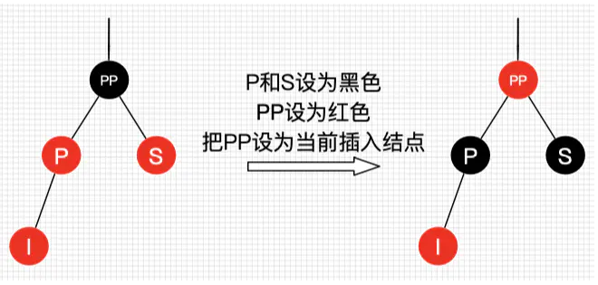
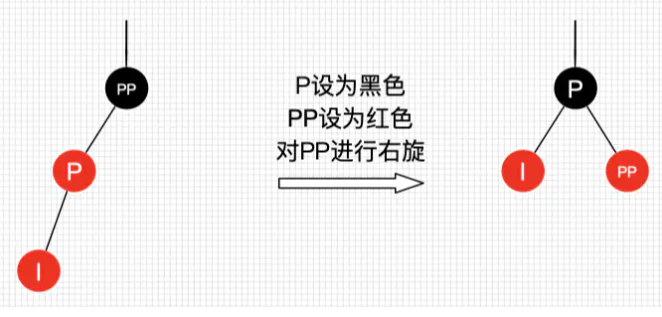
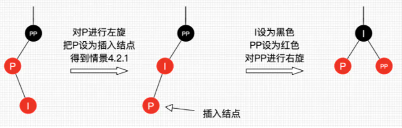
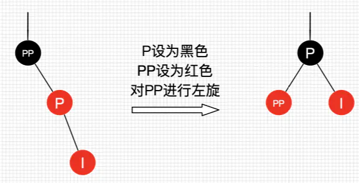
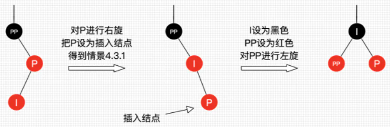

> 红黑树也许是应用最广泛的树结构, STL主要应用于map, set

### map自定义类型key

map是STL里的一个模板类，用来存放`<key, value>`键值对的数据结构，它的定义如下。

```cpp
  template <typename _Key, typename _Tp, typename _Compare = std::less<_Key>,
            typename _Alloc = std::allocator<std::pair<const _Key, _Tp> > >
    class map
    {
    public:
      typedef _Key                                          key_type;
      typedef _Tp                                           mapped_type;
      typedef std::pair<const _Key, _Tp>                    value_type;
      typedef _Compare                                      key_compare;
      typedef _Alloc                                        allocator_type;
```

插入`<key, value>`时，map会先通过比较函数地函数对象来比对key的大小，然后根据比对结果进行有序存储。

自定义key对象时, 需要传入typename _Key, typename _Tp(value类型), typename _Compare, 即重载`operator<`操作符

<!-- more -->

```cpp
#include <iostream>
#include <map>
#include <string>
using namespace std;

class Person{
public:
    string name;
    int age;

    Person(string n, int a){
        name = n;
        age = a;
    }

    bool operator<(const Person &p) const //注意这里的两个const
    {
        return (age < p.age) || (age == p.age && name.length() < p.name.length()) ;
    }
};

int main(int argc, char* argv[]){
    map<Person, int> group;
    group[Person("Mark", 17)] = 40561;
    group[Person("Andrew",18)] = 40562;
    for (auto ii = group.begin() ; ii != group.end() ; ii++)
        cout << ii->first.name 
        << " " << ii->first.age
        << " : " << ii->second
        << endl;
    return 0;
}
```

另外, 由于map的key默认使用`less<Key>()`作为比较函数, 因此可以定制自定义类型的`less`函数, 也就是模板的特化, STL的`#include <set>`也同理之。

```cpp
template <> //function-template-specialization
    struct less<Person>{
    public :
        bool operator()(const Person &p1, const Person &p2) const {
            return (p1.age < p2.age) || (p1.age == p2.age && p1.name.length() < p2.name.length());
        }
};
```


#### less和greater

less 是一个模板类, 它也可以认为是一种binary_function, 只需要实例化一个参数模板

less<int> -> binary_function<int, int, bool>

```cpp
// 传入三个模板参数
  template<typename _Arg1, typename _Arg2, typename _Result>
    struct binary_function
    {
      /// @c first_argument_type is the type of the first argument
      typedef _Arg1 	first_argument_type; 

      /// @c second_argument_type is the type of the second argument
      typedef _Arg2 	second_argument_type;

      /// @c result_type is the return type
      typedef _Result 	result_type;
    };

  template<typename _Tp>
    struct less : public binary_function<_Tp, _Tp, bool>
    {
      _GLIBCXX14_CONSTEXPR
      bool
      operator()(const _Tp& __x, const _Tp& __y) const
      { return __x < __y; }
    };


  template<typename _Tp>
    struct greater : public binary_function<_Tp, _Tp, bool>
    {
      _GLIBCXX14_CONSTEXPR
      bool
      operator()(const _Tp& __x, const _Tp& __y) const
      { return __x > __y; }
    };
```

实际上sort是根据less或者greater判断模板大小的仿函数判断大小排序的, class内部定义的operator< 最终转换为等价的less<>便于排序的根据


### C++中的map自定义对象

> 做题时, 因为自定义了个类想用`map`维护, 结果心态搞崩了, 赶紧总结下

* 注意加入map中的key要用对象，不要用指针。
#### map

`map`来自`stl_map`文件, 输入模板参数如下, 在gcc4.8版本(可以支持c++11)中

```cpp
template <typename _Key, typename _Tp, typename _Compare = std::less<_Key>,
            typename _Alloc = std::allocator<std::pair<const _Key, _Tp> > >
    class map
    {
    public:
      typedef _Key                                          key_type;
      typedef _Tp                                           mapped_type;
      typedef std::pair<const _Key, _Tp>                    value_type;
      typedef _Compare                                      key_compare;
      typedef _Alloc                                        allocator_type;
```

第1个参数，存储key值。

第2个参数，存储value。

第三个参数, 表示比较规则, 默认是`td::less<_Key>`。 自定义对象需要重载`operator<()`操作符, `map`中key的排列规则也是基于`operator<`从小到大的


```cpp
#include <iostream>
#include <map>
#include <string>
using namespace std;

class Person{
public:
    string name;
    int age;

    Person(string n, int a){
        name = n;
        age = a;
    }
    bool operator<(const Person &p) const //注意这里的两个const, 重载的是operator<
    {
        return (age < p.age) || (age == p.age && name.length() < p.name.length()) ;
    }
};

int main(int argc, char* argv[]){
    map<Person, int> group;
    group[Person("Mark", 17)] = 40561;
    group[Person("Andrew",18)] = 40562;
    for (auto ii = group.begin() ; ii != group.end() ; ii++)
        cout << ii->first.name 
        << " " << ii->first.age
        << " : " << ii->second
        << endl;
    return 0;
}
```

#### unordered_map 和unordered_set
unorder_map输入的参数如下所示, 在gcc4.8版本(可以支持c++11)中

```cpp
  template<class _Key, class _Tp,
	   class _Hash = hash<_Key>,
	   class _Pred = std::equal_to<_Key>,
	   class _Alloc = std::allocator<std::pair<const _Key, _Tp> > >
    class unordered_map : __check_copy_constructible<_Alloc>
    {
      typedef __umap_hashtable<_Key, _Tp, _Hash, _Pred, _Alloc>  _Hashtable;
      _Hashtable _M_h;

    public:
      // typedefs:
      //@{
      /// Public typedefs.
      typedef typename _Hashtable::key_type	key_type;
      typedef typename _Hashtable::value_type	value_type;
      typedef typename _Hashtable::mapped_type	mapped_type;
      typedef typename _Hashtable::hasher	hasher;
      typedef typename _Hashtable::key_equal	key_equal;
      typedef typename _Hashtable::allocator_type allocator_type;

第1个参数，存储key值。

第2个参数，存储value。

第3个参数，为哈希函数的函数对象。它将key作为参数，并利用函数对象中的哈希函数返回类型为size_t的唯一哈希值。默认值为`std::hash<key>`。

第4个参数，为等比函数的函数对象。它内部通过等比操作符`==`来判断两个key是否相等，返回值为bool类型。默认值是`std::equal_to<key>`。在unordered_map中，任意两个元素之间始终返回false。
```

当自定义类型时, 需要提供必须的`std::hash<key>`哈希函数和`std::equal_to<key>`等比函数, 一般的, 后者需要重载`operator==`, 前者需要提供一个`hash`函数对象(重载`operator()`可供调用)

`unordered_set`和`unordered_map`类似

```cpp
template<class _Value,
	   class _Hash = hash<_Value>,
	   class _Pred = std::equal_to<_Value>,
	   class _Alloc = std::allocator<_Value> >
    class unordered_set : __check_copy_constructible<_Alloc>
    {
      typedef __uset_hashtable<_Value, _Hash, _Pred, _Alloc>  _Hashtable;
      _Hashtable _M_h;

    public:
      // typedefs:
      //@{
      /// Public typedefs.
      typedef typename _Hashtable::key_type	key_type;
      typedef typename _Hashtable::value_type	value_type;
      typedef typename _Hashtable::hasher	hasher;
      typedef typename _Hashtable::key_equal	key_equal;
      typedef typename _Hashtable::allocator_type allocator_type;
```

```cpp
#include <iostream>
#include <string>
#include <unordered_map>
#include <functional>
using namespace std;

class Person{
public:
    string name;
    int age;

    Person(string n, int a){
        name = n;
        age = a;
    }
	/// 中医重载operator==
	/// 传入const Person&
    bool operator==(const Person & p) const 
    {
        return name == p.name && age == p.age;
    }
};

/// 通过重载operator() 提供hash函数计算
// 提供一个hash函数的闭包
struct hash_name{
	/// 传入const Person &
	size_t operator()(const Person & p) const{
		/// hash自动实现了散列函数, 返回size_t类型作为散列值
		/// 使用异或, 是实现hash扩散最好的选择
		return hash<string>()(p.name) ^ hash<int>()(p.age);
	}
};

int main(int argc, char* argv[]){
	/// 传入一个hash_name class
	unordered_map<Person, int, hash_name> ids; //不需要把哈希函数传入构造器
	ids[Person("Mark", 17)] = 40561;
    ids[Person("Andrew",16)] = 40562;
    for (auto&& ii = ids.begin() ; ii != ids.end() ; ii++ )
        cout << ii->first.name 
        << " " << ii->first.age
        << " : " << ii->second
        << endl;
    return 0;
}

/// 返回类型是size_t, 对64位系统一般是8字节
cout << hash<int>()(11) <<endl;
cout << hash<string>() ("123")<<endl;
```

### 红黑树

#### 红黑树具有以下特征
* 性质1：每个节点要么是黑色，要么是红色。
* 性质2：根节点是黑色。
* 性质3：每个叶子节点（NIL）是黑色。
* 性质4：每个红色结点的两个子结点一定都是黑色。
* 性质5：任意一结点到每个叶子结点的路径都包含数量相同的黑结点。

性质5保证了, **任意一个结点到到每个叶子结点的路径都包含数量相同的黑结点**。红黑树这种平衡为黑色完美平衡。


#### 红黑树的平衡

相比于AVL树的左旋右旋, 红黑树平衡靠三种操作：左旋、右旋和变色。

#### 红黑树的查找

和二叉搜索树的查找相同, 即从根节点开始进行二分查找, 直到节点为null。

```cpp

    /// 查找
    template <class _Keyty>
    _Tree_find_result<_Nodeptr> _Find_lower_bound(const _Keyty& _Keyval) const {
        const auto _Scary = _Get_scary();
        _Tree_find_result<_Nodeptr> _Result{_Scary->_Myhead};
        _Nodeptr _Trynode = _Result._Location._Parent;
        while (!_Trynode->_Isnil) {
            _Result._Location._Parent = _Trynode;
            /// #define _DEBUG_LT_PRED(pred, x, y) static_cast<bool>(pred(x, y))
            /// 获取比较参数
            /// 由于先比较大的, 因此返回的是不小于keyval的第一个元素
            if (_DEBUG_LT_PRED(_Getcomp(), _Traits::_Kfn(_Trynode->_Myval), _Keyval)) {
                /// result是一个位置对象
                _Result._Location._Child = _Tree_child::_Right;
                _Trynode                 = _Trynode->_Right;
            } else {
                _Result._Location._Child = _Tree_child::_Left;
                _Result._Bound           = _Trynode;
                _Trynode                 = _Trynode->_Left;
            }
        }

        return _Result;
    }

    /// 不大于keyval的第一个元素
    template <class _Keyty>
    _Tree_find_result<_Nodeptr> _Find_upper_bound(const _Keyty& _Keyval) const {
        /// _Scary是一种迭代器
        const auto _Scary = _Get_scary();
        _Tree_find_result<_Nodeptr> _Result{
            _Scary->_Myhead};
        _Nodeptr _Trynode = _Result._Location._Parent;
        while (!_Trynode->_Isnil) {
            _Result._Location._Parent = _Trynode;
            /// 先比较左边
            if (_DEBUG_LT_PRED(_Getcomp(), _Keyval, _Traits::_Kfn(_Trynode->_Myval))) {
                _Result._Location._Child = _Tree_child::_Left;
                _Result._Bound           = _Trynode;
                _Trynode                 = _Trynode->_Left;
            } else {
                _Result._Location._Child = _Tree_child::_Right;
                _Trynode                 = _Trynode->_Right;
            }
        }

        return _Result;
    }

    template <class _Other>
    _NODISCARD _Nodeptr _Find(const _Other& _Keyval) const {
        /// 找到不大于keyval的第一个元素位置(大于等于)
        const _Tree_find_result<_Nodeptr> _Loc = _Find_lower_bound(_Keyval);
        /// 如果相等, 找到并返回
        if (_Lower_bound_duplicate(_Loc._Bound, _Keyval)) {
            return _Loc._Bound;
        }
        /// 返回_Myhead
        return _Get_scary()->_Myhead;
    }
```

#### 红黑树的插入

插入操作包括两部分工作：一查找插入的位置；二插入后自平衡。可以分析每个插入的场景

寻找插入的位置即按照查找的规则, 找到一个空位置(如果没有重复元素的话), 插入的节点设置为空节点

接下来是插入自平衡

* 红黑树为空树
最简单的一种情景，直接把插入结点作为根结点就行，但注意，根据红黑树性质2：根节点是黑色。还需要把插入结点设为黑色。

* 插入结点的父结点为黑结点
这时候插入的结点是红色的，并不会影响红黑树的平衡，直接插入即可，无需做自平衡。

* 插入结点的父结点为红结点
如果插入的父结点为红结点，那么该父结点不可能为根结点，所以插入结点总是存在祖父结点。

#### 插入节点的父节点为红节点的几种情况

1. 插入情景4.1：叔叔结点存在并且为红结点



处理方式, 

* 将P和S设置为黑色
* 将PP设置为红色
* 把PP设置为当前插入结点
* 不用左旋右旋

这时候从根结点到叶子结点的路径中，黑色结点增加了。这也是唯一一种会增加红黑树黑色结点层数的插入情景。

2. 插入情景4.2：叔叔结点不存在或为黑结点，并且插入结点的父亲结点是祖父结点的左子结点

这时候处理方式与AVL节点类似, 需要左旋右旋

* 插入结点是其父结点的左子结点, 将P设为黑色,将PP设为红色,对PP进行右旋



* 插入结点是其父结点的右子结点, 处理, 对P进行左旋, 把P设置为插入结点，得到插入节点是左子节点的情景,  进行上个情景的处理。



3. 插入情景4.3：叔叔结点不存在或为黑结点，并且插入结点的父亲结点是祖父结点的右子结点, 该情景对应情景4.2，只是方向反转

* 插入结点是其父结点的右子结点, 将P设为黑色,将PP设为红色,对PP进行左旋



* 插入结点是其父结点的左子结点, 处理, 对P进行右旋, 把P设置为插入结点，得到插入节点是左子节点的情景,  进行上个情景的处理。




* 综上, 先找到插入的位置, 之后**如果位置父节点为黑色, 直接插入**, 如果父节点为红色, 且叔叔节点也是红色, 直接改变颜色就行
* 如果父节点为红色, 叔叔节点为黑或不存在。判断位置父节点和祖父节点关系, 如果是左节点, 整体需要右旋, 反之左旋。旋转后设置新的父节点为黑色, 旧的为红色。

stl的插入操作
```cpp
    /// 右旋, 针对根节点
    /// 旋转后, 根节点(wherenode)的左子节点(pnode)到原根节点位置处
    /// 当根节点wherenode是其父节点的左节点时, 发生右旋
    void _Rrotate(_Nodeptr _Wherenode) noexcept { // promote left node to root of subtree
        _Nodeptr _Pnode   = _Wherenode->_Left;
        _Wherenode->_Left = _Pnode->_Right;

        if (!_Pnode->_Right->_Isnil) {
            _Pnode->_Right->_Parent = _Wherenode;
        }
        /// pnode代替wherenode位置
        _Pnode->_Parent = _Wherenode->_Parent;

        /// 如果是根节点, 根节点设置为pnode
        if (_Wherenode == _Myhead->_Parent) {
            _Myhead->_Parent = _Pnode;
        } else if (_Wherenode == _Wherenode->_Parent->_Right) {
            _Wherenode->_Parent->_Right = _Pnode;
        } else {
            /// 设置其父左子节点为pnode
            _Wherenode->_Parent->_Left = _Pnode;
        }
        /// 设置wherenode位置为_Pnode->_Right
        _Pnode->_Right      = _Wherenode;
        _Wherenode->_Parent = _Pnode;
    }

    /// 左旋
    void _Lrotate(_Nodeptr _Wherenode) noexcept { // promote right node to root of subtree
        _Nodeptr _Pnode    = _Wherenode->_Right;
        _Wherenode->_Right = _Pnode->_Left;

        if (!_Pnode->_Left->_Isnil) {
            _Pnode->_Left->_Parent = _Wherenode;
        }

        _Pnode->_Parent = _Wherenode->_Parent;

        if (_Wherenode == _Myhead->_Parent) {
            _Myhead->_Parent = _Pnode;
        } else if (_Wherenode == _Wherenode->_Parent->_Left) {
            _Wherenode->_Parent->_Left = _Pnode;
        } else {
            _Wherenode->_Parent->_Right = _Pnode;
        }

        _Pnode->_Left       = _Wherenode;
        _Wherenode->_Parent = _Pnode;
    }


        /// 插入节点
    _Nodeptr _Insert_node(const _Tree_id<_Nodeptr> _Loc, const _Nodeptr _Newnode) noexcept {
        ++_Mysize;
        const auto _Head  = _Myhead;
        _Newnode->_Parent = _Loc._Parent;


        /// 在head处插入节点
        if (_Loc._Parent == _Head) { // first node in tree, just set head values
            _Head->_Left     = _Newnode;
            _Head->_Parent   = _Newnode;
            _Head->_Right    = _Newnode;
            _Newnode->_Color = _Black; // the root is black
            return _Newnode;
        }


        _STL_INTERNAL_CHECK(_Loc._Child != _Tree_child::_Unused);
        if (_Loc._Child == _Tree_child::_Right) { // add to right of _Loc._Parent
            _STL_INTERNAL_CHECK(_Loc._Parent->_Right->_Isnil);
            _Loc._Parent->_Right = _Newnode;
            if (_Loc._Parent == _Head->_Right) { // remember rightmost node
                _Head->_Right = _Newnode;
            }
        } else { // add to left of _Loc._Parent
            _STL_INTERNAL_CHECK(_Loc._Parent->_Left->_Isnil);
            _Loc._Parent->_Left = _Newnode;
            if (_Loc._Parent == _Head->_Left) { // remember leftmost node
                _Head->_Left = _Newnode;
            }
        }

        /// _Pnode = _Newnode, 即插入pnode, 且其父为红色
        for (_Nodeptr _Pnode = _Newnode; _Pnode->_Parent->_Color == _Red;) {
            /// 插入位置父节点是爷爷的左边
            if (_Pnode->_Parent == _Pnode->_Parent->_Parent->_Left) { // fixup red-red in left subtree
                /// 叔叔节点
                const auto _Parent_sibling = _Pnode->_Parent->_Parent->_Right;
                /// 叔叔节点是红色, 只要改变颜色, 不用旋转
                if (_Parent_sibling->_Color == _Red) { // parent's sibling has two red children, blacken both
                    _Pnode->_Parent->_Color          = _Black;
                    _Parent_sibling->_Color          = _Black;
                    _Pnode->_Parent->_Parent->_Color = _Red;
                    _Pnode                           = _Pnode->_Parent->_Parent;
                } else { // parent's sibling has red and black children
                    /// 叔叔节点是黑或者不存在, 需要右旋
                    /// pnode是其父的右节点, 先以其父为中心左旋
                    if (_Pnode == _Pnode->_Parent->_Right) { // rotate right child to left
                        _Pnode = _Pnode->_Parent;
                        /// 注意Lrotate输入的是子树根节点, 返回的已经变成左节点了(根旋转到了左边)
                        _Lrotate(_Pnode);
                    }
                    /// 以pnode的爷爷为中心右旋
                    _Pnode->_Parent->_Color          = _Black; // propagate red up
                    _Pnode->_Parent->_Parent->_Color = _Red;
                    _Rrotate(_Pnode->_Parent->_Parent);
                }
            } else { // fixup red-red in right subtree
                const auto _Parent_sibling = _Pnode->_Parent->_Parent->_Left;
                if (_Parent_sibling->_Color == _Red) { // parent's sibling has two red children, blacken both
                    _Pnode->_Parent->_Color          = _Black;
                    _Parent_sibling->_Color          = _Black;
                    _Pnode->_Parent->_Parent->_Color = _Red;
                    _Pnode                           = _Pnode->_Parent->_Parent;
                } else { // parent's sibling has red and black children
                    if (_Pnode == _Pnode->_Parent->_Left) { // rotate left child to right
                        _Pnode = _Pnode->_Parent;
                        _Rrotate(_Pnode);
                    }

                    _Pnode->_Parent->_Color          = _Black; // propagate red up
                    _Pnode->_Parent->_Parent->_Color = _Red;
                    _Lrotate(_Pnode->_Parent->_Parent);
                }
            }
        }
        /// 设置颜色(如果其父节点是黑色)
        _Head->_Parent->_Color = _Black; // root is always black
        return _Newnode;
    }
```

#### 红黑树的迭代器

* 红黑树迭代器的`++`, 基于红黑树对象的`operator++()`实现
```cpp
    /// 迭代器递增
    _Tree_unchecked_const_iterator& operator++() noexcept {
        /// 没有右子树
        if (_Ptr->_Right->_Isnil) { // climb looking for right subtree
            _Nodeptr _Pnode;
            /// 这段代码表示, 如果Ptr是父亲的右节点, 要一直提升, 直到Ptr是父亲的左节点(这时候父节点就是下一个节点)
            while (!(_Pnode = _Ptr->_Parent)->_Isnil && _Ptr == _Pnode->_Right) {
                _Ptr = _Pnode; // ==> parent while right subtree
            }

            _Ptr = _Pnode; // ==> parent (head if end())
        } else {
            /// 如果有右子树, 返回右子树最小值(即一直左遍历)
            _Ptr = _Mytree::_Min(_Ptr->_Right); // ==> smallest of right subtree
        }

        return *this;
    }
/// 迭代器递减
 _Tree_unchecked_const_iterator& operator--() noexcept {
        if (_Ptr->_Isnil) { // 根节点 char _Isnil; // true only if head (also nil) node; TRANSITION, should be bool
            _Ptr = _Ptr->_Right; // end() ==> rightmost
        }
        /// 没有左子树的话
        else if (_Ptr->_Left->_Isnil) { // climb looking for left subtree
            _Nodeptr _Pnode;
            /// 一直提升, 直到Ptr是父亲的右子节点(不满足while循环跳出)
            while (!(_Pnode = _Ptr->_Parent)->_Isnil && _Ptr == _Pnode->_Left) {
                _Ptr = _Pnode; // ==> parent while left subtree
            }

            if (!_Ptr->_Isnil) { // decrement non-begin()
                _Ptr = _Pnode; // ==> parent if not head
            }
        } else {
            /// 左子树的最大值
            _Ptr = _Mytree::_Max(_Ptr->_Left); // ==> largest of left subtree
        }

        return *this;
    }
```