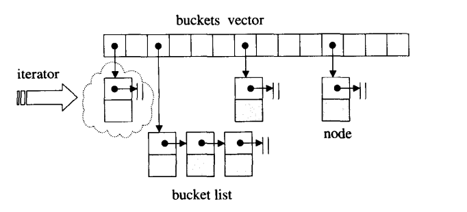

> hash是应用最广泛的数据结构之一结构, STL主要应用于`unordered_map`, `ordered_set`

### unordered_map自定义key

`unordered_map`的定义如下, 自定义对象作为key时, 需要对该对象重载哈希函数函数对象, 以及`operator==`操作符

```cpp
  template<class _Key, class _Tp,
	   class _Hash = hash<_Key>,
	   class _Pred = std::equal_to<_Key>,
	   class _Alloc = std::allocator<std::pair<const _Key, _Tp> > >
    class unordered_map : __check_copy_constructible<_Alloc>
    {
      typedef __umap_hashtable<_Key, _Tp, _Hash, _Pred, _Alloc>  _Hashtable;
      _Hashtable _M_h;

```

简单的, 重载==操作符`operator==`, 以及函数调用操作符`operator()`。用户需要输入三种模板类型实例化, 分别是class _Key, class _Tp, class _Hash。而class _Pred 只需要对class _Key 重载operator==。


```cpp
#include <iostream>
#include <string>
#include <unordered_map>
#include <functional>
using namespace std;

class Person{
public:
    string name;
    int age;

    Person(string n, int a){
        name = n;
        age = a;
    }
    /// 重载operator==

    bool operator==(const Person & p) const 
    {
        return name == p.name && age == p.age;
    }
};

/// 定义实现operator()的类
struct Hash{
	size_t operator()(const Person & p) const{
		return hash<string>()(p.name) ^ hash<int>()(p.age);
	}
};

int main(int argc, char* argv[]){
    /// 模板类型参数需要传入哈希函数
	unordered_map<Person, int, Hash> ids; //不需要把哈希函数传入构造器
	ids[Person("Mark", 17)] = 40561;
    ids[Person("Andrew",16)] = 40562;
    for ( auto ii = ids.begin() ; ii != ids.end() ; ii++ )
        cout << ii->first.name 
        << " " << ii->first.age
        << " : " << ii->second
        << endl;
    return 0;
}
```

<!-- more -->

STL的hash仿函数
```cpp
// hash_fun.h
  using std::size_t;

  template<class _Key>
    struct hash { };

  inline size_t
  __stl_hash_string(const char* __s)
  {
    unsigned long __h = 0;
    for ( ; *__s; ++__s)
      __h = 5 * __h + *__s;
    return size_t(__h);
  }

  template<>
    struct hash<char*>
    {
      size_t
      operator()(const char* __s) const
      { return __stl_hash_string(__s); }
    };

  template<>
    struct hash<const char*>
    {
      size_t
      operator()(const char* __s) const
      { return __stl_hash_string(__s); }
    };

  template<>
    struct hash<char>
    { 
      size_t
      operator()(char __x) const
      { return __x; }
    };

  template<>
    struct hash<unsigned char>
    { 
      size_t
      operator()(unsigned char __x) const
      { return __x; }
    };

  template<>
    struct hash<signed char>
    {
      size_t
      operator()(unsigned char __x) const
      { return __x; }
    };

  template<>
    struct hash<short>
    {
      size_t
      operator()(short __x) const
      { return __x; }
    };

  template<>
    struct hash<unsigned short>
    {
      size_t
      operator()(unsigned short __x) const
      { return __x; }
    };

  template<>
    struct hash<int>
    { 
      size_t 
      operator()(int __x) const 
      { return __x; }
    };

  template<>
    struct hash<unsigned int>
    { 
      size_t
      operator()(unsigned int __x) const
      { return __x; }
    };

  template<>
    struct hash<long>
    {
      size_t
      operator()(long __x) const
      { return __x; }
    };

  template<>
    struct hash<unsigned long>
    {
      size_t
      operator()(unsigned long __x) const
      { return __x; }
    };

```

同样可以使用模板特化来定制哈希函数的对象模板
```cpp
template <> //function-template-specialization
class hash<Person>{
public :
// 函数操作符重载
    size_t operator()(const Person &person ) const
    {
        return hash<string>()(person.first) ^ hash<string>()(person.second);
    }
};

这时候只需要传入
unordered_map<Person,int> ids;
```

#### 使用

unordered_map内部核心是hashtable, 也就是class _Hashtable, 其存在于hashtable.h
```cpp
      typedef typename _Hashtable::key_type	key_type;
      typedef typename _Hashtable::value_type	value_type;
      typedef typename _Hashtable::mapped_type	mapped_type;
      typedef typename _Hashtable::hasher	hasher;
      typedef typename _Hashtable::key_equal	key_equal;
      typedef typename _Hashtable::allocator_type allocator_type;
      //@}

      //@{
      ///  Iterator-related typedefs.
      typedef typename allocator_type::pointer		pointer;
      typedef typename allocator_type::const_pointer	const_pointer;
      typedef typename allocator_type::reference	reference;
      typedef typename allocator_type::const_reference	const_reference;
      typedef typename _Hashtable::iterator		iterator;
      typedef typename _Hashtable::const_iterator	const_iterator;
      typedef typename _Hashtable::local_iterator	local_iterator;
      typedef typename _Hashtable::const_local_iterator	const_local_iterator;
      typedef typename _Hashtable::size_type		size_type;
      typedef typename _Hashtable::difference_type	difference_type

using __ummap_hashtable = _Hashtable<_Key, std::pair<const _Key, _Tp>,
                    _Alloc, __detail::_Select1st,
                    _Pred, _Hash,
                    __detail::_Mod_range_hashing,
                    __detail::_Default_ranged_hash,
                    __detail::_Prime_rehash_policy, _Tr>;
// 核心就是_M_h
typedef __umap_hashtable<_Key, _Tp, _Hash, _Pred, _Alloc>  _Hashtable;  // _Hashtable class是__umap_hashtable<_Key, _Tp, _Hash, _Prec, _Alloc> 
_Hashtable _M_h;
```

常用接口
```cpp
explicit
unordered_map(size_type __n = 10,
    const hasher& __hf = hasher(),
    const key_equal& __eql = key_equal(),
    const allocator_type& __a = allocator_type())
: _M_h(__n, __hf, __eql, __a)
{ }

/// Copy assignment operator.
unordered_map&
operator=(const unordered_map&) = default;

/// Move assignment operator.
unordered_map&
operator=(unordered_map&&) = default;

bool
empty() const noexcept
{ return _M_h.empty(); }

///  Returns the size of the %unordered_map.
size_type
size() const noexcept
{ return _M_h.size(); }

/**
*  Returns a read/write iterator that points to the first element in the
*  %unordered_map.
*/
iterator
begin() noexcept
{ return _M_h.begin(); }

std::pair<iterator, bool>
insert(const value_type& __x)
{ return _M_h.insert(__x); }

template<typename _Pair, typename = typename
    std::enable_if<std::is_constructible<value_type,
                    _Pair&&>::value>::type>
std::pair<iterator, bool>
insert(_Pair&& __x)
{ return _M_h.insert(std::move(__x)); }

mapped_type&
operator[](const key_type& __k)
{ return _M_h[__k]; }
```

### hashtable

hashtable 哈希表, 可以由一段数组和链表构成。对象基于定义的hash函数映射到该数组某个位置(映射范围不超过数组长度, 定长), 如果多个对象映射到同一个位置(hash碰撞), 则添加到链表中(开链法)。


数组中的元素成为buckets.

hashtable的定义在hashtable.h中
```cpp
template<typename _Key, typename _Value, typename _Allocator,
	   typename _ExtractKey, typename _Equal,
	   typename _H1, typename _H2, typename _Hash,
	   typename _RehashPolicy,
	   bool __cache_hash_code,
	   bool __constant_iterators,
	   bool __unique_keys>
    class _Hashtable
    : public __detail::_Rehash_base<_RehashPolicy,
				    _Hashtable<_Key, _Value, _Allocator,
					       _ExtractKey,
					       _Equal, _H1, _H2, _Hash,
					       _RehashPolicy,
					       __cache_hash_code,
					       __constant_iterators,
					       __unique_keys> >,
      public __detail::_Hash_code_base<_Key, _Value, _ExtractKey, _Equal,
				       _H1, _H2, _Hash, __cache_hash_code>,
      public __detail::_Map_base<_Key, _Value, _ExtractKey, __unique_keys,
				 _Hashtable<_Key, _Value, _Allocator,
					    _ExtractKey,
					    _Equal, _H1, _H2, _Hash,
					    _RehashPolicy,
					    __cache_hash_code,
					    __constant_iterators,
					    __unique_keys> >
    {
    public:
      typedef _Allocator                                  allocator_type;
      typedef _Value                                      value_type;
      typedef _Key                                        key_type;
      typedef _Equal                                      key_equal;
      // mapped_type, if present, comes from _Map_base.
      // hasher, if present, comes from _Hash_code_base.
      typedef typename _Allocator::difference_type        difference_type;
      typedef typename _Allocator::size_type              size_type;
      typedef typename _Allocator::pointer                pointer;
      typedef typename _Allocator::const_pointer          const_pointer;
      typedef typename _Allocator::reference              reference;
      typedef typename _Allocator::const_reference        const_reference;

      template<typename _Key2, typename _Value2, typename _Ex2, bool __unique2,
	       typename _Hashtable2>
	friend struct __detail::_Map_base;

    private:
      typedef __detail::_Hash_node<_Value, __cache_hash_code> _Node;
      typedef typename _Allocator::template rebind<_Node>::other
							_Node_allocator_type;
      typedef typename _Allocator::template rebind<_Node*>::other
							_Bucket_allocator_type;

      typedef typename _Allocator::template rebind<_Value>::other
							_Value_allocator_type;

      _Node_allocator_type   _M_node_allocator;
      _Node**                _M_buckets;
      size_type              _M_bucket_count;
      size_type              _M_element_count;
      _RehashPolicy          _M_rehash_policy;
```

hash buckets直接用双重指针表示, 即 _Node**   _M_buckets;

一些可用方法
```cpp
      const_iterator
      end() const
      { return const_iterator(_M_buckets + _M_bucket_count); }

      size_type
      size() const
      { return _M_element_count; }

      bool
      empty() const
      { return size() == 0; }

      size_type
      bucket_count() const
      { return _M_bucket_count; }

```cpp
//// 定义hashtable, 也就是vector
template <class _Aliter>
struct _Hash_vec {
    // TRANSITION, ABI: "vector" for ABI compatibility that doesn't call allocator::construct
    using _Aliter_traits    = allocator_traits<_Aliter>;
    using value_type        = typename _Aliter::value_type;
    using size_type         = typename _Aliter_traits::size_type;
    using difference_type   = typename _Aliter_traits::difference_type;
    using pointer           = typename _Aliter_traits::pointer;
```

#### hashtable

注意C++ hashtable的哈希函数是作为类型参数传入(类型参数传模板, 对象参数传形参), 

hash类维护的是双向链表_List和哈希桶_Vec的集合
```cpp
/// 定义hash函数, 传入_Traits class
/// _Traits class就是自定义的hash函数
template <class _Traits>
class _Hash { // hash table -- list with vector of iterators for quick access
protected:
    /// list是双向链表
    using _Mylist             = list<typename _Traits::value_type, typename _Traits::allocator_type>;
    using _Alnode             = typename _Mylist::_Alnode;
    using _Alnode_traits      = typename _Mylist::_Alnode_traits;
    using _Node               = typename _Mylist::_Node;
    /// 指向链表的节点
    using _Nodeptr            = typename _Mylist::_Nodeptr;
    using _Mutable_value_type = typename _Traits::_Mutable_value_type;
    /// 求hash函数值
    using _Key_compare   = typename _Traits::key_compare;
    using _Value_compare = typename _Traits::value_compare;

/// 成员变量
    /// 传入Traits用来计算hash值
    _Traits _Traitsobj; // traits to customize behavior
    /// 开链法的双向链表
    _Mylist _List; // list of elements, must initialize before _Vec
    /// buckets是一个vector
    _Hash_vec<_Aliter> _Vec; // "vector" of list iterators for buckets:
                             // each bucket is 2 iterators denoting the closed range of elements in the bucket,
                             // or both iterators set to _Unchecked_end() if the bucket is empty.
    size_type _Mask; // the key mask
    size_type _Maxidx; // current maximum key value, must be a power of 2
```

#### 插入元素

```cpp
    /// 插入节点
    ///
    _Nodeptr _Insert_new_node_before(
        const size_t _Hashval, const _Nodeptr _Insert_before, const _Nodeptr _Newnode) noexcept {
        /// _Insert_before位置上插入数据
        const _Nodeptr _Insert_after = _Insert_before->_Prev;
        ++_List._Mypair._Myval2._Mysize;
        /// 将_Newnode以链表形式插入到_Insert_before位置
        _Construct_in_place(_Newnode->_Next, _Insert_before);
        _Construct_in_place(_Newnode->_Prev, _Insert_after);
        _Insert_after->_Next  = _Newnode;
        _Insert_before->_Prev = _Newnode;

        const auto _Head         = _List._Mypair._Myval2._Myhead;
        const auto _Bucket_array = _Vec._Mypair._Myval2._Myfirst;
        /// _Bucket
        const size_type _Bucket = _Hashval & _Mask;
        /// _Bucket_array的位置, 找到_Bucket_lo, _Bucket_hi
        _Unchecked_iterator& _Bucket_lo = _Bucket_array[_Bucket << 1];
        _Unchecked_iterator& _Bucket_hi = _Bucket_array[(_Bucket << 1) + 1];

        /// 找到了Bucket_array位置, 接下来插入链表中放入到_Bucket_hi中
        if (_Bucket_lo._Ptr == _Head) {
            // bucket is empty, set both
            _Bucket_lo._Ptr = _Newnode;
            _Bucket_hi._Ptr = _Newnode;
            /// 前插
        } else if (_Bucket_lo._Ptr == _Insert_before) {
            // new node is the lowest element in the bucket
            _Bucket_lo._Ptr = _Newnode;
        } else if (_Bucket_hi._Ptr == _Insert_after) {
            // new node is the highest element in the bucket
            _Bucket_hi._Ptr = _Newnode;
        }
        return _Newnode;
    }

/// 插入元素
    template <class... _Valtys>
    conditional_t<_Multi, iterator, pair<iterator, bool>> emplace(_Valtys&&... _Vals) {
        // try to insert value_type(_Vals...)
        using _In_place_key_extractor = typename _Traits::template _In_place_key_extractor<_Remove_cvref_t<_Valtys>...>;
        if constexpr (_Multi) {
            _Check_max_size();
            /// 创建newnode
            _List_node_emplace_op2<_Alnode> _Newnode(_List._Getal(), _STD forward<_Valtys>(_Vals)...);
            /// keyval和hashval
            /// 得到_Keyval
            const auto& _Keyval = _Traits::_Kfn(_Newnode._Ptr->_Myval);
            /// _Traitsobj set的特征，包括哈希计算，key_compare等等
            /// 用keyval对象生成trait hash对象
            const auto _Hashval = _Traitsobj(_Keyval);
            if (_Check_rehash_required_1()) {
                _Rehash_for_1();
            }

            /// 尝试找到目标
            const auto _Target = _Find_last(_Keyval, _Hashval);

            /// 链表的形式插入到blunk中
            return _List._Make_iter(_Insert_new_node_before(_Hashval, _Target._Insert_before, _Newnode._Release()));
```

#### rehash

当出现严重的hash冲突，会造成bucket[idx]指向的链表节点很长，此时搜索和删除一个节点的时间复杂度最坏却可能变成O(N), 这时候hash表也需要扩容。

为了解决hash退化，引入了两个概念：

负载因子（load_factor），是hashtable的元素个数与hashtable的桶数之间比值；
最大负载因子（max_load_factor），是负载因子的上限
```cpp
      float
      load_factor() const
      {
	return static_cast<float>(size()) / static_cast<float>(bucket_count());
      }
```

从insert函数看rehash, unorderd_map的insert实际上调用的hashtable的insert。我们可用看到`class _Hashtable`继承了`class __detail::_Rehash_base`, `__detail::_Hash_code_base`, `__detail::_Map_base`

```cpp
//unordered_map.h
      std::pair<iterator, bool>
      insert(const value_type& __x)
      { return _M_h.insert(__x); }
    
typedef __umap_hashtable<_Key, _Tp, _Hash, _Pred, _Alloc>  _Hashtable;
_Hashtable _M_h;

// hashtable.h
  template<typename _Key, typename _Value, typename _Allocator,
	   typename _ExtractKey, typename _Equal,
	   typename _H1, typename _H2, typename _Hash,
	   typename _RehashPolicy,
	   bool __cache_hash_code,
	   bool __constant_iterators,
	   bool __unique_keys>
    class _Hashtable
    : public __detail::_Rehash_base<_RehashPolicy,
				    _Hashtable<_Key, _Value, _Allocator,
					       _ExtractKey,
					       _Equal, _H1, _H2, _Hash,
					       _RehashPolicy,
					       __cache_hash_code,
					       __constant_iterators,
					       __unique_keys> >,
      public __detail::_Hash_code_base<_Key, _Value, _ExtractKey, _Equal,
				       _H1, _H2, _Hash, __cache_hash_code>,
      public __detail::_Map_base<_Key, _Value, _ExtractKey, __unique_keys,
				 _Hashtable<_Key, _Value, _Allocator,
					    _ExtractKey,
					    _Equal, _H1, _H2, _Hash,
					    _RehashPolicy,
					    __cache_hash_code,
					    __constant_iterators,
					    __unique_keys> >

      _Insert_Return_Type
      insert(const value_type& __v)
      { return _M_insert(__v, std::tr1::integral_constant<bool,
			 __unique_keys>()); }
```

insert的实现
```cpp
_Insert_Return_Type
insert(const value_type& __v)
{ return _M_insert(__v, std::tr1::integral_constant<bool,
        __unique_keys>()); }

  // Insert v unconditionally.
  template<typename _Key, typename _Value,
	   typename _Allocator, typename _ExtractKey, typename _Equal,
	   typename _H1, typename _H2, typename _Hash, typename _RehashPolicy,
	   bool __chc, bool __cit, bool __uk>
    typename _Hashtable<_Key, _Value, _Allocator, _ExtractKey, _Equal,
			_H1, _H2, _Hash, _RehashPolicy,
			__chc, __cit, __uk>::iterator
    _Hashtable<_Key, _Value, _Allocator, _ExtractKey, _Equal,
	       _H1, _H2, _Hash, _RehashPolicy, __chc, __cit, __uk>::
    _M_insert(const value_type& __v, std::tr1::false_type)
    {
      std::pair<bool, std::size_t> __do_rehash
	= _M_rehash_policy._M_need_rehash(_M_bucket_count,
					  _M_element_count, 1); // 判断是否需要rehash
      if (__do_rehash.first)
	_M_rehash(__do_rehash.second);

      const key_type& __k = this->_M_extract(__v);
      typename _Hashtable::_Hash_code_type __code = this->_M_hash_code(__k);    // 将key求出hashcode
      size_type __n = this->_M_bucket_index(__k, __code, _M_bucket_count);  // get hashtable index

      // First find the node, avoid leaking new_node if compare throws.
      _Node* __prev = _M_find_node(_M_buckets[__n], __k, __code);
      _Node* __new_node = _M_allocate_node(__v);

      if (__prev)   // insert node
	{
	  __new_node->_M_next = __prev->_M_next;
	  __prev->_M_next = __new_node;
	}
      else
	{
	  __new_node->_M_next = _M_buckets[__n];
	  _M_buckets[__n] = __new_node;
	}
      this->_M_store_code(__new_node, __code);

      ++_M_element_count;
      return iterator(__new_node, _M_buckets + __n);
    }

_M_find_node(_Node* __p, const key_type& __k,
    typename _Hashtable::_Hash_code_type __code) const
{
    for (; __p; __p = __p->_M_next)
if (this->_M_compare(__k, __code, __p))
    return __p;
    return 0;
}
```

_Hashtable继承_Rehash_base作用是rehash, 下面是rehash的条件, 一般就是当bucket size < element count, 将rehash.

_Mneed_rehash函数返回一个pair, pair.first表示是否应该rehash, pair.second表示rehash后的bucket大小。扩容规则为找大于__min_bkts(即_M_element_count+1)的下一个素数。注意素数列表是{
2ul, 3ul, 5ul, 7ul, 11ul, 13ul, 17ul, 19ul, 23ul, 29ul, 31ul,
37ul, 41ul, 43ul, 47ul, 53ul, 59ul, 61ul, 67ul, 71ul, 73ul, 79ul,
...}, 并非下一个最小的素数。

```cpp
// hashtable_policy.h
  struct _Prime_rehash_policy
  {
    _Prime_rehash_policy(float __z = 1.0)
    : _M_max_load_factor(__z), _M_growth_factor(2.f), _M_next_resize(0) { }

    float
    max_load_factor() const
    { return _M_max_load_factor; } //  _M_max_load_factor默认是1    

    // Return a bucket size no smaller than n.
    std::size_t
    _M_next_bkt(std::size_t __n) const;
    
    // Return a bucket count appropriate for n elements
    std::size_t
    _M_bkt_for_elements(std::size_t __n) const;
    
    // __n_bkt is current bucket count, __n_elt is current element count,
    // and __n_ins is number of elements to be inserted.  Do we need to
    // increase bucket count?  If so, return make_pair(true, n), where n
    // is the new bucket count.  If not, return make_pair(false, 0).
    std::pair<bool, std::size_t>
    _M_need_rehash(std::size_t __n_bkt, std::size_t __n_elt,
		   std::size_t __n_ins) const;

    enum { _S_n_primes = sizeof(unsigned long) != 8 ? 256 : 256 + 48 };

    float                _M_max_load_factor;
    float                _M_growth_factor;
    mutable std::size_t  _M_next_resize;
  };

// 会调用 _M_rehash_policy._M_need_rehash(_M_bucket_count,_M_element_count, 1);
    inline std::pair<bool, std::size_t>
  _Prime_rehash_policy::
  _M_need_rehash(std::size_t __n_bkt, std::size_t __n_elt,
		 std::size_t __n_ins) const
  {
    if (__n_elt + __n_ins > _M_next_resize)
      {
	float __min_bkts = ((float(__n_ins) + float(__n_elt))
			    / _M_max_load_factor);
	if (__min_bkts > __n_bkt)       // _M_element_count+1 > _M_bucket_count, 应该rehash
	  {
	    __min_bkts = std::max(__min_bkts, _M_growth_factor * __n_bkt);
	    const unsigned long* __p =
	      std::lower_bound(__prime_list, __prime_list + _S_n_primes,
			       __min_bkts); // 找大于__min_bkts的下一个素数
	    _M_next_resize = static_cast<std::size_t>
	      (__builtin_ceil(*__p * _M_max_load_factor));
	    return std::make_pair(true, *__p);
	  }
	else 
	  {
	    _M_next_resize = static_cast<std::size_t>
	      (__builtin_ceil(__n_bkt * _M_max_load_factor));
	    return std::make_pair(false, 0);
	  }
      }
    else
      return std::make_pair(false, 0);
  }

extern const unsigned long __prime_list[] = // 256 + 1 or 256 + 48 + 1
  {
    2ul, 3ul, 5ul, 7ul, 11ul, 13ul, 17ul, 19ul, 23ul, 29ul, 31ul,
    37ul, 41ul, 43ul, 47ul, 53ul, 59ul, 61ul, 67ul, 71ul, 73ul, 79ul,
    83ul, 89ul, 97ul, 103ul, 109ul, 113ul, 127ul, 137ul, 139ul, 149ul,
    157ul, 167ul, 179ul, 193ul, 199ul, 211ul, 227ul, 241ul, 257ul,
    277ul, 293ul, 313ul, 337ul, 359ul, 383ul, 409ul, 439ul, 467ul,
    503ul, 541ul, 577ul, 619ul, 661ul, 709ul, 761ul, 823ul, 887ul,
...
```

rehash过程比较笨, 新开辟数组, 将旧的数据挪到新的bucket, 最后删除旧的
```cpp
  template<typename _Key, typename _Value,
	   typename _Allocator, typename _ExtractKey, typename _Equal,
	   typename _H1, typename _H2, typename _Hash, typename _RehashPolicy,
	   bool __chc, bool __cit, bool __uk>
    void
    _Hashtable<_Key, _Value, _Allocator, _ExtractKey, _Equal,
	       _H1, _H2, _Hash, _RehashPolicy, __chc, __cit, __uk>::
    _M_rehash(size_type __n)
    {
      _Node** __new_array = _M_allocate_buckets(__n);   // 申请空间
      __try
	{
        // _M_buckets[__i]是遍历bucket数组
	  for (size_type __i = 0; __i < _M_bucket_count; ++__i)
	    while (_Node* __p = _M_buckets[__i])
	      {
		std::size_t __new_index = this->_M_bucket_index(__p, __n);  
		_M_buckets[__i] = __p->_M_next;
		__p->_M_next = __new_array[__new_index];
		__new_array[__new_index] = __p; // 重新再插入到新的buckets
	      }
	  _M_deallocate_buckets(_M_buckets, _M_bucket_count);   // 删除旧的bucket
	  _M_bucket_count = __n;
	  _M_buckets = __new_array;
	}
      __catch(...)
	{
	  // A failure here means that a hash function threw an exception.
	  // We can't restore the previous state without calling the hash
	  // function again, so the only sensible recovery is to delete
	  // everything.
	  _M_deallocate_nodes(__new_array, __n);
	  _M_deallocate_buckets(__new_array, __n);
	  _M_deallocate_nodes(_M_buckets, _M_bucket_count);
	  _M_element_count = 0;
	  __throw_exception_again;
	}
    }
```

#### operator[]

unordered_map和unordered_set的operator[]比较强大, 即使不存在该索引, operator[]自动值为0. 内部调用的hashtable的opeartor[]

```cpp
      mapped_type&
      operator[](const key_type& __k)
      { return _M_h[__k]; }


        template<typename _Key, typename _Pair, typename _Alloc, typename _Equal,
	   typename _H1, typename _H2, typename _Hash,
	   typename _RehashPolicy, typename _Traits>
    typename _Map_base<_Key, _Pair, _Alloc, _Select1st, _Equal,
		       _H1, _H2, _Hash, _RehashPolicy, _Traits, true>
		       ::mapped_type&
    _Map_base<_Key, _Pair, _Alloc, _Select1st, _Equal,
	      _H1, _H2, _Hash, _RehashPolicy, _Traits, true>::
    operator[](const key_type& __k)
    {
      __hashtable* __h = static_cast<__hashtable*>(this);
      __hash_code __code = __h->_M_hash_code(__k);
      std::size_t __n = __h->_M_bucket_index(__k, __code);
      __node_type* __p = __h->_M_find_node(__n, __k, __code);

      if (!__p)
	{
	  __p = __h->_M_allocate_node(std::piecewise_construct,
				      std::tuple<const key_type&>(__k),
				      std::tuple<>());
	  return __h->_M_insert_unique_node(__n, __code, __p)->second;
	}

      return (__p->_M_v).second;
    }
```


### 迭代器萃取

使用: 如果输入的对象是迭代器, 就要求能够从输入对象`_Ptr`中借助`iterator_traits<_Ptr>`得到迭代器所属对象的信息(这里的迭代器也可以是原始指针)。

萃取针对的是迭代器, 容器里是指针还是存指针, 而容器中一般直接存对象本身。

```cpp
template <class _Ptr>
class checked_array_iterator { // wrap a pointer with checking
    static_assert(_STD is_pointer_v<_Ptr>, "checked_array_iterator requires pointers");

public:
    /// 输入迭代器类型_Ptr, 萃取处迭代器指向的具体类型
    using iterator_category = typename iterator_traits<_Ptr>::iterator_category;
    using value_type        = typename iterator_traits<_Ptr>::value_type;
    using difference_type   = typename iterator_traits<_Ptr>::difference_type;
    using pointer           = typename iterator_traits<_Ptr>::pointer;
    using reference         = typename iterator_traits<_Ptr>::reference;
```

萃取, `iterator_traits`, 注意迭代器可以是指针但不能是引用(虽然引用也可以被萃取)。基本思路, 模板传入迭代器类型(可以是原始指针), 获取迭代器所指的对象的信息, 例如value_type

```cpp
template <class _It>
    requires (!_Has_iter_types<_It> && _Cpp17_input_iterator<_It>)
struct _Iterator_traits_base<_It> {
    /// 使用using 代替typedef
    /// 传入迭代器It, 获得指向对象的信息value_type
    using iterator_category = typename _Iter_traits_category<_Has_member_iterator_category<_It>>::template _Apply<_It>;
    using value_type        = typename indirectly_readable_traits<_It>::value_type;
    using difference_type   = typename incrementable_traits<_It>::difference_type;
    using pointer           = typename _Iter_traits_pointer<(
        _Has_member_pointer<_It> ? _Itraits_pointer_strategy::_Use_member
                                 : _Has_member_arrow<_It&> ? _Itraits_pointer_strategy::_Use_decltype
                                                       : _Itraits_pointer_strategy::_Use_void)>::template _Apply<_It>;
    using reference         = typename _Iter_traits_reference<_Has_member_reference<_It>>::template _Apply<_It>;
};
// clang-format on

template <class _Ty>
struct iterator_traits : _Iterator_traits_base<_Ty> {
    using _From_primary = iterator_traits;
};

// 传入原始指针时的萃取
template <class _Ty>
    requires is_object_v<_Ty>
struct iterator_traits<_Ty*> {
    // clang-format on
    using iterator_concept  = contiguous_iterator_tag;
    using iterator_category = random_access_iterator_tag;
    using value_type        = remove_cv_t<_Ty>;
    using difference_type   = ptrdiff_t;
    using pointer           = _Ty*;
    using reference         = _Ty&;
};
```

### vector

* 迭代器类

```cpp
/// 迭代器类
/// 以class _Myvec 作为模板
template <class _Myvec>
class _Vector_const_iterator : public _Iterator_base {
public:
#ifdef __cpp_lib_concepts
    using iterator_concept = contiguous_iterator_tag;
#endif // __cpp_lib_concepts
    /// 得到迭代器指向对象(即class _Myvec)的信息 
    using iterator_category = random_access_iterator_tag;
    using value_type        = typename _Myvec::value_type;
    using difference_type   = typename _Myvec::difference_type;
    using pointer           = typename _Myvec::const_pointer;
    using reference         = const value_type&;

    using _Tptr = typename _Myvec::pointer;

    _CONSTEXPR20 _Vector_const_iterator operator++(int) noexcept {
        /// 返回++的临时对象
        _Vector_const_iterator _Tmp = *this;
        ++*this;
        return _Tmp;
    }

    _CONSTEXPR20 _Vector_const_iterator& operator--() noexcept {
        /// 内部指针的变化
        --_Ptr;
        return *this;
    }
    ...
    _Tptr _Ptr; // pointer to element in vector
};
```

vector类

迭代器begin, end()这些针对size, 不是capacity, 与之对应的是`resize`, `reserve`

```cpp
/// 
template <class _Alloc>
class _Vb_val : public _Container_base {
public:
    using _Alvbase         = _Rebind_alloc_t<_Alloc, _Vbase>;
    using _Alvbase_traits  = allocator_traits<_Alvbase>;
    using _Vectype         = vector<_Vbase, _Alvbase>;
    using _Alvbase_wrapped = _Wrap_alloc<_Alvbase>;
    using size_type        = typename _Alvbase_traits::size_type;

    _Vectype _Myvec; // base vector of words
    size_type _Mysize; // current length of sequence
};

/// 传入vector内部元素的类型_Ty
template <class _Ty, class _Alloc = allocator<_Ty>>
class vector { // varying size array of values
private:
    template <class>
    /// 元素类型相关
    friend class _Vb_val;
    friend _Tidy_guard<vector>;

public:

    /// 获得vector对象内部元素类型
    using value_type      = _Ty;
    using allocator_type  = _Alloc;
    using pointer         = typename _Alty_traits::pointer;
    using const_pointer   = typename _Alty_traits::const_pointer;
    using reference       = _Ty&;
    using const_reference = const _Ty&;
    using size_type       = typename _Alty_traits::size_type;
    using difference_type = typename _Alty_traits::difference_type;

private:
    /// _Scary_val本身是一种类型, 关于vector_val的
    using _Scary_val = _Vector_val<conditional_t<_Is_simple_alloc_v<_Alty>, _Simple_types<_Ty>,
        _Vec_iter_types<_Ty, size_type, difference_type, pointer, const_pointer, _Ty&, const _Ty&>>>;

public:
    using iterator               = _Vector_iterator<_Scary_val>;
    using const_iterator         = _Vector_const_iterator<_Scary_val>;
    using reverse_iterator       = _STD reverse_iterator<iterator>;
    using const_reverse_iterator = _STD reverse_iterator<const_iterator>;
    /// 构造对象
    _CONSTEXPR20 explicit vector(_CRT_GUARDOVERFLOW const size_type _Count, const _Alloc& _Al = _Alloc())
        : _Mypair(_One_then_variadic_args_t{}, _Al) {
        _Construct_n(_Count);
    }
    _CONSTEXPR20 vector(_CRT_GUARDOVERFLOW const size_type _Count, const _Ty& _Val, const _Alloc& _Al = _Alloc())
        : _Mypair(_One_then_variadic_args_t{}, _Al) {
        _Construct_n(_Count, _Val);
    }

    /// 迭代器
    _NODISCARD _CONSTEXPR20 iterator begin() noexcept {
        return iterator(this->_Myvec.data(), this);
    }
    _NODISCARD _CONSTEXPR20 reverse_iterator rbegin() noexcept {
        return reverse_iterator(end());
    }
    _NODISCARD _CONSTEXPR20 size_type size() const noexcept {
        return this->_Mysize;
    }
    _NODISCARD _CONSTEXPR20 bool empty() const noexcept {
        return this->_Mysize == 0;
    }

    /// 返回应用
    _NODISCARD _CONSTEXPR20 reference at(size_type _Off) {
        if (size() <= _Off) {
            _Xran();
        }

        return (*this)[_Off];
    }
    _NODISCARD _CONSTEXPR20 const_reference front() const noexcept /* strengthened */ {

        return *begin();
    }

    /// const修饰成员函数, 返回的是const_reference引用类型
    /// const& 返回类型只能用const&接受, 普通引用类型不能
    _NODISCARD _CONSTEXPR20 const_reference at(size_type _Off) const {
        if (size() <= _Off) {
            _Xran();
        }

        return (*this)[_Off];
    }
```

* 插入操作

`insert`函数核心是`_Insert_n`

`_Insert_n`容量不够将直接报错, 没有扩容那一步, 因此以上函数不会出现扩容。扩容只针对`push_back, emplace_back`这些

`resize`, `assign`会有`_Clear_and_reserve_geometric`, 也就是扩容操作

```cpp
/// 插入, 在where位置插入val, 可以在where位置插入_Count个连续_val
    _CONSTEXPR20 iterator _Insert_n(const_iterator _Where, size_type _Count, const bool& _Val) {
        //// off, where到begin的距离
        size_type _Off = _Insert_x(_Where, _Count);
        /// 返回元素的迭代器
        const auto _Result = begin() + static_cast<difference_type>(_Off);
        /// 在Result~count处进行赋值
        _STD fill(_Result, _Result + static_cast<difference_type>(_Count), _Val);
        return _Result;
    }

    _CONSTEXPR20 size_type _Insert_x(const_iterator _Where, size_type _Count) {
        difference_type _Off = _Where - begin();

#if _ITERATOR_DEBUG_LEVEL == 2
        _STL_VERIFY(end() >= _Where, "vector<bool> insert iterator outside range");
        bool _Realloc = capacity() - size() < _Count;
#endif // _ITERATOR_DEBUG_LEVEL == 2

        if (_Count != 0) {
            /// 超过最大size
            if (max_size() - size() < _Count) {
                _Xlen(); // result too long, 这里将直接报错, 不扩容
            }

            // worth doing
            /// resize大小
            this->_Myvec.resize(this->_Nw(size() + _Count), 0);
            /// 如果当前是空vector
            if (empty()) {
                this->_Mysize += _Count;
            } else { // make room and copy down suffix
                /// end迭代器
                iterator _Oldend = end();
                /// _Mysize增大
                this->_Mysize += _Count;
                /// 反向拷贝, 例如最后一个后移1, 接着倒数第二个后移1..
                /// 从最后一个开始是防止后面的被前面的覆盖(正向拷贝)
                _STD copy_backward(begin() + _Off, _Oldend, end());
            }

#if _ITERATOR_DEBUG_LEVEL == 2
            _Orphan_range(static_cast<size_type>(_Realloc ? 0 : _Off), this->_Mysize);
#endif // _ITERATOR_DEBUG_LEVEL == 2
        }

        return static_cast<size_type>(_Off);
    }

    /// resize, 这里的size是size, 不是capacity
    _CONSTEXPR20 void resize(_CRT_GUARDOVERFLOW size_type _Newsize, bool _Val = false) {
        if (size() < _Newsize) {
            /// 默认相当于在end()部位插入_Newsize - size()个0
            _Insert_n(end(), _Newsize - size(), _Val);
        } else if (_Newsize < size()) {
            erase(begin() + static_cast<difference_type>(_Newsize), end());
        }
    }

    _CONSTEXPR20 void assign(_CRT_GUARDOVERFLOW size_type _Count, const bool& _Val) {
        clear();
        _Insert_n(begin(), _Count, _Val);
    }
    _CONSTEXPR20 iterator insert(const_iterator _Where, const bool& _Val) {
        return _Insert_n(_Where, static_cast<size_type>(1), _Val);
    }

```

`push_back`和`emplace_back`, 一般的认为push_back() 向容器尾部添加元素时，首先会创建这个元素，然后再将这个元素拷贝或者移动到容器中(又创建一次), 最后析构这个元素；而 emplace_back() 在实现时，则是直接在容器尾部创建这个元素，省去了临时对象拷贝或移动元素的过程。

但实际上, `push_back`直接调用`emplace_back`, 两者效率基本一致(可能就多了call 函数的差别???)

```cpp
    /// push_back实际调用的emplace_back...
    _CONSTEXPR20 void push_back(const _Ty& _Val) { // insert element at end, provide strong guarantee
        emplace_back(_Val);
    }

    _CONSTEXPR20 void push_back(_Ty&& _Val) {
        // insert by moving into element at end, provide strong guarantee
        emplace_back(_STD move(_Val));
    }

    /// emplace_back
    template <class... _Valty>
    _CONSTEXPR20 decltype(auto) emplace_back(_Valty&&... _Val) {
        // insert by perfectly forwarding into element at end, provide strong guarantee
        auto& _My_data   = _Mypair._Myval2;
        pointer& _Mylast = _My_data._Mylast;
        /// 有空间
        if (_Mylast != _My_data._Myend) {
            /// 基于_STD forward
            return _Emplace_back_with_unused_capacity(_STD forward<_Valty>(_Val)...);
        }
        /// 空间不够, 分配空间
        _Ty& _Result = *_Emplace_reallocate(_Mylast, _STD forward<_Valty>(_Val)...);
#if _HAS_CXX17
        return _Result;
#else // ^^^ _HAS_CXX17 ^^^ // vvv !_HAS_CXX17 vvv
        (void) _Result;
#endif // _HAS_CXX17
    }

    /// 传入通用引用
    template <class... _Valty>
    _CONSTEXPR20 decltype(auto) _Emplace_back_with_unused_capacity(_Valty&&... _Val) {
        // insert by perfectly forwarding into element at end, provide strong guarantee
        auto& _My_data   = _Mypair._Myval2;
        pointer& _Mylast = _My_data._Mylast;
        /// 容量足够
        _STL_INTERNAL_CHECK(_Mylast != _My_data._Myend); // check that we have unused capacity
        _Alty_traits::construct(_Getal(), _Unfancy(_Mylast), _STD forward<_Valty>(_Val)...);
        _Orphan_range(_Mylast, _Mylast);
        /// 元素的引用
        _Ty& _Result = *_Mylast;
        ++_Mylast;

#if _HAS_CXX17
        return _Result;
#else // ^^^ _HAS_CXX17 ^^^ // vvv !_HAS_CXX17 vvv
        (void) _Result;
#endif // _HAS_CXX17
    }
```

* 扩容

ms的STL是1.5倍扩容, 而不是两倍

allocate分配空间, construct初始化空间, _Uninitialized_move移动, _Uninitialized_copy拷贝

```cpp
    _CONSTEXPR20 size_type _Calculate_growth(const size_type _Newsize) const {
        // given _Oldcapacity and _Newsize, calculate geometric growth
        const size_type _Oldcapacity = capacity();
        const auto _Max              = max_size();

        if (_Oldcapacity > _Max - _Oldcapacity / 2) {
            return _Max; // geometric growth would overflow
        }
        /// 1.5倍扩容
        const size_type _Geometric = _Oldcapacity + _Oldcapacity / 2;

        if (_Geometric < _Newsize) {
            return _Newsize; // geometric growth would be insufficient
        }

        return _Geometric; // geometric growth is sufficient
    }

    /// emplace_back可能发生扩容
    template <class... _Valty>
    _CONSTEXPR20 pointer _Emplace_reallocate(const pointer _Whereptr, _Valty&&... _Val) {
        // reallocate and insert by perfectly forwarding _Val at _Whereptr
        _Alty& _Al        = _Getal();
        auto& _My_data    = _Mypair._Myval2;
        pointer& _Myfirst = _My_data._Myfirst;
        pointer& _Mylast  = _My_data._Mylast;

        _STL_INTERNAL_CHECK(_Mylast == _My_data._Myend); // check that we have no unused capacity

        const auto _Whereoff = static_cast<size_type>(_Whereptr - _Myfirst);
        const auto _Oldsize  = static_cast<size_type>(_Mylast - _Myfirst);

        if (_Oldsize == max_size()) {
            _Xlength();
        }

        const size_type _Newsize     = _Oldsize + 1;
        /// 计算增长新容量1.5倍
        const size_type _Newcapacity = _Calculate_growth(_Newsize);
        /// 尝试分配new_vec空间
        const pointer _Newvec           = _Al.allocate(_Newcapacity);
        const pointer _Constructed_last = _Newvec + _Whereoff + 1;
        pointer _Constructed_first      = _Constructed_last;

        /// 开始尝试, _TRY_BEGIN是宏定义
        _TRY_BEGIN
        /// 尝试分配初值
        _Alty_traits::construct(_Al, _Unfancy(_Newvec + _Whereoff), _STD forward<_Valty>(_Val)...);
        _Constructed_first = _Newvec + _Whereoff;

        /// 很不幸, 要复制或者移动到新位置
        if (_Whereptr == _Mylast) { // at back, provide strong guarantee, 处理_Myfirst~ _Mylast
            if constexpr (is_nothrow_move_constructible_v<_Ty> || !is_copy_constructible_v<_Ty>) {
                _Uninitialized_move(_Myfirst, _Mylast, _Newvec, _Al);
            } else {
                _Uninitialized_copy(_Myfirst, _Mylast, _Newvec, _Al);
            }
        } else { // provide basic guarantee, 处理_Myfirst~ _Whereptr
            _Uninitialized_move(_Myfirst, _Whereptr, _Newvec, _Al);
            _Constructed_first = _Newvec;
            _Uninitialized_move(_Whereptr, _Mylast, _Newvec + _Whereoff + 1, _Al);
        }
        /// 如果失败, 释放空间
        _CATCH_ALL

        _Destroy_range(_Constructed_first, _Constructed_last, _Al);
        _Al.deallocate(_Newvec, _Newcapacity);
        _RERAISE;
        _CATCH_END

        _Change_array(_Newvec, _Newsize, _Newcapacity);
        return _Newvec + _Whereoff;
    }


     _CONSTEXPR20 void reserve(_CRT_GUARDOVERFLOW const size_type _Newcapacity) {
        // increase capacity to _Newcapacity (without geometric growth), provide strong guarantee
        if (_Newcapacity > capacity()) { // something to do (reserve() never shrinks)
            if (_Newcapacity > max_size()) {
                _Xlength();
            }

            _Reallocate_exactly(_Newcapacity);
        }
    }

    /// 赋值
    Type construct(A0 &a0)
    {
        return construct_<Type>()(a0);
    }
```