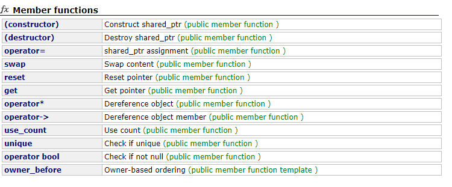
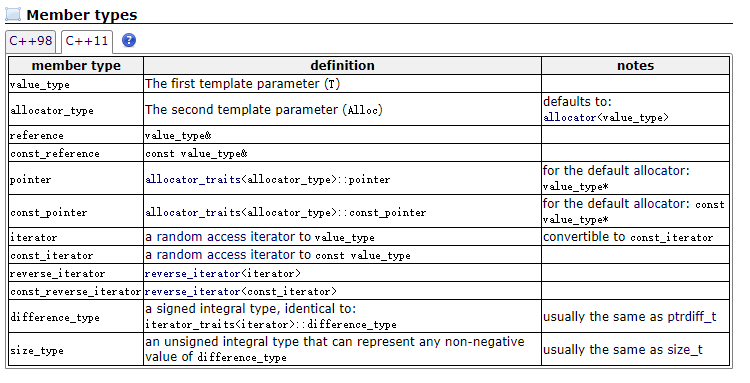
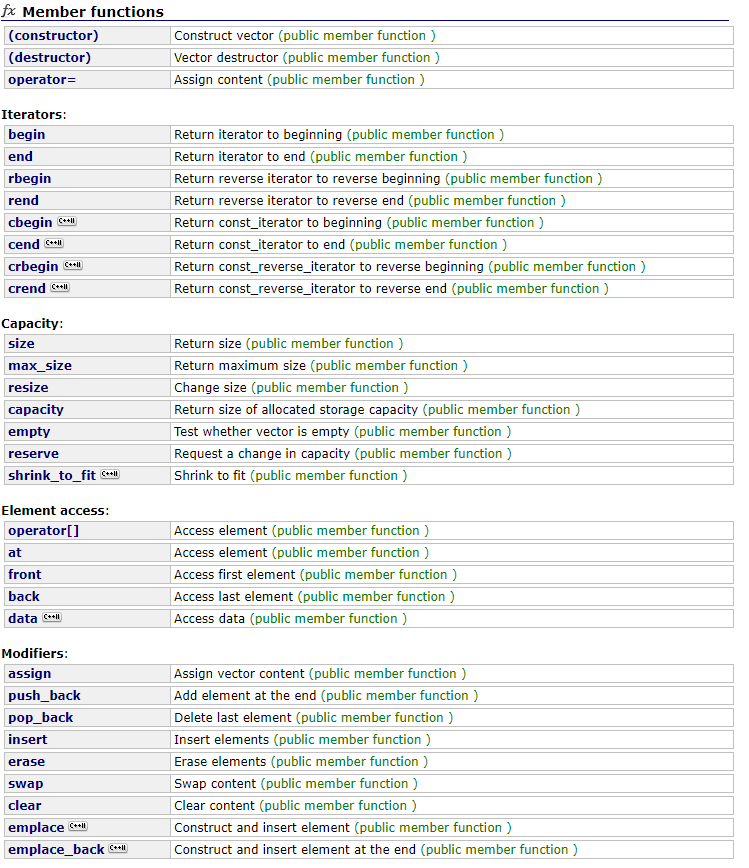

> 会用只是皮毛, 需要对常用类进行简单实现, 例如shared_ptr, mutex等

### shared_ptr



shared_ptr对每个维护的对象会设置一个共享变量, 记录维护对象的计数。对象每增加一个shared_ptr, 计数加1, 计数为0析构对象。同时析构全局变量(因为没什么用了)

通过重载`operator*`, `operator->`操作符, 实现对shared_ptr的*, ->等解指针操作。注意操作符有自己的匹配方式, 因此`operator*`匹配结果时`*p`而不是`p*`, `operator->`匹配`p->`而不是`->p`。

实现`reset()`, 单纯的`reset()`是引用计数减一, 同时判断如果引用计数为0析构对象, `reset(T*)`先执行`reset()`, 然后将shared_ptr维护一个新的对象。

引用计数不会为负数, 当维护的对象被销毁或者shared_ptr已经被释放, `use_count`返回0。

实现的my_sharedptr用了16个字节, 分别是4个指针。指向对象的指针`_ptr`, 指向计数器的指针`_refcount`, 指向互斥器(互斥器也是多线程共享的)的指针`mtx`, 判断是否存活的共享变量指针`isalive`(bool占有1byte内存)。 注意不是所有共享变量都会产生多线程冲突, 比如获取全局互斥器mutex， 因为在获取互斥锁的过程中，操作会在自旋锁的保护中进行。加锁的目的是防止如下情况, 线程一reset之后没来得及析构, 线程二执行了析构, 线程一再执行析构就会重复析构发生了错误。

使用指针操作共享变量确实方便, 这不存在java那种把数据从内存拷贝到线程私有内存中,可能失去对主存数据可见性的问题。因为这是通过指针(或者引用)操作的, 不论主存还是线程私有内存存储的只是指针而已, 真实的数据没有拷贝这些操作, 也就不存在可见性的问题。

```cpp
#include<iostream>
#include<mutex>
#include<thread>
using namespace std;

template<class T>
class SharedptrImpl{
public:
    /// 对同一个对象使用构造函数实例化一个my_sharedptr, 剩下的用拷贝构造或者赋值操作符来实现。保证引用计数合理
    SharedptrImpl(T* ptr) : ptr_(ptr), refcount_(new int(1)) 
    {}

    ~SharedptrImpl() {
        reset();
    }


    /// 用shared_ptr拷贝构造
    SharedptrImpl(const SharedptrImpl<T>& sp) 
    : ptr_(sp.ptr_), refcount_(sp.refcount_), mtx_(sp.mtx_)
    {
        add_ref_count();    // 增加引用计数
    }

    /// operator=() 赋值, 注意类型T一致
    SharedptrImpl<T>& operator=(const SharedptrImpl<T>& sp) {
        if (ptr_ != sp.ptr_) {  // 不是自我赋值
            /// 删除当前管理的资源
            reset();
            /// 赋新值
            ptr_ = sp.ptr_;
            refcount_ = sp.refcount_;
            mtx_ = sp.mtx_; /// 获取的只是一个指针
            /// 增加一个计数
            add_ref_count();
        }
        return *this;
    }


    // 对shared_ptr的*, ->操作转换为对内部指针的操作
    T& operator*() {
        return *ptr_;
    }
    T* operator->() {
        return ptr_;
    }
    /// use_count返回计数值
    int use_count() {
        if (!ptr_)    /// 对象已经死亡, 或者已经释放了对象
            return 0;
        return *refcount_;
    }

    // get()函数返回裸指针
	T* get() { 
        return ptr_; 
    }

    void add_ref_count() {
        std::lock_guard<std::mutex> locker(mtx_);
        ++(*refcount_);
    }

    //// reset(), 释放当前的shared_ptr, 同时检查释放后引用计数, 如果引用计数为0, 同时删除对象
    /// 注意shared_ptr存储到栈上, 因此不用手动删除shared_ptr
	void reset()
	{
            
        std::lock_guard<std::mutex> lck(mtx_);

        if (refcount_ > 0 && --(*refcount_) == 0) {   // delete对象和控制块
            delete refcount_;
            delete ptr_;
        }
        /// 重置数据
        ptr_ = nullptr;
	}

    void reset(T* ptr) {
        {
            std::lock_guard<std::mutex> lck(mtx_);
            
            if (refcount_ > 0 && --(*refcount_) == 0) {  /// 共享变量计数器减一
                delete refcount_;
                delete ptr_;
            }
        } 
        /// 维护新对象
        ptr_ = ptr;
        refcount_ =new int(1);
    }

private:
	int* refcount_; // refcount指向共享变量(控制块), 表示该对象的引用计数
	T* ptr_;    // 内部指针
	std::mutex mtx_;    /// 因为
};
```

<!-- more -->

测试程序

```cpp
class Person
{
public:
    Person(int v) {
        value = v;
        std::cout << "Cons" <<value<< std::endl;
    }
    ~Person() {
        std::cout << "Des" <<value<< std::endl;
    }

    int value;

};

int main()
{
    cout << "shared_ptr test: \n";
    shared_ptr<Person> p1(new Person(1));// Person(1)的引用计数为1

    //my_sharedptr<Person> p2 = std::make_shared<Person>(2);
    cout <<"p1 count: "<< p1.use_count() <<"\n";

    p1.reset(new Person(3));// 首先生成新对象，然后shared_ptr引用计数减1，引用计数为0，故析构Person(1)
                            // 最后将新对象的指针交给智能指针
    cout << "p1 count: "<<p1.use_count() <<"\n";
    shared_ptr<Person> p3 = p1;//现在p1和p3同时指向Person(3)，Person(3)的引用计数为2
    cout << "p1 count: "<<p1.use_count() <<"\n";
    cout << "p3 count: " <<p3.use_count() <<"\n";
    p1.reset();//Person(3)的引用计数为1
    cout << "p1 count: "<<p1.use_count() <<"\n";
    p3.reset();//Person(3)的引用计数为0，析构Person(3)
    cout << "p3 count: " <<p3.use_count() <<"\n";

    /// 
    cout << "p1 count: "<<p1.use_count() <<"\n";
    cout << "p3 count: " <<p3.use_count() <<endl;

    cout << "\nmy_shared_ptr test: \n";
    my_sharedptr<Person> p1_(new Person(1));// Person(1)的引用计数为1

    //my_sharedptr<Person> p2 = std::make_shared<Person>(2);
    cout <<"p1 count: "<< p1_.use_count() <<"\n";

    (*p1_).value = 100;
    cout << "p1 value: " << p1_->value<<"\n";
    p1_.reset(new Person(3));// 首先生成新对象，然后引用计数减1，引用计数为0，故析构Person(1)
                            // 最后将新对象的指针交给智能指针
    cout << "p1 count: "<<p1_.use_count() <<"\n";
    my_sharedptr<Person> p3_ = p1_;//现在p1和p3同时指向Person(3)，Person(3)的引用计数为2
    cout << "p1 count: "<<p1_.use_count() <<"\n";
    cout << "p3 count: " <<p3_.use_count() <<"\n";
    p1_.reset();//Person(3)的引用计数为1
    cout << "p1 count: "<<p1_.use_count() <<"\n";
    p3_.reset();//Person(3)的引用计数为0，析构Person(3)
    cout << "p3 count: " <<p3_.use_count() <<endl;

    /// 对象被析构同时refcount共享变量也被析构, 因此调用use_count时指向的共享变量已经不再存活
    /// 判断共享变量是否存活可以用weak_ptr维护共享变量, 每次访问之前调用lock()尝试提升为shared_ptr, 如果成功说明存活, 最后再reset(). weakptr要求共享变量用shared_ptr维护, 不然提升之后进行reset将析构共享变量
    /// 项目中执行使用weak_ptr的expired()检查use_count是否为0可以判断是否存活,这个必须结合shared_ptr使用
    /// 这里使用一个共享变量isalive判断对象是否存活
    cout << "p1 count: "<<p1_.use_count() <<endl;
    cout << "p3 count: " <<p3_.use_count() <<endl;

    return 0;
}

shared_ptr test: 
Cons1
p1 count: 1
Cons3
Des1
p1 count: 1
p1 count: 2
p3 count: 2
p1 count: 0
Des3
p3 count: 0
p1 count: 0
p3 count: 0

my_shared_ptr test: 
Cons1
p1 count: 1
p1 value: 100
Cons3
Des100
p1 count: 1
p1 count: 2
p3 count: 2
p1 count: 0
Des3
p3 count: 0
p1 count: 0
p3 count: 0
```

### 跳跃表

```cpp

/// ListNode
template<typename T>
struct SkipNode
{
	int key;
	T value;
	vector<SkipNode*> next;

	SkipNode(int k, T v, int level);
};

//构造函数，初始化
template<typename T> SkipNode<T>::SkipNode(int k, T v, int level) 
	: key(k), value(v)
{
	for (int i = 0; i < level; i++)
	{
		next.push_back(nullptr);
	}
}


/// skipList

template<class T>
class SkipList
{

public:
	//头结点
	SkipNode<T>* head;
	
	//列表最大层数
	int maxLevel;

	//整型的最小值和最大值
	const int minInt = numeric_limits<int>::min();
	const int maxInt = numeric_limits<int>::max();

public:
	//构造函数
	SkipList(int maxLevel, T iniValue);

	//析构函数
	~SkipList();

	//随机层数方法
	int randomLevel();

	//插入, 查找， 删除
	SkipNode<T>* insert(int k, T v);
	SkipNode<T>* find(int k);
	SkipNode<T>* deleteNode(int k);

	//打印
	void printNode();

private:

	//尾节点
	SkipNode<T>* tail;
	
	//找到当前列表或者node的最大层数
	int nodeLevel(vector<SkipNode<T>*> p);
};

//初始化
template<class T> SkipList<T>::SkipList(int maxLevel, T iniValue)
	: maxLevel(maxLevel)
{
	//初始化头结点和尾节点为整型最小值和最大值
	head = new SkipNode<T>(minInt, iniValue, maxLevel);
	tail = new SkipNode<T>(maxInt, iniValue, maxLevel);

	// 初始化所有层数上的头结点指向尾节点
	for (int i = 0; i < maxLevel; i++)
	{
		head->next[i] = tail;
	}
}

template<class T> SkipList<T>::~SkipList()
{
	delete head;
	delete tail;
}

/// 随机层
template<class T> int SkipList<T>::randomLevel()
{
	int random_level = 1;
	int seed = time(NULL);
	static default_random_engine e(seed);
	/// 0-1分布
	static uniform_int_distribution<int> u(0, 1);

	while (u(e) && random_level < maxLevel)
	{
		random_level++;
	}
	/// 如果u(e)一直不满足直到最大层数, 则选择最大层

	return random_level;
}

/// 返回最大层数
template<class T> int SkipList<T>::nodeLevel(vector<SkipNode<T>*> next)
{
	int node_level = 0;
	
	if (next[0]->key == maxInt)
	{
		return node_level;
	}

	for (int i = 0; i < next.size(); i++)
	{
		if (next[i] != nullptr && next[i]->key != maxInt)
		{
			node_level++;
		}
		else
		{
			break;
		}
	}
	return node_level;
}

/// 基本操作

/*插入：
1）首先用查找函数来判断该结点是否已经存在，如果存在，则更新该结点的值
2）获取新节点的随机层数
3）找到合适的插入位置
4）插入，并调整每层前后node的指针*/
template<class T> SkipNode<T>* SkipList<T>::insert(int k, T v)
{
	int x_level = randomLevel();    // 随机判断来自哪一层
	SkipNode<T>* new_node = nullptr;
	SkipNode<T>* tmp = head;

	new_node = find(k);

	if (new_node) {
		
		new_node->value = v;
		cout << "\nThis node " << k << " has already existed. And its value has been updated to " << v << endl;
		return head;
	}

	cout << "key: " << k << ", randomLevel: " << x_level << endl;

	new_node = new SkipNode<T>(k, v, x_level);

	for (int i = (x_level - 1); i > -1; i--)
	{
		while (tmp->next[i] != nullptr && tmp->next[i]->key < k)
		{
			tmp = tmp->next[i];
		}

		new_node->next[i] = tmp->next[i];
		tmp->next[i] = new_node;
	}

	return head;
}

/*查找：
由于列表有序，首先找到小于该结点的最近的结点，如果下一个结点等于目标结点，则返回该节点。
如果不是，则返回空*/
template<class T> SkipNode<T>* SkipList<T>::find(int x)
{
	SkipNode<T>* tmp = head;
	int current_level = nodeLevel(tmp->next);

	for (int i = (current_level - 1); i > -1; i--)
	{
		while (tmp->next[i] != nullptr && tmp->next[i]->key < x)
		{
			tmp = tmp->next[i];
		}
	}
	tmp = tmp->next[0];

	if (tmp->key == x)
	{
		cout << "\nThis key " << x << " has been found\n";
		return tmp;
	}
	else
	{
		//cout << " \nThis key " << x << " doesn't exit\n";
		return nullptr;
	}
}

/*删除：
1) 用 find(x) 方法判断该结点是否存在. 如果不存在，则返回当前list, 并告知该结点不存在。
2) 找到小于该结点的最近的结点。
3) 更改该节点每层的前面的结点的指针。*/
template<class T> SkipNode<T>* SkipList<T>::deleteNode(int x)
{
	SkipNode<T>* node = find(x);
	if (!node)
	{
		cout << "\n This deleting node" << x << "doesn't exist" << endl;
		return head;
	}
	else
	{
		SkipNode<T>* tmp = head;
		int x_level = node->next.size();

		cout << "\nThe deleting node " << x << "'s level is " << x_level << endl;

		for (int i = (x_level - 1); i > -1; i--)
		{
			while (tmp->next[i] != nullptr && tmp->next[i]->key < x)
			{
				tmp = tmp->next[i];
			}
			tmp->next[i] = tmp->next[i]->next[i];

			cout << "This node " << x << " has been deleted from level " << i << endl;
		}

		return head;
	}
}

/// 打印
// 分层打印
template<class T> void SkipList<T>::printNode()
{

	for (int i = 0; i < maxLevel; i++)
	{
		SkipNode<T>* tmp = head;
		int lineLen = 1;

		if (tmp->next[i]->key != maxInt)
		{
			cout << "\n";
			cout << "This is level " << i << ":" << endl;
			cout << "{";

			while (tmp->next[i] != nullptr && tmp->next[i]->key != maxInt)
			{
				cout << "(" << "Key: " << tmp->next[i]->key << ", ";
				cout << "Value: " << tmp->next[i]->value << ")";

				tmp = tmp->next[i];

				if (tmp->next[i] != nullptr && tmp->next[i]->key != maxInt)
				{
					cout << ", ";
				}

				if (lineLen++ % 5 == 0) cout << "\n";
			}
			cout << "}" << "\n";
		}
	}
}

```

### 简易vector实现

Member types




```cpp
#pragma once
#include<iostream>
#include<cassert>
#include<algorithm>
using namespace std;

const int DEAULT_CAPACITY = 5;

template<typename T>
class Vector {
public:
    // 默认构造函数
    Vector(int cap = DEAULT_CAPACITY, int sz = 0, const T v = T()) :
        capacity(cap), size(sz) {
        data = new T[capacity];
        for (int i = 0; i < size; i++) data[i] = v;
    }
    Vector(const T *arr, int n) {
        size = n;
        capacity = n;
        data = new T[capacity];
        for (int i = 0; i < size; i++) data[i] = arr[i];
    }
    Vector(const Vector<T> &v) {
        size = v.size;
        capacity = v.capacity;
        data = new T[capacity];
        for (int i = 0; i < size; i++) data[i] = v.data[i];
    }
    ~Vector() { delete[] data; }
    Vector<T>& operator = (const Vector<T> &v);

    // 声明函数获取信息
    int GetCapacity() const { return capacity; }
    int GetSize() const { return size; }
    bool empty() const { return (size == 0); }
    int find(const T &v) const;

    //改变元素
    void insert(int p, const T &v);
    void remove(int p);
    void CopyFrom(const T *v, int l, int r);
    void push_back(const T &v);
    void pop_back();
    void clear();

    //重载运算符
    /*T& operator [] (const int p) {
        assert(p >= 0 && p < size);
        return data[p];
    }*/
    template<typename T>
    friend ostream& operator << (ostream &o, const Vector<T> &v);

private:
    void expand();
    static void swap(T &a, T &b) { T tmp = a; a = b; b = tmp; }
    // 相当于三个指针, begin, end, capacity
    int capacity;    //容量
    int size;        //Vector大小
    T *data;        //实际数据
};

template<typename T>
ostream& operator << (ostream &o, const Vector<T> &v) {
    for (int i = 0; i < v.GetSize(); i++)
        o << v.data[i] << " ";
    return o;
}

template<typename T>
Vector<T>& Vector<T>::operator= (const Vector<T> &v) {
    if (data == v.data) return *this;
    delete[]data;
    size = v.size;
    capacity = v.capacity;
    data = new T[v.capacity];
    CopyFrom(v.data, 0, size);
}

// 从const T* v到vector的拷贝
template<typename T>
void Vector<T>::CopyFrom(const T *v, int l, int r) {
    size = 0;
    for (int i = l; i < r; i++)
        data[size++] = v[i];
}

// 空间增长
template<typename T>
void Vector<T>::expand() {
    if (size == capacity) {
        T *OldData = data;
        if (capacity < DEAULT_CAPACITY) capacity = DEAULT_CAPACITY;        //防止capacity为0时候出错
		/// 容量变为两倍
        capacity <<= 1;
        data = new T[capacity];
		/// 旧数据olddata指针拷贝到新数据data指针位置中
        CopyFrom(OldData, 0, size);
        delete[] OldData;
    }
}

template<typename T>
void Vector<T>::insert(int p, const T& v) {
    assert(p >= 0 && p <= size);
    expand();
    for (int i = size - 1; i >= p; i--) data[i + 1] = data[i];
    data[p] = v;
    size++;
}

template<typename T>
void Vector<T>::push_back(const T &v) {
    insert(size, v);
}

template<typename T>
void Vector<T>::remove(int p) {
    for (int i = p; i < size-1; i++)
        data[i] = data[i + 1];
    size--;
}

template<typename T>
void Vector<T>::pop_back() {
    assert(size > 0);
    remove(size - 1);
}

template<typename T>
void Vector<T>::clear() {
    while (size) pop_back();
}

template<typename T>
int Vector<T>::find(const T &p) const {
    for (int i = 0; i < size; i++)
        if (p == data[i]) return i;
    return -1;
}
```

### 优先队列, 基于堆实现

```cpp
template<class T>
class PriorityQueue
{
private:
    int Capacity = 100;    //队列容量
    int size;                 //队列大小
    T* data;             //队列变量

public:
    PriorityQueue();
    ~PriorityQueue();

    int Size();
    bool Full();   //判满
    bool Empty(); //判空
    void Push(T key); //入队
    void Pop();//出队
    void Clear(); //清空
    T Top();//队首
};

template<class T>
PriorityQueue<T>::PriorityQueue()
{
    data = (T*) malloc((Capacity + 1)*sizeof(T));
    if (!data)
    {
        perror("Allocate dynamic memory");
        return;
    }

    size = 0;
}

template<class T>
PriorityQueue<T>::~PriorityQueue()
{
    while (!Empty())
        Pop();
}

template<class T>
//判空
bool PriorityQueue<T>::Empty()
{
    if (size > 0)
        return false;
    return true;
}

template<class T>
//清空
void PriorityQueue<T>::Clear()
{
    while (!Empty())
        Pop();
}

template<class T>
//判满
bool PriorityQueue<T>::Full()
{
    if (size == Capacity)
        return true;
    return false;
}

template<class T>
//大小
int PriorityQueue<T>::Size()
{
    return size;
}

template<class T>
//入队
void PriorityQueue<T>::Push(T key)
{
    // 空则直接入队  不能省略
    if (Empty())
    {
        data[++size] = key;
        return;
    }

    int i;

    if (Full())
    {
        perror("Priority queue is full\n");
        return;
    }

    for (i = ++size; data[i / 2] > key; i /= 2)
        data[i] = data[i / 2];
    data[i] = key;

    //if (key != data[i / 2])          //如果不能插入重复值 用下面的
    //  data[i] = key;
    //else
    //{
    //  size--;
    //  perror("Same value");
    //}

}

template<class T>
// 出队
void PriorityQueue<T>::Pop()
{
    int i, child;
    T min, last;

    if (Empty())
    {
        perror("Empty queue\n");
        return;
    }

    min = data[1];
    last = data[size--];

    for (i = 1; i * 2 <= size; i = child)
    {
        child = i * 2;
        if (child != size && data[child + 1] < data[child])
            child++;

        if (last > data[child])
            data[i] = data[child];
        else
            break;
    }
    data[i] = last;
}

template<class T>
//队首
T PriorityQueue<T>::Top()
{
    if (Empty())
    {
        perror("Priority queue is full\n");
        return data[0];
    }
    return data[1];
}
```


### hashmap

基于开链法, hash算法直接取余数

```cpp
#include <iostream>
#include <string>

using namespace std;

template<class Key, class Value> // 表示key, value的类型
struct HashNode
{
public:
    Key    key;
    Value  value;
    HashNode *next;

    HashNode(Key _key, Value _value)
        : key(_key), value(_value), next(nullptr)
    {
    }
    ~HashNode()
    {
    }
    HashNode& operator=(const HashNode& node)
    {
        if (node != this) {
            key  = node.key;
            value = node.value;
            next = node.next;    
        }
        return *this;
    }
};

template <class Key, class Value, class HashFunc, class EqualKey>
class HashMap
{
public:
    HashMap(int size)
    : _size(size),hash(),equal()
    {
        table = new HashNode<Key, Value>*[_size];   // 一个指针数组
        for (unsigned i = 0; i < _size; i++)
            table[i] = nullptr;
    }

    ~HashMap() {
        for (unsigned i = 0; i < _size; i++)
        {
            HashNode<Key, Value> *currentNode = table[i];
            while (currentNode)
            {
                HashNode<Key, Value> *temp = currentNode;
                currentNode = currentNode->next;
                delete temp;
            }
        }
        delete table;
    }

    bool insert(const Key& key, const Value& value) {
        int index = hash(key)%_size;
        HashNode<Key, Value> * node = new HashNode<Key, Value>(key,value);
        node->next = table[index];  // 直接使用前插法即可
        table[index] = node;
        return true;
    }

    bool del(const Key& key)
    {
        unsigned index = hash(key) % _size;
        HashNode<Key, Value> * node = table[index];
        HashNode<Key, Value> * prev = NULL;
        while (node)
        {
            if (node->key == key)
            {
                if (prev == NULL)
                {
                    table[index] = node->next;
                }
                else
                {
                    prev->next = node->next;
                }
                delete node;
                return true;
            }
            prev = node;
            node = node->next;
        }
        return false;
    }
    Value& find(const Key& key) {
        unsigned  index = hash(key) % _size;
        if (table[index] == NULL)
            return ValueNULL;
        else
        {
            HashNode<Key, Value> * node = table[index];
            while (node)
            {
                if (node->key == key)
                    return node->value;
                node = node->next;
            }
        }
        insert (key, Value());
        return find(key);
    }
    
    Value& operator [](const Key& key)
    {
        // 如果没有key会新建一个
        return find(key);
    }

private:
    HashFunc hash;
    EqualKey equal;
    HashNode<Key, Value> **table;
    unsigned int _size;
    Value ValueNULL;
};

class HashFunc
{
public:
/*
    int operator()(const string & key )
    {
        int hash = 0;
        for(int i = 0; i < key.length(); ++i)
        {
            hash = hash << 7 ^ key[i];
        }
        return (hash & 0x7FFFFFFF);
    }
*/
    size_t opeartor()(const string& key) {
        return hash<string>()(key);
    }
};


class EqualKey
{
public:
    bool operator()(const string & A, const string & B)
    {
        if (A == B)
            return true;
        else
            return false;
    }
};
```


### AVL tree

```cpp
#ifndef _AVL_TREE_HPP_
#define _AVL_TREE_HPP_

#include <iomanip>
#include <iostream>
using namespace std;

template <class T>
class AVLTreeNode{
    public:
        T key;                // 关键字(键值)
        int height;         // 高度
        AVLTreeNode *left;    // 左孩子
        AVLTreeNode *right;    // 右孩子

        AVLTreeNode(T value, AVLTreeNode *l, AVLTreeNode *r):
            key(value), height(0),left(l),right(r) {}
};

template <class T>
class AVLTree {
    private:
        AVLTreeNode<T> *mRoot;    // 根结点

    public:
        AVLTree();
        ~AVLTree();

        // 获取树的高度
        int height();
        // 获取树的高度
        int max(int a, int b);

        // 前序遍历"AVL树"
        void preOrder();
        // 中序遍历"AVL树"
        void inOrder();
        // 后序遍历"AVL树"
        void postOrder();

        // (递归实现)查找"AVL树"中键值为key的节点
        AVLTreeNode<T>* search(T key);
        // (非递归实现)查找"AVL树"中键值为key的节点
        AVLTreeNode<T>* iterativeSearch(T key);

        // 查找最小结点：返回最小结点的键值。
        T minimum();
        // 查找最大结点：返回最大结点的键值。
        T maximum();

        // 将结点(key为节点键值)插入到AVL树中
        void insert(T key);

        // 删除结点(key为节点键值)
        void remove(T key);

        // 销毁AVL树
        void destroy();

        // 打印AVL树
        void print();
    private:
        // 获取树的高度
        int height(AVLTreeNode<T>* tree) ;

        // 前序遍历"AVL树"
        void preOrder(AVLTreeNode<T>* tree) const;
        // 中序遍历"AVL树"
        void inOrder(AVLTreeNode<T>* tree) const;
        // 后序遍历"AVL树"
        void postOrder(AVLTreeNode<T>* tree) const;

        // (递归实现)查找"AVL树x"中键值为key的节点
        AVLTreeNode<T>* search(AVLTreeNode<T>* x, T key) const;
        // (非递归实现)查找"AVL树x"中键值为key的节点
        AVLTreeNode<T>* iterativeSearch(AVLTreeNode<T>* x, T key) const;

        // 查找最小结点：返回tree为根结点的AVL树的最小结点。
        AVLTreeNode<T>* minimum(AVLTreeNode<T>* tree);
        // 查找最大结点：返回tree为根结点的AVL树的最大结点。
        AVLTreeNode<T>* maximum(AVLTreeNode<T>* tree);

        // LL：左左对应的情况(左单旋转)。
        AVLTreeNode<T>* leftLeftRotation(AVLTreeNode<T>* k2);

        // RR：右右对应的情况(右单旋转)。
        AVLTreeNode<T>* rightRightRotation(AVLTreeNode<T>* k1);

        // LR：左右对应的情况(左双旋转)。
        AVLTreeNode<T>* leftRightRotation(AVLTreeNode<T>* k3);

        // RL：右左对应的情况(右双旋转)。
        AVLTreeNode<T>* rightLeftRotation(AVLTreeNode<T>* k1);

        // 将结点(z)插入到AVL树(tree)中
        AVLTreeNode<T>* insert(AVLTreeNode<T>* &tree, T key);

        // 删除AVL树(tree)中的结点(z)，并返回被删除的结点
        AVLTreeNode<T>* remove(AVLTreeNode<T>* &tree, AVLTreeNode<T>* z);

        // 销毁AVL树
        void destroy(AVLTreeNode<T>* &tree);

        // 打印AVL树
        void print(AVLTreeNode<T>* tree, T key, int direction);
};

/*
 * 构造函数
 */
template <class T>
AVLTree<T>::AVLTree():mRoot(NULL)
{
}

/*
 * 析构函数
 */
template <class T>
AVLTree<T>::~AVLTree()
{
    destroy(mRoot);
}

/*
 * 获取树的高度
 */
template <class T>
int AVLTree<T>::height(AVLTreeNode<T>* tree)
{
    if (tree != NULL)
        return tree->height;

    return 0;
}

template <class T>
int AVLTree<T>::height()
{
    return height(mRoot);
}
/*
 * 比较两个值的大小
 */
template <class T>
int AVLTree<T>::max(int a, int b)
{
    return a>b ? a : b;
}

/*
 * 前序遍历"AVL树"
 */
template <class T>
void AVLTree<T>::preOrder(AVLTreeNode<T>* tree) const
{
    if(tree != NULL)
    {
        cout<< tree->key << " " ;
        preOrder(tree->left);
        preOrder(tree->right);
    }
}

template <class T>
void AVLTree<T>::preOrder()
{
    preOrder(mRoot);
}

/*
 * 中序遍历"AVL树"
 */
template <class T>
void AVLTree<T>::inOrder(AVLTreeNode<T>* tree) const
{
    if(tree != NULL)
    {
        inOrder(tree->left);
        cout<< tree->key << " " ;
        inOrder(tree->right);
    }
}

template <class T>
void AVLTree<T>::inOrder()
{
    inOrder(mRoot);
}

/*
 * 后序遍历"AVL树"
 */
template <class T>
void AVLTree<T>::postOrder(AVLTreeNode<T>* tree) const
{
    if(tree != NULL)
    {
        postOrder(tree->left);
        postOrder(tree->right);
        cout<< tree->key << " " ;
    }
}

template <class T>
void AVLTree<T>::postOrder()
{
    postOrder(mRoot);
}

/*
 * (递归实现)查找"AVL树x"中键值为key的节点
 */
template <class T>
AVLTreeNode<T>* AVLTree<T>::search(AVLTreeNode<T>* x, T key) const
{
    if (x==NULL || x->key==key)
        return x;

    if (key < x->key)
        return search(x->left, key);
    else
        return search(x->right, key);
}

template <class T>
AVLTreeNode<T>* AVLTree<T>::search(T key)
{
    return search(mRoot, key);
}

/*
 * (非递归实现)查找"AVL树x"中键值为key的节点
 */
template <class T>
AVLTreeNode<T>* AVLTree<T>::iterativeSearch(AVLTreeNode<T>* x, T key) const
{
    while ((x!=NULL) && (x->key!=key))
    {
        if (key < x->key)
            x = x->left;
        else
            x = x->right;
    }

    return x;
}

template <class T>
AVLTreeNode<T>* AVLTree<T>::iterativeSearch(T key)
{
    return iterativeSearch(mRoot, key);
}

/*
 * 查找最小结点：返回tree为根结点的AVL树的最小结点。
 */
template <class T>
AVLTreeNode<T>* AVLTree<T>::minimum(AVLTreeNode<T>* tree)
{
    if (tree == NULL)
        return NULL;

    while(tree->left != NULL)
        tree = tree->left;
    return tree;
}

template <class T>
T AVLTree<T>::minimum()
{
    AVLTreeNode<T> *p = minimum(mRoot);
    if (p != NULL)
        return p->key;

    return (T)NULL;
}

/*
 * 查找最大结点：返回tree为根结点的AVL树的最大结点。
 */
template <class T>
AVLTreeNode<T>* AVLTree<T>::maximum(AVLTreeNode<T>* tree)
{
    if (tree == NULL)
        return NULL;

    while(tree->right != NULL)
        tree = tree->right;
    return tree;
}

template <class T>
T AVLTree<T>::maximum()
{
    AVLTreeNode<T> *p = maximum(mRoot);
    if (p != NULL)
        return p->key;

    return (T)NULL;
}

/*
 * LL：左左对应的情况(左单旋转)。
 *
 * 返回值：旋转后的根节点
 */
template <class T>
AVLTreeNode<T>* AVLTree<T>::leftLeftRotation(AVLTreeNode<T>* k2)
{
    AVLTreeNode<T>* k1;

    k1 = k2->left;
    k2->left = k1->right;
    k1->right = k2;

    k2->height = max( height(k2->left), height(k2->right)) + 1;
    k1->height = max( height(k1->left), k2->height) + 1;

    return k1;
}

/*
 * RR：右右对应的情况(右单旋转)。
 *
 * 返回值：旋转后的根节点
 */
template <class T>
AVLTreeNode<T>* AVLTree<T>::rightRightRotation(AVLTreeNode<T>* k1)
{
    AVLTreeNode<T>* k2;

    k2 = k1->right;
    k1->right = k2->left;
    k2->left = k1;

    k1->height = max( height(k1->left), height(k1->right)) + 1;
    k2->height = max( height(k2->right), k1->height) + 1;

    return k2;
}

/*
 * LR：左右对应的情况(左双旋转)。
 *
 * 返回值：旋转后的根节点
 */
template <class T>
AVLTreeNode<T>* AVLTree<T>::leftRightRotation(AVLTreeNode<T>* k3)
{
    k3->left = rightRightRotation(k3->left);

    return leftLeftRotation(k3);
}

/*
 * RL：右左对应的情况(右双旋转)。
 *
 * 返回值：旋转后的根节点
 */
template <class T>
AVLTreeNode<T>* AVLTree<T>::rightLeftRotation(AVLTreeNode<T>* k1)
{
    k1->right = leftLeftRotation(k1->right);

    return rightRightRotation(k1);
}

/*
 * 将结点插入到AVL树中，并返回根节点
 *
 * 参数说明：
 *     tree AVL树的根结点
 *     key 插入的结点的键值
 * 返回值：
 *     根节点
 */
template <class T>
AVLTreeNode<T>* AVLTree<T>::insert(AVLTreeNode<T>* &tree, T key)
{
    if (tree == NULL)
    {
        // 新建节点
        tree = new AVLTreeNode<T>(key, NULL, NULL);
        if (tree==NULL)
        {
            cout << "ERROR: create avltree node failed!" << endl;
            return NULL;
        }
    }
    else if (key < tree->key) // 应该将key插入到"tree的左子树"的情况
    {
        tree->left = insert(tree->left, key);
        // 插入节点后，若AVL树失去平衡，则进行相应的调节。
        if (height(tree->left) - height(tree->right) == 2)
        {
            if (key < tree->left->key)
                tree = leftLeftRotation(tree);
            else
                tree = leftRightRotation(tree);
        }
    }
    else if (key > tree->key) // 应该将key插入到"tree的右子树"的情况
    {
        tree->right = insert(tree->right, key);
        // 插入节点后，若AVL树失去平衡，则进行相应的调节。
        if (height(tree->right) - height(tree->left) == 2)
        {
            if (key > tree->right->key)
                tree = rightRightRotation(tree);
            else
                tree = rightLeftRotation(tree);
        }
    }
    else //key == tree->key)
    {
        cout << "添加失败：不允许添加相同的节点！" << endl;
    }

    tree->height = max( height(tree->left), height(tree->right)) + 1;

    return tree;
}

template <class T>
void AVLTree<T>::insert(T key)
{
    insert(mRoot, key);
}

/*
 * 删除结点(z)，返回根节点
 *
 * 参数说明：
 *     tree AVL树的根结点
 *     z 待删除的结点
 * 返回值：
 *     根节点
 */
template <class T>
AVLTreeNode<T>* AVLTree<T>::remove(AVLTreeNode<T>* &tree, AVLTreeNode<T>* z)
{
    // 根为空 或者 没有要删除的节点，直接返回NULL。
    if (tree==NULL || z==NULL)
        return NULL;

    if (z->key < tree->key)        // 待删除的节点在"tree的左子树"中
    {
        tree->left = remove(tree->left, z);
        // 删除节点后，若AVL树失去平衡，则进行相应的调节。
        if (height(tree->right) - height(tree->left) == 2)
        {
            AVLTreeNode<T> *r =  tree->right;
            if (height(r->left) > height(r->right))
                tree = rightLeftRotation(tree);
            else
                tree = rightRightRotation(tree);
        }
    }
    else if (z->key > tree->key)// 待删除的节点在"tree的右子树"中
    {
        tree->right = remove(tree->right, z);
        // 删除节点后，若AVL树失去平衡，则进行相应的调节。
        if (height(tree->left) - height(tree->right) == 2)
        {
            AVLTreeNode<T> *l =  tree->left;
            if (height(l->right) > height(l->left))
                tree = leftRightRotation(tree);
            else
                tree = leftLeftRotation(tree);
        }
    }
    else    // tree是对应要删除的节点。
    {
        // tree的左右孩子都非空
        if ((tree->left!=NULL) && (tree->right!=NULL))
        {
            if (height(tree->left) > height(tree->right))
            {
                // 如果tree的左子树比右子树高；
                // 则(01)找出tree的左子树中的最大节点
                //   (02)将该最大节点的值赋值给tree。
                //   (03)删除该最大节点。
                // 这类似于用"tree的左子树中最大节点"做"tree"的替身；
                // 采用这种方式的好处是：删除"tree的左子树中最大节点"之后，AVL树仍然是平衡的。
                AVLTreeNode<T>* max = maximum(tree->left);
                tree->key = max->key;
                tree->left = remove(tree->left, max);
            }
            else
            {
                // 如果tree的左子树不比右子树高(即它们相等，或右子树比左子树高1)
                // 则(01)找出tree的右子树中的最小节点
                //   (02)将该最小节点的值赋值给tree。
                //   (03)删除该最小节点。
                // 这类似于用"tree的右子树中最小节点"做"tree"的替身；
                // 采用这种方式的好处是：删除"tree的右子树中最小节点"之后，AVL树仍然是平衡的。
                AVLTreeNode<T>* min = maximum(tree->right);
                tree->key = min->key;
                tree->right = remove(tree->right, min);
            }
        }
        else
        {
            AVLTreeNode<T>* tmp = tree;
            tree = (tree->left!=NULL) ? tree->left : tree->right;
            delete tmp;
        }
    }

    return tree;
}

template <class T>
void AVLTree<T>::remove(T key)
{
    AVLTreeNode<T>* z;

    if ((z = search(mRoot, key)) != NULL)
        mRoot = remove(mRoot, z);
}

/*
 * 销毁AVL树
 */
template <class T>
void AVLTree<T>::destroy(AVLTreeNode<T>* &tree)
{
    if (tree==NULL)
        return ;

    if (tree->left != NULL)
        destroy(tree->left);
    if (tree->right != NULL)
        destroy(tree->right);

    delete tree;
}

template <class T>
void AVLTree<T>::destroy()
{
    destroy(mRoot);
}

/*
 * 打印"二叉查找树"
 *
 * key        -- 节点的键值
 * direction  --  0，表示该节点是根节点;
 *               -1，表示该节点是它的父结点的左孩子;
 *                1，表示该节点是它的父结点的右孩子。
 */
template <class T>
void AVLTree<T>::print(AVLTreeNode<T>* tree, T key, int direction)
{
    if(tree != NULL)
    {
        if(direction==0)    // tree是根节点
            cout << setw(2) << tree->key << " is root" << endl;
        else                // tree是分支节点
            cout << setw(2) << tree->key << " is " << setw(2) << key << "'s "  << setw(12) << (direction==1?"right child" : "left child") << endl;

        print(tree->left, tree->key, -1);
        print(tree->right,tree->key,  1);
    }
}

template <class T>
void AVLTree<T>::print()
{
    if (mRoot != NULL)
        print(mRoot, mRoot->key, 0);
}
#endif
```