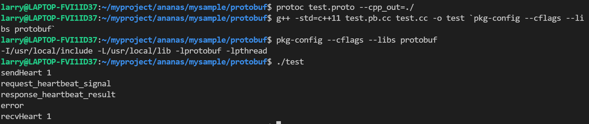

### protobuf

数据结构或对象以某种格式转化为字节流的过程，称之为序列化（Serialization）, 目的是把当前的状态保存下来，在需要时复原数据结构或对象。反序列化（Deserialization），是序列化的逆过程，读取字节流，根据约定的格式协议，将数据结构复原。序列号十分常见, 包括持久化数据结构, 神经网络权重等都涉及了序列化。

protobuf的格式十分简单, message可以作为序列化的class, 而service则看成RPC调用的function。protobuf是和json, xml一样在网络传输的数据格式。
```cpp
option cc_generic_services = true;

// sample 消息
message EchoRequest {
    string text = 1;
}
message EchoResponse {
    string text = 1;
}

service TestService { 
    rpc Echo(EchoRequest) returns(EchoResponse) {
    }  
    rpc ToUpper(EchoRequest) returns(EchoResponse) {
    }  
    rpc AppendDots(EchoRequest) returns(EchoResponse) {
    }
}
```

C++, Java使用Protobuf进行序列化或者RPC需要引用序列化和反序列化的工具, 对C++来说, 这个工具相当于引用的头文件, 增加一个支持序列化和反序列化的编译单元。这样的头文件和编译文件是通过`protoc `工具实现的, 即编译google protobuf项目文件的结果。例如
`protoc test_rpc.proto --cpp_out=./`可以得到`test_rpc.pb.h`和`test_rpc.pb.cc`两个文件。

```cpp
// test.proto
syntax = "proto3";

enum Messagetype
{
	REQUEST_RESPONSE_NONE = 0;            
	REQUEST_HEARTBEAT_SIGNAL = 1;          
	RESPONSE_HEARTBEAT_RESULT = 2;      
}

message MsgResult
{
	bool result =1;  
	bytes error_code = 2; 
}

message TopMessage
{
	Messagetype message_type = 1; 		//message type, 枚举类型
	MsgResult msg_result = 2;

}
```
执行`protoc test.proto --cpp_out=./`序列化成`test.pb.h`和`test.pb.cc`两个文件
```cpp
// test.cc
#include "test.pb.h"		//解析出来的.h文件
#include "stdio.h"

void sendHeart();
void receHeart(TopMessage* topMessage);
void receHeartResp(TopMessage* topMessage);

void sendHeart(){   // 执行
	
	TopMessage message;
	message.set_message_type(REQUEST_HEARTBEAT_SIGNAL); // 消息
	printf("sendHeart %d\n",message.message_type());    
	receHeart(&message);
    printf("recvHeart %d\n",message.message_type());   
}

void receHeart(TopMessage* topMessage){

	if (topMessage->message_type() == REQUEST_HEARTBEAT_SIGNAL)
	{
		
		printf("request_heartbeat_signal\n");
		TopMessage topMessageResp;

		MsgResult mesResult;    // 设置MsgResultesult
		mesResult.set_result(true);
	
		mesResult.set_error_code("error");
		
		topMessageResp.set_message_type(RESPONSE_HEARTBEAT_RESULT); // 修改了top
		
		*topMessageResp.mutable_msg_result() = mesResult;   // MsgResult放入topMessageResp中

		receHeartResp(&topMessageResp);
	}
	
}

void receHeartResp(TopMessage* topMessage){

	if (topMessage->message_type() == RESPONSE_HEARTBEAT_RESULT)    // 读取topMessage
	{
		printf("response_heartbeat_result\n");
		
		printf("%s\n",topMessage->msg_result().error_code().c_str());

	}
}

int main()
{
	sendHeart();
	google::protobuf::ShutdownProtobufLibrary();
}
```

执行(g++ -std=c++11 test.pb.cc test.cc -o test `pkg-config --cflags --libs protobuf`)编译, 其中`pkg-config --cflags --libs protobuf`是链接和protobuf相关的库



### grpc

gRPC是一个高性能、通用的开源RPC框架，其由Google主要面向移动应用开发并基于HTTP/2协议标准而设计，基于ProtoBuf(Protocol Buffers)序列化协议开发。

#### hello world demo

* helloworld.proto
其中有一个service为Greeter, 将会生成一个Greeter class。service作用是作为rpc服务接口, 可以封装message

HelloRequest为message, 也就是服务端和客户端可以交互的消息格式。


```
package helloworld;

// The greeting service definition.
service Greeter {
  // Sends a greeting
  rpc SayHello (HelloRequest) returns (HelloReply) {}
  /// add sayhello again
  rpc SayHelloAgain (HelloRequest) returns (HelloReply) {}
}

//声明两个message The request message containing the user's name.
message HelloRequest {
  string name = 1;
}

// The response message containing the greetings
message HelloReply {
  string message = 1;
}
```

<!-- more -->

* 针对service, protocol编译器将产生一个抽象接口SearchService以及一个相应的存根实现。存根将所有的调用指向RpcChannel，它是一 个抽象接口，必须在RPC系统中对该接口进行实现。如，可以实现RpcChannel以完成序列化消息并通过HTTP方式来发送到一个服务器。

* 头文件和相关类
`helloworld.grpc.pb.h`由helloworld.proto产生, Greeter, HelloReply, HelloRequest来自生成的helloworld类

```cpp
#include <grpcpp/grpcpp.h>

#ifdef BAZEL_BUILD
#include "examples/protos/helloworld.grpc.pb.h"
#else
#include "helloworld.grpc.pb.h"
#endif

using grpc::Channel;
using grpc::ClientContext;
using grpc::Status;
using helloworld::Greeter;
using helloworld::HelloReply;
using helloworld::HelloRequest;
```

* server
server定义继承`Greeter::Service`的服务类, 该服务类内容对应于helloworld.proto message。该服务类绑定到ServerBuilder中

```cpp
/// 自定义服务类, 继承自Greeter::Service, final修饰GreeterServiceImpl, 说明其不可被继承
/// 内部所含函数对应helloworld.proto message, Service对应proto声明的service proto
class GreeterServiceImpl final : public Greeter::Service {
  /// 需要request, reply两个指针作为参数
  /// 这是被client调用的函数
  Status SayHello(ServerContext* context, const HelloRequest* request,
                  HelloReply* reply) override {
    std::string prefix("Hello ");
    /// 设置reply
    reply->set_message(prefix + request->name());
    return Status::OK;
  }

  Status SayHelloAgain(ServerContext* context, const HelloRequest* request,
                       HelloReply* reply) override {
    std::string prefix("Hello again ");
    reply->set_message(prefix + request->name());
    return Status::OK;
  }
};

void RunServer() {
  std::string server_address("0.0.0.0:50051");

  GreeterServiceImpl service;

  /// grpc相关参数
  grpc::EnableDefaultHealthCheckService(true);
  grpc::reflection::InitProtoReflectionServerBuilderPlugin();
  /// ServerBuilder类
  ServerBuilder builder;
  // Listen on the given address without any authentication mechanism.
  builder.AddListeningPort(server_address, grpc::InsecureServerCredentials());
  // Register "service" as the instance through which we'll communicate with
  // clients. In this case it corresponds to an *synchronous* service.
  /// 注册服务, 提供给client
  builder.RegisterService(&service);
  // Finally assemble the server.
  /// 从builder.BuildAndStart()构造Server类
  std::unique_ptr<Server> server(builder.BuildAndStart());
  std::cout << "Server listening on " << server_address << std::endl;

  // Wait for the server to shutdown. Note that some other thread must be
  // responsible for shutting down the server for this call to ever return.
  server->Wait();
}
```

* client

client将借Greeter::Stub调用服务端的sayhello函数

```cpp
class GreeterClient {
 public:
  GreeterClient(std::shared_ptr<Channel> channel)
      : stub_(Greeter::NewStub(channel)) {}

  // Assembles the client's payload, sends it and presents the response back
  // from the server.

  /// 函数
  std::string SayHello(const std::string& user) {
    // Data we are sending to the server.
    /// user封装到request中
    HelloRequest request;
    request.set_name(user);

    // Container for the data we expect from the server.
    HelloReply reply;

    // Context for the client. It could be used to convey extra information to
    // the server and/or tweak certain RPC behaviors.
    ClientContext context;

    // The actual RPC.
    /// 发送&context, request, &reply
    /// 这里实际上是要调用server的sayHello函数
    Status status = stub_->SayHello(&context, request, &reply);

    // Act upon its status.
    if (status.ok()) {
      /// 返回reply.message
      return reply.message();
    } else {
      std::cout << status.error_code() << ": " << status.error_message()
                << std::endl;
      return "RPC failed";
    }
  }
 private:
  std::unique_ptr<Greeter::Stub> stub_;
};
```

* 对应的CMakeList.txt文件

```cpp
cmake_minimum_required(VERSION 3.5.1)

project(HelloWorld C CXX)

include(../cmake/common.cmake)

# Proto file, 得到proto文件
get_filename_component(hw_proto "../../protos/helloworld.proto" ABSOLUTE)
get_filename_component(hw_proto_path "${hw_proto}" PATH)

# Generated sources, 从proto文件生成对应的pb.h grpc.pb.h
set(hw_proto_srcs "${CMAKE_CURRENT_BINARY_DIR}/helloworld.pb.cc")
set(hw_proto_hdrs "${CMAKE_CURRENT_BINARY_DIR}/helloworld.pb.h")
set(hw_grpc_srcs "${CMAKE_CURRENT_BINARY_DIR}/helloworld.grpc.pb.cc")
set(hw_grpc_hdrs "${CMAKE_CURRENT_BINARY_DIR}/helloworld.grpc.pb.h")
# 根据hw_proto, 生成hw_proto_srcs等
add_custom_command(
      OUTPUT "${hw_proto_srcs}" "${hw_proto_hdrs}" "${hw_grpc_srcs}" "${hw_grpc_hdrs}"
      COMMAND ${_PROTOBUF_PROTOC}
      ARGS --grpc_out "${CMAKE_CURRENT_BINARY_DIR}"
        --cpp_out "${CMAKE_CURRENT_BINARY_DIR}"
        -I "${hw_proto_path}"
        --plugin=protoc-gen-grpc="${_GRPC_CPP_PLUGIN_EXECUTABLE}"
        "${hw_proto}"
      DEPENDS "${hw_proto}")

# Include generated *.pb.h files
include_directories("${CMAKE_CURRENT_BINARY_DIR}")

# hw_grpc_proto
add_library(hw_grpc_proto
  ${hw_grpc_srcs}
  ${hw_grpc_hdrs}
  ${hw_proto_srcs}
  ${hw_proto_hdrs})
target_link_libraries(hw_grpc_proto
  ${_REFLECTION}
  ${_GRPC_GRPCPP}
  ${_PROTOBUF_LIBPROTOBUF})

# Targets greeter_[async_](client|server)
# 循环构建 add_executable
foreach(_target
  greeter_client greeter_server 
  greeter_callback_client greeter_callback_server 
  greeter_async_client greeter_async_client2 greeter_async_server)

  add_executable(${_target} "${_target}.cc")
  target_link_libraries(${_target}
    hw_grpc_proto
    ${_REFLECTION}
    ${_GRPC_GRPCPP}
    ${_PROTOBUF_LIBPROTOBUF})
endforeach()
```

