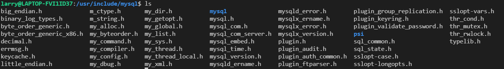

## C/C++ mysql client

> 本章核心在后头的C++ mysql client

### C api

* 直接使用以下语句安装c api的头文件和库文件

```
sudo apt-get install libmysqlclient-dev

mysql一些位置
/usr/bin                 客户端程序和脚本
/usr/sbin                mysqld 服务器
/var/lib/mysql           日志文件，数据库  ［重点要知道这个］
/usr/share/doc/packages  文档
/usr/include/mysql       包含( 头) 文件
/usr/lib/mysql           库
/usr/share/mysql         错误消息和字符集文件
/usr/share/sql-bench     基准程序

快速查找包, 使用apt-file
sudo apt-get install apt-file
sudo apt-file update
sudo apt-file search libmysqlclient.so

libmysqlclient-dev: /usr/lib/x86_64-linux-gnu/libmysqlclient.so

g++内部有库文件和头文件的查询路径, 一般包括/usr/include /usr/local/include, /usr/lib /usr/local/lib。注意该路径下的所有文件都会被搜索
```

在`ubuntu`系统中使用`apt-get`安装, 自动将头文件安装到`/usr/include`目录中, 库文件安装到到`/usr/lib`中

<!-- more -->



#### 简单使用

```cpp
#include <mysql.h>
#include <stdio.h>
#include <stdlib.h>

int main(int argc, char **argv)
{
  MYSQL *con = mysql_init(NULL);

  if (con == NULL)
  {
      fprintf(stderr, "%s\n", mysql_error(con));
      exit(1);
  }

  if (mysql_real_connect(con, "localhost", "root", "root_passwd",
          NULL, 0, NULL, 0) == NULL)
  {
      fprintf(stderr, "%s\n", mysql_error(con));
      mysql_close(con);
      exit(1);
  }

  if (mysql_query(con, "CREATE DATABASE testdb"))
  {
      fprintf(stderr, "%s\n", mysql_error(con));
      mysql_close(con);
      exit(1);
  }

  if (mysql_query(con, "SELECT * FROM cars"))
  {
      finish_with_error(con);
  }

  MYSQL_RES *result = mysql_store_result(con);  /// 存储结果(以上"SELECT * FROM cars"的结果)

  if (result == NULL)
  {
      finish_with_error(con);
  }

  int num_fields = mysql_num_fields(result);

  MYSQL_ROW row;

  while ((row = mysql_fetch_row(result)))
  {
      for(int i = 0; i < num_fields; i++)
      {
          printf("%s ", row[i] ? row[i] : "NULL");
      }

      printf("\n");
  }

  mysql_free_result(result);

  mysql_close(con);
  exit(0);
}
```

* 具体可以自己参考相关文档
https://zetcode.com/db/mysqlc/

### C++ api

同上, 可以通过一行命令安装头文件和库文件
```
sudo apt-get install libmysqlcppconn-dev

find /usr -name *cppconn* # 查找头文件和库文件安装的路径
```


也可以用源码编译, 虽然比较麻烦, 但可以根据当前系统编译可执行文件, 避免出现不适配的情况(总所周知, 可能linux系统一升级, 很多之前编译的文件就可能用不了了)

最好将自己编译的头文件放到`/usr/local/include`, 库文件放到`/usr/local/lib`。

#### 简单使用

```cpp
/* Standard C++ includes */
#include <stdlib.h>
#include <iostream>

/*
  Include directly the different
  headers from cppconn/ and mysql_driver.h + mysql_util.h
  (and mysql_connection.h). This will reduce your build time!
*/
#include "mysql_connection.h"

#include <cppconn/driver.h>
#include <cppconn/exception.h>
#include <cppconn/resultset.h>
#include <cppconn/statement.h>
#include <cppconn/prepared_statement.h>

using namespace std;

int main(void)
{
cout << endl;
cout << "Let's have MySQL count from 10 to 1..." << endl;

try {
  sql::Driver *driver;
  sql::Connection *con;
  sql::Statement *stmt;
  sql::ResultSet *res;
  sql::PreparedStatement *pstmt;

  /* Create a connection */
  driver = get_driver_instance();
  con = driver->connect("tcp://127.0.0.1:3306", "root", "root");
  /* Connect to the MySQL test database */
  con->setSchema("test");

  stmt = con->createStatement();
  stmt->execute("DROP TABLE IF EXISTS test");
  stmt->execute("CREATE TABLE test(id INT)");
  delete stmt;

  /* '?' is the supported placeholder syntax */
  pstmt = con->prepareStatement("INSERT INTO test(id) VALUES (?)");
  for (int i = 1; i <= 10; i++) {
    pstmt->setInt(1, i);
    pstmt->executeUpdate();
  }
  delete pstmt;

  /* Select in ascending order */
  pstmt = con->prepareStatement("SELECT id FROM test ORDER BY id ASC");
  res = pstmt->executeQuery();

  /* Fetch in reverse = descending order! */
  res->afterLast();
  while (res->previous())
    cout << "\t... MySQL counts: " << res->getInt("id") << endl;
  delete res;

  delete pstmt;
  delete con;

} catch (sql::SQLException &e) {
  cout << "# ERR: SQLException in " << __FILE__;
  cout << "(" << __FUNCTION__ << ") on line " »
     << __LINE__ << endl;
  cout << "# ERR: " << e.what();
  cout << " (MySQL error code: " << e.getErrorCode();
  cout << ", SQLState: " << e.getSQLState() << »
     " )" << endl;
}

cout << endl;

return EXIT_SUCCESS;
}
```


### 数据库连接池

数据库连接池与线程池, 内存池类似。本身是一个数据结构, 维护指定数量的数据库连接。

* 数据库连接池本身是一个单例模式, 具体的, 通过静态对象`static ConnectionPool* pool;`, 外界可以直接通过类名访问对象,即`ConnectionPool::pool`。同时将构造函数设置为private外界不能调用, 自身提供静态方法`static ConnectionPool* getInstance();`可以通过类名调用, 如果不存在对象则创建对象, 如果存在对象则直接返回。这保证了数据库连接池对象最多有一个

* 数据库连接池维护一个双向链表, 起到队列的作用, 使用`pop_front`将连接移出给用户,用户使用完在使用`push_back`将连接还给连接池。双向list操作是需要加锁的。初始化40个连接, 也就是list大小为40，如果之后不够那么每次增加20(capacity/2)。

* 数据库连接Connection用shared_ptr维护，删除一个连接先调用close()关闭连接, 再调用reset()析构连接。同时注意返回参数尽量不要是左值引用, 原因在于数据库连接对象返回左值引用实际对象将会被析构。**如果想返回左值引用, 那么无比传入的参数也是左值引用, 参照拷贝构造函数**, 右值引用一般不用担心 一般右值引用同时返回了右值

mysql_connection_sp.h
```cpp
#ifndef _MYSQL_CONNECTION_
#define _MYSQL_CONNECTION_

// STL
#include <iostream>
#include <string>
#include <list>
#include <memory>
#include <functional>

/// mysql driver
#include <mysql_driver.h>
#include <mysql_connection.h>

#include <cppconn/driver.h>
#include <cppconn/statement.h>
#include <cppconn/prepared_statement.h>
#include <cppconn/resultset.h>
#include <exception>

#include <mutex>

using namespace sql;

/// 作为删除器的参数, std::function<void<Connection*>>
using delFunc = std::function<void(Connection*)>;

/// Connection析构器
//auto delInvmt = [](Connection* conn) {
//    delete conn;
//};

/// 约定, 函数中Conn表示connection连接
/// ConnectionPool表示连接池

class ConnectionPool {
public:
    /// static 单例模式, 这样通过类名即可以调用getInstance获取对象, 也就是ConnectionPool::getInstance
    static ConnectionPool* getInstance();
    /// 从连接池中得到一个连接
    auto getConn() -> std::shared_ptr<Connection>;
    /// 将ret连接归还到连接池中
    auto retConn(std::shared_ptr<Connection>&& ret) -> void;

    /// 连接池的大小
    auto getPoolSize() -> int;
    ~ConnectionPool();

private:
    /// 构造ConnectionPool
    ConnectionPool(std::string name, std::string pwd, std::string nurl, int maxSize);
    /// 初始化连接池
    auto initConnectionPool(int initialSize) -> void;
    /// 销毁连接池
    auto destroyPool() -> void;
    /// 销毁一个连接
    auto destroyOneConn() -> void;
    /// 扩大数据库连接池
    auto expandPool(int size) -> void;
    auto reducePool(int size) -> void;
    /// 增加连接
    auto addConn(int size)-> void;

private:
    std::string username;
    std::string password;
    std::string url;
    int poolCapacity;

    /// 存放连接, 用std::list链表, 使用相当于队列, 队头出, 队尾进入
    /// std::list<std::shared_ptr<Connection>> connList;

    /// 或许unique_ptr更好些
    std::list<std::shared_ptr<Connection>> connList;
    /// static维护的自身对象
    static ConnectionPool* pool;    // 连接池对象, static
    
    std::mutex lock;
    Driver* driver; // mysql driver, 来自<cppconn/driver.h>
};

#endif
```

mysql_connection_sp.cc
```cpp
#include <cstdio>
#include <cstdlib>
#include <cassert>

#include "mysql_connection_sp.h"

/// 初始化 static对象 ConnectionPool::pool
/// ConnectionPool* 
///ConnectionPool::pool = nullptr;
ConnectionPool* ConnectionPool::pool = nullptr;

/// 构造函数, 直接在参数中就根据形参name, pwd等初始化了username, password
ConnectionPool::ConnectionPool(std::string name, std::string pwd, std::string nurl, int maxSize):
    username(name), password(pwd), url(nurl), poolCapacity(0)
{
    /// mysql驱动, 来自cppconn/driver.h, 获取实例Driver* driver
    driver = get_driver_instance();
    /// 初始化连接池, 预先加入poolSize的连接
    initConnectionPool(maxSize/2);
}

ConnectionPool::~ConnectionPool() {
    /// 析构线程池
    destroyPool();
}

/// 线程池大小
int ConnectionPool::getPoolSize() {
    return connList.size();
}

/// 向连接池中增加size的连接, 不会改变poolSize
void ConnectionPool::addConn(int size)
{
    for (int i = 0; i < size; i ++) {
        // 创建连接, 调用driver->connect(), 返回Connection
        Connection* conn = driver->connect(url, username, password);
        /// shared_ptr维护连接对象conn, 并加入析构函数。一般的,conn永远不会被析构, 用完了会归还给连接池
        /// 
        std::shared_ptr<Connection> spConn(conn, 
            [](Connection* conn) {
                delete conn;
            });
        /// 连接以右值形式加入到connList中
        connList.push_back(std::move(spConn));
        poolCapacity++;
    }
}

/// 初始化连接池, 预先加入指定大小的连接
void ConnectionPool::initConnectionPool(int initialSize) {
    /// 初始化连接池, 向里面增加initialSize的连接
    std::lock_guard<std::mutex> locker(lock);
    addConn(initialSize);
}

/// 销毁连接池front队头位置的连接
void ConnectionPool::destroyOneConn() {
    /// 拿出头部连接
    std::shared_ptr<Connection>& spConn = connList.front();
    spConn->close();    // Connection调用close()
    ///spConn.reset();
    --poolCapacity;
}

/// 只是销毁连接池的所有连接. 连接池没有销毁
void ConnectionPool::destroyPool() {
    /// 对conList连接池的所有连接, 从connList.front开始
    for (auto& conn : connList) {
        /// 拿出连接, 执行close()
        std::shared_ptr<Connection>& spConn = connList.front();
        spConn->close();    /// 关闭连接
        ///spConn.reset();    /// shared_ptr计数减一, 调用注册的析构函数析构Connection对象
        /// unique_ptr离开作用域自动释放
        --poolCapacity;
    }
}

/// 从连接池中移除大小为size的连接, 注意移除连接导致poolSize的变化因为不会还回来; 用户申请数据连接不会导致poolSize变化,因为会还回来
void ConnectionPool::reducePool(int size)
{
    std::lock_guard<std::mutex> locker(lock);
    if (size > poolCapacity)
        return; /// size有问题, 不进行任何操作
    for (int i = 0; i < size; i++) {
        destroyOneConn();
    }
    poolCapacity -= size;
}

/// 得到一个ConnectionPool连接池对象
/// 对象在堆上分配内存, 指针pool是static的(在静态区的指针)
ConnectionPool* ConnectionPool::getInstance() {
    if (pool == nullptr) {
        /// username(name), password(pwd), url(nurl), poolSize(maxSize)
        pool = new ConnectionPool("root", "root", "tcp://127.0.0.1:3306", 40);
    }
    return pool;
}

// 从conList中得到一个连接
std::shared_ptr<Connection>
ConnectionPool::getConn()
{
    std::lock_guard<std::mutex> locker(lock);
    if (connList.size() <= 0){
        addConn(poolCapacity/2);  /// 增加1/2的容量
    } /// 容量不够

    ///std::shared_ptr<Connection> spConn = connList.front();
    std::shared_ptr<Connection> spConn = std::move(connList.front());
    connList.pop_front();    /// 连接移出连接池
    return spConn;
}

// 归还连接到连接池, connList加入归还的连接
void ConnectionPool::retConn(std::shared_ptr<Connection>&& ret) {
    std::lock_guard<std::mutex> locker(lock);
    connList.push_back(std::move(ret));
}
```

测试
```cpp
#include <cstdio>
#include <cstdlib>
#include <cassert>

// #include "mysql_connection_up.h"
#include "mysql_connection_sp.h"
#include <unistd.h>
#include <memory>

/// getInstance()是static静态方法, 返回一个数据库连接池对象指针
/// g++ -o test mysql_test.cpp mysql_connect.cpp  -I . -lmysqlcppconn
ConnectionPool* pool = ConnectionPool::getInstance();

int main(int argc, char* argv[]) {
    ///std::unique_ptr<Connection> conn;
    Statement* state;
    ResultSet* result;

    /// 获得一个数据库连接

    ///std::unique_ptr<Connection, delFunc> conn = pool->getConn();
    std::shared_ptr<Connection> conn = pool->getConn();

    state = conn->createStatement();
    // 使用数据库
    state->execute("use mydb");

    // 查询语句
    result = state->executeQuery("select * from user;");
    while(result->next()) {
        ///int id = result->getInt("uid");
        std::string name = result->getString("username");
        std::cout << " name:" << name << std::endl; 
    }
    sleep(2);
    pool->retConn(std::move(conn)); // 归还连接
    std::cout << pool->getPoolSize() << std::endl;
    sleep(2);


    return 0;
}
```

#### unique_ptr版本

数据库连接池可以理解成简单的工厂模式, 每个数据库连接对象是唯一的,不可复制和拷贝。我们自然想到用`unique_ptr`维护数据库连接对象。

* `unique_ptr`不可赋值和拷贝, 但可以移动赋值拷贝,换言之只能用右值赋给`unique_ptr`, 左值不行。 此外删除器类型是作为模板参数编译期可知的。这部分十分容易写出很多bug。`unique_ptr`初始化用`unique_ptr<class>(new class)`执行实例化。

* `std::unique_ptr<Connection,delFunc>;`要贯穿全部`std::unique_ptr`, 此外`std::move`为了保证右值也需要, 且要防止出现拷贝构造和拷贝赋值, 项目因此会增加精力。即使`std::unique_ptr`是效率高的, 但也要权衡

* 右值赋值是所有权移动, 不影响`unique_ptr`(还是一个指针指向对象, 原来指针给了新之怎, 变为空); 左值赋值则是拷贝构造, 需要用`shared_ptr`引用计数+1(新旧指针都指向对象)。

```cpp
#include <iostream>
#include <string>

using namespace std;

int main() {
    string s1("s1");
    string s2("s2");

    s2 = std::move(s1);
    string s3 = s2;
    cout << s1 <<endl;
    cout << s2 <<endl;
    cout << s3<<endl;
    return 0;
}
输出(s1变为空)

s1
s1
```

右值赋值的所有权转移是对象内部成员变量的所有权, 值语义字面量还是那个值语义。
```cpp
char* c1 = "123";
cout << c1 << "\n";
char* c2 = std::move(c1);
cout << c1 << "\n";
cout << c2 << "\n";
输出(地址正常赋值了)
123
123
123
```

* 我们写移动构造函数和移动赋值操作, 实际上只是整合, 例如如下`Person`类有string类name, 这时候我们用`std::move`调用已经string已经实现好的移动操作即可(stl容器也是一样), 也就是慢慢分解。而对于int, 我们发现移动操作和赋值操作是一样的。

```cpp
class Person {
public:
    string name;
    int id;
    Person() :name(""), id(0) {}
    Person(string _name, int _id) : name(_name), id(_id) {}

    Person(const Person& p) {
        name = p.name;
        id = p.id;
    }
    Person& operator=(const Person& p) {
        name = p.name;
        id = p.id;
        return *this;
    }

    Person(Person&& person)
    {
        name = std::move(person.name);
        id = std::move(person.id);
        std::cout << "移动构造函数"<< std::endl;
    }

    Person& operator=(Person&& person){
    if (this != &person)
    {
        name = std::move(person.name);
        id = std::move(person.id);
        std::cout << "移动赋值函数"<< std::endl;
    }
    return *this;
    }


    friend ostream& operator<<(ostream& out, Person& p);
};

ostream& operator<<(ostream& out, Person& p){
    out << p.name <<" + "<< p.id;
    return out;
}

int main() {
    cout << "start" <<"\n";
    string s1("s1");
    string s2("s2");

    s2 = std::move(s1);
    string s3 = s2;
    cout << s1 <<endl;
    cout << s2 <<endl;
    cout << s3<<endl;


    char* c1 = "123";
    cout << c1 << "\n";
    char* c2 = std::move(c1);
    cout << c1 << "\n";
    cout << c2 << "\n";

    Person p1("rui", 1);
    Person p2;
    cout << p1 <<"\n";
    p2 = std::move(p1);
    cout << p1 <<"\n";
    cout << p2 <<"\n";
    
    return 0;
}

输出
start

s1
s1
123
123
123
rui + 1
移动赋值函数
 + 1
rui + 1
```

* 我们和默认构造的函数进行结果比较, 结果是一样的

```cpp
#include <iostream>
#include <string>

using namespace std;

class Person {
public:
    string name;
    int id;
    Person() :name(""), id(0) {}
    Person(string _name, int _id) : name(_name), id(_id) {}

    Person(const Person& person) = default;
    Person& operator=(const Person& person) = default;

    Person(Person&& person) = default;
    Person& operator=(Person&& person) = default;

    friend ostream& operator<<(ostream& out, Person& p);
};

ostream& operator<<(ostream& out, Person& p){
    out << p.name <<" + "<< p.id;
    return out;
}

int main() {

    Person p1("rui", 1);
    Person p2;
    cout << p1 <<"\n";
    p2 = std::move(p1);
    cout << p1 <<"\n";
    cout << p2 <<"\n";
    
    return 0;
}

输出
rui + 1
 + 1
rui + 1
```


不多说, 以下是`unique_ptr`版本的mysql连接
mysql_connection_up.h
```cpp
#ifndef _MYSQL_CONNECTION_
#define _MYSQL_CONNECTION_

// STL
#include <iostream>
#include <string>
#include <list>
#include <memory>
#include <functional>

/// mysql driver
#include <mysql_driver.h>
#include <mysql_connection.h>

#include <cppconn/driver.h>
#include <cppconn/statement.h>
#include <cppconn/prepared_statement.h>
#include <cppconn/resultset.h>
#include <exception>

#include <mutex>

using namespace sql;

/// 作为删除器的参数, std::function<void<Connection*>>
using delFunc = std::function<void(Connection*)>;

/// Connection析构器
//auto delInvmt = [](Connection* conn) {
//    delete conn;
//};

/// 约定, 函数中Conn表示connection连接
/// ConnectionPool表示连接池

class ConnectionPool {
public:
    /// static 单例模式, 这样通过类名即可以调用getInstance获取对象, 也就是ConnectionPool::getInstance
    static ConnectionPool* getInstance();
    /// 从连接池中得到一个连接
    auto getConn() -> std::unique_ptr<Connection,delFunc>;
    /// 将ret连接归还到连接池中
    auto retConn(std::unique_ptr<Connection, delFunc>&& ret) -> void;

    /// 连接池的大小
    auto getPoolSize() -> int;
    ~ConnectionPool();

private:
    /// 构造ConnectionPool
    ConnectionPool(std::string name, std::string pwd, std::string nurl, int maxSize);
    /// 初始化连接池
    auto initConnectionPool(int initialSize) -> void;
    /// 销毁连接池
    auto destroyPool() -> void;
    /// 销毁一个连接
    auto destroyOneConn() -> void;
    /// 扩大数据库连接池
    auto expandPool(int size) -> void;
    auto reducePool(int size) -> void;
    /// 增加连接
    auto addConn(int size)-> void;

private:
    std::string username;
    std::string password;
    std::string url;
    int poolCapacity;

    /// 存放连接, 用std::list链表, 使用相当于队列, 队头出, 队尾进入
    /// std::list<std::shared_ptr<Connection>> connList;

    /// 或许unique_ptr更好些
    std::list<std::unique_ptr<Connection, delFunc>> connList;
    /// static维护的自身对象
    static ConnectionPool* pool;    // 连接池对象, static
    
    std::mutex lock;
    Driver* driver; // mysql driver, 来自<cppconn/driver.h>
};

#endif
```


mysql_connection_up.cc

```cpp
#include <cstdio>
#include <cstdlib>
#include <cassert>

#include "mysql_connection_up.h"

/// 初始化 static对象 ConnectionPool::pool
/// ConnectionPool* 
///ConnectionPool::pool = nullptr;
ConnectionPool* ConnectionPool::pool = nullptr;

/// 构造函数, 直接在参数中就根据形参name, pwd等初始化了username, password
ConnectionPool::ConnectionPool(std::string name, std::string pwd, std::string nurl, int maxSize):
    username(name), password(pwd), url(nurl), poolCapacity(0)
{
    /// mysql驱动, 来自cppconn/driver.h, 获取实例Driver* driver
    driver = get_driver_instance();
    /// 初始化连接池, 预先加入poolSize的连接
    initConnectionPool(maxSize/2);
}

ConnectionPool::~ConnectionPool() {
    /// 析构线程池
    destroyPool();
}

/// 线程池大小
int ConnectionPool::getPoolSize() {
    return connList.size();
}

/// 向连接池中增加size的连接, 不会改变poolSize
void ConnectionPool::addConn(int size)
{
    for (int i = 0; i < size; i ++) {
        // 创建连接, 调用driver->connect(), 返回Connection
        Connection* conn = driver->connect(url, username, password);
        /// shared_ptr维护连接对象conn, 并加入析构函数。一般的,conn永远不会被析构, 用完了会归还给连接池
        /// 
        std::unique_ptr<Connection, delFunc> spConn(conn, 
            [](Connection* conn) {
                delete conn;
            });
        /// 连接以右值形式加入到connList中
        connList.push_back(std::move(spConn));
        poolCapacity++;
    }
}

/// 初始化连接池, 预先加入指定大小的连接
void ConnectionPool::initConnectionPool(int initialSize) {
    /// 初始化连接池, 向里面增加initialSize的连接
    std::lock_guard<std::mutex> locker(lock);
    addConn(initialSize);
}

/// 销毁连接池front队头位置的连接
void ConnectionPool::destroyOneConn() {
    /// 拿出头部连接
    std::unique_ptr<Connection, delFunc>& spConn = connList.front();
    spConn->close();    // Connection调用close()
    ///spConn.reset();
    --poolCapacity;
}

/// 只是销毁连接池的所有连接. 连接池没有销毁
void ConnectionPool::destroyPool() {
    /// 对conList连接池的所有连接, 从connList.front开始
    for (auto& conn : connList) {
        /// 拿出连接, 执行close()
        std::unique_ptr<Connection, delFunc>& spConn = connList.front();
        spConn->close();    /// 关闭连接
        ///spConn.reset();    /// shared_ptr计数减一, 调用注册的析构函数析构Connection对象
        /// unique_ptr离开作用域自动释放
        --poolCapacity;
    }
}

/// 从连接池中移除大小为size的连接, 注意移除连接导致poolSize的变化因为不会还回来; 用户申请数据连接不会导致poolSize变化,因为会还回来
void ConnectionPool::reducePool(int size)
{
    std::lock_guard<std::mutex> locker(lock);
    if (size > poolCapacity)
        return; /// size有问题, 不进行任何操作
    for (int i = 0; i < size; i++) {
        destroyOneConn();
    }
    poolCapacity -= size;
}

/// 得到一个ConnectionPool连接池对象
/// 对象在堆上分配内存, 指针pool是static的(在静态区的指针)
ConnectionPool* ConnectionPool::getInstance() {
    if (pool == nullptr) {
        /// username(name), password(pwd), url(nurl), poolSize(maxSize)
        pool = new ConnectionPool("root", "root", "tcp://127.0.0.1:3306", 40);
    }
    return pool;
}

// 从conList中得到一个连接
std::unique_ptr<Connection,delFunc>
ConnectionPool::getConn()
{
    std::lock_guard<std::mutex> locker(lock);
    if (connList.size() <= 0){
        addConn(poolCapacity/2);  /// 增加1/2的容量
    } /// 容量不够

    ///std::shared_ptr<Connection> spConn = connList.front();
    std::unique_ptr<Connection, delFunc> spConn = std::move(connList.front());
    connList.pop_front();    /// 连接移出连接池
    return spConn;
}

// 归还连接到连接池, connList加入归还的连接
void ConnectionPool::retConn(std::unique_ptr<Connection, delFunc>&& ret) {
    std::lock_guard<std::mutex> locker(lock);
    connList.push_back(std::move(ret));
}
```

test.cc
```cpp
#include <cstdio>
#include <cstdlib>
#include <cassert>

#include "mysql_connection_up.h"
#include <unistd.h>
#include <memory>

/// getInstance()是static静态方法, 返回一个数据库连接池对象指针
/// g++ -o test mysql_test.cpp mysql_connect.cpp  -I . -lmysqlcppconn
ConnectionPool* pool = ConnectionPool::getInstance();

int main(int argc, char* argv[]) {
    ///std::unique_ptr<Connection> conn;
    Statement* state;
    ResultSet* result;

    /// 获得一个数据库连接

    std::unique_ptr<Connection, delFunc> conn = pool->getConn();

    state = conn->createStatement();
    // 使用数据库
    state->execute("use mydb");

    // 查询语句
    result = state->executeQuery("select * from user;");
    while(result->next()) {
        ///int id = result->getInt("uid");
        std::string name = result->getString("username");
        std::cout << " name:" << name << std::endl; 
    }
    sleep(2);
    pool->retConn(std::move(conn)); // 归还连接
    std::cout << pool->getPoolSize() << std::endl;
    sleep(2);


    return 0;
}
```