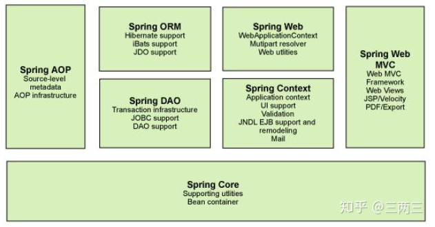
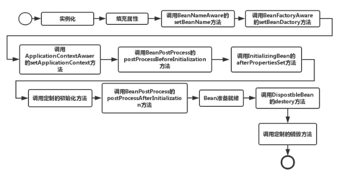

> 学习计算机过程老有一些所谓高大上的名词, 但是如果理解了会发现很简单。比如IOC控制反转, 反正不论什么名词, 都比数学简单的多。所以不要惧怕它。

这篇文章想讨论下java spring等框架一些特殊控制对象的逻辑, 以及是否适用于C++。

### spring

Spring的两个核心概念是IOC（控制反转）和AOP（面向切面编程）。

* IOC（控制翻转）是一种编程范式，可以在一定程度上解决复杂系统对象耦合度太高的问题。IOC最常见的方式是DI（依赖注入, 对象依赖容器, 容器注入生成对象），可以通过一个容器，将Bean维护起来，方便在其他地方直接使用，而不是重新new。我理解的一般是通过XML配置文件, 写明对象的成员, 方法依赖关系, IOC容器会自动配置对象不用程序员new。这里的Bean可以视为一种特殊的对象, 有特定的规范(比如具有set.., get..这些), 统一格式方便进行处理。

* AOP（Aspect-OrientedProgramming，面向方面编程）, 基本思路是将共同调用的逻辑或责任封装起来，便于减少系统的重复代码(例如多个对象都需要引入日志行为, 鉴权)。一个可行的办法是使用代理, 将业务相同的逻辑逻辑经由代理类分发(代理类可以理解为中介)。换言之, 对象作为参数传入代理类, 代理类对所有对象先执行日志行为, 再调用对象方法, 就实现了公用逻辑(日志)的通用。一般传入对象使用反射字符串, 可以运行时按需运行对象(有反射这样称为动态代理)。但**单纯的AOP思想, 完全可以用C++的回调函数实现**。

<!-- more -->

#### 体系结构



* 核心容器：核心容器的主要组件是 BeanFactory，它是工厂模式的实现。BeanFactory 使用控制反转 （IOC） 根据配置构建对象。
* Spring context包括 JNDI、EJB、电子邮件、国际化、校验和调度功能。
* Spring AOP：给 Spring 框架管理的任何对象支持 AOP。
* Spring DAO：JDBC DAO 抽象层提供管理异常处理和不同数据库供应商抛出的错误消息。
* Spring ORM：Spring 框架插入了若干个 ORM 框架
* Spring Web 模块：Web 上下文模块建立在应用程序上下文模块之上，为基于 Web 的应用程序提供了上下文。
* Spring MVC 框架：MVC 框架是一个全功能的构建 Web 应用程序的 MVC 实现


### C++ 仿写Java的反射

Java反射的作用是在运行期生成对象, 这常常在web开发中使用。例如程序运行期间可以基于到来的连接来生成对象处理, 相比于静态生成对象这增加了灵活性, 不用开始一直创建这个对象耗费大量资源。当然, 这牺牲了效率。

反射的实现需要解决以下问题
1. 运行期创建对象
2. 对象可以通过接收字符串创建

Java对以上是支持的, JVM本身支持运行时基于字符串导入`.class`文件解析创建对象。例如

```cpp
public class Apple {
    private int price;

    public int getPrice() {
        return price;
    }
    public void setPrice(int price) {
        this.price = price;
    }
    public static void main(String[] args) throws Exception{
        //正常的调用
        Apple apple = new Apple();
        apple.setPrice(5);
        System.out.println("Apple Price:" + apple.getPrice());
        //使用反射调用
        /// 输入字符串"com.chenshuyi.api.Apple"(表示class路径)
        Class clz = Class.forName("com.chenshuyi.api.Apple");
        /// 运行时获取方法
        Method setPriceMethod = clz.getMethod("setPrice", int.class);
        Constructor appleConstructor = clz.getConstructor();
        Object appleObj = appleConstructor.newInstance();
        setPriceMethod.invoke(appleObj, 14);
        Method getPriceMethod = clz.getMethod("getPrice");
        System.out.println("Apple Price:" + getPriceMethod.invoke(appleObj));
    }
}
```
以上, 可以将`Class.forName`的字符串参数作为输入, 例如当某个连接到来则输入某个字符串, `Class.forName`就可以根据此创建对象, 比较灵活。

C++ 是做不到Java反射那么灵活的, 虽然它可以运行时创建对象(在堆上), 但并不能动态的接受字符串创建对象, 它创建的对象都是编译前写好的(不能运行时接受一个字符串来创建)。这一步可以模拟, 最终也能实现运行期间获取元素自动生成对象。

* RegisterAction类, 构造函数接受一个字符串和工厂函数(return new object那种), 将它们注册到`<string, func>`的map中。这实现了通过字符串调工厂函数进而获得对象。

* 利用宏定义的#, 可以将字面量看成字符串,进而注册RegisterAction。 `RegisterAction g_creatorRegister##className(                        \
		#className,(PTRCreateObject)objectCreator##className)`, 将字符串`#className`, 与字符串代表的类工厂函数绑定。
* 对注册完毕的`<string, func>`map, 用户可以直接通过string调用func得到对象。

* 对象是当用户string调用func时创建的,但使用的是new, Java反射不是使用的new创建对象。(Java反射和new都是通过类加载器对.class文件加载进内存中，创建了Class对象。)，java反射按需加载.class文件, C++借用工厂回调函数按需new对象。

```cpp
/// 函数指针的typedef
typedef void* (*PTRCreateObject)(void);  

class ClassFactory {
private:  
    map<string, PTRCreateObject> m_classMap ;  
	ClassFactory(){}; //构造函数私有化, 不能外界调用
	
public:   
    void* getClassByName(string className);  
    void registClass(string name, PTRCreateObject method) ; 
    /// getInstance是静态对象 
    static ClassFactory& getInstance() ;  
};

void* ClassFactory::getClassByName(string className){  
    map<string, PTRCreateObject>::const_iterator iter;  
    iter = m_classMap.find(className) ;  
    if ( iter == m_classMap.end() )  
        return NULL ;  
    else  
        return iter->second() ;  
}  

/// 注册实例到class_map中, 可以通过字符串调用之
/// 注册的是一个对象获取函数PTRCreateObject, 而不是对象
/// 对象知道使用getClassByName, 将PTRCreateObject强制转换成TestClass才会调用之
/// 显然以上运行时才产生对象, 且根据string获取对象, 反射规则
/// 这种可以实现类似动态的来了一个连接创建对象, 关闭连接释放对象, 不用一开始保留很多对象。因此在spring类似web框架应用广泛
void ClassFactory::registClass(string name, PTRCreateObject method){  
    m_classMap.insert(pair<string, PTRCreateObject>(name, method)) ;  
}  


ClassFactory& ClassFactory::getInstance(){
    /// 静态对象, 返回静态对象的引用
    static ClassFactory sLo_factory;  
    return sLo_factory ;  
}  

class RegisterAction{
public:
	RegisterAction(string className,PTRCreateObject ptrCreateFn){
        printf("ok2\n");
        /// 调用ClassFactory, 获取工厂实例,调用registClass注册之     
		ClassFactory::getInstance().registClass(className,ptrCreateFn);
	}
};


/*
#表示字符串化操作符（stringification）。其作用是：将宏定义中的传入参数名转换成用一对双引号括起来参数名字符串。
##表示连接 

使用宏定义可以实现字符串形式
*/
#define REGISTER(className) 											\
	className* objectCreator##className(){     							\
    printf("ok\n");     \
        return new className;                                         	\
    }                                                                   \
    RegisterAction g_creatorRegister##className(                        \
		#className,(PTRCreateObject)objectCreator##className)   ///(#className,(PTRCreateObject)objectCreator##className) 初始化一个RegisterAction对象
    /// 注意这里只是将函数作为参数用来构造RegisterAction实例

// test class
class TestClass{
public:
	void m_print(){
		cout<<"hello TestClass"<<endl;
	};
};
REGISTER(TestClass);

int main(int argc,char* argv[]) {
	TestClass* ptrObj=(TestClass*)ClassFactory::getInstance().getClassByName("TestClass");
	//ptrObj->m_print();
}
```

### spring的bean



1. 实例化Bean
对于BeanFactory容器，当客户向容器请求一个尚未初始化的bean时，或初始化bean的时候需要注入另一个尚未初始化的依赖时，容器就会调用createBean进行实例化。

2. 设置对象属性（依赖注入）
实例化后的对象被封装在BeanWrapper对象中，并且此时对象仍然是一个原生的状态，并没有初始化。紧接着，Spring根据BeanDefinition中的信息进行依赖注入。

3. 注入Aware接口
紧接着，Spring会检测该对象是否实现了xxxAware接口，并将相关的xxxAware实例注入给bean。

4. 
当经过上述几个步骤后，bean对象已经被正确构造，但如果你想要对象被使用前再进行一些自定义的处理，就可以通过BeanPostProcessor接口实现。

### C++ AOP

* 基本思路是传递一些切片类型作为都执行的, 例如日志类等。这些可以放在模板类型参数中
* 然后再形参里传递要执行的函数。中间经过代理类整合成正常的函数。

以下代码涉及一些C++高级特性

* `auto check(int) ->`
* `decltype`
* `std::declval<U>().member`, 可以调用U类的成员函数
* `std::is_same<decltype(check<T>(0))`, `std::true_type>::value`, 比较，类型是否相同, 相同::value为true
* `typename std::enable_if<HasMember_before<T, Args...>::value && HasMember_after<T, Args...>::value>::type`, std::enable_if

CppAop.hpp
```cpp
#ifndef __CPPAOP_H__
#define __CPPAOP_H__

#include <iostream>

namespace CppAop {

/*  std::declval返回一个类型的右值引用, 并可以访问模板类的成员函数

std::is_same
位于头文件<type_traits>中, 两个一样的类型会返回true
bool isInt = std::is_same<int, int>::value; //为true

value是 = std::is_same<decltype(check<T>(0)), std::true_type>::value   , 也就是decltype(check<T>(0))类型和std::true_type是否相等

check的模板参数为U, 其实就是输入判定的类型参数为int, 返回类型为decltype(std::declval<U>().member(std::declval<Args>()...), std::true_type())
member会被before或after替代

decltype(std::declval<U>().member(std::declval<Args>()...), std::true_type())输入两个参数, 当std::declval<U>().member(std::declval<Args>()...)有效时会输出std::true_type()

struct A {              // abstract class
  virtual int value() = 0;
};
 
class B : public A {    // class with specific constructor
  int val_;
public:
  B(int i,int j):val_(i*j){}
  int value() {return val_;}
};
 
int main() {
  decltype(std::declval<A>().value()) a;  // int a
  decltype(std::declval<B>().value()) b;  // int b
  decltype(B(0,0).value()) c;   // same as above (known constructor)
*/

#define HAS_MEMBER(member)                                                                                       \
    template <typename T, typename... Args>                                                                      \
    struct HasMember_##member                                                                                    \
    {                                                                                                            \
    private:                                                                                                     \
        template <typename U>                                                                                 \
        static auto check(int) -> decltype(std::declval<U>().member(std::declval<Args>()...), std::true_type()); \
                                                                                                                 \
        template <typename U>                                                                                    \
        static std::false_type check(...);                                                                       \
                                                                                                                 \
    public:                                                                                                      \
        enum                                                                                                     \
        {                                                                                                        \
            value = std::is_same<decltype(check<T>(0)), std::true_type>::value                                   \
        };                                                                                                       \
    };
}

namespace WzAop
{
/// 这里是判断切片类是否有要执行的成员函数, 例如before等。基本思路是使用std::declval<U>()
#define HAS_MEMBER(member)                                                                                       \
    template <typename T, typename... Args>                                                                      \
    struct HasMember_##member                                                                                    \
    {                                                                                                            \
    private:                                                                                                     \
        template <typename U>                                                                                    \
        static auto check(int) -> decltype(std::declval<U>().member(std::declval<Args>()...), std::true_type()); \
                                                                                                                 \
        template <typename U>                                                                                    \
        static std::false_type check(...);                                                                       \
                                                                                                                 \
    public:                                                                                                      \
        enum                                                                                                     \
        {                                                                                                        \
            value = std::is_same<decltype(check<T>(0)), std::true_type>::value                                   \
        };                                                                                                       \
    };

    /// 宏定义将解折叠, 形成HasMember_before和HasMember_after
    HAS_MEMBER(before)
    HAS_MEMBER(after)

    template <typename Function, typename... Args>
    class CppAop
    {
    public:
        CppAop() = default;

        /// 拷贝函数被delete
        CppAop(const CppAop &) = delete;
        CppAop &operator=(const CppAop &) = delete;

        /// 用Function赋值给m_func
        CppAop(Function &&f) : m_func(std::forward<Function>(f))
        {
        }

        /// std::enable_if 满足条件时类型有效。
        /// 只有HasMember_before<T, Args...>::value && HasMember_after<T, Args...>::value都为true有效, 显然基于宏定义
        /// value = std::is_same<decltype(check<T>(0)), std::true_type>::value, value是bool型
        /// type std::enable_if<>::type, 
        /// type	either T or no such member, depending on the value of B
        /*
        template<bool B, class T = void>
        struct enable_if {};

        template<class T>
        struct enable_if<true, T> { typedef T type; };
        */  
       /// invoke接受切片类并执行之(aspect.before) 
       /// m_func是已经提前赋值的执行函数
        template <typename T>
        typename std::enable_if<HasMember_before<T, Args...>::value && HasMember_after<T, Args...>::value>::type
        invoke(Args &&... args, T &&aspect)
        {
            aspect.before(std::forward<Args>(args)...);
            m_func(std::forward<Args>(args)...);
            aspect.after(std::forward<Args>(args)...);
        }

        /// aspect是输入的切片类对象, 类型是T的通用引用
        /// Args &&... args 是可被before, m_func等函数执行的参数
        template <typename T>
        typename std::enable_if<HasMember_before<T, Args...>::value && !HasMember_after<T, Args...>::value>::type
        invoke(Args &&... args, T &&aspect)
        {
            aspect.before(std::forward<Args>(args)...);
            m_func(std::forward<Args>(args)...);
        }

        template <typename T>
        typename std::enable_if<!HasMember_before<T, Args...>::value && HasMember_after<T, Args...>::value>::type
        invoke(Args &&... args, T &&aspect)
        {
            m_func(std::forward<Args>(args)...);
            aspect.after(std::forward<Args>(args)...);
        }

        template <typename Head, typename... Tail>
        void invoke(Args &&... args, Head &&headAspect, Tail &&... tailAspect)
        {
            headAspect.before(std::forward<Args>(args)...);
            invoke(std::forward<Args>(args)..., std::forward<Tail>(tailAspect)...);
            headAspect.after(std::forward<Args>(args)...);
        }

    private:
        Function m_func;
    };

    /* Cross platform deal: compatibility for visual studio & g++ */
    template <typename T>
    using identity_t = T;

} /* namespace WzAop */

#endif
```

GenAop.hpp

```cpp
#ifndef __GENERALAOP_H__
#define __GENERALAOP_H__

#include "CppAop.hpp"

class GeneralAop
{
public:
    GeneralAop() = delete;
    ~GeneralAop() = delete;

/// 模板参数类型为一个Function, 一些args.而且很显然AP表示AOP整合的通用类, 比如日志类
/// 参数Function是要执行的函数, 后面Args是参数
    template <typename... AP, typename... Args, typename Function>
    static void invoke(Function &&f, Args &&... args)
    {
        /// 基于要执行的function args生成WzAop对象
        /// 向CppAop注册要执行的function
        WzAop::CppAop<Function, Args...> asp(std::forward<Function>(f));

        /// 向CppAop注册切片类AP, asp是构建好的要执行的function, 基于切片类AP调用invoke
        /// WzAop::identity_t 返回AP的类型
        asp.invoke(std::forward<Args>(args)..., WzAop::identity_t<AP>()...);
    }
};

#endif
```

aop.cc
```cpp
#include <iostream>
#include <functional>

#include "GenAop.hpp"

void aopTest1(int data)
{
	printf("test1...%d\n",data);
}

class AopTest2
{
public:
	void test(int data1,std::string data2)
	{
		printf("test2...%d,%s\n",data1,data2.c_str());
	}
};

/// 切片类, Log
class Log
{
public:
	void before(int data)
	{
		printf("log before...%d\n",data);
	}
	void after(int data)
	{
		printf("log after...%d\n",data);
	}

	void before(int data1,std::string data2)
	{
		printf("log before...%d,%s\n",data1,data2.c_str());
	}
	void after(int data1,std::string data2)
	{
		printf("log after...%d,%s\n",data1,data2.c_str());
	}
};

/// 切片类Security
class Security
{
public:
	void before(int data)
	{
		printf("security before...%d\n",data);
	}
	void after(int data)
	{
		printf("security after...%d\n",data);
	}

	void before(int data1,std::string data2)
	{
		printf("security before...%d,%s\n",data1,data2.c_str());
	}
	void after(int data1,std::string data2)
	{
		printf("security after...%d,%s\n",data1,data2.c_str());
	}
};

int main()
{
	/* test1 */
    // 调用GeneralAop, Log,Security为AOP部分
	GeneralAop::invoke<Log,Security>(&aopTest1, 123456);
	printf("------------------------------------------------\n");

	/* test2 */
	AopTest2 test2;
	GeneralAop::invoke<Log,Security>(std::bind(&AopTest2::test,&test2,std::placeholders::_1,std::placeholders::_2),654321,"blablabla");
	
	return 0;
}
```
