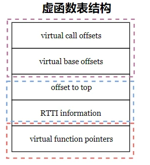
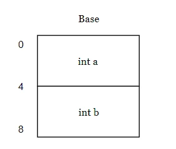
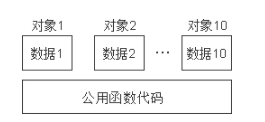
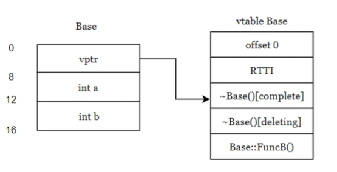
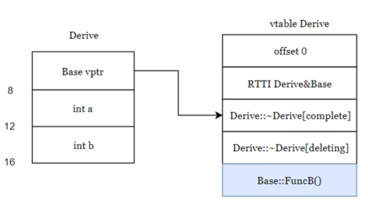
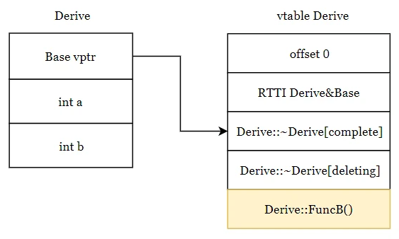
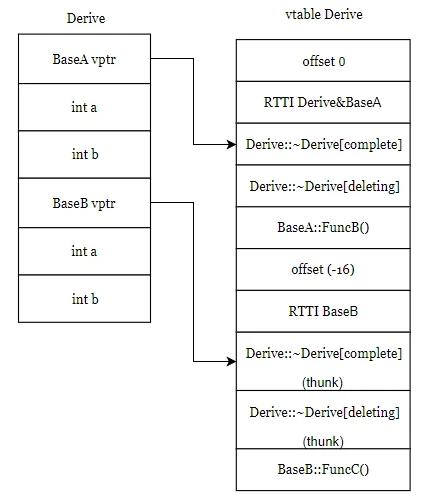
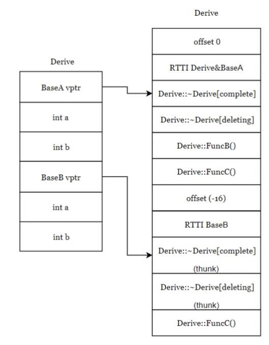
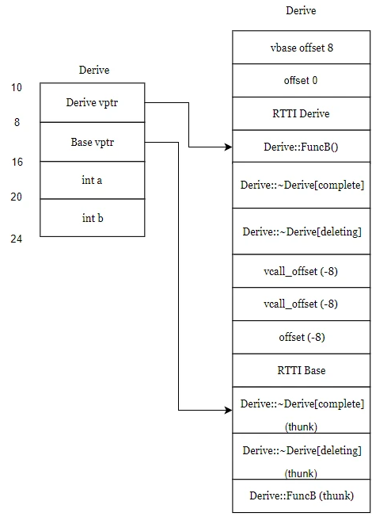
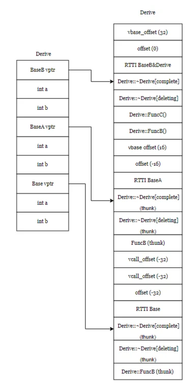

### C++

C++的class中，有两种数据成员(class data members)：
1. static
2. nonstatic,

三种类成员函数(class member functions)
1. static
2. nonstatic
3. virtual:

C++ 构造函数的执行顺序

1. 先执行**静态成员的构造函数**，但如果静态成员只是在类定义中声明了，而没有实现，是不用构造的。
2. 任何虚拟继承基类的构造函数按照它们被继承的顺序构造（不是初始化列表中的顺序）
3. 任何非虚拟继承基类的构造函数按照它们被继承的顺序构造（不是初始化列表中的顺序）
4. 任何**成员对象的构造函数**按照它们声明的顺序构造
5. 类自己的构造函数

注意以上都是为了构造子对象, 因为先调用的父类构造函数后调用子类构造函数, 因此子类变量排在父类变量后面

在没有虚函数的继承中,析构函数调用于构造函数顺序相反。

1. 执行自身的析构函数；
2. 执行成员变量的析构函数；
3. 执行父类的析构函数

注意自身析构函数和父类析构函数都是在析构子对象自己, 因为子对象有父类变量, 也有子类变量。

当使用虚函数的多态时, 也就是`Base* p = new Derive`。如果析构函数不是虚函数, 将直接调用父类的析构函数, 这时候是不需要析构子对象时(只有调用子类)。对于Derive对象而言父类成员析构了子类成员没有, 因此造成内存泄露。

而当析构函数是虚函数时, 析构函数存在于虚函数表中, 且已经被子类覆盖了。或者说p指向对象的虚函数指针指向Derive的虚函数表, 因此析构时执行子类析构而不是父类析构函数, 子类析构函数调用时会执行子类析构和父类析构, 从而保证Derive对象被析构干净。

我倾向于理解子类构造函数和析构函数扩充, 即子类构造函数包含了父类构造函数, 因此子对象自然而然包含了父类变量。



虚表结构，正常的虚表结构中都含有后三项，当有虚继承情况下会有前两个表项。

#### class中的域操作符::

注意在class中的函数可以使用::表示域操作, 例如

```cpp
class Derive : public Base{
public:
    Derive(){
        cout << "constructor Derive" <<endl;
    };
    ~Derive(){
        cout << "destructor Derive" <<endl;
    };

    void print() {
        cout << a<<endl;
        cout << Base::a<<endl; // 可以使用Base::a表示域内的a
        cout << Derive::a<<endl;
        cout << Derive::Base::a<<endl;// 子类Derive里面有域Base
    }

    int a;
};
```

此外namespace也是一个域。


<!-- more -->

#### typeid

C++中，为了支持RTTI提供了两个操作符：dynamic_cast和typeid

1. dynamic_cast允许运行时刻进行类型转换，从而使程序能够在一个类层次结构中安全地转化类型，与之相对应的还有一个非安全的转换操作符static_cast。

2. typeid是C++的关键字之一，等同于sizeof这类的操作符。typeid操作符的返回结果是名为type_info的标准库类型的对象的引用

```
type_info t1, t2
t1 == t2	如果两个对象t1和t2类型相同，则返回true
t.name()	返回类型的C-style字符串
```

```cpp
#include<iostream>  
#include <typeinfo>  
using namespace std;  

class Base{};
class Derived:public Base{};
void func1();
int func2(int n);

int main()  
{  
    int a = 10;
    int* b = &a;
    float c;
    double d;

    cout << typeid(a).name() << endl;
    cout << typeid(b).name() << endl;
    cout << typeid(c).name() << endl;
    cout << typeid(d).name() << endl;
    cout << typeid(Base).name() << endl;
    cout << typeid(Derived).name() << endl;
    cout << typeid(func1).name() << endl;
    cout << typeid(func2).name() << endl;
}  

输出
i
Pi
f
d
4Base
7Derived
FvvE
Fii

    Base* pb;
    Drived d;
    pb = &d;

    if(strcmp(typeid(*pb).name(), typeid(Base).name()) == 0)    // 判断pd为基类指针
    {
        cout << "this is Base" << endl;
    }
    else if(strcmp(typeid(*pb).name(), typeid(Drived).name()) == 0)
    {
        cout << "this is Drived" << endl;
    }
    
    if(strcmp(typeid(d).name(), typeid(Base).name()) == 0)
    {
        cout << "this is Base" << endl;
    }
    else if(strcmp(typeid(d).name(), typeid(Drived).name()) == 0)
    {
        cout << "this is Drived" << endl;
    }
输出
this is Base
this is Drived
```

不像Java、C#等动态语言，C++运行时能获取到的类型信息非常有限，标准也定义的很模糊。在实际工作中，我们一般只使用type_info的==运算符来判断两个类型是否相同。

### 普通对象模型

```cpp
class Base
{
struct Base {
    Base() = default;
    ~Base() = default;
    
    void Func() {}

    int a;
    int b;
};

int main() {
    Base a;
    return 0; 
}
```

这个普通结构体Base的大小为8字节，a占4个字节，b占4个字节。


而函数代码使用的存储空间是所有类的公用存储空间, 调用函数Func实际是从代码区找到`Base_Func`唯一名称的函数并调用之。



### 带有虚函数对象的布局

```cpp
struct Base {
    Base() = default;
    virtual ~Base() = default;
    
    void FuncA() {}

    virtual void FuncB() {
        printf("FuncB\n");
    }

    int a;
    int b;
};

int main() {
    Base a;
    return 0; 
}
```

该对象含有8字节的虚函数表指针, 以及8字节的数据变量, 共16字节。


虚函数表的结构

1. offset_to_top(0)：表示当前这个虚函数表地址距离对象顶部地址的偏移量，因为**对象的头部就是虚函数表的指针，所以偏移量为0**。

2. RTTI指针：指向存储运行时类型信息(type_info)的地址，用于运行时类型识别，**用于typeid和dynamic_cast**。

### 单继承下不含有覆盖函数的子类对象

```cpp
struct Base {
    Base() = default;
    virtual ~Base() = default;
    
    void FuncA() {}

    virtual void FuncB() {
        printf("Base FuncB\n");
    }

    int a;
    int b;
};

struct Derive : public Base{
};

int main() {
    Base a;
    Derive d;
    return 0; 
}
```

子对象没有覆盖父对象, 父子类的虚函数表是一样的, 虚函数指向子类的虚函数表。

子对象构造时自动获得父类的成员, 实际上编译器会将继承变为加上父类内容, 并扩充子类构造函数等。实际上编译器通过优化使子类达到具有父类成员变量, 调用父类构造函数的结果。



### 单继承下含有覆盖函数的子类对象

```cpp
struct Base {
    Base() = default;
    virtual ~Base() = default;
    void FuncA() {}
    virtual void FuncB() {
        printf("Base FuncB\n");
    }

    int a;
    int b;
};

struct Derive : public Base{
    void FuncB() override {
        printf("Derive FuncB \n");
    }
};

int main() {
    Base a;
    Derive d;
    return 0; 
}
```
子类覆盖父类, 父子类的虚函数表不一样, 子类虚指针指向子类的虚函数表。



虚函数表中有两个析构函数，一个标志为deleting，一个标志为complete，因为对象有两种构造方式，栈构造和堆构造，所以对应的实现上，对象也有两种析构方式


### 多继承下不含有覆盖函数的类对象

```cpp
struct BaseA {
    BaseA() = default;
    virtual ~BaseA() = default;
    
    void FuncA() {}

    virtual void FuncB() {
        printf("BaseA FuncB\n");
    }

    int a;
    int b;
};

struct BaseB {
    BaseB() = default;
    virtual ~BaseB() = default;
    
    void FuncA() {}

    virtual void FuncC() {
        printf("BaseB FuncC\n");
    }

    int a;
    int b;
};

struct Derive : public BaseA, public BaseB{
};

int main() {
    BaseA a;
    Derive d;
    return 0; 
}
```

这时候子类对象现有两个父类的内容, 然后才是自己的内容。

注意第二个`offset_to_top(-16)`：表示当前这个虚函数表（BaseB）地址距离对象顶部地址的偏移量，因为对象的头部就是虚函数表的指针，所以偏移量为-16。这时候子类的虚函数表包含两个父类的内容。



我们可以看到

### 多继承下含有覆盖函数的类对象

```cpp
struct BaseA {
    BaseA() = default;
    virtual ~BaseA() = default;
    
    void FuncA() {}

    virtual void FuncB() {
        printf("BaseA FuncB\n");
    }

    int a;
    int b;
};

struct BaseB {
    BaseB() = default;
    virtual ~BaseB() = default;
    
    void FuncA() {}

    virtual void FuncC() {
        printf("BaseB FuncC\n");
    }

    int a;
    int b;
};

struct Derive : public BaseA, public BaseB{
    void FuncB() override {
        printf("Derive FuncB \n");
    }

    void FuncC() override {
        printf("Derive FuncC \n");
    }
};

int main() {
    BaseA a;
    Derive d;
    return 0; 
}
```



### 虚继承

```cpp
struct Base {
    Base() = default;
    virtual ~Base() = default;
    
    void FuncA() {}

    virtual void FuncB() {
        printf("BaseA FuncB\n");
    }

    int a;
    int b;
};

struct Derive : virtual public Base{
    void FuncB() override {
        printf("Derive FuncB \n");
    }
};

int main() {
    Base a;
    Derive d;
    return 0; 
}
```

虚继承下，这里的对象布局和普通单继承有所不同，虚继承下子类对象会同时拥有`Derive vptr`和`Base vptr`，两个指针大小总和为16，再加上a和b的大小8，为24。第二个指针表示虚基类的指针。

执行构造函数时, 会先调用虚基类的构造函数构造出虚基类; 再调用普通父类构造函数构造父类, 最后才是本对象。

虚基类的作用是, 无论虚基类被继承多少次, 被继承对象只有一个虚基类。从而防止继承多个相同对象的混淆。




### 菱形继承下类对象

```cpp
struct Base {
    Base() = default;
    virtual ~Base() = default;
    
    void FuncA() {}

    virtual void FuncB() {
        printf("BaseA FuncB\n");
    }

    int a;
    int b;
};

struct BaseA : virtual public Base {
    BaseA() = default;
    virtual ~BaseA() = default;
    
    void FuncA() {}

    virtual void FuncB() {
        printf("BaseA FuncB\n");
    }

    int a;
    int b;
};

struct BaseB : virtual public Base {
    BaseB() = default;
    virtual ~BaseB() = default;
    
    void FuncA() {}

    virtual void FuncC() {
        printf("BaseB FuncC\n");
    }

    int a;
    int b;
};

struct Derive : public BaseB, public BaseA{
    void FuncB() override {
        printf("Derive FuncB \n");
    }

    void FuncC() override {
        printf("Derive FuncC \n");
    }
};

int main() {
    BaseA a;
    Derive d;
    return 0; 
}
```

注意, BaseA, BaseB 虚继承Base; Derive类public继承BaseA和BaseB。



事实上, BaseA, BaseB, Derive类都只含有一个Base vptr指向Base类, 且存在Base类的成员变量。虚拟继承从编译器层面保证Base vptr以下变量均只出现一次。

虚拟继承下，只有一个共享的基类Base被继承，而无论该基类在派生层次中出现多少次。共享的基类子对象被称为虚基类。在虚继承下，基类子对象的复制及由此而引起的二义性都被消除了。

vbase_offset：对象在对象布局中与指向虚基类虚函数表的指针地址的偏移量。