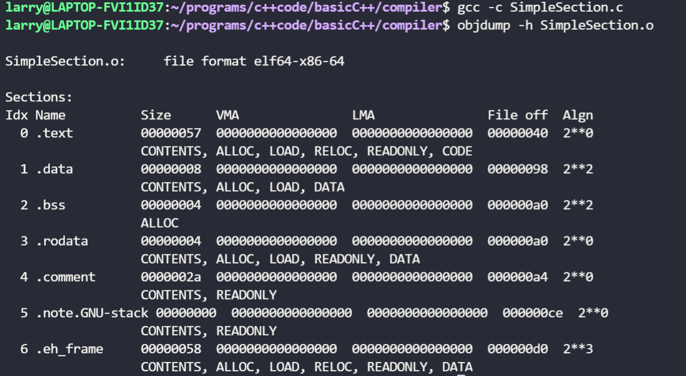
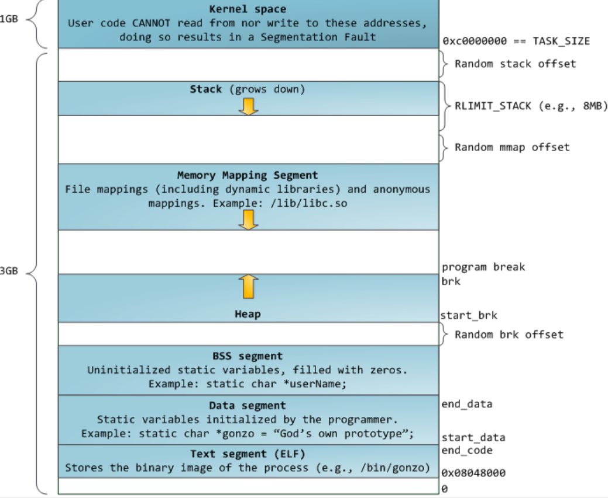
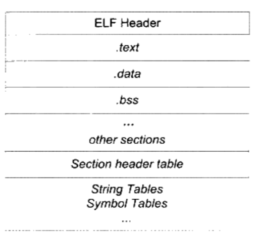
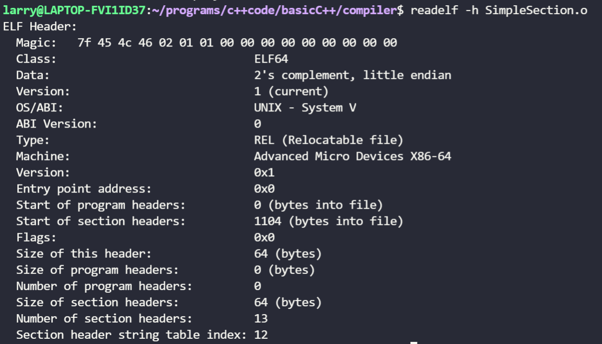
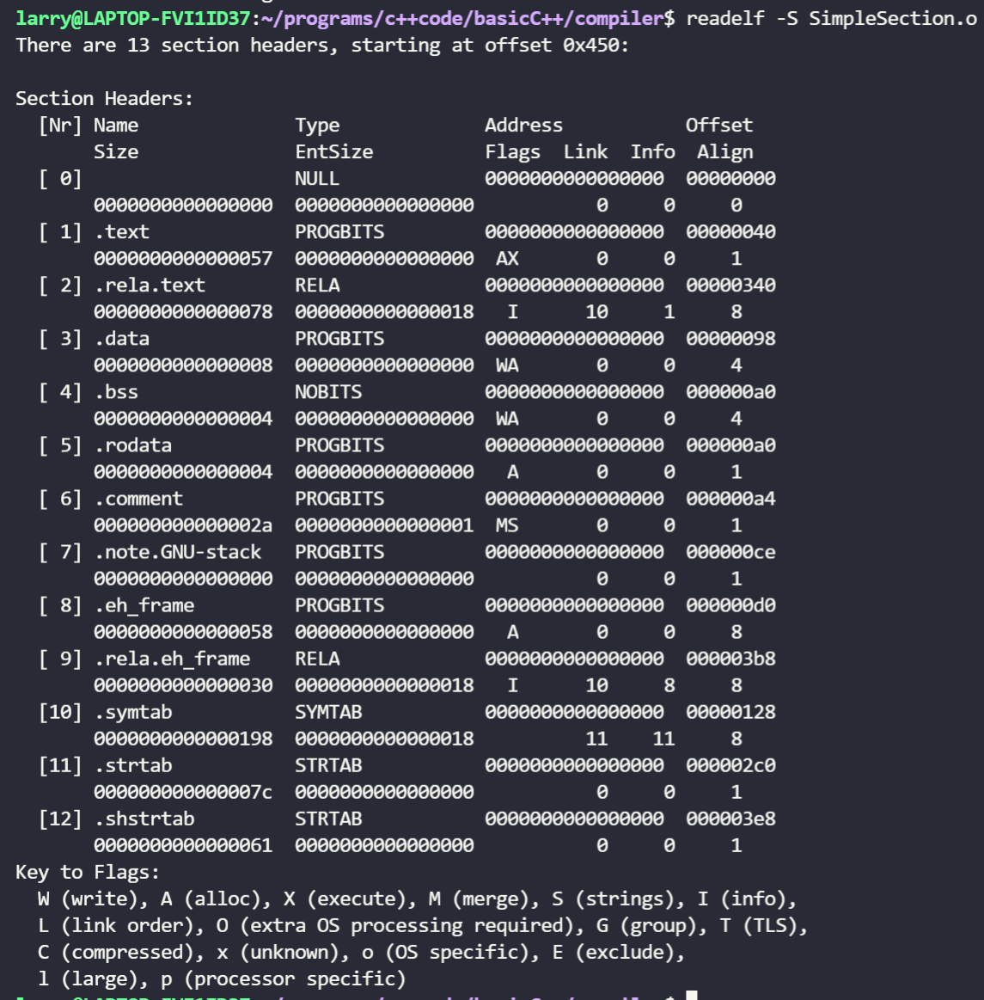

> 编译，链接，优化

### 目标文件

PC平台的可执行文件(Execute)格式, 主要是Windows下的PE(Portable Execute)和Linux的ELF(Executable Linkable Format), 它们都是COFF(Common File format)格式的编撰, 目标文件就是源代码编译后但未进行链接的那些中间文件(Windows下的.obj和Linux下的.o),它跟可执行文件内容结构很相似, 一般跟可执行文件格式采用一种格式存储, 动态链接库(DLL, Dynamic Linking Library)windows的.dll和linux的.so, 和静态链接库(static linking library)windows的.lib和linux的.a, 也都是按照可执行文件的格式存储。

以下面代码为例
```cpp
// SimpleSection.c
int printf(const char* format, ...);

int global_init_var = 84;
int global_uninit_var;

void func1( int i) {
    printf("%d\n", i);
}

int main() {
    static int static_var = 85;
    static int static_var2;

    int a = 1;
    int b;

    func1(static_var + static_var2 + a + b);

    return a;
}
```

可以使用`gcc -c SimpleSection.c`编译成目标文件SimpleSection.o, 之后使用`objdump -h SimpleSection.o`可以查看目标文件的结构。



以上可以看出目标文件可以分成几个段。

1. 代码段.text, C语言变成后执行的语句
2. .bss段, 存放未初始化的全局变量和局部静态变量。bss段方便在运行时为全局变量和静态变量开辟内存, bss中并没有内容, 只是为未初始化的全局变量和局部静态变量提供一个占位
3. .data段, 存放已初始化的全局变量和静态变量。

局部变量在运行时存放在进程地址空间的栈或者堆中。进程地址空间


4. .rodata段, 只读数据段, 存放常量, 例如字符串字面量, C++中的const修饰的常量也存放在这里。
5. .comment, 存放编译器版本等信息

#### ELF文件的结构

ELF文件的总体结构如下, 最前部是ELF文件头(ELF Header), 包含了整个文件的基本属性, 例如ELF文件版本，目标机器型号，程序入口地址等, 接下来就是.text.data等各个段; 之后在一些表， 包括段表(Section Header Table),字符串表, 符号表等。段表描述了ELF段的信息, 例如每个段的段名, 段的长度, 在文件的偏移, 读写权限等。


ELF文件头


段表


字符串表就是如上的.strtab, 用来存储ELF文件用到的字符串, 例如段名, 变量名等。因为字符串长度往往不固定, 使用固定结构存储比较困难, 所以常常把字符串存放到一个表中, 使用表中的偏移来引用字符串。

#### 符号表

符号表是链接的接口, 例如目标文件B要引用目标文件A的函数foo, 称目标文件A定义了foo, 目标文件B引用Reference了目标文件A的foo。在链接中将函数和变量统称为符号Symbol, 函数名或变量名就是符号名。

目标文件会有一个符号表 Symbol Table, 记录了目标文件所用到的符号。符号还有一个对应的符号值, 就是变或者函数的地址。符号可以分为
1. 定义在本目标文件的全局符号, 可以被其他目标文件引用, 
2. 本目标文件引用的全局符号, 没有定义在本目标文件中需要从外界引用, 称为外部符号External Symbol
3. 段名, 往往由编译器产生, 值就是该段的起始地址
4. 局部符号, 这类符号只在编译单元内部可见, 一般为static修饰的静态变量

引用外部符号需要保证这个外部符号在所有目标文件中名称唯一，不然会冲突。这样就有了符号修饰Name Decoration或符号改编Name Mangling的机制, 目的就是使符号名称变得复杂以保证唯一。

#### 强符号和弱符号

C/C++编译器默认函数和初始化的全局变量为强符号Strong Symbol, 未初始化的全局变量为弱符号Weak Symbol。强符号和弱符号都是针对定义来说的, 而不是针对引用。
1. 不允许强符号被多次定义(即不同的目标文件中不能有同名的强符号), 如果强符号被多次定义, 链接器会报符号重复定义错误
2. 如果一个符号在某个目标文件中是强符号, 在其他文件中是弱符号, 引用时会选择强符号
3. 如果一个符号在所有目标文件中都是强符号, 选择占用空间最大的一个。

一般的，链接时没有找到该符号的定义链接器会报符号未定义错误, 这种被称为强引用Strong Reference; 而对于弱引用Weak Reference, 符号未被定义链接器不会报错, 弱引用和弱符号主要用于库函数的链接过程。


### 编译优化
如果不指定优化标识的话，gcc就会产生可调试代码，每条指令之间将是独立的。可以在指令之间设置断点，使用gdb中的 p命令查看变量的值，改变变量的值等。并且把获取最快的编译速度作为它的目标。

当优化标识被启用之后, gcc编译器将会试图改变程序的结构(当然会在保证变换之后的程序与源程序语义等价的前提之下), 以满足某些目标, 如: 代码大小最小或运行速度更快(只不过通常来说, 这两个目标是矛盾的, 二者不可兼得)。

https://gcc.gnu.org/onlinedocs/gcc/Optimize-Options.html

http://www.fefe.de/source-code-optimization.pdf

-O，-O1：
这两个命令的效果是一样的，目的都是在不影响编译速度的前提下，尽量采用一些优化算法降低代码大小和可执行代码的运行速度。但但不执行需要消耗大量编译时间的优化。

<!-- more -->

```
-fauto-inc-dec 
-fbranch-count-reg 
-fcombine-stack-adjustments 
-fcompare-elim 
-fcprop-registers 
-fdce 
-fdefer-pop 
-fdelayed-branch 
-fdse 
-fforward-propagate 
-fguess-branch-probability 
-fif-conversion2 
-fif-conversion 
-finline-functions-called-once 
-fipa-pure-const 
-fipa-profile 
-fipa-reference 
-fmerge-constants 
-fmove-loop-invariants 
-freorder-blocks 
-fshrink-wrap 
-fshrink-wrap-separate 
-fsplit-wide-types 
-fssa-backprop 
-fssa-phiopt 
-fstore-merging 
-ftree-bit-ccp 
-ftree-ccp 
-ftree-ch 
-ftree-coalesce-vars 
-ftree-copy-prop 
-ftree-dce 
-ftree-dominator-opts 
-ftree-dse 
-ftree-forwprop 
-ftree-fre 
-ftree-phiprop 
-ftree-sink 
-ftree-slsr 
-ftree-sra 
-ftree-pta 
-ftree-ter 
-funit-at-a-time
```

-O2
该优化选项会牺牲部分编译速度，除了执行-O1所执行的所有优化之外，还会采用几乎所有的目标配置支持的优化算法，用以提高目标代码的运行速度。

```
-fthread-jumps 
-falign-functions  -falign-jumps 
-falign-loops  -falign-labels 
-fcaller-saves 
-fcrossjumping 
-fcse-follow-jumps  -fcse-skip-blocks 
-fdelete-null-pointer-checks 
-fdevirtualize -fdevirtualize-speculatively 
-fexpensive-optimizations 
-fgcse  -fgcse-lm  
-fhoist-adjacent-loads 
-finline-small-functions 
-findirect-inlining 
-fipa-cp 
-fipa-cp-alignment 
-fipa-bit-cp 
-fipa-sra 
-fipa-icf 
-fisolate-erroneous-paths-dereference 
-flra-remat 
-foptimize-sibling-calls 
-foptimize-strlen 
-fpartial-inlining 
-fpeephole2 
-freorder-blocks-algorithm=stc 
-freorder-blocks-and-partition -freorder-functions 
-frerun-cse-after-loop  
-fsched-interblock  -fsched-spec 
-fschedule-insns  -fschedule-insns2 
-fstrict-aliasing -fstrict-overflow 
-ftree-builtin-call-dce 
-ftree-switch-conversion -ftree-tail-merge 
-fcode-hoisting 
-ftree-pre 
-ftree-vrp 
-fipa-ra
```

-O3
该选项除了执行-O2所有的优化选项之外，一般都是采取很多向量化算法，提高代码的并行执行程度，利用现代CPU中的流水线，Cache等。这个选项会提高执行代码的大小，当然会降低目标代码的执行时间。

```
-finline-functions      // 采用一些启发式算法对函数进行内联
-funswitch-loops        // 执行循环unswitch变换
-fpredictive-commoning  // 
-fgcse-after-reload     //执行全局的共同子表达式消除
-ftree-loop-vectorize　  // 
-ftree-loop-distribute-patterns
-fsplit-paths 
-ftree-slp-vectorize
-fvect-cost-model
-ftree-partial-pre
-fpeel-loops 
-fipa-cp-clone options
```

-Og:
该标识会精心挑选部分与-g选项不冲突的优化选项，当然就能提供合理的优化水平，同时产生较好的可调试信息和对语言标准的遵循程度。
-Og可能会带来更好的调试体验。

```
-g0：不生成调试信息，相当于没有使用-g；
-g1：生成最小的调试信息，足够在不打算调试的程序中进行堆栈查看。最小调试信息包括函数描述，外部变量，行数表，但不包括局部变量信息。
-g2：默认-g的调试级别；
-g3：相对-g，生成额外的信息，例如所有的宏定义；
```


#### 编译优化

1. 能在编译阶段（compile time）做的工作，就不要在程序运行时（runtime）做。例如Constant Propagation & Constant Folding 

```
int ticks = 32768*15;  直接在编译期变成
int ticks = 491520; 而不是等到运行期
```

2. 对循环优化，优化，再优化