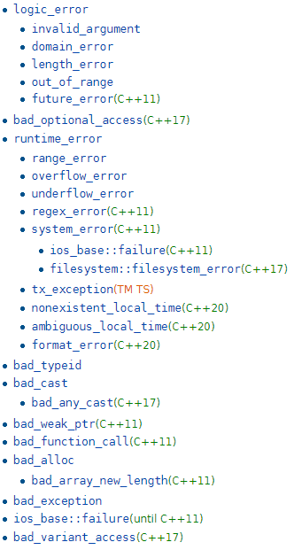

### 模板

#### 常用

auto 

decltype

constexpr

#### export和extern template

extern template和正常情况下的extern引用外部变量是一样的。 使用这种声明可以防止`fun`在不同编译单元的多次实例化导致的代码重复。

```cpp
// test.h
template <typename T> 
void fun(T) 
{ }

// test1.cpp
#include "test.h"
template void fun<int>(int); // 显式地实例化 
void test1()
{ 
    fun(1);
}

#include "test.h"
extern template void fun<int>(int); // 外部模板的声明
void test2()
{
    fun(2);
}
```

<!-- more -->

#### std::conditional

一种条件判断的模板元
```cpp
template< bool B, class T, class F >
struct conditional;
(since C++11)

type	T if B == true, F if B == false
```

Provides member typedef type, which is defined as T if B is true at compile time, or as F if B is false.

```cpp
#include <stdio.h>
#include <type_traits>
using namespace std;

class cool{
public:
  cool(){ printf("Cool!\n");  }
};

class notcool{
public:
  notcool(){ printf("Not cool!\n");  }
};

template<int N>
class myclass{
public:
  typedef typename std::conditional<N==5,cool,notcool>::type thetype;   // 声明类型用typedef typename
  thetype theinst;
};

int main(){
  printf("Testing\n");
  myclass<5> myc5;
  myclass<6> myc6;
  printf("Done testing\n");
  return 0; 
} 
输出
Testing
Cool!
Not cool!
Done testing
```

#### std::tuple和std::tie

tuple可以使用初始化列表进行赋值, 并使用get<常量表达式>(tuple_name)来访问或修改tuple的元素

```cpp
tuple<int,double,string> t3 = {1, 2.0, "3"};

get<0>(t3) = 4;
cout << get<1>(t3) << endl;
```

std::tie会将变量的引用整合成一个tuple, std::ignore忽略某些tuple中的某些返回值
```cpp
int i; double d; string s;
tie(i, d, s) = t3;

cout << i << " " << d << " " << s << endl;

tie(i, ignore, s) = t3;
```

```cpp
#include <tuple>
#include <iostream>
#include <string>
#include <stdexcept>
 
std::tuple<double, char, std::string> get_student(int id)
{
    if (id == 0) return std::make_tuple(3.8, 'A', "Lisa Simpson");
    if (id == 1) return std::make_tuple(2.9, 'C', "Milhouse Van Houten");
    if (id == 2) return std::make_tuple(1.7, 'D', "Ralph Wiggum");
    throw std::invalid_argument("id");
}
 
int main()
{
    auto student0 = get_student(0);
    std::cout << "ID: 0, "
              << "GPA: " << std::get<0>(student0) << ", "
              << "grade: " << std::get<1>(student0) << ", "
              << "name: " << std::get<2>(student0) << '\n';
 
    double gpa1;
    char grade1;
    std::string name1;
    // 基于std::tie获取std::tuple<double, char, std::string>
    std::tie(gpa1, grade1, name1) = get_student(1);
    std::cout << "ID: 1, "
              << "GPA: " << gpa1 << ", "
              << "grade: " << grade1 << ", "
              << "name: " << name1 << '\n';
 
    // C++17 structured binding:
    auto [ gpa2, grade2, name2 ] = get_student(2);
    std::cout << "ID: 2, "
              << "GPA: " << gpa2 << ", "
              << "grade: " << grade2 << ", "
              << "name: " << name2 << '\n';
}
```

#### std::enable_if 条件类型

```cpp
template <bool B, class T = void>
using enable_if_t = typename std::enable_if<B, T>::type;  // 如果B值为true则取T::type
```

If B is true, std::enable_if has a public member typedef type, equal to T; otherwise, there is no member typedef.

#### std::reference_wrapper

std::reference_wrapper is a class template that wraps a reference in a copyable, assignable object. It is frequently used as a mechanism to store references inside standard containers (like std::vector) which cannot normally hold references. 将复制元素转为复制元素的引用(即持有元素的引用)

std::reference_wrapper看成一种引用类型更好, 例如`<std::reference_wrapper<int>`一定意义上可以视作int&

```cpp
#include <algorithm>
#include <list>
#include <vector>
#include <iostream>
#include <numeric>
#include <random>
#include <functional>
 
void print(auto const rem, std::ranges::range auto const& v) {
    for (std::cout << rem; auto const& e : v)
        std::cout << e << ' ';
    std::cout << '\n';
}
 
int main()
{
    std::list<int> l(10);
    std::iota(l.begin(), l.end(), -4);  //std::itoa Fills the range [first, last) with sequentially increasing values
 
    // can't use shuffle on a list (requires random access), but can use it on a vector
    std::vector<std::reference_wrapper<int>> v(l.begin(), l.end());  // 创建的v中, 每个元素持有l对应元素的引用
 
    std::ranges::shuffle(v, std::mt19937{std::random_device{}()});  // 洗牌
 
    print("Contents of the list: ", l);
    print("Contents of the list, as seen through a shuffled vector: ", v);
 
    std::cout << "Doubling the values in the initial list...\n";
    std::ranges::for_each(l, [](int& i) { i *= 2; });
 
    print("Contents of the list, as seen through a shuffled vector: ", v);
}

输出
Contents of the list: -4 -3 -2 -1 0 1 2 3 4 5 
Contents of the list, as seen through a shuffled vector: -1 2 -2 1 5 0 3 -3 -4 4 
Doubling the values in the initial list...
Contents of the list, as seen through a shuffled vector: -2 4 -4 2 10 0 6 -6 -8 8
```

#### std::ref, std::cref

Function templates ref and cref are helper functions that generate an object of type std::reference_wrapper. 针对输入的元素, 返回该元素的引用类型 

```cpp
template< class T >
std::reference_wrapper<T> ref( T& t ) noexcept;


#include <functional>
#include <iostream>
 
void f(int& n1, int& n2, const int& n3)
{
    std::cout << "In function: " << n1 << ' ' << n2 << ' ' << n3 << '\n';
    ++n1; // increments the copy of n1 stored in the function object
    ++n2; // increments the main()'s n2
    // ++n3; // compile error
}
 
int main()
{
    int n1 = 1, n2 = 2, n3 = 3;
    std::function<void()> bound_f = std::bind(f, n1, std::ref(n2), std::cref(n3));
    n1 = 10;
    n2 = 11;
    n3 = 12;
    std::cout << "Before function: " << n1 << ' ' << n2 << ' ' << n3 << '\n';
    bound_f();
    std::cout << "After function: " << n1 << ' ' << n2 << ' ' << n3 << '\n';
}

输出
Before function: 10 11 12
In function: 1 11 12
After function: 10 12 12
```

#### std::declval

```cpp
template <class T>
  typename add_rvalue_reference<T>::type declval() noexcept;
```

Returns an rvalue reference to type T without referring to any object.

```cpp
#include <utility>      // std::declval
#include <iostream>     // std::cout

struct A {              // abstract class
  virtual int value() = 0;
};

class B : public A {    // class with specific constructor
  int val_;
public:
  B(int i,int j):val_(i*j){}
  int value() {return val_;}
};

int main() {
  decltype(std::declval<A>().value()) a;  // int a
  decltype(std::declval<B>().value()) b;  // int b
  decltype(B(0,0).value()) c;   // same as above (known constructor)
  a = b = B(10,2).value();
  std::cout << a << '\n';
  return 0;
}
```

### 类

#### override

In a member function declaration or definition, override specifier ensures that the function is virtual and is overriding a virtual function from a base class. 虚函数实现使用

```cpp
#include <iostream>

struct A
{
    virtual void foo();
    void bar();
    virtual ~A();
};
 
// member functions definitions of struct A:
void A::foo() { std::cout << "A::foo();\n"; }
A::~A() { std::cout << "A::~A();\n"; }
 
struct B : A
{
//  void foo() const override; // Error: B::foo does not override A::foo
                               // (signature mismatch)
    void foo() override {
        std::cout << "B::foo();\n";
    }; // OK: B::foo overrides A::foo
//  void bar() override; // Error: A::bar is not virtual
    ~B() override; // OK: `override` can also be applied to virtual
                   // special member functions, e.g. destructors
    void override(); // OK, member function name, not a reserved keyword
};
 
// member functions definitions of struct B:
B::~B() { std::cout << "B::~B();\n"; }
void B::override() { std::cout << "B::override();\n"; }
 
int main() {
    B b;
    b.foo();
    b.override(); // OK, invokes the member function `override()`
    int override{42}; // OK, defines an integer variable
    std::cout << "override: " << override << '\n';
}

输出
B::foo();
B::override();
override: 42
B::~B();
A::~A();
```

#### enable_shared_from_this

智能指针的场景之一是把`this`指针包裹成一个`shared_ptr`传递到其他函数中。这时候不能简单粗暴 的用 this 指针构造一个 shared_ptr，因为那样做会导致两个独立的 shared_ptr 对象指向同 一份资源, 这时候析构时可能导致重复析构。我们希望只是一个shared_ptr对象指向目标对象, 函数持有的是shared_ptr的多个引用。shared_ptr多一个引用, 引用计数就会+1。

正确的使用方式是继承来自 `std::enable_shared_from_this`，然后调用它的 `shared_from_this` 成员函数

```cpp
class Widget : public std::enable_shared_from_this<Widget> {
    std::shared_ptr<Widget> GetPtr() {
        return shared_from_this();  // 这样在已经由shared_ptr<Widget>基础上, 只会让其引用次数+1, 不会产生新的shared_ptr对象维护Widget

        // return shared_ptr<Widget>(this);     // 这样导致多个shared_ptr指向对象
    }
};

int main() {
    auto widget_ = std::make_shared<Widget>();

    widget_->GetPtr();  // 正确

    Widget* ptr = new Widget;
    ptr->GetPtr();  // 错误, 使用shared_from_this之前必须保证this对象已经被shared_维护了
}
```

#### enum class

Unscoped enumerations 无范围枚举

```cpp
enum Color { red, green, blue };
Color r = red;
 
switch(r)
{
    case red  : std::cout << "red\n";   break;
    case green: std::cout << "green\n"; break;
    case blue : std::cout << "blue\n";  break;
}

enum color { red, yellow, green = 20, blue };
color col = red;
int n = blue; // n == 21
```

Scoped enumerations

```cpp
enum class Color { red, green = 20, blue };
Color r = Color::blue;
 
switch(r)
{
    case Color::red  : std::cout << "red\n";   break;
    case Color::green: std::cout << "green\n"; break;
    case Color::blue : std::cout << "blue\n";  break;
}
 
// int n = r; // error: no implicit conversion from scoped enum to int
int n = static_cast<int>(r); // OK, n = 21
```


#### using

Type alias, alias template。using相比于typedef优势在于using可以使用模板编译操作

举例
```cpp
#include <string>
#include <ios>
#include <type_traits>
 
// type alias, identical to
// typedef std::ios_base::fmtflags flags;
using flags = std::ios_base::fmtflags;
// the name 'flags' now denotes a type:
flags fl = std::ios_base::dec;
 
// type alias, identical to
// typedef void (*func)(int, int);
using func = void (*) (int, int);
// the name 'func' now denotes a pointer to function:
void example(int, int) {}
func f = example;
 
// alias template
template<class T>
using ptr = T*; 
// the name 'ptr<T>' is now an alias for pointer to T
ptr<int> x;
 
// type alias used to hide a template parameter 
template<class CharT>
using mystring = std::basic_string<CharT, std::char_traits<CharT>>;
```


#### std::function和std::bind
```
template< class R, class... Args >
class function<R(Args...)>;

template< class F, class... Args >
/*unspecified*/ bind( F&& f, Args&&... args );
```

`std::bind`十分强大, 主要在于其可以绑定几乎所有函数, 包括类成员函数。这样如果函数的形参为`std::function<void()>`, 意味着借助std:bind可以输入任何函数作参数。bind本身是一种延迟计算的思想，它本身可以绑定普通函数、全局函数、静态函数、类静态函数甚至是类成员函数。

```cpp
#include <functional>
#include <iostream>
 
struct Foo {
    Foo(int num) : num_(num) {}
    void print_add(int i) const { std::cout << num_+i << '\n'; }
    int num_;
};
 
void print_num(int i)
{
    std::cout << i << '\n';
}
 
struct PrintNum {
    void operator()(int i) const
    {
        std::cout << i << '\n';
    }
};
 
int main()
{
    // store a free function 绑定函数
    std::function<void(int)> f_display = print_num;
    f_display(-9);
 
    // store a lambda 绑定lambda表达式
    std::function<void()> f_display_42 = []() { print_num(42); };
    f_display_42();
 
    // store the result of a call to std::bind
    std::function<void()> f_display_31337 = std::bind(print_num, 31337);
    f_display_31337();
 
    // store a call to a member function
    std::function<void(const Foo&, int)> f_add_display = &Foo::print_add;
    const Foo foo(314159);
    f_add_display(foo, 1);
    f_add_display(314159, 1);
 
    // store a call to a data member accessor
    std::function<int(Foo const&)> f_num = &Foo::num_;
    std::cout << "num_: " << f_num(foo) << '\n';
 
    // store a call to a member function and object
    using std::placeholders::_1;
    std::function<void(int)> f_add_display2 = std::bind( &Foo::print_add, foo, _1 );
    f_add_display2(2);
 
    // store a call to a member function and object ptr
    std::function<void(int)> f_add_display3 = std::bind( &Foo::print_add, &foo, _1 );
    f_add_display3(3);
 
    // store a call to a function object
    std::function<void(int)> f_display_obj = PrintNum();
    f_display_obj(18);
```

```cpp
struct Foo {
    void print_sum(int n1, int n2)
    {
        std::cout << n1/n2 << '\n';
    }
    int data = 10;
};
int main() 
{
    Foo foo;
    //auto f = std::bind(&Foo::print_sum, &foo, std::placeholders::_2, std::placeholders::_1);
    function<void(int, int)> f = std::bind(&Foo::print_sum, &foo, std::placeholders::_2, std::placeholders::_1);
    f(5,10); // 2
}
```

注意std::bind的占位符`std::placeholders::_1`, `std::placeholders::_2`分别对应着`int n1`, `int n2`。因此f(5,10)实际上是`print_sum(10,5)`。

另外function的模板参数`void(int, int)`表示返回类型为void, 参数为int, int类型。

#### static_assert

Performs compile-time assertion checking.

```cpp
static_assert ( bool-constexpr , message )		(since C++11)

static_assert(03301 == 1729); // since C++17 the message string is optional
 
template <class T>
void swap(T& a, T& b) noexcept
{
    static_assert(std::is_copy_constructible_v<T>,
                  "Swap requires copying");
    static_assert(std::is_nothrow_copy_constructible_v<T> &&
                  std::is_nothrow_copy_assignable_v<T>,
                  "Swap requires nothrow copy/assign");
    auto c = b;
    b = a;
    a = c;
}
```

### 转型

#### static_cast

该运算符把expression转换为type-id类型，但没有运行时类型检查来保证转换的安全性。它主要有如下几种用法：
1. 用于类层次结构中基类和子类之间指针或引用的转换; 进行向上转型（把子类的指针或引用转换成基类表示）是安全的; 进行向下转型（把基类指针或引用转换成子类表示）时，由于没有动态类型检查，所以是不安全的。
2. 用于基本数据类型之间的转换。如把int转换成char，把int转换成enum。这种转换的安全性也要开发人员来保证。
3. static_cast也支持const类型转为非const类型
3. 把空指针转换成目标类型的空指针。
4. 把任何类型的表达式转换成void类型。

```cpp
   const int a = 3;
   int aa = static_cast<int> (a);
   cout << ++aa<<endl;
```

#### dynamic_cast
主要用于执行"安全的向下转型(safe down casting)。类层次间进行上行转换时, dynamic_cast和static_cast的效果是一样的; 在进行下行转换时, dynamic_cast具有类型检查的功能, 比static_cast更安全。

#### reinpreter_cast
`reinpreter_cast<type-id> (expression)`

type-id必须是一个指针、引用、算术类型、函数指针或者成员指针。它可以把一个指针转换成一个整数，也可以把一个整数转换成一个指针

#### const_cast

const_cast可以进行const指针和引用与非const之间的转换, 但注意输入和转换类型必须为指针或引用。

```cpp
const int constant = 21;
const int& const_p = constant;
int& modifier = const_cast<int&>(constant);
modifier = 7;
cout << const_p<<endl;
cout << constant<<endl;
输出
7
21
```
但是注意使用了const_cast只能进行const指针或引用的转换, 对于指向的值不可修改。单纯的const值转换可以用`static_cast`, 但是这与const只读特征并不冲突。

### constexpr

const只表示read only的语义, 只保证了运行时不可以被修改，但它修饰的仍然有可能是个动态变量。而constexpr修饰的才是真正的常量，它会在编译期间就会被计算出来，整个运行过程中都不可以被改变。但在使用上const修饰变量和constexpr基本一样。

constexpr可以用于修饰函数，这个函数的返回值会尽可能在编译期间被计算出来当作一个常量(模板元编程)，但是如果编译期间此函数不能被计算出来，那它就会当作一个普通函数被处理

```cpp
constexpr int func(int i) {
   return i + 1;
}

int main() {
   int i = 2;
   func(i);// 普通函数
   func(2);// 编译期间就会被计算出来
}
```

#### 多线程

<atomic>

<condition_variable>

<future>

<mutex>

<thread>


### 协程Coroutine

无论是进程还是线程, 都需要CPU的调度, 由此会产生上下文的切换开销。协程类似于CPU只会执行一个进程或者线程, 而这个线程包含若干子任务, 用协程表示。其中用户可以调度当其中一个子任务阻塞换个子任务执行, 其实CPU一直在执行这个线程, 没有多线程冲突和上下文切换等问题, 只是调度从CPU调度到了用户手上。

这样的协程不需要多线程的锁机制，因为只有一个线程，也不存在同时写变量冲突，在协程中控制共享资源不加锁，只需要判断状态就好了，所以执行效率比多线程高很多。

```cpp
#include <iostream>
#include <boost/coroutine2/all.hpp>

void coroutine_function(boost::coroutines2::coroutine<void>::pull_type & coro_back)
{
    std::cout << "a ";
    coro_back(); // 锚点，返回换一个任务执行
    std::cout << "b ";
    coro_back(); //锚点 返回
    std::cout << "c ";
}

int main()
{
    boost::coroutines2::coroutine<void>::push_type coroutine_object(coroutine_function); 	// 创建协程
    std::cout << "1 ";
    coroutine_object(); // 运行协程
    std::cout << "2 ";
    coroutine_object(); // 返回锚点，换个协程运行
    std::cout << "3 ";
    coroutine_object(); // 返回锚点，换个协程运行
    return 0;
}

g++ coroutine_test.cc -lboost_coroutine -lboost_context -o test
```

### except 异常 #include<exception>

关于C++异常要不要抛是没有定论的问题, 写程序时显然尽量考虑多种情况, 多种处理。如果程序流执行问题, 一种方式是终止执行返回错误码, 例如系统调用通过errno来表示系统调用是否执行成功, 如果失败是什么类型的失败。

如果抛出异常而无法处理, 造成程序终止, 这种异常不如不抛, 因为一个程序写了异常处理`try catch`是需要增大运行开销的, 不如设置程序出现异常直接终止来的直接。这也是`noexcept`关键字, 一旦出现异常程序直接终止, 换来C++更高的运行效率。

但对于可能抛异常的程序还是不要用`noexcept`关键字了, 至少或多或少能进行一些处理。一个可行的方式是, 将所有的执行异常送入到一个异常处理程序统一处理。

设置noexcept可以确定异常离开函数体的行为是确定的调用terminate，异常处理本身十分困难也没有啥能处理, 尽量少用异常处理, 因为你以为处理了实际上没有。直接炸掉改代码乃为上策。

```cpp
#include <exception>
#include <iostream>

using namespace std;

void Throw()
{
    throw exception();
}

void NoBlockThrow()
{ Throw(); }

void BlockThrow() noexcept{ Throw(); }

int main()
{
    try {
        Throw();
    }
    catch(...) 
    {
        cout << "Found throw."<< endl; // Found throw
    }
    
    try {
        NoBlockThrow();
    }
    catch(...) 
    {
        cout << "Throw is notblocked" <<endl;
    }
    
    try {
        BlockThrow();   // 直接终止, 不捕获异常
    }
    catch(...) {
        cout << "Found throw1" << endl;
    }
    return 0;
}

输出
Found throw.
Throw is notblocked
terminate called after throwing an instance of 'std::exception'
  what():  std::exception
Aborted
```

#### 关于异常

"异常"并不是你用ftp下载文件结果却得了个"密码错误"的提示。那是你程序必须正确处理的正常情况。类似的，如果你实现tcp协议栈，那么收到DUP报文、报文顺序错乱、报文丢失等等，它们也不是异常。一切在你的软件的工作场景里本应提前想到、提前设置逻辑做好处理的不同分支，它们都不是异常。

你打开自己程序的配置文件，它应该是ini格式的；结果里面一堆乱码……那么，千万别往下执行了，这是异常。因为你完全不明白为什么会出现这种状况。你应该什么都别碰、什么都别改变，马上抛个异常出去——否则，胡乱存储配置信息的你很可能就成了帮凶，把某个重要文件/系统文件破坏了。

如果你应该知道而且的确知道它是什么原因引起的、也知道应该如何处理（甚至被任务安排者指定处理），那么它就不是异常，你就必须自己写程序处理；反之，如果你不知道为什么会出现这种情况、或者虽然知道（比如网络断连）但你并没有权限提醒用户(比如你是写网络层驱动的，用户界面不在你这里)、也不知道该如何恢复，那么这就是异常。

确定了什么是异常，你就要用合理的方式抛出异常，且一定要把详细的、足够你的调用者分辨原因的信息附加进去，不能笼统的抛个随便装什么都可以的"口袋异常"。胡乱捕捉异常、又不按规则重新抛出，导致调用栈失去跟踪, 甚至逻辑错乱（硬着头皮处理你没有完全搞清楚的异常），再想解决可就难了。

异常需要权衡, 当不抛出异常可能造成较大的开发代价时, 还是抛异常吧。但**切记析构函数不能抛出异常**




```cpp
#include <limits>
#include <iostream>
#include <exception>

using namespace std;

void MyFunc(int c)
{
    if (c > numeric_limits< char> ::max())
        throw invalid_argument("MyFunc argument too large.");
}

int main()
{
    try{
        MyFunc(256); //cause an exception to throw
    }

    catch (invalid_argument& e){
        cerr << e.what() << endl;
    }
    MyFunc(10);
    MyFunc(128);
    //...
    return 0;
}
输出
MyFunc argument too large.
terminate called after throwing an instance of 'std::invalid_argument'
  what():  MyFunc argument too large.
Aborted
```

标准库异常不用捕获2333，因为也处理不了

#### static_assert和assert

编译器在遇到一个`static_assert`语句时，通常立刻进行常量表达式演算，但如果该常量表达式依赖于某些模板参数，则延迟到模板实例化时再进行演算，这就让检查模板参数成为了可能。因此建议多使用`static_assert`。

既然static_assert进行常量表达式, 因此必须使常量而不能加入变量。assert是运行期断言，它用来发现运行期间的错误，对性能是有影响的，所以经常在release版本中，assert都会被关掉, 只在debug模式有效。

```cpp
constexpr const int kStackBufferSize = 512;
char stack_buffer[kStackBufferSize];
static_assert(sizeof(stack_buffer) == static_cast<size_t>(kStackBufferSize),
                "sizeof(char) is expected to be 1 in C++");

assert(buffer_offset <= 28 + kMaxThreadIdSize);
static_assert(28 + kMaxThreadIdSize < kStackBufferSize,
                     "stack-allocated buffer may not fit the message header");
assert(buffer_offset < buffer_size);
```