> 调试的问题主要是, 内存泄露, 段错误coredump, 多线程运行竞态问题

### core dump 查看段错误

core dump又叫核心转储, 当程序运行过程中发生异常, 程序异常退出时, 由操作系统把程序当前的内存状况存储在一个core文件中, 叫core dump。(linux中如果内存越界会收到SIGSEGV信号，然后就会core dump)。在程序运行的过程中，有的时候我们会遇到Segment fault(段错误)这样的错误。这种看起来比较困难，因为没有任何的栈、trace信息输出。该种类型的错误往往与指针操作相关。往往可以通过这样的方式进行定位。

#### 产生core dump的可能原因

1. 内存访问越界
a. 使用错误的下标，导致数组访问越界

b. 使用strcpy, strcat, sprintf, strcmp, strcasecmp等字符串操作函数，将目标字符串读/写爆。应该使用strncpy, strlcpy, strncat, strlcat, snprintf, strncmp, strncasecmp等函数防止读写越界。

2. 多线程程序使用了非法指令,获调用了abort()函数

3. 多线程读写的数据未加锁保护。对于会被多个线程同时访问的全局数据，应该注意加锁保护，否则很容易造成core dump

4. 非法指针
a. 使用空指针

b. 随意使用指针转换。一个指向一段内存的指针，除非确定这段内存原先就分配为某种结构或类型，或者这种结构或类型的数组，否则不要将它转换为这种结构或类型的指针，而应该将这段内存拷贝到一个这种结构或类型中，再访问这个结构或类型。这是因为如果这段内存的开始地址不是按照这种结构或类型对齐的，那么访问它时就很容易因为bus error而core dump.

c. 堆栈溢出.不要使用大的局部变量（因为局部变量都分配在栈上），这样容易造成堆栈溢出，破坏系统的栈和堆结构，导致出现莫名其妙的错误。

#### 配置使程序产生core文件

通过`ulimit -c`或`ulimit -a`，可以查看core file大小的配置情况，如果为0，则表示系统关闭了dump core。
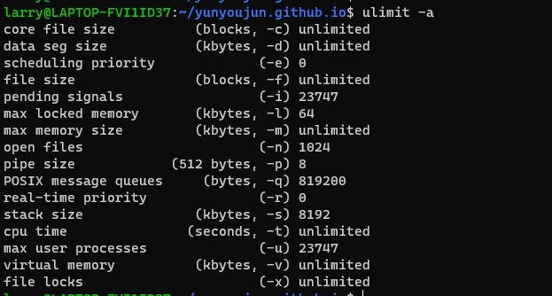

打开方法
1. 终端shell输入, ulimit -c unlimited　　（只对当前shell进程有效）
2. 在~/.bashrc　的最后加入： ulimit -c unlimited （一劳永逸）

以下列出几种信号，它们在发生时会产生 core dump:

```
SIGQUIT	Core	Quit from keyboard
SIGILL	Core	Illegal Instruction
SIGABRT	Core	Abort signal from abort
SIGSEGV	Core	Invalid memory reference
SIGTRAP	Core	Trace/breakpoint trap

# 还有
SIGBUS
SIGFPE
SIGSYS
SIGXCPU
SIGXFSZ
SIGIOT
```

我们使用 Ctrl+z 来挂起一个进程或者 Ctrl+C 结束一个进程均不会产生 core dump，因为前者会向进程发出 SIGTSTP 信号，该信号的默认操作为暂停进程（Stop Process）；后者会向进程发出SIGINT 信号，该信号默认操作为终止进程（Terminate Process）。

<!-- more -->

#### 调试core dump文件
Linux 中可以使用 GDB 来调试 core 文件，步骤如下：
1. 使用 gcc 编译源文件，加上 -g 以增加调试信息；
2. 打开系统产生 core dump 以使程序异常终止时能生成 core 文件；
3. 运行程序，当core dump 之后，使用命令 gdb program core 来查看 core 文件，其中 program 为可执行程序名，core 为生成的 core 文件名。

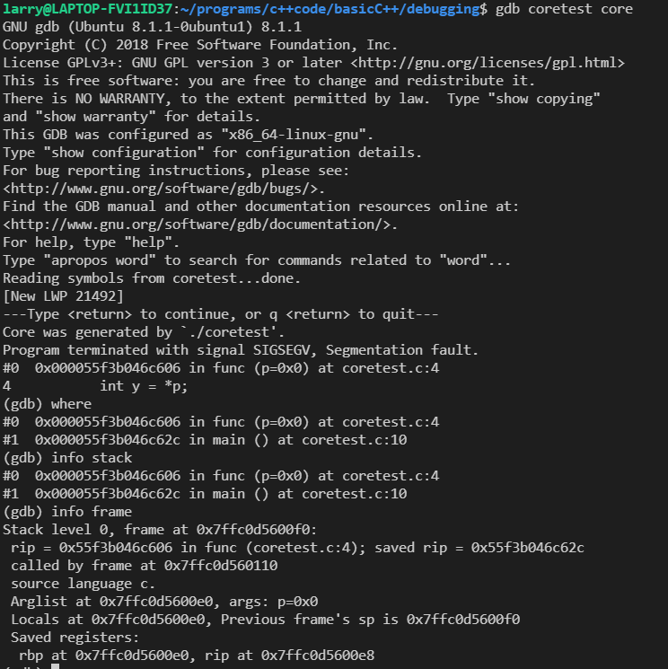

### Valgrind 查看内存泄露

Valgrind 可以用来检测程序是否有非法使用内存的问题，例如访问未初始化的内存、访问数组时越界、忘记释放动态内存等问题。需要注意Valgrind应该和内核版本匹配，低版本Valgrind可能不适用高版本内核。

从`https://valgrind.org/downloads/current.html`下载然后
```
./configure && make
sudo make install
```

#### 检测内存泄露
测试程序
```cpp
#include <stdlib.h>
int main()
{
    int *array = malloc(sizeof(int));
    return 0;
}
```
执行
```
gcc -g -o mleak mleak.c
valgrind --tool=memcheck --leak-check=full  ./mleak
```
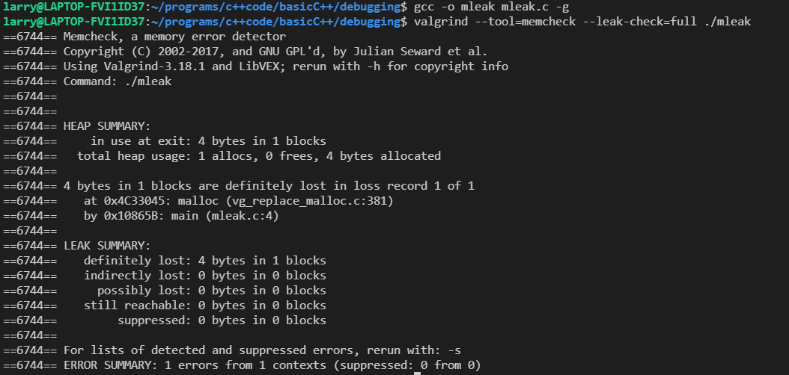

这里注意如果用C++的STL, 使用STL的内存池, 即便不delete STL也会回收内存, 因此不会发生内存泄露。

#### 检测越界访问

```cpp
#include <vector>
#include <iostream>
int main()
{
    std::vector<int> v(10, 0);
    std::cout << v[10] << std::endl;
    return 0;
}
```
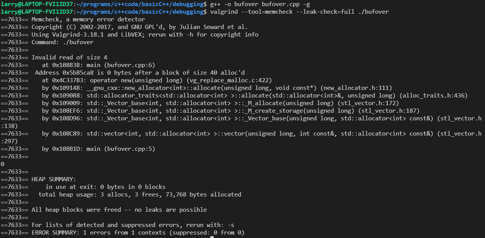

#### 检测未初始化的内存
```cpp
#include <iostream>
int main()
{
    int x;
    if (x == 0)
    {
        std::cout << "X is zero" << std::endl;
    }
    return 0;
}
```
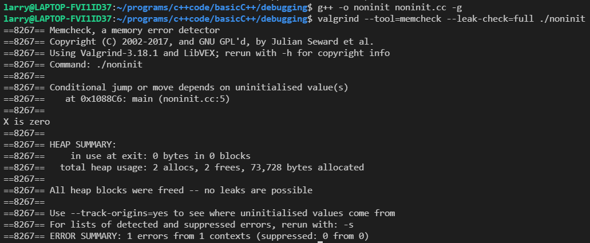

Valgrind只是用来检测内存的, 真要分析复杂的bug，还得人工core dump啊。

### 栈帧信息, 查看栈

可以直接用gdb调试core dump查看栈信息, 这里放一些其他查看栈的便捷方法
#### 打印栈帧信息backtrace

```cpp
#include <execinfo.h>

int backtrace (void **buffer, int size);
char **backtrace_symbols (void *const *buffer, int size);
void backtrace_symbols_fd (void *const *buffer, int size, int fd);
```

backtrace()函数，获取函数调用堆栈帧数据，即回溯函数调用列表。数据将放在buffer中。

```cpp
void
myfunc(void)
{
   int j, nptrs;
#define SIZE 100
   void *buffer[100];
   char **strings;
 
   nptrs = backtrace(buffer, SIZE);  // 获取程序堆栈数据, npts为堆栈数量
   printf("backtrace() returned %d addresses\n", nptrs);
 
   strings = backtrace_symbols(buffer, nptrs);  
   //从backtrace()函数获取的地址buffer转为描述这些地址的字符串数组。backtrace_symbols为string开辟了内存,但只回收第二维度, 需要额外free(strings)但不用free(strings[i]),strings是二维指针
   if (strings == NULL) {
	   perror("backtrace_symbols");
	   exit(EXIT_FAILURE);
   }

   for (j = 0; j < nptrs; j++)
      printf("  [%02d] %s\n", j, strings[j]);

   free(strings); // 这样就可以回收内存了,因为开辟方法是char* buffer[100]
   /* 还有开辟方法 string[n][length]
   	char ** string=(char**)malloc(sizeof(char*)*n);
	for(ii=0;ii<n;ii++)
    {
		name[ii]=(char *)malloc(sizeof(char)*length);
    }
	得析构string[i]
*/
}
int
main(int argc, char *argv[])
{
   myfunc();
   exit(EXIT_SUCCESS);
}
```

输入` gcc -g -rdynamic -o backtrace backtrace.c`注意`-rdynamic`
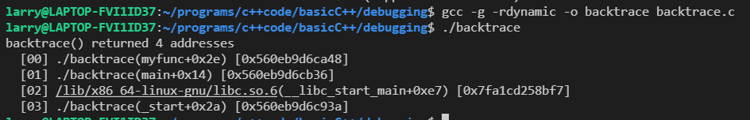

#### pstack 追踪运行程序的栈

pstack可显示每个运行进程的栈跟踪。pstack 命令必须由相应进程的属主或 root 运行。可以使用 pstack 来确定进程挂起的位置。此命令允许使用的唯一选项是要检查的进程的 PID。比如我们发现一个服务一直处于work状态（如假死状态，好似死循环），使用这个命令就能轻松定位问题所在。

pstack的工作原理其实就是一个shell脚本，然后在脚本里面调用gdb来实现对应用进程各个线程堆栈的打印。
```cpp
#!/bin/sh

if test $# -ne 1; then
    echo "Usage: `basename $0 .sh` <process-id>" 1>&2
    exit 1
fi

if test ! -r /proc/$1; then
    echo "Process $1 not found." 1>&2
    exit 1
fi

# GDB doesn't allow "thread apply all bt" when the process isn't
# threaded; need to peek at the process to determine if that or the
# simpler "bt" should be used.

backtrace="bt"
if test -d /proc/$1/task ; then
    # Newer kernel; has a task/ directory.
    if test `/bin/ls /proc/$1/task | /usr/bin/wc -l` -gt 1 2>/dev/null ; then
	backtrace="thread apply all bt"
    fi
elif test -f /proc/$1/maps ; then
    # Older kernel; go by it loading libpthread.
    if /bin/grep -e libpthread /proc/$1/maps > /dev/null 2>&1 ; then
	backtrace="thread apply all bt"
    fi
fi

GDB=${GDB:-/usr/bin/gdb}

# Run GDB, strip out unwanted noise.
# --readnever is no longer used since .gdb_index is now in use.
$GDB --quiet -nx $GDBARGS /proc/$1/exe $1 <<EOF 2>&1 | 
set width 0
set height 0
set pagination no
$backtrace
EOF
/bin/sed -n \
    -e 's/^\((gdb) \)*//' \
    -e '/^#/p' \
    -e '/^Thread/p'
```

使用以上脚本获取运行进程的栈帧情况
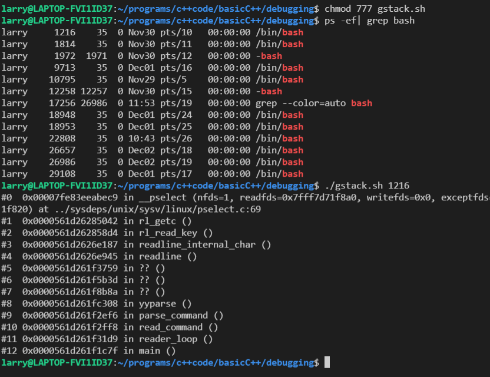

### 调试多线程

#### gdb基本操作
gdb基本操作之前已经写过了，这里再放一次
```
(gdb) start                         //开始调试
(gdb) n                             //一条一条执行
(gdb) step/s                        //执行下一条，如果函数进入函数
(gdb) backtrace/bt                  //查看函数调用栈帧
(gdb) info/i locals                 //查看当前栈帧局部变量
(gdb) frame/f                       //选择栈帧，再查看局部变量
(gdb) print/p                       //打印变量的值
(gdb) finish                        //运行到当前函数返回
(gdb) set var sum=0                 //修改变量值
(gdb) list/l 行号或函数名             //列出源码
(gdb) display/undisplay sum         //每次停下显示变量的值/取消跟踪
(gdb) break/b  行号或函数名           //设置断点
(gdb) continue/c                    //连续运行
(gdb) info/i breakpoints            //查看已经设置的断点
(gdb) delete breakpoints 2          //删除某个断点
(gdb) disable/enable breakpoints 3  //禁用/启用某个断点
(gdb) break 9 if sum != 0           //满足条件才激活断点
(gdb) run/r                         //重新从程序开头连续执行
(gdb) watch input[4]                //设置观察点
(gdb) info/i watchpoints            //查看设置的观察点
(gdb) x/7b input                    //打印存储器内容，b--每个字节一组，7--7组
(gdb) disassemble                   //反汇编当前函数或指定函数
(gdb) si                            // 一条指令一条指令调试 而 s 是一行一行代码
(gdb) info registers                // 显示所有寄存器的当前值
(gdb) x/20 $esp                    //查看内存中开始的20个数
```

#### 启动并查看多线程

测试程序
```cpp
void* pthread_run1(void* arg)
{
    (void)arg;

    while(1)
    {
        printf("I am thread1,ID: %d\n",pthread_self());
        sleep(1);
    }
}
void* pthread_run2(void* arg)
{
    (void)arg;

    while(1)
    {
        printf("I am thread2,ID: %d\n",pthread_self());
        sleep(1);
    }
}
int main()
{

    pthread_t tid1;
    pthread_t tid2;

	// 创建两个线程分别执行pthread_run1,和pthread_run2
    pthread_create(&tid1,NULL,pthread_run1,NULL);
    pthread_create(&tid2,NULL,pthread_run2,NULL);
	// 主线程执行打印
    printf("I am main thread\n");

    pthread_join(tid1,NULL);
    pthread_join(tid2,NULL);
    return 0;
}
```

ps的基本使用
```
a 显示所有进程
-a 显示同一终端下的所有程序
-A 显示所有进程
-e 等于“-A” 显示所有进程
e 显示环境变量
f 显示程序间的关系
-au 显示较详细的资讯
-aux 显示所有包含其他使用者的行程
```

```cpp
//查看当前运行的进程
ps aux|grep threadebug
//查看当前运行的轻量级进程
ps -aL|grep threadebug
//查看主线程和新线程的关系
pstree -p 主线程id
```
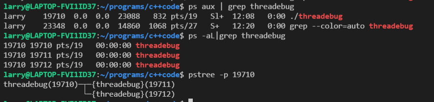

* 线程栈结构的查看

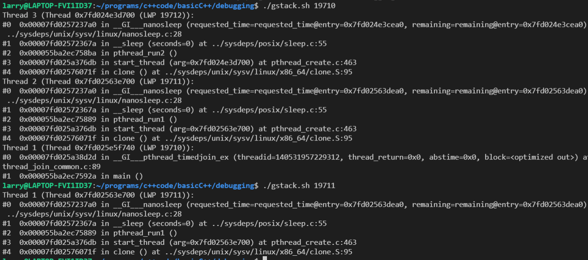

#### gdb调试多线程

当程序没有启动，线程还没有执行，此时利用gdb调试多线程和调试普通程序一样，通过设置断点，运行，查看信息等等。

多线程的命令
```
info threads	显示当前可调试的所有线程，每个线程会有一个GDB为其分配的ID，后面操作线程的时候会用到这个ID。 前面有*的是当前调试的线程

thread ID(1,2,3…)	切换当前调试的线程为指定ID的线程

break thread_test.c:123 thread all（例：在相应函数的位置设置断点break pthread_run1）	在所有线程中相应的行上设置断点

thread apply ID1 ID2 command	让一个或者多个线程执行GDB命令command
thread apply all command	让所有被调试线程执行GDB命令command

set scheduler-locking 选项 command	设置线程是以什么方式来执行命令
set scheduler-locking off	不锁定任何线程，也就是所有线程都执行，这是默认值
set scheduler-locking on	只有当前被调试程序会执行
set scheduler-locking on step	在单步的时候，除了next过一个函数的情况(熟悉情况的人可能知道，这其实是一个设置断点然后continue的行为)以外，只有当前线程会执行
```

可以调用`thread 2`使用线程2, 然后用info stack查看线程2的线程栈。
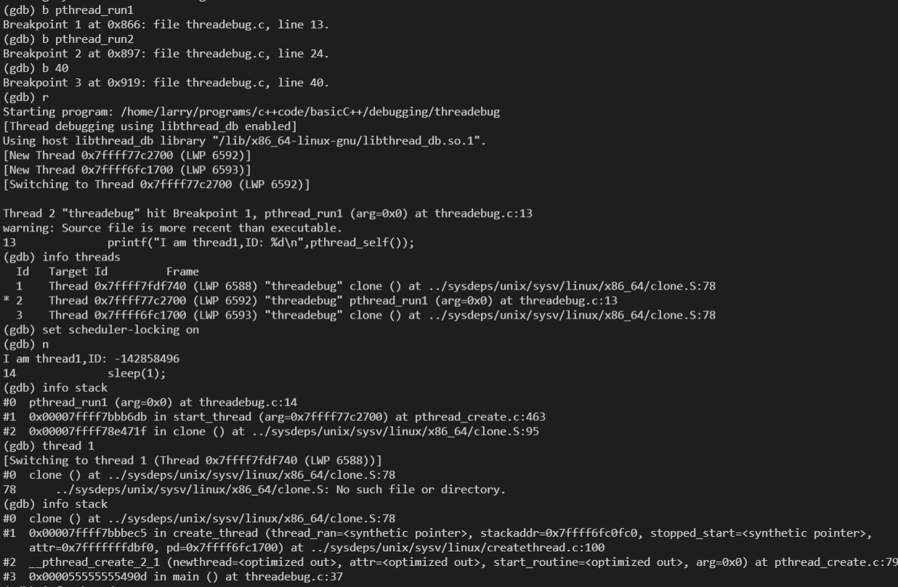

### 其他一些调试排错方法
#### ldd 查看程序依赖库

用来查看程式运行所需的共享库,常用来解决程式因缺少某个库文件而不能运行的一些问题。每行的三列分别表示所需要的库，系统提供库的位置, 所需库的加载地址。显然系统链接的一般是动态库。
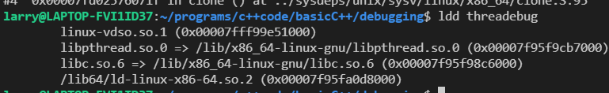

####  二进制文件分析

* objdump

```
objdump -d main.o 反汇编程序

objdump  -t main.o 显示符号表入口
```

内存分段, 程序装载=数据+指令, 指令放入代码段, 全局变量，常量放入BSS段和数据段, 函数内变量放入栈或者堆中。

1. BSS段：BSS段（bss segment）通常是指用来存放程序中未初始化的全局变量的一块内存区域。BSS是英文Block Started by Symbol的简称。BSS段属于静态内存分配。

2. 数据段：数据段（data segment）通常是指用来存放程序中已初始化的全局变量的一块内存区域。数据段属于静态内存分配。

3. 代码段：代码段（code segment/text segment）通常是指用来存放程序执行代码的一块内存区域。这部分区域的大小在程序运行前就已经确定，并且内存区域通常属于只读, 某些架构也允许代码段为可写，即允许修改程序。在代码段中，也有可能包含一些只读的常数变量，例如字符串常量等。

4. 堆（heap）：堆是用于存放进程运行中被动态分配的内存段，它的大小并不固定，可动态扩张或缩减。当进程调用malloc等函数分配内存时，新分配的内存就被动态添加到堆上（堆被扩张）；当利用free等函数释放内存时，被释放的内存从堆中被剔除（堆被缩减）

5. 栈(stack)：栈又称堆栈， 是用户存放程序临时创建的局部变量，也就是说我们函数括弧“{}”中定义的变量（但不包括static声明的变量，static意味着在数据段中存放变量）。除此以外，在函数被调用时，其参数也会被压入发起调用的进程栈中，并且待到调用结束后，函数的返回值也会被存放回栈中。由于栈的先进先出特点，所以栈特别方便用来保存/恢复调用现场。从这个意义上讲，我们可以把堆栈看成一个寄存、交换临时数据的内存区。