> malloc, tcmalloc, jemalloc内存管理


### 进程内存布局

操作系统使用虚拟内存的机制, 让进程在分配内存时可以使用理论上地址可以访问的所有内存, 32位操作系统就是4GB, 64位能访问的内存就很大了。这里用到的地址就是内存的逻辑地址, 底层还需要再次映射得到线程地址和物理地址才能访问实际的内存。

操作系统对进程的内存分布还有mmap的映射, 也就是共享内存。mmap实现同一块物理内存被映射到了多个进程地址空间, 多个进程访问一块内存区, 实现进程基于共享内存的通信。

#### 32位内存布局

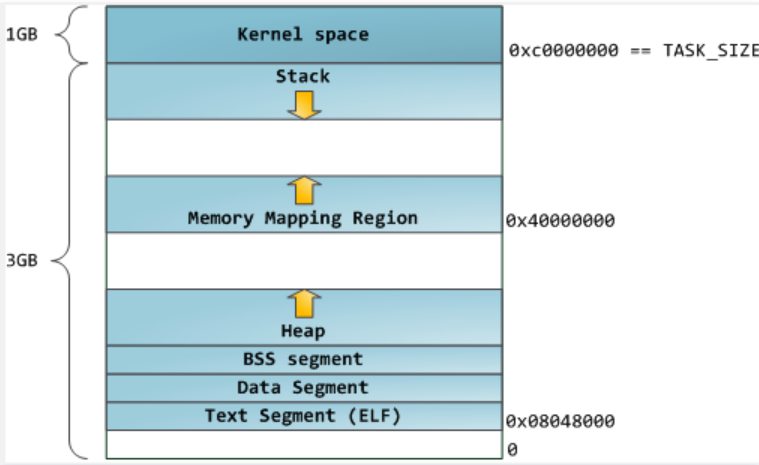

上图是32位经典内存布局, 主要问题在于Memory Mapping Region逻辑地址固定, 这样容易被利用遭受溢出攻击。同时Memory Mapping Region向上增长让堆的大小固定, 而实际上往往堆需要的空间大而栈用的空间小, Memory Mapping Region应该向下增长才合理


上图是改进得到的32位默认内存布局, 加入了几种Random offset随机偏移，使内存溢出攻击变得困难; mmap向下增长, 让栈的大小固定, 堆可以动态增长。因此操作系统一般有栈大小限制

#### 64位内存布局

64位的寻址空间大, 不存在32位栈或堆寻址不够用的问题。因此Memory Mapping Region向上增长, 加上了随机的mmap起始地址防止内存攻击。

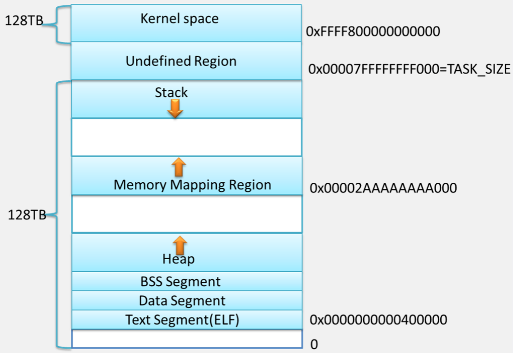

mmap 对内存动态增长有重要作用, 尤其是32位操作系统。对于malloc内存分配而言, 如果是小数据会向操作系统申请扩大堆顶，这时候操作系统会把需要的内存分页映射; 大内存申请会直接调用mmap。

如果是free内存不同的malloc则有不同的策略，不一定立刻把内存还给系统。所以很多时候，如果访问了free掉的内存，并不会立即Run Time Error,但这可能带来安全问题, 如果内存回收后使只问的地址没有对应的内存分页，进程会直接崩掉。

<!--more -->


内存碎片描述了一个系统中所有不可用的空闲内存。内存分配器的目标主要有2个：

1. 减少内存碎片，包括内部碎片和外部碎片。外部碎片是已经分配的内存, 但大于进程所需(例如进程需要20byte你给它40byte), 内部碎片是多次分配后剩余的小内存(例如1byte)难以分配给进程
2. 提高性能:单线程性能; 多线程性能

### Ptmalloc

#### 主要内容

chunk, bin, 不同类型的bin

ptmalloc的分配单元是大小不一的chunk。大小相同的chunk用内存块链表bin管理，形成内存池的结构。bins分为fastbin，smallbin，largebin和unsortedbin

fast bins维护常用的小块内存(如同slabs)用作缓冲, smallbin，largebin可认为正常的分配链表, 当释放用过的chunk会先放到unsortedbin中, unsortedbin可以有第二次机会用到释放的chunk(第一次机会是fastbins), 如果largebin区域过大, 剩余的块也会放在unsortedbin中

bin以上还有分配区的概念, 为了解决多线程锁争夺问题(显然多线程共享堆空间)，分为主分配区和非主分配区。非主分配区是mmap一块内存模拟堆空间, 主分配区可以使用brk和mmap来分配，而非主分配区只能使用mmap来映射内存块。

多个分配区组成一个链表, 一个线程请求分配区时需要先加锁获取一个, 多线程分阶段处理的任务不适合使用ptmalloc(经常发生请求分配区的过程, 效率低)

注意到malloc产生内部碎片的原因主要源于brk, mmap系统调用的结果, brk分配的内存会一直是连续的, 也只有连续的内存可以被释放, 这可能导致实际的内存可能一直释放不了

Ptmalloc是glibc默认的内存(池)分配器, 值得注意的是无论Linux内核还是各种内存分配器, 内存池的基本实现都是基于数组+内存块链表, 也就是常用的伙伴算法Buddy。伙伴算法可解决外部碎片问题。

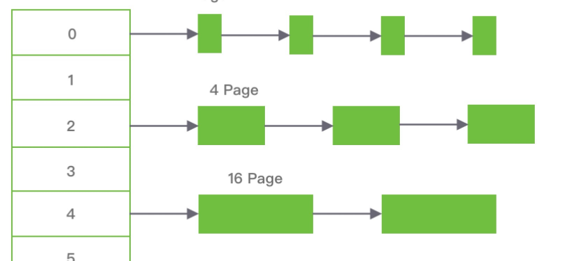

Buddy由于粒度太大(内存块的单位较大)，以页为单位，采用伙伴算法分配内存时，每次至少分配一个页面(4K)，会造成严重的内存浪费。为了处理小内存分配, 以及频繁的申请的内存块, 有了slab算法。slab可以看成更小粒度的内存池, 一般粒度位2的幂, 例如2bytes, 4bytes, 8bytes...。 

slab还用了其他一些技术, 例如slab分配对象时，会使用最近释放的对象的内存块，因此其驻留在cpu高速缓存中的概率会大大提高; 为了避免重复初始化对象，Slab分配模式并不丢弃已分配的对象，而是释放但把它们依然保留在内存中。当以后又要请求分配同一对象时，就可以从内存获取而不用进行初始化

#### chunk

glibc的malloc实现是ptmalloc, ptmalloc采用主-从分配区的模式。

ptmalloc内部，内存最小分配单元称为chunk。chunk大小不一。

```cpp
/*
  This struct declaration is misleading (but accurate and necessary).
  It declares a "view" into memory allowing access to necessary
  fields at known offsets from a given base. See explanation below.
*/
struct malloc_chunk {

  INTERNAL_SIZE_T      mchunk_prev_size;  /* Size of previous chunk (if free).  */
  INTERNAL_SIZE_T      mchunk_size;       /* Size in bytes, including overhead. */
  struct malloc_chunk* fd;         /* double links -- used only if free. */
  struct malloc_chunk* bk;
  /* Only used for large blocks: pointer to next larger size.  */
  struct malloc_chunk* fd_nextsize; /* double links -- used only if free. */
  struct malloc_chunk* bk_nextsize;
};
```

内存对齐, 默认对齐2倍字长, 对于64位操作系统一个字长是8字节, 内存对齐有16字节之多。
```cpp
#ifndef INTERNAL_SIZE_T
#define INTERNAL_SIZE_T size_t
#endif

/* The corresponding word size */
#define SIZE_SZ                (sizeof(INTERNAL_SIZE_T))

#  define MALLOC_ALIGNMENT       (2 *SIZE_SZ < __alignof__ (long double)      \
                                  ? __alignof__ (long double) : 2 *SIZE_SZ)
```

* 使用中的chunk

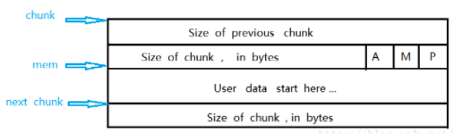

chunk指针指向chunk开始的地址；mem指针指向用户内存块开始的地址。 

p=0，表示前一个chunk为空闲，prev_size才有效; p=1时，表示前一个chunk正在使用，prev_size无效 p主要用于内存块的合并操作；

M=1 为mmap映射区域分配；M=0为heap区域分配; A=0 为主分配区分配；A=1 为非主分配区分配。

* 空闲的chunk

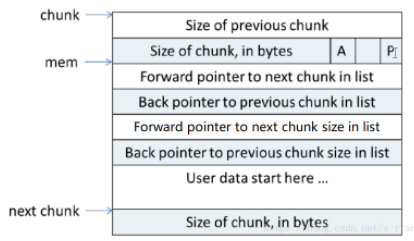

当chunk空闲时，其M状态是不存在的，只有AP状态（因为M表示是由brk还是mmap分配的内存，mmap分配的内存free时直接ummap，不会放到空闲链表中）

原本是用户数据区的地方存储了四个指针， 指针fd指向后一个空闲的chunk,而bk指向前一个空闲的chunk，malloc通过这两个指针将大小相近的chunk连成一个双向链表。 

在large bin中的空闲chunk，还有两个指针，fd_nextsize和bk_nextsize，用于加快在large bin中查找最近匹配的空闲chunk。

#### bin

大小相同的chunk用内存块链表管理，形成内存池的结构。这样的链表被称为bin。bins又细分为fastbin，smallbin，largebin和unsortedbin

为了照顾着一些很常用的小块内存，有了fast bins。fast bins中的free chunk是LIFO的，使用单向链表实现，fast bins能fast也是基于时间空间局部性。在malloc申请一个chunk时，首先就会在fast bins中查找有没有适合的size，如果没有才会进行后面的操作。fast bins 记录着大小以8字节递增的bin链表, 当用户释放一块不大于max_fast（默认值64B）的chunk的时候，会默认会被放到fast bins上。

unsorted bin 的队列使用 bins 数组的第一个, 是bins的一个缓冲区，加快分配的速度。当用户释放的内存大于max_fast或者fast bins合并后的chunk都会首先进入unsorted bin上。

small bins用来维护小size chunk的bins, 一个chunk是small还是large，是由宏MIN_LARGE_SIZE决定的，这个size在64位操作系统上是1024，在32位系统上是512. 大小于512字节的chunk被称为small chunk, 保存small chunks的bin被称为small bin。数组从2开始编号，前64个bin为small bins，small bin每个bin之间相差8个字节，同一个small bin中的chunk具有相同大小。 

大小大于等于512字节的chunk被称为large chunk，而保存large chunks的bin被称为large bin，位于small bins后面。large bins中的每一个bin分别包含了一个给定范围内的chunk，其中的chunk按大小递减排序，大小相同则按照最近使用时间排列。


```cpp
#define NBINS             128
#define NSMALLBINS         64
#define SMALLBIN_WIDTH    MALLOC_ALIGNMENT
#define SMALLBIN_CORRECTION (MALLOC_ALIGNMENT > 2 * SIZE_SZ)
#define MIN_LARGE_SIZE    ((NSMALLBINS - SMALLBIN_CORRECTION) * SMALLBIN_WIDTH)

#define in_smallbin_range(sz)  \
  ((unsigned long) (sz) < (unsigned long) MIN_LARGE_SIZE)

#define smallbin_index(sz) \
  ((SMALLBIN_WIDTH == 16 ? (((unsigned) (sz)) >> 4) : (((unsigned) (sz)) >> 3))\
   + SMALLBIN_CORRECTION)
```

比MIN_LARGE_SIZE大的chunk都称为large bins, 

#### 特殊的chunk
下面三种特殊的chunk不会存放在Bin中

* top chunk

top chunk相当于分配区的顶部空闲内存(brk调用控制的brk指针)，当bins上都不能满足内存分配要求的时候，就会来top chunk上分配。 

当top chunk大小比用户所请求大小还大的时候，top chunk会分为两个部分：User chunk（用户请求大小）和Remainder chunk（剩余大小）。其中Remainder chunk成为新的top chunk。

* mmaped chunk 

当分配的内存非常大（大于分配阈值，默认128K）的时候，需要被mmap映射，则会放到mmaped chunk上，当释放mmaped chunk上的内存的时候会直接交还给操作系统。 （chunk中的M标志位置1）

* last remainder chunk

当需要分配一个small chunk,但在small bins中找不到合适的chunk，如果last remainder chunk的大小大于所需要的small chunk大小，last remainder chunk被分裂成两个chunk，其中一个chunk返回给用户，另一个chunk变成新的last remainder chunk。

chunk和bin一起维护的链表内存池如下
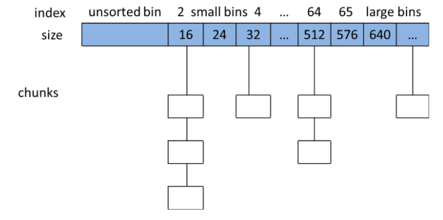

#### 分配区

malloc_state, bins是malloc_state结构的一部分，因此malloc_state的实例就是一个分配区域

```cpp
struct malloc_state
{
  /* Serialize access.  */
  __libc_lock_define (, mutex);

  /* Flags (formerly in max_fast).  */
  int flags;
  /* Set if the fastbin chunks contain recently inserted free blocks.  */
  /* Note this is a bool but not all targets support atomics on booleans.  */
  int have_fastchunks;
  /* Fastbins */
  mfastbinptr fastbinsY[NFASTBINS];
  /* Base of the topmost chunk -- not otherwise kept in a bin */
  mchunkptr top;
  /* The remainder from the most recent split of a small request */
  mchunkptr last_remainder;
  /* Normal bins packed as described above */
  mchunkptr bins[NBINS * 2 - 2];
  /* Bitmap of bins */
  unsigned int binmap[BINMAPSIZE];
  /* Linked list */
  struct malloc_state *next;
  /* Linked list for free arenas.  Access to this field is serialized
     by free_list_lock in arena.c.  */
  struct malloc_state *next_free;
  /* Number of threads attached to this arena.  0 if the arena is on
     the free list.  Access to this field is serialized by
     free_list_lock in arena.c.  */
  INTERNAL_SIZE_T attached_threads;
  /* Memory allocated from the system in this arena.  */
  INTERNAL_SIZE_T system_mem;
  INTERNAL_SIZE_T max_system_mem;
};
```

内存分配器中，为了解决多线程锁争夺问题，分为主分配区main_area和非主分配区no_main_area。当多线程都要分配内存块，但多个线程是不能同时调用 sbrk()函数的，因为只有一个函数调用 sbrk()时才能保证分配的虚拟地址空间是连续的。为了解决这个问题，ptmalloc 使用非主分配区来模拟主分配区的功能。

具体方法就是, 非主分配区使用 mmap()函数分配一大块内存来模拟堆（sub-heap），从非主分配区分配的小内存块从 sub-heap 中获取。主分配区可以使用brk和mmap来分配，而非主分配区只能使用mmap来映射内存块。

当一个线程需要使用malloc分配内存的时候，会先查看该线程的私有变量中是否已经存在一个分配区。若存在。会尝试对其进行加锁操作。若是加锁成功，就在使用该分配区分配内存，若是失败，就会遍历循环链表中获取一个未加锁的分配区。若是整个链表中都没有未加锁的分配区，则malloc会开辟一个新的分配区，将其加入全局的循环链表并加锁。

一个进程有一个malloc管理器，而一个进程中的多个线程共享这一个管理器，有竞争，加锁

Ptmalloc对于多线程加锁处理是很耗时的, 这也是glibc malloc的性能瓶颈所在

#### brk和mmap

从操作系统角度来看，进程分配内存有两种方式，分别由两个系统调用完成：brk和mmap（不考虑共享内存）。如下图, A,B两块是brk分配的, C则是用mmap分配的。

1. brk是将数据段(.data)的最高地址指针_edata往高地址(栈的方向)推；
2. mmap是在进程的虚拟地址空间中（堆和栈中间，称为文件映射区域的地方）找一块空闲的虚拟内存。

注意, 这两种方式分配的都是虚拟内存，没有分配物理内存。在第一次访问已分配的虚拟地址空间的时候，发生缺页中断，操作系统负责分配物理内存，然后建立虚拟内存和物理内存之间的映射关系。

mmap是虚拟内存置换的重要方式, 在虚拟内存中, 内存和磁盘都作为存储介质, 而内存某种意义上视为磁盘的cache。mmap将一个文件或者其它对象映射到进程的地址空间，实现文件磁盘地址和进程虚拟地址空间中一段虚拟地址的一一对映关系, 这样进程就可以采用指针的方式读写操作这一段内存，而系统会自动回写脏页面到对应的文件磁盘上, 这就实现了cache的页面置换。

1. 进程启动映射过程，并在虚拟地址空间中为映射创建虚拟映射区域, 即调用`void mmap(void start, size_t length, int prot, int flags, int fd, off_t offset);`
2. 进程发起对这片映射空间的访问，引发缺页异常，实现文件内容到物理内存(主存)的拷贝

第一次读写mmap由于页表并未与物理内存映射促发缺页异常, 缺页异常程序先根据要访问的偏移和大小从page cache中查询是否有该文件的缓存，如果找到就更新进程页表指向page cache那段物理内存; 没找到就将文件从磁盘加载到内核page cache，然后再令进程的mmap虚拟地址的页表指向这段page cache中文件部分的物理内存

这个开销有时候是可观的。

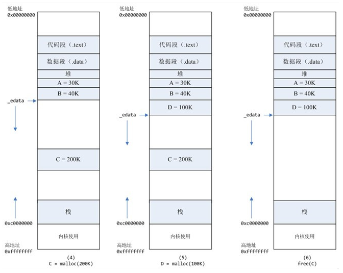

使用mmap的好处是, **brk分配的内存需要等到高地址内存释放以后才能释放(例如，在B释放之前，A是不可能释放的，这就是内存碎片产生的原因，什么时候紧缩看下面)，而mmap分配的内存可以单独释放**。

这里的内存碎片和内部, 外部不同。内部碎片和外部碎片是针对进程说的, 内部碎片是由于采用固定大小的内存分区，当一个进程不能完全使用分给它的固定内存区域时就产生了内部碎片(也就是说外部碎片是刚开始分配产生的, 而内部碎片则是用着用着时间久了才有的)，**通常内部碎片难以完全避免**；外部碎片是由于某些未分配的连续内存区域太小，以至于不能满足任意进程的内存分配请求，从而不能被进程利用的内存区域。Linux使用段页式的内存分配大大减少了内存的外部碎片, 但可能存在少量的内部碎片。

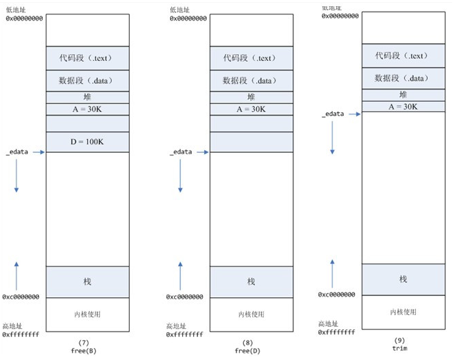
free掉B, 占用的内存并未释放, 直到BD都被free了才会释放。

#### ptmalloc分配过程

内存分配过程

1. 获取分配区的锁，防止多线程冲突。（一个进程有一个malloc管理器，而一个进程中的多个线程共享这一个管理器，有竞争，加锁）

2. 计算出实际需要分配的内存的chunk实际大小。

3. 判断chunk的大小，如果小于max_fast（64Ｂ），则尝试去fast bins上取适合的chunk，如果有则分配结束。否则，下一步；

4. 判断chunk大小是否小于512B，如果是，则从small bins上去查找chunk，如果有合适的，则分配结束。否则下一步；

5. ptmalloc首先会遍历fast bins(注：这里是第二次遍历fast bins了，虽然fast bins一般不会合并，但此时会)中的chunk，将相邻的chunk进行合并，并链接到unsorted bin中然后遍历 unsorted bins。

6. 从large bins中查找找到合适的chunk之后，然后进行切割，一部分分配给用户，剩下的放入unsorted bin中。

7. 如果搜索fast bins和bins都没有找到合适的chunk，那么就需要操作top chunk来进行分配了 。当top chunk大小比用户所请求大小还大的时候，top chunk会分为两个部分：User chunk（用户请求大小）和Remainder chunk（剩余大小）。

8. 到了这一步，说明 top chunk 也不能满足分配要求，所以，于是就有了两个选择: 如 果是主分配区，调用 sbrk()，增加 top chunk 大小；如果是非主分配区，调用 mmap 来分配一个新的 sub-heap，增加 top chunk 大小；或者使用 mmap()来直接分配。

内存释放过程

1. 获取分配区的锁，保证线程安全。

2. 判断当前chunk是否是mmap映射区域映射的内存，如果是，则直接munmap()释放这块内存。前面的已使用chunk的数据结构中，我们可以看到有M来标识是否是mmap映射的内存。

3. 判断chunk是否与top chunk相邻，如果相邻，则直接和top chunk合并（和top chunk相邻相当于和分配区中的空闲内存块相邻）。转到步骤7

4. 如果chunk的大小大于max_fast（64b），则放入unsorted bin，并且检查是否有合并，有合并情况并且和top chunk相邻，则转到步骤8；没有合并情况则free。

5. 如果chunk的大小小于 max_fast（64b），则直接放入fast bin，fast bin并没有改变chunk的状态。没有合并情况，则free；有合并情况，转到步骤6

6. 在fast bin，如果当前chunk的下一个chunk也是空闲的，则将这两个chunk合并，放入unsorted bin上面。合并后的大小如果大于64B，会触发进行fast bins的合并操作，fast bins中的chunk将被遍历，并与相邻的空闲chunk进行合并，合并后的chunk会被放到unsorted bin中，fast bin会变为空。合并后的chunk和topchunk相邻，则会合并到topchunk中。转到步骤7

7. 判断top chunk的大小是否大于mmap收缩阈值（默认为128KB），如果是的话，对于主分配区，则会试图归还top chunk中的一部分给操作系统。free结束。

### Tcmalloc

Tcmalloc是Google gperftools里的组件之一。全名是 thread cache malloc(线程缓存分配器), Tcmalloc主要用于克服ptmalloc 多线程分配的效率低下。对应ptmalloc的chunck, bin, 分配区的是tcmalloc的page, span, ThreadCache

多线程请求内存时, ptmalloc需要从分配区链表中请求一个分配区并加锁(只有main线程有资格使用进程的brk, 其他线程只能用mmap)。而tcmalloc直接给线程一个ThreadCache用来小对象分配, 大大加速小内存分配和释放。此外tcmalloc的内存分配来自一个缜密的内存分配器, 该分配器内部有线程维护获取和回收, 而不是ptmalloc那种简单的brk和mmap堆分配。事实上直接使用brk在内存释放上效率也不高

#### 概念
TCMalloc 实现了三级缓存，分别是ThreadCache(线程级缓存)，Central Cache(中央缓存：CentralFreeeList)，PageHeap(页缓存)，最后两级需要加锁访问。

按照所分配内存的大小，TCMalloc将内存分配分为三类：
* 小对象分配，(0, 256KB]
* 中对象分配，(256KB, 1MB]
* 大对象分配，(1MB, +∞)

TCMalloc定义了PageHeap类来处理向OS申请内存相关的操作，并提供了一层缓存。PageHeap以span为单位向系统申请内存，申请到的span可能只有一个page，也可能包含n个page。可能会被划分为一系列的小对象，供小对象分配使用，也可能当做一整块当做中对象或大对象分配。

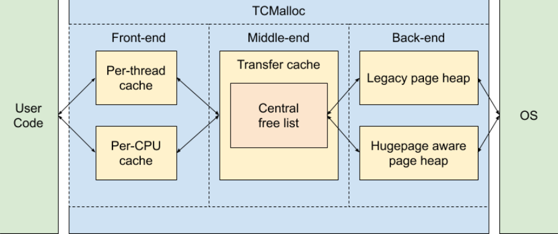
#### 小内存分配 ThreadCache

对于256KB以内的小对象分配，TCMalloc按大小划分了85个类别, 称为Size Class。

每个线程，TCMalloc都为其保存了一份单独的缓存，称之为ThreadCache，这也是TCMalloc名字的由来（Thread-Caching Malloc）。每个ThreadCache中对于每个size class都有一个单独的FreeList，缓存了n个还未被应用程序使用的空闲对象。

每线程一个ThreadCache，因此从ThreadCache中取用或回收内存是不需要加锁的，速度很快。

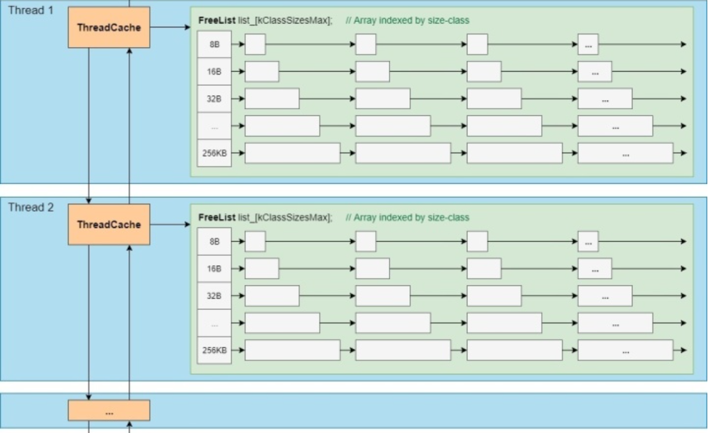

#### 大内存分配 CentralCache

对于大内存分配(大于256K), 与ThreadCache类似，CentralCache中对于每个size class也都有一个单独的链表来缓存空闲对象，称之为CentralFreeList，供各线程的ThreadCache从中取用空闲对象。由于是所有线程公用的，因此从CentralCache中取用或回收对象，是需要加锁的。


#### PageHeap

当CentralCache中的空闲对象不够用时，CentralCache会向PageHeap申请一块内存

PageHeap内部根据内存块（span）的大小采取了两种不同的缓存策略。128个page以内的span，每个大小都用一个链表来缓存，超过128个page的span，存储于一个有序set（std::set）。一个Page一般是8KB

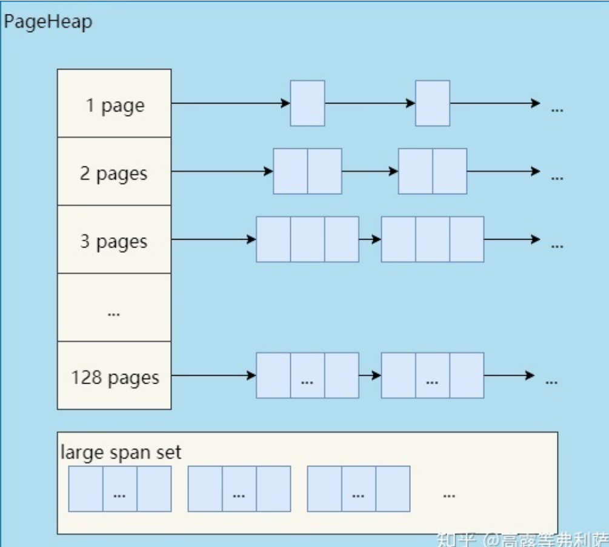


#### 内存分配

小对象分配(<256k), 直接从ThreadCache中的freelist拿, 获取和释放都十分快速

中对象分配(>256K ~ 1MB), 向上取整到整数个page, 从pageHeap中获取

大对象分配(>1MB), 从pageHeap的large span set中获取
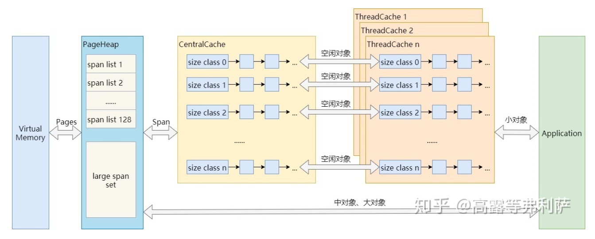
### jemalloc

jemalloc使用了更多缓存, 几种表现在arena内存分配和tcache缓存。在单线程下只需要通过arena分配, 但 多线程下会指派一个arena, 分配权到了tcache用于线程内存分配, 为了防止多线程的同步。

jemalloc用到了更复杂的缓存, 减少内部碎片


#### 概念
jemalloc的几个概念

1. page最底层是从操作系统申请内存，由 pages.h/pages.c 封装了跨平台实现
2. chunk, jemalloc 会以 chunk 为单位从操作系统申请内存，大小为 page size 倍数，默认为 2 MiB(chunk很大)
3. base, 实现了内部使用的内存分配器, 以 chunk 为单位申请内存，记录 chunk 信息的 extent_node_t 使用 chunk 的起始内存。base 使用 extent_node_t 组成的红黑树 base_avail_szad 管理 chunk
4. arena， 内存大多数由 arena 管理，分配算法是 Buddy allocation 和 Slab allocation 的组合。chunk 使用 Buddy allocation 划分为不同大小的 run, run 使用 Slab allocation 划分为固定大小的 region, run 被释放会和空闲的、相邻的 run 进行合并
5. run, small classes 从 run 中使用 slab 算法分配，每个 run 对应一块连续的内存，大小为 page size 倍数，划分为等大小的 region，分配时就从 run 中分配一个空闲 region，释放时就标记该 region 为空闲， 留待之后分配。会有多种不同的 run。bin 管理相同类型的 run， bin_info 记录了对应的 run 的内存格式。

6. region 是每个 run 中的对应的若干个小内存块，每个 run 会将划分为若干个等长的 region，每次内存分配也是按照 region 进行分发。

7. tcache 是每个线程私有的缓存，用于 small 和 large 场景下的内存分配。每个 tcahe 会对应一个 arena，tcache 本身也会有一个 bin 数组，称为tbin。与 arena 中 bin 不同的是，它不会有 run 的概念。tcache 每次从 arena 申请一批内存，在分配内存时首先在 tcache 查找，从而避免锁竞争，如果分配失败才会通过 run 执行内存分配


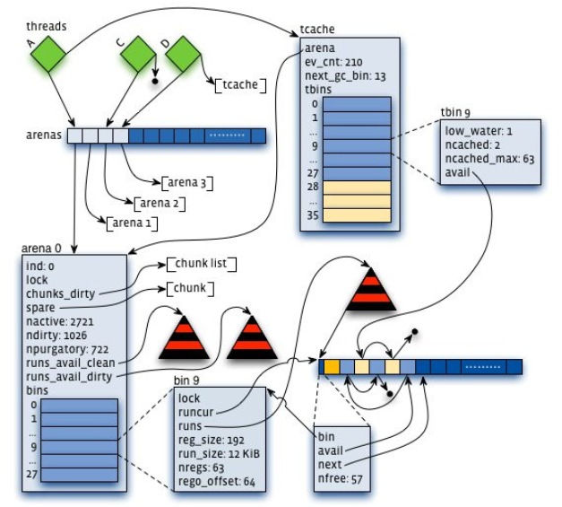


内存是由一定数量的 arenas 负责管理，线程均匀分布在 arenas 当中；
1. 每个 arena 都包含一个 bin 数组，每个 bin 管理不同档位的内存块；
2. 每个 arena 被划分为若干个 chunks，每个 chunk 又包含若干个 runs，每个 run 由连续的 Page 组成，run 才是实际分配内存的操作对象；
3. 每个 run 会被划分为一定数量的 regions，在小内存的分配场景，region 相当于用户内存；
4. 每个 tcache 对应 一个 arena，tcache 中包含多种类型的 bin。

* small 的分配流程如下：

1. 查找对应 size classes 的 bin
2. 从 bin 中获取 run:
3. 从 arena 中获取 run:
从 arena->avail_runs 中查找空闲 run
当没有合适 run 时，从 chunk 中分配 run:
调用 mmap() 新分配一块 chunk
4. 从 run 中返回一个空闲 region


* 分配 large 和分配 small 类似:

1. 先从 arena->avail_runs 中查找，因为 large object 不由 bin 管理，所以与 small object 相比，少了从 bin->runs 中查找的一步
2. 分配 chunk，步骤和 small 一样，然后从 chunk 中分配需要的 run 大小，此时 run 的大小为单个 object 的大小，而 small run 的大小会从 bin_info[] 中获取

* huge object分配

huge object 大小比 chunk 大。分配策略和上面分配 chunk 一样:

1. 从 arena 中分配 extent_node_t
2. 从 arena 中分配 chunk:从 arena->cached_tree 中分配 chunk; 从 arena->retained_tree 中分配; 调用 mmap() 新分配一块 chunk
3. 将 chunk 和 node 插入到 chunks_rtree 中
4. 插入到 arena->huge 链表中

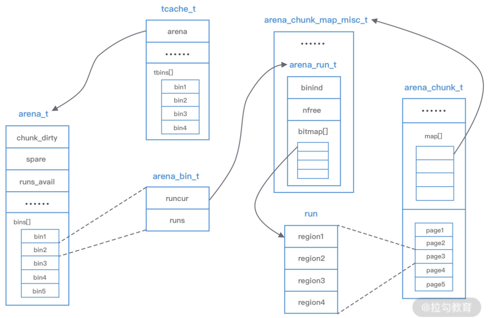
#### 多线程

想要提高多线程性能，主要通过下面 2 个方式:

1. 减少锁的竞争：缩小临界区，更细粒度的锁
2. 避免锁的竞争：线程间不共享数据，使用局部变量、线程特有数据(tsd)、线程局部存储(tls)等

jemalloc 会创建多个 arena，每个线程由一个 arena 负责, 但arena最多是cpu 核数*4。每个线程分配时会首先调用 arena_choose() 选择一个 arena 来负责该线程的分配。

当选择完 arena 后，会将 arena 绑定到 tsd 中，之后会直接从 tsd 中获取 arena。tsd 用于保存每个线程特有的数据，主要是 arena 和 tcache，避免锁的竞争。

多线程情况下tcache 用于 small 和 large 的分配， tcache 中有多种 bin，每个 bin 管理一个 size class; 如果请求分配内存的大小小于 arena 中的最小的 bin，那么优先从线程中对应的 tcache 缓存中进行分配。

如果请求分配内存的大小大于 arena 中的最小的 bin，但是不大于 tcache 中能够缓存的最大块，依然会通过 tcache 进行分配，但是不同的是此时会分配 chunk 以及所对应的 run

当请求分配内存的大小大于tcache 中能够缓存的最大块，但是不大于 chunk 的大小，那么将不会采用 tcache 机制，直接在 chunk 中进行内存分配。

Huge 场景，如果请求分配内存的大小大于 chunk 的大小，那么直接通过 mmap 进行分配，调用 munmap 进行回收。

### 总结

ptmalloc的主要瓶颈时当多线程申请分配内存时需要申请分配区的锁, 这会制约多线程的性能瓶颈。

brk分配内存缺陷是必须连续释放, 这可能导致已分配的内存长期得不到释放; mmap的缺陷是可能触发缺页中断带来性能问题

ptmalloc的核心结构是chunk和bin, chunk可认为是链表节点, bin分为四种。fastbin用做缓冲, 释放的chunk会先放到unsorted bin

多线程时ptmalloc引入分配区的概念, 子线程的内存由mmap分配, 当线程尝试获取内存时会先基于锁尝试申请申请分配区再分配内存

TCMalloc主要解决了ptmalloc在多线程分配上的效率问题, 三层次Thread cache, central, cache, 后两级需要加锁访问。

小内存分配的threadCache对每个线程都维护一个, 这提高了多线程下小对象内存分配的效率

以上内存管理机制大多倾向小内存分配和管理, 对大块内存直接使用mmap系统调用, 引发缺页中断,。此外由于使用的内存对齐, 这个分配器的最小粒度都是以8/16字节为单位的，所以频繁分配过小的内存如int, bool，仍然会浪费空间。

大量小数据分配的时候可以用数组自己维护一个内存池，可以减少很多的内存浪费。多线程下对于比较大的数据结构，为了减少分配时的锁争用，也最好是自己维护内存池。都是为了遵循先分配后使用的原则。