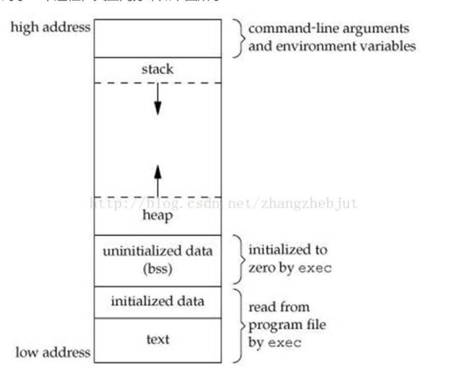
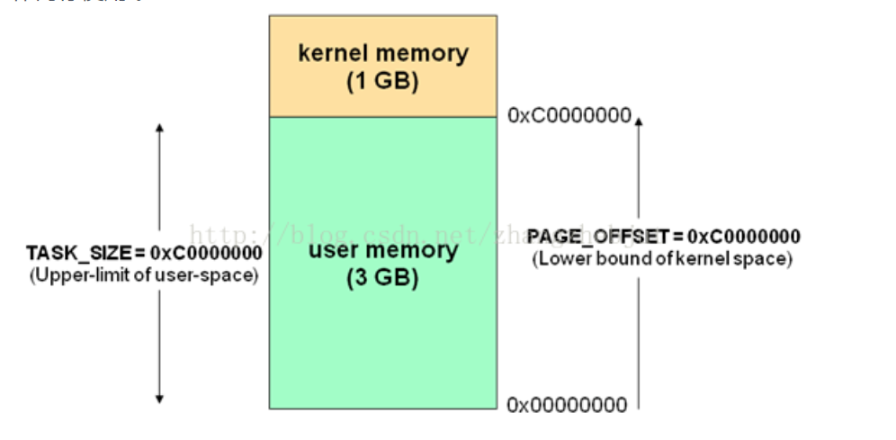
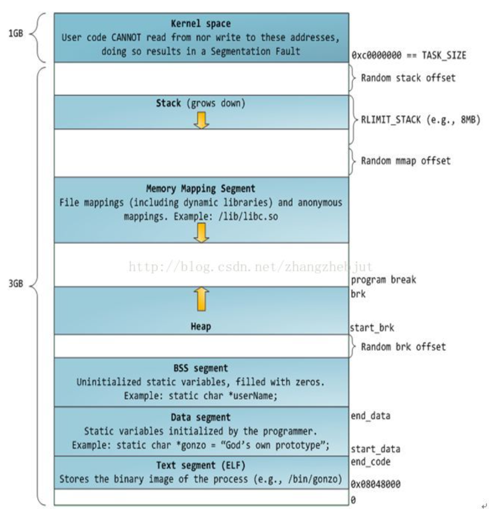

### 前向声明和循环引用

#### 前向声明

起因是C++成员函数做友元遇到的问题，程序如下
```cpp
class GoodGay;

class Building
{
friend void GoodGay::visit1();  // 错误

public:
   string SittingRoom;
   Building()
   {
   	SittingRoom = "客厅";
   	BedRoom = "卧室";
   }
private:
   string BedRoom;	

};

class GoodGay
{
public:
   Building *building;
   GoodGay()
   {
   	building = new Building; // 创建了一个指针在堆区 用building指针来维护
   }
   void visit1()
   {
   	cout <<"visit1 正在访问："<<building->SittingRoom<<endl;
   	cout <<"visit1 正在访问："<<building->BedRoom<<endl;
   }
   void visit2()
   {
   	cout <<"visit2 正在访问："<<building->SittingRoom<<endl;
   	//cout <<"visit2 正在访问："<<building->BedRoom<<endl;
   }
};
```
上述代码显示`使用了未定义的类型GoodGay`。原因在于   
`class GoodGay;`只是一个前向声明，在声明之后，定义之前，此类是一个不完全类型(incompete type)，即已知向前声明过的类是一个类型，但不知道包含哪些成员。**不完全类型只能以有限方式使用，不能定义该类型的对象，不完全类型只能用于定义指向该类型的指针及引用，**或者用于声明(而不是定义)使用该类型作为形参或返回类型的函数。
<!-- more -->
如果我们将class goodgay放到building的前面，
```cpp
class Building;

class GoodGay
{
public:
	Building *building;
	GoodGay()
	{
		building = new Building; // 创建了一个指针在堆区 用building指针来维护
	}
	void :visit1()
	{
		cout <<"visit1 正在访问："<<building->SittingRoom<<endl;
		cout <<"visit1 正在访问："<<building->BedRoom<<endl;
	}
	void visit2()
	{
		cout <<"visit2 正在访问："<<building->SittingRoom<<endl;
		//cout <<"visit2 正在访问："<<building->BedRoom<<endl;
	}
};

class Building
{
	friend void GoodGay::visit1();
public:
	string SittingRoom;
	Building()
	{
		SittingRoom = "客厅";
		BedRoom = "卧室";
	}
private:
	string BedRoom;	

};
```
该段代码还是会报错，因为Buildling类在class Goodgay中现在还是**不完全类，不完全类只能用作指针或者引用，或者用于声明(而不是定义)**, 使用该类型作为形参类型或返回类型的函数以外的操作。也就是说`building->SittingRoom`是不对的。

以上就是C++先用.h文件声明类变量和函数的原因，防止出现不完全类，下列代码没有问题。.h文件中因为是不完全类, 类名只用于定义指针。而针对类具体的使用, 放到.cc实现文件中

```cpp
class Building;

class GoodGay  // 先声明好GoodGay
{
public:
   Building *building;  // 定义一个指针
   GoodGay();
   void visit1();
   void visit2();
};

class Building
{
   friend void GoodGay::visit1();
public:
   string SittingRoom;
   Building()
   {
   	SittingRoom = "客厅";
   	BedRoom = "卧室";
   }
private:
   string BedRoom;	

};

GoodGay::GoodGay()
{
   building = new Building; // 创建了一个指针在堆区 用building指针来维护
}
void GoodGay::visit1()
{
   cout <<"visit1 正在访问："<<building->SittingRoom<<endl;
   cout <<"visit1 正在访问："<<building->BedRoom<<endl;
}
void GoodGay:: visit2()
{
   cout <<"visit2 正在访问："<<building->SittingRoom<<endl;
   //cout <<"visit2 正在访问："<<building->BedRoom<<endl;
}
```
友元类也要设置一个前向声明

#### include循环引用

不能A #include B, B #include A, 不然循环引用编译不过

#### 作用域嵌套

内部作用域能看到外部域的变量, 外部不能看到内部

```cpp
namespace na
{
    namespace nb
    {
        int a;
    }
    namespace nc
    {
        int b = nb::a; // namespace nc是可以使用na的作用域的
    }
}
```
自然的, for循环等也可以看成作用域。但lambda表达式使用外部对象需要capture, enum内部不算作用域, 以下代码编译错误
```cpp
enum FileAccess {
Read = 0x1,
Write = 0x2,
};

enum FileShare {
Read = 0x1, // 重定义
Write = 0x2, // 重定义
};
```

### 进程地址(内存)空间

### thread创建没有join()和detach

可以把`thread`看成一个对象, 创建thread没有join()或者detach会导致thread对象析构失败。

```cpp
std::thread t1(f);   // 栈上创建对象

std::thread *t2 = new std::thread(f);  // 堆上创建对象

//t->join();
//t.detach();
delete t2;
// 没有调用join或detach导致析构失败

terminate called without an active exception
Aborted
```

对于每个进程, 其地址空间可如下所示


* 程序段(Text):程序代码在内存中的映射，存放函数体的二进制代码。

* 初始化过的数据(Data):在程序运行初已经对变量进行初始化的数据。

* 未初始化过的数据(BSS):在程序运行初未对变量进行初始化的数据。

* 栈 (Stack):存储局部、临时变量，函数调用时，存储函数的返回指针，用于控制函数的调用和返回。在程序块开始时自动分配内存,结束时自动释放内存，其操作方式类似于数据结构中的栈。

* 堆 (Heap):存储动态内存分配,需要程序员手工分配,手工释放.注意它与数据结构中的堆是两回事，分配方式类似于链表。

#### 用户空间和内核空间

32位Linux的虚拟地址空间范围为0～4G，Linux内核将这4G字节的空间分为两部分，将最高的1G字节（从虚拟地址0xC0000000到0xFFFFFFFF）供内核使用，称为内核空间。而将较低的3G字节（从虚拟地址0x00000000到0xBFFFFFFF）供各个进程使用，称为用户空间。注意虚拟空间连续的内存，物理空间可能不连续。

内核空间中存放的是内核代码和数据，而进程的用户空间中存放的是用户程序的代码和数据。(该进程理论上执行的代码包括用户代码+内核代码)。**每个进程都会认为自己可以访问4G空间，但实际上内核空间所有进程共享, 每个进程使用的地址0x00实际的物理地址也不同**。操作系统可以保证这些进程自由运行而不相互干扰。虚拟地址通过页表（page table）映射到物理内存，页表由操作系统维护并被处理器引用。每个进程都拥有一套属于它自己的页表。

在内核空间的指令运行在较高的特权级别上, 可以访问所有的硬件设备; 用户空间的应用程序只能看到允许它们使用的部分系统资源。




完整的进程内存布局

注意这是虚拟内存地址空间范围, 与操作系统有关, 与硬件无关


#### 栈

栈用于存储函数参数和局部变量。栈中的基本存储单位是栈帧，也就是调用的方法, 如main()方法。调用一个方法或函数会将一个新的栈帧（stack frame）压入到栈中，这个栈帧会在函数返回时被清理掉(连同方法内部的变量)。

不断向栈中压入数据，超出其容量就会耗尽栈所对应的内存区域，这将触发一个页故障（page fault），而被Linux的expand_stack()处理，它会调用acct_stack_growth()来检查是否还有合适的地方用于栈的增长。如果达到了最大栈空间的大小，就会栈溢出（stack overflow），程序收到一个段错误（segmentation fault）。

####  内存映射段

内存映射段中，内核将文件的内容直接映射到内存。任何应用程序都可以通过Linux的mmap()系统调用请求这种映射。内存映射是一种方便高效的文件I/O方式，所以它被用来加载动态库。

普通文件被映射到进程地址空间后，进程可以像访问普通内存一样对文件进行访问，不必再调用read()/write()等操作。显然这也是扩充内存的一种方式。

#### 堆

堆用于存储那些生存期与函数调用无关的数据。在C语言中，堆分配的接口是malloc()函数。如果堆中有足够的空间来满足内存请求，它就可以被语言运行时库处理而不需要内核参与，否则，堆会被扩大，通过brk()系统调用来分配请求所需的内存块。堆在分配过程中可能会变得零零碎碎。分配方式类似于链表。堆的分配效率低于栈, 处理逻辑复杂。

#### BBS和数据段

BSS和数据段保存的都是静态（全局）变量的内容。区别在于BSS保存的是未被初始化的静态变量内容, 数据段保存在源代码中已经初始化的静态变量的内容。

### 字节

#### 结构体字节对齐

```cpp
#include<stdio.h>
struct
{
    int i;    
    char c1;  
    char c2;  
}x1;

struct{
    char c1;  
    int i;    
    char c2;  
}x2;

struct{
    char c1;  
    char c2; 
    int i;    
}x3;

struct{
    char c1; 
    short c3; 
    int i;    
}x4;

struct{
    char c1;  
    char c2; 
    char c3;    
}x5;


struct{
    int c1;  
    char c2; 
    short c3;    
    char c4;
}x6;


int main()
{
    printf("%d\n",sizeof(x1));  // 输出8
    printf("%d\n",sizeof(x2));  // 输出12
    printf("%d\n",sizeof(x3));  // 输出8
    printf("%d\n",sizeof(x4));  // 输出8
    printf("%d\n",sizeof(x5));  // 输出3
    printf("%d\n",sizeof(x6));  // 输出3
    return 0;
}
```

结构体第一个成员的偏移量（offset）为0，每个成员相对于结构体首地址的 offset 都是该成员大小与有效对齐值中较小那个的整数倍。对于x4, 较小的整数是1字节, 而x1~x3为4字节。因此x4对齐大小为1byte, x1~x3为4byte.

结构体的总大小为对齐值的整数倍

字节对齐的原因是, 尽管内存是以字节为单位，但大部分处理器并不是按字节块来存取内存的.它一般会以双字节,四字节,8字节,16字节甚至32字节为单位来存取内存

基本类型的对齐值就是其sizeof值; 换言之只有结构体才会出现填充空间这种情况

* 调整结构体字节对齐

gcc, attribute((packed))，让所作用的结构体取消在编译过程中的优化对齐，按照实际占用字节数进行对齐

attribute((aligned (n)))，让所作用的结构体成员对齐在n字节边界上。如果结构体中有成员变量的字节长度大于n，则按照最大成员变量的字节长度来对齐
```cpp
#include <stdio.h>

struct person0{
    char *name;
    int age;
    char score;
    int id;
};

struct person1{
    char *name;
    int age;
    char score;
    int id;
}__attribute__((packed));

struct person2{
    char *name;
    int age;
    char score;
    int id;
} __attribute__((aligned (4)));

int main(int argc,char **argv)
{
    printf("size of (struct person0) = %d.\n",sizeof(struct person0));
    printf("size of (struct person1) = %d.\n",sizeof(struct person1));
    printf("size of (struct person2) = %d.\n",sizeof(struct person2));
    return 0;
}

// 输出
size of (struct person0) = 24.
size of (struct person1) = 17.
size of (struct person2) = 24
```

#### C/C++ 指定类型大小

变量声明加冒号, 表示一次占用几个bit, 不再采用int等默认的4字节
```cpp
struct bs
{
int a:8;
int b:2;
int c:6;
};
```

#### 字节序

例如, 0x2211使用两个字节储存：高位字节是0x22，低位字节是0x11。

大端字节序: 高位字节在前(左)，低位字节在后(右)，这是人类读写数值的方法。
小端字节序: 低位字节在前，高位字节在后，即以0x1122形式储存。

计算机地址到高来给变量寻址, 先寻找变量低位再寻找高位对于计算是方便的。这就是小端字节序。

除了计算机的内部处理，在不需要计算的场合几乎都是大端字节序，比如网络传输和文件储存。换言之, 只有内存存储采用小端序, 因此CPU处理需要访存, 持久化设备存储使用大端序。

### const深探

首先const皆指针有三种形式, 因为引用绑定在变量上因而const&就表示引用的变量不可更改

理解指针声明*是左匹配(解引用时是右匹配, *p), **const紧跟数据类型**
`const int* p`, const紧跟数据类型, 数据类型是int, 则int不可更改。换句话说就是不能通过指针p改变p所指向的那块内存里, 但是可以让指针p指向别的地址

`int const* p`, const紧跟数据类型, 数据类型是int, 这和`const int* p`意义一样

`int* const p`, const紧跟数据类型, 数据类型只能是`int*`指针类型了, 意思是p指针本身是一个常量，不能改变指针本身，但可以改变指针指向的那块内存里的数据

const修饰的由于是一个常量, 通常不划分内存而是存在于符号表中, 只有引用到const变量时才会修改那块内存(写时复制), 但修改内存也不能修改const变量, 原因很简单, const变量存在符号表里(一个全局只读内存区)
```cpp
// 在main内部
int main() {
    //可通过编译, 作用域相同
    int n = 5;
    int array[n];

    return 0;
}
// 在main外部

// 不加const不可通过编译, 因const变量存在全局区和全局变量作用域相同
// 加了const可通过编译
const int SIZE = 100;
int  array[SIZE];

// 类里面必须static const才能通过编译
class Test {
    
    // 不可通过编译
    const int SIZE = 100;
    // 加了static const可通过
    static const int SIZE = 100;
    // 去了const也不可通过编译
    static int SIZE = 100;
    int  array[SIZE];
};

类成员变量如果设置static在静态变量区，否则依存对象存储, sizeof返回的只是编译时期的理论空间, 运行时才会实际分配内存。

C++中用const定义了一个常量后，不会分配一个空间给它，而是将其写入符号表(symbol table),这使得它成为一个编译期间的常量，没有了存储与读内存的操作，使得它的效率也很高。由于const修饰的是常量, 因此定义时候必须初始化。这称为constant folding

当对const变量取地址，C++编译器会为const变量开辟一块儿内存空间，但还是会在符号表中取const值, 指针操作内存不能影响符号表中const的值

C语言的const存在内存中, 通过指针是可以修改的, 不存在符号表, 不能存在符号表中。这个const作用只是说明元素不能修改, 但你想改还是可以改(类似python类的私有成员)
```cpp
// 全局区
const int a = 5;
int array[a];//在C语言中是错误的，因为在C语言中是定义了一个只读变量
int array[a];//在c++中是正确的，因为在C++中定义了一个常量

// C++
int main()
{
    const int a  = 2;
    int* p = (int*)(&a);
    *p = 30;
    printf("%x\n",&a);
    printf("%x\n",p);
    printf("%i\n",a);  // a不改
    printf("%i\n",*(&a));
    printf("%i\n",*p);
    return 0;
}
/*运行结果
61fe14
61fe14
2
2
30

// C语言
#include <stdio.h>
int main()
{
    const int a  = 2;
    int* p = (int*)(&a);
    *p = 30;
    printf("%x\n",&a);
    printf("%x\n",p);
    printf("%i\n",a);  // a不改
    printf("%i\n",*(&a));
    printf("%i\n",*p);
    return 0;
}
// 输出
eaf2e5bc
eaf2e5bc
30
30
30
```

static全局变量,   **static修饰的全局变量的作用域只能是本身的编译单元**。链接时其他编译单元使用它时，只是简单的把其值复制给了其他编译单元，其他编译单元会另外开个内存保存它，**在其他编译单元对它的修改并不影响本身在定义时的值**。即在其他编译单元A使用它时，它所在的物理地址，和其他编译单元B使用它时，它所在的物理地址不一样，**A和B对它所做的修改都不能传递给对方**。

类内static变量只是声明, 需要在.cpp中重新定义一下。类普通成员变量相当于声明+定义。声明：是指出存储类型，并给存储单元指定名称。 2. 定义：是分配内存空间，还可为变量指定初始值。所谓使用, 就是将变量参加到表达式操作中, 使用前必须定义, 因为使用的变量必须在地址上分配内存。

```cpp
#include <stdio.h>

int main(int argc, char *argv[])
{
    int n;
    scanf("%d", &n);
    printf("%#x \n", &n);
    int a[n];
    printf("size: %d\n", sizeof(a)); // 未退化成指针
    for (int i = 0; i < n; i++) {
        a[i] = i;
        printf("%d \n", a[i]);
        printf("%#x \n", a+i);
    }

    return 0;
}

3
0xbbdc1300 
size: 12
0 
0xbbdc12e0 
1 
0xbbdc12e4 
2 
0xbbdc12e8
```

#### 类内初始化

一般类中变量的初始化设置在构造函数中, 但也有可以直接像java那样在类内初始化成员变量，不同c++版本的要求不一样。

cpp98, 大多数cpp98要求在**类内只声明+定义, 但初始化列表中初始化变量**。注意static必须类外定义和初始化

| type | normal | const | static | static const 
|  ----  | ----  | ---- | ----   | ----
| 在声明时初始化  | x | x | x | x（只有静态常量整型才可以）
| 初始化列表中初始化 | √ | √ | x | x
| 构造函数内初始化 | √ | x | x | x
| 类外初始化 | x | x | √ | √

cpp11 之后可声明定义初始化普通成员变量。然而还是**尽量在类内部只声明, 在成员初始列中初始化变量**。

| type | normal | const | static | static const 
|  ----  | ----  | ---- | ----   | ----
| 在声明时初始化  | √ | x | x | x（只有静态常量整型才可以）
| 初始化列表中初始化 | √ | √ | x | x
| 构造函数内初始化 | √ | x | x | x
| 类外初始化 | x | x | √ | √

```cpp
class A {
public:
  int a_;
  static std::atomic<int> b_;   // 类内声明
};

std::atomic<int> A::b_; // 类外定义, 作为多线程共享变量


void thread_exec () {
  std::cout << A::b_ <<"\n";
}

int main ()
{
 //std::cout << sizeof(b) <<"\n";
 A::b_ = 1;
  std::cout << A::b_ <<"\n";
    std::thread th = std::thread(thread_exec);
  th.join();  // 主线程等待th结束
  return 0;
}

输出
1
1
```

#### g++版本和支持

C++17, gcc7完全支持，gcc6和gcc5部分支持，gcc6支持度当然比gcc5高，gcc4及以下版本不支持。

C++14: gcc5就可以完全支持，gcc4部分支持，gcc3及以下版本不支持。

C++11：gcc4.8.1及以上可以完全支持。gcc4.3部分支持，gcc4.3以下版本不支持。

#### brk/sbrk 堆内存分配

linux中几种管理内存的方式有：`STL`，`new/delete`，`malloc/free`，`brk/sbrk`，`mmap/unmap`

brk/sbrk：提供底层的内存分配函数, 共同维护系统的一个指针，主要用于对同类型的大块数据的动态存放，效率比malloc更高。

mmap往往目的是进行文件写，将数据写入到文件中, 例如数据库存储写入数据。较fread, fwrite它可以节省一次拷贝, 直接读写文件缓存不经过I/O缓冲这一层

```cpp
#include <unistd.h>
int brk(void *addr);
void *sbrk(intptr_t increment);
```

brk：分配空间,释放空间,对参数中 addr 做绝对位置调整，调动指针左右移动，左移-释放空间，右移-分配空间。即将内存页的末尾移动到 addr 指针指向的位置

sbrk：以当前位置为开始，将内存页的位置移动increment个偏移量; 如果内存分配失败，二者都返回-1

phead和pnow之间的内存空间才是合法内存，在没有分配空间的地方存取数据会发生段错误，在合法内存之外存取数据会发生越界，导致不可预知的错误。

每个进程可访问的虚拟内存空间为3G(用户空间3G)，在程序编译时，系统只分配并不大的数据段空间，称为1页，共4096字节，如果这块空间不够，就使用sbrk函数将数据段的下界移动，获得新的空间，这也是malloc的原理。

```cpp
#include <stdio.h>
#include <unistd.h> // 使用brk/sbrk，需要使用这个头文件
int main()
{
    //存放数据
    int i = 2;
    int* phead; // 指向首位置
    int* pnow; // 指向当前指针位置
    pnow = sbrk(0); // 先分配空闲区域
    phead = pnow; // 固定首位置不变
    printf("pnow addr: %p\n", pnow);    // %p打印地址
    printf("phead addr: %p\n", phead);
    for(i=2; i<10; i++)
    {
        if(i > 5) // 该函数用于判断是否是素数
        {
           brk(pnow+4);// 堆的边界扩展
            *pnow = i; // 在pnow地址起始处存入数据
            pnow = sbrk(0); // pnow指向系统指针位置, 注意堆地址向上增长, sbrk(0)也一直在增长
            printf("pnow addr: %p\n", pnow);
        }
    }

    printf("pnow addr: %p\n", pnow);
    printf("phead addr: %p\n", phead);

    //打印数据
    pnow = phead; // phead为堆起始指针
    while(pnow!=sbrk(0))
    {
        printf("%d\n",*pnow);
        pnow = pnow+4;
    }
    brk(phead); // brk指向phead 释放空间
}

// 输出

pnow addr: 0x560e88e3f000
phead addr: 0x560e88e3f000
pnow addr: 0x560e88e3f004
pnow addr: 0x560e88e3f008
pnow addr: 0x560e88e3f00c
pnow addr: 0x560e88e3f010
pnow addr: 0x560e88e3f010
phead addr: 0x560e88e3f000
6
7
8
9
```


* brk通过传递的addr来重新设置program break，成功则返回0，否则返回-1。而sbrk用来增加heap，增加的大小通过参数increment决定，返回增加大小前的heap的program break，如果increment为0则返回program break。

* brk和sbrk维护的都是上述program break这一个指针

* brk和sbrk分配的堆空间类似于缓冲池，每次malloc从缓冲池获得内存，如果缓冲池不够了，再调用brk或sbrk扩充缓冲池，直到达到缓冲池大小的上限，free则将应用程序使用的内存空间归还给缓冲池。

```cpp
#include <stdio.h>
#include <unistd.h>
#include <stdlib.h>

int main(void)
{

        void* tstart = sbrk(0); //  起始地址
        printf ("heap start: %p\n", tstart);

        char* pmem = (char *)malloc(64);  //分配内存, 返回起始地址
        if (pmem == NULL) {
                perror("malloc");
                exit (EXIT_FAILURE);
        }
        printf ("pmem:%p\n", pmem);
        
        void *tend = sbrk(0);
        printf("head end: %p\n", tend);
        if (tend != (void *)-1)  // (void*) - 1 意思是是把-1转换成指针0xFFFFFFFF
                printf ("heap size on each load: %p\n", tend - tstart);
        free(pmem);
        return 0;
}
// 输出
heap start: 0x557d91ec8000
pmem:0x557d91ec8670
head end: 0x557d91ee9000
heap size on each load: 0x21000
```
* 事实上malloc只是分配了大块内存, 将`char* pmem = (char *)malloc(64)`改为`char* pmem = (char *)malloc(4)`, `tend` - `tstart`也是不变的。

* 当使用 malloc() 分配过大的空间，malloc 不再从堆中分配空间，而是使用 mmap() 这个系统调用从映射区寻找可用的内存空间。

#### mmap 虚拟内存映射

mmap用于内存映射，也就是将一段区域映射到自己的进程地址空间中，分为两种：1. 文件映射： 将文件区域映射到进程空间，文件存放在存储设备上；2. 匿名映射：没有文件对应的区域映射，内容存放在物理内存上；

`void* mmap ( void * addr , size_t len , int prot , int flags ,int fd , off_t offset )` 内存映射函数mmap, 负责把文件内容映射到进程的虚拟内存空间, 通过对这段内存的读取和修改，来实现对文件的读取和修改,而不需要再调用read，write等操作。

文件I/O一般先把文件读取到文件缓冲区中, 再从缓冲区拿数据(两次拷贝)。`mmap`实际是对缓冲区做了映射，免去了先读到缓冲区这一步(只需要一次拷贝)。

当进程发起对这片映射空间的访问，引发缺页异常，实现文件内容到物理内存（主存）的拷贝。mmap是用户态虚拟内存换页的核心, 增加内存空间等都可以归结为mmap映射

1. 私有匿名映射： 通常分配大块内存时使用，堆，栈，bss段等；
2. 共享匿名映射：常用于父子进程间通信，在内存文件系统中创建/dev/zero设备；
3. 私有文件映射：常用的比如动态库加载，代码段，数据段等；
4. 共享文件映射：常用于进程间通信，文件读写等；

```cpp
#include <sys/mman.h>

void *mmap(void *addr, size_t length, int prot, int flags,
            int fd, off_t offset);
int munmap(void *addr, size_t length);

The prot argument describes the desired memory protection of the
 mapping

PROT_EXEC
        Pages may be executed.
PROT_READ
        Pages may be read.
PROT_WRITE
        Pages may be written.
PROT_NONE
        Pages may not be accessed.

The flags argument determines whether updates to the mapping are
       visible to other processes mapping the same region
MAP_SHARED
Share this mapping.  Updates to the mapping are visible to
other processes mapping the same region

MAP_PRIVATE
Create a private copy-on-write mapping.  Updates to the
mapping are not visible to other processes mapping the
same file
```

### 总结

前向声明和#include循环依赖, #include循环依赖会导致编译错误。作用域嵌套, 内部可以看到外部域变量

进程地址空间, Text, Data, bss, stack, heap

字节对齐, attribute((packed))和attribute((aligned(n)))。声明冒号指令类型占有的bit数量。大端字节序和小端序

const修饰指针, 紧跟数据类型。C++和C const的不同

类内初始化成员变量, static需要类内声明外部定义。定义意味着分配空间, 使用意味着变量参与表达式运算

gcc4.8, gcc 5, gcc 7

mmap内存映射, 主要用于进程通信和文件读写, 较I/O 流减少一层缓冲拷贝
