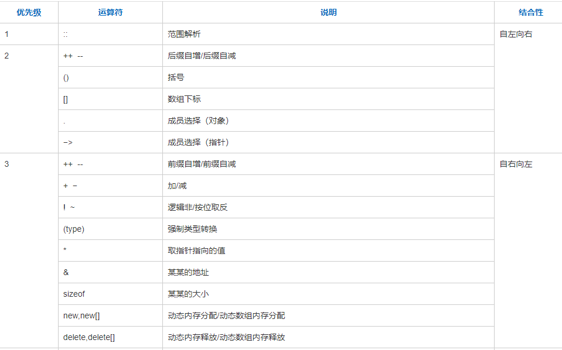
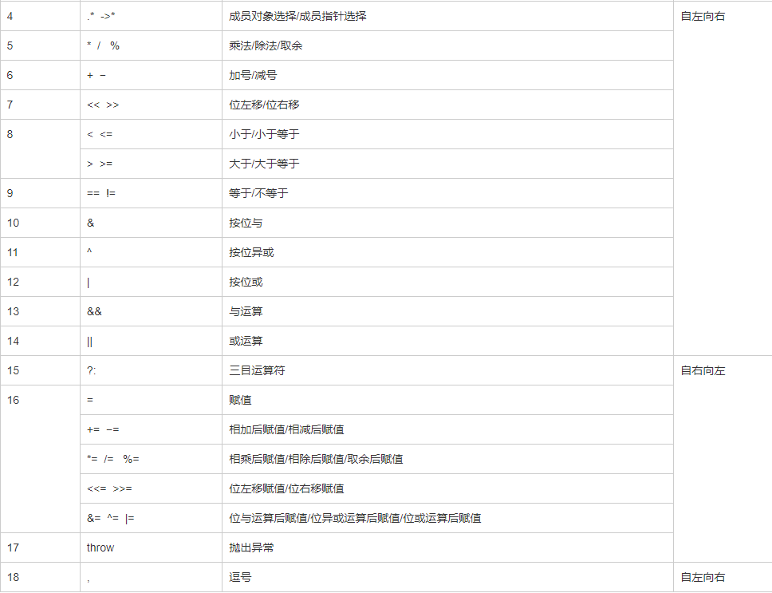

### 运算符

运算符优先级体现在编译器生成语法表达式树的结合顺序，可以认为顺序语句由若干运算符和左右值字段组成, 一个{}内部包括若干由分号; 分隔的顺序语句。顺序语句的执行顺序取决于生成的语法表达式树AST

多扯一下，编译前端(也就是包括生成语法分析树之前的步骤）比较有规则性，往往可以通过特定工具生成（而且编程语言一共就那几个)。编译器后端需要考虑不同处理器，指令集，内存等的执行和优化(不同类型的硬件层出不穷)，往往是编译器研发的大头。

需要注意重载运算符被编译成表达式, 因而重载参数数量是固定的，二元运算符要求左右有且只有一个参数，不然编译不过。这没有函数那样自由，参数随便设置，因为函数是作为表达式右值直接编译成二进制指令。
#### C/C++符号优先级


范围::优先级最高, 比数组下标高。数组下标操作符优先级比解引用* 高。自增操作符比解引用低, 比取地址操作符高


算术操作符+-, 高于按位操作符&, | , 高于逻辑操作符&&, ||

#### 前缀和后缀自增

使用自增自减操作符时, int 在括号内是为了向编译器说明这是一个后缀形式，而不是表示整数。

前缀形式重载调用 Check operator ++ () ，后缀形式重载调用 operator ++ (int)。
```cpp
class A{
public:
    A operator++() {
        cout << "前缀递增"<<"\n";
    }

    A& operator++(int) {
        cout << "后缀递增" << "\n";
    }

    friend A operator++(const A&);
};

A operator++(const A& a, int) {
    cout << "友元后缀递增" << "\n";
}

int main() {
    //A* a = new A();
    // delete a;
    A a;
    a++;
    ++a;
}
输出：

后缀递增
前缀递增
```

#### 二元操作符

二元操作符指运算符左右两侧都有对象, 例如`a+b`, 这种operator参数比较容易理解
```cpp
class A
{
    private:
        int a;
    public:
            A();
            A(int n);
            A operator+(const A & obj);
            A operator+(const int b);
    friend A operator+(const int b, A obj); // 注意友元函数不是成员函数, 而是声明别的函数是这个类的友元
            void display(); 
};

A A::operator +(const A& obj)//重载+号用于 对象相加 
{
    return this->a+obj.a;
}
A A::operator+(const int b)//重载+号用于  对象与数相加
{
    return A(a+b);
}
A operator+(const int b,  A obj)
{
    return obj+b;//友元函数调用第二个重载+的成员函数  相当于 obj.operator+(b); 
}
```

#### 箭头->和解引用一元运算符*

一元操作符->, *, `重载方式为operator*()`形式, 这是重载函数没有参数
```cpp
class A
{
public:
    A(int p)
        : p_(p),
          pinc_(p+1)
    {}
    int operator*();
    A* operator->();
    int* operator&();

    friend int operator*(const A&);

    int p_;
    int pinc_;
};

int A::operator*() {
    return this->p_;
}

A* A::operator->() {
    return this;
}

int* A::operator&()
{
    return &this->p_;
}

int operator*(const A& a)
{
    return a.pinc_;
}
int main() {
    A a(1);
    cout << *a << "\n";
    cout << a->p_ << "\n";
    cout << &a << "\n";
    return 0;
}
输出
1
1
0x7fff136109b0
```

注意运算符`->`,`*`,`&`,`.`都是一元运算符, 编译器会根据传入参数与二元运算符乘法*, 位与&区分开。

#### 输入输出运算符<< >>

注意参数和返回值类型都是左值引用`istream &operator>>( istream  &input, Distance &D )`的原因是, 可以实现连续运算符操作例如`cin>>a>>b;`, 同理于`operator=`
```cpp
class Distance
{
    private:
        int feet;             // 0 到无穷
        int inches;           // 0 到 12
    public:
        // 所需的构造函数
        Distance(){
            feet = 0;
            inches = 0;
        }
        Distance(int f, int i){
            feet = f;
            inches = i;
        }

        // 也可以用友元函数
        friend ostream& operator<<( ostream  &os, Distance &D );
};

ostream& operator<<( ostream  &os, Distance &D )      // 输入流
{ 
    os << D.feet << D.inches;
    return os;            
}

int main ()
{
    Distance d1(20,18);
    cout << d1 << "\n";  // 其实是修改ostream对象, 然后将ostream打印
}

// 输出2018
```

#### 函数调用运算符重载

注意函数调用运算符是`operator()`, 结果就是两个括号
```cpp
// 重载函数调用运算符
Distance operator()(int a, int b, int c)
{
    Distance D;
    // 进行随机计算
    D.feet = a + c + 10;
    D.inches = b + c + 100 ;
    return D;
}
```

### new 运算符


`operator new`和`operator delete`可以作为类的成员函数重载, 实现对类对象内存的分配控制。可以说new构造对象是通过调用类的operator new实现的，所以operator new比较特殊, 它不是通过对象调用的, 而是返回对象的指针

所谓的placement new, 是对operator new运算符的重载。

`operator new`有三种参数格式
```cpp
throwing (1)    
void* operator new (std::size_t size) throw (std::bad_alloc);

nothrow (2) 
void* operator new (std::size_t size, const std::nothrow_t& nothrow_value) throw();

placement (3)   
void* operator new (std::size_t size, void* ptr) throw();
```

前两种的区别仅是是否抛出异常，当分配失败时，前者会抛出bad_alloc异常，后者返回null，不会抛出异常。它们都分配一个固定大小的连续内存。
```cpp
A* a = new A; //调用throwing(1)
A* a = new(std::nothrow) A; //调用nothrow(2)
```

第三种重载方式就是placement new, 所以说placement new只是operator new的一种重载方式。placement new的执行忽略了size_t参数，只返还第二个参数`void *p`。其结果是允许用户让一个对象在指定的地址直接构造对象。

```cpp
// placement new

#ifndef __PLACEMENT_NEW_INLINE
#define __PLACEMENT_NEW_INLINE
inline void *__cdecl operator new(size_t, void *_P)
        {return (_P); }
#if     _MSC_VER >= 1200
inline void __cdecl operator delete(void *, void *)
    {return; }
#endif
#endif

// 调用placement new
pi = new (ptr) int;    //placement new
```

使用时括号里的参数ptr是一个指针，它指向一个内存缓冲器，placement new将在这个缓冲器上构造一个对象。换句话说, placement new是给定一块内存(提前分配好的缓存), 它在这块指定内存上创建对象。

#### 重载operator new运算符

operator new作用是分配内存, 内部可以调用malloc

重载`operator new`只需要写固定格式的`void* operator new(std::size_t size)`类成员函数即可, size是自适应的, 根据对象应该分配的空间编译器自动设置好。

```cpp
#include <iostream>

class Foo {
public:
    void* operator new(std::size_t size)
    {
        std::cout << "operator new/ size:" << size<< std::endl;
        return std::malloc(size);
    }

    int a;
    int b;
};

int main()
{
 Foo* m = new Foo;
 std::cout << sizeof(m) << std::endl;
 delete m;
 return 0; 
}

输出
operator new/ size:8
8
```

operator new 运算符成员函数返回值必须为`void*`, 第一个参数必须是`std::size_t size`, 但还可以增加其他参数。当增加一个`void* ptr`指针参数, 就变成了placement new


下面这段代码可以看出placement new的作用。先用operator new开辟空间(或者用malloc也行), 然后用这块空间来初始化新对象。

```cpp
class Foo {
public:
    Foo(int a) 
       : a_(a) 
    {}
    void* operator new(std::size_t size)
    {
        std::cout << "operator new/ size:" << size<< std::endl;
        return std::malloc(size);
    }

    void* operator new(std::size_t size, void* ptr)
    {
        std::cout << "placement new" << std::endl;
        return ptr;
    }

    int a_;
};

int main()
{
    Foo* m = new Foo(1);
    Foo* m2 = new(m) Foo(2);    // 原先的m对象被覆盖掉了
    std::cout << sizeof(m) << std::endl;
// delete m2;
    std::cout << m->a_<< "\n";
    std::cout << m2->a_<<"\n";
    delete m;
    return 0; 
}

输出
operator new/ size:4
placement new
8
2
2
```

#### operator delete

operator delete与operator new对应, 负责析构内存。
```cpp
void operator delete(void* ptr)
{
 std::cout << "operator delete" << std::endl;
 std::free(ptr);
}
```

但是一般不会重载operator delete。原因是重载后的delete不可手动调用。
```cpp
// 重载operator delete
void operator delete(void* ptr， int num)
{
 std::cout << "operator delete" << std::endl;
 std::free(ptr);
}

delete(10) p;    // 不合法的

// 重载operator new
class Foo {
public:
 void* operator new(std::size_t size, int num)
 {
  std::cout << "operator new" << std::endl;
  std::cout << "num is " << num << std::endl;
  return std::malloc(size);
 }
}

int main()
{
 Foo* m = new(100) Foo;
 std::cout << sizeof(m) << std::endl;
 delete m;
 return 0; 
}

// 输出
operator new
num is 100
8
```

#### new 关键字

值得注意的是, new关键字不等于operator new, operator new只是其中的一步。

1. 先调用operator new分配内存，如果类A重载了operator new，那么就使用该重载版本，否则使用全局版本::operatro new(size_t size)。
2. 调用构造函数，将配置得来的对象设立初值。
3. 返回对象地址

operator new的作用是分配内存, 重载版本也要分配内存(例如malloc), 或者向placement new那样直接把现有分配好的内存拿来用。如果operator new的重载版本没有分配好内存, 程序自然会崩掉。

operator new和operator delete官方接口
```cpp
void* operator new(std::size_t) _GLIBCXX_THROW (std::bad_alloc)
  __attribute__((__externally_visible__));
void* operator new[](std::size_t) _GLIBCXX_THROW (std::bad_alloc)
  __attribute__((__externally_visible__));
void operator delete(void*) _GLIBCXX_USE_NOEXCEPT
  __attribute__((__externally_visible__));
void operator delete[](void*) _GLIBCXX_USE_NOEXCEPT
  __attribute__((__externally_visible__));

// const std::nothrow_t&
void* operator new(std::size_t, const std::nothrow_t&) _GLIBCXX_USE_NOEXCEPT
  __attribute__((__externally_visible__));
void* operator new[](std::size_t, const std::nothrow_t&) _GLIBCXX_USE_NOEXCEPT
  __attribute__((__externally_visible__));
void operator delete(void*, const std::nothrow_t&) _GLIBCXX_USE_NOEXCEPT
  __attribute__((__externally_visible__));
void operator delete[](void*, const std::nothrow_t&) _GLIBCXX_USE_NOEXCEPT
  __attribute__((__externally_visible__));

// Default placement versions of operator new.
inline void* operator new(std::size_t, void* __p) _GLIBCXX_USE_NOEXCEPT
{ return __p; }
inline void* operator new[](std::size_t, void* __p) _GLIBCXX_USE_NOEXCEPT
{ return __p; }

// Default placement versions of operator delete.
inline void operator delete  (void*, void*) _GLIBCXX_USE_NOEXCEPT { }
inline void operator delete[](void*, void*) _GLIBCXX_USE_NOEXCEPT { }
```

遗憾的是只提供了接口, 无从可见官方operator new内部的实现。

#### STL分配内存

STL不使用operator new分配内存, 而是通过传入内存分配类的模板。而内存分配函数类似静态函数, 可以直接通过模板类名+函数名调用。
```cpp
  template<typename _Tp, typename _Alloc>
    struct _Vector_base
    {
      typedef typename __gnu_cxx::__alloc_traits<_Alloc>::template
	rebind<_Tp>::other _Tp_alloc_type;
      typedef typename __gnu_cxx::__alloc_traits<_Tp_alloc_type>::pointer
       	pointer;

      pointer
      _M_allocate(size_t __n)
      {
	typedef __gnu_cxx::__alloc_traits<_Tp_alloc_type> _Tr;
	return __n != 0 ? _Tr::allocate(_M_impl, __n) : pointer();
      }
};
```

### 总结

符号优先级, 范围::优先级最高, 比数组下标高。数组下标操作符优先级比解引用* 高。自增操作符比解引用低, 比取地址操作符高。这些一元操作符优先级比较高

算术操作符+-, 高于按位操作符&, | , 高于逻辑操作符&&, ||, 高于运算赋值运算符+=

自增自减有前缀后缀之分, ++i调用operator++(), i++调用operator++(int)

一元操作符括号一般没有参数, 二元要加一个参数, 注意函数调用操作符两个括号operator()()

void* operator new是 为对象分配内存时自动调用的操作符, place new相当于operator new的一个重载。但这种分配形式并不常用(除了默认情况), STL通过传入一个类模板调用类模板的静态函数来为对象分配内存