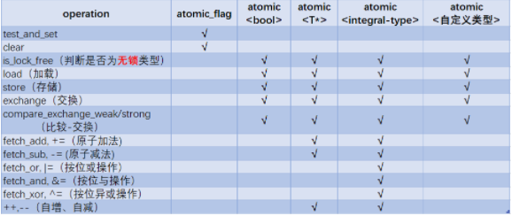

#### 原子性, 可见性, 有序性

一个操作或者多个操作，要么全部执行并且执行的过程不会被任何因素打断，要么就都不执行。这叫原子性, 一般一条汇编指令是一个原子指令, 如果一条高级语言编译成多条汇编指令, 它就可能不是原子的。

可见性, 一个线程修改了这个变量的值，其他线程能够立即看得到修改的值。可见性的障碍来源是CPU cache缓存和内存的不一致性, 线程修改了元素值可能没有刷入到内存导致其他线程看不到。Java的volatile可以解决可见性, C++的volatile不能保证可见性。

有序性, 包括编译器的重排序和CPU的指令重排序, Java的volatile两个都可以解决, C++的volatile只能处理编译器的重排序。

只有可见性和有序性有时候可以保证并发的, 这让一个全局变量是一个可被所有线程同时发现的真正的全局变量, 例如多线程设置`a=1; b = a;` 。但对于依赖的赋值形式, 即左右值同时出现了某个变量, 如设置`i = i+1`, 因此i同时是被设置值和设置值, 这时候缺乏原子性会带来问题。

单线程下编译器和CPU指令保证了有序性, 乱序执行不会影响语义。单线程自然不会有原子性和可见性的问题。

lock内部自动保证了有序性和可见性, 即获得锁保证最新数据, 释放锁前变量的修改都会写回内存, 锁内部是单线程自然不存在原子性问题, 锁内和锁外的排序不会乱，即在锁内的语句不会跑到锁外。

因而内存序主要应用在原子类中, 例如CAS语义

类似的, happens-before关系表示的不同线程之间的操作先后顺序(有序性), synchronizes-with关系表示一个线程修改某变量的之后的结果能被其它线程可见。synchronizes-with可以理解成有序性+可见性

C++原子类的内存序, acquire-release直接保证了store和load之间指令的有序性和可见性。memory_order_acquire用来修饰一个读load操作, memory_order_release修饰写操作store。memory_order_acq_rel对load, store都可以修饰

<!-- more -->

#### 一些定义

Sequenced-before, Within the same thread, evaluation A may be sequenced-before evaluation B

* Simply happens-before

Regardless of threads, evaluation A simply happens-before evaluation B if any of the following is true:
1. A is sequenced-before B
2. A synchronizes-with B
3. A simply happens-before X, and X simply happens-before B

* Strongly happens-before

Regardless of threads, evaluation A strongly happens-before evaluation B if any of the following is true:

1. A is sequenced-before B
2. A synchronizes-with B
3. A strongly happens-before X, and X strongly happens-before B

synchronizes-with, 某一线程的load操作，依赖于另一线程的store操作，简单说，就是线程A读取的变量值a，应该是线程B修改后的值。

#### memory order

memory_order_relaxed	Relaxed operation: there are no synchronization or ordering constraints imposed on other reads or writes, only this operation's atomicity is guaranteed

memory_order_acquire, A load operation with this memory order performs the acquire operation on the affected memory location: no reads or writes in the current thread can be reordered before this load. All writes in other threads that release the same atomic variable are visible in the current thread. 修饰load指令, 对当前线程而言load指令之后的读写操作不会reorder到load之前(任何读写操作, 不单是对当前变量的), load前面的指令是可以移动的后面的。其他线程对该变量的写当前线程可以看到(当前线程是读)

memory_order_release, A store operation with this memory order performs the release operation: no reads or writes in the current thread can be reordered after this store. All writes in the current thread are visible in other threads that acquire the same atomic variable (see Release-Acquire ordering below) and writes that carry a dependency into the atomic variable become visible in other threads that consume the same atomic. 修饰store指令, store后面的指令是可以移动到前面的, 其他线程的写当前线程可以看到, 当前线程的写其他线程也可以看到。

因此memory_order_acquire, memory_order_release并不能保证完美的顺序一致性, acquire分析时可以理解为加锁, release为释放锁, 只锁住一条语句
```cpp
atomic<bool> f1=false;
 atomic<bool> f2=false;
 
 // thread1
 f1.store(true, memory_order_release);
 if (!f2.load(memory_order_acquire)) {
  // critical section
 }

 // thread2
 f2.store(true, memory_order_release);
 if (!f1.load(memory_order_acquire)) {
  // critical section
 }

 // 重排序后
  // thread1
 if (!f2.load(memory_order_acquire)) {
  // critical section
 }
f1.store(true, memory_order_release);

 // thread2
 if (!f1.load(memory_order_acquire)) {
  // critical section
 }
 f2.store(true, memory_order_release);
```

以上两个thread的store可以重排序的load后面, 这样两个线程可以同时进入临界区acquire

```cpp
atomic<bool> f=false;
 atomic<bool> g=false;
 int n;
 
 // thread1
 n = 42;         // op6
 f.store(true, memory_order_release);  // op1
 
 // thread2
 while(!f.load(memory_order_acquire));   // op2
 g.store(true, memory_order_release);  // op3
 
 // thread3
 while(!g.load(memory_order_acquire)); // op4
 assert(42 == n);      // op5
```
以上op2 > op1, op2不能排到op3后面因为load不允许后面指令排到前面(这和上一个不同, 前面的可以排到后面), 同样op1 不能排到op6前面, op5不能排到np4前面。因而op6 > op1 > op2 > op3 > op4 > op5

**load要使用循环**, 例如op2可以使用循环保证了op1 > op2。写出正确的happen-before原子类还是颇费功夫的, 因为照样要考虑重排序, 只能确定重排序不会影响结果

Mutual exclusion locks, such as std::mutex or atomic spinlock, are an example of release-acquire synchronization: when the lock is released by thread A and acquired by thread B, everything that took place in the critical section (before the release) in the context of thread A has to be visible to thread B (after the acquire) which is executing the same critical section.

从获得锁和释放锁理解acquire和release内存序, The lock() operation on a Mutex is also an acquire operation.

为简单书写, 直接不管load/store参数都设置成memory_order_acq_rel也能达到共享变量排序一贯性

memory_order_seq_cst	A load operation with this memory order performs an acquire operation, a store performs a release operation, and read-modify-write performs both an acquire operation and a release operation, plus a single total order exists in which all threads observe all modifications in the same order 是针对变量更严格的happen-before, 这保证严格按照顺序执行, 这是默内存序, 不用担心acquire-release剩余的那点重排序了。

Atomic operations tagged memory_order_seq_cst not only order memory the same way as release/acquire ordering (everything that happened-before a store in one thread becomes a visible side effect in the thread that did a load), but also establish a single total modification order of all atomic operations that are so tagged.

#### C++ 原子类型

C++11 原子类支持来自头文件`#include <atomic>`, 对于常见内置类型, 如bool, int, 都有原子类与之对应。这些原子类通过模板实例化组织起来。

```
atomic_bool	bool  std::atomic<bool>
atomic_char	signed char std::atomic<char>
atomic_uchar	unsigned char std::atomic<unsigned char>
atomic_short	short std::atomic<short>
atomic_int	int std::atomic<int>
atomic_uint	unsigned int  std::atomic<unsigned>
atomic_long	long
atomic_ulong	unsigned long
atomic_llong	long long
atomic_ullong	unsigned long long
```

原子对象的主要特征是，从不同的线程访问此包含的值的语句不会引起数据竞争。这从硬件方面实现, 一方面进行原子操作时, 其他线程如果想处理原子变量则必须等待这个线程处理完。另外, 原子类提供了内存序, 用来防止cpu优化指令可能导致的失序。显然原子类的执行和底层操作系统应用cpu资源密切相关。

**一般认为一条汇编指令是原子的**, 执行时不会发生竞态, 理想的原子类等无锁结构也可以把多条汇编指令经过某些手段用一条表示, 从而杜绝多线程的竞态条件。 

原子类型内部可能用锁实现(也就是`mutex`)，也可能不用。对于C++的原子类, 可以用`is_lock_free()`来判断原子类内部是否锁实现。倘若内部锁实现，这里锁一般是硬件锁, 效率也高于手动的mutex。

有一个特殊的原子类`atomic_flag`, 它是无锁(lock_free)的, 表示bool类型的原子变量，它有两个状态set和clear，对应着flag为true和false。
```cpp
// 构造
atomic_flag() noexcept = default;
atomic_flag (const atomic_flag&T) = delete;

// test-and-set 操作是原子（read-modify-write）的
bool test_and_set (memory_order sync = memory_order_seq_cst) volatile noexcept;
bool test_and_set (memory_order sync = memory_order_seq_cst) noexcept;

// clear()相当于设置值为false
void clear (memory_order sync = memory_order_seq_cst) volatile noexcept;
void clear (memory_order sync = memory_order_seq_cst) noexcept;
```

结合 `test_and_set()` 和 `clear()`，atomic_flag 对象可以当作一个简单的自旋锁
```cpp
std::atomic_flag lock_stream = ATOMIC_FLAG_INIT;

void append_number(int x) {
  while (lock_stream.test_and_set())  // 自旋, 获得锁acquire lock
  		; //spin
  cout << "get lock"<<"\n";
  lock_stream.clear();                // release lock
}

int main ()
{
  std::vector<std::thread> threads;
  
  for (int i=1; i<=10; ++i)
      threads.push_back(std::thread(append_number,i));
  
  for (auto& th : threads) 
      th.join();
  return 0;
}
```

除了std::atomic_flag, 其他的C++11标准原子类的使用都有差不多的接口(因为都是模板类atomic<T>), 即读(load), 写(store), 交换(exchange)等。



load和exchange区别是, exchange是一个读-写操作, 读取旧值返回, 同时赋新值
```cpp
std::atomic<bool> b;
bool x = b.load(::std::memory_order_acquire); // 加载操作，x=false
b.store(true); // 存储操作，b==rue
x = b.exchange(false, ::std::memory_order_acq_rel); // 读-改-写操作，b=false，x=true
```

* 原子性常见函数

```cpp
is_lock_free  checks if the atomic object is lock-free

store atomically replaces the value of the atomic object with a non-atomic argument

load  atomically obtains the value of the atomic object

exchange  atomically replaces the value of the atomic object and obtains the value held previously


fetch_add atomically adds the argument to the value stored in the atomic object and obtains the value held previously

#include <iostream>
#include <thread>
#include <atomic>
#include <array>
 
std::atomic<long long> data{10};
std::array<long long, 5> return_values{};
 
void do_work(int thread_num)
{
  // 相当于data = data+1
    long long val = data.fetch_add(1, std::memory_order_relaxed);
    return_values[thread_num] = val;
}
 
int main()
{
    {
        std::jthread th0{do_work, 0};
        std::jthread th1{do_work, 1};
        std::jthread th2{do_work, 2};
        std::jthread th3{do_work, 3};
        std::jthread th4{do_work, 4};
    }
 
    std::cout << "Result : " << data << '\n';
 
    for (long long val : return_values) {
        std::cout << "Seen return value : " << val << std::endl;
    }
}
// 输出
Result : 15
Seen return value : 11
Seen return value : 10
Seen return value : 14
Seen return value : 12
Seen return value : 13
```

* read-modify-write

原子类常用的操作是compare/exchange (比较/交换) , 即当前值与预期值一致时存储新值。C++中以 compare_exchange_weak() 和 compare_exchange_strong() 提供， 它比较原子变量的当前值和预期值，两者相等时存储目标值(desired)，当两者不相等时预期值(expected)会被更新为原子变量中的值。

`bool compare_exchange_weak( T& expected, T desired, std::memory_order success, std::memory_order failure ) noexcept;`
compare_exchange_weak 是 弱CAS ，可能出现伪失败，即当前值与预期值相等时，也可能出现比较失败的行为，为此通常配合循环使用。compare_exchange_strong 是 强CAS ，它保证不会出现伪失败。


```cpp
bool compare_exchange_weak( T& expected, T desired,
                            std::memory_order success,
                            std::memory_order failure ) noexcept;
bool compare_exchange_strong( T& expected, T desired,
                              std::memory_order success,
                              std::memory_order failure ) noexcept;

std::atomic<int> ai = 3;
int tst = 4;
ai.compare_exchange_strong(tst, 5); // 当前值3和预期值tst4比较, 不等, 更改预期值tst为3
ai.compare_exchange_strong(tst, 5); // 当前值3和预期值tst 3比较, 相等, 当前值ai更新为5

#include <atomic>
template<typename T>
struct node
{
    T data;
    node* next;
    node(const T& data) : data(data), next(nullptr) {}
};
 
template<typename T>
class stack
{
    std::atomic<node<T>*> head;
 public:
    void push(const T& data)
    {
      node<T>* new_node = new node<T>(data);
 
      // put the current value of head into new_node->next
      new_node->next = head.load(std::memory_order_relaxed);
 
      // now make new_node the new head, but if the head
      // is no longer what's stored in new_node->next
      // (some other thread must have inserted a node just now)
      // then put that new head into new_node->next and try again
      while(!head.compare_exchange_weak(new_node->next, new_node,
                                        std::memory_order_release,
                                        std::memory_order_relaxed))
          ; // the body of the loop is empty

    }
};
int main()
{
    stack<int> s;
    s.push(1);
    s.push(2);
    s.push(3);
}

std::atomic<bool> ready (false);
std::atomic<bool> winner (false);

void count1m (int id) {
  while (!ready) {}    // 等待开始, ready也是原子的 
  for (int i=0; i<1000000; ++i) {}  
  if (!winner.exchange(true)) // winner赋新值为true,返回赋值前的winner值false
   { std::cout << "thread #" << id << " won!\n"; }
};

int main ()
{
  std::vector<std::thread> threads;
  std::cout << "spawning 10 threads that count to 1 million...\n";
  for (int i=1; i<=10; ++i) threads.push_back(std::thread(count1m,i));
  ready = true;
  for (auto& th : threads) th.join();

  return 0;
}
```

#### 内存屏障

内存屏障是CPU级别的指令，编译器和CPU能够重排序指令，保证最终相同的结果，尝试优化性能。插入一条`Memory Barrier`会告诉编译器和CPU: 不管什么指令都不能和这条`Memory Barrier`指令重排序。CPU提供了三个汇编指令串行化运行读写指令达到实现保证读写有序性的目的：

SFENCE: 修饰一个指令, 指令前的写肯定在指令后的写之前执行, 也就是说该指令前面的写不会优化到该指令之后执行; LFENCE：修饰一个指令, 指令前的读肯定在指令后的写之前执行; MFENCE：在该指令前的读写操作必须在该指令后的读写操作前完成

同步点 对于一个原子类型变量a，如果a在线程1中进行`store(写)`操作，在线程2中进行`load(读)`操作，则**线程1的store和线程2的load构成原子变量a的一对同步点**，其中的store操作和load操作就分别是一个同步点。

synchronized-with(同步) 对于一对同步点来说，当写操作写入一个值x后，另一个同步点的读操作在某一时刻读到了这个变量的值x，则此时就认为这两个同步点之间发生了同步关系。

happens-before 当线程1中的操作A先执行，而线程2中的操作B后执行时，A就happens-beforeB。**happens-before是用来表示两个线程中两个操作被执行的先后顺序的一种描述**。

sequenced-before 如果在单个线程内操作A发生在操作B之前，则表示为A sequenced-before B。这个关系是描述单个线程内两个操作之前的先后执行顺序的，与happens-before是相对的。

重排序和可见性, 阻止重排序是保证cpu执行指令以内存屏障分成两部分, 不会跨越; 可见性是所有线程必须执行完内存屏障之前, 才能开始执行内存屏障之后的指令。这两个规则保证了内存屏障之前的代码被所有线程执行完, 才开始执行内存屏障之后的代码。因此可以说内存屏障之前的代码happen-before内存屏障之后的代码。注意到单线程优化的原则是不改变核心执行顺序, 因此不会发生单线程语句乱序导致逻辑错误的情况。但是多线程需要考虑同步问题。

#### relaxed order

relaxed模型不保证代码执行顺序，只保证原子变量上操作的原子性,即`load()`和`store()`是原子操作，除此之外，不提供任何跨线程的同步。这种情况通常是在共享变量是原子的，但是不在线程间同步共享。一般是若干线程写变量, 期间其他线程可以变量的值(但不会根据这个变量执行逻辑)。例如程序计数器

```cpp
#include <cassert>
#include <vector>
#include <iostream>
#include <thread>
#include <atomic>
std::atomic<int> cnt = {0};
void f()
{
    for (int n = 0; n < 1000; ++n) {
        cnt.fetch_add(1, std::memory_order_relaxed);
    }
}
int main()
{
    std::vector<std::thread> v;
    for (int n = 0; n < 10; ++n) {
        v.emplace_back(f);
    }
    for (auto& t : v) {
        t.join();
    }
    assert(cnt == 10000);    // 主线程可以读取cnt的值,但不执行cnt的逻辑只需要知道现在cnt是什么值
    return 0;
}
```

#### acquire-release order


原子变量同步点的`store`操作是`memory_order_release`或`memory_order_acq_rel`时，而对应的另一个同步点的load操作是`memory_order_acquire`或`memory_order_acq_rel`或`memory_order_consume`时，此时就是`acquire-release`内存序模型。

**release之前对于原子变量所有store操作绝不会重排到(不管是编译器对代码的重排还是CPU指令重排)此release对应的操作之后**，也就是说如果release对应的store操作完成了，则C++标准能够保证此release之前的所有store操作肯定已经先完成了(store了, 说明对变量的其他操作, 例如a+1, 也已经完成了)相当于所有对原子变量操作的线程到release时需要等待全部线程执行完, 再向下执行。

**acquire之后对于原子变量的所有load操作或者store操作绝对不会重排到此acquire对应的操作之前**，也就是说只有当执行完此acquire对应的load操作之后，才会执行后续的读操作或者写操作(后续的写操作不会在load前面)。


```cpp
// 这里的变量既有普通全局变量，又有原子类型的全局变量
int a = 0;
float b = 0.0;
short c = 0.0;
double d = 0.0;
char e = 's';
std::atomic<int> ai{0};
std::atomic<bool> go{false};

void write()
{
	int t = 1; //1
	a = t + 1; // 2
	b = 45.9; // 3
	c = 25; // 4
	ai.store(45, std::memory_order_relaxed); // 5
	go.store(true, std::memory_order_release); //6
	d = 10.0; // 7
	e = 'g'; // 8
}

void read()
{
	std::cout << a << std::endl; // 9
	while (!go.load(std::memory_order_acquire)); // 10
	std::cout << b << c << ai << std::endl; // 11
}
```
表达式6处的`std::memory_order_release`能够保证上面的1,2,3,4,5表达式的执行一定是在表达式6之前完成。一旦go的值变成true了，那么可以肯定1,2,3,4,5表达式所对应的值也已经存储完成了

对于1,2,3,4,5这几个表达式，它们5个之间的执行顺序可以任由编译器重排或者处理器乱序执行，它们5个相互之间是无约束的。此外，对于表达式7和8来说，它俩就没有限制，它俩可以任由编译器重排，且可以重排到表达式6之上。**release内存序只对其前面的写操作有作用。**

对于10之后的所有读或者写操作，都会等到10这个表达式完成后才执行，但是表达式9与表达式10之间就没有顺序要求，编译器或者CPU可以将9重排到10之后执行。**acquire内存序只对其后面的读或者写操作才有作用。**

某线程10执行完, 说明已经得到go的值; 也就是说明`go.store`已经执行完了, 也就是说明1,2,3,4已经执行完了。因此11可以正常输出b,c ai的值。

#### sequence-consistent order

这种内存模型具有最强约束力，它不允许编译器对相关变量进行重排序，并且，它会在CPU的各个Cache之间产生大量的同步, 以产生一致性的顺序，因此其效率也是最低的。其核心思想是: 任何线程中使用了`acq_rel`标记的原子变量的内存操作对于其他任何线程都是可感知的。也就是说，如果使用了acq_rel的内存操作A在线程1中被执行了，则其他任何线程都能感知到操作A对原子变量的值的修改，而不会因为值缓存在store-buffer中而无法感知。

简单的, sequence-consistent顺序一致性多线程的执行顺序和单线程执行是一样的, 和使用锁同步效果是一样的。原子类默认是顺序一致性, 所以不需要加参数

```cpp
std::atomic<bool> flag = false;  // #include <atomic>

thread1() {
    flag = false;
    Type* value = new Type(/* parameters */);
    thread2(value);
    while (true) {
        if (flag.load()) {
            apply(value);
            break;
        }
    }
    thread2.join();
    if (nullptr != value) { delete value; }
    return;
}

thread2(Type* value) {
    // do some evaluations
    value->update(/* parameters */);
    flag.store(true);
    return;
}
```

使用mutex同步

```cpp
// global shared data
std::mutex m;                   // #include <mutex>
std::condition_variable cv;     // #include <condition_variable>
bool flag = false;

thread1() {
    flag = false;
    Type* value = new Type(/* parameters */);
    thread2(value);
    std::unique_lock<std::mutex> lk(m);
    cv.wait(lk, [](){ return flag; });	// 获得锁没用, 得flag = true才行
    apply(value);
    lk.unlock();
    thread2.join();
    if (nullptr != value) { delete value; }
    return;
}

thread2(Type* value) {
    std::lock_guard<std::mutex> lk(m);
    // do some evaluations
    value->update(/* parameters */);
    flag = true;
    cv.notify_one();
    return;
}
```

#### CAS和无锁
compare and swap CAS语义是事先无锁化的关键, 甚至分布式系统中也用它保证一致性。

原子编程时由于往往只能提供一条语句的原子性, 编程难度远大于锁, 因为锁内部可以写多条语句
```cpp
bool compare_exchange_weak (T& expected, T val,
           memory_order sync = memory_order_seq_cst) volatile noexcept;
bool compare_exchange_weak (T& expected, T val,
           memory_order sync = memory_order_seq_cst) noexcept;
```

1. 当前值与期望值expected相等时，修改当前值为设定值val，返回true
2. 当前值与期望值不等时，**将期望值修改为当前值，返回false**
3. 这个函数可能在满足true的情况下仍然返回false，所以只能在循环里使用，否则可以使用它的strong版本

无锁链表
```cpp
#include <iostream>       // std::cout
#include <atomic>         // std::atomic
#include <thread>         // std::thread
#include <vector>         // std::vector

// a simple global linked list:
struct Node { int value; Node* next; };
std::atomic<Node*> list_head (nullptr);

void append (int val) {     // append an element to the list
  Node* oldHead = list_head;
  Node* newNode = new Node {val,oldHead};

  // what follows is equivalent to: list_head = newNode, but in a thread-safe way:
  /// 很多线程旋转性执行该函数, 但由于while循环不免导致cpu占用
  while (!list_head.compare_exchange_weak(oldHead,newNode)) {
    newNode->next = oldHead;
  }
}

int main ()
{
  // spawn 10 threads to fill the linked list:
  std::vector<std::thread> threads;
  for (int i=0; i<30; ++i) threads.push_back(std::thread(append,i));
  for (auto& th : threads) th.join();

  // print contents:
  for (Node* it = list_head; it!=nullptr; it=it->next)
    std::cout << ' ' << it->value;
  std::cout << '\n';

  // cleanup:
  Node* it; while (it=list_head) {list_head=it->next; delete it;}

  return 0;
}

输出
29 28 27 26 25 24 23 22 21 20 19 18 17 16 15 14 13 12 11 10 9 8 7 6 5 4 3 2 1 0
```

#### __gcc 的原子

gcc从4.1.2提供了__sync_*系列的built-in函数，用于提供加减和逻辑运算的原子操作。

```cpp
type __sync_fetch_and_add (type *ptr, type value, ...)
type __sync_fetch_and_sub (type *ptr, type value, ...)
type __sync_fetch_and_or (type *ptr, type value, ...)
type __sync_fetch_and_and (type *ptr, type value, ...)
type __sync_fetch_and_xor (type *ptr, type value, ...)
type __sync_fetch_and_nand (type *ptr, type value, ...)


type __sync_add_and_fetch (type *ptr, type value, ...)
type __sync_sub_and_fetch (type *ptr, type value, ...)
type __sync_or_and_fetch (type *ptr, type value, ...)
type __sync_and_and_fetch (type *ptr, type value, ...)
type __sync_xor_and_fetch (type *ptr, type value, ...)
type __sync_nand_and_fetch (type *ptr, type value, ...)
```

可扩展参数(...)用来指出哪些变量需要memory barrier,因为目前gcc实现的是full barrier(类似于linux kernel 中的mb(),表示这个操作之前的所有内存操作不会被重排序到这个操作之后),所以可以略掉这个参数。

```cpp
bool __sync_bool_compare_and_swap (type *ptr, type oldval type newval, ...)
type __sync_val_compare_and_swap (type *ptr, type oldval type newval, ...)
```

这两个函数提供原子的比较和交换，如果`*ptr == oldval`,就将`newval`写入`*ptr`,

第一个函数在相等并写入的情况下返回true。第二个函数在返回操作之前的值。


处理指针
```cpp
type __sync_lock_test_and_set (type *ptr, type value, ...) // 将*ptr设为value并返回*ptr操作之前的值。

void __sync_lock_release (type *ptr, ...) //      将*ptr置0
```


内存屏障, 在最后一条语句之前加入一个memory barrier,强制cpu执行完前面的写入以后再执行最后一条。
```
write1(dev.register_size,size);
write1(dev.register_addr,addr);
write1(dev.register_cmd,READ);
__sync_synchronize();
write1(dev.register_control,GO);
```

memory barrier有几种类型:
```
acquire barrier : 不允许将barrier之后的内存读取指令移到barrier之前（linux kernel中的wmb()）。
release barrier : 不允许将barrier之前的内存读取指令移到barrier之后 (linux kernel中的rmb())。
full barrier    : 以上两种barrier的合集(linux kernel中的mb())。
```

基于gcc提供的函数, 可以简单的实现原子类(full barrier, 也就是acquire-release order)。

```cpp
template<typename T>
class AtomicIntegerT : noncopyable
{
 public:
  AtomicIntegerT()
    : value_(0)
  {
  }
  T get()
  {
    // in gcc >= 4.7: __atomic_load_n(&value_, __ATOMIC_SEQ_CST)
    return __sync_val_compare_and_swap(&value_, 0, 0);  // bool __sync_bool_compare_and_swap (type *ptr, type oldval type newval
  }
  T getAndAdd(T x)
  {
    // in gcc >= 4.7: __atomic_fetch_add(&value_, x, __ATOMIC_SEQ_CST)
    return __sync_fetch_and_add(&value_, x);  // 原子操作, value = value+x
  }
  T addAndGet(T x)
  {
    return getAndAdd(x) + x;  // 返回操作之后的值
  }
  T incrementAndGet()
  {
    return addAndGet(1);  // value++
  }
  T decrementAndGet()
  {
    return addAndGet(-1);
  }
  void add(T x)
  {
    getAndAdd(x);
  }
  T getAndSet(T newValue)
  {
    // in gcc >= 4.7: __atomic_exchange_n(&value_, newValue, __ATOMIC_SEQ_CST)
    return __sync_lock_test_and_set(&value_, newValue); // value设置为newvalue, 返回设置前的值
  }

 private:
  volatile T value_;  // 限制编译优化, 复用的变量编译器可能优化成一次访存,多线程出现问题。对 volatile 变量的访问, 该访问内存就访问内存, 不进行寄存器优化(即使存储在寄存器中也通过访存读)
  // C++ volatile的问题是只是针对编译顺序, 然而CPU的乱序执行, 硬件上面的支持没有。因此不能完全处理多线程
};
```

### 总结

并发编程的三条特性是原子性, 可见性, 有序性。一条汇编指令往往认为是原子的, 可见性问题在于cache和memory的不一致, 往往采用强制刷内存维持可见性, 有序性来自编译器和cpu可能的乱序执行。

synchronize-with, 两个线程一个load某个变量, 一个store写某个变量, 称他们有synchronize-with, synchronized-with往往标志了某种有序性, synchronized-with的一对store, load为了确定顺序往往采用循环, load循环等待store写入

C++ memory-order为原子类提供可见性和有序性, acquire-release不能保证完全的有序性, 因此需要设计load, store的顺序使多线程逻辑准确。seq-cst 保证多线程原子类读写和单线程一致, 是默认的内存序列。

基础的lock-free原子类是atomic_flag, 有两个状态set和clear，对应着flag为true和false。

CAS 语义是实现无锁编程的关键, 使用原子类往往采用循环判断, 对应函数compare_exchange_weak
