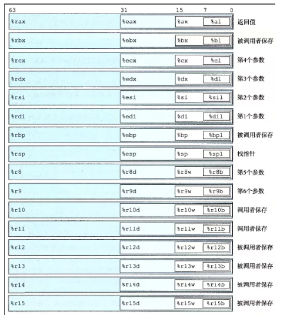
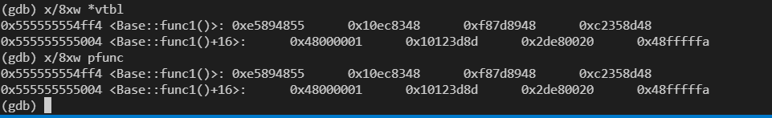
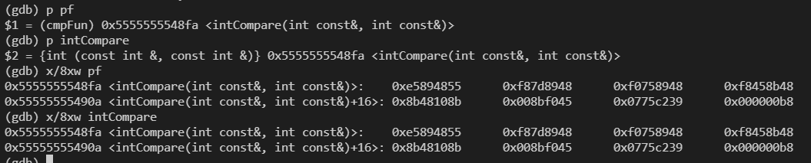
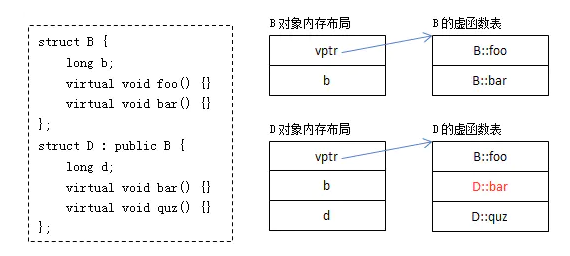

### 简单对象



#### C语言栈结构体

源代码
```cpp
#include <stdio.h>

struct Test {
    int a;
    char b;
};

int main() {
    struct Test test;
    test.a = 1;
    test.b = 'a';
    printf("%d\n", test.a);

    return 0;
}
```

编译成汇编以及用gdb调试, 编译时注意设置`-O0`关闭编译优化

<!-- more -->

```
/// 帧指针入栈, 同时栈顶指针等于帧指针
   │0x64a <main>    push   %rbp                                                          
   │0x64b <main+1>  mov    %rsp,%rbp                                                          
/// rsp栈顶指针下移动开辟16字节(供main使用)
   │0x64e <main+4>  sub    $0x10,%rsp                                                          
/// rbp下移8字节, 先赋值给test.a = 1
   │0x652 <main+8>  movl   $0x1,-0x8(%rbp)                                                        
/// rbp下移4字节, 赋值给test.b = 'a', 'a' assci码97, 即0x61
   │0x659 <main+15> movb   $0x61,-0x4(%rbp)                                                       
/// rbp 下四字节给返回值寄存器%eax
   │0x65d <main+19> movzbl -0x4(%rbp),%eax                                                                                                                     │
   │0x661 <main+23> movsbl %al,%eax                                                          
/// 返回值寄存器eax值给第二参数%esi, 也就是第二参数为61
   │0x664 <main+26> mov    %eax,%esi                                                          
/// rip为指令寄存器，指向当前执行指令的下一条指令。将rip偏移地址赋给rdi(一参数寄存器)
   │0x666 <main+28> lea    0x97(%rip),%rdi        # 0x704                                                         
/// 返回值寄存器置0
   │0x66d <main+35> mov    $0x0,%eax                                                          
///callq指令完成
/// 1. 将调用函数(main)中的下一条指令(这里为0x677)入栈，被调函数返回后将取这条指令继续执行
/// 2. 修改指令指针寄存器rip的值，使其指向被调函数(add)的执行位置，这里为0x520

/// 进入prinf后
/// %rsi第二参数寄存器为0x61
   │0x672 <main+40> callq  0x520 <printf@plt>                                                  
/// 返回值寄存器
   │0x677 <main+45> mov    $0x0,%eax                                                        
   
/// leaveq指令完成
/// 新的栈底指针mov %rbp, %rsp
/// pop %rbp
   │0x67c <main+50> leaveq                                                                                                                      
/// 保存在栈顶的地址出栈，使程序跳到上一个函数的下一条汇编指令上运行
   │0x67d <main+51> retq
```

* 由上可见, C语言struct对象实际入栈的是struct成员变量, 且不区分struct.
* C语言结构体调用函数通过函数指针进行, 且没有命名空间保护。

```c
#include<stdio.h>
#include<malloc.h>
struct Hello{
	void (*sayHello)(char* name); 
};
void sayHello(char* name){
	printf("你好，%s\n",name);
}
int main(){
	struct Hello hello;
	hello->sayHello=sayHello;
	hello->sayHello("a");
	return 0;
}
```

#### C++栈对象

源代码
```cpp
#include <iostream>

using namespace std;

class Test {
public:
    Test(int a) : a_(a) {}

    void print() {
        cout << a_ <<endl;
    }
private:
    int a_;
};

int main () {
    Test test(1);
    test.print();
    return 0;
}
```

汇编代码

```
/// 新建栈帧main
0x8fa <main()>          push   %rbp                                                             
   │0x8fb <main()+1>        mov    %rsp,%rbp                                                          
/// 开辟16字节空间供main使用
   │0x8fe <main()+4>        sub    $0x10,%rsp                                                          
   │0x902 <main()+8>        mov    %fs:0x28,%rax                                                          
/// 
   │0x90b <main()+17>       mov    %rax,-0x8(%rbp)                                                        
   │0x90f <main()+21>       xor    %eax,%eax                                                         
/// 这里this指针已经确定了, 就是-0xc(%rbp), 先放到%rax中
   │0x911 <main()+23>       lea    -0xc(%rbp),%rax                                                          
/// 二参数为1
   │0x915 <main()+27>       mov    $0x1,%esi                                                          
/// 这一行,%rdi ==  %rax == this指针, 构造函数也是this指针执行的
   │0x91a <main()+32>       mov    %rax,%rdi                                                        
/// 构造函数 
   │0x91d <main()+35>       callq  0x9a8 <Test::Test(int)
/// rax存储this指针地址, 也就是-0xc(%rbp)
   │0x922 <main()+40>       lea    -0xc(%rbp),%rax                                                          
/// 返回地址设置为this指针(第一参数), this指针也就是对象的地址
   │0x926 <main()+44>       mov    %rax,%rdi                                                         
/// 这时候test, == %rdi == %rax
   │0x929 <main()+47>       callq  0x9c0 <Test::print()>                                                             
/// 返回值设置为0
   │0x92e <main()+52>       mov    $0x0,%eax                                                          
   │0x933 <main()+57>       mov    -0x8(%rbp),%rdx   
      │0x933 <main()+57>                                               mov    -0x8(%rbp),%rdx                                                       

   │0x937 <main()+61>                                               xor    %fs:0x28,%rdx                                                         
   │0x940 <main()+70>                                               je     0x947 <main()+77>                                                          

   │0x942 <main()+72>                                               callq  0x7b0 <__stack_chk_fail@plt>                                       

   │0x947 <main()+77>                                               leaveq                                                       
   │0x948 <main()+78>                                               retq
```

以上可以看出
* 先有this指针, 根据this指针调用构造函数创建对象,this指针指向地址就是对象地址
* 根据this指针调用对象函数类似于`(Test::print, this. 其他参数)`的形式。
* 对main(调用者)函数来说, `Test test()`构造函数之后, 栈上会存储对象的成员变量和一个`this`指针, 当调用成员函数时, 和调用普通参数类似, 只是第一参数为this指针, 其他正常进入寄存器当形参。

#### 虚函数表

某类具有虚函数, 则其对象均具有一个vptr指针指向虚函数表, **虚函数表对类所有对象共享, 但父子类具有不同的虚函数表**。

虚函数表创建时机是在编译期间。编译期间编译器就为每个类确定好了对应的虚函数表里的内容。

在程序运行时，编译器会把虚函数表的首地址赋值给虚函数表指针，所以，这个虚函数表指针就有值了。

虚函数测试程序

```cpp
class Base {
public:
    Base() {
        cout << "construct Base"<<endl;
    }
    virtual void f() {
        cout << "Base::f"<<endl;
    }
    virtual void g() {
        cout << "Base::g" <<endl;
    }
    virtual ~Base() {
        cout << "destruct Base" <<endl;
    }
};

class Derive : public Base {
public:
    Derive() {
        cout << "construct Derive"<<endl;
    }
    virtual void f() {
        cout << "derive::f"<<endl;
    }
    virtual void h() {
        cout << "derive::h"<<endl;
    }
    virtual ~Derive() {
        cout << "destruct Base" <<endl;
    }
};

typedef void (*func) ();

int main() {
    Base base;  
    cout << "vptr虚指针所在地址" << &base <<endl;
    cout << "将地址变为指针类型, 强制转换为了取四个字节, 这时候才是一个虚指针" << (int *)(&base) <<endl;
    cout << "vptr虚指针解指针, 得到指针指向的内容, 也就是虚表首元素, 指向第一个虚函数的指针" << *(int *)(&base) <<endl;

    unsigned long* vtbl = (unsigned long*)(*(unsigned long*)&base);

    cout << "虚表第一个元素(一个函数指针本身,指向虚函数): " << vtbl << endl;
    /// 虚函数本身(函数本身其实是一个指针)
    cout << "虚函数本身: " << *vtbl << endl;
    /// 虚函数本身转为函数类型并调用
    func pfunc = (func)*(vtbl);
    pfunc();
    //delete base;
    return 0;
}
```

* 这里转型取`unsigned long`, 大小为4字节, 范围为`0 to 4,294,967,295 (2^32 - 1)`。对于64位操作系统(64位操作系统指针大小为8字节)

* 函数指针可以用typedef 声明成类型`typedef void (*func) ();`,**事实上函数指针和函数是等价的,函数本身也可以视为指针** , 因此不难理解`*(vtbl)`作为函数本身(或者说函数指令存储的首地址), 强制转型为函数指针类型(该指针也是函数指令存储的首地址),用函数指针`pfunc`直接调用。因此函数本身等价于函数指针, 二者都是指向函数指令。

* `&base`本身为对象地址, 用`(unsigned long*)&base`将地址按四字节取, 转型成一个指针, 该指针指向虚函数表, 因此`(*(unsigned long*)&base)`就是虚函数表地址, 同理将地址转为一个函数类型, `unsigned long* vtbl = (unsigned long*)(*(unsigned long*)&base);`, 这个指针指向第一个虚函数(即vtbl)指针。注意`vtbl+1`就是下一个虚函数, 因为+1实际上内存移动四个字节。所以`*vtbl`表示函数本身, 该函数本身可以转型为函数指针类型, 由函数指针调用。(函数等价于函数指针)。




上图可见, `*vtbl`(函数对象)和`pfunc`等价, 即函数指针和函数本身一致,存储的是函数本身的指令。

```cpp
#include <iostream>
#include <string>
using namespace std;

// 定义函数指针pf
int (*pf)(const int&, const int&);
// 定义函数指针类型cmpFun
 
typedef int (*cmpFun)(const int&, const int&);

int intCompare(const int& aInt, const int& bInt)
{
         if(aInt == bInt) return 0;
         if(aInt > bInt) 
         {
                   return 1; 
         } 
         else
         { 
                   return -1; 
         }
} 
 
int main(void) { 
         int aInt = 1; 
         int bInt = 2;  
         cmpFun pf = intCompare; 
         cout << pf(aInt, bInt)<<endl;

         return 0;
}
```



* 函数指针和函数作用完全一致, 函数指针不是指向函数,而是和函数一样, 指向函数所在的指令。

#### 虚函数运行时确定

* 当存在虚继承关系时, 基类和子类都会产生虚函数表。由于可能存在多态, `vtbl`虚函数表使用的是基类还是子类函数在运行期确定。
* 也就是对`Base*p = new Base`, 有虚函数使用基类的虚函数表, 但对`Base* p = new Derive`则使用子类的虚函数表, 运行构造对象时建立this指针之后, 设置`vptr`和`vtbl`才会确定。注意虚函数表是编译确定的, 运行时只会给某对象的`vptr`指针。


* 一但对象具有虚函数, 则`Base* p;`并不能确定该指针指向何种对象(也可以是子对象), 显然同一种类型的不同对象, 可以有不同的`vptr`指针指向, **究竟怎么指, 对象创建了才知道,只根据类型是不知道的**。原本编译确定了的事(对于`string`这些普通类型, 编译时根据类型可以不用创建对象,编译期间就给予调用函数等等的解析,但含有虚函数的必须要创建对象才行),这次要运行才确定,多了很多步骤(其实就多了加入vptr指针而已), 运行效率因此降低。

* **虚函数效率低的主要原因是无法被深入编译优化, 甚至类因为有虚函数导致原本的优化也不行了**, 其实虚函数运行时多的步骤只是创建`vptr`以及查看虚函数表而已

```cpp
class Base
{
public :
    int base_data;
    Base() { base_data = 1; }
    virtual void func1() { cout << "base_func1" << endl; }
    virtual void func2() { cout << "base_func2" << endl; }
    virtual void func3() { cout << "base_func3" << endl; }
};
 
class Derive : public Base
{
public :
    int derive_data;
    Derive() { derive_data = 2; }
    virtual void func1() { cout << "derive_func1" << endl; }
    virtual void func2() { cout << "derive_func2" << endl; }
};
 

/// 声明一个函数指针类型
typedef void (*func)();
 
int main()
{
    Base base;
    Base base2;
    Base* base3 = new Derive;

    Derive derive;
    for(int i=0; i<3; i++)
    {
        unsigned long* vtbl = (unsigned long*)(*(unsigned long*)&base) + i;
        cout << "slot address: " << vtbl << endl;
        cout << "func address: " << *vtbl << endl;
        /// 转化成函数类型
        /// base类对象, 调base类虚函数表
        func pfunc = (func)*(vtbl);
        pfunc();
    }
    cout << "----------------------------------------" << endl;
 
    for(int i=0; i<3; i++)
    {
        unsigned long* vtbl = (unsigned long*)(*(unsigned long*)&base2) + i;
        cout << "虚函数表slot address: " << vtbl << endl;
        cout << "func address: " << *vtbl << endl;
        /// base类对象, 调base类虚函数表
        /// base1和base2虚函数表是一样的
        func pfunc = (func)*(vtbl);
        pfunc();
    }
    cout << "----------------------------------------" << endl;

    for(int i=0; i<3; i++)
    {
        unsigned long* vtbl = (unsigned long*)(*(unsigned long*)&derive) + i;
        cout << "derive 虚函数表slot address: " << vtbl << endl;
        cout << "func address: " << *vtbl << endl;
        /// derive类对象, 调derive类虚函数表
        func pfunc = (func)*(vtbl);
        pfunc();
    }
    cout << "----------------------------------------" << endl;


    for(int i=0; i<3; i++)
    {
        unsigned long* vtbl = (unsigned long*)(*(unsigned long*)&(*base3)) + i;
        cout << "虚函数表slot address: " << vtbl << endl;
        cout << "func address: " << *vtbl << endl;
        /// base类, derive对象, 调derive虚函数表
        /// base3和derive调用的虚函数表一致
        func pfunc = (func)*(vtbl);
        pfunc();
    }
    cout << "----------------------------------------" << endl;
    return 1;
}
```

#### 虚函数和纯虚函数

纯虚函数是一种特殊的虚函数，它在基类中声明，却只能在派生类中给实现。在基类中声明纯虚函数的语法为:`virtual void hello() = 0;`。

我们想要规定一个类的行为的时候，就需要使用纯虚函数来解决问题，虚函数没有要求子类强制重写基类的方法，无法靠虚函数规定子类的行为。纯虚函数可以要求子类强制重写基类的纯虚方法, 因此可以规定子类的行为, 也就是Java中的接口。含有一个或者多个纯虚函数的类称为抽象类，抽象类无法被实例化。但注意含有虚函数(不是纯虚函数)的类不是抽象类, 可以被实例化。

```cpp
class IBreath
{
    public: 
    virtual void breath() = 0;
};
class Person : public IBreath
{
    public:
     void breath()
     {
         cout << "breathing...... " << endl;
     }
};

int main()
{

   Person p;
   p.breath();
   // 运行结果：breathing......
}
```