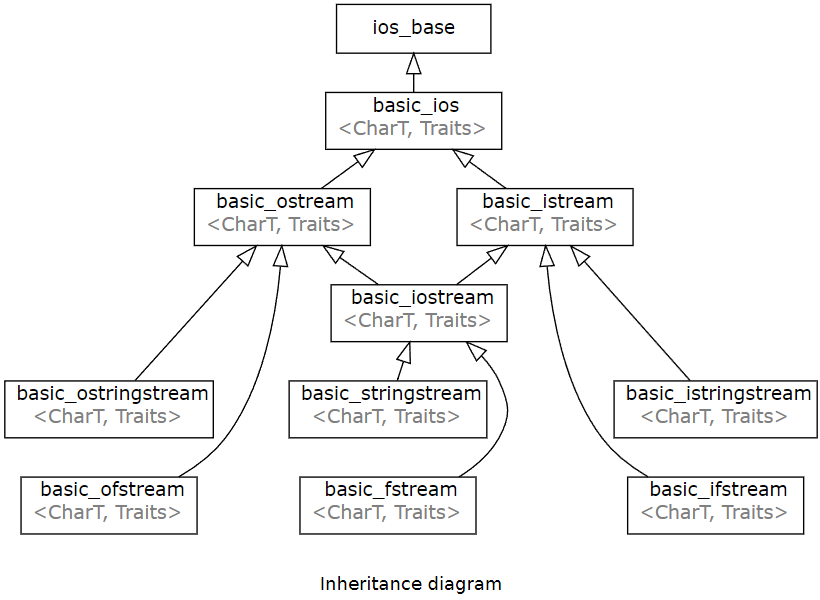
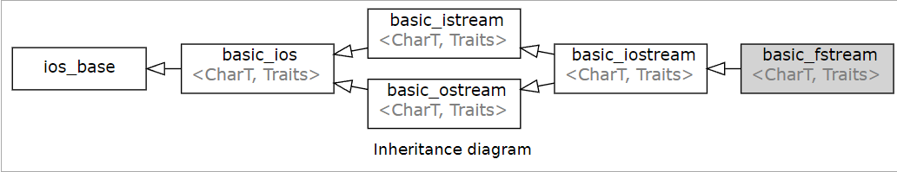
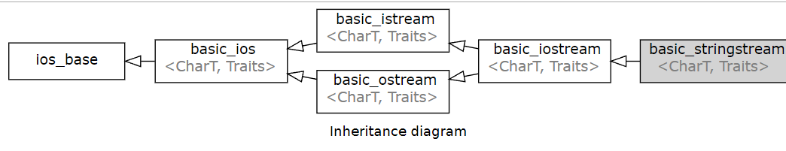

> C++ IO流对象是继承体系, istream->fstream; C语言的FILE也是操作文件的办法, 它们的底层都与文件描述符有密切关系。

### C++ stream

#### 继承关系


* ios_base

ios_base, manages formatting flags and input/output exceptions, 主要负责基于flag的格式化工作。stream格式化是通过flag进行的。

```
flags, manages format flags
setf, sets specific format flag
unsetf, clears specific format flag
precision, manages decimal precision of floating point operations
width, manages field width

// Member types and constants
openmode
app,	seek to the end of stream before each write
binary,	open in binary mode
in,	open for reading
out,	open for writing

fmtflags
hex	use hexadecimal base for integer I/O
dec	use decimal base for integer I/O
left	left adjustment
fixed	generate floating point types using fixed notation
```

<!-- more -->

* basic_ios
 
manages an arbitrary stream buffer
```
// state function
good  checks if no error has occurred i.e. I/O operations are available

eof   checks if end-of-file has been reached

rdstate   returns state flags

setstate  sets state flags

fill    manages the fill character

rdbuf   manages associated stream buffer

tie   manages tied stream
```

* basic_ostream

wraps a given abstract device (std::basic_streambuf)
and provides high-level output interface

```
operator<<    inserts formatted data
put           inserts a character
write         inserts blocks of characters
tellp         returns the output position indicator
seekp         sets the output position indicator
flush         synchronizes with the underlying storage device
```

* basic_istream

wraps a given abstract device (std::basic_streambuf)
and provides high-level input interface
```
operator>>    extracts formatted data
get           extracts characters
peek          reads the next character without extracting it
read          extracts blocks of characters
tellg         returns the input position indicator
seekg       sets the input position indicator
```

* basic_filebuf

Defined in header <fstream>


implements raw file device

basic_ifstream, implements high-level file stream input operations

basic_ofstream, implements high-level file stream output operations

basic_fstream, implements high-level file stream input/output operations
```
is_open   checks if the stream has an associated file

open, opens a file and associates it with the stream

close   closes the associated file

rdbuf   returns the underlying raw file device object
```

* stringstream

Defined in header <sstream>


basic_stringbuf, implements raw string device

basic_istringstream, implements high-level string stream input operations

basic_ostringstream, implements high-level string stream output operations

basic_stringstream, implements high-level string stream input/output operations
```
rdbuf   returns the underlying raw string device object
str     gets or sets the contents of underlying string device object
```

#### 常用

iostream 提供了 cin 和 cout 方法分别用于从标准输入读取流和向标准输出写入流(也是C++最常用的用户输入输出对象)。流对象需要重载`<<`和`>>`两个操作符, `<<`流输出数据,写入磁盘等, `>>`向流中读入数据,写入内存。注意标准输入输出对应的终端和磁盘含义一样，因此使用`cout << "123"`表示输出数据`"123"`到标准终端。


如上控制台流(标准输入输出)是`istream`, `iostream`, `ostream`; 文件流主要有`ifstream`, `fstream`, `ofstream`。

`getline`可以将流对象按行输入到字符串中, `istream& getline (istream&  is, string& str);`, 显然基本全部的流对象都可以使用`getline`, 因为它们都继承自`istream`

```cpp
Defined in header <string>
template< class CharT, class Traits, class Allocator >
std::basic_istream<CharT,Traits>& getline( std::basic_istream<CharT,Traits>& input,
std::basic_string<CharT,Traits,Allocator>& str, CharT delim );


while (!in.eof())   /// in流是否读完, 这里in一般表示文件流, eof()函数来自basic_ios对象
{
    getline(in, buffer);
    cout<<buffer<< endl;
}
```

* 缓冲区的回车

我们运行程序往往会按下回车, 这个回车字符也保存在了缓冲区中。

可以用getc读取缓冲区的回车

```cpp
int main () {
    int n;
    string buffer;
    cin >> n;   // 输入的数字给了n, 最后的那下回车给了getc
    getc(stdin);  // 注意清除缓冲区的回车

    for (int i = 0; i < n; i++) {
        getline(cin, buffer);   // 自动忽略最后的回车
        cout << buffer <<"\n";
    }
    return 0;
}
```

当cin>>从缓冲区中读取数据时，若缓冲区中第一个字符是空格、tab或换行这些分隔符时，cin>>会将其忽略并清除，继续读取下一个字符，若缓冲区为空，则继续等待。但是如果读取成功，字符后面的分隔符是残留在缓冲区的，cin>>不做处理。

cin.get遇到\n停止读取, 但不会清除缓冲区的\n

getline读取一行字符时，默认遇到\n(自定义结束符)时终止，并且将\n(自定义结束符)直接从输入缓冲区中删除掉

使用, 设置sync_with_stdio(false)，其实应该是让C风格的stream和C++风格的stream变成async且分用不同buffer。可以提高C++cin读取效率, 但这时候的cin不兼容scanf了

默认的情况下cin绑定的是cout，每次执行 << 操作符的时候都要调用flush，这样会增加IO负担。可以通过tie(0)（0表示NULL）来解除cin与cout的绑定，进一步加快执行效率。

The tied stream is an output stream object which is flushed before each i/o operation in this stream object. By default, the standard narrow streams cin and cerr are tied to cout。绑定后的cout每次operator<<都会调用flush, cin.tie(0)同时解除cout的绑定

```cpp
ios::sync_with_stdio(false);
cin.tie(0);  // 相当于cin.tie(nullptr)
```

#### cin/cout重定向到文件

如果我们不打算从终端输入字符, 而是从文件中读取, 可以将cin重定向到文件中。**cin重定向的原理就是设置cin.setbuf使cin从文件缓冲区读取**

```cpp
#include <fstream>
#include <iostream>

using namespace std;

ifstream in("graph.txt");
cin.rdbuf(in.rdbuf());
cin>>m>>n;  // 将会从文件中读取
```

#### 输入输出流源码解析

`cin`, `cout`, `cerr`是常见的控制台流对象

```cpp
extern istream cin;		/// Linked to standard input
extern ostream cout;		/// Linked to standard output
extern ostream cerr;		/// Linked to standard error (unbuffered)
extern ostream clog;		/// Linked to standard error (buffered)


/// Base class for @c char streams.
typedef basic_ios<char> 		ios;
/// Base class for @c char buffers.
typedef basic_streambuf<char> 	streambuf;
/// Base class for @c char input streams.
typedef basic_istream<char> 		istream;
/// Base class for @c char output streams.
typedef basic_ostream<char> 		ostream;
/// Base class for @c char mixed input and output streams.
typedef basic_iostream<char> 		iostream;
/// Class for @c char memory buffers.
typedef basic_stringbuf<char> 	stringbuf;
/// Class for @c char input file streams.
typedef basic_ifstream<char> 		ifstream;
/// Class for @c char output file streams.
typedef basic_ofstream<char> 		ofstream;
/// Class for @c char mixed input and output file streams.
typedef basic_fstream<char> 		fstream;
```

下面主要看basic_istream和basic_ostream
```cpp
template<typename _CharT, typename _Traits>
    class basic_istream : virtual public basic_ios<_CharT, _Traits>
    {
    public:
      // Types (inherited from basic_ios (27.4.4)):
      typedef _CharT			 		char_type;
      typedef typename _Traits::int_type 		int_type;
      typedef typename _Traits::pos_type 		pos_type;
      typedef typename _Traits::off_type 		off_type;
      typedef _Traits			 		traits_type;
    
          // Non-standard Types:
      typedef basic_streambuf<_CharT, _Traits> 		__streambuf_type;
      typedef basic_ios<_CharT, _Traits>		__ios_type;
      typedef basic_istream<_CharT, _Traits>		__istream_type;
      typedef num_get<_CharT, istreambuf_iterator<_CharT, _Traits> >
 							__num_get_type;
      typedef ctype<_CharT>	      			__ctype_type;

      streamsize 		_M_gcount;

      basic_istream(__streambuf_type* __sb)
      : _M_gcount(streamsize(0))
      { this->init(__sb); }

      // operator>> 用以支持cin >>, 内部通过__istream_type实现
      __istream_type&
      operator>>(__istream_type& (*__pf)(__istream_type&))
      { return __pf(*this); }   // 用*this拷贝构建__pf

      __istream_type&
      operator>>(__ios_type& (*__pf)(__ios_type&))
      {
	__pf(*this);
	return *this;
      }

       __istream_type&
      operator>>(bool& __n)
      { return _M_extract(__n); }

      __istream_type&
      operator>>(short& __n);

      __istream_type&
      operator>>(unsigned short& __n)
      { return _M_extract(__n); }

      __istream_type&
      operator>>(int& __n);
      ... 

      // 下面是一些常用方法
      // cin.get()可以读取空白符, 最大读取__n个字符直到遇到回车, 将数据读到*__s中
      __istream_type&
      get(char_type* __s, streamsize __n, char_type __delim);

      // cin.getline相比于cin.get更安全, 即输入超长时，会引起cin函数的错误(防止溢出)
      __istream_type&
      getline(char_type* __s, streamsize __n, char_type __delim);

    {
      _M_gcount = 0;
      ios_base::iostate __err = ios_base::goodbit;
      sentry __cerb(*this, true);
      if (__cerb)
        {
          __try
            {
              const int_type __idelim = traits_type::to_int_type(__delim);
              const int_type __eof = traits_type::eof();
              __streambuf_type* __sb = this->rdbuf();
              // 将rdbuf()的数据写入到char_type* s中
              /*
              rdbuf()来自basic_ios
                    basic_streambuf<_CharT, _Traits>*
                    rdbuf() const
                    { return _M_streambuf; }
              */
              int_type __c = __sb->sgetc();

              while (_M_gcount + 1 < __n
                     && !traits_type::eq_int_type(__c, __eof)
                     && !traits_type::eq_int_type(__c, __idelim))
                {
                  *__s++ = traits_type::to_char_type(__c);
                  __c = __sb->snextc();
                  ++_M_gcount;
                }
    ...

    template<typename _CharT, typename _Traits>
    basic_istream<_CharT, _Traits>&
    basic_istream<_CharT, _Traits>::
    operator>>(int& __n)    // cin >> __实际也是调用的get, 只是遇到空格就停止, istream.get()默认遇到换行符停止
    {
      // _GLIBCXX_RESOLVE_LIB_DEFECTS
      // 118. basic_istream uses nonexistent num_get member functions.
      sentry __cerb(*this, false);
      if (__cerb)
	{
	  ios_base::iostate __err = ios_base::goodbit;
	  __try
	    {
	      long __l;
	      const __num_get_type& __ng = __check_facet(this->_M_num_get);
	      __ng.get(*this, 0, *this, __err, __l);
```

常用函数测试, 特别注意使用多个cin.get()只能接受一行的数据, 下一个cin.get()从前一个cin.get()没接受完的地方开始接收。
```cpp
// cin.get
char ch1,ch2[10];
cout<<"请输入字符串："<<endl;
cin.get(ch2,8); //最多接收8-1=7个字符到ch2[]中

cout<<ch2<< "\n";
cout << strlen(ch2) << "\n";

cin.get(ch1); // 只能接收ch2没有接受了的字符, 也就是第8个字符
cout<<ch1<<"\n";

/*
请输入字符串：
ab c d efg
ab c d 
7
e
*/
```

使用cin.get()读取多行数据需要吃掉上一行未读的\n
```cpp
int main () {
    char ch1,ch2[10];
    cout<<"请输入字符串："<<endl;
    cin.get(ch2,8);//在不遇到结束符的情况下，最多可接收6-1=5个字符到ch2中，注意结束符为默认Enter
    //cin.get(ch1);//或ch1 = cin.get();
    cout<<ch2<< "\n";
    cout << strlen(ch2) << "\n";
    cin.get();  // 吃掉\n符


    cin.get(ch1);
    cout<<ch1<<"\n";

    return 0;
}

请输入字符串：
a b cde
a b cde
7
ac
a
```

如果是getline读取到\n截止时会清除缓冲区的\n, 因此不需要上述"吃掉\n符"
```cpp
int main () {
    char ch1,ch2[10];
    cout<<"请输入字符串："<<endl;
    cin.getline(ch2,8);//在不遇到结束符的情况下，最多可接收6-1=5个字符到ch2中，注意结束符为默认Enter
    //cin.get(ch1);//或ch1 = cin.get();
    cout<<ch2<< "\n";
    cout << strlen(ch2) << "\n";
    //cin.get();  // 吃掉\n符


    cin.get(ch1);
    cout<<ch1<<"\n";

    return 0;
}
```

#### 字符串分割

C 库函数 `char *strtok(char *str, const char *delim)` 分解字符串 str 为一组字符串。初次使用时，需要传入str，将str的首个字符位置作为查找的起始位置，并返回不包含dilimiters定义字符的子串；后续使用传入NULL，并使用上一次查找到子串的尾部位置的下一个位置作为查找起始位置，继续查找

`strtok`的实现主要有两个点
1. strspn找到s第一个不在delim中的下标, 这样可以处理连续delim字符, 如连续空格`  ab`, 直接会找到`a`
2. 从上一步找到的第一个不在delim中的下标, 继续找下一个delim, 找到了设置为`\0`截断字符串。

注意第一次调用`strtok`需要输入待切分字符串s, 之后输入`NULL`, strtok会直接用`olds`来继续进行切分。此外delim最好设置为单个字符, 多个字符的话只需要一个字符匹配就算delim匹配。因此strtok并没有调用字符串匹配函数,而仅仅是单个字符匹配。

```cpp
char *
STRTOK (char *s, const char *delim)
{
  char *token;

  if (s == NULL)
    s = olds;

  /* Scan leading delimiters.  */
  s += strspn (s, delim);   /// s第一个不在delim中的下标, 如果*s == '\0', 说明s中元素delim都有, 不能分割
  if (*s == '\0')
    {
      olds = s;
      return NULL;
    }

  /* Find the end of the token.  */
  token = s;
  s = strpbrk (token, delim);   /// 从token中找含有delim任意字符之下标, 因此delim只需要一个字符匹配就算delim匹配
  if (s == NULL)
    /* This token finishes the string.  */
    olds = __rawmemchr (token, '\0');
  else
    {
      /* Terminate the token and make OLDS point past it.  */
      *s = '\0';  // delim字符处截断
      olds = s + 1;
    }
  return token;
}
```
使用`strtok`切分字符串
```cpp
vector<string> split(const string& str, const string& delim) {
	vector<string> res;
	if("" == str) return res;
	//先将要切割的字符串从string类型转换为char*类型
	char * strs = new char[str.length() + 1] ; //str.c_str()是const char*, 因此需要新开辟空间存储非const char*。
  // 也可以使用强制转换char* strs = const_cast<char*>(str.c_str());
	strcpy(strs, str.c_str()); 
 
  const char* d = delim.c_str();
 
	char *p = strtok(strs, d);
	while(p) {
		string s = p; //分割得到的字符串转换为string类型
		res.push_back(s); //存入结果
		p = strtok(NULL, d);  // 继续切分
	}
 
	return res;
}
void test3() { //正常字符串
	string s = "my  name nis lmm   ";//连续多个空格，空格会被过滤掉
	
	std::vector<string> res = split(s, " ");
	for (int i = 0; i < res.size(); ++i)
	{
		cout << res[i] <<endl;
	}
}
/// 输出
my
name
nis
lmm
```

以上我们知道字符匹配可以用`strpbrk`,返回匹配下标; 字符匹配和切分用`strtok`。对于字符串的匹配, 用`strstr`

`strstr(str1,str2)` 函数用于判断字符串str2是否是str1的子串。如果是，则该函数返回str2在str1中首次出现的地址；否则，返回NULL。我们可以基于`strstr`实现字符串的匹配分割。

```cpp
void splitStr() {
    char a[]="aaa||a||bbb||c||ee||"; //// 不能用char* a = ",,,"
    const char* needle="||";
    a[0] = 'b';
    char* haystack = a; // 这里是为了后面可以实现haystack = buf + strlen(needle);等操作
    cout << haystack<<endl;
    char* buf = strstr( haystack, needle);
    while(buf != NULL )    {
       //在出现分隔符的位置设置结束符\0
        *buf = '\0';
        printf( "%s\n", haystack);
        haystack = buf + strlen(needle);
        buf = strstr( haystack, needle);
        } 
}
```

注意`char *a="abcdef"`与`char a[]="abcdef"`的区别：
1. 字符串存放的内存区域不同：前者存放在常量区，不可修改，后则存放在栈中，可以修改；
2. 变量a存放的内容不同：前者存放的是一个地址，而后者存放的是字符串"abcdef"，因此使用sizeof它们的结果是不同的，分别是4和7;
3. 此外关于new分配的对象数组的情形，以为是内存区中的修改。所以也是可以实现修改字符串的。

**注意C语言数组和指针区别, 数组往往指在栈区开辟的连续字符内存, 指针则用于操纵字符。因此最好责任分清, 栈开辟内存用`char[]`, 操纵字符用`char*`。当然如果是堆区, 直接用指针即可。

* 使用find处理字符串分割

string容器没有emplace_back, 因为只是push_back一个字符而已
```cpp
std::string	std::basic_string<char>
std::wstring	std::basic_string<wchar_t>

found=str.find('.');
if (found!=std::string::npos)
  std::cout << "Period found at: " << found << '\n';
```

`find`可用来查找字符或者字符串, `size_t find (const char* s, size_t pos = 0) const;`, 如果没有找到, 会返回一个`string::npos`。

```cpp
vector<string> split_find(const string line, const string sep)
{
	vector<string> buf;
	int temp=0;
	string::size_type pos=0;

    pos = line.find(sep, temp);
	while (pos!=string::npos)
	{
		buf.push_back(line.substr(temp, pos-temp));
		temp = pos + sep.size();
    pos = line.find(sep, temp);
	}
	buf.push_back(line.substr(temp, line.size() - temp));
	return buf;
}
 
int test_find()
{
	string line = "C:\\Users\\79476\\Desktop";
	vector<string> buf = split_find(line,"\\");
	typedef vector<string>::iterator itr;
	for (itr i = buf.begin(); i != buf.end(); i++)
	{
		cout << *i << endl;
	}
}

输出
C:
Users
79476
Deskto
```

### C++文件流

#### 文件流读写fstream, ifstream, ofstream

默认情况下
```
fstream： ios::in | ios::out  // 打开文件做读写
ifstream： ios::in  // 打开文件读操作
ofstream：ios::out | ios::trunc //打开文件做写操作，如果文件已存在则先删除该文件
```

向文件中写数据
```cpp
/// 写入到文件中, 向文件输出
ofstream out("example.txt");  /// 输出操作,out
out.open ("example.txt");

if (!out) //!运算符已经重载
{
    return false;
｝
else{
    out << "This is a line.\n";
    out << "This is another line.\n";
    out.close();
}

void open (const char * filename, openmode mode);, mode打开文件的方式是在ios类中定义。

mode打开文件的方式是在ios类中定义的, 联合使用中间以|间隔。

ios::in	为输入(读)而打开文件, 读到内存
ios::out	为输出(写)而打开文件,例如写入磁盘
ios::binary	二进制方式打开，用于二进制文件
ios::ate	初始位置：文件尾
ios::app	所有输出附加在文件末尾
ios::trunc	如果文件已存在则先删除该文件
ios::nocreate	不建立文件，所以文件不存在时打开失败
ios::ios::noreplace	不覆盖文件，所以打开文件时如果文件存在失败
```

从文件中读数据
```cpp
char buffer[256];
ifstream in("example.txt");
if (!in.is_open())
{
    cout << "Error opening file"; exit (1);
}
while (!in.eof())   /// 文件是否读完
{
    in.getline(buffer,100);//getline()函数的作用是逐行读取流in中的数据, 还可以用in >> buff, 表示读入数据到变量buff中
    cout<<buffer<< endl;
}
```


#### C++ stream的一些缺陷

std::endl会强制刷新缓冲区到磁盘, 换行最好使用`\n`;

C++中的std :: cin和std :: cout为了兼容C，保证在代码中同时出现std :: cin和scanf或std :: cout和printf时输出不发生混乱，用一个流缓冲区来同步C的标准流。这降低了效率, 通过设置`ios::sync_with_stdio(false);`可避免之从而提升效率。但当设置为false时，cin就不能和scanf，sscanf, getchar, fgets等同时使用。

`std::cin`默认是与`std::cout`绑定的，这样每次调用`cin>>n` 时`cout<<n`都会刷新到终端, 这样增加了IO的负担，通过`tie(nullptr)`来解除`std ::cin`和`std::cout`之间的绑定，来降低IO的负担使效率提升。

格式化输出很反人类

太复杂了, 没用的功能太多, 同样的还有std::string

```cpp
std::ios::sync_with_stdio(false);
cin.tie(nullptr);
```

https://www.cnblogs.com/Solstice/archive/2011/07/17/2108715.html

### 总结

ios_base, basic_ios, basic_iostream, basic_fstream, basic_stringstream

cin.get()和cin.getline()区别, 缓冲区中回车符的捕获

字符串分割, 基于find

文件stream, 读写直接<<,>>, 打开关闭