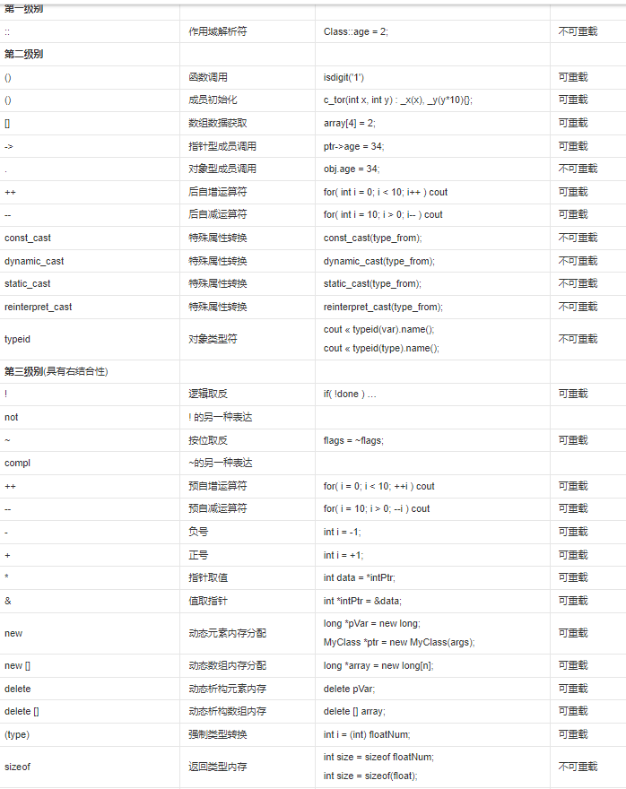
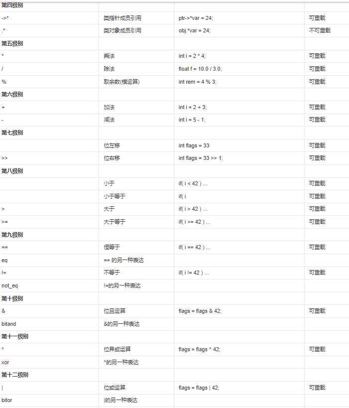
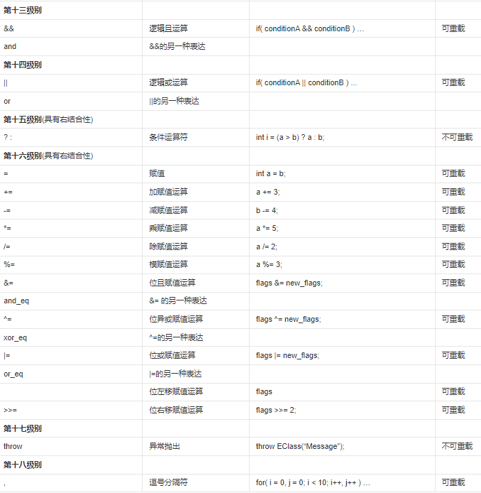

### 指针和数组

数组为全局变量或者静态变量时，在程序加载阶段默认所有元素都被初始化为0。
数组为局部变量，因为数组数据在栈上分配，就延续了了栈上上一次的值，所以这个值是不确定的。

根据C语言的规定，数组名=数组首元素指针，所以直接可以用数组名的解引用buf来访问第一个元素，也可以使用(buf+N)来访问第N个元素。即目标地址=首地址+sizeof(type)*N，得到被访问元素的地址。

一维数组和指针在数据访问的操作上几乎是等价的
```cpp
int a[] = {1,2,3,4};
int* p = a;
printf("%d %d\n", a[1], *(a+1));
printf("%d %d\n", p[2], *(p+2));

输出
2 2
3 3
```

但是指针不能直接指向数组字面量
```cpp
    int* a = {1,2,3,4};     // 需要用int a[]
    printf("%d %d\n", a[1], *(a+1));

输出
Segmentation fault

// 这样是可以的
void print(int* p) {
    printf("%d\n", *p);
}

int main() {
    int a[] = {1,2,3,4};
    print(a);
输出
1
```

<!-- more -->

* 修改元素只需要传指针(不管是数组元素还是普通元素), 修改指针需要传双重指针(例如treeNode*)。我认为某种程度上数组负责定义变量, 操纵变量用于指针。

```cpp
void print(int** p) {
    **p = 10;
    printf("%d\n", **p);
}

int main() {
    int a[] = {1,2,3,4};
    //print(&a);
    int* b = a;
    print(&b);
    int** c = &b;

    printf ("%d\n", *c);
    printf("%d %d\n", a[0], *(a+0));
输出
10
-1820669936
10 10
```
不要对数组进行取地址, 解引用等操作, 容易出错。同理, 也避免对指针进行`[]`操作。

#### 二维数组

二维数组不能像一维数组那样访问, 可以认为指针只能引用一维数组, 因此需要`定义指向数组的指针`。双重指针只表示指向指针的指针(对地址取地址), 而不表示二维数组。
```cpp
char buf[2][2]={{1,2},{3,4}};
char **p = buf; // 这里定义错误, 应该定义成数组的指针
printf("buf[] = %d,%d,%d,%d\r\n",p[0][0],p[0][1],p[1][1],p[1][2]);

输出
main.c:10:16: warning: initialization from incompatible pointer type [-Wincompatible-pointer-types]
     char **p = buf;
                ^~~
Segmentation fault


char (*p)[2]; // 表示成指向char[2]数组的指针
printf("buf[] = %d,%d,%d,%d\r\n",*p[0],p[0][1],p[1][1],p[1][2]);
printf("buf[] = %d,%d,%d,%d\r\n",(*p)[0],(*p)[1],(*(p+1))[0],(*(p+1))[1]);
输出
buf[] = 1,2,3,4
buf[] = 1,2,3,4
```

### 函数指针

声明指针会用一个`*`, 例如声明函数指针会用一个`*`。针对`*`, 需要注意*修饰的是类型还是变量, 修饰的是类型, 表示元素类型是指针, 修饰的是变量, 表示这时一个指针变量, 指向XXX(例如指向数组的指针)。
```cpp
int *comp(void*, void*);    // 表示一个函数comp, 返回一个int*

int (*comp)(void*, void*);  // 表示comp是一个函数指针, 可指向参数为(void*, void*), 返回类型为int的函数

int *name[5];   // []优先级大于*, 因此相当于int* (name[5]), 表示长为5的数组, 数组元素类型为int*
int (*name)[5]; // 这时*name是声明了一个指针, 该指针指向一个int[5]的数组
```


嵌套函数指针从括号内部而外的分析, 如下
```
int (*func)(int *p);

(*func)是一个函数，而func是一个指向这类函数的指针，就是一个函数指针，这类函数具有int*类型的形参，返回值类型是 int。

int (*func[5])(int *p);

分析(*func[5]), func与[5]匹配得到, func是一个具有5个元素的数组, 每个数组的元素是XXX指针。
即int (*f)(int *p);

显然这个指针指向函数具有int*类型的形参，返回值类型为int。


int (*(*(*func)(int *))[5]) (int *);

初步看到, (*func)表示func是一个指针, 指向int*;

从外层, 存在一个指针指向五个元素的数组, 每个元素是一个函数int (int*)
这样的指针是(*(*func)(int *)), 换言之是一个返回值, 参数是int*, func就指向这样的函数。

typedef int (*PARA1)(int*); // 返回值为数组函数指针, int(int* )
typedef PARA1 (*PARA2)[5];
typedef PARA2 (*func)(int*);

int (*(*func[7][8][9])(int*))[5];

func是一个数组，这个数组的元素是函数指针，这类函数具有int*的形参，返回值是指向数组的指针，

typedef int (*PARA1)[5];  // 返回值为数组指针
typedef PARA1 (*PARA2)(int*);
typedef PARA2 func[7][8][9];
```

#### C++运算符优先级





#### 变量用static告知编译器，自己仅仅在变量的作用范围内可见。这一点是它与全局变量的区别。


### 宏定义

以下程序输出结果
```cpp
#define MAX(x,y) ( x > y ? x : y)

int main(){
    int a = 10;
    int b = 20;
    cout << MAX(++a, ++b);
    return 0;
}
```

<!-- more -->

首先指出程序的问题，
* 宏定义是编译前的预处理指令，只实现了字符替代，没有传参等操作。
* 因此，变量需要加括号

```cpp
#define MAX(x,y) ( (x) > (y) ? (x) : (y) )
```

这是为了防止替代时候出现问题如传入`a+1`和`b+1`,替代后为

```cpp
#define MAX(a+1,b+1) ( a+1 > b+1 ? a+1 : b+1)
```
显然出现问题。

回到最初的问题，该问题输出为`22`，宏定义替换如下

```cpp
#define MAX(++a,++b) ( ++a > ++b ? ++a : ++b)
```
在三目表达式中，`++a > ++b`计算一次得到 `a=11`,`b=21`。之后`++a`和`++b`又计算一次得到`a=12`, `b=22`。

* 解决办法

```cpp
#define MAX(a,b) ({
    __typeof(a) _a = (a);
    __typeof(b) _b = (b);
    _a > _b ? _a : _b;
})
```
实际是定义新的变量`_a`和`_b`，`__typeof`获取类型。注意`(a)`和`(b)`需要加括号，原因自不必说。

#### 宏定义粘连

`##`在宏定义中表示字符串直接连接, 巧妙使用可以方便函数的调用, 例如基于字符串名调用函数

```cpp
#define NAME(n) name_##n  
   
int main()  
{  

    int NAME(a);   // 相当于定义name_a
    int NAME(b);   // name_b
      
    NAME(a) = 520;  
    NAME(b) = 111;  
      
    printf("%d\n", NAME(a));  
    printf("%d\n", NAME(b));  
   
    return 0;  
}

输出
520
111
```

#### do{...}while(0)

使用`do{...}while(0)`构造后的宏定义不会受到大括号、分号等的影响，总是会按你期望的方式调用运行。

`do{...}while(0)`使用`{}`来保证宏定义内存的逻辑不会因为替换而改变。

```cpp
// 宏定义内部是多条语句执行
#define initStaticStringObject(_var,_ptr) do { \
    _var.refcount = 1; \
    _var.type = OBJ_STRING; \
    _var.encoding = OBJ_ENCODING_RAW; \
    _var.ptr = _ptr; \
} while(0)
```

### 弹性数组

弹性数组存在于形如下面的结构体
```cpp

class CZeroTest
{
public:
	int nCnt;
	int items[];
};
```

sizeof(CZeroTest)为4，即弹性数组的大小为0，不占用空间。弹性数组本来的作用是要求结构体提供固定元素和动态空间(固定元素是nCnt, 但可以动态调整items空间)，弹性数组所在的结构体一般在堆上分配内存。弹性数组本身不占用结构体的空间(sizeof编译期确定的空间), 但动态分配内存时需要结构体空间+弹性数组空间。

结构体找到弹性数组的地址也很简单, 如果`CZeroTest* p = 起始位置`, 只需要`p+ sizeof(CZeroTest)`即可
```cpp
CZeroTest *ztOb;
// 结构体空间, 整个结构体只能在堆上分配。使用ztob->item[n]就可以访问弹性数组大小了
ztOb = (CZeroTest *)malloc(sizeof(CZeroTest) + 50 * sizeof(int));   //C语言方式
ztOb = (CZeroTest *)new char(sizeof(CZeroTest) + 50 * sizeof(int)); //C++语言方式

free(ztOb);    //C语言方式
delete []ztOb; //C++语言方式
```
弹性数组意味着整个结构体都要分配在堆上。需要对数组内存进行扩容时，需要对整块内存realloc。

### gcc `__attribute__`

`__attribute__`往往在C语言中修饰结构体, 其中`__attribute__ ((__packed__))`表示不执行字节对齐, `__attribute__ ((aligned(16)))`表示设置字节对齐单位为16字节, 默认执行4个单位的字节对齐。

`__attribute__`可手动规定字节对齐方式。

aligned
```cpp
struct __attribute__ ((aligned(8))) myStruct1 {
	short f[3];
};

struct __attribute__ ((aligned(4))) myStruct2 {
	short f[3];
};

struct __attribute__ ((aligned(16))) myStruct3 {
	short f[3];
};

printf("%ld\n", sizeof(struct my_struct1)); // f[3]占6字节, 执行八字节对齐, 输出8
printf("%ld\n", sizeof(struct my_struct2)); // f[3]占6字节, 默认4字节对齐, 输出8
printf("%ld\n", sizeof(struct my_struct3)); // 设置16字节对齐, 输出16

输出
8
8 
16
```

packed
```cpp
struct sc1 {
    char a;
    char *b;
};
struct __attribute__ ((__packed__)) sc3 {
    char a;
    char *b;
};

struct Test {
	short ch;
	char i;
};
struct __attribute__ ((__packed__)) sdshdr5 {   // __attribute__((__packed__)) 相当于取消字节对齐，效率换空间
    unsigned char flags; /* 3 lsb of type, and 5 msb of string length */
    char buf[]; // 弹性数组不占空间
};

printf("sc1: sizeof-char*  = %ld\n", sizeof(struct sc1));   // 输出16, 因为最大char*为8字节, 因此执行8字节的字节对齐
printf("sc3: packed sizeof-char*  = %ld\n", sizeof(struct sc3));    // 输出9, 无字节对齐
printf("%ld\n", sizeof(struct Test));      // 输出4, ch和i公用字节对齐为4 
printf ("%ld\n", sizeof(struct sdshdr5));   // 输出1, 弹性输出不赞空间
```