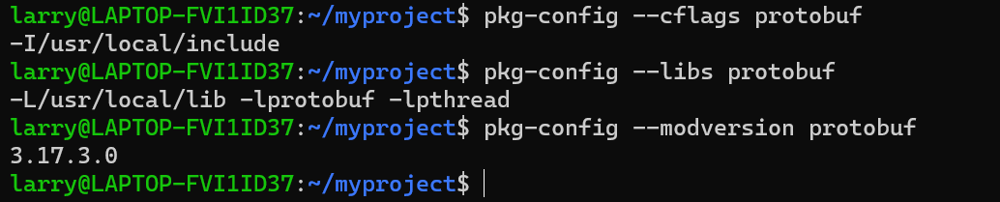
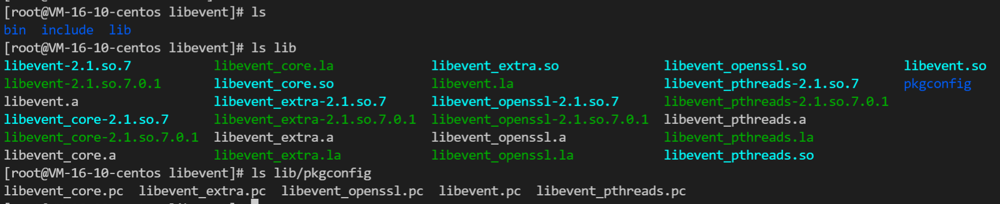

> 注意记录linux下关键C/Cpp运行环境的一些配置, 工具

### 文件搜索

关于C/cpp的文件搜索主要是头文件搜索和库文件搜索路径, 此外为了降低C/C++没有模块化的缺陷, 还有一些常用的搜索管理, 这样就不用手动写依赖模块的头文件目录和库文件, 例如pkg-config

#### 头文件,库文件搜索路径

除了用gcc的-I, -L之外, 还可以在环境变量中设置搜索路径.

```cpp
# C头文件路径
export C_INCLUDE_PATH=/usr/local/libevent/include:$C_INCLUDE_PATH
# C++ 头文件路径
export CPLUS_INCLUDE_PATH=/usr/local/libevent/include:$C_INCLUDE_PATH

# 动态库的路径
export LD_LIBRARY_PATH=/usr/local/libevent/lib:$LD_LIBRARY_PATH
# 静态库的路径
export LIBRARY_PATH=/usr/local/libevent/lib:$LIBRARY_PATH
```

#### pkg-config

在众多库管理工具下, pkg-config可能是最常用的.因为pkg-config是一个linux命令，用于获得某一个库/模块的所有编译相关的信息。简单的, pkg-config能够把头文件和库文件的位置指出来，给编译器使用, 包括
1. 检查库的版本号。 如果所需要的库的版本不满足要求，它会打印出错误信息，避免链接错误版本的库文件
2. 获得编译预处理参数，如宏定义、头文件的位置
3. 获得链接参数，如库及依赖的其他库的位置，文件名及其他一些链接参数
4. 自动加入所依赖的其他库的设置

常用的命令`pkg-config --list-all`, 显示所有的库. 

查看头文件路径, 库文件路径, 版本


因此我们编译时可以调用, 直接自动-I -L -l
```
g++ test_opencv.cpp `pkg-config --libs --cflags opencv`
```

我们需要关注怎样才能让pkg-config可以搜索到库, 通过`PKG_CONFIG_PATH`环境变量. 一般对于make && make install之后的C库都会时如下格式.


在lib文件夹会有一个pkgconfig文件夹, 里面的.pc便是可以被pkg-config解析的库的信息.

我们需要将这个文件加入到环境变量中, 类似PATH. 这样我们通过`pkg-config --list-all`就可以搜索到这个库了


因为pkg-config的通用性,建议能源码编译后使用pkg-config搜索的库都设置下pkg-config搜索,然后再是cmake的自动搜索.

<!-- more -->

### configure和autogen.sh

需要预先安装
```
sudo apt-get/yum install autoconf automake libtool
```

一般存在autogen.sh的编译方法是
1. 运行 autogen.sh 脚本文件，生成 configure 脚本文件；
2. 运行 configure 脚本文件，检查系统环境，配置编译选项（并生成 Makefile 文件）；
3. 运行 make 命令，执行代码的构建操作；
4. 运行 make install 命令，安装编译生成的文件。

有的库直接./configure而没有./autogen.sh这一步, 增加./autogen.sh是为了更简单的生成configure文件. 这种编译方法常用在C语言中, 而cmake常用在C++中.  可见autogen往往用来编译库, 而cmake可以用到大型项目编译中, 此外大型项目编译还有google的Bazel.

未完待续