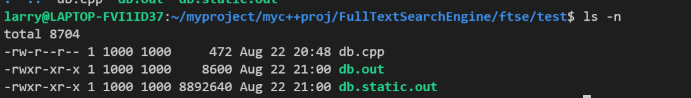
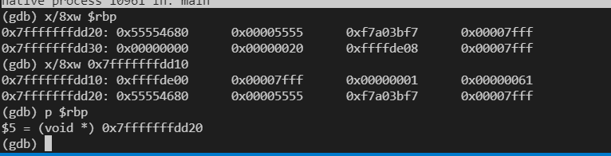

### G++/GCC
gcc and g++分别是`gnu`的c & c++编译器 

gcc/g++在执行编译工作的时候，总共需要4步  
1. 预处理,生成.i的文件  预处理器cpp
2. 将预处理后的文件不转换成汇编语言,生成文件.s 编译器egcs
3. 有汇编变为目标代码(机器代码)生成.o的文件 汇编器as
4. 连接目标代码,生成可执行程序 连接器ld


#### 总体选项

需要注意gcc 的选项是遵循getopt参数解析系统调用规则的
```cpp
#include <unistd.h>

       int getopt(int argc, char * const argv[],
                  const char *optstring);
```

-E: 只激活预处理,这个不生成文件,你需要把它重定向到一个输出文件里  
面.  
例子用法: 
```sh 
gcc -E hello.c > pianoapan.txt  
gcc -E hello.c | more  
```
其实,一个hello word 也要与处理成800行的代码  

-C  ：在预处理的时候,不删除注释信息,一般和-E使用,有时候分析程序，用这个很方便的 

-S  ：**只激活预处理和编译，就是指把文件编译成为汇编代码**。

例子用法  
```sh
gcc -S hello.c  
```
-c   只激活预处理,编译,和汇编,也就是他只把程序做成.o文件。不进行链接 
 
```sh
gcc -c hello.c 

将生成.o的obj文件  
g++ -c MemoryDetect.cpp
g++ -o test test.cpp MemoryDetect.o
```

<!-- more -->

#### 头文件和库文件选项 -I -L -l

-I dir  设置头文件查找路径, gcc/g++会先在当前目录查找所制定的头文件,如果没有找到,他回到缺省的头文件目录找,如果使用-I制定了目录查找路径,将优先从-I的目录查找，然后再按常规的顺序去找. 

-include file -i 相当于`#include` 包含某个代码,简单来说,就是便以某个文件,需要另一个文件的时候,就可以  用它设定,功能就相当于在代码中使用#include 

```sh 
gcc hello.c -include /root/pianopan.h  
```

-L dir  制定链接搜索库的路径。不然  编译器将只在标准库的目录找(/usr/local/lib, /usr/lib)。 

-l library   制定编译的时候具体使用的库  。-L和-l一个指定目录，一个指定库，常常同时用。


#### 调试选项
-g：只是编译器，在编译的时候，产生调试信息。之后可以使用gdb对输出文件进行调试

-ggdb：此选项将尽可能的生成gdb的可以使用的调试信息.

#### 链接方式选项

-static 此选项将禁止使用动态库(共享库)。
-shared (-G) 此选项将尽量使用动态库，为默认选项

#### 设置宏

使用-D参数, 表示预处理时设置了宏
```
gcc debugtest.c -o debugtest.exe -D DEBUG
```

编译leveldb例子
```
g++ -o leveldbTest test.cpp libleveldb.a -lpthread
其中-lpthread 连接pthread库, 
libleveldb.a为链接leveldb源码编译成的静态库，test.cpp是自己写的数据库操作代码。

-Wall 一般使用该选项，允许发出GCC能够提供的所有有用的警告。也可以用-W{warning}来标记指定的警告。
-w 关闭所有警告,建议不要使用此项
-Dmacro  预处理选项
相当于C语言中的#define macro  
-Dmacro=defn  
相当于C语言中的#define macro=defn 
```

#### 其他方式
-o 制定目标名称，表示编译链接生成可执行文件。,缺省的时候,gcc 编译出来的文件默认名称是a.out,

```sh
gcc -o hello.exe hello.c
gcc -o hello.asm -S hello.c 
```

-O0  -O1  -O2  -O3  编译器的优化选项的4个级别，-O0表示没有优化,-O1为缺省值，-O3优化级别最高
-fpic 编译器就生成位置无关目标码.适用于共享库(shared library).
-fPIC 编译器就输出位置无关目标码.适用于动态连接(dynamic linking),即使分支需要大范围转移.
-v 显示详细的编译、汇编、连接命令

linux设置软链接， 以gcc为例子
```sh
先删除和gcc4.4关联的gcc:
sudo rm gcc
sudo rm g++
再建个软连接
sudo ln -s gcc-4.3 gcc
sudo ln -s g++-4.3 g++
```
#### c++ 库文件搜索路径

对于`#include "headfile.h"` 搜索顺序为：
1. 先搜索当前目录
2. 然后搜索-I指定的目录
3. 再搜索gcc的环境变量CPLUS_INCLUDE_PATH（C程序使用的是C_INCLUDE_PATH）
4. 最后搜索gcc的内定目录
`/usr/include`
`/usr/local/include`

各目录存在相同文件时，先找到哪个使用哪个。

对于 `#include <headfile.h>`, 与前面相比不会搜索当前目录
1. 先搜索-I指定的目录
2. 然后搜索gcc的环境变量CPLUS_INCLUDE_PATH
3. 最后搜索gcc的内定目录
`/usr/include`
`/usr/local/include`
与上面的相同，各目录存在相同文件时，先找到哪个使用哪个。这里要注意，#include<>方式不会搜索当前目录。

#### 编译三管其下，同时设置好`-L`, `-I`, `-I`
```sh
gcc demo.c -o demo  -I /tools/libevent/include -L /tools/libevent/lib -l event

-I：头文件目录
-L:静态库目录
-l:静态库名字

g++ opendbsqlite.cpp -o db.out -lsqlite3 -L/usr/local/sqlite3/lib -I/usr/local/sqlite3/include 

# 等价于
g++ opendbsqlite.cpp -o db.out /usr/local/sqlite3/lib/libsqlite3.so -L/usr/local/sqlite3/lib -I/usr/local/sqlite3/include 

# 静态编译还需要连接别的库
# -lpthread -ldl -lm
g++ opendbsqlite.cpp -o db.out -lsqlite3 -L/usr/local/sqlite3/lib -I/usr/local/sqlite3/include -static -lpthread -ldl -lm

# 等价于
g++ opendbsqlite.cpp -o db.out /usr/local/sqlite3/lib/libsqlite3.a -L/usr/local/sqlite3/lib -I/usr/local/sqlite3/include -lpthread -ldl -lm
```

注意使用`-l`后面本应跟着静态库名字, 但在三管齐下方式下只需要跟简称(`libsqlite3.a变为splite3`)即可。`-I`, `-L`分别对应着`include`和`lib`目录。

默认是动态链接，静态链接只需要后面加`-static`即可, 这样自动提取静态库。但静态链接后的可执行文件要远大于动态链接后的可执行文件。



### GDB调试

> gdb十分强大, 上到函数对象方法, 下达内存地址寄存器汇编, 都可以显示

#### 基础指令
1. 进入GDB gdb test

test是要调试的程序，由gcc test.c -g -o test生成。进入后提示符变为(gdb) 。

2. 查看源码`list` 列出当前文件名和部分源码
**查看在其他文件中定义的函数**，在l后加上函数名即可定位到这个函数的定义及查看附近的其他源码

3. 设置断点 b 6

这样会在运行到源码第6行时停止，可以查看变量的值、堆栈情况等；这个行号是gdb的行号。

4. 查看断点处情况info b

查看断点信息，可以查看多个断点；

5. 运行代码r

6. 显示变量值p n

print是显示变量值的一般方法, 可以设置查看方式
```
x: 十六进制格式
d：有符号的十进制整数格式
u：无符号的十进制整数格式
o：八进制整数格式
t：二进制整数格式
c：字符格式
f：浮点数格式
```

7. 观察变量watch n

 在某一循环处，往往希望能够观察一个变量的变化情况, 当观察值发生改变时，程序才停止执行

8. 单步运行 n, 代码级别运行一行

9. 程序继续运行c

使程序继续往下运行，直到再次遇到断点或程序结束；

10. 退出GDB q

 
#### 断点指令

1. break + 设置断点的行号break n在n行处设置断点

2. break + filename + 行号 `break main.c:10`用于在指定文件对应行设置断点

3. break + <0x...> `break 0x3400a`用于在内存某一位置(地址)处暂停 

4. break + 行号 + if + 条件 `break 10 if i==3` 用于设置条件断点，在循环中使用非常方便 

5. info breakpoints/watchpoints [n] `info break` n表示断点号，查看断点/观察点的情况 

6. clear + 要清除的断点行号 `clear 10`用于清除对应行的断点，要给出断点的行号，清除时GDB会给出提示

7. delete + 要清除的断点编号`delete 3`用于清除断点和自动显示的表达式的命令，要给出断点的编号，清除时GDB不会给出任何提示

8. disable/enable + 断点编号`disable 3`让所设断点暂时失效/使能，如果要让多个编号处的断点失效/使能，可将编号之间用空格隔开

9. catch设置捕捉点来补捉程序运行时的一些事件。如：载入共享库（动态链接库）或是C++的异常 

#### 数据命令

1. display +表达式`display a`用于显示表达式的值，每当程序运行到断点处都会显示表达式的值 

2. info display 用于显示当前所有要显示值的表达式的情况 

3. delete + display 编号　　delete 3　　用于删除一个要显示值的表达式，被删除的表达式将不被显示

4. disable/enable + display 编号　　disable/enable 3　　使一个要显示值的表达式暂时失效/使能 

5. undisplay + display 编号　　undisplay 3　　用于结束某个表达式值的显示

6. whatis + 变量　　whatis i　　显示某个表达式的数据类型

print(p) + 变量/表达式　　p n　　用于打印变量或表达式的值
　　在使用print命令时，可以对变量按指定格式进行输出，其命令格式为print /变量名 + 格式

　　其中常用的变量格式：x：十六进制；d：十进制；u：无符号数；o：八进制；c：字符格式；f：浮点数。


7. set + 变量 = 变量值　　set i = 3　　改变程序中某个变量的值


#### 调试运行环境
1. set args　　set args arg1 arg2　　设置运行参数

2. show args　　show args　　参看运行参数

3. set width + 数目　　set width 70　　设置GDB的行宽

4. cd + 工作目录　　cd ../　　切换工作目录

5. run　　r/run　　程序开始执行

6. step(s)　　s　　进入式（会进入到所调用的子函数中）单步执行，进入函数的前提是，此函数被编译有debug信息

7. next(n)　　n　　非进入式（不会进入到所调用的子函数中）单步执行

8. finish　　finish　　一直运行到函数返回并打印函数返回时的堆栈地址和返回值及参数值等信息, 没有简写

9. until + 行数　　u 3　　运行到函数某一行, 或者跳出循环

10. continue(c)　　c　　执行到下一个断点或程序结束 

11. return <返回值>　　return 5　　改变程序流程，直接结束当前函数，并将指定值返回

12. call + 函数　　call func　　在当前位置执行所要运行的函数

#### 堆栈相关命令

1. backtrace/bt　　bt　　用来打印栈帧指针，也可以在该命令后加上要打印的栈帧指针的个数，查看程序执行到此时，是经过哪些函数呼叫的程序，**程序调用堆栈是当前函数之前的所有已调用函数的列表（包括当前函数）**。每个函数及其变量都被分配了一个帧，最近调用的函数在 0 号帧中（底帧）

2. frame frame 1　　用于打印指定栈帧

3. info reg　　info reg　　查看寄存器使用情况

4. info stack　　info stack　　查看堆栈使用情况

5. up/down　　up/down　　跳到上一层/下一层函数

6. 跳转执行
jump  指定下一条语句的运行点。可以是文件的行号，可以是file:line格式，可以是+num这种偏移量格式。表式着下一条运行语句从哪里开始。相当于改变了PC寄存器内容，堆栈内容并没有改变，跨函数跳转容易发生错误。

7. 信号命令
signal 　　signal SIGXXX 　　产生XXX信号，如SIGINT。速查Linux查询信号的方法：# kill -l

8. pwd　　显示当前的所在目录。

9. x 用来打印内存地址的内容(p打印变量内容)

10. layout src/asm 可以显示调试代码

```cpp
(gdb) help x
Examine memory: x/FMT ADDRESS.

ADDRESS is an expression for the memory address to examine.

FMT is a repeat count followed by a format letter and a size letter.

Format letters are o(octal), x(hex), d(decimal), u(unsigned decimal),t(binary), f(float), a(address), i(instruction), c(char) and s(string).

Size letters are b(byte), h(halfword), w(word), g(giant, 8 bytes).
The specified number of objects of the specified size are printed
according to the format.
Defaults for format and size letters are those previously used.
Default count is 1.  Default address is following last thing printed

x /6cb 0x804835c //打印地址0x804835c起始的内存内容，连续6个字节，以单字节格式输出。
x/8xw, 
```



以上, `print`是打印值, 默认10进制格式。而`x`作用是打印地址的值, 它把需要打印的值作为了一个地址。

* 储存从低地址向高地址储存, 读取也是高地址向地址读取

#### 其他知识
1. 调试已运行的程序

两种方法： 
* 在UNIX下用ps查看正在运行的程序的PID（进程ID），然后用gdb PID格式挂接正在运行的程序。 
* 先用gdb 关联上源代码，并进行gdb，在gdb中用attach命令来挂接进程的PID。并用detach来取消挂接的进程。

2. 暂停 / 恢复程序运行　　当进程被gdb停住时，你可以使用info program 来查看程序的是否在运行，进程号，被暂停的原因。 在gdb中，我们可以有以下几种暂停方式：断点（BreakPoint）、观察点（WatchPoint）、捕捉点（CatchPoint）、信号（Signals）、线程停止（Thread Stops），如果要恢复程序运行，可以使用c或是continue命令。

3. 线程（Thread Stops）

如果程序是多线程，可以定义断点是否在所有的线程上，或是在某个特定的线程。 
`break thread
break thread if ...`

linespec指定了断点设置在的源程序的行号。threadno指定了线程的ID，注意，这个ID是GDB分配的，可以通过info threads命令来查看正在运行程序中的线程信息。如果不指定thread 则表示断点设在所有线程上面。还可以为某线程指定断点条件。如： 
`break frik.c:13 thread 28 if bartab > lim `
当你的程序被GDB停住时，所有的运行线程都会被停住。这方便查看运行程序的总体情况。而在你恢复程序运行时，所有的线程也会被恢复运行。


#### 常用命令

```
run（简写r）： 运行程序，当遇到断点后，程序会在断点处停止运行，等待用户输入下一步的命令。

continue（简写c）：继续执行，到下一个断点处（或运行结束）

next（简写n）： 单步跟踪程序，当遇到函数调用时，直接调用，不进入此函数体；`n 2`执行两次
step（简写s）：单步调试如果有函数调用，则进入函数；与命令n不同，n是不进入调用的函数的

until：运行程序直到退出循环体; / until+行号： 运行至某行
finish： 运行程序，直到当前函数完成返回，并打印函数返回时的堆栈地址和返回值及参数值等信息。
call 函数(参数)：调用函数，并传递参数，如：call gdb_test(55)

quit：简记为 q ，退出gdb

break n（简写b n）:在第n行处设置断点 ;可以带上代码路径和代码名称： b OAGUPDATE.cpp:578）

break func：在函数func()的入口处设置断点，如：break cb_button
delete 断点号n：删除第n个断点
disable 断点号n：暂停第n个断点
enable 断点号n：开启第n个断点
clear 行号n：清除第n行的断点
info breakpoints（简写info b） ：显示当前程序的断点设置情况

# 断点
(gdb) break add.cpp:9

# 显示源码内容
list main.cpp:9

# display输出a和b的值,以后再断点处会显示变量的值。undisplay取消显示
(gdb) display a

(gdb) layout asm (显示汇编)
(gdb) layout split (同时显示源码和汇编)


print 表达式：简记为 p ，其中表达式可以是任何当前正在被测试程序的有效表达式，比如当前正在调试C语言的程序，那么表达式可以是任何C语言的有效表达式，包括数字，变量甚至是函数调用。

print a：将显示整数 a 的值
print ++a：将把 a 中的值加1,并显示出来
print name：将显示字符串 name 的值
print gdb_test(22)：将以整数22作为参数调用 gdb_test() 函数
print gdb_test(a)：将以变量 a 作为参数调用 gdb_test() 函数

display 表达式：在单步运行时将非常有用，使用display命令设置一个表达式后，它将在每次单步进行指令后，紧接着输出被设置的表达式及值。如： `display a`

watch 表达式：设置一个监视点，一旦被监视的“表达式”的值改变，gdb将强行终止正在被调试的程序。如： watch a

* layout：用于分割窗口，可以一边查看代码，一边测试：

layout src：显示源代码窗口
layout asm：显示反汇编窗口
layout regs：显示源代码/反汇编和CPU寄存器窗口
layout split：显示源代码和反汇编窗口


info registers 查看寄存器内容
```  

### vscode 的cpp调试配置
调试debug其实是两个任务，一般的，先使用g++或者cmake将源代码编译成可执行文件，再使用gdb调试生成的可执行文件。
例如，launch.json
关键的几个变量是， "program"，  "args"， "preLaunchTask"，"miDebuggerPath"。需要先执行preLaunchTask，也就是编译源文件。
```json
{
    // Use IntelliSense to learn about possible attributes.
    // Hover to view descriptions of existing attributes.
    // For more information, visit: https://go.microsoft.com/fwlink/?linkid=830387
    "version": "0.2.0",
    "configurations": [
        {
            "name": "g++ - Build and debug active file",
            "type": "cppdbg",
            "request": "launch",
            "program": "${fileDirname}/${fileBasenameNoExtension}",
            //表示可执行文件路径为${fileDirname}/${fileBasenameNoExtension}， 后者表示去掉后缀名的文件
            "args": [],
            "stopAtEntry": false,
            "cwd": "${workspaceFolder}",
            "environment": [],
            "console": "externalTerminal",
            "MIMode": "gdb",
            "setupCommands": [
                {
                    "description": "Enable pretty-printing for gdb",
                    "text": "-enable-pretty-printing",
                    "ignoreFailures": true
                }
            ],
            "preLaunchTask": "C/C++: g++ build active file",
            // 编译源文件
            "miDebuggerPath": "/usr/bin/gdb"
        }
    ]
}
```
task.json
关键参数有label（与preLaunchTask一致）， command, args。
```json
{
    "tasks": [
        {
            "type": "cppbuild",
            "label": "C/C++: g++ build active file",
            "command": "/usr/bin/g++",
            "args": [
                "-g",
                "${file}",
                "-o",
                "${fileDirname}/${fileBasenameNoExtension}"
            ],
            "options": {
                "cwd": "${workspaceFolder}"
            },
            "problemMatcher": [
                "$gcc"
            ],
            "group": {
                "kind": "build",
                "isDefault": true
            },
            "detail": "Task generated by Debugger."
        }
    ],
    "version": "2.0.0"
}
```
如果配置cmake,
```json
{
    "tasks": [
        {
            "label": "cmake",
            "type": "shell",
            "command": "/usr/bin/cmake",
            "args": ["../"],
            "options": {
                "cwd": "${workspaceFolder}/build"
            }
        },
        {
            "label": "make",
            "type": "shell",
            "command": "/usr/bin/make",
            "options": {
                "cwd": "${workspaceFolder}/build"
            }
        },
        {
            "type": "cppbuild",
            "label": "C/C++: g++ build active file",
            "dependsOn": ["cmake", "make"]
        }
    ],
    "version": "2.0.0"
}
```

vscode 的文件名
```
Supposing that you have the following requirements:
A file located at /home/your-username/your-project/folder/file.ext opened in your editor;
The directory /home/your-username/your-project opened as your root workspace.
So you will have the following values for each variable:
${workspaceFolder} - /home/your-username/your-project
${workspaceFolderBasename} - your-project
${file} - /home/your-username/your-project/folder/file.ext
${fileWorkspaceFolder} - /home/your-username/your-project
${relativeFile} - folder/file.ext
${relativeFileDirname} - folder
${fileBasename} - file.ext
${fileBasenameNoExtension} - file
${fileDirname} - /home/your-username/your-project/folder
${fileExtname} - .ext
${lineNumber} - line number of the cursor
${selectedText} - text selected in your code editor
${execPath} - location of Code.exe
${pathSeparator} - / on macOS or linux, \\ on Windows
Tip: Use IntelliSense inside string values for tasks.json and launch.json to get a full list of predefined variables.
```

