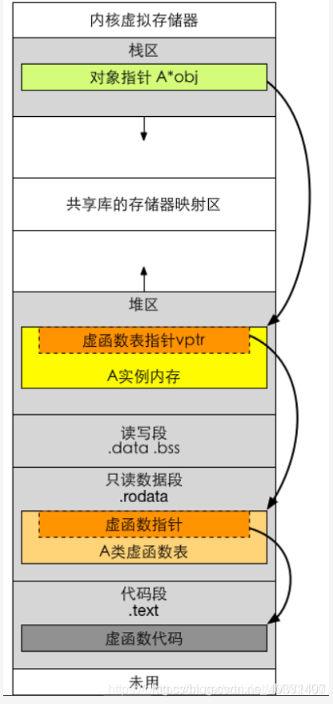
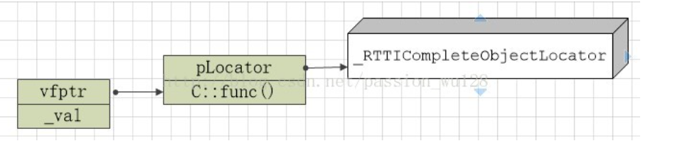

#### 虚函数

虚函数表指针是虚函数表所在位置的地址。虚函数表指针属于对象实例。因而通过new 出来的对象的虚函数表指针位于堆，声名对象的虚函数表指针位于栈

* 虚函数表位于只读数据段（.rodata），即：C++内存模型中的常量区；

* 虚函数代码则位于代码段（.text），也就是C++内存模型中的代码区



```cpp
#include <iostream>
 
using namespace std;
 
class A
{
public:
// 对象内存布局的最开始四个字节就是一个虚函数表指针（32位编译器）
	A(){};
	~A(){};
	virtual void vfun(){cout<<"vfun called!"<<endl;}
};
 
int main()
{
	A *a = new A();
	long vbaddr=*(int *)a;   //a起始指针转为整型指针便成了虚函数指针, 虚函数表地址
	long vfaddr= *(int *)vbaddr;   //虚函数vfun地址
	cout<<"addr of vb : "<<vbaddr<<endl;
	cout<<"addr of vfun : "<<vfaddr<<endl;
	
	((void(*)(void)) vfaddr)();   //根据虚函数地址调用虚函数
    // 将vfaddr转为一个(void(*) (void))的函数指针

    /// (返回值)(参数)成为一个函数类型
    /// (返回值)(变量)(参数)成为一个函数变量
 
	delete a;
	return 0;
}

```
https://blog.csdn.net/JMW1407/article/details/108243316

#### 虚函数表

C++规范并没有规定虚函数的实现方式。不过大部分C++实现都用虚函数表（vtable）来实现虚函数的分派。特别是对单继承的情况，大家的实现都比较接近。


一个实现虚函数表的例子
```cpp

#include <string>
#include <iostream>

class Object {
  int identity_hash_;

public:
  Object(): identity_hash_(std::rand()) { }

  int IdentityHashCode() const     { return identity_hash_; }

  virtual int HashCode()           { return IdentityHashCode(); }
  virtual bool Equals(Object* rhs) { return this == rhs; }
  virtual std::string ToString()   { return "Object"; }
};

class MyObject : public Object {
  int dummy_;

public:
  int HashCode() override           { return 0; }
  std::string ToString() override   { return "MyObject"; }
};

int main() {
  Object o1;
  MyObject o2;
  std::cout << o2.ToString() << std::endl
            << o2.IdentityHashCode() << std::endl
            << o2.HashCode() << std::endl;
}

/*
              Object                      vtable
                               -16 [ offset to top     ]  __si_class_type_info
                               -8  [ typeinfo Object   ] --> +0 [ ... ]
--> +0  [ vptr           ] --> +0  [ &Object::HashCode ]
    +8  [ identity_hash_ ]     +8  [ &Object::Equals   ]
    +12 [ (padding)      ]     +16 [ &Object::ToString ]

             MyObject                     vtable
                               -16 [ offset to top       ]  __si_class_type_info
                               -8  [ typeinfo MyObject   ] --> +0 [ ... ]
--> +0  [ vptr           ] --> +0  [ &MyObject::HashCode ]
    +8  [ identity_hash_ ]     +8  [ &Object::Equals     ]
    +12 [ dummy_         ]     +16 [ &MyObject::ToString ]

*/
```
可以看出对象的第一个元素是vptr虚函数指针, 指向虚函数表的虚函数地址(&Object::HashCode), 除了虚函数, 虚函数表中还有type_info等对象。

type_info对象实例化自class type_info, type_info存储了对象类型的信息, 具有虚函数的动态类型指向的虚函数表对应, 可以从对象中获取类型的信息, 有简单的反射意味。

The class type_info holds implementation-specific information about a type, including the name of the type and means to compare two types for equality or collating order. This is the class returned by the typeid operator.

```cpp
#include <typeinfo>
#include <iostream>
using namespace std;
class Animal
{
    public:
    virtual void show()
    {
    }
};
class Dog:public Animal
{
    public:
    virtual void show()
    {
    }
};
int main()
{
    /*  typeid用于具有多肽性的父子类之间*/
    Dog dog;
    Animal* p = &dog;
    cout << typeid(p).name() << endl; // 识别出P6Animal
    cout << typeid(*p).name() << endl; // 识别为3Dog 识别对象为子类对象, 尽管指针为Animal*
}
```

#### typeid

需要引入头文件, `#include <typeinfo>`, typeid的作用主要有二
1. Used where the dynamic type of a polymorphic object must be known

2. for static type identification.

When applied to an expression of polymorphic type, evaluation of a typeid expression may involve runtime overhead (a virtual table lookup), otherwise typeid expression is resolved at compile time. 也就是说, 当采用多态时typeid将基于虚函数表再运行时判断对象类型, 否则只需要再编译时确定类型。注意到算出表达式的静态类型是C++编译器的基本功能，类型检查、类型推导等许多功能都依赖它。

```cpp
typeid ( type )	(1)	
typeid ( expression )	(2)	
```

#### dynamic_cast

使用方法
```cpp
dynamic_cast < 新类型 > ( 表达式 )

Animal* p = &cat;
if(dynamic_cast<Dog*>(p))
{
    ((Dog*)p)->dogShow();
}
```
若转型成功，则 dynamic_cast 返回 新类型 类型的值。若转型失败且 新类型 是指针类型，则它返回该类型的空指针。若转型失败且 新类型 是引用类型，则它抛出与类型 std::bad_cast 的处理块匹配的异常。

在有虚函数的类层次之间使用dynamic_cast。要实现dynamic_cast，编译器会在每个含有虚函数的类的虚函数表的前四个字节存放一个指向_RTTICompleteObjectLocator结构的指针，当然还要额外空间存放_RTTICompleteObjectLocator及其相关结构的数据。

这个_RTTICompleteObjectLocator就是实现dynamic_cast的关键结构。里面存放了vfptr相对this指针的偏移，构造函数偏移（针对虚拟继承），type_info指针，以及类层次结构中其它类的相关信息。如果是多重继承，这些信息更加复杂。


dynamic_cast最大的问题在于效率，特别是继承体系特别深时


#### 隐式转换

都说explicit关键字是防止隐式转换, 那么什么是隐式转换呢。简而言之, 凡是没有强制类型转换的类型自动发生了类型转换, 都是隐式转换

常见的是算术隐式转换, 可以理解为C语言的隐式转换规则。
```
算术运算式中，低类型能够转换为高类型。

赋值表达式中，右边表达式的值自动隐式转换为左边变量的类型，并赋值给他。

函数调用中参数传递时，系统隐式地将实参转换为形参的类型后，赋给形参。

函数有返回值时，系统将隐式地将返回表达式类型转换为返回值类型，赋值给调用函数。
```

另外还有一些编译器自定义的转换规则也是隐式转换, 比如数组退化成指针，函数转换成函数指针，特定语境下要求的转换（if里要求bool类型的值），整数类型提升，数值转换，数据类型指针到void指针的转换，nullptr_t到数据类型指针的转换等。底层const和volatie也可以被转换，只不过只能添加不能减少，可以把`T*转换成const T*`，但反过来是不可以的。

C++ class 存在用户自定义的转换规则, 类似与构造函数可以将某些类型参数生成新的类型的对象, 用户定义转换函数是类似operator T2()这样的类方法，注意不需要指定返回值。通过它可以实现从T1转换到T2。
```cpp
struct A {};

struct B {
    // 转换构造函数
    B(int);
    B(const A&);

    // 用户定义转换函数，不需要显式指定返回值, 支持将B隐式转换为A, int
    operator A();
    operator int();
}
```

显然系统自动隐式转换就是类型上自动生成了`operator A()`等函数
```cpp
struct A
{
    operator int() const {
        std::cout << "covert A to int" << "\n";
    };
};

int main() {
    A a;
    bool b = a; // 发生了隐式转换
}

输出
 "covert A to int"
```

但是尽量不要去依赖隐式类型转换，多用explicit和各种显式转换，少想当然

### 其他一些关键字

#### enum class

C++中的switch-case仅受可以enum或可隐式转换成整型的数据类型。这时候可以使用枚举类型对字符串进行编码。

`enum`中变量的作用域在全局, 不在enum里面。因此可能发生变量冲突。
```cpp
enum Direction {TOP_LEFT, TOP_RIGHT, BOTTOM_LEFT, BOTTOM_RIGHT};

// error!
enum WindowsCorner {TOP_LEFT, TOP_RIGHT, BOTTOM_LEFT, BOTTOM_RIGHT};
```

引入`enum class`, black, white, red等则隶属于Color这个enum class的作用域。
```cpp
enum class Color {black, white, red};

auto white = false; // OK!
```


#### extern

引用同一个文件中的变量, 单独使用extern可以将定义转化为声明, 表示去别的地方寻找这个变量(链接)

```cpp
#include<stdio.h>
 
int func();
 
int main()
{
    func(); //1
    extern int num; // 这里是声明, 说明变量在别的地方(后面), 去别的地方找
    printf("%d",num); //2
    return 0;
}
 
int num = 3;
 
int func()
{
    printf("%d\n",num); 
}
```

也可表示要引用别的文件里的变量

```cpp
// main.c
#include<stdio.h>
 
int main()
{
    extern int num; // 在b.c里找定义
    // extern const int num; 如果不想这个变量被修改可以使用const关键字进行修饰，写法如下
    printf("%d",num);
    return 0;
}

// b.c
#include<stdio.h>
 
void func()
{
    int num = 5;
    printf("fun in a.c");
}
```

extern "C", 表示下面的代码块用C的形式编译,不要增加C++编译时修改函数名等特性。

在C++中调用C语言
```cpp
	
/* c语言头文件：cExample.h */
#ifndef C_EXAMPLE_H
#define C_EXAMPLE_H
extern int add(int x,int y);     //注:写成extern "C" int add(int , int ); 也可以
#endif
/* c语言实现文件：cExample.c */
#include "cExample.h"
int add( int x, int y )
{
　return x + y;
}
// c++实现文件，调用add：cppFile.cpp
extern "C"
{
　#include "cExample.h"        //注：此处不妥，如果这样编译通不过，换成 extern "C" int add(int , int ); 可以通过
}
int main(int argc, char* argv[])
{
　add(2,3);
　return 0;
}
```

在C语言中调用C++

```cpp
//C++头文件 cppExample.h
#ifndef CPP_EXAMPLE_H
#define CPP_EXAMPLE_H
extern "C" int add( int x, int y );
#endif
//C++实现文件 cppExample.cpp
#include "cppExample.h"
int add( int x, int y )
{
　return x + y;
}
/* C实现文件 cFile.c
/* 这样会编译出错：#include "cExample.h" */
extern int add( int x, int y );
int main( int argc, char* argv[] )
{
　add( 2, 3 );
　return 0;
}
```

#### 类型转换type_cast

C++提供了四个转换运算符, 其中`static_cast`和`const_cast`充分利用了编译器模板元的思想, 因此不难理解const_cast转换符为什么可以移除变量的const或volatile限定符。当然在运行期是不可能将const移除的, 因为const变量存储在符号表中

```cpp
const_cast <new_type> (expression)
static_cast <new_type> (expression)
reinterpret_cast <new_type> (expression)
dynamic_cast <new_type> (expression)
```

const_cast示例
```cpp
const int constant = 21;
const int* const_p = &constant; // const_p并没有引用constant, 后者在符号表中属于不可修改内存
int* modifier = const_cast<int*>(const_p);  // 这实际是编译期行为, 并不会影响运行期const int constant的存储, 只是对*modifier赋值
*modifier = 7;

cout << "constant: "<< constant <<endl;
cout << "const_p: "<< *const_p <<endl;
cout << "modifier: "<< *modifier <<endl;
/**
constant: 21
const_p: 7
modifier: 7
**/
```

dynamic_cast保证安全的向下转型, 即将基类的指针或引用安全地转换成派生类的指针或引用。

派生类向基类转换一定会成功(向上转型)。e的类型是目标type的基类，当e是指针指向派生类对象，或者基类引用引用派生类对象时，类型转换才会成功(多态转型)，当e指向基类对象，试图转换为派生类对象时，转换失败。e的类型就是type的类型时，一定会转换成功。

```cpp
dynamic_cast<type*>(e) //e是指针

dynamic_cast<type&>(e) //e是左值

dynamic_cast<type&&>(e)//e是右值
```

static_cast保证静态, 编译的安全转换。包括基本数据类型之间的转换, 各种隐式转换, 子类数组指针向上转成父类的指针(向上转换), 指针类型的相互转换(例如void*), 类型和右值引用


reinterpret_ cast 通常为操作数的位模式提供较低层的重新解释。通常可以实现不同类型的相互转换(类型可以理解为对内存位字节的解释), 它往往是危险的。