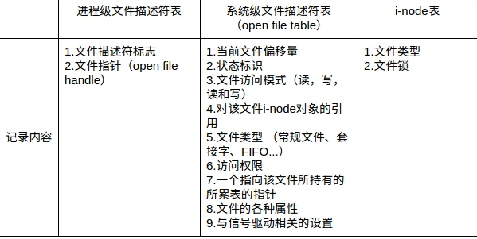
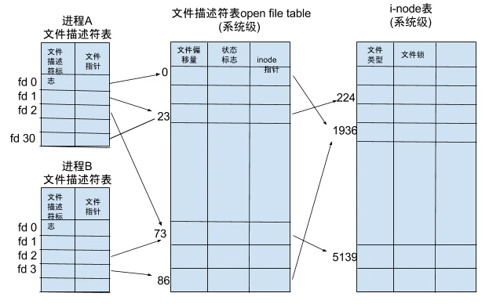

#### FILE文件指针

FILE结构体是C语言包装的stream, 较系统调用FILE内部维护了流缓冲区并指向流缓冲区的若干指针。FILE主要针对块设备, f族函数是标准库的内容，因此更具移植性; fread, fwrite分配的缓存对用户而言读写更快, 且有预读等策略。f族函数提供的函数对用户使用上更友好

```cpp
/// FILE.h文件
#ifndef __FILE_defined
#define __FILE_defined 1

struct _IO_FILE;

/* The opaque type of streams.  This is the definition used elsewhere.  */
typedef struct _IO_FILE FILE;

#endif

/// libio.h
struct _IO_FILE {
  int _flags;		/* High-order word is _IO_MAGIC; rest is flags. */
#define _IO_file_flags _flags

  /* The following pointers correspond to the C++ streambuf protocol. */
  /* Note:  Tk uses the _IO_read_ptr and _IO_read_end fields directly. */
  char* _IO_read_ptr;	/* Current read pointer */
  char* _IO_read_end;	/* End of get area. */
  char* _IO_read_base;	/* Start of putback+get area. */
  char* _IO_write_base;	/* Start of put area. */
  char* _IO_write_ptr;	/* Current put pointer. */
  char* _IO_write_end;	/* End of put area. */
  char* _IO_buf_base;	/* Start of reserve area. */

  struct _IO_marker *_markers;

  struct _IO_FILE *_chain;

  struct _IO_marker {
  struct _IO_marker *_next;
  struct _IO_FILE *_sbuf;
  /* If _pos >= 0
 it points to _buf->Gbase()+_pos. FIXME comment */
  /* if _pos < 0, it points to _buf->eBptr()+_pos. FIXME comment */
  int _pos;
```

输入输出流也可以看作一种FILE*
```cpp
extern struct _IO_FILE *stdin;          /* Standard input stream.  */
extern struct _IO_FILE *stdout;         /* Standard output stream.  */
extern struct _IO_FILE *stderr;         /* Standard error output stream.  */
```

文件指针是通过文件描述符实现的, 文件指针可以理解为C语言独有的IO处理风格。但注意到linux系统的文件不只是可读写文件, 还包括设备等, 毕竟一切皆文件。设备文件等不可以用`fopen`

文件描述符已经上升到系统的抽象, 例如内核会维护系统内所有打开的文件及其相关的元信息，该结构称为打开文件表(open file table)。而文件指针只是单纯打开文件使用,且文件指针提供了读取缓存调用之相当于打开读取文件到缓存, 用户直接操作缓存的数据。

流可以理解成持久化的缓冲, 有的流可以输出到屏幕上, 有的流可以持久化到磁盘, 如果想输出到屏幕, 给能输出到屏幕的流增加信息即可。但是流不是内存的字符串, 二者可以相互转换。也就是`sprintf`(从字符串格式化到流),`fscanf`(从流到字符串内存中)等操作

#### fopen

fopen内部也是调用的open系统调用, 但增加了更多策略类似与C++ ifstream的mode, C open的mode 可以选择如下

```cpp
#include <stdio.h>
FILE *fopen(const char *pathname, const char *mode);
FILE *fdopen(int fd, const char *mode);

r	打开一个已有的文本文件，允许读取文件。
w	打开一个文本文件，允许写入文件。如果文件不存在，则会创建一个新文件。
a	打开一个文本文件，以追加模式写入文件。如果文件不存在，则会创建一个新文件。程序会在已有的文件内容中追加内容。

r+	打开一个文本文件，允许读写文件。
w+	打开一个文本文件，允许读写文件。如果文件已存在，则文件会被截断为零长度，如果文件不存在，则会创建一个新文件。
a+	打开一个文本文件，允许读写文件。如果文件不存在，则会创建一个新文件。读取会从文件的开头开始，写入则只能是追加模式。
```

如果是二进制文件, 需要后面加一个`b`, 比如`r`变成`rb`

#### fseek

移动文件指针, 也就是FILE指针, 到指定的位置。

```cpp
#include <stdio.h>

int fseek(FILE *stream, long offset, int whence);
long ftell(FILE *stream);
void rewind(FILE *stream);
int fgetpos(FILE *stream, fpos_t *pos);
```

参数 offset 为根据参数 fromwhere 来移动读写位置的位移数。参数 fromwhere 为下列其中一种：、

SEEK_SET：从文件开头 offset；

SEEK_CUR：以目前的读写位置往后增加 offset；

SEEK_END：将读写位置指向文件尾再增加 offset 个位移量。

当 fromwhere 为 SEEK_CUR 或 SEEK_END 时，参数 offset 允许负值的出现。

```cpp
FILE* stream;
char s[81];
stream = fopen("fscanf.txt","w+"); /// 打开文件到stream文件指针
fprintf(stream,"%s %ld %f %c","a_string",6500,3.1415,'x');  // 格式化到stream中(在stram后面追加)
fseek(stream,0L,SEEK_SET); // 文件定位到开头
fscanf(stream,"%s",s);  /// stream到char s[81]中
printf("%s\n",s)  /// 输出
fclose(stream);  // 关闭
```

#### fread和fwrite

块读写

```cpp
#include <stdio.h>

size_t fread(void *ptr, size_t size, size_t nmemb, FILE *stream);

size_t fwrite(const void *ptr, size_t size, size_t nmemb,
                FILE *stream);
fread() does not distinguish between end-of-file and error, and callers must use feof(3) and ferror(3) to
determine which occurred
```

#### fgets, fputs
fgets()  reads  in  at  most  one  less  than size characters from stream and stores them into the buffer
       pointed to by s. 从stream读数据到char*

fputs() writes the string s to stream, without its terminating null byte ('\0'). 
puts() writes the string s and a newline to stdout
```cpp
#include <stdio.h>

int fgetc(FILE *stream);
char *fgets(char *s, int size, FILE *stream);
int getc(FILE *stream);
int getchar(void);

#include <stdio.h>

int fputc(int c, FILE *stream);
int fputs(const char *s, FILE *stream);
int putc(int c, FILE *stream);
int putchar(int c);
int puts(const char *s);
```

注意`fgets()`函数读到一个换行符，会把它储存在字符串中。函数用来向指定的文件写入一个字符串。

```cpp
void read_vector() {
    FILE* fp = fopen("input.txt", "r");
    char ch[80];
    //fscanf(fp,"%s",ch);     // 按行读入
    //cout<< ch << endl;
    while (!feof(fp)) {
        fgets(ch,80,fp);
        printf("%d\n", strlen(ch));
    }

}
输出
[3,2]
6
[2,5]
19
[[3,0,5],[1,2,10]]
5
[3,2]
```

前两个fgets读取到了`\n`换行符, 会输出且放在了strlen中。最后的`[3,2]`没有换行符。因此使用`fgets`需要特别注意字符串长度。fgets和fputs处理标准输入输出。注意fputs和fgets只能处理字符串, fprintf和fscanf可以处理格式化数据。但fscanf遇到空格就会截断。

```cpp
  char ch[80];
  fgets(ch,80,stdin);
  printf("%d\n", strlen(ch));
  fputs(ch, stdout);

  char* s = ch;
  int b = atoi(s);
  //fputs(b, stdout);
  fprintf(stdout, "%d", b);
输入输出
45
3
45
45
```

#### fprintf和fscanf
fprintf() and vfprintf() write output to the given output stream; sprintf(), snprintf(), vsprintf() and vsnprintf() write  to  the character string str.
```cpp
#include <stdio.h>

int printf(const char *format, ...);
int fprintf(FILE *stream, const char *format, ...);
int dprintf(int fd, const char *format, ...);
int sprintf(char *str, const char *format, ...);
int snprintf(char *str, size_t size, const char *format, ...);

#include <stdio.h>
#include <stdlib.h>

int main()
{
   FILE * fp;

   fp = fopen ("file.txt", "w+");
   fprintf(fp, "%s %s %s %d", "We", "are", "in", 2014);  // 格式化到stream中
   
   fclose(fp);
   
   char str[80];

   sprintf(str, "Pi 的值 = %f", M_PI);  //格式化到字符串中
   puts(str);
   
   return(0);
}
```

scanf
```cpp
#include <stdio.h>

int scanf(const char *format, ...);
int fscanf(FILE *stream, const char *format, ...);
int sscanf(const char *str, const char *format, ...);

fp = fopen ("file.txt", "w+");
fputs("We are in 2014", fp);

rewind(fp);
fscanf(fp, "%s %s %s %d", str1, str2, str3, &year);

char buf[80];
sprintf(buf, "The ASCII code of a is %d.", a);

/// 集中到str1, str2, str3, &year中
fputs("We are in 2014", fp);
fscanf(fp, "%s %s %s %d", str1, str2, str3, &year);
```

#### feof和ferror

feof()  tests  the  end-of-file  indicator  for the stream pointed to by stream, returning nonzero if it is set.

ferror() tests the error indicator for the stream pointed to by stream, returning nonzero if it is set.
```cpp
#include <stdio.h>

void clearerr(FILE *stream);
int feof(FILE *stream);
int ferror(FILE *stream);
int fileno(FILE *stream);
```

#### C语言字符数组和字符串指针

字符数组和字符串储存形式是一致的, 都会在结尾结尾加上'\0'

字符数组和字符串的访问都是可以越界的, 这样会造成缓冲区溢出

```cpp
    char a[5] = {'a', 'b', '\n'};
    char* b = a;
    cout << b<<endl;
    cout << strlen(b) <<endl;
    cout << sizeof(b) <<endl;
    cout << sizeof(a) <<endl;
输出
ab

3
8
5
    char * c = "abc";
    cout << strlen(c) <<endl;
    cout << sizeof(c) <<endl;
    cout << sizeof("abc")<<endl;

输出
3
8
4
```

#### 读取字符串的正确姿势, 键盘缓冲区

`fgets`会读取回车符, 因此构造string需要`string(ch, strlen(ch)-1)`, 对字符数组, 直接调用`strlen`可以得到实际字符的长度

`fgetc`负责接收`fscanf(stdin, "%d", &n);`输入的回车

```cpp
void read_vector_str() {
    int n;
    char ch[80];
    fscanf(stdin, "%d", &n);
    fgetc(stdin);
    vector<string> strs;
    for (int i = 0; i < n; i++){

        fgets(ch,80,stdin);
        cout << strlen(ch) <<endl;
        ///直接使用strlen
        strs.push_back(string(ch, strlen(ch)-1));
    }
    fputs("next\n", stdout);
    for (int i = 0; i < n; i++) {
        fputs(strs[i].c_str(), stdout);
        fprintf(stdout, "\n%s\n", strs[i].c_str());
    }
}

输出
3
ab c
5
def
4
a s
4
next
ab c
ab c
def
def
a s
a s
```

注意`fscanf`虽然虽然遇到空格, 回车会截断。**但是它没有清空键盘缓冲区,下次再读可能出错**。

```cpp
    printf("请输入字符串：");
    scanf("%s", str);
    printf("%s\n", str);
    scanf("%c", &ch);  /// 这时候读的char
    printf("ch = %c\n", ch);
    scanf("%c", &ch);  /// 这时候读的char
    printf("ch = %c\n", ch);
输出
请输入字符串：abcd e
abcdch =  ch = e
```

#### 其他函数

`long ftell(FILE *stream);`, 得到文件位置指针当前位置相对于文件首的偏移字节数。结合`fseek`很容易判断当前文件的位置。

文件描述符和文件指针的转换, `int fileno(FILE *stream);`
`FILE *fdopen(int fd, const char *mode);`


### unix文件系统调用

unix系统中, 一切皆文件, 文件接口描述了进程运行时的资源, 既可以作为持久化读写, 也可作为虚拟内存实现进程共享。系统为维护文件描述符建立了三个表





显然文件描述符是底层进程操纵硬件设备的抽象, 网卡, 磁盘等资源都可以抽象成文件描述符。unix会规定一些文件描述符, 比如0与进程的标准输入相关联，1与标准输出相关联，2与标准出错相关联。这些规定在`<unistd.h>`中。

unix相关的调用可在man手册查找
```
1 - 用户说明, 如gcc等可执行文件
2 - 系统函数, 系统调用如read
3 - 库函数, glibc如fread
4 - 特殊文件
5 - 文件格式
6 - 游戏
7 - 宏
8 - 维护命令
```

#### open

The open() system call opens the file specified by pathname.  If the specified file does not exist, it may optionally (if O_CREAT is specified in flags) be created by open().

open的主要开销在根据pathname寻找文件所在的设备块, 这会用类似hash表技术的优化
```cpp
#include <fcntl.h>

int open(const char *pathname, int flags);
int open(const char *pathname, int flags, mode_t mode);

O_RDONLY            //只读打开
O_WRONLY           //只写打开
O_RDWR               //读、写打开
O_APPEND             //每次写时都追加到文件的尾端  
O_CREAT               //若此文件不存在，则创建它
O_TRUNC              //如果此文件存在，而且为只写或读写成功打开，则将其长度截短为0
```

`int close(int fd)`关闭文件, 当一个进程终止时，内核自动关闭它所有打开的文件。很多程序都利用了这一功能而不显示地用close关闭打开文件。

#### lseek

当前文件偏移量, 通常，读、写操作都从当前文件偏移量处开始，并使偏移量增加所读写的字节数。虚拟文件接口会记录文件的偏移并直接定位到文件偏移所在的设备, 文件可能跨很多块

```cpp
#include <sys/types.h>
#include <unistd.h>

off_t lseek(int fd, off_t offset, int whence);
whence可以取值如下
SEEK_SET，偏移量设置为距文件开始处的offset个字节。
SEEK_CUR，当前值加offset，offset可为正或负。
SEEK_END, 文件长度(末尾)加offset，offset可为正或负。
```

文件偏移量可以大于文件的当前长度，在这种情况下，对该文件的下一次写将加长该文件，并在文件中构成一个空洞

#### read, write

read() attempts to read up to count bytes from file descriptor fd into the buffer starting at buf. If the file offset is at or past the end of file, no bytes  are read, and read() returns zero

返回读写的实际大小
```cpp
#include <unistd.h>

ssize_t read(int fd, void *buf, size_t count);
ssize_t write(int fd, const void *buf, size_t count);
```

注意有多种情况可使实际读到的字节数少于要求读的字节数：
1. 读普通文件时，在读到要求字节数之前已经到达了文件尾端。
2. 当从网络读时，网络中的缓冲机构可能造成返回值小于所要求读的字节数。
3. 当从管道或FIFO读时，如若管道包含的字节少于所需的数量，那么read将只返回实际可用的字节数。
4. 当从某些面向记录的设备（例如磁盘）读时，一次最多返回一个记录。


#### pread/pwrite和readv/writev

```cpp
#include <unistd.h>

ssize_t pread(int fd, void *buf, size_t count, off_t offset);

ssize_t pwrite(int fd, const void *buf, size_t count, off_t offset);
```

调用pread相当于顺序调用lseek和read，也就是在指定偏移offset位置开始读取count个字节， 但是pread又与这种顺序调用有下列重要区别：
1. 调用pread时，无法中断其定位和读操作。
2. 不更新文件指针。因此pread可以解决多个线程offset相互影响的问题, 将lseek和read包装成一个原子操作

readv和writev函数的功能可以概括为：对数据进行整合传输以及发送。通过writev函数可以将分散保存在多个buff的数据一并进行发送，通过readv可以由多个buff分别接受数据，适当的使用这两个函数可以减少I/O函数的调用次数，

read or write data into multiple buffers, 多个块读写
```cpp
#include <sys/uio.h>

ssize_t readv(int fd, const struct iovec *iov, int iovcnt);

ssize_t writev(int fd, const struct iovec *iov, int iovcnt);

ssize_t preadv(int fd, const struct iovec *iov, int iovcnt,
                off_t offset);

ssize_t pwritev(int fd, const struct iovec *iov, int iovcnt,
                off_t offset);

struct iovec
{
   void* iov_base; //缓冲地址
   size_t iov_len； //缓冲大小
}
char *str0 = "hello ";
char *str1 = "world\n";
struct iovec iov[2];
ssize_t nwritten;

iov[0].iov_base = str0;
iov[0].iov_len = strlen(str0);
iov[1].iov_base = str1;
iov[1].iov_len = strlen(str1);

nwritten = writev(STDOUT_FILENO, iov, 2);
```

#### fcntl 修改属性
performs one of the operations described below on the open file descriptor fd.  The operation is determined by cmd. 基于flag的设置
```cpp
#include <unistd.h>
#include <fcntl.h>

int fcntl(int fd, int cmd, ... /* arg */ );

F_DUPFD
与dup函数功能一样，复制由fd指向的文件描述符，调用成功后返回新的文件描述符，与旧的文件描述符共同指向同一个文件。

F_GETFD
读取文件描述符close-on-exec标志

F_SETFD
将文件描述符close-on-exec标志设置为第三个参数arg的最后一位

F_GETFL
获取文件打开方式的标志，标志值含义与open调用一致。返回值为响应标志

F_SETF
设置文件打开方式为arg指定方式, 返回值为成功失败

fcntl(oldfd, F_DUPFD, 0);
// 设置文件非阻塞
flags = fcntl(fd,F_GETFL,0);
flags |= O_NONBLOCK;
fcntl(fd,F_SETFL,flags);


File status flags
F_GETFL (void)  Return (as the function result) the file access mode and the file status flags;
F_SETFL (int)
Set the file status flags to the value specified by arg.  File access  mode  (O_RDONLY,  O_WRONLY,
O_RDWR) and file creation flags (i.e., O_CREAT, O_EXCL, O_NOCTTY, O_TRUNC) in arg are ignored.  On
Linux, this command can change only the O_APPEND, O_ASYNC,  O_DIRECT,  O_NOATIME,  and  O_NONBLOCK
flags.  It is not possible to change the O_DSYNC and O_SYNC flags

File descriptor flags
F_GETFD (void)  Return (as the function result) the file descriptor flags;
F_GETFD (void)  Return (as the function result) the file descriptor flags;
```

### 总结

FILE结构体是C语言包装的stream, 较C++的stream更像一个提供的文件流, 应用在块设备读取中

fopen, fseek, fread/fwrite, fgets/fputs, fprintf/fscanf, feof和ferror

open, lseek, read/write, pread/pwrite, readv/writev,  fcntl系统调用
