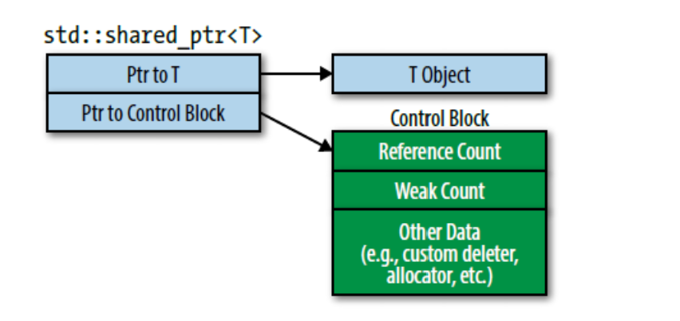
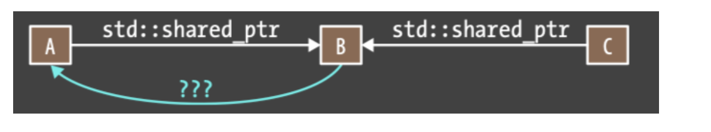

## small points
使用智能指针需要包含头文件`include <memory>`

### item18 独占资源使用`std::unique_ptr`

* 拷贝操作不被`std::unique_ptr`允许, 默认情况下`std::unique_ptr`等同于原始指针, 且对于大多数操作执行的指令完全相同。
* 离开作用域后, 自动释放`unique_ptr`包装对象的资源。

```cpp
// 创建一个unique_ptr实例
unique_ptr<int> pInt(new int(5));
// 无法进行拷贝构造和赋值
unique_ptr<int> pInt2(pInt);    // 报错
unique_ptr<int> pInt3 = pInt;   // 报错

/// 可以移动构造
unique_ptr<int> pInt2 = std::move(pInt);    // 转移所有权

/// 容器中保存指针
unique_ptr<int> p(new int(5));
vec.push_back(std::move(p));    // 使用移动语义

/// 释放资源
std::unique_ptr<T,D> up(t,d); /// D为删除器类型

up = nullptr;//置为空，释放up指向的对象
up.release();//放弃控制权，返回裸指针，并将up置为空
up.reset();//释放up指向的对象
```

<!-- more -->

#### `std::unique_ptr`常见用法是继承结构的工厂函数

如下继承结构
```cpp
class Investment {...};
class Sock : public Investment { ... };
class Bond : public Investment { ... };
class RealEstate : public Investment { ... };
```
工厂返回的对象完美符合`std::unique_ptr`的规则, 因为调用者对对象资源负责且对象不可复制, 只能从工厂返回。

```cpp
template <typename... Ts>
std::unique_ptr<Investment> makeInvestment(Ts&&.. params);  // 若干通用引用参数列表 params

/// 获得std::unique_ptr包装的对象
auto pInvestment = makeInvestment(arguments);
```

* 工厂函数下`std::unique_ptr`的逻辑

```cpp
auto delInvmt = [](Investment* pInvestment) {
    makeLogEntry(pInvestment);
    delete pInvestment;
};

/// 工厂函数, 返回`unique_ptr`绑定的对象
template <typename... Ts>
std::unique_ptr<Investment, decltype(delInvmt)> makeInvestment(Ts&& params) {
    /// 注册删除器为delInvmt
    std::unique_ptr<Investment, decltype(delInvmt)> pInv(nullptr, delInvmt)
    if (/* stock object should be created*/ )
        pInv.reset(new Stock(std::forward<Ts>(params)...));
    ...
    return pInv;
}
``` 

* `std::unique_ptr`可以转换为`std::shared_ptr`, 这说明即使工厂函数返回的是`std::unque_ptr`, 不妨碍使用者用`std::shared_ptr`替换它。

* 此外, `Pimpl Idiom`也常用`unique_ptr`, 例如muduo中大量不可拷贝的对象, 例如`Channel`,`Poller`, 也用`std::unique_ptr`实现`Pimpl Idiom`机制。该进制只在头文件中存储指针, 与前向声明类型结合, 只在实现文件中`#include`类型和实现, 可以降低头文件传递性编译依赖。

`std::unique_ptr`常用的特性是, 离开作用域自动释放资源。因此可以用来进行异常处理, 出现了异常可以基本保证内存不泄露

```cpp
void Func()
{
    unique_ptr<int> p(new int(5));

    // ...（可能会抛出异常）
}
```

另外作为容器中存储的指针

```cpp
int main() 
{
    vector<unique_ptr<int>> vec;
    unique_ptr<int> p(new int(5));
    vec.push_back(std::move(p));    // 使用移动语义
}
```

只要出现所有权的转移, 

### item 19 对于共享对象使用`std::shared_ptr`

`shared_ptr`使用引用计数确保是最后一个指向资源的指针, 引用计数为1时执行`reset`将会释放该资源。注意赋值运算符,`sp1=sp2`如果指向不同资源, 这导致`sp1`指向了`sp2`的资源, 因此`sp1`对象引用计数减1, `sp2`引用计数+1。

* `shared_ptr`大小是原始指针两倍, 因为包含一个引用计数值(引用计数对象应该是全局多个`shared_ptr`共享的)
* 由于引用计数对象应该是全局多个`shared_ptr`共享, 因此应该动态分配, 且递增递减必须是原子的(防止多个`shared_ptr`修改的竞态)

* 用老的`std::shared_ptr`移动构造新的`shared_ptr`结果是, 旧的`shared_ptr`置空, 新的`shared_ptr`取代旧的, 这样并不会改变引用计数(是一个全局变量), 因此移动赋值比拷贝赋值要快, 拷贝复制会增加引用计数。

```cpp
auto loggintDel = [](Widget* pw) {
    makeLogEntry(pw);
    delete pw;
};

std::unique_ptr<Widget, decltype(loggingDel)> upw(new Widget, loggingDel);

std::shared_ptr<Widget> spw(new Widget, loggingDel);
```

#### 销毁器类型不是`shared_ptr`类型的一部分, 这有别于`unique_ptr`

这使`shared_ptr`更加灵活,考虑有两个`shared_ptr`,每个自带不同的销毁器。
```cpp
auto customDeleter1 = [](Widget* pw) {...}
auto customDeleter2 = [](Widget* pw) {...}
std::shared_ptr<Widget> pw1(new Widget, customDeleter1);
std::shared_ptr<Widget> pw2(new Widget, customDeleter2);

// pw1和pw2相同的类型, 可以放在一个容器中, 也能相互赋值
std::vector<std::shared_ptr<Widget>> vpw{pw1, pw2};
```
以上如果是`unique_ptr`则不能放在一个容器中, 也能相互赋值, 因为**删除器也是`unique_ptr`类型的一部分, 而两者删除器并不相同**。

#### shared_ptr自定义删除器可能的问题

一般的, `shared_ptr`里面有两个指针，大小永远是8个字节。其中一个指针指向包装对象，另一个指向引用计数对象。

引用计数对象实际是一个数据结构，称之为控制块, 遵循如下规则
1. `std::make_shared`总是会创建一个控制块
2. 从`unique_ptr`构造`shared_ptr`时会创建控制块, 独占指针`unique_ptr`没有控制块。创建后`unique_ptr`置空。
3. 从原始指针构造`shared_ptr`也会创建控制块。



控制块可能包含多种引用计数, 每一种引用计数置零都会析构对象, 这增加了重复析构的风险。

```cpp
auto pw = new Widget;                           //pw是原始指针
…
std::shared_ptr<Widget> spw1(pw, loggingDel);   //为*pw创建控制块
…
std::shared_ptr<Widget> spw2(pw, loggingDel);   //为*pw创建第二个控制块
```
以上, 两个shared_ptr有两个控制块同时指向一个对象, 当两个控制块同时置零后`pw`会被销毁两次, 第二次就是未定义行为。

防止以上行为做法是, 直接返回`new`返回的结果, 不要传指针变量

```cpp
// 直接用new的结果
std::shared_ptr<Widget> spw1(new Widget, loggingDel);

std::shared_ptr<widget> spw2(spw1); // spw2将和spw1使用一样的控制块
```

#### this原始指针作为`std::shared_ptr`容易导致创建多个控制块

```cpp
/// 加入对象
std::vector<std::shared_ptr<Widget>> processedWidgets;

class Widget {
public:
    void process()
};

void Widget::process() {
    processedWidget.emplace_back(this); // 这里传入的this指针, 实际上增加了Widget对象的控制块
}
```
`std::shared_ptr`为指向的Widget（*this）创建一个控制块。但成员函数外面可能早已存在指向那个Widget对象的指针, 于是乎多个控制块问题。

* 解决以上问题方式是通过`std::enable_shared_from_this`, `shared_from_this`将会查找当前对象控制块, 然后创建一个新的`std::shared_ptr`指向该控制块。

```cpp
/// Widget需要继承public std::enable_shared_from_this<Widget>
class Widget: public std::enable_shared_from_this<Widget> {
public:
    …
    void process();
    …
};

void Widget::process()
{
    //把指向当前对象的std::shared_ptr加入processedWidgets
    processedWidgets.emplace_back(shared_from_this());
}
```

* `shared_from_this`必须要求已经有了`shared_ptr`指向当前对象, 否则行为是未定义的, 抛出异常。换句话说, 需要防止在调`shared_ptr`之前调用`enabled_from_this`

* 解决办法是使用工厂类, 将构造函数设置为private, 工厂类返回一个`shared_ptr`, 这样调用`enable_shared_from_this`前提就是拥有了一个`shared_ptr`封装的工厂返回对象

```cpp
class Widget: public std::enable_shared_from_this<Widget> {
public:
    //完美转发参数给private构造函数的工厂函数, 返回shared_ptr封装对象
    template<typename... Ts>
    static std::shared_ptr<Widget> create(Ts&&... params);
    …
    void process();     
    …
private:
    Widget();                   //构造函数
};
```

* 如果使用继承, 控制块内还有虚函数, 确保继承对象可以顺利销毁。类似于虚析构函数, cpp如果使用`Base *pTest = new Derived`, 会同时创建基类和子类对象, 若析构函数不为虚函数, 则`delete pTest`只会小销毁基类对象而不会涉及子类对象

* 在通常情况下，使用默认删除器和默认分配器，使用`std::make_shared`创建`std::shared_ptr`，产生的控制块只需三个word大小。它的分配基本上是无开销的。开销被并入了指向的对象的分配成本里。此外, 避免从原始指针变量上创建`std::shared_ptr`。


### 当`std::shared_ptr`可能悬空时使用`std::weak_ptr`

* std::weak_ptr通常从std::shared_ptr上创建。从std::shared_ptr上创建std::weak_ptr时两者指向相同的对象，但是std::weak_ptr不会影响所指对象的引用计数

```cpp
auto spw =                      //spw创建之后，指向的Widget的
    std::make_shared<Widget>(); //引用计数为1
std::weak_ptr<Widget> wpw(spw); //wpw指向与spw所指相同的Widget。引用计数仍为1
spw = nullptr;                  //RC变为0，Widget被销毁。
                                //wpw现在悬空

wpw.expired()   // expired()返回true说明已经悬空
```

当多线程情况时, 该对象可能被其他线程销毁。这时候需要一个**原子操作检查对象是否已经过期**，如果没有过期就访问所指对象。一种形式是`std::weak_ptr::lock`，返回一个`std::shared_ptr`，过期则`std::shared_ptr`为空。

#### `std::weak_ptr`防止环形引用



```cpp
std::shared_ptr<Widget> spw1 = wpw.lock();  //如果wpw过期，spw1就为空
 											
auto spw2 = wpw.lock();       

std::shared_ptr<Widget> spw3(wpw);          //如果wpw过期，抛出std::bad_weak_ptr异常
```

有三种选择：

* 原始指针。如果A被销毁，但是C继续指向B，B就会有一个指向A的悬空指针。**B不知道指针已经悬空**，所以B可能会继续访问，就会导致未定义行为。
* std::shared_ptr。A和B都互相持有对方的std::shared_ptr，导致的std::shared_ptr环状结构（A指向B，B指向A）阻止A和B的销毁。甚至A和B无法从其他数据结构访问了（比如，C不再指向B），每个的引用计数都还是1, 如此A和B都被泄漏：即程序无法访问它们，但是资源并没有被回收。
* std::weak_ptr。这避免了上述两个问题。如果A被销毁，B指向它的指针悬空，但是**B可以检测到这件事**。尤其是，尽管A和B互相指向对方，B的指针不会影响A的引用计数，

但注意在严格分层的数据结构, 比如树，子节点只被父节点持有, 子节点的生命周期肯定短于父节点。当父节点被销毁时，子节点就被销毁。父到子链接关系可以使用`std::unique_ptr`结构(父亲被销毁, 子也就被销毁了),从子到父的反向连接可以使用原始指针安全实现(子未被销毁, 父会一直存活)，没有子节点解引用一个悬垂的父节点指针这样的风险。

### 条款21 优先考虑使用`std::make_unique`, `std::make_shared`而非`new`

`std::make_shared`是C++11标准的一部分，`std::make_unique`则从C++14开始加入标准库。

`std::make_unique`的基础版本如下
```cpp
template<typename T, typename... Ts>
std::unique_ptr<T> make_unique(Ts&&... params)
{
    return std::unique_ptr<T>(new T(std::forward<Ts>(params)...));
}
```
* `make_unique`只是将参数完美转发到索要创建对象的构造函数。

* `std::make_unique`和`std::make_shared`是make三个步骤中的两个：**接收任意的多参数集合，完美转发到构造函数去动态分配一个对象初始化，然后返回这个指向这个对象的指针**。剩下一个步骤是`std::allocate_shared`是用来动态分配内存的allocator对象。

* `std::make_shared`相比`new`实现了效率提升

```cpp
std::shared_ptr<Widget> spw(new Widget);
```
直接使用new执行了两次内存分配, 先为Widget分配一次, 再为控制块分配一次。

```cpp
auto spw = std::make_shared_ptr<Widget>();
```
只分配一次内存, 容纳`Widget`和控制块。

* 当自定义删除器, 自带内存管理时, 不建议使用`make`

### 条款22 基于`shared_ptr`使用Pimpl(pointer to implement), 在文件中定义特殊成员函数


* 针对`unique_ptr`实现的pimpl, 往往需要带一个默认删除器(删除器是`unique_ptr`类型的一部分), 显然删除`unique_ptr`时会调用这个默认删除器, 但这个默认删除器会调用`static_assert`函数检查指向的对象是否为完成类型(显然`pimpl`是未完成类型, 需要链接时连上), 遂导致错误。

* 解决该问题的方法是, 在生成销毁`std::unique_ptr<Widget::Impl>`代码之前(也就是析构), `Widget::Impl`已经是完整类型。**成功编译的关键, 是在析构函数之前, 定义`Widget::Impl`**

* 特殊成员在头文件中仅声明, 而在.cc文件中定义, 且在`Widget::Impl`之后, 可以设置为`=default`

* 由于删除器不是`shared_ptr`的一部分, 因此**在析构函数之前, 定义`Widget::Impl`**的规则不适用于其, 但还是无论`unique_ptr`还是`shared_ptr`都这样做, 防止出错。

cpp98的Pimpl
```cpp
/// Widget.h
class Widget                        
{
public:
    Widget();
    ~Widget();              
private:
    struct Impl;                    //声明一个 实现结构体
    Impl *pImpl;                    //以及指向它的指针
};

/// Widget.cc
#include "widget.h"             
#include "gadget.h"
#include <string>
#include <vector>

struct Widget::Impl {           //Widget::Impl类型的定义
    std::string name;           
    std::vector<double> data;
    Gadget g1,g2,g3;
};

Widget::Widget()                //为此Widget对象分配数据成员
: pImpl(new Impl)
{}

Widget::~Widget()               //销毁数据成员
{ delete pImpl; }
```


cpp11中的pImpl

```cpp
///Widget.h
class Widget {                
public:
    Widget();
    ~Widget();                  //只有声明语句
private:                        
    struct Impl;
    std::unique_ptr<Impl> pImpl;
};

/// Widget.cc
#include "widget.h"           
#include "gadget.h"
#include <string>
#include <vector>

struct Widget::Impl {               //定义Widget::Impl
    std::string name;
    std::vector<double> data;
    Gadget g1,g2,g3;
}

Widget::Widget()                 
: pImpl(std::make_unique<Impl>())
{}

/// 在 Widget::Impl后面定义
Widget::~Widget()                   //但不需要delete pImpl了, 因为unique_ptr控制生命周期
{}
```

#### 移动构造函数的pImpl

```cpp
/// Widget
class Widget {                          
public:
    Widget();
    ~Widget();

    Widget(Widget&& rhs);               //只有声明
    Widget& operator=(Widget&& rhs);
    …

private:                               
    struct Impl;
    std::unique_ptr<Impl> pImpl;
};

/// Widget.cc
#include <string>   
#include "Widget.h"

struct Widget::Impl { … };          //跟之前一样

/// 特殊函数都定义在Impl之后
Widget::Widget()                  
: pImpl(std::make_unique<Impl>())
{}

Widget::~Widget() = default;   

///拷贝构造
Widget::Widget(const Widget& rhs)   //拷贝构造函数
: pImpl(std::make_unique<Impl>(*rhs.pImpl))
{}

Widget& Widget::operator=(const Widget& rhs)    //拷贝operator=
{
    *pImpl = *rhs.pImpl;
    return *this;
}

/// 析构, 移动构造    
Widget::Widget(Widget&& rhs) = default;             //这里定义
Widget& Widget::operator=(Widget&& rhs) = default;
```