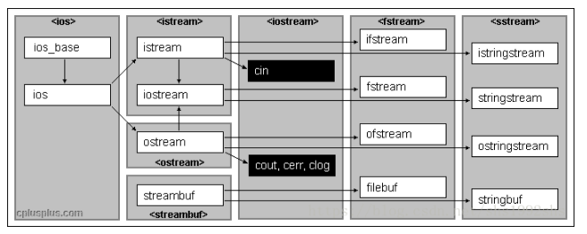

> C++ IO流对象是继承体系, istream->fstream; C语言的FILE也是操作文件的办法, 它们的底层都与文件描述符有密切关系。

### C++ stream

iostream 标准库提供了 cin 和 cout 方法分别用于从标准输入读取流和向标准输出写入流。流对象需要重载`<<`和`>>`两个操作符, `<<`流输出数据,写入磁盘等, `>>`向流中读入数据,写入内存。注意标准输入输出对应的终端和磁盘含义一样，因此使用`cout << "123"`表示输出数据`"123"`到标准终端。


如上控制台流(标准输入输出)是`istream`, `iostream`, `ostream`; 文件流主要有`ifstream`, `fstream`, `ofstream`。

注意文件流fstream是继承于istream的, 后者继承自`ios`。

使用这些对象注意`#include<ios>`, `#include <istream>`, `#include<iostream>`, `#include <fstream>`

`getline`可以将流对象按行输入到字符串中, `istream& getline (istream&  is, string& str);`, 显然基本全部的流对象都可以使用`getline`, 因为它们都继承自`istream`

```cpp
while (!in.eof())   /// in流是否读完
{
    getline(in, buffer);
    cout<<buffer<< endl;
}


```

#### 控制台流

`cin`, `cout`, `cerr`是常见的控制台流对象

```cpp
extern istream cin;		/// Linked to standard input
extern ostream cout;		/// Linked to standard output
extern ostream cerr;		/// Linked to standard error (unbuffered)
extern ostream clog;		/// Linked to standard error (buffered)
```

从控制台中字符串(包括空格), 注意`cin >> n`之后有回车, 如果接下来是`cin >> m`会忽略这个回车, 但接下来用`getline`则会读取缓冲区的空格。因此需要用`getc`来清除缓冲区的回车.

注意getc只能清除一个空格或者回车, 如果输入了多个, 就不能用一个getc了。

```cpp
    int n;
    char ch[80];
    string buffer;
    cin >> n;
    getc(stdin);
    vector<string> buffers;

    for (int i = 0; i < n; i++) {
        cout <<n<<" : "<<i <<":\n";
        getline(cin, buffer);
        buffers.push_back(buffer);
    }
    for (auto& str : buffers) {
        cout << str <<"\n";
    }
```

因此, 从`getline`中读取一行字符串, 再根据空格对字符串进行分隔, 这个需求就很常见。

C 库函数 `char *strtok(char *str, const char *delim)` 分解字符串 str 为一组字符串。初次使用时，需要传入str，将str的首个字符位置作为查找的起始位置，并返回不包含dilimiters定义字符的子串；后续使用传入NULL，并使用上一次查找到子串的尾部位置的下一个位置作为查找起始位置，继续查找

`strtok`的实现主要有两个点
1. strspn找到s第一个不在delim中的下标, 这样可以处理连续delim字符, 如连续空格`  ab`, 直接会找到`a`
2. 从上一步找到的第一个不在delim中的下标, 继续找下一个delim, 找到了设置为`\0`截断字符串。

注意第一次调用`strtok`需要输入待切分字符串s, 之后输入`NULL`, strtok会直接用`olds`来继续进行切分。此外delim最好设置为单个字符, 多个字符的话只需要一个字符匹配就算delim匹配。因此strtok并没有调用字符串匹配函数,而仅仅是单个字符匹配。

```cpp
char *
STRTOK (char *s, const char *delim)
{
  char *token;

  if (s == NULL)
    s = olds;

  /* Scan leading delimiters.  */
  s += strspn (s, delim);   /// s第一个不在delim中的下标, 如果*s == '\0', 说明s中元素delim都有, 不能分割
  if (*s == '\0')
    {
      olds = s;
      return NULL;
    }

  /* Find the end of the token.  */
  token = s;
  s = strpbrk (token, delim);   /// 从token中找含有delim任意字符之下标, 因此delim只需要一个字符匹配就算delim匹配
  if (s == NULL)
    /* This token finishes the string.  */
    olds = __rawmemchr (token, '\0');
  else
    {
      /* Terminate the token and make OLDS point past it.  */
      *s = '\0';  // delim字符处截断
      olds = s + 1;
    }
  return token;
}
```
使用`strtok`切分字符串
```cpp
vector<string> split(const string& str, const string& delim) {
	vector<string> res;
	if("" == str) return res;
	//先将要切割的字符串从string类型转换为char*类型
	char * strs = new char[str.length() + 1] ; //str.c_str()是const char*, 因此需要新开辟空间存储非const char*。
  // 也可以使用强制转换char* strs = const_cast<char*>(str.c_str());
	strcpy(strs, str.c_str()); 
 
  const char* d = delim.c_str();
 
	char *p = strtok(strs, d);
	while(p) {
		string s = p; //分割得到的字符串转换为string类型
		res.push_back(s); //存入结果
		p = strtok(NULL, d);  // 继续切分
	}
 
	return res;
}
void test3() { //正常字符串
	string s = "my  name nis lmm   ";//连续多个空格，空格会被过滤掉
	
	std::vector<string> res = split(s, " ");
	for (int i = 0; i < res.size(); ++i)
	{
		cout << res[i] <<endl;
	}
}
/// 输出
my
name
nis
lmm
```

以上我们知道字符匹配可以用`strpbrk`,返回匹配下标; 字符匹配和切分用`strtok`。对于字符串的匹配, 用`strstr`

`strstr(str1,str2)` 函数用于判断字符串str2是否是str1的子串。如果是，则该函数返回str2在str1中首次出现的地址；否则，返回NULL。我们可以基于`strstr`实现字符串的匹配分割。

```cpp
void splitStr() {
    char a[]="aaa||a||bbb||c||ee||"; //// 不能用char* a = ",,,"
    char* needle="||";
    a[0] = 'b';
    char* haystack = a; // 这里是为了后面可以实现haystack = buf + strlen(needle);等操作
    cout << haystack<<endl;
    char* buf = strstr( haystack, needle);
    while(buf != NULL )    {
       //在出现分隔符的位置设置结束符\0
        *buf = '\0';
        printf( "%s\n", haystack);
        haystack = buf + strlen(needle);
        buf = strstr( haystack, needle);
        } 
}
```

注意`char *a="abcdef"`与`char a[]="abcdef"`的区别：
1. 字符串存放的内存区域不同：前者存放在常量区，不可修改，后则存放在栈中，可以修改；
2. 变量a存放的内容不同：前者存放的是一个地址，而后者存放的是字符串"abcdef"，因此使用sizeof它们的结果是不同的，分别是4和7;
3. 此外关于new分配的对象数组的情形，以为是内存区中的修改。所以也是可以实现修改字符串的。

**注意C语言数组和指针区别, 数组往往指在栈区开辟的连续字符内存, 指针则用于操纵字符。因此最好责任分清, 栈开辟内存用`char[]`, 操纵字符用`char*`。当然如果是堆区, 直接用指针即可。

#### 文件流, 打开文件 open(filename, mode)

`void open (const char * filename, openmode mode);`, mode打开文件的方式是在ios类中定义。

```
mode打开文件的方式是在ios类中定义的, 联合使用中间以|间隔。

ios::in	为输入(读)而打开文件, 读到内存
ios::out	为输出(写)而打开文件,例如写入磁盘
ios::binary	二进制方式打开，用于二进制文件
ios::ate	初始位置：文件尾
ios::app	所有输出附加在文件末尾
ios::trunc	如果文件已存在则先删除该文件
ios::nocreate	不建立文件，所以文件不存在时打开失败
ios::ios::noreplace	不覆盖文件，所以打开文件时如果文件存在失败
```

#### 文件流读写fstream, ifstream, ofstream

默认情况下
```
fstream： ios::in | ios::out  // 打开文件做读写
ifstream： ios::in  // 打开文件读操作
ofstream：ios::out | ios::trunc //打开文件做写操作，如果文件已存在则先删除该文件
```

向文件中写数据
```cpp
/// 写入到文件中, 向文件输出
ofstream out("example.txt");  /// 输出操作,out
if (!out) //!运算符已经重载
{
    return false;
｝
else{
    out << "This is a line.\n";
    out << "This is another line.\n";
    out.close();
}
```

从文件中读数据
```cpp
char buffer[256];
ifstream in("example.txt");
if (!in.is_open())
{
    cout << "Error opening file"; exit (1);
}
while (!in.eof())   /// 文件是否读完
{
    in.getline(buffer,100);//getline()函数的作用是逐行读取流in中的数据, 还可以用in >> buff, 表示读入数据到变量buff中
    cout<<buffer<< endl;
}
```

#### C++ find和substr
`find`可用来查找字符或者字符串, `size_t find (const char* s, size_t pos = 0) const;`, 如果没有找到, 会返回一个`string::npos`。

```cpp
vector<string> split_find(const string line, const string sep)
{
	vector<string> buf;
	int temp=0;
	string::size_type pos=0;

    pos = line.find(sep, temp);
	while (pos!=string::npos)
	{
		buf.push_back(line.substr(temp, pos-temp));
		temp = pos + sep.size();
    pos = line.find(sep, temp);
	}
	buf.push_back(line.substr(temp, line.size() - temp));
	return buf;
}
 
int test_find()
{
	string line = "C:\\Users\\79476\\Desktop";
	vector<string> buf = split_find(line,"\\");
	typedef vector<string>::iterator itr;
	for (itr i = buf.begin(); i != buf.end(); i++)
	{
		cout << *i << endl;
	}
}

输出
C:
Users
79476
Deskto
```

#### C++ stream的一些缺陷

* std::endl会强制刷新缓冲区, 换行最好使用`\n`;
* C++中的std :: cin和std :: cout为了兼容C，保证在代码中同时出现std :: cin和scanf或std :: cout和printf时输出不发生混乱，用一个流缓冲区来同步C的标准流。这降低了效率, 通过设置`ios::sync_with_stdio(false);`可避免之从而提升效率。但当设置为false时，cin就不能和scanf，sscanf, getchar, fgets等同时使用。
* `std::cin`默认是与`std::cout`绑定的，所以每次操作的时候（也就是调用`<<`或者`>>`）都要刷新（调用flush），这样增加了IO的负担，通过`tie(nullptr)`来解除`std ::cin`和`std::cout`之间的绑定，来降低IO的负担使效率提升。

```cpp
std::ios::sync_with_stdio(false);
cin.tie(nullptr);
```

* 格式化糟糕, 需要格式化操作的最好换用其他stream库。

https://www.cnblogs.com/Solstice/archive/2011/07/17/2108715.html

### C IO

来自`#include<stdio.h>`

#### FILE文件指针

FILE结构体是C语言包装的文件指针, 指向打开的文件。

```cpp
/// FILE.h文件
#ifndef __FILE_defined
#define __FILE_defined 1

struct _IO_FILE;

/* The opaque type of streams.  This is the definition used elsewhere.  */
typedef struct _IO_FILE FILE;

#endif
```

可以读的文件内容早已在缓存中, 即使没有在之前也通过系统调用从磁盘获取内容到了缓存。因此直接使用`_IO_read_ptr`来定位读写。
```cpp
/// libio.h
struct _IO_FILE {
  int _flags;		/* High-order word is _IO_MAGIC; rest is flags. */
#define _IO_file_flags _flags

  /* The following pointers correspond to the C++ streambuf protocol. */
  /* Note:  Tk uses the _IO_read_ptr and _IO_read_end fields directly. */
  char* _IO_read_ptr;	/* Current read pointer */
  char* _IO_read_end;	/* End of get area. */
  char* _IO_read_base;	/* Start of putback+get area. */
  char* _IO_write_base;	/* Start of put area. */
  char* _IO_write_ptr;	/* Current put pointer. */
  char* _IO_write_end;	/* End of put area. */
  char* _IO_buf_base;	/* Start of reserve area. */

```

输入输出流也可以看作一种FILE*
```cpp
extern struct _IO_FILE *stdin;          /* Standard input stream.  */
extern struct _IO_FILE *stdout;         /* Standard output stream.  */
extern struct _IO_FILE *stderr;         /* Standard error output stream.  */
```

* 文件指针是通过文件描述符实现的, 文件指针可以理解为C语言独有的IO处理风格。但注意到linux系统的文件不只是可读写文件, 还包括设备等, 毕竟一切皆文件。设备文件等不可以用`fopen`
* 文件描述符已经上升到系统的抽象, 例如内核会维护系统内所有打开的文件及其相关的元信息，该结构称为打开文件表(open file table)。而文件指针只是单纯打开文件使用,且文件指针提供了读取缓存调用之相当于打开读取文件到缓存, 用户直接操作缓存的数据。

* 流可以理解成持久化的缓冲, 有的流可以输出到屏幕上, 有的流可以持久化到磁盘, 如果想输出到屏幕, 给能输出到屏幕的流增加信息即可。但是流不是内存的字符串, 二者可以相互转换。也就是`sprintf`(从字符串格式化到流),`fscanf`(从流到字符串内存中)等操作

#### fopen

`FILE *fopen( const char * filename, const char * mode );`, 类似与C++ ifstream的mode, C open的mode 可以选择如下

```
r	打开一个已有的文本文件，允许读取文件。
w	打开一个文本文件，允许写入文件。如果文件不存在，则会创建一个新文件。
a	打开一个文本文件，以追加模式写入文件。如果文件不存在，则会创建一个新文件。程序会在已有的文件内容中追加内容。

r+	打开一个文本文件，允许读写文件。
w+	打开一个文本文件，允许读写文件。如果文件已存在，则文件会被截断为零长度，如果文件不存在，则会创建一个新文件。
a+	打开一个文本文件，允许读写文件。如果文件不存在，则会创建一个新文件。读取会从文件的开头开始，写入则只能是追加模式。
```

如果是二进制文件, 需要后面加一个`b`, 比如`r`变成`rb`

#### fseek

移动文件指针, 也就是FILE指针, 到指定的位置。`int fseek(FILE * stream, long offset, int fromwhere);`

* 参数 offset 为根据参数 fromwhere 来移动读写位置的位移数。参数 fromwhere 为下列其中一种：、

SEEK_SET：从文件开头 offset；

SEEK_CUR：以目前的读写位置往后增加 offset；

SEEK_END：将读写位置指向文件尾再增加 offset 个位移量。

当 fromwhere 为 SEEK_CUR 或 SEEK_END 时，参数 offset 允许负值的出现。

```cpp
FILE* stream;
char s[81];
stream = fopen("fscanf.txt","w+"); /// 打开文件到stream文件指针
fprintf(stream,"%s %ld %f %c","a_string",6500,3.1415,'x');  // 格式化到stream中(在stram后面追加)
fseek(stream,0L,SEEK_SET); // 文件定位到开头
fscanf(stream,"%s",s);  /// stream到char s[81]中
printf("%s\n",s)  /// 输出
fclose(stream);  // 关闭
```

#### fread和fwrite

* `fread()` 函数用来从指定文件`*fp`中读取块数据到`*ptr`中。
`size_t fread ( void *ptr, size_t size, size_t count, FILE *fp );`

* `fwrite()` 函数用来向文件中写入块数据，它的原型为：
`size_t fwrite ( void * ptr, size_t size, size_t count, FILE *fp );`

#### fgets, fputs

`char *fgets ( char *str, int n, FILE *fp );`, 从指定的文件中读取一个字符串，并保存到字符数组中。

`int fputs( char *str, FILE *fp );`

注意`fgets()`函数读到一个换行符，会把它储存在字符串中。函数用来向指定的文件写入一个字符串。

```cpp
void read_vector() {
    FILE* fp = fopen("input.txt", "r");
    char ch[80];
    //fscanf(fp,"%s",ch);     // 按行读入
    //cout<< ch << endl;
    while (!feof(fp)) {
        fgets(ch,80,fp);
        printf("%d\n", strlen(ch));
    }

}
输出
[3,2]
6
[2,5]
19
[[3,0,5],[1,2,10]]
5
[3,2]
```

* 前两个fgets读取到了`\n`换行符, 会输出且放在了strlen中。最后的`[3,2]`没有换行符。因此使用`fgets`需要特别注意字符串长度。

fgets和fputs处理标准输入输出。注意fputs和fgets只能处理字符串, fprintf和fscanf可以处理格式化数据。但fscanf遇到空格就会截断。

```cpp
  char ch[80];
  fgets(ch,80,stdin);
  printf("%d\n", strlen(ch));
  fputs(ch, stdout);

  char* s = ch;
  int b = atoi(s);
  //fputs(b, stdout);
  fprintf(stdout, "%d", b);
输入输出
45
3
45
45
```
甚至可以`fprintf(fp, "%s %s %s %d", "We", "are", "in", 2014);`集中格式化到流中。

类似的,`sprintf`是将格式化后的数据写入到字符串。

```cpp
char buf[80];
sprintf(buf, "The ASCII code of a is %d.", a);

/// 集中到str1, str2, str3, &year中
fputs("We are in 2014", fp);
fscanf(fp, "%s %s %s %d", str1, str2, str3, &year);
```

#### C语言字符数组和字符串指针

* 字符数组和字符串储存形式是一致的, 都会在结尾结尾加上'\0'
* 字符数组和字符串的访问都是可以越界的, 这样会造成缓冲区溢出

```cpp
    char a[5] = {'a', 'b', '\n'};
    char* b = a;
    cout << b<<endl;
    cout << strlen(b) <<endl;
    cout << sizeof(b) <<endl;
    cout << sizeof(a) <<endl;
输出
ab

3
8
5
    char * c = "abc";
    cout << strlen(c) <<endl;
    cout << sizeof(c) <<endl;
    cout << sizeof("abc")<<endl;

输出
3
8
4
```


#### 读取字符串的正确姿势, 键盘缓冲区

* `fgets`会读取回车符, 因此构造string需要`string(ch, strlen(ch)-1)`, 对字符数组, 直接调用`strlen`可以得到实际字符的长度
* `fgetc`负责接收`fscanf(stdin, "%d", &n);`输入的回车

```cpp
void read_vector_str() {
    int n;
    char ch[80];
    fscanf(stdin, "%d", &n);
    fgetc(stdin);
    vector<string> strs;
    for (int i = 0; i < n; i++){

        fgets(ch,80,stdin);
        cout << strlen(ch) <<endl;
        ///直接使用strlen
        strs.push_back(string(ch, strlen(ch)-1));
    }
    fputs("next\n", stdout);
    for (int i = 0; i < n; i++) {
        fputs(strs[i].c_str(), stdout);
        fprintf(stdout, "\n%s\n", strs[i].c_str());
    }
}

输出
3
ab c
5
def
4
a s
4
next
ab c
ab c
def
def
a s
a s
```

* 注意`fscanf`虽然虽然遇到空格, 回车会截断。**但是它没有清空键盘缓冲区,下次再读可能出错**。

```cpp
    printf("请输入字符串：");
    scanf("%s", str);
    printf("%s\n", str);
    scanf("%c", &ch);  /// 这时候读的char
    printf("ch = %c\n", ch);
    scanf("%c", &ch);  /// 这时候读的char
    printf("ch = %c\n", ch);
输出
请输入字符串：abcd e
abcdch =  ch = e
```

#### 其他函数

`long ftell(FILE *stream);`, 得到文件位置指针当前位置相对于文件首的偏移字节数。结合`fseek`很容易判断当前文件的位置。

文件描述符和文件指针的转换, `int fileno(FILE *stream);`
`FILE *fdopen(int fd, const char *mode);`


### 文件描述符

unix系统中, 一切皆文件, 文件描述符是与进程挂钩的。系统为维护文件描述符建立了三个表


显然文件描述符是底层进程操纵硬件设备的抽象, 网卡, 磁盘等资源都可以抽象成文件描述符。unix会规定一些文件描述符, 比如0与进程的标准输入相关联，1与标准输出相关联，2与标准出错相关联。这些规定在`<unistd.h>`中。

#### open

`int open(const char *pathname, int mode)`位于头文件`#include<fcntl.h>`中。mode的选项和fopen类似, 返回fd.

```
O_RDONLY            //只读打开
O_WRONLY           //只写打开
O_RDWR               //读、写打开
O_APPEND             //每次写时都追加到文件的尾端  
O_CREAT               //若此文件不存在，则创建它
O_TRUNC              //如果此文件存在，而且为只写或读写成功打开，则将其长度截短为0
```

`int close(int fd)`关闭文件, 当一个进程终止时，内核自动关闭它所有打开的文件。很多程序都利用了这一功能而不显示地用close关闭打开文件。

#### lseek

`off_t lseek(int filedes, off_t offset, int whence);`
当前文件偏移量, 通常，读、写操作都从当前文件偏移量处开始，并使偏移量增加所读写的字节数。注意头文件是`#include<unistd.h>`

```
whence可以取值如下
SEEK_SET，偏移量设置为距文件开始处的offset个字节。
SEEK_CUR，当前值加offset，offset可为正或负。
SEEK_END, 文件长度(末尾)加offset，offset可为正或负。
```

文件偏移量可以大于文件的当前长度，在这种情况下，对该文件的下一次写将加长该文件，并在文件中构成一个空洞

#### read, write

`ssize_t read(int filedes, void *buf, size_t nbytes);`头文件是`#include<unistd.h>`

注意有多种情况可使实际读到的字节数少于要求读的字节数：
* 读普通文件时，在读到要求字节数之前已经到达了文件尾端。
* 当从网络读时，网络中的缓冲机构可能造成返回值小于所要求读的字节数。
* 当从管道或FIFO读时，如若管道包含的字节少于所需的数量，那么read将只返回实际可用的字节数。
* 当从某些面向记录的设备（例如磁盘）读时，一次最多返回一个记录。

`ssize_t write(int filedes, const void *buf, size_t nbytes)`

#### pread/pwrite和readv/writev

`ssize_t pread(int filedes, void *buf, size_t nbytes, off_t offset);`, 
`ssize_t pwrite(int filedes, void *buf, size_t nbytes, off_t offset);`头文件是`#include<unistd.h>`

调用pread相当于顺序调用lseek和read，也就是在指定偏移offset位置开始读取count个字节， 但是pread又与这种顺序调用有下列重要区别：
1. 调用pread时，无法中断其定位和读操作。
2. 不更新文件指针。因此pread可以解决多个线程offset相互影响的问题。


readv和writev函数的功能可以概括为：对数据进行整合传输以及发送。通过writev函数可以将分散保存在多个buff的数据一并进行发送，通过readv可以由多个buff分别接受数据，适当的使用这两个函数可以减少I/O函数的调用次数， 头文件`#include<sys/uio.h>`
```cpp
ssize_t read(int fd, void *buf, size_t nbyte);
ssize_t pread(int fd, void *buf, size_t nbyte, off_t offset);

ssize_t readv(int fd, const struct iovec *iov, int iovcnt);
ssize_t preadv(int fd, const struct iovec *iov, int iovcnt,  off_t offset);

ssize_t writev(int fileds,const struct iovec* iov,int iovcnt);
```

 iovec结构体定义如下
```cpp

struct iovec
{
   void* iov_base; //缓冲地址
   size_t iov_len； //缓冲大小
}
```

示例
```cpp
#include<stdio.h>
#include<string.h>
#include<sys/uio.h>
int main()
{
    struct iovec iv1,iv2;
    struct iovec iovs[2];
 
 
    iv1.iov_base="123456789\n";
    iv1.iov_len=strlen("123456789\n");
 
 
    iv2.iov_base="qwertyuiop\n";
    iv2.iov_len=strlen("qwertyuiop\n");
 
 
    iovs[0]=iv1;
    iovs[1]=iv2;
 
 
    writev(1,iovs,2);//1是标准输出缓冲区的文件描述符，2是iovs的size
    return 0;
}
```

#### fcntl

`int fcntl(int fd, int cmd);`, 需要用到`#include<unistd.h>`和`#include<fcntl.h>`

fcntl函数功能依据cmd的值
```cpp
F_DUPFD
与dup函数功能一样，复制由fd指向的文件描述符，调用成功后返回新的文件描述符，与旧的文件描述符共同指向同一个文件。

F_GETFD
读取文件描述符close-on-exec标志

F_SETFD
将文件描述符close-on-exec标志设置为第三个参数arg的最后一位

F_GETFL
获取文件打开方式的标志，标志值含义与open调用一致

F_SETF
设置文件打开方式为arg指定方式
```