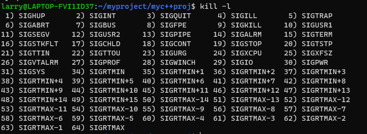

> glibc是C语言的库函数, 持有系统调用的底层接口和常用处理函数。cpp也许不常用malloc, 但字符串函数常常在cpp使用

### 进程管理

#### signal信号处理

`void (*signal(int sig, void (*func)(int)))(int)` 表示捕捉信号signal, 如果捕捉到调用func信号处理函数

使用`kill -l`可查询所有信号

```
取值	名称	解释	默认动作
1	SIGHUP	挂起	 
2	SIGINT	中断, 也就是CTRL-C	 
3	SIGQUIT	退出	 
4	SIGILL	非法指令	 
5	SIGTRAP	断点或陷阱指令	 
6	SIGABRT	abort发出的信号	 
7	SIGBUS	非法内存访问	 
8	SIGFPE	浮点异常	 
9	SIGKILL	kill信号	不能被忽略、处理和阻塞
10	SIGUSR1	用户信号1	 
11	SIGSEGV	无效内存访问	 
12	SIGUSR2	用户信号2	 
13	SIGPIPE	管道破损，没有读端的管道写数据	 
14	SIGALRM	alarm发出的信号	 
15	SIGTERM	终止信号	 
16	SIGSTKFLT	栈溢出	 
17	SIGCHLD	子进程退出	默认忽略
18	SIGCONT	进程继续	 
19	SIGSTOP	进程停止	不能被忽略、处理和阻塞
20	SIGTSTP	进程停止	 
21	SIGTTIN	进程停止，后台进程从终端读数据时	 
22	SIGTTOU	进程停止，后台进程想终端写数据时	 
23	SIGURG	I/O有紧急数据到达当前进程	默认忽略
24	SIGXCPU	进程的CPU时间片到期	 
25	SIGXFSZ	文件大小的超出上限	 
26	SIGVTALRM	虚拟时钟超时	 
27	SIGPROF	profile时钟超时	 
28	SIGWINCH	窗口大小改变	默认忽略
29	SIGIO	I/O相关	 
30	SIGPWR	关机	默认忽略
31	SIGSYS	系统调用异常
```

signal信号处理时机： 内核态 -> signal信号处理 -> 用户态：

1. 在内核态，signal信号不起作用；
2. 在用户态，signal所有未被屏蔽的信号都处理完毕；
3. 当屏蔽信号，取消屏蔽时，会在下一次内核转用户态的过程中执行

<!-- more -->
### 工具

#### `stat`函数 文件信息

位于头文件,  
```
#include <sys/stat.h>
#include <unistd.h>

int stat(const char *file_name, struct stat *buf);
```

* 通过文件名filename获取文件信息，并保存在buf所指的结构体stat中
* 返回值: 执行成功则返回0，失败返回-1，错误代码存于errno

```cpp
struct stat {
    dev_t         st_dev;       //文件的设备编号
    ino_t         st_ino;       //节点
    mode_t        st_mode;      //文件的类型和存取的权限
    nlink_t       st_nlink;     //连到该文件的硬连接数目，刚建立的文件值为1
    uid_t         st_uid;       //用户ID
    gid_t         st_gid;       //组ID
    dev_t         st_rdev;      //(设备类型)若此文件为设备文件，则为其设备编号
    off_t         st_size;      //文件字节数(文件大小)
    unsigned long st_blksize;   //块大小(文件系统的I/O 缓冲区大小)
    unsigned long st_blocks;    //块数
    time_t        st_atime;     //最后一次访问时间
    time_t        st_mtime;     //最后一次修改时间
    time_t        st_ctime;     //最后一次改变时间(指属性)
};

```

#### getopt 解析参数

位于`#include <unistd.h>  `
从命令行字符串`argv`按照规则`l:p:dt:h`解析字符, 冒号就表示这个选项后面必须带有参数。即必须`-l 100`但可以`-d`后面没有参数。

```cpp
    int c;
    while ((c = getopt(argc, argv, "l:p:dt:h")) != -1) {
        switch (c) {
            case 'l' :
                httpd_option_listen = optarg;
                break;
            case 'p' :
                httpd_option_port = atoi(optarg);
                break;
            case 'd' :
                httpd_option_daemon = 1;
                break;
            case 't' :
                httpd_option_timeout = atoi(optarg);
                break;
            case 'h' :
            default :
                show_help();
                exit(EXIT_SUCCESS);
        }
```

#### errno错误码

error是一个包含在`<errno.h>`中的预定义的外部int变量，用于表示最近一个函数调用是否产生了错误。若为0，则无错误，其它值均表示一类错误。

使用
```cpp
#include <stdio.h>
#include <errno.h>
#include <string.h>
#include <dirent.h>
#include <stdlib.h>
int main(){
        extern int errno;
        errno = 0;
        opendir("123456");
        printf("errno %d\n", errno);
        if(errno!=0){ // 按顺序给出errno
                perror("opendir");
        }
        if(errno!=0){
                printf("%s\n", strerror(errno));
        }
        return 0;
}

输出
errno 2
opendir: No such file or directory
No such file or directory
```

errno的值
```cpp
0 为 success

#defineEPERM 1 /* Operation not permitted */操作不允许
#define ENOENT 2 /* Nosuch file or directory */文件/路径不存在
#define ESRCH 3 /* Nosuch process */进程不存在
#define EINTR 4 /*Interrupted system call */中断的系统调用
#define EIO 5 /* I/Oerror */I/O错误
#define ENXIO 6 /* Nosuch device or address */设备/地址不存在
#define E2BIG 7 /* Arglist too long */参数列表过长
#define ENOEXEC 8 /*Exec format error */执行格式错误
#define EBADF 9 /* Badfile number */错误文件编号
#define ECHILD 10 /* Nochild processes */子进程不存在
#define EAGAIN 11 /* Tryagain */重试
```

#### mmap 将文件内容映射到内存地址

* `void * mmap(void *start, size_t length, int prot , int flags, int fd, off_t offset)`mmap()用来将某个文件内容映射到内存中，对该内存区域的存取即是直接对该文件内容的读写。mmap是虚拟内存磁盘换页的实现方法。

成功执行时，mmap()返回被映射区的指针, 通过该地址可以直接访问文件。
```
m_file_address = (char *)mmap(0, m_file_stat.st_size, PROT_READ, MAP_PRIVATE, fd, 0);
```
