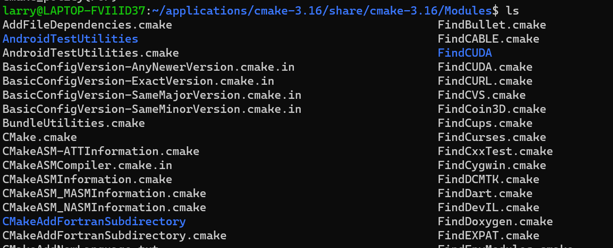
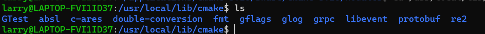

> cmake是大型项目编译的有效工具, cmake的tutorial参见https://github.com/ttroy50/cmake-examples, https://runebook.dev/zh-CN/docs/cmake/-index-

### cmake基础功能

单目录下, cmake常用的使用
```
# 根目录的CMakeLists.txt
# CMake 最低版本号要求
cmake_minimum_required (VERSION 2.8)

# 项目信息
project (Demo3 C CXX)

# 查找当前目录下的所有源文件， 并将名称保存到 DIR_SRCS 变量
aux_source_directory(. DIR_SRCS)

# 添加 math 子目录
add_subdirectory(math)

# 头文件搜索目录
include_directories(./ ./math)

# 库文件搜索目录
LINK_DIRECTORIES(./math)

# 链接库文件
LINK_LIBRARIES(pthread)

# 指定生成目标(可执行文件), 
add_executable(Demo main.cc)

# 添加链接库, math来自子目录, 注意目录名和库名应该对应上
target_link_libraries(Demo math)

# 子文件夹math的CMakeLists.txt
# 查找当前目录下的所有源文件
aux_source_directory(. DIR_LIB_SRCS)
# 生成链接库
add_library (math ${DIR_LIB_SRCS})
```

以上我们在根目录下, 通过`LINK_DIRECTORIES`引入了头文件, 可以把这个删掉, 最后加上一个同样可以引入头文件。
```
target_include_directories(Demo PUBLIC
                          "${PROJECT_BINARY_DIR}"
                          "${PROJECT_SOURCE_DIR}/math"
                          )
```
同样的, 对库文件, 链接库还有`target_link_directories()`, `target_link_libraries()`。

注意`target_link_libraries`里库文件的顺序符合gcc链接顺序的规则，即被依赖的库放在依赖它的库的后面; 如果A依赖B, A应该放B前面。

`target_link_libraries(hello A B.a C.so)`
在上面的命令中，libA.so可能依赖于libB.a和libC.so，如果顺序有错，链接时会报错

类似于g++的`-I`, `-L`, `-l`三点, cmake也有三点

```
#添加头文件目录, 相当于g++ -I
include_directories(/home/larry/myproject/myc++proj/muduostd)
# 添加库文件目录, 相当于g++ -L
link_directories(/home/larry/myproject/myc++proj/muduostd/build1/lib)

# 添加库链接
link_libraries(pthread)
#或在目标文件中链接
target_link_libraries(muduo_http muduo_net muduo_base pthread)
```

<!-- more-->
### 变量常量


`cmake`提供一些变量方便使用，例如指定当前目录等等

```
PROJECT_BINARY_DIR， 指的是编译发生在的目录。

PROJECT_SOURCE_DIR, 表示项目所在的文件夹目录, 工作目录

CMAKE_CURRRENT_BINARY_DIR, CMakeList.txt所在的目录

CMAKE_BUILD_TYPE, 编译类型, 可以设置`Debug`, `Release`
CMAKE_PROJECT_NAME, 返回 PROJECT 指令定义的项目名称
CMAKE_CXX_FLAGS, 设置C++的flags,

set(CMAKE_CXX_COMPILER      "clang++" )         # 显示指定使用的C++编译器
set(CMAKE_CXX_FLAGS   "-std=c++11")             # c++11
set(CMAKE_CXX_FLAGS   "-g")                     # 调试信息
set(CMAKE_CXX_FLAGS   "-Wall")                  # 开启所有警告

set(CMAKE_CXX_FLAGS_DEBUG   "-O0" )             # 调试包不优化
set(CMAKE_CXX_FLAGS_RELEASE "-O2 -DNDEBUG " )   # release包优化
EXECUTABLE_OUTPUT_PATH 执行文件的输出目录
LIBRARY_OUTPUT_PATH 库文件的输出目录

set(EXECUTABLE_OUTPUT_PATH ${PROJECT_BINARY_DIR}/bin)
set(LIBRARY_OUTPUT_PATH ${PROJECT_BINARY_DIR}/lib)
```

支持gdb的调试
```
SET(CMAKE_BUILD_TYPE "Debug")  # 设置BUILD_TYPE为Debug

SET(CMAKE_CXX_FLAGS_DEBUG "$ENV{CXXFLAGS} -O0 -Wall -g2 -ggdb")
SET(CMAKE_CXX_FLAGS_RELEASE "$ENV{CXXFLAGS} -O3 -Wall")
```

#### set 使用

赋值给一般变量(以后方便引用)。

```
set(HEADERS
  HttpContext.h
  HttpRequest.h
  HttpResponse.h
  HttpServer.h
  )

install(FILES ${HEADERS} DESTINATION include/muduo/net)

设置安装路径
SET(CMAKE_INSTALL_PREFIX < install_path >)
```

Cmake可用`add_definitions(-Dhha -Dbbb)`为编译文件增加宏。相当于在命令行中设置`-DUSE_MYMATH=OFF`宏参数

#### if和options

options可以给变量赋值, 从而被if条件语句所引用。set的值只是为了方便使用。

message可以用来输出信息。

条件语句的使用方式, `if() else() endif()`

```

# options赋值可以被if引用(set不行)
option(address "hello world" ON)
message("option is ${address}")

if(address)
    message("defined address!!!!!!!!!!")
else()
    message("NOT defined address!!!!!!!!!")
endif()

# 输出结果
NOT defined address!!!!!!!!!!
option is a
defined address!!!!!!!!!!
```

MESSAGE可以为用户显示一条消息, 其中可以标注信息等级, 类似于日志。

```
STATUS = 非重要消息；
WARNING = CMake 警告, 会继续执行；
AUTHOR_WARNING = CMake 警告 (dev), 会继续执行；
SEND_ERROR = CMake 错误, 继续执行，但是会跳过生成的步骤；
FATAL_ERROR = CMake 错误, 终止所有处理过程；


if(PROTOBUF_FOUND)
message(STATUS "found protobuf")
endif()
```

#### install

设置`make install`的位置,`SET(CMAKE_INSTALL_PREFIX <install_path>)`, 执行make install将按照install的命令进行安装

在CMakeLists.txt需要指定install的文件
```
install(TARGETS helloworld DESTINATION bin)

install(TARGETS hello DESTINATION lib)
install(FILES hello.h DESTINATION include)
```
这里的`bin`, `lib`, `include`都是相对CMAKE_INSTALL_PREFIX的路径。

install还可以直接设置不同文件的安装路径
```
install(TARGETS MyLib
        EXPORT MyLibTargets 
        LIBRARY DESTINATION lib  # 动态库安装路径
        ARCHIVE DESTINATION lib  # 静态库安装路径
        RUNTIME DESTINATION bin  # 可执行文件安装路径
        PUBLIC_HEADER DESTINATION include  # 头文件安装路径
        )
```

### cmake进阶使用
#### find_package 引入外部包

引如外部包
find_package是一个很强大的指令, 可以大大减轻我们引入外部依赖包的复杂。

```
find_package(GLOG)
#add_executable(curltest curltest.cc)
if(GLOG_FOUND)
    #target_include_directories(glib PRIVATE ${GLOG_INCLUDE_DIR})
    #target_link_libraries(glogtest ${GLOG_LIBRARY})
    message(STATUS "GLOG library found")
else(GLOG_FOUND)
    message(FATAL_ERROR "GLOG library not found")
endif(GLOG_FOUND)

输出
-- GLOG library found
-- Configuring done
-- Generating done
```

find_package优先在安装路径下的/share/module下搜索,例如


如果没有, 将在`/usr/local/lib/cmake/`等用户路径上搜索, 例如


对于自己定义的库, 如果要使用`find_package`找到, 一般需要自定义的.cmake文件。.cmake文件只需要指定库的头文件和库文件的所在地, 例如
```
# find_path找到某个文件的路径,这里是头文件
find_path(ADD_INCLUDE_DIR libadd.h /usr/include/ /usr/local/include ${CMAKE_SOURCE_DIR}/ModuleMode)

# 在给定路径中找库文件
find_library(ADD_LIBRARY NAMES add PATHS /usr/lib/add /usr/local/lib/add ${CMAKE_SOURCE_DIR}/ModuleMode)

if (ADD_INCLUDE_DIR AND ADD_LIBRARY)
    set(ADD_FOUND TRUE)
endif (ADD_INCLUDE_DIR AND ADD_LIBRARY)
```

然后将该.cmake文件路径加入到CMakeLists中的CMAKE_MODULE_PATH参数中
```
#加入到CMAKE_MODULE_PATH参数, 后面的find_package可以找到.cmake文件, 进而找到库文件和头文件
set(CMAKE_MODULE_PATH "${CMAKE_SOURCE_DIR}/cmake;${CMAKE_MODULE_PATH}")
add_executable(addtest addtest.cc)
find_package(ADD)

# 引用找到的的库文件和头文件
if(ADD_FOUND)
    target_include_directories(addtest PRIVATE ${ADD_INCLUDE_DIR})
    target_link_libraries(addtest ${ADD_LIBRARY})
else(ADD_FOUND)
    message(FATAL_ERROR "ADD library not found")
endif(ADD_FOUND)
```

另外find_package也可以直接指定寻找.cmake的路径`find_package(<PackageName> [version] [EXACT] [QUIET] [MODULE]`


#### ADD_DEPENDENCIES

假设需要生成一个可执行文件,该文件生成需要链接a.so b.so c.so d.so四个动态库正常来讲,我们一把只需要以下两条指令即可:
```
ADD_EXECUTABLE(main main.cpp)
TARGET_LINK_LIBRARIES(main a.so b.so)

...
add_library(a.so ...)
```

但是如果main和a.so均为target文件, 这样生成main需要依赖a.so,然而a.so生成在main之后的。这时候加一个
```
ADD_DEPENDENCIES(main a.so b.so)
```
提醒编译器先编译下层依赖库，然后再编译上层target，最后link depend target。

#### file处理文件

cmake的file可以创建文件, 追加写文件, 筛选文件(例如筛选所有.cc文件)

最常用的就是筛选文件, 如下表示获得所有文件并输出`file(GLOB <variable> [LIST_DIRECTORIES true|false] [RELATIVE <path>] [<globbing-expressions>...])`
```
file(GLOB files  *)
foreach(file IN LISTS files)
    message(STATUS ${file})
endforeach(file)

# 获得gtest_build_include_dirs目录下的所有文件赋给HEADERS
set(gtest_build_include_dirs
  "${gtest_SOURCE_DIR}/include"
  "${gtest_SOURCE_DIR}")
include_directories(${gtest_build_include_dirs})
file(GLOB HEADERS ${gtest_build_include_dirs} *)
```