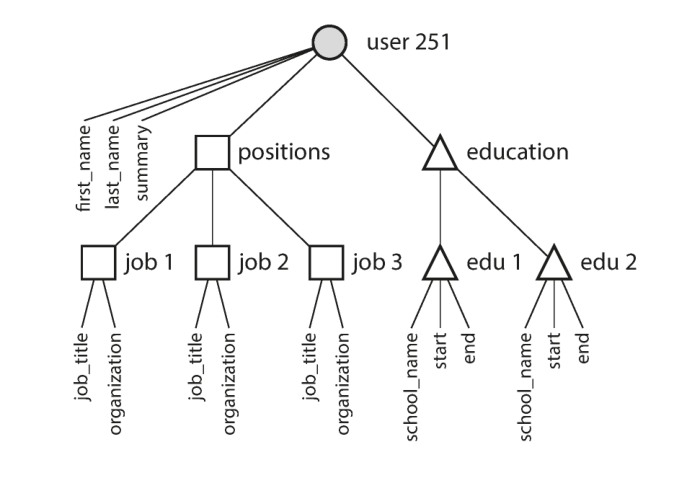
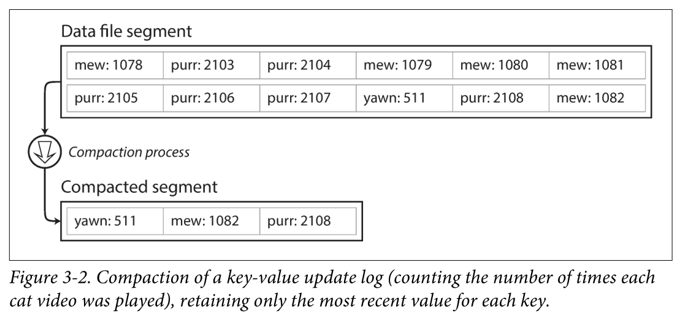
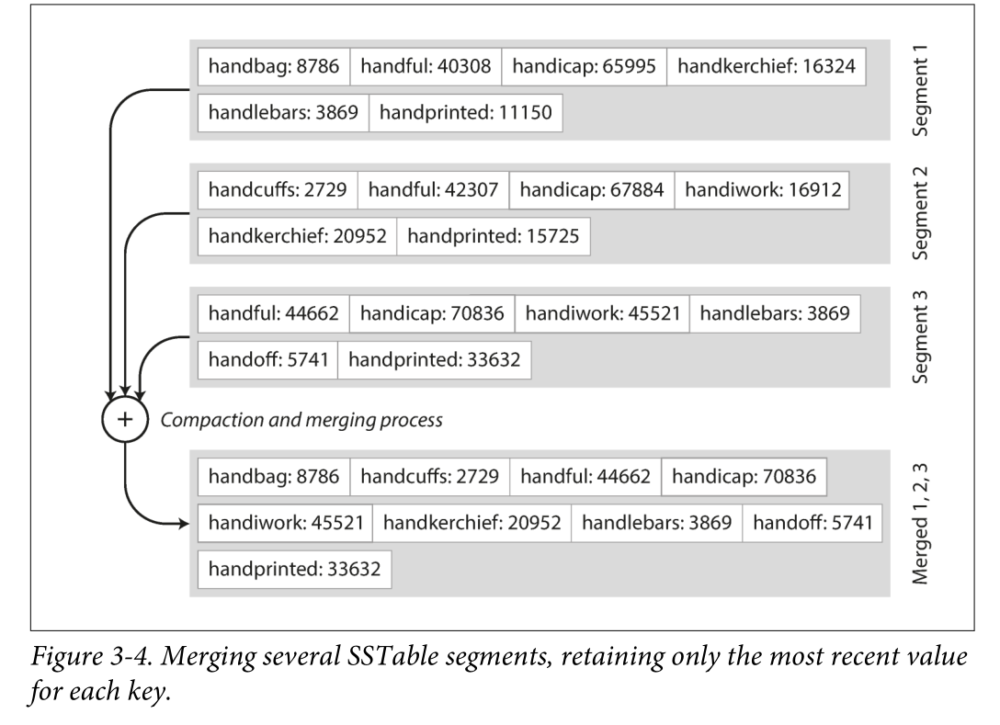
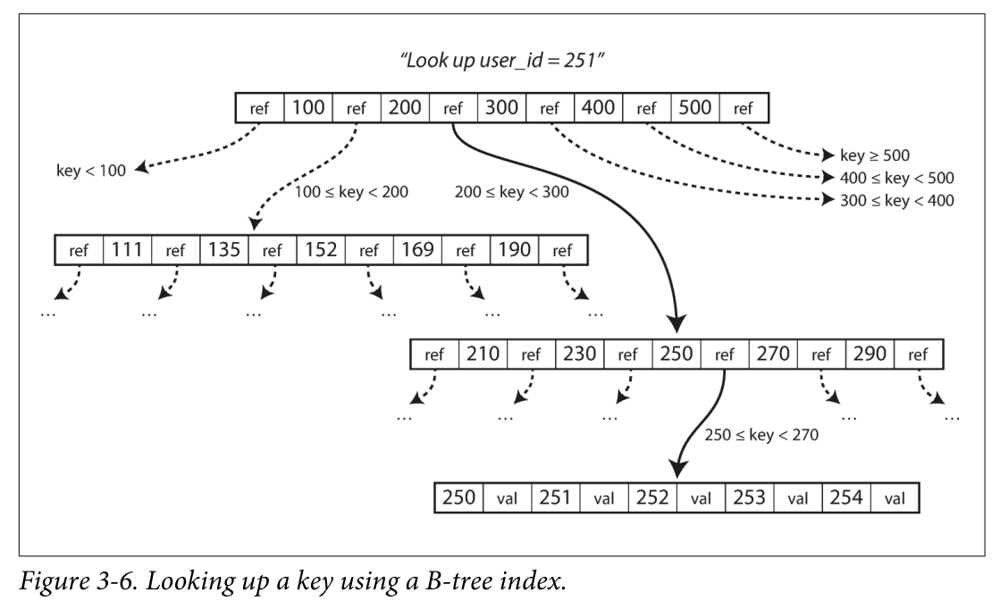
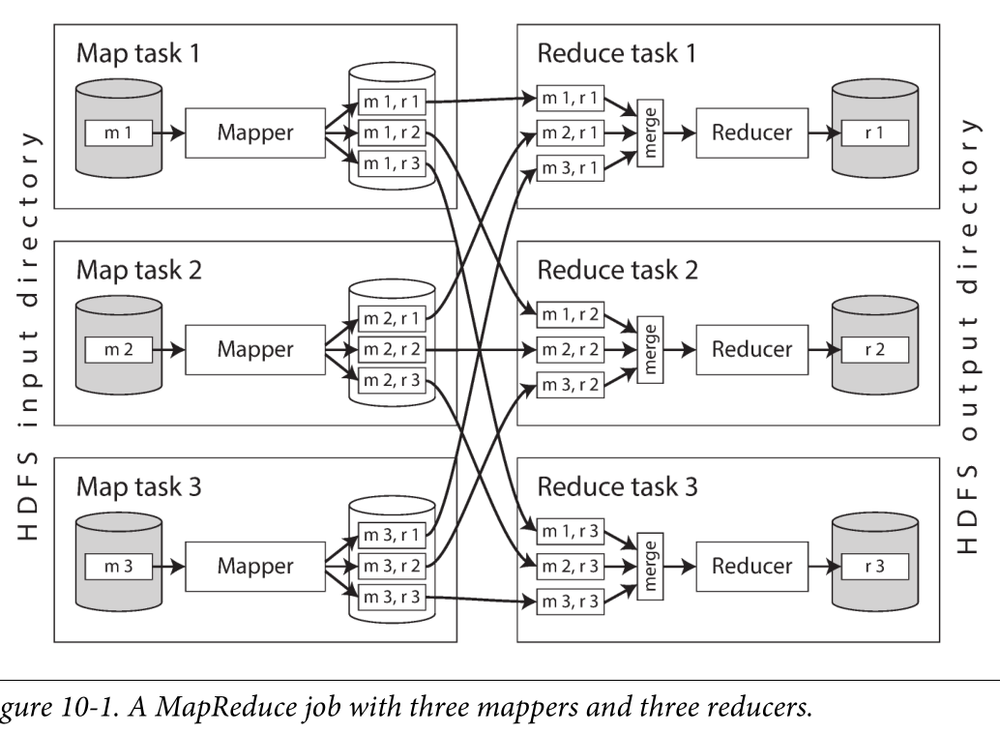

### 数据模型和查询语言

层层的数据模型构建
1. 应用开发人员, 观察现实世界的逻辑(例如任务，货物, 资金, 行为等), 抽象成对象或者数据结构, 操纵数据结构的API进行建模
2. 当试图存储这些数据结构时, 可以使用通用数据模型如JSON, XML, 关系数据库的表或者图模型
3. 数据库选定如何以内存, 磁盘或者网络上的字节表示JSON/XML/关系等数据, 这类表示形式支持数据查询, 搜索等
4. 更低的层次上, 硬件工程师用电流, 光脉冲, 磁场等表示字节

关系模型中, 数据被组织成关系(SQL中的表), 每个关系就是元组(SQL中称为行)。最初的模型称为层次模型hierarchical model, 它很想文档数据库使用的JSON结构。所谓的文档数据库, 就是JSON/XML/CSV表示的结构数据, 这种结构可以轻易表示一对一, 一对多的关系, 但难以表示多对一, 多对多关系。

解决层次模型两个局限的是关系模型relation model(即SQL)和网络模型network model。网络模型可以是层次模型的推广, 层次模型的树结构中每条记录只有一个父节点, 网络模式中每条记录可能有多个父节点, 在多对多关系中数条不同的路径可以到达相同的目录, 但处理这些路径是复杂的。

关系模型没有复杂的访问路径, 而是根据条件获取特定的行, 没有复杂的依赖关系。查询优化器自动决定查询的顺序, 索引, 这些选择类似访问路径(选择最好的一个), 但他们是查询优化器自动生成的, 而不用程序员生成。选择文档模型(层次模型), 网络模型, 关系模型, 应该取决于数据的关系特征。根据数据关联的复杂性, 文档模型、关系模型、网络模型递增。



### 存储与检索

日志是一个仅追加的记录序列, 且为了避免日志存储过大。一个好的方案是将日志分为特定大小的段, 当日志增长到特定大小关闭当前段, 并写入新的段，最后对之前的段进行压缩compaction。由于压缩后的段变小, 可以对压缩后的段进行合并, 这些可以在后台线程完成。


哈希索引是常见的索引, 一个可行的思路是将键映射到数据文件的字节偏移量, 或者是数据文件的偏移量。如果数据文件部分在文件系统缓存中则不需要磁盘I/O, 这种存储引擎非常适合每个键经常更新的情况, 但局限性是哈希索引范围查询效率不高。

<!-- more -->

#### LSM和SST
日志结构的存储段可以是一系列键值对组成, 因为日志是顺序写的, 这些键值对顺序是按照写操作时间顺序。如果让这些键值对按照键排序, 就成了SSTable sorted string table, 同时在压缩过程保证每个键在合并的段只出现一次。

合并段可以类似归并排序merge, 并排读取输入文件, 将值最小的键插入, 注意这种情况下合并前的段内也是有序的。有序情况下查找使用二分查找效率也是很高的



写入时, 可以添加到内存的平衡树结构, 例如红黑树和跳跃表, 这样写入时就是按照键排好序的。当内存表大于某个阈值将其作为SSTable文件写入磁盘。为了防止崩溃, 在写内存前顺序写日志, 日志不是按照键排序的但不重要, 因为日志的目的是回复内存表, 当内存表写到SSTable后响应的日志可以被丢弃。

除了LevelDB， RockDB, Lucene全文搜索引擎也使用类似的办法存储词典。全文索引比键值索引复杂得多, 但基于类似想法: 基于关键词->文档得键值结构, 即键是关键词term, 值是包含单词得所有文档ID列表。

为了能提早确定键不存在不是一直遍历到最后才确定, 存储引擎通常使用Bloom过滤器, 可以告诉数据库是否出现键。LSM得基本思想就是保存一系列在后台合并得SSTables, 即使数据集比内存大很多它仍能继续工作。数据有序可以高效查询和范围查询

#### B树

日志结构索引将数据库分为可变大小的段, 通常是几M且总是按照顺序编写段。相比之下B树将数据库分解为固定大小得页或块, 传统大小是4KB, 一次只能读取一个页面。这种设计更接近底层硬件, 因为虚拟内存的磁盘也被安排在固定大小块中。同时每个页面通过地址标识, 允许一个页面引用另一个页面, 这些页面形成一个页面树

一个页面会被指定为B树的根, 在索引中查找一个键时从这里开始, 该页面包含几个键和对子页面的引用。可以通过子页面引用来进一步找键对应得页。



B树得基本底层写操作是用新数据覆盖磁盘上的页,这与LSM不同, 后者只附加到文件但不会修改文件。为了应对崩溃, B树实现了redo日志, 这是仅追加的文件, 每个B树修改都可以写到日志用来恢复。

如果多个线程访问B树则需要仔细地并发控制, 这通常使用锁。但日志结构化方法则更加简单, 多个线程只需要同时写, 后台进程会进行相应地合并。

某些情况下索引到堆文件地额外跳跃堆读取来说性能损失太大, 可能希望将行直接存储在索引中。也就是聚集索引, InnDB引擎就是表的主键总是一个聚集索引, 二级索引引用主键

### 编码与消息

编码是无处不在的, 最常用的, 基于C语言的强制转换也是一种编码
```cpp
struct Type
{
  int   a;
  char  b;
};

struct Type* type = (Type*)malloc(sizeof(Type));
void* buf = malloc(100);  // 开辟100字节的缓冲区
memcpy(buf, type, sizeof(Type));
struct Type* type2 = (Type*)(buf);  // 其实是一种反序列化
```

当数据格式format或模式schema发生变化时, 通常对应用程序代码进行响应修改, 但在大型应用程序中代码变更不会立即完成。对于服务端, 可能需要滚动升级rolling upgrade, 先将新版本部署到少数节点, 没有问题后逐渐到全部节点。而对于客户端, 升不升级可能看用户心情, 用户可能相当长时间不更新。

新旧版本的代码可能同时共处, 系统需要保证双向兼容性。即向后兼容backward compatibiltiy 新代码可以读旧数据, 向前兼容forward compatiblity 旧代码可以读新数据。这里向后可以理解为向旧, 向前则是向新, 对应时间轴的前后。一般向前兼容比较难实现, 因为旧代码很难预知未来。

#### 序列化和反序列化

从内存中表示到字节序列称为编码encoding, 或者序列化serialization, 反过来称为解码decoding或反序列化deserialization/解析parsing。

除非临时使用, 采用语言内置编码通常是坏注意。JSON, XML, CSV是常见的文本格式。但其对Unicode文本字符串有很好的支持, 但它们不支持二进制数据。人们通常使用Base64将二进制数据编码为文本来绕开这个限制。因为二进制格式数据占用空间更小。

Apache Thrift和Protocol Buffers是基于相同原理的二进制编码库, 它们都需要一个模式来编码数据
```cpp
// Thrift 接口定义语言IDL描述模式
struct Person {
  1: required string  userName,
  2: optional i64   favoriteNumber,
  3: optional list<string>  interests
}

// Protocol buffers
message Person {
  required string usernae = 1;
  optional int64 favorite_number = 2;
  repeated string interests = 3;
}
```
Thrift和Protobuf都带有一个代码生成工具, 它将模式生成了各种编程语言实现的类。该类提供了调用接口, 程序代码可以调用这些接口实现模式记录的编码和解码, 也就是对象的序列化和反序列化。

注意设置的required必须或者optional可选对字段编码没有影响, 区别在于required情况下如果未设置该字段编译会失败。

#### 数据流

如果试图通过网络发送数据或者写入文件, 就要编码成一个字节序列。Web浏览器内运行的Javascript程序可以使用XMLHttpRequest成为客户端, 这也是Ajax技术。这种情况下服务器的响应通常不是用于显示的HTML, 而是编码的数据(例如json)。也就是说在Ajax中前端需要程序处理后端传来的数据, 而不是直接解析html, 因而发展出了前后端分离的技术.可以说现在的web技术基本是基于Ajax的

而如果将大型服务程序按照功能区域划分为较小的服务, 一个服务区可能还会向另一个服务区请求服务, 这种构建应用程序方式称为面向服务的体系结构service-oriented architecure SOA, 或者微服务架构.

有两种流行的Web服务方法, REST和SOAP, 它们可以认为是两种相反的设计哲学。REST强调简单的数据格式, 使用URL来标识资源, 使用HTTP功能进行缓存控制, 身份验证和内容类型协商, REST和Ajax常常是放在一起的。SOAP则是用于制作网络API请求的基于XML的协议, 它目标是独立于HTTP而内置大量标准。

RPC本质是一种应用层协议, 它的请求包括过程方法和参数, 返回则是过程执行的结果.试图向远程网络服务发起请求, 即一个进程通过网络向另外一个进程发送请求并期望尽可能快的响应。 但是可能存在诸多问题, 例如网络问题不可预测, 由于超时可能没有返回结果, 效率相比于本地调用慢得多。但由于分布式系统的广泛使用, 二进制编码格式得自定义RPC协议成为主流。

数据库可以认为一个进程写入编码数据, 另一个进程在将来读取。有一种类似的异步消息传递系统, 它们不是直接网络连接发送消息, 而是通过消息代理(消息队列或者消息中间件)来临时存储消息。和RPC相比, 发送者通常不期望收到消息的回复, 只是发送消息然后忘记它。RabbitMQ, Apache afka是常见的开源消息队列。

### 事务

数据系统的现实中, 很多事情都可能出错
1. 数据库软硬件可能在任意时刻发生故障(包括写操作执行到一半时)
2. 应用程序可能任何时刻崩溃
3. 网络中断可能切断数据和应用之间的连接
4. 多个客户端可能同时写入数据库, 覆盖彼此的更改
5. 客户端可能读取到无意义的数据, 因为数据只更新了一部分
6. 客户之间的竞争条件可能导致错误

事务transaction是简化以上问题的首选机制, 事务的所有读写操作被视作单个操作来执行，整个事务要么提交commit, 要么失败(中止abort或回滚rollback)

事务的ACID语义
1. 原子性Atomicity, 原子性描述了客户如果写入出现故障能够中止事务, 丢弃该事务进行的写入变更。注意原子性不是针对并发的
2. 一致性Consistency, 在ACID中一致性表示数据库处于良好的状态, 即逻辑上没有问题, 例如借贷相抵。注意CAP的一致性表示分布式系统对内达成一致(比如leader),数据是一致的
3. 隔离性Isolation, 表示同时执行的事务是相互隔离的, 类似并发不出现竞争, 可序列化Serializability。应用时强隔离性需要加锁从而造成性能损失, 使用比可序列化更弱的保证, 快照隔离snapshot isloation
4. 持久性Durability, 持久性是一个承诺, 一旦事务完成即使发生硬件故障或者数据库崩溃, 写入的数据也不会丢失。

#### 弱隔离级别

如果两个事务不触及相同的数据, 它们可以安全地并行parallel运行; 当一个事务读取由另一个事务同时修改的数据时, 或者两个事务试图同时修改相同的数据时, 并发问题(竞争条件)才会出现。

数据库提供事务隔离(transaction isolation)来隐藏并发问题, 可序列化serializable的隔离等级意味着数据库保证事务的效果和连续运行, 但可序列化会有性能损失。

最基本的事务隔离级别是读已提交(Read Commited), 它提供了两个保证1. 从数据库读时只能看到已提交的数据(没有脏读dirty reads) 2. 写入数据库时,只会覆盖已经写入的数据(没有脏写dirty writes)

脏读, 是一个事务将数据写入到数据库但事务还没有提交或者终止, 另一个事务看到未提交的数据; 脏写, 是一个事务将数据写入到数据库但后面的事务写入覆盖了尚未提交的值。

考虑这样的场景, Alice共1000元分给两个账户各500元, 她把一个账户100元转到另一个账户。她在事务处理时查看两个账户, 查看第一个账户时转账没完成因而是500元, 查看第二个账户时转账已完成因而是600元, 这时候她发现自己总共1100元而不是1000元。这种情况称为不可重复读nonrepeatable read或读取偏差read skew。在读已提交的隔离条件下, 读已提交被认为是可接受的。且这种情况长期会归于一致，只是可能暂时的不一致。

快照隔离snapshot isolation是这个问题常见的解决方案, 每个事务都从一致性快照中读取consistent snapshot, 事务可以看到事务开始时在数据库中提交的所有数据。即使这些数据随后被另一个事务更改, 每个事务只能看到该时间点前的旧数据。快照隔离可以实现读不阻塞写, 写不阻塞读。数据库必须保留一个对象的多个不同的提交版本, 这种技术也成为多版本并发控制MVCC multi-version concurrency control

注意只提供读已提交的隔离级别相当于保留两个版本, 即提交的版本和被覆盖但尚未提交的版本。如果满足以下两个条件, 则可见一个对象
1. 读事务开始时, 创建该对象的事务已经提交
2. 对象未被标记为删除, 或被标记为删除但请求删除的事务在读事务开始时尚未提交

有一种条件下快照隔离不能满足, 例如Alice和Bob是两名值班医生, 它们同时执行休班操作则两个事务同时提交, 违反了只有一名医生在值班的要求。事实上如果顺序执行是不会发生这种竞态的。这种异常称为写偏差。如果两个事务读取相同的对象，然后同时更新一些对象，就有可能出现写入偏差。


读未提交; 公司发工资了，领导把5000元打到singo的账号上，但是该事务并未提交，而singo正好去查看账户，发现工资已经到账，是5000元整，非常高 兴。可是不幸的是，领导发现发给singo的工资金额不对，是2000元，于是迅速回滚了事务，修改金额后，将事务提交，最后singo实际的工资只有 2000元，singo空欢喜一场。这即我们所说的脏读 ，两个并发的事务，“事务A：领导给singo发工资”、“事务B：singo查询工资账户”，事务B读取了事务A尚未提交的数据。

不可重复读, singo拿着工资卡去消费，系统读取到卡里确实有2000元，而此时她的老婆也正好在网上转账，把singo工资卡的2000元转到另一账户，并在 singo之前提交了事务，当singo扣款时，系统检查到singo的工资卡已经没有钱，扣款失败，singo十分纳闷，明明卡里有钱，为何......这即我们所说的不可重复读 ，两个并发的事务，“事务A：singo消费”、“事务B：singo的老婆网上转账”，事务A事先读取了数据，事务B紧接了更新了数据，并提交了事务，而事务A再次读取该数据时，数据已经发生了改变。

singo的老婆工作在银行部门，她时常通过银行内部系统查看singo的信用卡消费记录。有一天，她正在查询到singo当月信用卡的总消费金额 （select sum(amount) from transaction where month = 本月）为80元，而singo此时正好在外面胡吃海塞后在收银台买单，消费1000元，即新增了一条1000元的消费记录（insert transaction ... ），并提交了事务，随后singo的老婆将singo当月信用卡消费的明细打印到A4纸上，却发现消费总额为1080元，singo的老婆很诧异，以为出 现了幻觉，幻读就这样产生了。

不可重复读和脏读的区别是：脏读是某一事务读取了另一个事务未提交的脏数据，而不可重复读则是读取了前一事务提交的数据。

幻读和不可重复读都是读取了另一条已经提交的事务（这点就脏读不同），所不同的是不可重复读查询的都是同一个数据项，而幻读针对的是一批数据整体（比如数据的个数）。

### 批处理

请求查询以及相应的相应和结果, 现有数据系统中都采用这种数据处理方式, 你发送请求指令, 一段时间后期望系统给出一个结果。数据库, 缓存, 搜索索引, Web服务器等系统都以这种方式工作。流处理要求事件发生不久就对事件进行操作, 而批处理需等待固定的一组输入数据, 这种差异性使流处理系统比起批处理系统具有更低的延迟。

#### MapReduce
Hadoop的Map-Reduce实现中, 其文件系统称为HDFS, 一个GFS的开源实现。HDFS包含在每台机器上运行的守护进程, 对外暴露网络服务。名为NameNode的中央服务区会跟踪文件存储块存放在哪台机器上。因此HDFS在概念上创建了一个大型文件系统, 可以使用大量运行守护进程的机器磁盘。为了容忍机器和磁盘故障, 文件块被复制到多台机器上, 即多台机器存放相同数据的多个副本。

MapReduce是一个编程框架, 可以基于此处理HDFS等分布式文件系统中的大型数据集, 需要实现两个回调函数Mapper和Reducer
* Mapper. Mapper会在每条输入记录上调用一次, 其工作使从输入记录中提取键值对。每个输入记录都是相互独立的。
* Reducer. MapReduce框架拉取由Mapper生成的键值对, 收集属于同一个键的所有值。在这组值列表中调用Reducer, Reducer可以处理产生输出记录

Mapper任务数量由文件块数量决定, Reducer任务数量则由作业作者分配。为了确保相同键的所有键值对落到相同的Reducer处, 框架应该使用散列值确保。

键值对必须排序, 但数据集可能太大无法在单台机器上使用常规算法。首先每个Mapper都按照Reducer位置(或者说键)对输出值分区, 且每个分区内的value有序, 这使用的方法和LSM类似

当Mapper读取完输入文件并写完排序后的输出文件, MapReduce调度器会通知Reducer从该Mapper处获取有序文件, 从Mapper向Reducer复制分区数据

由于单个MapReduce作业可以解决的问题有限, 将多个MapReduce链接成工作流workflow是十分常见的, 也就是一个作业的输出成为下一个作业的输入



#### MapReduce应用

以上Mapper将拥有相同键的所有记录放在一个区, 但在数据倾斜情况下, 例如社交网络可能少数名人有大量追随者, 因而有的区可能过于庞大, 称为倾斜。这种不成比例的键也成为热键hot key。常用的解决办法是将热键相关的记录单独存放

MapReduce作业工作流和用于分析目的的SQL查询不同, 批处理的输出通常不是报表而是一些其他结构。例如Google最初使用MapReduce为其搜索引擎建立索引, 用了5~10个MapReduce作业组成的工作流实现。Mapper根据需要对文档集合进行分区, 每个Reduce构建该分区的索引, 并将索引文件写入分布式文件系统。为了防止文档更改就重跑数据流, 可以增量建立索引, 即将文档划分为段, 后台也会合并压缩段文件。

数据库要求用特定的模型(例如关系和文档)来构造数据, 而分布式文件系统的文件只是字节序列, 可以使用任何数据模型和编码来编写, 它们可以是数据库记录的集合, 也可以是文本, 图像等。Hadoop开放了让数据不加区分转储到HDFS的可能性。这可以用来实现数据仓库, 即事务处理系统的数据以某种形式存储到分布式文件系统中, 然后编写MapReduce作业来清理数据, 将其转换为关系形式, 并将其导入MPP数据仓库进行分析

#### MapReduce之后

MapReduce一个特征是每个作业都独立于其他作业, 也就是松耦合, 但是这种独立性可能带来效率的低下。Spark, Tez, Flink等在设计时考虑把整个工作流作为单个作业来处理而不是分解为独立的子作业, 这些称为数据流引擎

数据流引擎以更灵活的方式组合Map, Reduce而不是简单的交替, 称这些函数为算子。一个算子的输出到一个算子的输入可以
1. 对记录按键重新分区并排序, 类似MapReduce的混洗
2. 接受多个输入并分区, 但不排序, 因为排序可能是昂贵的
3. 对于广播散列连接, 可以将一个算子的输入发送到连接算子的所有分区

这样昂贵的排序操作只需要在实际需要的地方执行, 没有不必要的Mapper任务, 同时算子中间状态可以保存在内存和磁盘而不是分布式文件系统, 这比HDFS需要更少的I/O