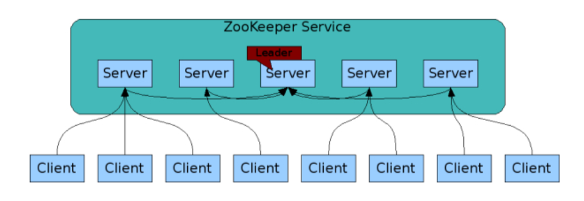
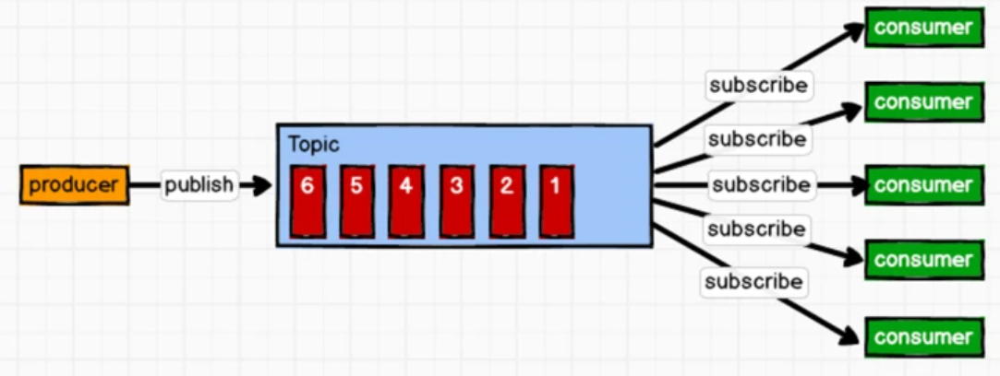
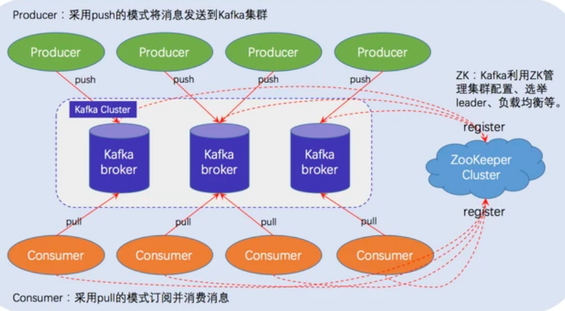
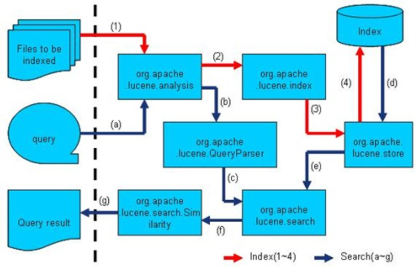

### zookeeper

Zookeeper是一个分布式开源框架，提供了协调分布式应用的基本服务，它向外部应用暴露一组通用服务——分布式同步（Distributed Synchronization）、命名服务（Naming Service）、集群维护（Group Maintenance） 等。

ZooKeeper本身可以以单机模式安装运行，不过其优势在于通过分布式ZooKeeper集群（一个Leader，多个Follower），基于一定的策略来保证ZooKeeper集群的稳定性和可用性



Zookeeper中，能改变ZooKeeper服务器状态的操作称为事务操作。一般包括数据节点创建与删除、数据内容更新和客户端会话创建与失效等操作

zookeeper内部节点的身份

* Leader领导者 ：Leader 节点负责Zookeeper集群内部投票的发起和决议（一次事务操作），更新系统的状态；同时它也能接收并且响应Client端发送的请求
* Follower 跟随者： Follower节点用于接收并且响应Client端的请求，如果是事务操作，会将请求转发给Leader节点，发起投票，参与集群的内部投票
* Observer 观察者：Observer节点功能和Follower相同，只是Observer 节点不参与投票过程，只会同步Leader节点的状态。

<!-- more -->

#### zab共识

Zookeeper 通过复制来实现高可用,以Leader节点为准，Zookeeper的ZNode树上面的每一个修改都会被同步（复制）到其他的Server 节点上面

Zookeeper的核心是原子广播，这个机制保证了各个Server之间的同步。实现这个机制的协议叫做Zab协议。Zab协议有两种模式，它们分别是恢复模式（选主）和广播模式（同步）。当服务启动或者在领导者崩溃后，Zab就进入了恢复模式，当领导者被选举出来，且大多数Server完成了和leader的状态同步以后，恢复模式就结束了。状态同步保证了leader和Server具有相同的系统状态。

为了保证事务的顺序一致性，zookeeper采用了递增的事务id号（zxid）来标识事务。所有的提议（proposal）都在被提出的时候加上了zxid。每次一个leader被选出来，它都会有一个新的epoch，标识当前属于那个leader的统治时期。低32位用于递增计数。

zookeeper只有master节点可以接收写请求, 并将写操作作为事务要求follower执行从而保证一致性。倘若一般以上follower执行成功则提交事务。读请求可以直接访问follower

#### 数据模型

ZooKeeper 数据模型（Data model）采用层次化的多叉树形结构，每个节点上都可以存储数据，这些数据可以是数字、字符串或者是二级制序列。并且，每个节点还可以拥有 N 个子节点，最上层是根节点/。每个数据节点在 ZooKeeper 中被称为 znode，它是 ZooKeeper 中数据的最小单元, 每个节点的存放数据上限为1M。zookeeper的znode按照树形组织从而形成了类似unix文件的路径, 例如/home/a, 这个路径是全局唯一的。

* 服务注册

基于全局唯一路径可以用做服务注册, 例如dubbo服务提供者在启动的时候，向ZK上的指定节点/dubbo/$/providers目录下写入自己的URL地址，这个操作就完成了服务的发布。
服务消费者启动的时候，订阅/dubbo/$/providers目录下的服务区者URL地址就可以访问服务。

* 分布式通知和协调

如果不同系统都对ZK上同一个znode进行注册，监听znode的变化（包括znode本身内容及子节点的），其中一个系统update了znode，那么另一个系统能够收到通知，并作出相应处理。这就基于zookeeper实现了分布式通知和协调

* 乐观锁

Zookeeper的每次更新操作都会更新ZNode的版本，也就是客户端可以自己基于版本的对比，来实现更新数据时的加锁逻辑,就像我们更新数据库时，会新增一个version字段，通过更新前后的版本对比来实现乐观锁

* 分布式锁

分布式锁, 即所有试图来获取这个锁的客户端，最终只有一个可以成功获得这把锁。通常的做法是把 zk 上的一个 znode 看作是一把锁，通过 create znode 的方式来实现。所有客户端都去创建 /distribute_lock 节点，最终成功创建的那个客户端也即拥有了这把锁。如果没有获得锁, 就创建临时节点监听锁节点, 只要上一个节点释放锁，自己就排到前面去了，相当于是一个排队机制。

#### zab和raft

* 选举

zab采用ZAB 采用的"见贤思齐、相互推荐"的快速领导者选举（Fast Leader Election），节点间通过PK竞争（资本是所持有的信息）看哪个节点更适合做Leader，一个节点PK后，会将选票信息广播出去，最终选举出了大多数节点中数据最完整的节点。

Raft 采用的是"一张选票、先到先得"的自定义算法（随机等待时间来保证最多几次选举就能完整选举过程。），即一个节点发现leader挂了，就选举自己为leader，然后通知其他节点，其他节点把选票投给第一个通知它的节点。

Raft 的领导者选举，需要通讯的消息数更少，选举也更快。

* 一致性

ZAB 的设计目标是操作的顺序性，在 ZooKeeper 中默认实现的是最终一致性，读操作可以在任何节点上执行。Raft 的设计目标是强一致性（也就是线性一致性），所以 Raft 更灵活（可以自己配置），Raft 系统既可以提供强一致性，也可以提供最终一致性，但是一般为了保证性能，默认提供的也是最终一致性。

Zab和Raft都是同时存在 log[]（还有快照技术）和状态机（内存树）的存储结构。Raft：对请求先转换成 entry，复制时，也是按照 Leader 中 log 的顺序复制给 Follower 的，对 entry 的提交是按 index 进行顺序提交的，是可以保证顺序的。ZooKeeper：在提交议案的时候也是按顺序写入各个 Follower 对应在 Leader 中的队列，然后 Follower 必然是按照顺序来接收到议案的，对于议案的过半提交也都是一个个来进行

ZooKeeper 和 Raft 在一旦分区发生的情况下是是牺牲了高可用来保证一致性，即 CAP 理论中的 CP，二者都是 CP 系统。

### Kafka

Kafka是一个分布式的、基于发布订阅的消息系统，主要解决应用解耦、异步消息、流量削峰等问题。

发布-订阅模型, 消息生产者将消息发布到Topic中，同时有多个消息消费者订阅该消息，消费者消费数据之后，并不会清除消息。属于一对多的模式，



kafka体系架构包括若干Producer、Broker、Consumer和一个zookeeper集群



一台Kafka服务器就是一个Broker,一个集群由多个Broker组成，每个Broker可以容纳多个Topic. Topic逻辑上可以理解为队列。Producer只关注push消息到哪个Topic,Consumer只关注订阅了哪个Topic。

负载均衡与扩展性考虑，一个Topic可以分为多个Partition,物理存储在Kafka集群中的多个Broker上。可靠性上考虑，每个Partition都会有备份Replica。

Replica角色可以分为Leader和Follower,用来保证高可用性。kafka有一台服务器为Controller，用来进行Leader election以及各种Failover（故障转移）。

Kafka通过Zookeeper存储集群的meta等信息

#### 网络模型

Kafka的网络模型基于Reactor模型，即响应模型。1个接收线程Accept，负责监听新的连接请求，同时注册OP_ACCEPT 事件，将新的连接按照"round robin"方式交给对应的 Processor 线程处理；

N个处理器线程Processor，Processor线程接收到新的连接后，将其注册到自身的Selector中，并监听READ事件.Processor将请求放到缓冲区RequestChannel中

当Client在当前连接对象上写入数据时，会触发READ事件，根据TCP协议调用Handler进行处理。M个请求处理线程KafkaRequestHandler，从RequestChannel拿连接并处理

Kafka的网络通信中，RequestChannel为Processor线程与Handler线程之间数据交换提供了一个缓冲区，是通信中Request和Response缓存的地方。Processor线程将读取到的请求添加至RequestChannel的全局队列(requestQueue)中，Handler线程从请求队列中获取并处理，处理完成后将Response添加至RequestChannel的响应队列(responseQueues)中，通过responseListeners唤醒对应的Processor线程，最后Processor线程从响应队列中取出后发送到Client。

### ElasticSearch

Elasticsearch 是一个兼有搜索引擎和NoSQL数据库功能的开源系统，基于Java/Lucene构建。搜索引擎可以认为是数据库的副产品
```
集群（Cluster）一组拥有共同的 cluster name 的节点。

节点（Node) 集群中的一个 Elasticearch 实例。

索引（Index) 相当于关系数据库中的database概念，一个集群中可以包含多个索引。这个是个逻辑概念。

主分片（Primary shard） 索引的子集，索引可以切分成多个分片，分布到不同的集群节点上。分片对应的是 Lucene 中的索引。
副本分片（Replica shard）每个主分片可以有一个或者多个副本。

类型（Type）相当于数据库中的table概念，mapping是针对 Type 的。同一个索引里可以包含多个 Type。

Mapping 相当于数据库中的schema，用来约束字段的类型，不过 Elasticsearch 的 mapping 可以自动根据数据创建。

文档（Document) 相当于数据库中的row。
字段（Field）相当于数据库中的column。

分配（Allocation） 将分片分配给某个节点的过程，包括分配主分片或者副本。如果是副本，还包含从主分片复制数据的过程。分片->分配
```

分布式系统要解决的第一个问题就是节点之间互相发现以及选主的机制。简单的解决方案是通过Zookeeper/Etcd 这样的成熟的服务发现工具, Elasticsearch 并没有依赖这样的工具，带来的好处是部署服务的成本和复杂度降低了，不用预先依赖一个服务发现的集群，缺点当然是将复杂度带入了 Elasticsearch 内部, 类似redis。

#### 服务发现以及选主 ZenDiscovery 

1. 节点启动后先ping（这里的ping是 Elasticsearch 的一个RPC命令）Ping的response会包含该节点的基本信息以及该节点认为的master节点。
2. 选举开始，先从各节点认为的master中选，规则很简单，按照id的字典序排序，取第一个。
3. 如果各节点都没有认为的master，则从所有节点中选择，规则同上。这里有个限制条件就是 discovery.zen.minimum_master_nodes，如果节点数达不到最小值的限制，则循环上述过程，直到节点数足够可以开始选举。

####  弹性伸缩 Elastic 

分片（Shard）以及副本（Replica）  Elasticsearch 没有采用节点级别的主从复制，而是基于分片。

Elasticsearch 的分片默认是基于id 哈希的，id可以用户指定，也可以自动生成。默认是MurmurHash3。相比之下一致性Hash被广泛的应用于负载均衡领域，如nginx和memcached都采用了一致性Hash来作为集群负载均衡的方案。

#### 高可用

高可用针对的是分片高可用, 具体来说是崩溃节点内部存在的分片。Elasticsearch的恢复流程大致如下：

1. 集群中的某个节点丢失网络连接
2. master提升该节点上的所有主分片的在其他节点上的副本为主分片
3. cluster集群状态变为 yellow ,因为副本数不够
等待一个超时设置的时间，如果丢失节点回来就可以立即恢复（默认为1分钟，通过 index.unassigned.node_left.delayed_timeout 设置）。如果该分片已经有写入，则通过translog进行增量同步数据。否则将副本分配给其他节点，开始同步数据。
4. 如果该节点上的分片没有副本，则无法恢复，集群状态会变为red，表示可能要丢失该分片的数据

#### 搜索引擎 Lucene 

Lucene是一个高效的, 用Java编写的搜索库。Lucene是有索引和搜索的两个过程，包含索引创建，索引，搜索三个要点。

IndexWriter通过函数addDocument将文档添加到索引中，实现创建索引的过程。当用户有请求时，IndexSearcher通过函数search搜索Lucene Index, 并计算term weight和score将结果返回给用户

索引过程, Analyzer便是用来对文档进行词法分析和语言处理, 一篇文章可以有多个索引指向。search模块主要负责对索引的搜索, similarity模块主要负责对相关性打分的实现


基于倒排索引和TF-IDF, 可以针对文档得到若干word作为索引且每个word均有对应权重。针对用户输入与文档word求相似度对应, 结合word权重, 返回文档结果。