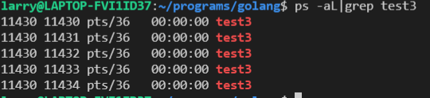
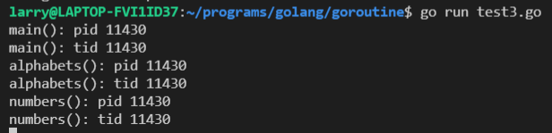
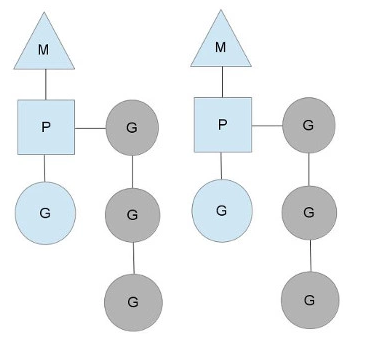

> go语言很多设计哲学是现代语言的标杆

### 基础

#### 编译
注意go build是可以直接编译成二进制文件的。 go 的代码源文件可以分为, 
1. 命令源码文件：简单说就是含有 main 函数的那个文件，通常一个项目一个该文件
2. 测试源码文件：就是我们写的单元测试的代码，都是以 _test.go 结尾
3. 库源码文件：没有上面特征的就是库源码文件，像我们使用的很多第三方包都属于这部分

go build 命令就是用来编译这其中的 命令源码文件 以及它依赖的 库源码文件。起到的作用相当于C++的编译链接。

go build参数
```cpp
-o	output 指定编译输出的名称，代替包名
-i	install 安装作为目标的依赖关系的包(用于增量编译提速)
-a	强行对项目所有的代码包（包含标准库中的代码包）进行重新构建，即使它们已经是最新的了
-buildmode	此标记用于指定编译模式，使用方式如-buildmode=default（这等同于默认情况下的设置）。此标记支持的编译模式目前有6种。-buildmode=archive, -buildmode=c-archive, -buildmode=c-shared, -buildmode=default, -buildmode=shared, -buildmode=exe, -buildmode=plugin
```

<!-- more -->

注意golang的括号形式必须采用google 
```cpp
func MakeMaster(files []string, nReduce int) *Master {
	m := Master {
		NReduce:		nReduce,
		MaxTaskId:		0,
		MappedTaskId:	make(map[int]struct{}),
	}
	for _, f := range files {
		m.MapTask = append(m.ReduceTasks, &ReduceTask{TaskMeta: TaskMeta(State: Pending, Id:i)})
	}
	m.State = Mapping 

	m.server()
	return &m
}
```

#### 命名

**函数，变量，常量，类型，包**名称的开头是一个字母或下划线，后面跟字符数字等。如果**名称以大写字母开头，说明是导出的，对包外可见和可访问**，如`fmt`包中的`Prinf`方法。单词组合的名称，go更喜欢驼峰命名而不是下划线。

golang 定义变量名在左, 类型在右, 这与其他语言有所不同。指针, 数组的方向也换了
```go
type Master struct {
	State			JobState 
	NReduce 		int 
	MapTasks 		[]*MapTask		 // MapReduce任务分发
	ReduceTasks		[]*ReduceTask    // Reduce任务分发

	MappedTaskId	map[int]struct{} // int->struct
	MaxTaskId		int 
	Mutex			sync.Mutex 
	
	WorkerCount		int 
	ExcitedCount	int
}
```

声明，变量`var`, 常量`const`, 类型`type`, 函数`func`。每一个文件以`package`开头表明文件所属的包，之后跟着`import` `var`声明创建一个具体类型的标量，类型和表达式可以省略一个，但不能都省略。

```go
var name type = expression
var i,j,k int
var b,f = true, 23
var f, err = os.Open(name)  // 返回一个文件和一个错误。
```

短变量声明，同时声明和初始化变量
```go
freq := rand.Float64()*3.0
t := 0.0
f, err := os.Open(name)
```
指针，所有的变量(左值)都有地址,使用指针可以无需变量名根据地址读值。**go可以根据指针操纵元素，但不提供指针的算术运算(也就是操纵内存**。

```go
package main

import (
	"fmt"
)
func incr(p *int) int {
	*p++
	return *p
}
func main() {
	v := 1
	incr(&v) // v = 2
	fmt.Println(incr(&v))   // v = 3
}
```
`new`函数，使用`new(T)`创建未命名的T类型变量，初始化为T类型的零值，返回其地址(`*T`)。
```go
p := new(int)	// p是指针
fmt.Println(*p) // 输出0
*p = 2
fmt.Println(*p) // 输出2

func newInt() *int {
    return new(int)
}
// 上述等价于
func newInt() *int {
    var dummy int
    return &dummpy
}
```

go语言中，不是`var`，`new`来决定对象分配是在堆上还是栈上，而是用到逃逸分析。在编译程序优化理论中，逃逸分析是一种确定指针动态范围的方法，简单来说就是分析在程序的哪些地方可以访问到该指针逃逸分析就是确定一个变量要放堆上还是栈上，规则如下：

是否有在其他地方（非局部）被引用。只要有可能被引用了，那么它一定分配到堆上。否则分配到栈上即使没有被外部引用，但对象过大，无法存放在栈区上。依然有可能分配到堆上。

赋值语句, 类似python比较简洁
```go
x = 1
*p = true

x,y = y, x
a[i], a[j] = a[j], a[i]
_, ok = x.(T)

medals := []string{"gold", "silver", "bronze"}
```

类型声明, 声明一个新的命名类型
```go
type Celsius float64

a Celsius 0
```
以下起到了枚举的作用, iota标示符，它简化了常量用于增长数字, 从0开始
```go
// 以下起到枚举的作用
type JobState int

const (
	Mapping JobState = iota
	Reducing
	Done
)
```

### 包和模块

在 1.5 版本之前，所有的依赖包都是存放在 GOPATH 下，没有版本控制。这个类似 Google 使用单一仓库来管理代码的方式。这种方式的最大的弊端就是无法实现包的多版本控制

1.5 版本推出了 vendor 机制。所谓 vendor 机制，就是每个项目的根目录下可以有一个 vendor 目录，里面存放了该项目的依赖的 package。go build 的时候会先去 vendor 目录查找依赖，如果没有找到会再去 GOPATH 目录下查找。

注意包package和模块module可以不是一个概念。可以认为mudule是一种包
#### go module管理


go module是Go1.11版本之后官方推出的版本管理工具，并且从Go1.13版本开始，go module将是Go语言默认的依赖管理工具。

#### 使用go mudule管理多文件
不使用go module的包管理, 使用GOPATH， 三个文件夹。
```
path of $GOPATH:
├─bin
├─pkg
├─src
│  └─helloworld
│      └─helloworld.go
```
使用go module
```
path of everywhere:
├─go.mod
└─helloworld.go
```

Module可以认为是一个代码集合, Module里面可以有包。Module统一向外发布接口, 此外还可以将Module发布到github, 拉取时直接用。

包和调用文件在同一目录下, 注意一下mypackage时一个目录, 也是一个package, 但是这个package不是一个module, 因此不需要些go.mod。但mypackage.go第一行要写`package mypackage`, main.go要引用mypackage.go的内容需要`import "moduledemo/mypackage"`
```
moduledemo
├── go.mod
├── main.go
└── mypackage
    └── mypackage.go  // package mp 定义包名为 mp
```

包和调用文件不在一个目录下
```
├── moduledemo
│   ├── go.mod
│   └── main.go
└── mypackage
    ├── go.mod
    └── mypackage.go  // package mp 定义包名为 mp
```
这时候mypackage和muduledemo都是mudule, main.go引用mypackage.go的内容直接`import "mypackage"`, 不需要下一级路径了。

#### go module使用
在module管理下, 命令`go build`是编译整个包, 类似于nodejs的`npm build`。要求目录下存在main.go和`func main()`作为程序入口。

```
go mod init：初始化go mod， 生成go.mod文件，后接包名，这个文件夹就成为了包的路径了
go mod download：手动触发下载依赖包到本地cache（默认为$GOPATH/pkg/mod目录）
go list -m -json all：以 json 的方式打印依赖详情

go mod edit        编辑go.mod文件
go mod graph       打印模块依赖图
go mod init        初始化当前文件夹, 创建go.mod文件
go mod tidy        增加缺少的module，删除无用的module, 常用
go mod vendor      将依赖复制到vendor下
go mod verify      校验依赖
go mod why         解释为什么需要依赖
```
go mod tidy下载的包位于`$GOPATH/pkg/mod/`目录中。

一般的, 在一个空目录下执行`go mod init [name]`将产生一个`go.mod`文件表名项目的依赖。例如
```
module world

go 1.16

require github.com/sirupsen/logrus v1.8.1
```

对于远程地址的module, 可以使用`go mod tidy`下载, 将下载到$GOPATH目录下。因此为了更加方便管理目录, 可以手动设置$GPATH路径, 使按照到指定位置。终端上输入`GOPATH=$(PWD)`即可。

这种包管理节省了对齐成本, 随时随地可以运行代码, 而依赖包直接下载就行了。C++缺乏包管理的标准, 一般部署通过docker容器。

### 数据类型

#### 整数

int8, int16,int32,int64分别对应无符号uint8,uint16,uint32,uint64

int, uint可能为32位或者64位, 和编译器有关。

uintptr, 足以存放指针的类型

#### 浮点数

float32, float64

#### 常量符号

`const`, 表示不会修改的值, 常量中的数据类型只可以是布尔型、数字型（整数型、浮点型和复数）和字符串型。

#### 数组

数组即静态数据, 大小不可增长。声明, 只需要记住golang的数组为`[]int`而不是`int[]`写法就行了, 其他写法改动不大。如`int[3] {1,2,3}`改为`[3]int {1,2,3}`
```go
var a[3] int
var q[3] int = [3]int{1,2,3}
var balance = [5]float32{1000.0, 2.0, 3.4, 7.0, 50.0}
```

#### 数组切片

切片(slice)可以认为是动态数组, 可对**数组一个连续片段的引用**(该数组我们称之为相关数组，通常是匿名的），所以切片是一个引用类型（因此更类似于 C/C++ 中的数组类型，或者 Python 中的 list 类型)。同时切片是一个 长度可变的数组。

```go
package main
import "fmt"

func main() {
	var slice1 []type = make([]type, len)	// 用make创建动态数组
    var arr1 [6]int	// var只是个占位符, 不足以声明类型, 当然可以:=推导类型
    var slice1 []int = arr1[2:5] // item at index 5 not included! 使用切片, [)

    // load the array with integers: 0,1,2,3,4,5
    for i := 0; i < len(arr1); i++ {
        arr1[i] = i
    }

    // print the slice
    for i := 0; i < len(slice1); i++ {
        fmt.Printf("Slice at %d is %d\n", i, slice1[i])
    }

    fmt.Printf("The length of arr1 is %d\n", len(arr1))
    fmt.Printf("The length of slice1 is %d\n", len(slice1))
    fmt.Printf("The capacity of slice1 is %d\n", cap(slice1))

    // grow the slice
    slice1 = arr1[0:4]
    for i := 0; i < len(slice1); i++ {
        fmt.Printf("Slice at %d is %d\n", i, slice1[i])
    }
    fmt.Printf("The length of slice1 is %d\n", len(slice1))
    fmt.Printf("The capacity of slice1 is %d\n", cap(slice1))

    // grow the slice beyond capacity
    numbers = append(numbers, 2,3,4) // 增长数组
}

Slice at 0 is 2
Slice at 1 is 3
Slice at 2 is 4
The length of arr1 is 6
The length of slice1 is 3
The capacity of slice1 is 4
Slice at 0 is 0
Slice at 1 is 1
Slice at 2 is 2
Slice at 3 is 3
The length of slice1 is 4
The capacity of slice1 is 6
```

append和copy方法
```go
func main() {
   var numbers []int
   printSlice(numbers)

   /* 允许追加空切片 */
   numbers = append(numbers, 0)
   printSlice(numbers)

   /* 向切片添加一个元素 */
   numbers = append(numbers, 1)
   printSlice(numbers)

   /* 同时添加多个元素 */
   numbers = append(numbers, 2,3,4)
   printSlice(numbers)

   /* 创建切片 numbers1 是之前切片的两倍容量*/
   numbers1 := make([]int, len(numbers), (cap(numbers))*2)

   /* 拷贝 numbers 的内容到 numbers1 */
   copy(numbers1,numbers)
   printSlice(numbers1)  
}
```

#### range

range 关键字用于 for 循环中迭代数组(array)、切片(slice)、通道(channel)或集合(map)的元素。
```cpp
package main
import "fmt"
func main() {
    //这是我们使用range去求一个slice的和。使用数组跟这个很类似
    nums := []int{2, 3, 4}
    sum := 0
    for _, num := range nums {
        sum += num
    }
    fmt.Println("sum:", sum)
    //在数组上使用range将传入index和值两个变量。上面那个例子我们不需要使用该元素的序号，所以我们使用空白符"_"省略了。有时侯我们确实需要知道它的索引。
    for i, num := range nums {
        if num == 3 {
            fmt.Println("index:", i)
        }
    }
    //range也可以用在map的键值对上。
    kvs := map[string]string{"a": "apple", "b": "banana"}
    for k, v := range kvs {
        fmt.Printf("%s -> %s\n", k, v)
    }
    //range也可以用来枚举Unicode字符串。第一个参数是字符的索引，第二个是字符（Unicode的值）本身。
    for i, c := range "go" {
        fmt.Println(i, c)
    }
}
```

#### make和new初始化对象

new(T) 为每个新的类型T分配一片内存，初始化为 0 并且返回类型为*T的内存地址：这种方法 返回一个指向类型为 T，值为 0 的地址的指针，它适用于值类型如数组和结构体

make(T) 返回一个类型为 T 的初始值，它只适用于3种内建的引用类型：切片、map 和 channel。

除了切片, map, channel其他用new即可。

#### map
golang的map是无序的, 即hashmap, 可用 make 来构造 map。`make(map[string]int)`

```go
package main
import "fmt"

func main() {
    var value int
    var isPresent bool

    map1 := make(map[string]int)
    map1["New Delhi"] = 55
    map1["Beijing"] = 20
    map1["Washington"] = 25
	// 判断键值对存在
    value, isPresent = map1["Beijing"]
    if isPresent {	// 存在键值对
        fmt.Printf("The value of \"Beijing\" in map1 is: %d\n", value)
    } else {	// 不存在键值对
        fmt.Printf("map1 does not contain Beijing")
    }

    value, isPresent = map1["Paris"]
    fmt.Printf("Is \"Paris\" in map1 ?: %t\n", isPresent)
    fmt.Printf("Value is: %d\n", value)

    // delete an item:
    delete(map1, "Washington")
    value, isPresent = map1["Washington"]
    if isPresent {
        fmt.Printf("The value of \"Washington\" in map1 is: %d\n", value)
    } else {
        fmt.Println("map1 does not contain Washington")
    }

	for key, value := range map1 {
        fmt.Printf("key is: %d - value is: %f\n", key, value)
    }
}

输出
The value of "Beijing" in map1 is: 20
Is "Paris" in map1 ?: false
Value is: 0
map1 does not contain Washington
key is: %!d(string=New Delhi) - value is: %!f(int=55)
key is: %!d(string=Beijing) - value is: %!f(int=20)
```

### 函数和对象

#### 函数

函数声明结构
```go
func name(parameter-list) (result-list) {
	body
}

func hypot(x, y float64) float64 {
	return math.Sqrt(x*x + y*y);
}
fmt.Println(hypot(3,4)) // 5
```

递归
```go
func visit(link []string, n *html.Node) []string {
	if n.Type == html.ElementNode && n.Data == "a" {
		for _, a := range n.Attr {
			if a.Key == "href" {
				links = append(links, a.Val)
			}
		}
	}
	for c := n.FirstChild; c != nil; c = c.NextSibling {
		links = visit(links, c)
	}
	return links
}
```


函数变量, 或者说闭包。可以接收一个参数, 计算出对应的值
```go
func square(n int) int {
	return n * n;
}
f := square
fmt.Println(f(3)) // 9
```

变长函数参数
```go
func sum(vals ...int) int {
	total := 0
	for _, val := range vals {
		total += val
	}
	return total
}
```

#### 对象

类的方法和函数基本上一致, 只是增加了类的修饰。
```go
package geometry

import "math"

type Point struct { X, Y float64}

// 普通函数, p,q都放在后面括号
func Distance(p, q Point) float64 {
	return math.Hypot(q.X - p.X, q.Y - p.Y)
}

// Point对象的参数, 前面是self修饰吧, p在前 q在后
func (p Point) Distance(q point) float64 {
	return math.Hypot(q.X - p.X, q,Y - p.Y)
}

perim := Path {
	{1, 1},
	{5, 1},
	{5, 4},
	{1, 1}
}
fmt.Println(perim.Distance())	// 12
```

ni用来表示空指针
```go
type IntList struct {
	Value int
	Tail *IntList
}
func (list *IntList) Sum() int {
	if (list == nil)
		return 0
	return list.Val + list.Tail.Sum()
}
```

#### 接口

接口是一种方法, 在C++中国可以认为是纯虚函数。因此某个类的接口, 其实类似于实现该类的成员函数那样实现接口。

类似`type int struct`使用结构体, `type int interface`使用接口。

我们实现file class的接口, 就如同实现它的成员函数, 用`func (d *file) WriteData(data interface{})`。使用时可以向调用成员函数方法那样`f.WriteData()`, 也可以将f对象赋值给接口, 直接调用接口对象。

```cpp
package main
import (
    "fmt"
)

// 定义interface DataWriter
type DataWriter interface {
    WriteData(data interface{}) error
}

// file class，会实现DataWriter
type file struct {
}

// file::WriteData接口
func (d *file) WriteData(data interface{}) error {
    fmt.Println("WriteData:", data)
    return nil
}
func main() {
    // file对象
    f := new(file)
	// 接口对象
    var writer DataWriter
    // file赋值给接口writer
    writer = f	
    // 直接使用接口写入
    writer.WriteData("data")
	// file可以调用实现的方法
	f.WriteData("data1")
}
输出
data
data1
```

Golang的对象如同C语言一样, 灵活且简单, 但写大型项目如果不做好对象管理, 可能会一盘散沙。

### goroutine 

协程Coroutine中最有名的应该是goroutine, 因为它从语言层面支持协程而不是基于库函数(go内部天然有routine的调度架构)。协程可以理解成不需要线程上下文切换的并发实现方法, 线程数量越多上下文切换开销越大, 协程对线程的优势也就越大。协程另一个大特点是资源占用率低。

goroutine是内部实现的有栈协程, 由线程池管理。注意到协程也是由线程执行, 只是更改了线程的执行路径, 可以根据需要暂停某处, 跳跃执行。linux系统内部执行单元的基本单位就是进程和线程(进程线程没太大区别)，不可能存在有协程没线程的情况。只是协程+线程的方法相比传统多线程更加优雅。

#### 使用

go关键字是一个很有意思的行为, 它其实像C++20协程的co_await关键字, 说明后面跟的方法需要用协程执行。我们可以分析不同goroutine的pid和tid
```go
package main

import (
	"fmt"
	"time"

	"golang.org/x/sys/unix"
)

func numbers() {
	fmt.Println("numbers(): pid", unix.Getpid())
	fmt.Println("numbers(): tid", unix.Gettid())
	fmt.Println("numbers(): gid", unix.Getgid())
}
func alphabets() {
	fmt.Println("alphabets(): pid", unix.Getpid())
	fmt.Println("alphabets(): tid", unix.Gettid())
	fmt.Println("alphabets(): gid", unix.Getgid())
}
func main() {
	go numbers()
	go alphabets()
	fmt.Println("main(): pid", unix.Getpid())
	fmt.Println("main(): tid", unix.Gettid())
	fmt.Println("main(): gid", unix.Getgid())
	time.Sleep(3000 * time.Second)
	fmt.Println("main terminated")
}
```


通过输出当前系统运行的线程, 我们发现对于main后台都是有5个相关线程, 尽管只用到了线程11430。因此可以判断出go后台对于线程的分配和内存池一样，事先开启一个线程池来分配。


但是通过打印程序所在的线程, 我们可以发现默认情况下只会有一个线程运行。那一个线程怎样实现基于协程的异步呢, 就需要进行合理的调用。此外既然只有一个线程运行程序, 竞争的时间片是一致的, 但如果不用协程势必会创建更多线程而不是一个线程, 这样会造成上下文切换的开销以及多线程竞争。

C++20实现的协程远远没有达到go这种完成了体系和调度, go只需要一个关键字就行了, C++20还要自己写promise,await_suspend。但是想高效率还得依据C++相关库自定义, 显然这种自定义go是不提供的。go提供的语言层面的协程, 最大的优势是将协程方法统一, 而不像C++那样各有各的轮子。

Go的routine一般不使用id, 据说根据以往的经验，认为 thread-local storage 存在被滥用的可能性，且带来许多不必要的复杂度。简单来讲，Andrew Gerrand 的回答是thread-local storage 的成本远远超过了它们的收益。它们只是不适合 Go 语言

#### 调度

go使用的是MPG模型，意思是通过一个全局的调度器来实现goroutine协程的调度，来达到通过分配平均使用CPU资源。go的调度器有3个重要的结构，M(OS线程)、P(协程调度器),G(goroutine协程)

1. M(OS线程)：是操作系统的线程, 真实的线程, 一个程序可以模拟出多个线程。
2. P(逻辑处理器or协程调度器)：这个一个专门调度goroutine协程的逻辑处理器，或者称为协程调度器都可以。
3. G(goroutine协程)：goroutine协程。

P的数量由环境变量中的GOMAXPROCS决定，通常来说它是和处理器数量对应，例如在4Core的服务器上回启动4个线程, M的个数和P一样, 因为P的作用就是调度M执行哪个G。G会有很多个，每个P会将Goroutine从一个就绪的队列中做Pop操作，为了减小锁的竞争，通常情况下每个P会负责一个队列。



go启动一个进程的时候，会默认创建一个线程M，这个线程会有一个P，来处理G goroutine协程。假如当协程G有执行文件阻塞的操作，这个时候逻辑处理器P会将G1分离处理，同时与线程M分离。从而实现切换协程G1到G2的目的, 但协程G1和G2都是被线程M执行的。

P调度G是复杂的, 如同操作系统调度线程一样, 不可能一个协程一直执行, 也不可能从不执行。额, 所以go语言的程序, 包括main, 可以称之为**main协程**, 而不能叫main线程或者main进程, 它们都是由G组成的。Go语言内部相当于操作系统进程调度之下, 再有个协程调度系统！！！

go 协程G的调度还有很多学问, 也有很多坑, 之后会记录。

#### channel

Go 语言中最常见的设计模式之一就是不通过共享内存的方式进行通信，而通过通信的方式共享内存。 channel是goroutine 之间通信的工具, 也就是G的信息交互, 可以使用`make`创建。

交互是阻塞的, 意味着接收routine必须等待发送routine信息发送到接受完信息才继续向下执行。`ch <- `将信息传入管道, `ch->`从管道中获取信息。这个操作是可以跨goroutine的。

```cpp
package main
import (
	"fmt"
	"time"
)
func main() {
	// 构建一个通道chan, int类型
	ch := make(chan int)
	// 开启一个并发匿名函数
	go func() {
		// 从3循环到0
		for i := 3; i >= 0; i-- {
			// 发送3到0之间的数值
			ch <- i
			// 每次发送完时等待
			time.Sleep(time.Second)
		}
	}()
	// 遍历接收通道数据
	for data := range ch {
		// 打印通道数据
		fmt.Println(data)
		// 当遇到数据0时, 退出接收循环
		if data == 0 {
			break
		}
	}
}

循环接收, 输出
3
2
1
0
```

### gotest

前面说了, golang对于命名, 如果函数或者变量开头是大写字母, 表示外界可以引用这个方法或者变量。例如`fmt.Fprintf`, Fprintf位于src/fmt/print.go中, 因此引用变量只与package和method有关, 而与文件名print.go无关。Fprintf定义如下
```cpp
// 位于src/fmt/print.go
func Fprintf(w io.Writer, format string, a ...interface{}) (n int, err error) {
	p := newPrinter()
	p.doPrintf(format, a)
	n, err = w.Write(p.buf)
	p.free()
	return
}
```

同样对于单元测试, go也有自己的规则。首先命名为`被测试文件名_test.go`, 例如测试`lru.go`,则测试文件命名为`lru_test.go`。而测试方法命名为`Test方法名`, 例如测试lru.go的func Get(), 应该在lru.test.go中命名func TestGET()。

1. 测试代码文件名 xxx_test.go，必须遵守。
2. 测试函数签名 TestXXX(t *testing.T)，必须遵守。
3. 测试文件所在包，不强制。可以与对应的功能代码文件位于同一个包，开发者根据自己的需要来确定工程规范

例如, sample.go
```go
package test_sample
import "fmt"

func Hello() string {
    return "Hello, world"
}

func main() {
    fmt.Println(Hello())
}
```

sample_test.go
```cpp
package test_sample
import "testing"

func TestHello(t *testing.T) {
    got := Hello()
    want := "Hello, world"

    if got != want {
        t.Errorf("got %q want %q", got, want)
    }
}
```

之后可以使用go test来进行测试, 例如
```cpp
go test -cover 查看单元覆盖率
go test -v 执行所有单元测试用例
go test -run TestHello 只运行指定的单元测试用例
```