### shell命令

#### 目录
```sh
# 切换目录
cd des
# 当前工作目录
pwd

# 显示
ls
ls -a # 显示隐藏文件
ls -l # 显示长列表

ls -l my* # *可匹配0或多个字符
ls -l my_?s # ?匹配单个字符

# 创建目录
mkdir
# 删除目录
rm -r
rm -rf
```

<!-- more -->
#### 文件
```sh
# 创建文件, touch命令
touch test_one

# 复制文件
cp source destination
cp -R # 递归复制整个目录内容

# 符号链接
# 一个实际存在的文件，指向存放在虚拟目录结构的另一个文件
ln [-s] source_path target_path
ln -s gcc-5 gcc

# 删除文件
rm

# 查看文件类型
file my_file

# 查看文件内容
cat my_file
cat -n 加上行号
# 查看开头的部分文件

head -n log_file # 前n行文本
```

#### 监测

* 监测进程ps

```sh
# 监测进程
ps  
ps -e 所有进程
ps -f 显示完整格式的信息
ps -l 显示长列表
ps -j 显示任务信息
```


如上, UID表示启动进程的用户, PID表示进程ID, PPID父进程的进程号, C CPU利用率, STIME 进程启动时系统时间, TIME 运行进程需要的累计CPU时间, CMD启动的程序名称。

* 实时检测进程 top


结束进程
```sh
kill <PID>
kill发送一个信号结束进程, 但只能用进程的PID

killall支持进程名结束进程
```

* 挂载磁盘mount 

将物理磁盘并入到虚拟文件系统中, 称之为挂载mount 

```sh
# 输出当前挂在的设备列表
mount 

mount -t type device directory
type为文件系统类型
mount -t vfat /dev/sdb1 /media/disk

umount 卸载设备(挂载点)
umount /home/rich/mnt
```

* 监测磁盘空间

```sh
# 查看已挂载磁盘的使用情况
df 
df -h 用户易读形式展示

# 查看特定目录的磁盘使用情况
du -h 用户易读模式
du -c 总文件大小
du -hc
```

* 搜索数据 grep

grep 可以从文件中查找包含匹配模式的行
```sh
grep [options] pattern [file]
grep 可以使用正则表达式

grep -c # 显示多少行具有匹配的模式
```

* 压缩数据

归档是打包, 没有经过压缩。
```sh
# 压缩工具
zip
unzip

#  归档压缩数据

tar -zcvf test.tar
tar -zxvf 
```

#### 环境变量

查看全局变量
```sh
printenv # 全部全局变量

printenv HOME

echo $HOME
```

用户环境变量
word之间不能有空格, 包括=两侧
```sh
echo $my_variable
my_variable=Hello
my_variable="Hello World"
echo $my_variable
```
局部用户定义变量只在本shell中有效, 使用export可以导出到全局环境中, **全局环境变量对其子进程均有效**

PATH环境变量定义了用于命令和程序查找的目录

修改PATH变量
```sh
echo $PATH
PATH=$PATH:/home/larry/script
echo $PATH
```

* 系统环境变量

bash shell默认的主启动文件是/etc/profile文件, 只要登录了Linux系统, bash就会执行/etc/profile启动文件的命令。

$HOME/.bashrc是一个用户专属的启动文件, 只针对$HOME对应的用户有效。

在以上文件中设置环境变量, 使用export注册为全局环境变量。变量之间用冒号间隔
```sh
export JAVA_HOME=$HOME/applications/jdk-11.0.11
export JRE_HOME=${JAVA_HOME}/jre
export CLASSPATH=.:${JAVA_HOME}/lib:${JRE_HOME}/lib
export PATH=${JAVA_HOME}/bin:$PATH
```
#### 文件权限

Linux延续了Unix文件权限的办法, 允许用户和组根据每个文件和目录的安全性设置来访问文件

/etc/passwd文件

包含信息包括, 登录用户名, 用户密码, 用户的UID, 用户的组ID(GID), 用户账户文本描述, 用户$HOME位置, 用户默认shell

/etc/shadow文件 主要实现了密码的控制

/etc/group

包含信息, 组名, 组密码, GID, 属于该组的用户列表


输出结果的第一个字段, 一般就是-或者d


之后三组三字符编码分别对应对象属主, 对象属组, 其他用户。
`r`, `w`, `x`分别表示可读, 可写, 可执行 r=4，w=2，x=1 注意读的数字最大

`ls -l`的输出分别有文件类型(目录d, 文件-等),文件权限, 文件硬链接总数, 属主用户名, 属组组名, 文件大小(字节为单位), 文件上次修改时间, 文件名或目录名。

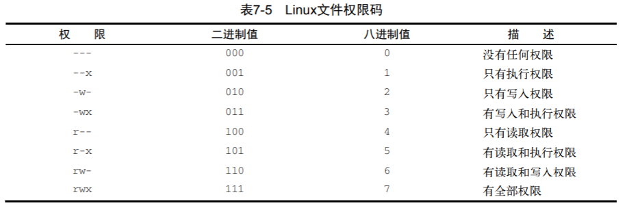

#### chmod改变权限

一般形式: `chmod [who] operator [permission] filename`

who的含义是：
u 文件属主权限。
g 同组用户权限。
o 其他用户权限。
a 所有用户(文件属主、同组用户及其他用户 )。

operator的含义：
+ 增加权限。
- 取消权限。
= 设定权限。

permission的含义：
r 读权限。
w 写权限。
x 执行权限。
s 文件属主和组s e t - I D

```sh
chmod
# 一般直接使用八进制模式设置权限
chmod 760 newFile

-rwxrw----

u 属主
g 属组
o 其他用户
a 以上所有

chmod u+w newfile # 给属主增加读权限
chmod u-x newfile #移除其他用户执行权限
chmod +x newfile # 所有用户赋予执行权限
```

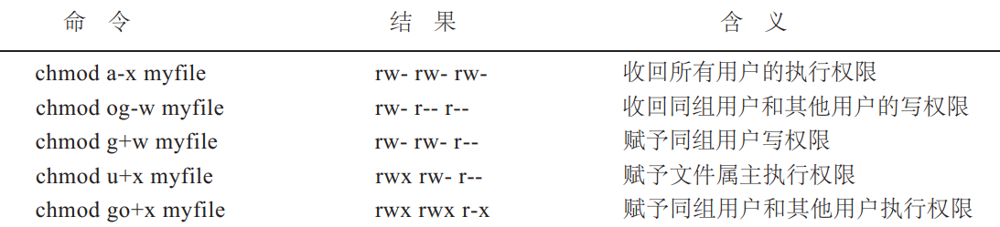

#### find和xargs

* find

find命令有很多选项或表达式，每一个选项前面跟随一个横杠。-name 按照文件名查找文件。
-perm 按照文件权限来查找文件。
-user 按照文件属主来查找文件。
-group 按照文件所属的组来查找文件。
-type 查找某一类型的文件，诸如：
b - 块设备文件。
d - 目录。
c - 字符设备文件。
p - 管道文件。
l - 符号链接文件。
f - 普通文件。

```
find . -name "[a-z][a-z][0--9][0--9].txt" -print
find /etc -name "host*" -print
find . -name "[A-Z]*" -print # 查询一个大写字母开头的文件
```

* xargs

```
整个系统中查找内存信息转储文件 (core dump) ，然后把结果保存到/tmp/core.log 文件中：
find . -name "core" -print | xargs echo "" >/tmp/core.log

在/apps /audit目录下查找所有用户具有读、写和执行权限的文件，并收回相应的写权限
find /apps/audit -perm -7 -print | xargs chmod o-w

用grep命令在所有的普通文件中搜索 device这个词
find / -type f -print | xargs grep "device"
```

xargs 是一个强有力的命令，它能够捕获一个命令的输出，然后传递给另外一个命令。之所以能用到这个命令，关键是由于很多命令不支持|管道来传递参数，而日常工作中有有这个必要

```
find /sbin -perm +700 |ls -l       #这个命令是错误的
find /sbin -perm +700 |xargs ls -l   #这样才是正确的

-i 或者是-I，将xargs的每项名称，一般是一行一行赋值给 {}，可以用 {} 代替。

-n num 后面加次数，表示命令在执行的时候一次用的argument的个数，默认是用所有的。

-d 选项可以自定义一个定界符：
# echo "nameXnameXnameXname" | xargs -dX

name name name name

# echo "nameXnameXnameXname" | xargs -dX -n2

name name
name name


复制所有图片文件到 /data/images 目录下：

ls *.jpg | xargs -n1 -I {} cp {} /data/images
```

#### 后台执行命令

当在前台运行某个作业时，终端被该作业占据；而在后台运行作业时，它不会占据终端。可以使用&命令把作业放到后台执行。

如果你正在运行一个进程，而且你觉得在退出帐户时该进程还不会结束，那么可以使用nohup命令。该命令可以在你退出帐户之后继续运行相应的进程。 Nohup就是不挂起的意思(no hang up)。

```
nohup command &
```

#### 输入输出

* echo

echo命令可以显示文本行或变量，或者把字符串输入到文件

echo -e 才能使转义字符生效

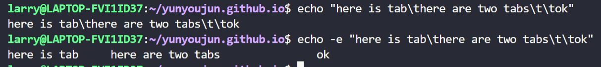

想把一个字符串输出到文件中，使用重定向符号 >, 追加到文件末尾(不会覆盖文件原有数据)可以使用>>

```
echo "$LOGNAME carried them out at `date`"
larry carried them out at Thu May 19 22:20:10 CST 2022

echo "\"/dev/rmt0"\"
"/dev/rmt0"
```

* read

可以使用read语句从键盘或文件的某一行文本中读入信息(直到遇到文件结束)，并将其赋给一个变量。

```cpp
$ read name
Hello I am superman  
# Hello I am superman 被赋给了$name
$ echo $name
Hello I am superman


$ read name surname
kong rui
# 以空格为界, 分别赋给name 和surname
$ echo $name
kong
$ ech o$surname
rui
```

* cat

cat是一个简单而通用的命令，可以用它来显示文件内容，创建文件，还可以用它来显示控制字符。在使用cat命令时要注意，它不会在文件分页符处停下来；它会一下显示完整个文件。如果希望每次显示一页，可以使用more命令或把cat命令的输出通过管道传递到另外一个具有分页功能的命令中

```
cat myfile | more
```

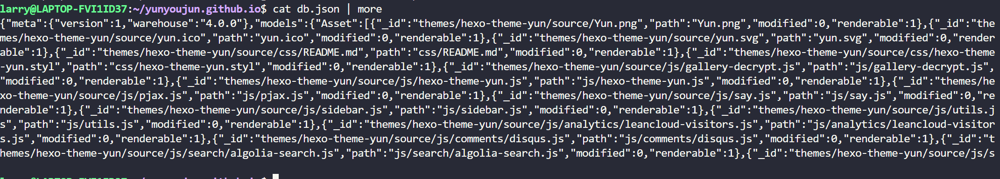

希望创建一个新文件，并向其中输入一些内容，只需使用cat命令把标准输出重定向到该文件中，这时cat命令的输入是你输入一些文字，输入完毕后按<CTRL-D>结束输入。
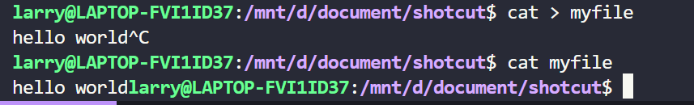

#### 管道

可以通过管道把一个命令的输出传递给另一个命令作为输入。sed、awk和grep都很适合用管道，特别是在简单的一行命令中。
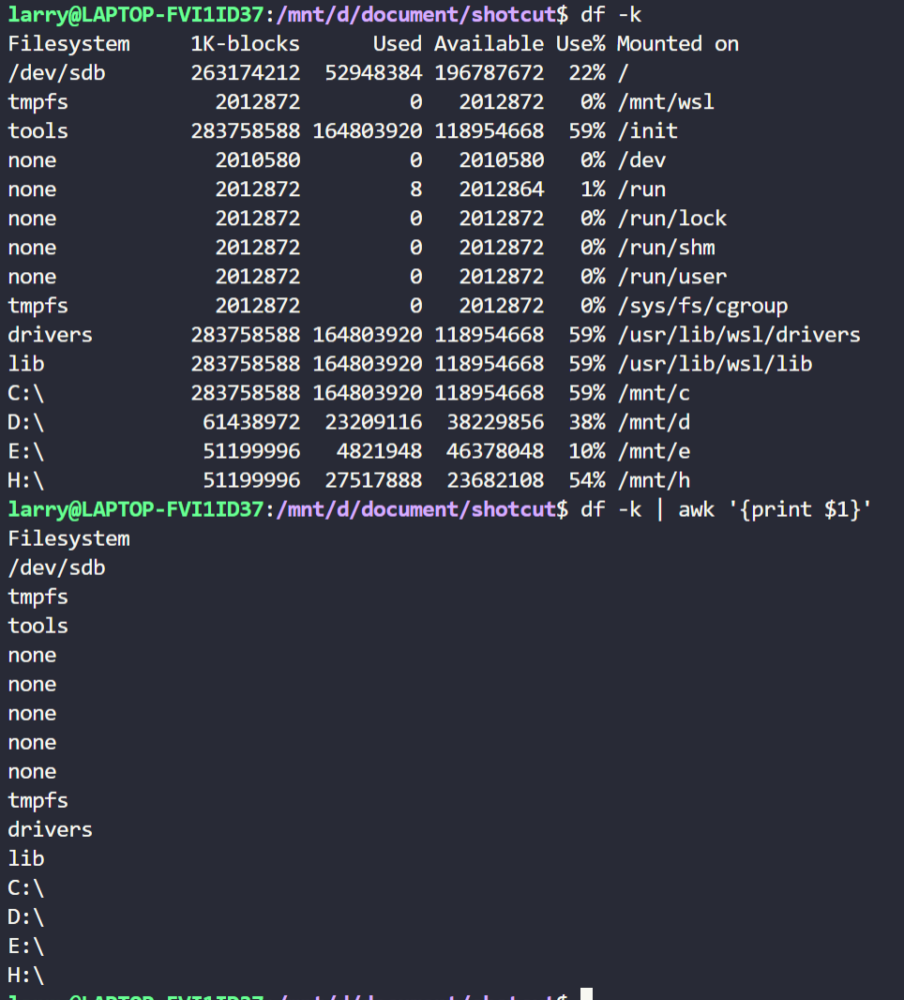

### 文本处理

基本匹配字符
```
^ 只只匹配行首
$ 只只匹配行尾
* 只一个单字符后紧跟*，匹配0个或多个此单字符
[] 只匹配[]内字符。可以是一个单字符，也可以是字符序列。可以使用 -
表示[]内字符序列范围，如用[1-5]代替[1 2 3 4 5]
\ 转义
. 只匹配任意单字符
\{n\} 只用来匹配前面pattern出现次数。n为次数
\{n,\} 只含义同上，但次数最少为 n
\{n,m\} 只含义同上，但pattern出现次数在n与m之间
```

#### grep

grep（全局正则表达式版本）允许对文本文件进行模式查找。如果找到匹配模式， grep打印包含模式的所有行。 grep支持基本正则表达式，也支持其扩展集。

查询目录列表中的目录，方法如下
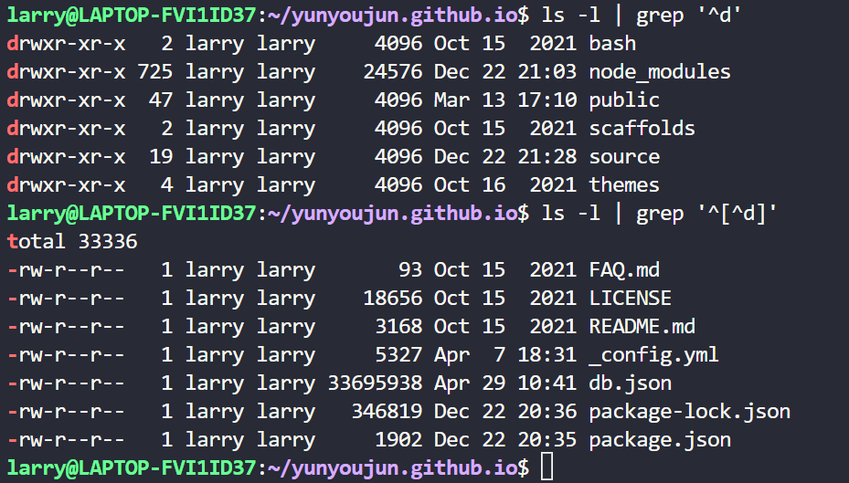
^符号的使用，当直接用在第一个括号里，意指否定或不匹配括号里内容。[^0-9]匹配任一非数字型字符。

```
$ grep "larry" /etc/passwd
larry:x:1000:1000:,,,:/home/larry:/bin/bash
```


#### AWK

awk语言的最基本功能是在文件或字符串中基于指定规则浏览和抽取信息。 awk抽取信息后，才能进行其他文本操作。完整的awk脚本通常用来格式化文本文件中的信息。awk处理的对象似乎是表格数据, $1, $2则代表表格的列

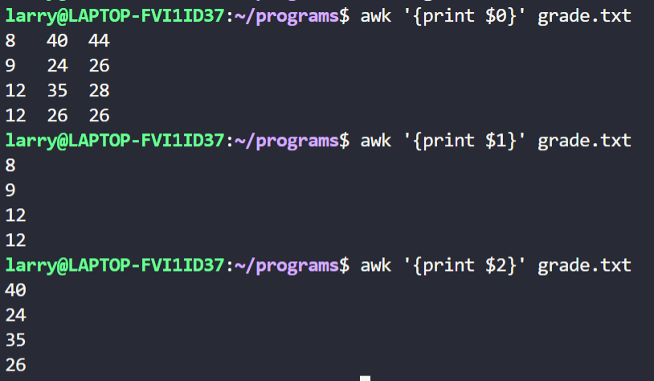

碰到awk错误时，可相应查找
1. 确保整个awk命令用单引号括起来
2. 确保命令内所有引号成对出现
3. 确保用花括号括起动作语句，用圆括号括起条件语句。


```
< 小于， <=,
>, >=
==, !=
~, 匹配正则表达式, !~不匹配正则表达式
```

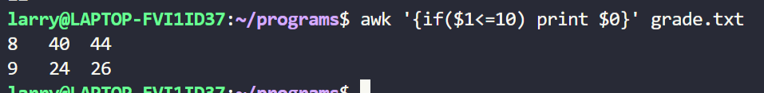

格式化输出printf
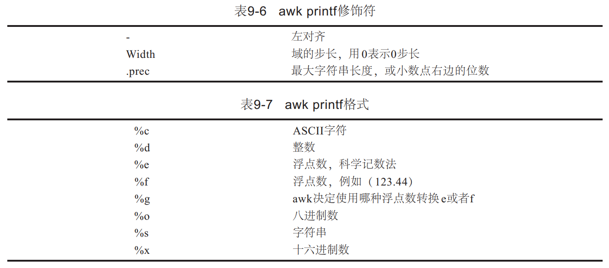
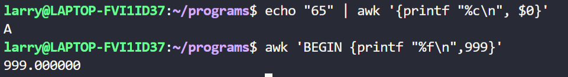

一个典型awk程序, 注意开头的`! /bin/awk -f`
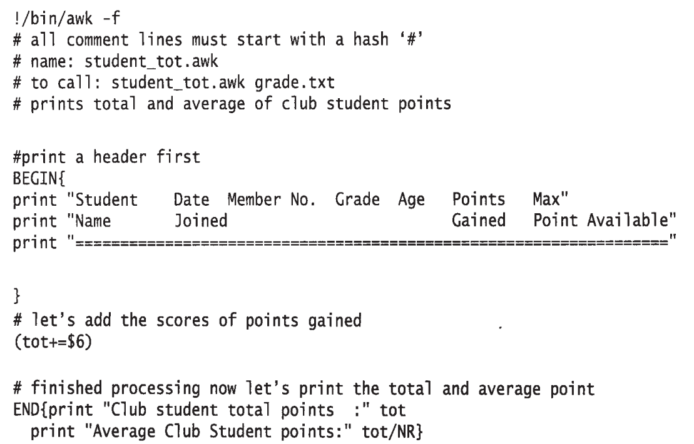


#### sed

sed 的一般使用, `sed 'some-sed-command' input-file > myoutfile`

如果要定位一特殊字符，必须使用(\)屏蔽其特殊含义

打印全部文本,只打印第二行, 打印1~3行
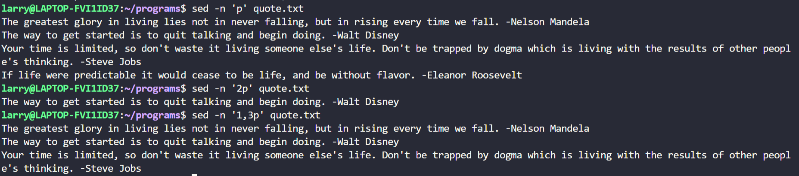

打印包含某个字符/模式的一行
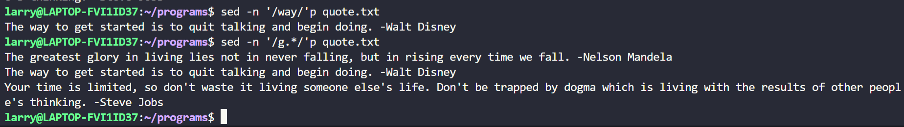

### shell 脚本

shell是真正的胶水语言, 它存在的价值就是整合运行当前存在的可执行程序, 如ls, read等。它没有所谓的库, 也不和操作系统交互之和当前存在的可执行程序交互

#### 基本脚本
一般文件第一行指定使用的shell, `#! /bin/bash`

一般echo变量, 变量赋值需要加$

管道 `cmd1 | cmd2`, 一个命令的输出作为另一个命令的输入。

文件输入重定向 `command < inputfile`

文件输出重定向 `command > outfile`

从命令张提取信息

```sh
#! /bin/bash
testing=$(date)
echo "The date and time are: "$testing\

# 赋值
your_name="qinjx"
echo $your_name
echo ${your_name}
```

#### 变量

```
$#	传递到脚本的参数个数
$*	以一个单字符串显示所有向脚本传递的参数。如"$*"用双引号""括起来的情况、以"$1 $2 … $n"的形式输出所有参数。

$$	脚本运行的当前进程ID号
$!	后台运行的最后一个进程的ID号
$@	与$*相同，但是使用时加引号，并在引号中返回每个参数。如"$@"用双引号""括起来的情况、以"$1" "$2" … "$n" 的形式输出所有参数。
$-	显示Shell使用的当前选项，与set命令功能相同。
$?	显示最后命令的退出状态。0表示没有错误，其他任何值表明有错误。

echo "Shell 传递参数实例！";
echo "第一个参数为：$1";

echo "参数个数为：$#";
echo "传递的参数作为一个字符串显示：$*";

chmod +x test.sh 
./test.sh 1 2 3
Shell 传递参数实例！
第一个参数为：1
参数个数为：3
传递的参数作为一个字符串显示：1 2 3
```

#### 条件语句

使用if-then的条件判断语句
```sh
if command
then command
fi

if pwd
then
    echo "It worked"
fi

testuser=larry
if grep $testuser /etc/passwd
then
    echo "This is " $testuser
    ls -a /home/$testuser/.b*

a=10
b=20
if [ $a == $b ]
then
   echo "a 等于 b"
elif [ $a -gt $b ]
then
   echo "a 大于 b"
elif [ $a -lt $b ]
then
   echo "a 小于 b"
else
   echo "没有符合的条件"
fi
```

数值比较, 使用test进行条件比较
```sh
num1=100
num2=100
if test $[num1] -eq $[num2]
then
    echo '两个数相等！'
else
    echo '两个数不相等！'
fi

-eq	等于则为真
-ne	不等于则为真
-gt	大于则为真
-ge	大于等于则为真
-lt	小于则为真
-le	小于等于则为真
```


```sh
#!/bin/bash

value1=10
value2=11

if [ $value1 -gt 5]
then echo "The test value $value1 is greater than 5"
fi

if [ $value1 -eq $value2]
then echo "The values are equal"
else
    echo "The values are different"
fi
```

算术运算放在中括号[]之内

字符串比较


文件比较


#### 循环语句
for循环

```sh
for var in list
do 
    commands
done

for loop in 1 2 3 4 5
do
    echo "The value is: $loop"
done
输出
The value is: 1
The value is: 2
The value is: 3
The value is: 4
The value is: 5

for file in /home/rich/test/*
do
    if [-d "$file"]
    then 
        echo "$file is a direction"
    elif [-f "$file"]
    then
        echo "$file is a file"
    fi
done
```

while 循环
```sh
while test command
do
    commands
done
```

当然还有break, continue
#### 函数

```cpp
funWithReturn(){
    echo "这个函数会对输入的两个数字进行相加运算..."
    echo "输入第一个数字: "
    read aNum
    echo "输入第二个数字: "
    read anotherNum
    echo "两个数字分别为 $aNum 和 $anotherNum !"
    return $(($aNum+$anotherNum))
}
funWithReturn
echo "输入的两个数字之和为 $? !"
```

shell中设定, $0是程序名, $1第一个参数, $2第二个参数, 依次类推。


#### 使用函数

```sh
function name {
    commands
}

function func1 {
    echo "This is an example of a function"
}
count=1
while [$count -le 5]
do 
    func1
    count=$[ $count + 1]
done
```

使用函数返回值
```sh
function dbl {
    read -p "Enter a value: " value
    echo $[$value*2]
}

result=$(dbl)
echo "The new is $result"
```

echo -e 激活转义字符, 比如`\n`


#### 脚本举例

参考: https://github.com/techarkit/shell-scripting-tutorial

* case 1

```sh
#!/bin/sh
# A simple script with a function...

add_a_user()
{
  USER=$1
  PASSWORD=$2
  shift; shift;
  # Having shifted twice, the rest is now comments ...
  COMMENTS=$@  # $@表示输入的全部参数列表
  echo "Adding user $USER ..."
  echo useradd -c "$COMMENTS" $USER
  echo passwd $USER $PASSWORD
  echo "Added user $USER ($COMMENTS) with pass $PASSWORD"
}

###
# Main body of script starts here
###
echo "Start of script..."
add_a_user bob letmein Bob Holness the presenter
add_a_user fred badpassword Fred Durst the singer
add_a_user bilko worsepassword Sgt. Bilko the role model
echo "End of script..."


# 输出
Start of script...
Adding user bob ...
useradd -c Bob Holness the presenter bob
passwd bob letmein
Added user bob (Bob Holness the presenter) with pass letmein
Adding user fred ...
useradd -c Fred Durst the singer fred
passwd fred badpassword
Added user fred (Fred Durst the singer) with pass badpassword
Adding user bilko ...
useradd -c Sgt. Bilko the role model bilko
passwd bilko worsepassword
Added user bilko (Sgt. Bilko the role model) with pass worsepassword
End of script...
```

* case2 factorial.sh

```sh
#!/bin/sh

factorial()
{
  if [ "$1" -gt "1" ]; then
    i=`expr $1 - 1`
    j=`factorial $i`
    k=`expr $1 \* $j`
    echo $k
  else
    echo 1
  fi
}


while :
do
  echo "Enter a number:"
  read x
  factorial $x
done  
```

#### sed和gawk

sed是一种流编辑器，实际是一种便于处理字符串的工具
```sh
echo "This is a test" | sed 's/test/big test/'

输出
This is a big test

sed -e 执行多条命令
sed -e 's/brown/green/; s/dog/cat/' data.txt 
```
sed命令的s, 就是用big test取代字符中的test, 故有此输出

```sh
s 替换行
sed -n 'p/../..' 只输出被修改命令修改过的行

i 在制定行前添加行
a 在指定行后添加行


echo "Test Line 2" | sed 'a\Test Line 1'
输出
Test Line 2
Test Line 1

gawk会从stdin读取数据，执行命令, 输出到stdout。 

```sh
gawk '{print "hello world"}'
# 用户随便输入, 回车输出hell world, 重复之
```
gawk可以从大型文件中提取元素并修改输出

```sh
gawk 'BEGIN {
    var["a"] = 1
    var["b"] = 2
    var["c"] = 3

    for (test in var) 
    {
        print "Index:", test, " - value", var[test]
    }
}'
```

#### 正则表达式

特殊字符
`. * [ ] $ { } \ + ? | ( )`

`^`, `$`分别表示行首和行尾
```sh
echo "This is a good book" | seed -n 'book$/p'
```

`[0-9]`区间

`+` 匹配1~多次, `*`匹配0~多此

`{m,n}` 出现m~n次

``
