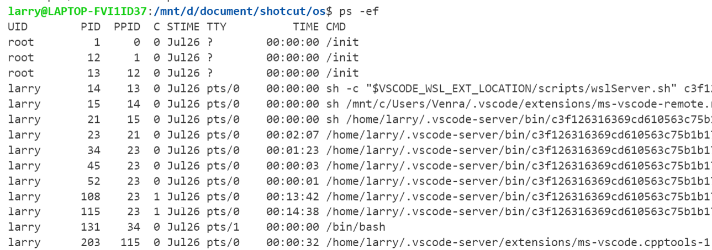
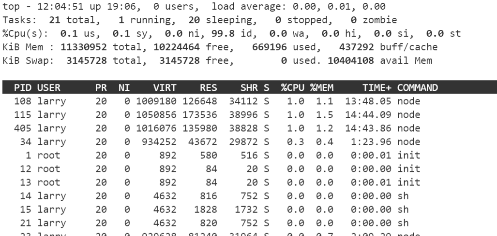
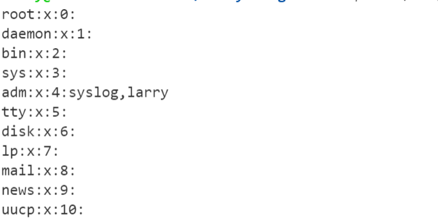
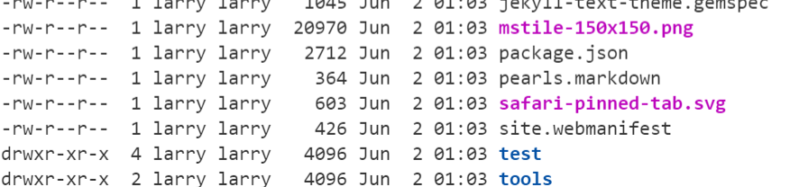
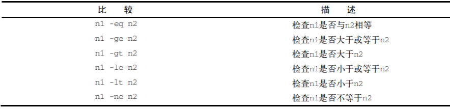
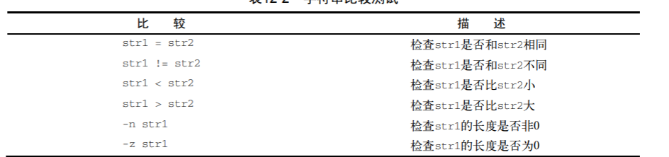
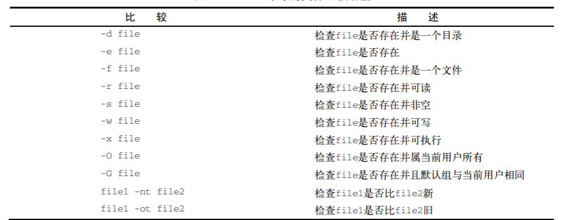

### 常见bash命令

#### 目录
```sh
# 切换目录
cd des
# 当前工作目录
pwd

# 显示
ls
ls -a # 显示隐藏文件
ls -l # 显示长列表

ls -l my* # *可匹配0或多个字符
ls -l my_?s # ?匹配单个字符

# 创建目录
mkdir
# 删除目录
rm -r
rm -rf
```
#### 文件
```sh
# 创建文件, touch命令
touch test_one

# 复制文件
cp source destination
cp -R # 递归复制整个目录内容

# 符号链接
# 一个实际存在的文件，指向存放在虚拟目录结构的另一个文件
ln -s 文件 链接文件
ln -s gcc-5 gcc

# 删除文件
rm

# 查看文件类型
file my_file

# 查看文件内容
cat my_file
cat -n 加上行号
# 查看开头的部分文件

head -n log_file # 前n行文本
```

#### 监测
监测进程ps
```sh
# 监测进程
ps  
ps -e 所有进程
ps -f 显示完整格式的信息
ps -l 显示长列表
ps -j 显示任务信息
```


如上, UID表示启动进程的用户, PID表示进程ID, PPID父进程的进程号, C CPU利用率, STIME 进程启动时系统时间, TIME 运行进程需要的累计CPU时间, CMD启动的程序名称。

实时检测进程 top


结束进程
```sh
kill <PID>
kill发送一个信号结束进程, 但只能用进程的PID

killall支持进程名结束进程
```

挂载磁盘

将磁盘并入到虚拟文件系统中, 称之为挂载
```sh
# 输出当前挂在的设备列表
mount 

mount -t type device directory
type为文件系统类型
mount -t vfat /dev/sdb1 /media/disk

umount 卸载设备(挂载点)
umount /home/rich/mnt
```

监测磁盘空间
```sh
# 查看已挂载磁盘的使用情况
df 
df -h 用户易读形式展示

# 查看特定目录的磁盘使用情况
du -h 用户易读模式
du -c 总文件大小
du -hc
```

搜索数据 grep

grep 可以从文件中查找包含匹配模式的行
```sh
grep [options] pattern [file]
grep 可以使用正则表达式

grep -c # 显示多少行具有匹配的模式
```

<!-- more -->

压缩数据

归档是打包, 没有经过压缩。
```sh
# 压缩工具
zip
unzip

#  归档压缩数据

tar -zcvf test.tar
tar -zxvf 
```

#### 环境变量

查看全局变量
```sh
printenv # 全部全局变量

printenv HOME

echo $HOME
```

用户环境变量
word之间不能有空格, 包括=两侧
```sh
echo $my_variable
my_variable=Hello
my_variable="Hello World"
echo $my_variable
```
局部用户定义变量只在本shell中有效, 使用export可以导出到全局环境中, **全局环境变量对其子进程均有效**

PATH环境变量定义了用于命令和程序查找的目录

修改PATH变量
```sh
echo $PATH
PATH=$PATH:/home/larry/script
echo $PATH
```

* 系统环境变量

bash shell默认的主启动文件是/etc/profile文件, 只要登录了Linux系统, bash就会执行/etc/profile启动文件的命令。

$HOME/.bashrc是一个用户专属的启动文件, 只针对$HOME对应的用户有效。

在以上文件中设置环境变量, 使用export注册为全局环境变量。变量之间用冒号间隔
```sh
export JAVA_HOME=$HOME/applications/jdk-11.0.11
export JRE_HOME=${JAVA_HOME}/jre
export CLASSPATH=.:${JAVA_HOME}/lib:${JRE_HOME}/lib
export PATH=${JAVA_HOME}/bin:$PATH
```

#### 文件权限

Linux延续了Unix文件权限的办法, 允许用户和组根据每个文件和目录的安全性设置来访问文件

/etc/passwd文件

包含信息包括, 登录用户名, 用户密码, 用户的UID, 用户的组ID(GID), 用户账户文本描述, 用户$HOME位置, 用户默认shell

/etc/shadow文件 主要实现了密码的控制

/etc/group

包含信息, 组名, 组密码, GID, 属于该组的用户列表



输出结果的第一个字段


之后三组三字符编码分别对应对象属主, 对象属组, 其他用户。
`r`, `w`, `x`分别表示可读, 可写, 可执行

`ls -l`的输出分别有文件类型(目录d, 文件-等),文件权限, 文件硬链接总数, 属主用户名, 属组组名, 文件大小(字节为单位), 文件上次修改时间, 文件名或目录名。


改变权限
```sh
chmod
# 一般直接使用八进制模式设置权限
chmod 760 newFile

-rwxrw----

u 属主
g 属组
o 其他用户
a 以上所有

chmod u+w newfile # 给属主增加读权限
chmod u-x newfile #移除其他用户执行权限
chmod +x newfile # 所有用户赋予执行权限
```
### shell

#### 基本脚本
一般文件第一行指定使用的shell, `#! /bin/bash`

一般echo变量, 变量赋值需要加$

管道 `cmd1 | cmd2`, 一个命令的输出作为另一个命令的输入。

文件输入重定向 `command < inputfile`

文件输出重定向 `command > outfile`

从命令张提取信息

```sh
#! /bin/bash
testing=$(date)
echo "The date and time are: "$testing\

# 赋值
your_name="qinjx"
echo $your_name
echo ${your_name}
```

#### 变量

```
$#	传递到脚本的参数个数
$*	以一个单字符串显示所有向脚本传递的参数。如"$*"用「"」括起来的情况、以"$1 $2 … $n"的形式输出所有参数。
$$	脚本运行的当前进程ID号
$!	后台运行的最后一个进程的ID号
$@	与$*相同，但是使用时加引号，并在引号中返回每个参数。如"$@"用「"」括起来的情况、以"$1" "$2" … "$n" 的形式输出所有参数。
$-	显示Shell使用的当前选项，与set命令功能相同。
$?	显示最后命令的退出状态。0表示没有错误，其他任何值表明有错误。

echo "Shell 传递参数实例！";
echo "第一个参数为：$1";

echo "参数个数为：$#";
echo "传递的参数作为一个字符串显示：$*";

chmod +x test.sh 
./test.sh 1 2 3
Shell 传递参数实例！
第一个参数为：1
参数个数为：3
传递的参数作为一个字符串显示：1 2 3
```

#### 条件语句

使用if-then的条件判断语句
```sh
if command
then command
fi

if pwd
then
    echo "It worked"
fi

testuser=larry
if grep $testuser /etc/passwd
then
    echo "This is " $testuser
    ls -a /home/$testuser/.b*

a=10
b=20
if [ $a == $b ]
then
   echo "a 等于 b"
elif [ $a -gt $b ]
then
   echo "a 大于 b"
elif [ $a -lt $b ]
then
   echo "a 小于 b"
else
   echo "没有符合的条件"
fi
```

数值比较, 使用test进行条件比较
```sh
num1=100
num2=100
if test $[num1] -eq $[num2]
then
    echo '两个数相等！'
else
    echo '两个数不相等！'
fi

-eq	等于则为真
-ne	不等于则为真
-gt	大于则为真
-ge	大于等于则为真
-lt	小于则为真
-le	小于等于则为真
```


```sh
#!/bin/bash

value1=10
value2=11

if [ $value1 -gt 5]
then echo "The test value $value1 is greater than 5"
fi

if [ $value1 -eq $value2]
then echo "The values are equal"
else
    echo "The values are different"
fi
```

算术运算放在中括号[]之内

字符串比较



文件比较


#### 循环语句
for循环

```sh
for var in list
do 
    commands
done

for loop in 1 2 3 4 5
do
    echo "The value is: $loop"
done
输出
The value is: 1
The value is: 2
The value is: 3
The value is: 4
The value is: 5

for file in /home/rich/test/*
do
    if [-d "$file"]
    then 
        echo "$file is a direction"
    elif [-f "$file"]
    then
        echo "$file is a file"
    fi
done
```

while 循环
```sh
while test command
do
    commands
done

# 当然还有break, continue
```

#### 函数

```cpp
funWithReturn(){
    echo "这个函数会对输入的两个数字进行相加运算..."
    echo "输入第一个数字: "
    read aNum
    echo "输入第二个数字: "
    read anotherNum
    echo "两个数字分别为 $aNum 和 $anotherNum !"
    return $(($aNum+$anotherNum))
}
funWithReturn
echo "输入的两个数字之和为 $? !"
```


#### 处理用户输入

shell中设定, $0是程序名, $1第一个参数, $2第二个参数, 依次类推。

```sh
factorial=1
for ((number=1; number<=$1; number++))
do
    factorial=$[ $factorial * $number]
done
echo The factorial of $1 is $factorial
```

read命令可以从标准输入(键盘)或文件描述符中接受输入
```sh
echo -n "Enter your name :"
read name
echo "Hello $name, "
```

#### 使用函数

```sh
function name {
    commands
}

function func1 {
    echo "This is an example of a function"
}
count=1
while [$count -le 5]
do 
    func1
    count=$[ $count + 1]
done
```

使用函数返回值
```sh
function dbl {
    read -p "Enter a value: " value
    echo $[$value*2]
}

result=$(dbl)
echo "The new is $result"
```

echo -e 激活转义字符, 比如`\n`

#### set

set是linux提供的命令, 可以使用`set --help`查看使用帮助。
```
set: set [-abefhkmnptuvxBCHP] [-o option-name] [--] [arg ...]
    Set or unset values of shell options and positional parameters.
    
    Change the value of shell attributes and positional parameters, or
    display the names and values of shell variables.
    
    Options:
      -a  Mark variables which are modified or created for export.
      -b  Notify of job termination immediately.
      -e  Exit immediately if a command exits with a non-zero status.
      -f  Disable file name generation (globbing).
      -h  Remember the location of commands as they are looked up.
      -k  All assignment arguments are placed in the environment for a
          command, not just those that precede the command name.
      -m  Job control is enabled.
      -n  Read commands but do not execute them.
```


#### sed和gawk

sed是一种流编辑器，实际是一种便于处理字符串的工具
```sh
echo "This is a test" | sed 's/test/big test/'

输出
This is a big test

sed -e 执行多条命令
sed -e 's/brown/green/; s/dog/cat/' data.txt 
```
sed命令的s, 就是用big test取代字符中的test, 故有此输出

```sh
s 替换行
sed -n 'p/../..' 只输出被修改命令修改过的行

i 在制定行前添加行
a 在指定行后添加行


echo "Test Line 2" | sed 'a\Test Line 1'
输出
Test Line 2
Test Line 1

gawk会从stdin读取数据，执行命令, 输出到stdout。 

```sh
gawk '{print "hello world"}'
# 用户随便输入, 回车输出hell world, 重复之
```
gawk可以从大型文件中提取元素并修改输出

```sh
gawk 'BEGIN {
    var["a"] = 1
    var["b"] = 2
    var["c"] = 3

    for (test in var) 
    {
        print "Index:", test, " - value", var[test]
    }
}'
```

#### 正则表达式

特殊字符
`. * [ ] $ { } \ + ? | ( )`

`^`, `$`分别表示行首和行尾
```sh
echo "This is a good book" | seed -n 'book$/p'
```

`[0-9]`区间

`+` 匹配1~多次, `*`匹配0~多此

`{m,n}` 出现m~n次

``

#### ssh自动登录脚本

```sh
#!/usr/bin/expect                   // expect脚本

set timeout 3                       // 设定超时时间为3秒
spawn ssh user_name@172.***.***.*** // fork一个子进程执行ssh命令
expect "*password*"                 // 期待匹配到 'user_name@ip_string's password:' 
send "my_password\r"                // 向命令行输入密码并回车
send "sudo -s\r" 
send "cd /data/logs\r"              // 帮我切换到常用的工作目录
interact                            // 允许用户与命令行交互
```