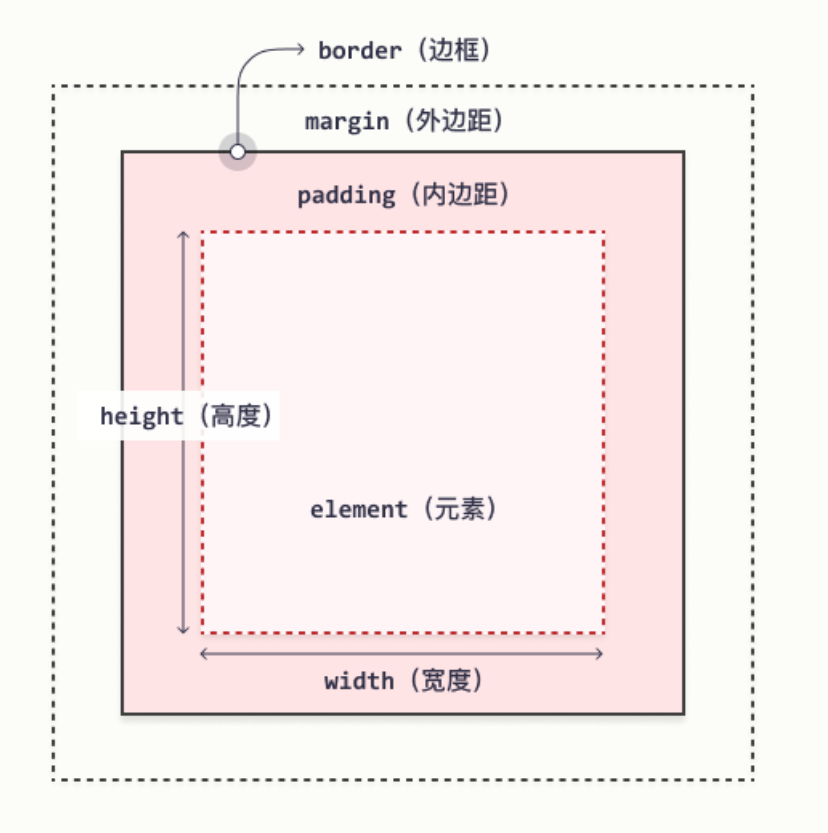

### HTML

#### 标题

HTML 标题（Heading）是通过` <h1> - <h6>` 等标签进行定义的。
```
<h1>This is a heading</h1>
<h2>This is a heading</h2>
<h3>This is a heading</h3>
```

#### 段落

`<p>` 标签进行定义。

#### 链接

`<a>` 标签进行定义

```
<a href="http://www.w3school.com.cn">This is a link</a>
```

<!-- more -->

#### 图像

```

```

#### 文档

`<body>` 元素定义了 HTML 文档的主体。
`<html>` 元素定义了整个 HTML 文档。


#### 注释

`<!-- 在此处写注释 -->`

#### 样式

有三种办法, 
1. 外部样式表
```
<head>
<link rel="stylesheet" type="text/css" href="mystyle.css">
</head>
```
2. 内部样式表

```
<head>

<style type="text/css">
body {background-color: red}
p {margin-left: 20px}
</style>
</head>
```

3. 内联样式

```
<p style="color: red; margin-left: 20px">
This is a paragraph
</p>
```

#### 表格

表格由 `<table>` 标签来定义。每个表格均有若干行（由 `<tr>` 标签定义），每行被分割为若干单元格（由 `<td>` 标签定义）。

```
<table border="1">
<tr>
<td>row 1, cell 1</td>
<td>row 1, cell 2</td>
</tr>
<tr>
<td>row 2, cell 1</td>
<td>row 2, cell 2</td>
</tr>
</table>
```

#### 列表

无序列表是一个项目的列表，此列项目使用粗体圆点（典型的小黑圆圈）进行标记。

无序列表始于 `<ul>` 标签。每个列表项始于 `<li>`。

```
<ul>
<li>Coffee</li>
<li>Milk</li>
</ul>
```

有序列表
```
<ol>
<li>Coffee</li>
<li>Milk</li>
</ol>
```

#### 块元素和内联元素

块级元素在浏览器显示时，通常会以新行来开始
如 `<h1>, <p>, <ul>, <table>`


内联元素在显示时通常不会以新行开始, 如`<b>, <td>, <a>, `


 `<div>` 元素是块级元素，没有特定的含义。由于它属于块级元素，浏览器会在其前后显示折行。

 `<span>` 元素是内联元素，可用作文本的容器, 表示行内元素。


#### 设置类别

例子

```html
<!DOCTYPE html>
<html>
<head>
<style>
.cities {
    background-color:black;
    color:white;
    margin:20px;
    padding:20px;
} 
</style>
</head>

<body>

<div class="cities">
<h2>London</h2>
<p>
London is the capital city of England. 
It is the most populous city in the United Kingdom, 
with a metropolitan area of over 13 million inhabitants.
</p>
</div> 

</body>
</html>
```

#### id
id 属性指定 HTML 元素的唯一 ID。 id 属性的值在 HTML 文档中必须是唯一的。

id 的语法是：写一个井号 (#)，后跟一个 id 名称。然后，在花括号 {} 中定义 CSS 属性。

```html
<!DOCTYPE html>
<html>
<head>
<style>
#myHeader {
  background-color: lightblue;
  color: black;
  padding: 40px;
  text-align: center;
}
</style>
</head>
<body>

<h1 id="myHeader">My Header</h1>

</body>
</html>
```

#### javascript

HTML `<script>` 标签用于定义客户端脚本（JavaScript）。

`<script>` 元素即可包含脚本语句，也可通过 src 属性指向外部脚本文件。

JavaScript 的常见用途是图像处理、表单验证和内容的动态更改。

```
<script>
document.getElementById("demo").innerHTML = "Hello JavaScript!";
</script>
```

#### head

`<head>` 元素是所有头部元素的容器。`<head>` 内的元素可包含脚本，指示浏览器在何处可以找到样式表，提供元信息，等等。

以下标签都可以添加到 head 部分：`<title>、<base>、<link>、<meta>、<script>` 以及 `<style>`。

`<link>` 标签定义文档与外部资源之间的关系。`<link>` 标签最常用于连接样式表：
```
<head>
<link rel="stylesheet" type="text/css" href="mystyle.css" />
</head>
```

元数据（metadata）是关于数据的信息。

`<meta>` 标签提供关于 HTML 文档的元数据。元数据不会显示在页面上，但是对于机器是可读的。

典型的情况是，meta 元素被用于规定页面的描述、关键词、文档的作者、最后修改时间以及其他元数据。


### CSS

#### 选择器

1. 根据标签元素名称来选择 HTML 元素。

```
p {
  text-align: center;
  color: red;
}
```

2. id 选择器使用 HTML 元素的 id 属性来选择特定元素

```
#para1 {
  text-align: center;
  color: red;
}
```

3. 类选择器选择有特定 class 属性的 HTML 元素。

```
.center {
  text-align: center;
  color: red;
}
```

#### 注释

/* 开始，以 */ 结束：

#### 盒模型



* 内容 - 框的内容，其中显示文本和图像。
* 内边距 - 清除内容周围的区域。内边距是透明的。
* 边框 - 围绕内边距和内容的边框。
* 外边距 - 清除边界外的区域。外边距是透明的。

 CSS 中，width 和 height 指的是内容区域的宽度和高度。增加内边距、边框和外边距不会影响内容区域的尺寸，但是会增加元素框的总尺寸。

 ```
 #box {
  width: 70px;
  margin: 10px;
  padding: 5px;
}
```

#### 文本

* color 属性用于设置文本的颜色。
* text-align 属性用于设置文本的水平对齐方式。文本可以左对齐或右对齐，或居中对齐。


#### 边框

* border 属性允许您指定元素边框的样式、宽度和颜色。
* border-width 属性指定四个边框的宽度。
* border-color 属性用于设置四个边框的颜色。
* border-style 属性指定要显示的边框类型。


#### 定位

元素其实是使用 top、bottom、left 和 right 属性定位的。但是，除非首先设置了 position 属性，否则这些属性将不起作用。

* position: relative; 的元素相对于其正常位置进行定位。

设置相对定位的元素的 top、right、bottom 和 left 属性将导致其偏离其正常位置进行调整。

```
div.relative {
  position: relative;
  left: 30px;
  border: 3px solid #73AD21;
}
```

* position: absolute; 的元素相对于最近的定位祖先元素进行定位

* position: fixed; 的元素是相对于视口定位的，这意味着即使滚动页面，它也始终位于同一位置。 top、right、bottom 和 left 属性用于定位此元素。

#### 浮动

Float（浮动），会使元素向左或向右移动，其周围的元素也会重新排列，往往是用于图像

```
img {
  float: right;
}
```

clear 属性指定哪些元素可以浮动于被清除元素的旁边以及哪一侧。

```
div {
  clear: left;
}
```