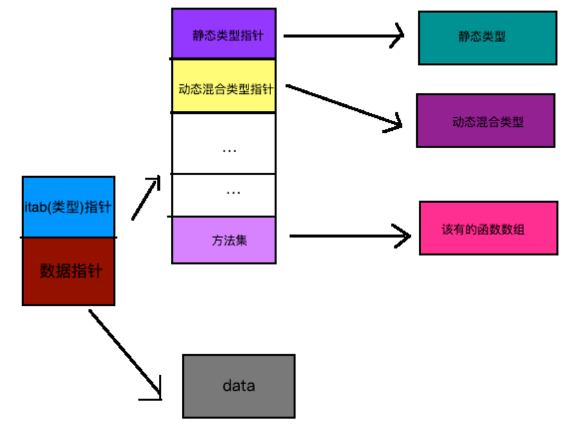
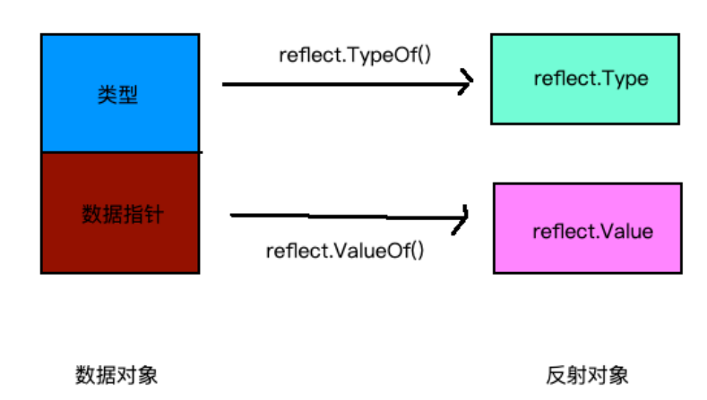
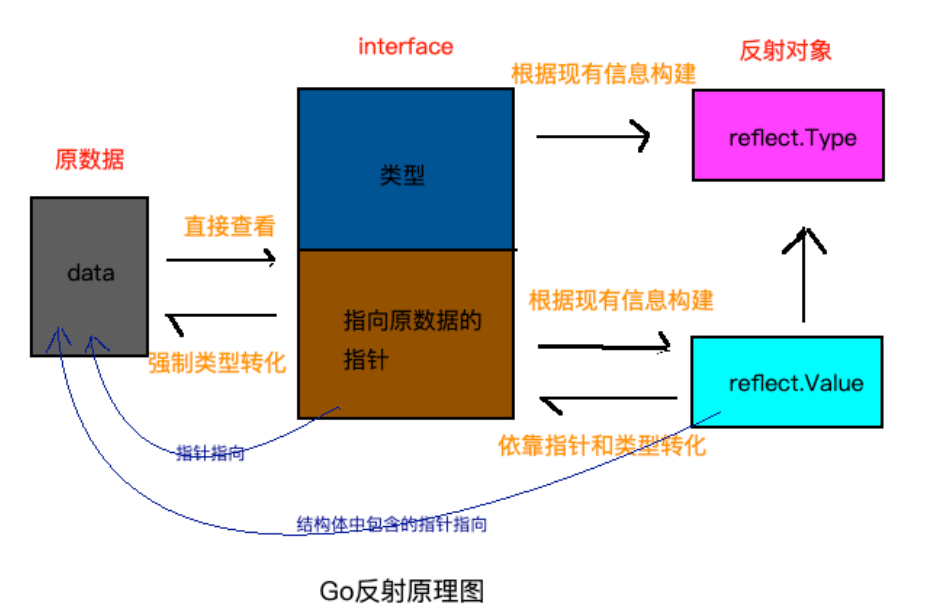

> go语言很多设计哲学是现代语言的标杆

### go 语言特性

#### interface和反射

golang的interface是比较有意思的设计, interface由type和data组成



Go语言中，每个变量都有唯一个静态类型，这个类型是编译阶段就可以确定的。有的变量可能除了静态类型之外，还会有动态混合类型。

反射可以理解为可在运行期间创建对象, 修改对象。例如根据用户网络请求来创建对象。Java对象创建实际就是运行解释字节码, 天然可以运行创建对象。go是编译型语言, 采用的方式是通过一块区域记录下对象的基本信息, 运行期根据对象元数据解析对象在内存中的字节, 从而创建对象。这也是go interface{}对象type指针指向区域的作用

Go中的反射，在使用中最核心的就两个函数：reflect.TypeOf(x), reflect.ValueOf(x), 在运行期可以解析interface{}对象到reflect.Type和reflect.Value, 基于reflect.Type和reflect.Value是可以修改原数据的内容的


<!-- more -->

```go
package main

import (
    "fmt"
    "reflect"
)

func main() {
    var x float64 = 3.4

    t := reflect.TypeOf(x)
    v := reflect.ValueOf(&x)

    o := v.Interface().(float64)
    fmt.Println(o)

    v.SetFloat(5.4) //此行会报错
    fmt.Println(x)
	// 改为

	p := v.Elem()
	fmt.Println(p.CanSet()) // true

	p.SetFloat(7.1)
	fmt.Println(x) // 7.1
}
```

注意使用反射之前需要将原数据类型对象转为interface{}对象




#### golang闭包写法

类似python,常用
```go
func postorder (root *Node) (ans []int) {
    var dfs func(node *Node)
    dfs = func (node *Node) {
        if node != nil {
            for _, child := range node.Children {
                dfs(child)
            }

            ans = append(ans, node.Val)
        }
    }
    dfs(root)
    return
}
```

等价于
```go
var res = make([]int, 0)  // 不能用res := make([]int, 0), 因为:=定义的方法只能放函数内部
func postorder(root *Node) []int {
	helper(root)
	return res
}

func helper(root *Node) {
	if root == nil {
		return
	}
	for _, v := range root.Children {
		helper(v)
	}
	res = append(res, root.Val)
}

// 内部, 传对象的地址
func postorder(root *Node) []int {
    result := make([]int ,0)
	helper(root, &result)
	return result
}

func helper(root *Node, result *[]int) {
	if root == nil {
		return
	}
	for _, v := range root.Children {
		helper(v, result)
	}
	*result = append(*result, root.Val)
}
```

### go常用标准库

#### fmt

Print系列函数会将内容输出到系统的标准输出，区别在于Print函数直接输出内容，Printf函数支持格式化输出字符串，Println函数会在输出内容的结尾添加一个换行符。

```go
func Print(a ...interface{}) (n int, err error)
func Printf(format string, a ...interface{}) (n int, err error)
func Println(a ...interface{}) (n int, err error)

func main() {
    fmt.Print("在终端打印该信息。")
    name := "枯藤"
    fmt.Printf("我是：%s\n", name)
    fmt.Println("在终端打印单独一行显示")
}
```

Fprint系列函数会将内容输出到一个io.Writer接口类型的变量w中，我们通常用这个函数往文件中写入内容。满足io.Writer接口的类型都支持写入

```go
func Fprint(w io.Writer, a ...interface{}) (n int, err error)
func Fprintf(w io.Writer, format string, a ...interface{}) (n int, err error)
func Fprintln(w io.Writer, a ...interface{}) (n int, err error)

// 向标准输出写入内容
fmt.Fprintln(os.Stdout, "向标准输出写入内容")
fileObj, err := os.OpenFile("./xx.txt", os.O_CREATE|os.O_WRONLY|os.O_APPEND, 0644)
if err != nil {
    fmt.Println("打开文件出错，err:", err)
    return
}
name := "枯藤"
// 向打开的文件句柄中写入内容
fmt.Fprintf(fileObj, "往文件中写如信息：%s", name)
```

格式化类型
```
%v	值的默认格式表示
%b	表示为二进制
%d	表示为十进制
%x	表示为十六进制，使用a-f
%f	有小数部分但无指数部分
%9.2f	宽度9，精度2

fmt.Printf("%v\n", 100)
```

Scan从标准输入扫描文本，读取由空白符分隔的值保存到传递给本函数的参数中，换行符视为空白符
Scanf从标准输入扫描文本，根据format参数指定的格式去读取由空白符分隔的值
Scanln类似Scan，它在遇到换行时才停止扫描。

```go
func Scan(a ...interface{}) (n int, err error)
func Scanf(format string, a ...interface{}) (n int, err error)
func Scanln(a ...interface{}) (n int, err error)

func main() {
    var (
        name    string
        age     int
        married bool
    )
    fmt.Scan(&name, &age, &married)
    fmt.Printf("扫描结果 name:%s age:%d married:%t \n", name, age, married)

    fmt.Scanf("1:%s 2:%d 3:%t", &name, &age, &married)
    fmt.Printf("扫描结果 name:%s age:%d married:%t \n", name, age, married)

    fmt.Scanln(&name, &age, &married)
}
```

Fscan从io.Reader中读取数据
```go
func Fscan(r io.Reader, a ...interface{}) (n int, err error)
func Fscanln(r io.Reader, a ...interface{}) (n int, err error)
func Fscanf(r io.Reader, format string, a ...interface{}) (n int, err error)
```

#### time

通过time.Now()函数获取当前的时间对象，然后获取时间对象的年月日时分秒等信息。time.Duration表示一段时间间隔，可表示的最长时间段大约290年。

```go
func timeDemo() {
    now := time.Now() //获取当前时间
    fmt.Printf("current time:%v\n", now)

    year := now.Year()     //年
    month := now.Month()   //月
    day := now.Day()       //日
    hour := now.Hour()     //小时
    minute := now.Minute() //分钟
    second := now.Second() //秒
    fmt.Printf("%d-%02d-%02d %02d:%02d:%02d\n", year, month, day, hour, minute, second)

    timestamp1 := now.Unix()     //时间戳
    timestamp2 := now.UnixNano() //纳秒时间戳
    fmt.Printf("current timestamp1:%v\n", timestamp1)
    fmt.Printf("current timestamp2:%v\n", timestamp2)
}
```

Add可以表示时间+时间间隔的操作, Sub求两个时刻的差值, Equal判断时刻是否相等

```go
func main() {
    now := time.Now()
    later := now.Add(time.Hour) // 当前时间加1小时后的时间
    fmt.Println(later)
}
```

#### Log

log包实现了简单的日志服务, 内部实际是log.Logger对象。默认将日志信息打印到终端界面：

```go
package main

import (
    "log"
)

func main() {
    log.Println("这是一条很普通的日志。")
    v := "很普通的"
    log.Printf("这是一条%s日志。\n", v)
    log.Fatalln("这是一条会触发fatal的日志。")
    log.Panicln("这是一条会触发panic的日志。")
}

func main() {
    logFile, err := os.OpenFile("./xx.log", os.O_CREATE|os.O_WRONLY|os.O_APPEND, 0644)
    if err != nil {
        fmt.Println("open log file failed, err:", err)
        return
    }
    log.SetOutput(logFile)  // 设置日志输出位置
    log.SetFlags(log.Llongfile | log.Lmicroseconds | log.Ldate) // 设置输出日志前输出时间，位置等信息
    log.Println("这是一条很普通的日志。")
    log.SetPrefix("[小王子]")
    log.Println("这是一条很普通的日志。")
}
```

#### I/O 操作

文件操作相关API
```go
func Create(name string) (file *File, err Error)
//根据提供的文件名创建新的文件，返回一个文件对象，默认权限是0666
func NewFile(fd uintptr, name string) *File
//根据文件描述符创建相应的文件，返回一个文件对象
func Open(name string) (file *File, err Error)
//只读方式打开一个名称为name的文件
func OpenFile(name string, flag int, perm uint32) (file *File, err Error)
//打开名称为name的文件，flag是打开的方式，只读、读写等，perm是权限
func (file *File) Write(b []byte) (n int, err Error)
//写入byte类型的信息到文件
func (file *File) WriteAt(b []byte, off int64) (n int, err Error)
//在指定位置开始写入byte类型的信息
func (file *File) WriteString(s string) (ret int, err Error)
//写入string信息到文件
func (file *File) Read(b []byte) (n int, err Error)
//读取数据到b中
func (file *File) ReadAt(b []byte, off int64) (n int, err Error)
//从off开始读取数据到b中
func Remove(name string) Error
//删除文件名为name的文件
```

io.Reader 表示一个读取器，它将数据从某个资源读取到传输缓冲区。

```go
type Reader interface {
    Read(p []byte) (n int, err error)
}
```

io.Writer 表示一个编写器，它从缓冲区读取数据，并将数据写入目标资源。 在golang中可以认为, 一个对象只要实现了 Write() 函数，这个对象就自动成为 Writer 类型。

```go
type Writer interface {
    Write(p []byte) (n int, err error)
}
```

#### net

net 包 为网络 I/O 提供了一个便携式接口，包括 TCP/IP，UDP，域名解析和 Unix 域套接字。 虽然该软件包提供对低级网络原语的访问，但大多数客户端只需要 Dial，Listen 和 Accept 函数以及相关的 Conn 和 Listener 接口提供的基本接口。crypto/tls 包使用相同的接口和类似的 Dial 和 Listen 功能。

```go
// 拨号功能连接到服务器：
conn, err := net.Dial("tcp", "golang.org:80")
if err != nil {
	// 处理错误
}
fmt.Fprintf(conn, "GET / HTTP/1.0\r\n\r\n")
status, err := bufio.NewReader(conn).ReadString('\n')
// ...
// Listen函数创建服务器
ln, err := net.Listen("tcp", ":8080")
if err != nil {
	// 处理错误		
}
for {
	conn, err := ln.Accept()
	if err != nil {
		// 处理错误
	}
	go handleConnection(conn)
}
```


#### net/http


http包提供 HTTP 客户端和服务器实现

```go
client := &http.Client{
	CheckRedirect: redirectPolicyFunc,
}

resp, err := client.Get("http://example.com")
// ...

req, err := http.NewRequest("GET", "http://example.com", nil)
// ...
req.Header.Add("If-None-Match", `W/"wyzzy"`)
resp, err := client.Do(req)
```

#### net/rpc


