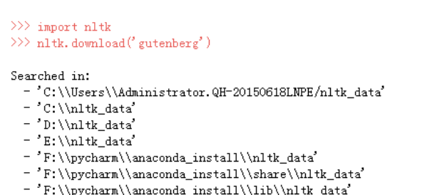

> 数据预处理是自然语言处理重要的一环

### nltk

自然语言处理的数据预处理部分是一门学问, 作用相当于机器学习的特征工程。处理的对象包括例如小写大写, 简写, 单词形态, 无意义单词等。

以NLTK为例简述一般的预处理过程。NLTK（natural language toolkit）是一套基于python的自然语言处理工具集。

NLTK使用中可能报`nltk.download(...)`的错误, 这是因为nltk实际用的是nltk_data, 但是nltk_data需要我们自己下载。我们可以将`https://github.com/nltk/nltk_data`的nltk_data文件下载放到搜索的位置上。同时注意注意解压需要的文件, 保证引用的`from nltk.corpus import stopwords`等能找到就行, 这个命令表示`nltk_data/corpus/stopwords`存在

#### 分词

如果利用爬虫得到的结果是html, 首先需要分析文档得到所需要的文本, 可以用正则表达式, 不再赘述。

正式文本预处理第一步是分词, 接下来的处理是基于词的。对于英文简单的分词办法是split(" ")根据空格, 也有其他的一些分词办法可以选用。

可以的词语切分器
```py
sentence = "The brown fox wasn't that quick and he couldn't win the race"
# default word tokenizer
words = nltk.word_tokenize(sentence)
```

#### 文本规范化

文本规范化主要包括去除停用词(例如, to, for这种介词), 标点等, 转为小写等。

```py
  lower = text.lower()
  remove = str.maketrans('','',string.punctuation) 
  without_punctuation = lower.translate(remove)  # 
  
  tokens = nltk.word_tokenize(without_punctuation)
  without_stopwords = [w for w in tokens if not w in stopwords.words('english')] #去除停用词
```

#### 提取词干和词性还原

例如went还原成go, happier转为happy等, 一般用`nltk.stem.WordNetLemmatizer()`进行词性还原即可。
```py
cleaned_text = [s.stem(ws) for ws in without_stopwords] # 提取词干
cleaned_text = [s.lemmatize(ws) for ws in without_stopwords] # 词干还原

s = nltk.stem.WordNetLemmatizer()  #参数是选择的语言

words = [s.lemmatize(ws) for ws in without_stopwords]
```

<!-- more -->

#### 词向量
对于词往往要赋予词向量, 但词向量往往不能代表所有的词, 例如我们得到的`abc`很可能词向量表中没有这个词。这就是OOV问题out of vocabulary words,简单的表示方法是将词向量没有的词通通用标签`UNK`表示。

```py
for i, word in enumerate(words):
    word_count +=1
    try:
        idx = glove_vocab.stoi[word]  # word对应的索引
    except KeyError:
        words[i] = "<UNK>"
        oov_count += 1
```

处理OOV问题是一个研究方向, 可以使用各种匹配, 训练的方式进行处理。但OOV对结果影响大小还是要具体问题具体分析。

#### 词频
NLTK 中的FreqDist( ) 类主要记录了每个词出现的次数，根据统计数据生成表格或绘图。其结构简单，用一个有序词典进行实现。

```py
import nltk
tokens=[ 'my','dog','has','flea','problems','help','please',
         'maybe','not','take','him','to','dog','park','stupid',
         'my','dalmation','is','so','cute','I','love','him'  ]
#统计词频
freq = nltk.FreqDist(tokens)
 
#输出词和相应的频率
for key,val in freq.items():
    print (str(key) + ':' + str(val))
 
#可以把最常用的5个单词拿出来
standard_freq=freq.most_common(5)
print(standard_freq)
 
#绘图函数为这些词频绘制一个图形
freq.plot(20, cumulative=False)
```

### torchText

