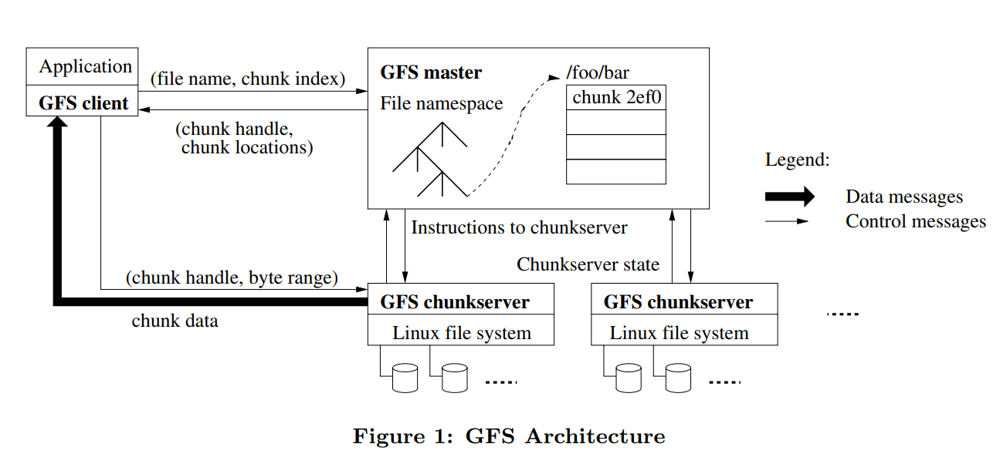

> research paper研读

### GFS

#### INTRODUCTION

We have designed and implemented the Google File System, a scalable distributed file system for large distributed data-intensive applications. It provides fault tolerance while running on inexpensive commodity hardware, and it delivers high aggregate performance to a large number of clients.

The file system has successfully met our storage needs.
It is widely deployed within Google as the storage platform for the generation and processing of data used by our service as well as research and development efforts that require large data sets. The largest cluster to date provides hundreds of terabytes of storage across thousands of disks on over a thousand machines, and it is concurrently accessed by hundreds of clients.

First, component failures are the norm rather than the
exception. The file system consists of hundreds or even
thousands of storage machines built from inexpensive commodity parts and is accessed by a comparable number of client machines. The quantity and quality of the components virtually guarantee that some are not functional at any given time and some will not recover from their current failures. We have seen problems caused by application bugs, operating system bugs, human errors, and the failures of disks, memory, connectors, networking, and power supplies. Therefore, constant monitoring, error detection, fault tolerance, and automatic recovery must be integral to the system. 第一, 故障发生很平常而不是异常, 我们面临应用bug, 操作系统bug, 人为错误, 磁盘内存网络电源等故障, 因此我们需要考虑错误检查, 容错和恢复

Second, files are huge by traditional standards. Multi-GB files are common. Each file typically contains many application objects such as web documents. When we are regularly working with fast growing data sets of many TBs comprising billions of objects, it is unwieldy to manage billions of approximately KB-sized files even when the file system could support it. As a result, design assumptions and parameters such as I/O operation and blocksizes have to be revisited.第二, 文件很大, GB级别的文件很正常, GFS就是为大文件服务的, 因此必须重新审视I/O操作和块大小

Third, most files are mutated by appending new data
rather than overwriting existing data. Random writes within a file are practically non-existent. Once written, the files are only read, and often only sequentially. A variety of data share these characteristics. Some may constitute large
repositories that data analysis programs scan through. Some may be data streams continuously generated by running applications. Some may be archival data. Some may be intermediate results produced on one machine and processed on another, whether simultaneously or later in time. Given this access pattern on huge files, appending becomes the focus of performance optimization and atomicity guarantees, while caching data blocks in the client loses its appeal.第三, 大多数文件是顺序写而不是修改, 顺序写提升了性能和保证了原子性。GFS的文件都是顺序写的

Fourth, co-designing the applications and the file system API benefits the overall system by increasing our flexibility For example, we have relaxed GFS’s consistency model to vastly simplify the file system without imposing an onerous burden on the applications. We have also introduced an atomic append operation so that multiple clients can append concurrently to a file without extra synchronization between them. These will be discussed in more details later in the paper.兼容文件系统API提升灵活性, 不需要增加GFS广泛使用的负担

<!-- more -->

#### Assumptions

* The system is built from many inexpensive commodity
components that often fail. It must constantly monitor
itself and detect, tolerate, and recover promptly from
component failures on a routine basis. GFS基于不昂贵的硬件, 这些设备经常发生故障, 必须经常被监测, 容错, 恢复
* The system stores a modest number of large files. We
expect a few million files, each typically 100 MB or
larger in size. Multi-GB files are the common case
and should be managed efficiently. Small files must be
supported, but we need not optimize for them GFS存储大文件, 每个文件100MB以上, GB级别的文件也很平常, 小文件可以被支持但是不会被优化
* The workloads primarily consist of two kinds of reads: large streaming reads and small random reads. In
large streaming reads, individual operations typically
read hundreds of KBs, more commonly 1 MB or more.
Successive operations from the same client often read
through a contiguous region of a file. A small random read typically reads a few KBs at some arbitrary
offset. Performance-conscious applications often batch
and sort their small reads to advance steadily through
the file rather than go backand forth. 负载一般包含两种读, 大型流式读取和少量随机读，  大型流式读取一般至少读1MB的文件的连续区域, 少量随机读一般几KB, 一般会对少量读进行批处理(批量读)
* The workloads also have many large, sequential writes
that append data to files. Typical operation sizes are
similar to those for reads. Once written, files are seldom modified again. Small writes at arbitrary positions in a file are supported but do not have to be
efficient. 负载包含大量数据的顺序写, 少量数据写效率较低(一般改为批量写)
* The system must efficiently implement well-defined semantics for multiple clients that concurrently append
to the same file. Our files are often used as producerconsumer queues or for many-way merging. Hundreds of producers, running one per machine, will concurrently append to a file. Atomicity with minimal synchronization overhead is essential. The file may be
read later, or a consumer may be reading through the
file simultaneously 多client对同一个文件的并发顺序写, 一般会先写到生产者消费者队列, 并同时将队列的数据并发写入文件, 控制多路原子并发写是重要的
* High sustained bandwidth is more important than low
latency. Most of our target applications place a premium on processing data in bulkat a high rate, while
few have stringent response time requirements for an
individual read or write. 高持续带宽比低延迟更重要, 也就是尽量保证高吞吐量, 而不是尽量降低每个连接的延迟

#### Architecture

A GFS cluster consists of a single master and multiple
chunkservers and is accessed by multiple clients, as shown in Figure 1. Each of these is typically a commodity Linux machine running a user-level server process. It is easy to run both a chunkserver and a client on the same machine, as long as machine resources permit and the lower reliability caused by running possibly flaky application code is acceptable. GFS 包括一个master和多个chunkservers

Files are divided into fixed-size chunks. Each chunk is
identified by an immutable and globally unique 64 bit chunk handle assigned by the master at the time of chunkcreation. Chunkservers store chunks on local disks as Linux files and read or write chunkdata specified by a chunkhandle and byte range. For reliability, each chunkis replicated on multiple chunkservers. By default, we store three replicas, though users can designate different replication levels for different regions of the file namespace 文件被分为若干chunk, 每个chunk有唯一的64位id标识身份。chunkservers以文件的形式保存chunk, 为了可靠性reliability, 每个chunk都会有副本, 默认是三个

The master maintains all file system metadata. This includes the namespace, access control information, the mapping from files to chunks, and the current locations of chunks. It also controls system-wide activities such as chunklease management, garbage collection of orphaned chunks, and chunkmigration between chunkservers. The master periodically communicates with each chunkserver in HeartBeat messages to give it instructions and collect its state master保存文件系统的元数据, 包括命名空间, 访问控制, files到chunks的映射, chunks存储的位置。master定期和chunkserver利用心跳通信, 收集状态信息

GFS client code linked into each application implements
the file system API and communicates with the master and chunkservers to read or write data on behalf of the application. Clients interact with the master for metadata operations, but all data-bearing communication goes directly to the chunkservers. We do not provide the POSIX API and therefore need not hookinto the Linux vnode layer. 连接到GFS的客户端实现了文件系统API, 客户端和master交互获取元信息, 读写数据通过chunkserver。GFS不提供文件系统API因此不需要与Linux 虚拟文件系统的vnode连接。

Neither the client nor the chunkserver caches file data. Client caches offer little benefit because most applications stream through huge files or have working sets too large to be cached. Not having them simplifies the client and the overall system by eliminating cache coherence issues. (Clients do cache metadata, however.) Chunkservers need not cache file data because chunks are stored as local files and so Linux’s buffer cache already keeps frequently accessed data in memory client和chunkserver不会缓存文件数据, 对client来说因为数据太多以至于无法cache, 对chunkserver来说linux's buffer已经存储了关于chunk(即小文件)的缓存

#### Single Master

Having a single master vastly simplifies our design and enables the master to make sophisticated chunk placement and replication decisions using global knowledge. However, we must minimize its involvement in reads and writes so that it does not become a bottleneck. Clients never read and write file data through the master. Instead, a client asks the master which chunkservers it should contact. It caches this information for a limited time and interacts with the chunkservers directly for many subsequent operations. client缓存master元数据信息并且直接和chunkserver进行交互读写

Let us explain the interactions for a simple read with reference to Figure 1. First, using the fixed chunksize, the client translates the file name and byte offset specified by the application into a chunkindex within the file. Then, it sends the master a request containing the file name and chunk index. The master replies with the corresponding chunk
handle and locations of the replicas. The client caches this information using the file name and chunkindex as the key. 首先client将文件名和偏移量转为chunkindex, 然后向master发送请求, master回应chunk信息和所求资源地址replicas, client缓存这些信息

The client then sends a request to one of the replicas,
most likely the closest one. The request specifies the chunk handle and a byte range within that chunk. Further reads of the same chunkrequire no more client-master interaction until the cached information expires or the file is reopened. In fact, the client typically asks for multiple chunks in the same request and the master can also include the information for chunks immediately following those requested. This extra information sidesteps several future client-master interactions at practically no extra cost. client然后向replicas发送请求请求资源, 一般client会一次性询问很多chunks.

#### chunksize

Chunksize is one of the key design parameters. We have
chosen 64 MB, which is much larger than typical file system blocksizes. Each chunkreplica is stored as a plain Linux file on a chunkserver and is extended only as needed. Lazy space allocation avoids wasting space due to internal fragmentation, perhaps the greatest objection against such a large chunksize chunksize一般设置成64MB, 每个chunkreplica存放在Linux的形式在chunkserver

A large chunksize offers several important advantages.
First, it reduces clients’ need to interact with the master because reads and writes on the same chunkrequire only one initial request to the master for chunklocation information. The reduction is especially significant for our workloads because applications mostly read and write large files
sequentially. Even for small random reads, the client can comfortably cache all the chunklocation information for a multi-TB working set. Second, since on a large chunk, a client is more likely to perform many operations on a given chunk, it can reduce network overhead by keeping a persistent TCP connection to the chunkserver over an extended
period of time. Third, it reduces the size of the metadata stored on the master. This allows us to keep the metadata in memory, which in turn brings other advantages that we will discuss in Section 2.6.1.
On the other hand, a large chunksize, even with lazy space allocation, has its disadvantages. A small file consists of a small number of chunks, perhaps just one. The chunkservers storing those chunks may become hot spots if many clients are accessing the same file. In practice, hot spots have not been a major issue because our applications mostly read large multi-chunkfiles sequentially.大的chunksize有很多优势, 首先降低了client和master的交互因为只需要第一次向master获取chunklocation信息并置入缓存, 第二因此chunk很大往往只是在一个chunk上读写操作, 因此可以和一个chunkserver保持长久连接(不会切换到其他chunkserver), 第三降低元数据在master上的储存, 第四chunk可能造成热点, 大量并发到读写这个chunk

#### Metadata

The master stores three major types of metadata: the file and chunknamespaces, the mapping from files to chunks, and the locations of each chunk’s replicas. All metadata is kept in the master’s memory. The first two types (namespaces and file-to-chunkmapping) are also kept persistent by logging mutations to an operation log stored on the master’s local disk and replicated on remote machines. Using a log allows us to update the master state simply, reliably, and without risking inconsistencies in the event of a master crash. The master does not store chunklocation information persistently. Instead, it asks each chunkserver about its chunks at master startup and whenever a chunkserver joins the cluster. master存储了三种元数据, 文件和chunk空间, files到chunk的映射, 每个chunk副本的location, 所有元数据存储在内存中。前两种元数据还持久化到磁盘中, 但chunklocation的位置并没有持久化, 这通过master和chunkserver通信得到

Since metadata is stored in memory, master operations are fast. Furthermore, it is easy and efficient for the master to periodically scan through its entire state in the background. This periodic scanning is used to implement chunkgarbage collection, re-replication in the presence of chunkserver failures, and chunkmigration to balance load and diskspace usage across chunkservers. master周期性的检查状态, 该检查实现chunk垃圾回收, chunkserver崩溃后重新赋值, 平衡chunkserver的负载和磁盘空间

One potential concern for this memory-only approach is
that the number of chunks and hence the capacity of the
whole system is limited by how much memory the master
has. This is not a serious limitation in practice. The master maintains less than 64 bytes of metadata for each 64 MB chunk. Most chunks are full because most files contain many chunks, only the last of which may be partially filled. Similarly, the file namespace data typically requires less then 64 bytes per file because it stores file names compactly using prefix compression. 内存不会容量不够, 因为64MB的chunk所用的metadata不超过64byte, 且会使用前缀压缩

The master does not keep a persistent record of which
chunkservers have a replica of a given chunk. It simply polls chunkservers for that information at startup. The master can keep itself up-to-date thereafter because it controls all chunkplacement and monitors chunkserver status with regular HeartBeat messages. master不会持久化chunkserver拥有的chunk信息, 它通过定期心跳来获取

The operation log contains a historical record of critical metadata changes. It is central to GFS. Not only is it the only persistent record of metadata, but it also serves as a logical time line that defines the order of concurrent operations. Files and chunks, as well as their versions (see Section 4.5), are all uniquely and eternally identified by the logical times at which they were created. 操作日志包含了metadata改变的历史记录, 它包裹了操作顺序, files, chunks和它们的版本自创建时就有独一的信息定义身份

The master recovers its file system state by replaying the operation log. To minimize startup time, we must keep the log small. The master checkpoints its state whenever the log grows beyond a certain size so that it can recover by loading the latest checkpoint from local disk and replaying only the limited number of log records after that. The checkpoint is in a compact B-tree like form that can be directly mapped into memory and used for namespace lookup without extra parsing. This further speeds up recovery and improves
availability. 重新执行操作日志可以恢复文件系统, 通过checkpoint可以从最近的checkpoint处恢复(如同snapshot)

Recovery needs only the latest complete checkpoint and
subsequent log files. Older checkpoints and log files can be freely deleted, though we keep a few around to guard against catastrophes. A failure during checkpointing does not affect correctness because the recovery code detects and skips incomplete checkpoints.