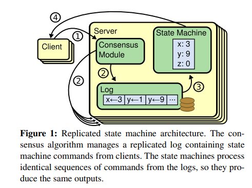
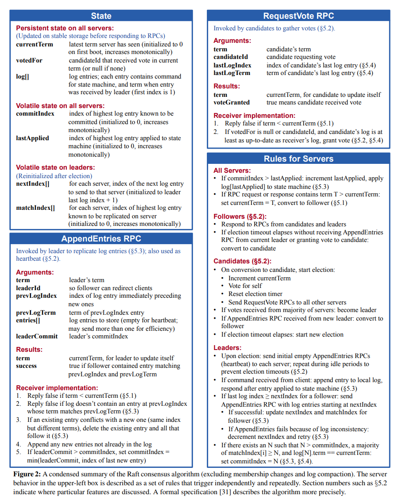
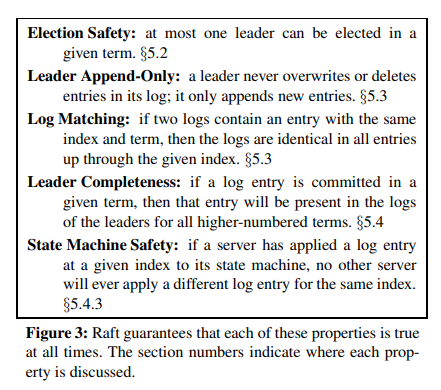
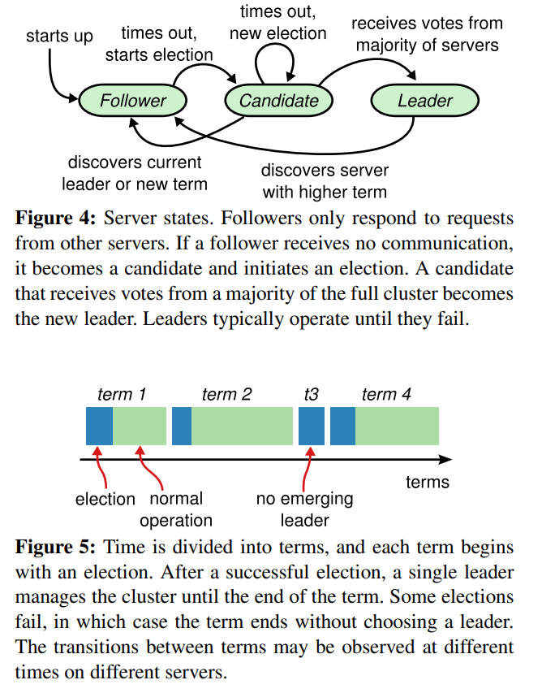
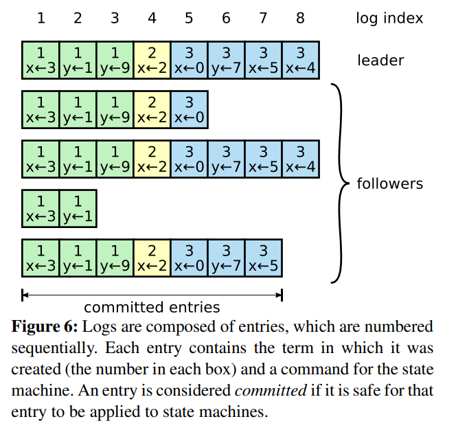
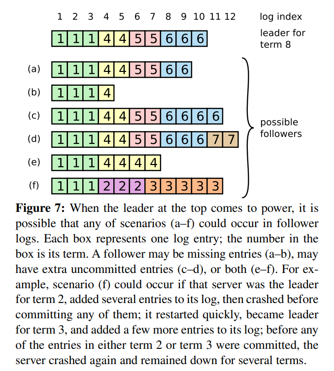
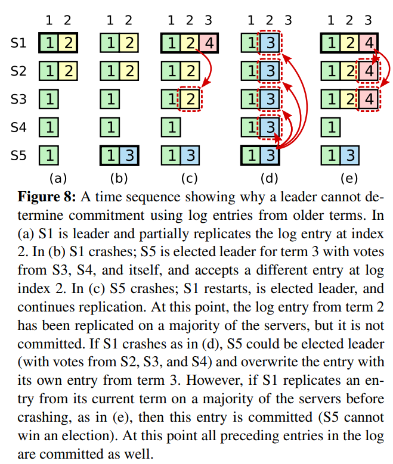
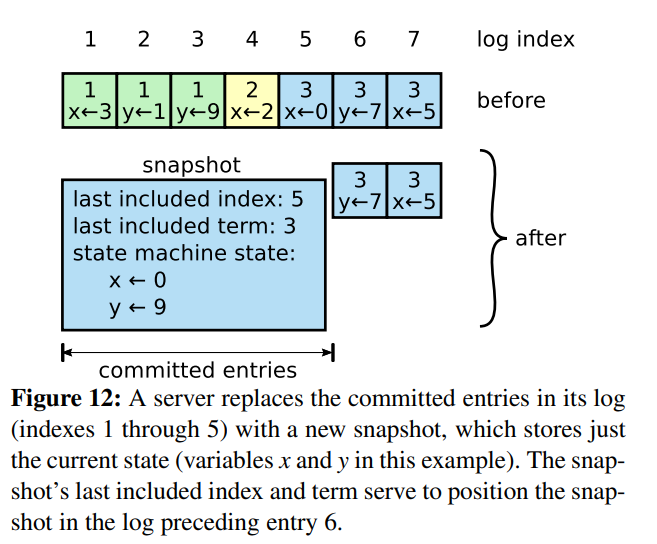

> research paper研读

### Raft 

In Search of an Understandable Consensus Algorithm, Raft consensus, https://pdos.csail.mit.edu/6.824/papers/raft-extended.pdf

####  Introduction

Paxos has dominated the discussion of consensus algorithms over the last decade: most implementationsof consensus are based on Paxos or influenced by it, and Paxos has become the primary vehicle used to teach students about consensus. Unfortunately, Paxos is quite difficult to understand, in spite of numerous attempts to make it more approachable. Paxos算法占据共识算法统治地位, 但是太难理解了

The result of this work is a consensus algorithm called Raft. In designing Raft we applied specific techniques to improve understandability, including decomposition分解 (Raft separates leader election, log replication, and safety) and state space reduction (relative to Paxos, Raft reduces the degree of nondeterminism非决定性 and the ways servers can be inconsistent with each other)

It has several novel features:
* Strong leader: Raft uses a stronger form of leadership than other consensus algorithms. For example,log  entries only flow from the leader to other servers. This simplifies the management of the replicated log and makes Raft easier to understand. 强领导, 例如复制日志只能从leader流向follower, 强领导简化了复制日志的管理
* Leader election: Raft uses randomized timers to elect leaders. This adds only a small amount of mechanism to the heartbeats already required for any consensus algorithm, while resolving conflicts simply and rapidly. 随机时间戳选举Leader比较巧妙
* Membership changes: Raft's mechanism for changing the set of servers in the cluster uses a new joint consensus approach where the majorities of two different configurations overlap during transitions. This allows the cluster to continue operating normally during configuration changes. 联合共识算法, 两个不同配置情况下具有多数配置的服务器会执行覆盖(overlap)

<!-- more -->

#### Replicated state machines

In this approach, state machines on a collection of servers compute identical copies of the same state and can continue operating even if some of the servers are down.(即使服务器挂了复制状态机也可以继续操作, 是持久化的) Replicated state machines are used to solve a variety of fault tolerance problems in distributed systems. For example, large-scale systems that have a single cluster leader, such as GFS [8], HDFS [38],
and RAMCloud [33], typically use a separate replicated state machine to manage leader election and store configuration information that must survive leader crashes. Examples of replicated state machines include Chubby [2] and ZooKeeper. 复制状态机在分布式共识中很常用, 可以解决容错问题, 管理leader选举和储存配置信息。

Replicated state machines are typically implemented using a replicated log, as shown in Figure 1. Each server
stores a log containing a series of commands, which its state machine executes in order. Each log contains the same commands in the same order, so each state machine processes the same sequence of commands. Since the state machines are deterministic, each computes the same state and the same sequence of outputs. 复制状态机一般由复制日志实现, 复制日志存储连串的命令序列, 状态机将按顺序执行这些序列。分布式系统的每个复制日志都具有相同顺序, 状态机按顺序执行这些顺序相同的复制日志,从而保证了状态一致

Keeping the replicated log consistent is the job of the consensus algorithm. The consensus module on a server receives commands from clients and adds them to its log. It communicates with the consensus modules on otherservers to ensure that every log eventually contains the same requests in the same order, even if some servers fail Once commands are properly replicated, each server's state machine processes them in log order, and the outputs are returned to clients. As a result, the servers appear to form a single, highly reliable state machine. 保证复制日志的一致性是共识算法的任务, 当server接收到传来的commands时, 它会调用共识模块确保到来的请求按照相同的顺序。

Consensus algorithms for practical systems typically have the following properties:
• They ensure safety (never returning an incorrect result) under all non-Byzantine conditions, including network delays, partitions, and packet loss, duplication, and reordering. 在非拜占庭将军条件下确保安全, 包括网络延迟, 部分故障, 丢包, 复制, 重排序
• They are fully functional (available) as long as any majority of the servers are operational and can communicate with each other and with clients. Thus, a typical cluster of five servers can tolerate the failure of any two servers. Servers are assumed to fail bystopping; they may later recover from state on stable storage and rejoin the cluster. 容错, server崩掉了也很快恢复到稳定状态
• They do not depend on timing to ensure the consistency of the logs: faulty clocks and extreme message delays can, at worst, cause availability problems. 不能依靠时间保证一致性
• In the common case, a command can complete as soon as a majority of the cluster has responded to a single round of remote procedure calls; a minority of slow servers need not impact overall system performance. 少量server故障不会影响系统的性能

#### Designing for understandability

The first technique is the well-known approach of problem decomposition: wherever possible, we divided problems into separate pieces that could be solved, explained, and understood relatively independently. For example, in Raft we separated leader
election, log replication, safety, and membership changes. 第一个简化方式是问题分解, 分成若干模块

Our second approach was to simplify the state space by reducing the number of states to consider, making the system more coherent and eliminating nondeterminism where possible. Specifically, logs are not allowed to have holes, and Raft limits the ways in which logs can become inconsistent with each other. 减少状态, 通过增加限制减少日志可能不一致的情况

####  The Raft consensus algorithm

Figure 2 summarizes the algorithm in condensed form for reference, and Figure 3 lists key properties of the algorithm; the elements of these figures are discussed piecewise over the rest of this section. 图2,3浓缩了概况, 可以边读文章边以此做参考

Raft implements consensus by first electing a distinguished leader, then giving the leader complete responsibility for managing the replicated log. The leader accepts
log entries from clients, replicates them on other servers,
and tells servers when it is safe to apply log entries to
their state machines. Having a leader simplifies the management of the replicated log. For example, the leader can
decide where to place new entries in the log without consulting other servers, and data flows in a simple fashion
from the leader to other servers. A leader can fail or become disconnected from the other servers, in which case
a new leader is elected. 拥有一个明确的leader可以简化, 例如leader可以决定将新的日志entries放置位置而不用和其他节点协商, 数据流只会从leader发往follower, leader崩溃了可以选举出新的leader 

Given the leader approach, Raft decomposes the consensus problem into three relatively independent subproblems, which are discussed in the subsections that follow:

* Leader election: a new leader must be chosen when
an existing leader fails.
* Log replication: the leader must accept log entries from clients and replicate them across the cluster, forcing the other logs to agree with its own leader强制flower的日志和自己的一样
* Safety: the key safety property for Raft is the State
Machine Safety Property in Figure 3: if any server
has applied a particular log entry to its state machine,
then no other server may apply a different command
for the same log index 复制日志entry一旦apply, 该位置不可修改, 以保证安全性

#### Raft basics

A Raft cluster contains several servers; five is a typical
number, which allows the system to tolerate two failures.
At any given time each server is in one of three states:
leader, follower, or candidate. In normal operation there
is exactly one leader and all of the other servers are followers. Followers are passive: they issue no requests on
their own but simply respond to requests from leaders
and candidates. The leader handles all client requests (if
a client contacts a follower, the follower redirects it to the
leader). 三种状态, leader, follower, candidate, candidate只能响应来自leader的rpc, leader处理所有客户端请求, 如果follower接收到了请求会重定向到leader

Raft divides time into terms of arbitrary length, as
shown in Figure 5. Terms are numbered with consecutive
integers. Each term begins with an election, in which one
or more candidates attempt to become leader as described
in Section 5.2. If a candidate wins the election, then it
serves as leader for the rest of the term. In some situations
an election will result in a split vote. In this case the term
will end with no leader; a new term (with a new election) will begin shortly. Raft ensures that there is at most one
leader in a given term. 当candidates被选举成leader后开始一个term, 如果出现split vote无leader选举产生, 将快速进行下一轮选举。Raft保证最多只有一个leader被选出

Terms act as a logical clock [14] in Raft, and they allow servers
to detect obsolete(过时的) information such as stale(过期的) leaders. Each server stores a current term number, which increases
monotonically over time. Current terms are exchanged
whenever servers communicate; if one server’s current
term is smaller than the other’s, then it updates its current
term to the larger value. If a candidate or leader discovers
that its term is out of date, it immediately reverts to follower state. If a server receives a request with a stale term
number, it rejects the request. Terms同样起到逻辑时钟的作用, 可以让节点检查过时的信息例如过期的leader, 如果节点发现自己的term过期会更新到最新的term, 如果candidate或者leader发现它的term out of date, 它会转为follower, 如果节点接收到过期的term的RPC请求, 它拒绝该请求

Raft servers communicate using remote procedure calls
(RPCs), and the basic consensus algorithm requires only
two types of RPCs. RequestVote RPCs are initiated by
candidates during elections (Section 5.2), and AppendEntries RPCs are initiated by leaders to replicate log entries and to provide a form of heartbeat (Section 5.3). Section 7 adds a third RPC for transferring snapshots between
servers. Servers retry RPCs if they do not receive a response in a timely manner, and they issue RPCs in parallel
for best performance. 一般使用两种RPC通信, 1.RequestVote RPCs用于candidate选举; 2.AppendEntries RPCs用于Leader向follower传输复制日志。如果固定时间内对方无响应RPC将重试

#### Leader election

key words: 选举超时, term, heartbeats, RequestVote RPCs

Raft uses a heartbeat mechanism to trigger leader election. When servers start up, they begin as followers. A
server remains in follower state as long as it receives valid RPCs from a leader or candidate. Leaders send periodic
heartbeats (AppendEntries RPCs that carry no log entries)
to all followers in order to maintain their authority. If a
follower receives no communication over a period of time
called the election timeout, then it assumes there is no viable leader and begins an election to choose a new leader. leader会不断向follower定时发送心跳, 如果一段时间内follower没有接收到心跳信息, 自己的状态就会变为leader选举

To begin an election, a follower increments its current
term and transitions to candidate state. It then votes for
itself and issues RequestVote RPCs in parallel to each of
the other servers in the cluster. A candidate continues in
this state until one of three things happens: (a) it wins the
election, (b) another server establishes itself as leader, or
(c) a period of time goes by with no winner. These outcomes are discussed separately in the paragraphs below 开始选举时, follower会增加一个term并转为candidate, 然后给自己投票并广播到所有节点。直到1. 它赢得选举 2. 其他节点赢得选举 3. 无人赢得选举

A candidate wins an election if it receives votes from
a majority of the servers in the full cluster for the same
term. Each server will vote for at most one candidate in a
given term, on a first-come-first-served basis (note: Section 5.4 adds an additional restriction on votes). The majority rule ensures that at most one candidate can win the
election for a particular term (the Election Safety Property in Figure 3). Once a candidate wins an election, it
becomes leader. It then sends heartbeat messages to all of
the other servers to establish its authority and prevent new
elections. 如果获得大多数选票(一半以上)该candidate将赢得选举, 每个节点只能最多投依次票(另外还有投票条件), 如果candidate赢得选举变为leader, 它会广播心跳信息声明自己成为leader以阻止新的选举

While waiting for votes, a candidate may receive an
AppendEntries RPC from another server claiming to be
leader. If the leader’s term (included in its RPC) is at least
as large as the candidate’s current term, then the candidate
recognizes the leader as legitimate and returns to follower
state. If the term in the RPC is smaller than the candidate’s
current term, then the candidate rejects the RPC and continues in candidate state. 在等待选举时, candidate可能收到AppendEntries RPC声明其他节点成为leader, 如果该节点的term >= candidate, candidate就会认可该节点成为leader并返回为follower状态, 如果该节点term < canidate, candidate会拒绝该RPC继续报纸candidate状态

The third possible outcome is that a candidate neither
wins nor loses the election: if many followers become
candidates at the same time, votes could be split so that
no candidate obtains a majority. When this happens, each
candidate will time out and start a new election by incrementing its term and initiating another round of RequestVote RPCs. However, without extra measures split votes could repeat indefinitely. 如果得票均衡无人取到选举胜利, 每个节点将超时并进入下一轮选举

Raft uses randomized election timeouts to ensure that
split votes are rare and that they are resolved quickly. To
prevent split votes in the first place, election timeouts are
chosen randomly from a fixed interval (e.g., 150–300ms).
This spreads out the servers so that in most cases only a
single server will time out; it wins the election and sends
heartbeats before any other servers time out. Raft设置每个节点超时时间是不同的, 随机位于(150-300ms), 这样保证选不出leader的情况很少发生。因为存在某个节点率先选举超时并开始新一轮选举, 早于其他节点发送投票RPC成为leader

####  Log replication

key words: 复制日志, 覆盖, 一致性检查, term, index, next index, AppendEntries RPC

Once a leader has been elected, it begins servicing
client requests. Each client request contains a command to
be executed by the replicated state machines. The leader
appends the command to its log as a new entry, then issues AppendEntries RPCs in parallel to each of the other
servers to replicate the entry. When the entry has been
safely replicated (as described below), the leader applies
the entry to its state machine and returns the result of that
execution to the client. If followers crash or run slowly,
or if network packets are lost, the leader retries AppendEntries RPCs indefinitely (even after it has responded to
the client) until all followers eventually store all log entries. 一旦leader被选出它就开始处理客户端请求, 每个客户端请求都是一个需要复制状态机执行的命令, leader将该命令加入自己的复制日志, 然后发送AppendEntries RPCs到其他节点要求其他节点复制该命令。如果entry命令安全被复制后, leader会将其apply到复制状态机, 如果某个follower崩溃, 或者运行慢, 网络丢失, leader会无限期重新发送该AppendEntries RPCs, 直到所有的follower都保存了全部的复制日志条目(也就是一个follower出现了问题, leader每次都要多发 AppendEntries RPCs给该follower)

Logs are organized as shown in Figure 6. Each log entry stores a state machine command along with the term
number when the entry was received by the leader. The
term numbers in log entries are used to detect inconsistencies between logs and to ensure some of the properties
in Figure 3. Each log entry also has an integer index identifying its position in the log. 每个日志条目存储term号表名该命令是第一个term发来的, 还有一个index整数表名该条目的位置

The leader decides when it is safe to apply a log entry to the state machines; such an entry is called committed. Raft guarantees that committed entries are durable and will eventually be executed by all of the available state machines. A log entry is committed once the leader
that created the entry has replicated it on a majority of
the servers (e.g., entry 7 in Figure 6). This also commits
all preceding entries in the leader’s log, including entries
created by previous leaders. Section 5.4 discusses some
subtleties when applying this rule after leader changes,
and it also shows that this definition of commitment is
safe. The leader keeps track of the highest index it knows
to be committed, and it includes that index in future
AppendEntries RPCs (including heartbeats) so that the
other servers eventually find out. Once a follower learns
that a log entry is committed, it applies the entry to its
local state machine (in log order). Raft保证提交的entry已经被所有avaliable state machine执行过了, 且过半数server复制了该日志才会提交(两阶段提交)。leader会将已提交log的最大索引附加到AppendEntries RPCs和heartbeats所以follower会发现, 一旦follower发现自己log entry有被提交过了(只要小于该index的entry都应该提交), follower会把该entry提交

We designed the Raft log mechanism to maintain a high
level of coherency between the logs on different servers.
Not only does this simplify the system’s behavior and
make it more predictable, but it is an important component
of ensuring safety. Raft maintains the following properties, which together constitute the Log Matching Property
in Figure 3: Raft log机制通过一系列特性保证安全, 如下两个, 如果两个不同log的entry有相同索引和term, 那么它们会存储相同的命令; 如果两个log的entry有相同的索引和term, 那么两个日志在该entry前面的entry都相同。
* If two entries in different logs have the same index
and term, then they store the same command.
* If two entries in different logs have the same index
and term, then the logs are identical in all preceding
entries.

The first property follows from the fact that a leader
creates at most one entry with a given log index in a given
term, and log entries never change their position in the
log. The second property is guaranteed by a simple consistency check performed by AppendEntries. When sending an AppendEntries RPC, the leader includes the index and term of the entry in its log that immediately precedes the new entries. If the follower does not find an entry in
its log with the same index and term, then it refuses the
new entries. The consistency check acts as an induction
step: the initial empty state of the logs satisfies the Log
Matching Property, and the consistency check preserves
the Log Matching Property whenever logs are extended.
As a result, whenever AppendEntries returns successfully,
the leader knows that the follower’s log is identical to its
own log up through the new entries. 第一个特性保证了在给定的log index下leader最多创建一个entry, 且永远不会改变。第二个特性提供了简单的一致性检查, 当发送AppendEntries RPC leader会发送当前entry以及附带该entry的前一个entry, 如果follower找不到前一个entry它会拒绝leader发来的新entry, 这样如果follower返回成功, leader可以知道follower的日志和它自己的日志相同(直到最新的entry), 因为只要保证最新的和前一个相同, 则所有的都相同

During normal operation, the logs of the leader and
followers stay consistent, so the AppendEntries consistency check never fails. However, leader crashes can leave
the logs inconsistent (the old leader may not have fully
replicated all of the entries in its log). These inconsistencies can compound over a series of leader and follower
crashes. Figure 7 illustrates the ways in which followers’
logs may differ from that of a new leader. A follower may be missing entries that are present on the leader, it may
have extra entries that are not present on the leader, or
both. Missing and extraneous entries in a log may span
multiple terms. 一般情况下, leader和follower的日志一致, 因此一致性检查会成功。但如果leader挂了, 造成了leader和follower的不一致, 即存在entry leader和follower不都有

In Raft, the leader handles inconsistencies by forcing
the followers’ logs to duplicate its own. This means that
conflicting entries in follower logs will be overwritten
with entries from the leader’s log. Section 5.4 will show
that this is safe when coupled with one more restriction. Raft解决以上非一致性的办法是leader将自己的日志覆盖到follower的日志

To bring a follower’s log into consistency with its own,
the leader must find the latest log entry where the two
logs agree, delete any entries in the follower’s log after
that point, and send the follower all of the leader’s entries
after that point. All of these actions happen in response
to the consistency check performed by AppendEntries
RPCs. The leader maintains a nextIndex for each follower,
which is the index of the next log entry the leader will
send to that follower. When a leader first comes to power,
it initializes all nextIndex values to the index just after the
last one in its log (11 in Figure 7). If a follower’s log is
inconsistent with the leader’s, the AppendEntries consistency check will fail in the next AppendEntries RPC. After a rejection, the leader decrements nextIndex and retries the AppendEntries RPC. Eventually nextIndex will reach a point where the leader and follower logs match. When
this happens, AppendEntries will succeed, which removes
any conflicting entries in the follower’s log and appends
entries from the leader’s log (if any). Once AppendEntries
succeeds, the follower’s log is consistent with the leader’s,
and it will remain that way for the rest of the term leader必须找到两个节点相同最近的entry(即一致性检查通过的最近entry), 删除follower该entry之后的entry(即回滚follower之后的行为,undo), 发送给follower leader该entry之后所有的entry(redo)。因此leader会持有每个follower的nextIndex, 表示下一个应该发送给follower的entry index.当一致性检查出错后follower会拒绝 AppendEntries RPC, 之后leader将减少nextIndex并重发AppendEntriesRPC直到一致性检查通过, 之后删除follower该entry之后的并发给follower leader该entry之后的。一旦一致性检查通过则说明leader和follower该点之前的entry都是一致的

With this mechanism, a leader does not need to take any
special actions to restore log consistency when it comes to
power. It just begins normal operation, and the logs automatically converge in response to failures of the AppendEntries consistency check. A leader never overwrites or deletes entries in its own log (the Leader Append-Only Property in Figure 3). leader重来不会覆盖或删除自己log中的entry, 但是follower会

#### Safety

keyword: 选举选择包含所有提交entry的server(即选择term最大的, term相同选最大的term entry最长的), leader执行复制时从当前term开始而不是prev term

*  Election restriction

The previous sections described how Raft elects leaders and replicates log entries. However, the mechanisms
described so far are not quite sufficient to ensure that each
state machine executes exactly the same commands in the
same order. For example, a follower might be unavailable
while the leader commits several log entries, then it could
be elected leader and overwrite these entries with new
ones; as a result, different state machines might execute
different command sequences. 以上复制日志机制(即一致性检查机制)尚不能保证安全性, 有可能leader提交一些entry而follower没有接收到(这时候leader和follower的log不一致), 之后该follower被选为leader并用自己的entry覆盖了这些已经提交的entry, 从而带来问题

This section completes the Raft algorithm by adding a
restriction on which servers may be elected leader. The
restriction ensures that the leader for any given term contains all of the entries committed in previous terms (the
Leader Completeness Property from Figure 3). Given the
election restriction, we then make the rules for commitment more precise. Finally, we present a proof sketch for
the Leader Completeness Property and show how it leads
to correct behavior of the replicated state machine. 以上问题要从leader选举上解决, 保证被选举的leader包含过去已经提交过的所有entry

In any leader-based consensus algorithm, the leader
must eventually store all of the committed log entries. In
some consensus algorithms, such as Viewstamped Replication [22], a leader can be elected even if it doesn’t
initially contain all of the committed entries. These algorithms contain additional mechanisms to identify the
missing entries and transmit them to the new leader, either during the election process or shortly afterwards. Unfortunately, this results in considerable additional mechanism and complexity. Raft uses a simpler approach where it guarantees that all the committed entries from previous terms are present on each new leader from the moment of
its election, without the need to transfer those entries to
the leader. This means that log entries only flow in one direction, from leaders to followers, and leaders never overwrite existing entries in their logs. 强leader共识算法中leader必须拥有所有提交的log entries, 在一些算法中甚至如果leader不包含所有提交的entry就会重新选举, 且会使用机制判断leader是否丢失entry, 这些算法是复杂的。Raft简单在于使log entry只会从leader单向流向follower, leader从来不会覆盖log中存在的entry(除非该leader转为follower被其他leader覆盖)

Raft uses the voting process to prevent a candidate from
winning an election unless its log contains all committed
entries. A candidate must contact a majority of the cluster
in order to be elected, which means that every committed
entry must be present in at least one of those servers. If the
candidate’s log is at least as up-to-date as any other log
in that majority (where “up-to-date” is defined precisely
below), then it will hold all the committed entries. The
RequestVote RPC implements this restriction: the RPC
includes information about the candidate’s log, and the
voter denies its vote if its own log is more up-to-date than
that of the candidate Raft使用选举流程使包含所有提交entry的candidate才会选为leader, RequestVote RPC实现了该限制, 如果voter发现candidate的log比自己的旧它会拒绝选举

Raft determines which of two logs is more up-to-date
by comparing the index and term of the last entries in the
logs. If the logs have last entries with different terms, then
the log with the later term is more up-to-date. If the logs
end with the same term, then whichever log is longer is
more up-to-date. Raft通过比较两个日志中最后一个entry的index和term来确定最新
如果term不同，那么term较大的新。**如果term相同，那么哪个log的term更长，哪个log更新。**

* Committing entries from previous terms

If a leader crashes before committing an entry, future leaders will attempt to finish replicating the entry. However, a leader cannot immediately conclude that an entry from a previous term is
committed once it is stored on a majority of servers. Figure 8 illustrates a situation where an old log entry is stored
on a majority of servers, yet can still be overwritten by a
future leader. 如果一个leader在提交entry之前崩溃了, 未来的leader会尝试复制自己的entry到follower, 即使一个old entry已经被大多数server认可了, 但是在未来还可能被未来的leader覆盖, 如图8的d, 在(c)中2已经被提交但还是被(d)的3覆盖

To eliminate problems like the one in Figure 8, Raft never commits log entries from previous terms by counting replicas. Only log entries from the leader’s current term are committed by counting replicas; once an entry from the current term has been committed in this way, then all prior entries are committed indirectly because of the Log Matching Property. There are some situations where a leader could safely conclude that an older log entry is committed (for example, if that entry is stored on every server), but Raft takes a more conservative approach for simplicity 

为了解决图8那种问题, raft不会从pervious terms开始提交log entries, 也就是图8的c区域, 当前index=3, leader直接将index=3的内容赋给follower, 而follower S3收到leader的index=3, 会自动将index=2的区域也填上, 因为AppendEntries RPC会包含index, prev index来做一致性检查

Raft incurs this extra complexity in the commitment rules because log entries retain their original term numbers when a leader replicates entries from previous terms. In other consensus algorithms, if a new leader rereplicates entries from prior “terms,” it must do so with
its new “term number.” Raft’s approach makes it easier
to reason about log entries, since they maintain the same
term number over time and across logs. In addition, new
leaders in Raft send fewer log entries from previous terms
than in other algorithms (other algorithms must send redundant log entries to renumber them before they can be committed).

Finally, Raft requires servers to apply entries in log index order. Combined with the State Machine Safety Property, this means that all servers will apply exactly the same set of log entries to their state machines, in the same order. 保持顺序相同

#### Log compaction

Raft’s log grows during normal operation to incorporate more client requests, but in a practical system, it cannot grow without bound. As the log grows longer, it occupies more space and takes more time to replay. This will eventually cause availability problems without some
mechanism to discard obsolete information that has accumulated in the log.

Snapshotting is the simplest approach to compaction.
In snapshotting, the entire current system state is written
to a snapshot on stable storage, then the entire log up to that point is discarded. Snapshotting is used in Chubby
and ZooKeeper, and the remainder of this section describes snapshotting in Raft. 类似redis aof日志的compaction

