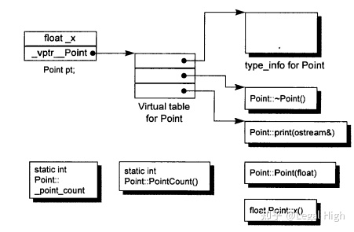
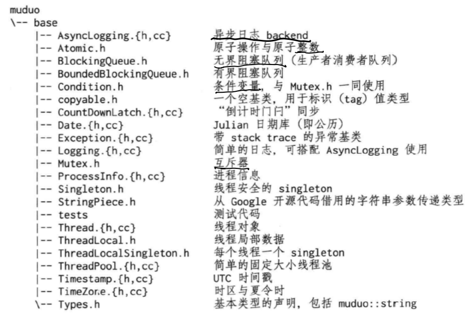
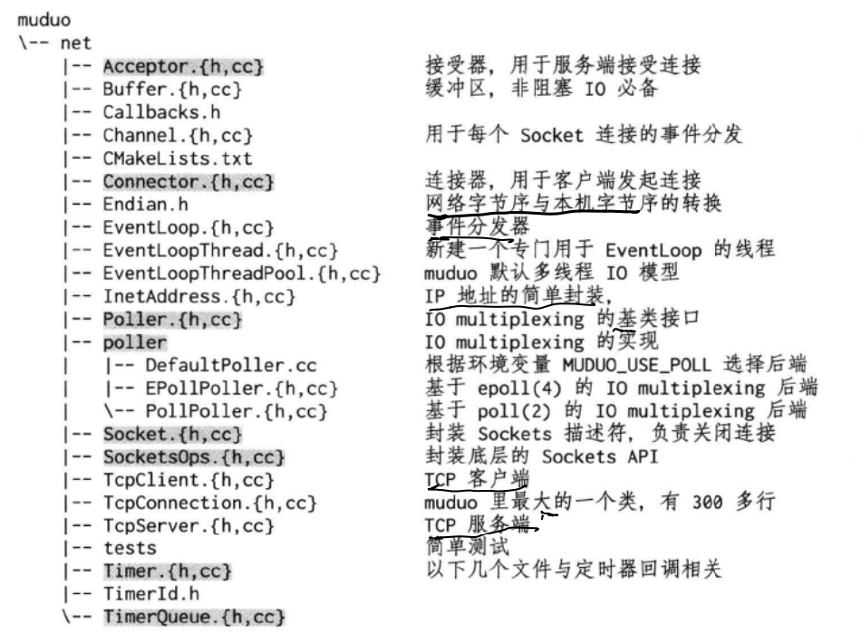
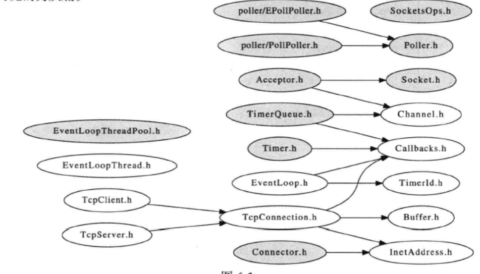
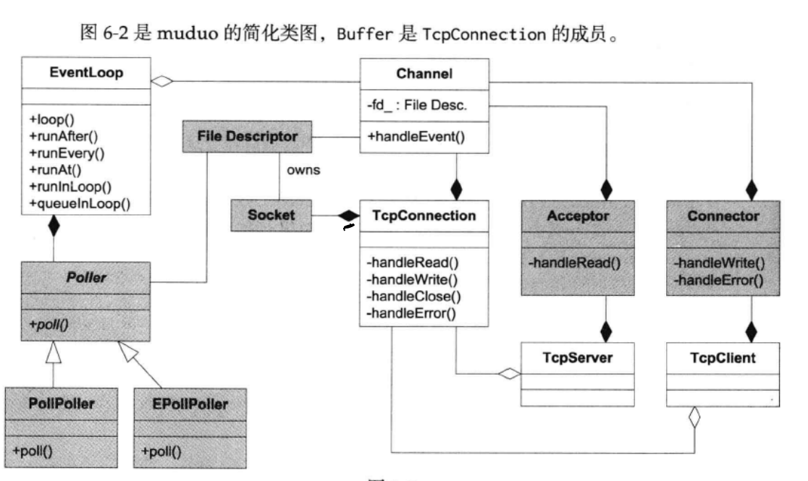
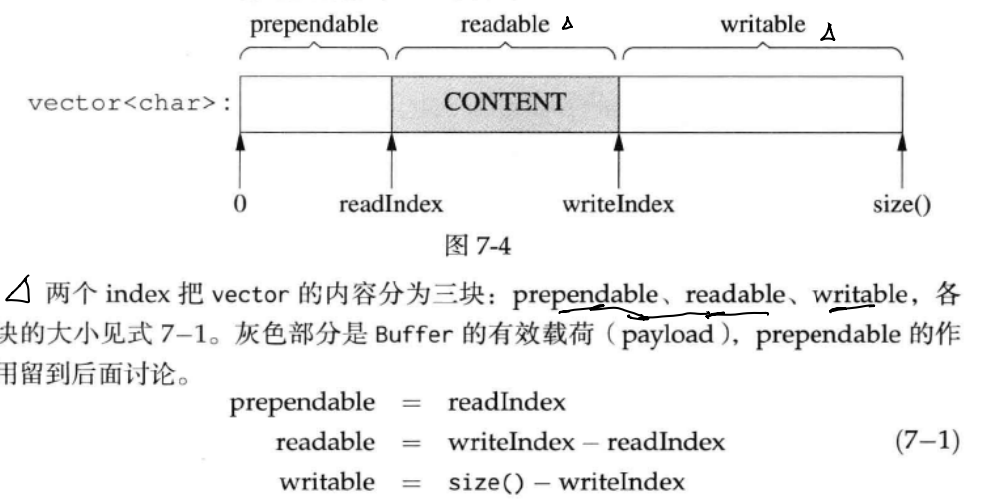

### muduo网络库简介

muduo是基于Reactor模式的网络库，核心是事件循环EventLoop，用于响应定时器和IO事件。muduo采用基于对象(object-based)而非面向对象(object-oriented)的设计风格，其事件回调接口多以`boost::function+boost::bind`表达，用户不需要继承其中的class。



基础库


网络核心库


#### 接口和实现
公开接口
* Buffer, 数据的读写通过buffer进行，用户不需要调用read(2)/write(2)
* InetAddress封装IPv4地址，注意不能解析域名，因为`gethostbyname(3)`解析域名会阻塞IO线程。
* EventLoop事件循环，每个线程只能由一个EventLoop对象，负责IO和定时器事件的分派，用eventfd(2)来异步唤醒。用TimerQueue作为定时器管理，用Poller作为IO multiplexing。
* EventLoopThread启动一个线程，在其中运行EventLoop::loop()
* TcpConnection是网络库的核心，封装一次TCP连接，但不能发起连接
* TcpClient用于编写网络客户端，能发起连接，重试
* TcpServer用于服务器，能接受客户的连接


这些类中，TcpConnection的生命期依靠`shared_ptr`管理，用户和库共同控制，Buffer的生命期由TcpConnection控制，其余类生命期由用户控制。Buffer和InetAddress具有值语义，可以拷贝；其他class都是对象语义，不能拷贝。

内部实现
* Channel负责注册和响应IO事件，但不拥有file descriptor。它是Acceptor, Connector, EventLoop, TimeQueue, TcpConnection的成员，生命期由后者控制。
* Socket是一个RAII handle，封装一个file descriptor，析构时关闭fd。它是Acceptor, TcpConnection的成员，生命期由后者控制。EventLoop, TimeQueue也拥有fd，但不封装为Socket class.
* SocketsOps封装各种Sockets系统调用。
* Poller是PollPoller和EPollPoller的基类，采用电平触发。它是EventLoop的成员，生命期由后者控制
* PollPoller和EPollPoller封装poll(2)和epoll(4)两种IO multiplexing后端，poll的存在价值便于调试，因为poll(2)调用是上下文无关的。
* Connector用于发起TCP连接，它是TcpClient成员，生命期由后者控制
* Acceptor用于接受TCP连接，它是TcpServer成员，生命期由后者控制
* TimeQueue用timerfd实现定时，不需要设置poll/epoll_wait(等待时长)。TimerQueue用std::map管理Timer，它是EventLoop成员，生命期由后者控制。
* EventLoopThreadPoll用于创建IO线程池，用于把TcpConnection分派到EventLoop线程上，是TcpServer成员，生命期由后者控制。





<!-- more -->

#### 线程模型
每个线程最多一个EventLoop，每个TcpConnection必须归某个EventLoop管理，其所有IO都会被这个线程处理。TcpConnection和EventLoop是线程安全的。
* 单线程,accept(2)和TcpConnection用同一个线程处理IO连接
* 多线程，accept(2)与EventLoop在同一个线程，另外创建一个EventLoopThreadPoll，新的连接被分配到线程池中。

#### Tcp网络编程三个半事件

TCP网络编程最本质是处理三个半事件
1. 连接的建立，包括服务端(accept)新连接和客户端成功发起(connect)新连接，TCP连接一旦建立，客户端和服务端是平等的，可以各自收发数据。
2. 连接的断开，包括主动断开(close, shutdown)和被动断开(read(2)返回0)
3. 消息到达，文件描述符可读。对该事件的处理方式决定了网络编程的风格，如阻塞非阻塞，处理分包，应用缓冲设计。   
3.5 消息发送完毕，算半个。表示数据写入操作系统的缓冲区，将由TCP协议栈负责数据发送和重传，不代表对方收到数据。

#### TCP示例

muduo中，只需要编写并绑定对应事件回调函数，就能实现三个半事件的处理。

例如discard只需要关注"消息/数据到达"事件，即`onMessage`
```cpp
void DiscardServer::onMessage(const TcpConnectionPtr& conn, Buffer* buf, TimeStamp time) {
    string msg(buf->retrieveAllAsString());
    LOG_INFO << conn->name << " discards " ;
}
```

daytime只需要关注"连接已建立"事件

```cpp
void DaytimeServer::onConnection(const TcpConnectionPtr& conn) {
    LOG_INFO << "DaytimeServer -" ...
    if (conn->connected()) {
        conn->send(Timestamp::now().toFormattedString() + "\n");
        conn->shutdown();
    }
}
```
### Buffer和文件传输

#### buffer
TcpConnection必须要有output buffer，用户发送数据时数据先发送到buffer中，等socket文件操作符可写时再一并写入。同时也必须有input buffer，一次收到的数据可能不完整，接收的数据先放到buffer，等构成一条完整信息再通知程序的业务逻辑。

所有muduo的IO都是缓冲IO，用户不会取操作read()或write()某个socket，只会操作TcpConnection的input buffer和output buffer。更确切的，是在`onMessage()`回调中读取input buffer; 调用TcpConnection::send()间接操作output buffer。

线程安全性，Buffer不是线程安全的，其安全性与std::vector相同。
* 对于input buffer, onMessage()回调始终发生在该TcpConnection所属的IO线程，应用程序应该在onMessage()完成对input buffer的操作，并且不要把input buffer暴露给其他线程。这样Buffer class不必线程安全
* 对于output buffer，应用程序不会直接操作它，而是调用TcpConnection::send()来发送数据，后者是线程安全的。
* 如果TcpConnection::send()调用发生在TcpConnection所属的那个IO线程，那它转而调用TcpConnection::sendInLoop(), sendInLoop会在当前线程操作output buffer; 如果在调用发生在别的线程，它会通过EventLoop::runInLoop()把sendInLoop()函数调用转移到IO线程，这样用IO线程操作output buffer，不会有线程安全问题。至于函数参数的跨线程传递，直接把数据拷贝一份即可。



两个index即readIndex, writeIndex类型是int，记录相对于`vector<char>`起始位置的偏移，不是指针，这可以避免迭代器失效带来的影响。

底层使用`vector`可以动态增长空间的大小，但如果原因是prependable太大导致的writable不够则不会增加空间，而是将content挪移到前面腾出writable空间。当readIndex=writeIndex时，缓冲区内容全部读取完，重置readIndex=writeIndex=初始位置。

prependable默认有少量空间，这可以低代价在前面添加几个字节。例如序列化一个消息，但不知道多长，那么可以append()到序列化完成，最后在前面添加消息的长度。

#### 文件传输

TcpConnection提供的`send()`重载函数如下
```cpp

class TcpConection : boost :: noncopyable,
    public boost::enable_shared_from_this<TcpConnection>
{
public:
    void send(const void* message, size_t len);
    void send(const StringPiece& message);
    void send(Buffer* message);

    // void send(Buffer&& message); // c++11
    // void send(string&& message); // c++11
};
```
* send返回类型为void，意味着muduo会保证把数据发送给对方
* send()非阻塞，不会阻塞客户调用线程
* send()线程安全，原子，多个线程可以同时调用send,muduo可以保证多线程每个消息的完整性，但顺序可以不同。
* void send(const void* message, size_t len);可以发送任意字节序列
* void send(const StringPiece& message) 可以发送std::string 和const char*

### 源码分析

### uncopyable.h

```cpp
namespace muduo
{
/// 将构造函数和析构函数设置为protected, 继承者可正常调用
class copyable
{
 protected:
  copyable() = default;
  ~copyable() = default;
};

}  // namespace muduo

```

### noncopyable.h

```cpp
namespace muduo
{

class noncopyable

/// 拷贝构造函数和操作符设置delete
/// 派生类无法调用拷贝构造函数, 因为其父类无法执行拷贝构造
/// 构造函数析构函数protected+ default
{
 public:
  noncopyable(const noncopyable&) = delete;
  void operator=(const noncopyable&) = delete;

 protected:
  noncopyable() = default;
  ~noncopyable() = default;
};

}  // namespace muduo
```

### Atomic.h

原子类是int类型的原子类, 且是一个模板类, 可实例化`typedef AtomicIntegerT<int32_t> AtomicInt32;`

原子类实现的方法是gcc内置原子操作, 例如`__sync_fetch_and_add(&value_, x)`对*value执行原子加法, CAS `__sync_val_compare_and_swap (type *ptr, type oldval, type newval, ...)`  如果ptr所指向的内存地址存放的值与oldval相同的话, 则将其用newval的值替换。

```c
type __sync_val_compare_and_swap (type *ptr, type oldval, type newval, ...)
/* 对应的伪代码 */
{ if (*ptr == oldval) { *ptr = newval; } 
    return oldval; 
}
```

```cpp
namespace muduo
{

namespace detail
{
template<typename T>
class AtomicIntegerT : noncopyable
{
 public:
  AtomicIntegerT()
    : value_(0)
  {
  }

  T get()
  {
    // in gcc >= 4.7: __atomic_load_n(&value_, __ATOMIC_SEQ_CST)
    return __sync_val_compare_and_swap(&value_, 0, 0);
  }

  T getAndAdd(T x)
  {
    // in gcc >= 4.7: __atomic_fetch_add(&value_, x, __ATOMIC_SEQ_CST)
    return __sync_fetch_and_add(&value_, x);
  }

  T addAndGet(T x)
  {
    return getAndAdd(x) + x;
  }

    ...

  T getAndSet(T newValue)
  {
    // in gcc >= 4.7: __atomic_exchange_n(&value_, newValue, __ATOMIC_SEQ_CST)
    return __sync_lock_test_and_set(&value_, newValue);
  }

 private:
  volatile T value_;
};
}  // namespace detail

typedef detail::AtomicIntegerT<int32_t> AtomicInt32;
typedef detail::AtomicIntegerT<int64_t> AtomicInt64;

}  // namespace muduo
```

### thread class

* thread的基本功能是传入一个函数, 调用start()方法开始执行, 并可以返回线程的状态。

* pthread id是pthread库提供的ID，在系统级别没有意义。pid都是线程组leader的进程ID, 使用`getpid()`获取。而tid是线程ID，`syscall(SYS_gettid)`获取。pid和tid均全局唯一。

* 基本逻辑, pthread_create创建线程执行startThread, startThread调用ThreadData对象执行对象runInThread()成员方法。

```cpp
class Thread : noncopyable
{
 public:
  typedef std::function<void()> ThreadFunc;

  explicit Thread(ThreadFunc, const string& name = string());
  ~Thread();

  void start();
  int join(); // return pthread_join(), 主线程(main)等待子线程执行完并回收资源

  bool started() const { return started_; }
  // pthread_t pthreadId() const { return pthreadId_; }
  pid_t tid() const { return tid_; }  // thread_id
  const string& name() const { return name_; }

  static int numCreated() { return numCreated_.get(); }

 private:
  void setDefaultName();

  bool       started_;
  bool       joined_;
  pthread_t  pthreadId_;  // pthreadId_, pthread_t认
  pid_t      tid_;  // tid_, 全局使用, 保证每个线程号都是唯一的
  ThreadFunc func_;
  string     name_;
  CountDownLatch latch_;  // 倒计时

  static AtomicInt32 numCreated_; // 原子类, 记录创建的线程个数
};
```

Thread.cc 实现文件
```cpp
/// 得到线程的tid
pid_t gettid()
{
  // 使用pthread_t各个进程独立，所以会有不同进程中线程号相同节的情况, syscall(SYS_gettid)得到的实际线程唯一id
  // 等价于gettid()
  return static_cast<pid_t>(::syscall(SYS_gettid)); 
}
void afterFork()
{
  muduo::CurrentThread::t_cachedTid = 0;
  muduo::CurrentThread::t_threadName = "main";
  CurrentThread::tid();
  // no need to call pthread_atfork(NULL, NULL, &afterFork);
}

class ThreadNameInitializer
{
 public:
  ThreadNameInitializer()
  {
    muduo::CurrentThread::t_threadName = "main";
    CurrentThread::tid();
    pthread_atfork(NULL, NULL, &afterFork);
  }
};

ThreadNameInitializer init;

struct ThreadData
{
  typedef muduo::Thread::ThreadFunc ThreadFunc;
  ThreadFunc func_;
  string name_;
  pid_t* tid_;
  CountDownLatch* latch_;

  // 关于线程的一些变量, 要执行的函数, name, tid, latch
  ThreadData(ThreadFunc func,
             const string& name,
             pid_t* tid,
             CountDownLatch* latch)
    : func_(std::move(func)),
      name_(name),
      tid_(tid),
      latch_(latch)
  { }
  // ThreadData内部包含线程的函数执行流程
  void runInThread()
  {
    *tid_ = muduo::CurrentThread::tid();  // 调用CurrentThread::tid()会得到线程内部的信息, 将其t_cachedTid保存到thread对象*tid中
    tid_ = NULL;
    latch_->countDown();  // 倒计时
    latch_ = NULL;

    muduo::CurrentThread::t_threadName = name_.empty() ? "muduoThread" : name_.c_str(); // 设置muduo::CurrentThread::t_threadName
    ::prctl(PR_SET_NAME, muduo::CurrentThread::t_threadName); // 进程重命名, PR_SET_NAME,设置为CurrentThread相关信息
    // 执行线程内部函数func_()
    try
    {
      func_();
      muduo::CurrentThread::t_threadName = "finished";
    }
    catch (const Exception& ex)
    {
      muduo::CurrentThread::t_threadName = "crashed";
      // 将字符串拷贝到标准错误流
      fprintf(stderr, "exception caught in Thread %s\n", name_.c_str());
      fprintf(stderr, "reason: %s\n", ex.what());
      fprintf(stderr, "stack trace: %s\n", ex.stackTrace());  // 栈情况
      abort();
    }
  }
};

// 开启线程, pthread_create执行的函数
void* startThread(void* obj)
{
  ThreadData* data = static_cast<ThreadData*>(obj);
  data->runInThread();  // 调用runInThread
  delete data;
  return NULL;
}

// 获得当前线程的id， 这个会被CurrentThread.h中调用成为线程内部信息
void CurrentThread::cacheTid()
{
  if (t_cachedTid == 0)
  {
    t_cachedTid = detail::gettid(); // t_cachedTid是线程内部变量
    t_tidStringLength = snprintf(t_tidString, sizeof t_tidString, "%5d ", t_cachedTid); // 将t_cachedTid格式化到t_tidString, 也是线程内部变量
  }
}
// tid()=getpid()的线程是主线程
bool CurrentThread::isMainThread()
{
  return tid() == ::getpid(); // 取得目前进程的进程识别码
}

void CurrentThread::sleepUsec(int64_t usec)
{
  struct timespec ts = { 0, 0 };
  ts.tv_sec = static_cast<time_t>(usec / Timestamp::kMicroSecondsPerSecond);
  ts.tv_nsec = static_cast<long>(usec % Timestamp::kMicroSecondsPerSecond * 1000);
  ::nanosleep(&ts, NULL);
}
AtomicInt32 Thread::numCreated_;

Thread::Thread(ThreadFunc func, const string& n)
// Thread对象初始化的一些变量
  : started_(false),
    joined_(false),
    pthreadId_(0),
    tid_(0),
    func_(std::move(func)),
    name_(n), 
    latch_(1)
{
  setDefaultName();
}

Thread::~Thread()
{
  if (started_ && !joined_) // 如果开启了线程没有joined, 就detach
  {
    pthread_detach(pthreadId_);
  }
}

void Thread::setDefaultName()
{
  int num = numCreated_.incrementAndGet();
  if (name_.empty())
  {
    char buf[32];
    snprintf(buf, sizeof buf, "Thread%d", num);
    name_ = buf;
  }
}
// 创建线程并执行, pthread_create方法来进行创建，最终会调用到do_fork方法
// 线程从内核层面来看其实也是一种特殊的进程，它跟父进程共享了打开的文件和文件系统信息，共享了地址空间和信号处理函数]
// pthread_create创建的线程的getpid()和父线程一致, gettid()不一致
void Thread::start()
{
  assert(!started_);
  started_ = true;
  // FIXME: move(func_)
  detail::ThreadData* data = new detail::ThreadData(func_, name_, &tid_, &latch_);  // 构建threadData对象(func_也放进去了), 执行startThread函数, 传参为data
  if (pthread_create(&pthreadId_, NULL, &detail::startThread, data)) // 后面的参数是执行的函数和传参, 创建失败，返回1
  {
    started_ = false;
    delete data; // or no delete?
    LOG_SYSFATAL << "Failed in pthread_create";
  }
  else
  // 线程创建成功
  {
    latch_.wait();  // 倒计时执行
    assert(tid_ > 0);
  }
}

// pthread_join
int Thread::join()
{
  assert(started_); // 必须已经start了
  assert(!joined_); // 没有join过
  joined_ = true;
  return pthread_join(pthreadId_, NULL);  // 调用join, 第二个参数是可返回的
}
```

### thread_local

thread_local是存储在线程内部的私有变量

* 使用`pthread_key_create`设置私有变量, 使用`pthread_getspecific`获取私有变量
* 私有变量通过key-value读取, key类型为`pthread_key_t`

```cpp
// threadLocal不需要担心多线程
template<typename T>
class ThreadLocal : noncopyable
{
 public:
  ThreadLocal()
  {
    /// 线程内部变量定义pKey, 析构时调用destructor
    MCHECK(pthread_key_create(&pkey_, &ThreadLocal::destructor));
  }

  ~ThreadLocal()
  {
    MCHECK(pthread_key_delete(pkey_));
  }

  T& value()  // 得到线程内部对象的值
  {
    T* perThreadValue = static_cast<T*>(pthread_getspecific(pkey_));  // 读取私有数据, 获取线程内部储存的值
    
    if (!perThreadValue)  // 如果线程内没有该对象，则重新创建一个
    {
      T* newObj = new T();
      MCHECK(pthread_setspecific(pkey_, newObj)); // 赋值pKey
      perThreadValue = newObj;
    }
    return *perThreadValue;
  }

 private:

  static void destructor(void *x)
  {
    /// x强制转型为T*, 也就是指针类型
    T* obj = static_cast<T*>(x);

    /// 如果sizeof(T) == 0(不正确), 则编译器会报错T_must_be_complete_type[-1]
    /// 下面这句话只允许sizeof(T) != 0
    typedef char T_must_be_complete_type[sizeof(T) == 0 ? -1 : 1];
    T_must_be_complete_type dummy; (void) dummy;
    /// delete obj指向的对象
    delete obj;
  }
 private:
 /// 线程私有变量
  pthread_key_t pkey_;
};
```

### 单例线程私有变量 ThreadLocalSingleton

* 初始化ThreadLocalSingleton前, 静态成员变量 Deleter已经初始化, 创建单独的线程变量的键pkey_
* 初始化ThreadLocalSingleton后, 调用static T& instance(), 可以经Deleter::set() 用 `pthread_setspecific(pkey_, newObj)` 设置当前pkey_的私有变量的单一实例。
* 调用ThreadLocalSingleton::pointer()返回私有变量对象的指针
* ThreadLocalSingleton与Deleter两个class关系复杂, 不知道为何

```cpp
template<typename T>
class ThreadLocalSingleton : noncopyable
{
 public:
  // thread_local是单例的，不提供构造函数和析构函数
  ThreadLocalSingleton() = delete;
  ~ThreadLocalSingleton() = delete;

  /// 获取线程私有变量的唯一intance
  static T& instance()
  {
    if (!t_value_)
    {
      t_value_ = new T(); // 线程内部对象
      deleter_.set(t_value_); /// 置入线程
    }
    return *t_value_;
  }

  static T* pointer()
  {
    return t_value_;
  }

 private:
  static void destructor(void* obj)
  {
    assert(obj == t_value_);
    typedef char T_must_be_complete_type[sizeof(T) == 0 ? -1 : 1];
    T_must_be_complete_type dummy; (void) dummy;
    delete t_value_;
    t_value_ = 0;
  }

  class Deleter
  {
   public:
   
    Deleter()
    {
    // 创建单独的线程变量的键pkey_, 清理函数为destructor线程释放该线程存储的时候被调用。
      pthread_key_create(&pkey_, &ThreadLocalSingleton::destructor);
    }

    ~Deleter()
    {
      pthread_key_delete(pkey_);
    }
    // 需要存储特殊值调用 pthread_setspcific()
    void set(T* newObj)
    {
      assert(pthread_getspecific(pkey_) == NULL);
      /// 设置线程私有变量
      pthread_setspecific(pkey_, newObj);
    }

    pthread_key_t pkey_;
  };

  /// 前置__thread说明t_value_是私有变量
  static __thread T* t_value_;
  static Deleter deleter_;  
};

template<typename T>
__thread T* ThreadLocalSingleton<T>::t_value_ = 0;
```

#### ThreadPool 线程池

* 线程池是维护若干线程, 之后想用线程池执行任务, 只需要调用`run`函数就行了
* run 函数使要执行的task进入任务队列, 注意进队列之前等待任务队列未满, 进队列后令条件变量任务队列非空为true
* thread_pool的start(), 创建线程vector, 每个线程执行runInthread函数
* `runInthread`函数执行任务出队列, 当然要上锁等待任务队列非空
* 线程池是一个消费者-生产者模型, task队列是生产者, 线程vector是消费者。使用一个mutex, 生产者等待queue未满, 消费者等待queue非空。queue是共享变量。

```cpp
class ThreadPool : noncopyable
class ThreadPool : noncopyable
{
 public:

 /// 线程需要执行的函数, std::function<void() >
  typedef std::function<void ()> Task;

  explicit ThreadPool(const string& nameArg = string("ThreadPool"));
  ~ThreadPool();

  // Must be called before start().
  void setMaxQueueSize(int maxSize) { maxQueueSize_ = maxSize; }

  /// 线程初始化之后的回调函数
  void setThreadInitCallback(const Task& cb)
  { threadInitCallback_ = cb; }

  void start(int numThreads);
  void stop();

  const string& name() const
  { return name_; }
  /// 任务队列当前大小
  size_t queueSize() const;
    /// 使用线程池执行任务
  void run(Task f);

 private:
  bool isFull() const REQUIRES(mutex_);
  void runInThread();
  Task take();

  mutable MutexLock mutex_;
  /// 条件变量
  Condition notEmpty_ GUARDED_BY(mutex_);
  Condition notFull_ GUARDED_BY(mutex_);
  string name_;
  /// 线程初始化回调函数
  Task threadInitCallback_;
  /// thread vectors, 用unique_ptr维护, 因为thread不可拷贝
  std::vector<std::unique_ptr<muduo::Thread>> threads_;
  /// 任务队列
  std::deque<Task> queue_ GUARDED_BY(mutex_);
  size_t maxQueueSize_;
  bool running_;
};
```

thread_pool.cpp
```cpp
/// 线程池初始化
ThreadPool::ThreadPool(const string& nameArg)
  : mutex_(),
    notEmpty_(mutex_),
    notFull_(mutex_),
    name_(nameArg),
    maxQueueSize_(0),
    running_(false)
{
}

ThreadPool::~ThreadPool()
{
  if (running_)
  {
    stop();
  }
}

/// 线程池start
/// 创建线程vector, 每个线程执行runInthread函数
void ThreadPool::start(int numThreads)
{
  assert(threads_.empty());
  running_ = true;  // running
  // 分配空间, 即capacity的值 
  threads_.reserve(numThreads);
  for (int i = 0; i < numThreads; ++i)
  {
    char id[32];
    snprintf(id, sizeof id, "%d", i+1);

    /// 创建线程初始化执行runInThread函数, 并进入线程池
    threads_.emplace_back(new muduo::Thread(
          std::bind(&ThreadPool::runInThread, this), name_+id));
    /// 该线程开始运行
    threads_[i]->start();
  }

  /// 线程数目为0
  if (numThreads == 0 && threadInitCallback_)
  {
    threadInitCallback_();
  }
}
/// 线程池stop
void ThreadPool::stop()
{
  {
  MutexLockGuard lock(mutex_);
  /// 设置
  running_ = false;
  /// 释放条件变量, 使剩下的线程可顺利执行完毕
  notEmpty_.notifyAll();
  notFull_.notifyAll();
  }

  /// 等待所有线程执行完毕
  for (auto& thr : threads_)
  {
    thr->join();
  }
}

/// 返回任务队列size
size_t ThreadPool::queueSize() const
{
  MutexLockGuard lock(mutex_);
  return queue_.size();
}

/// 使用线程池执行task
void ThreadPool::run(Task task)
{
  /// 如果线程为空, 主线程执行task
  if (threads_.empty())
  {
    task();
  }
  else
  {
    MutexLockGuard lock(mutex_);
    while (isFull() && running_)
    {
      /// 等待任务队列notFull_ is true
      notFull_.wait();
    }
    if (!running_) return;
    assert(!isFull());
    /// 任务task入队列
    queue_.push_back(std::move(task));
    /// 发出任务队列非空条件变量
    notEmpty_.notify();
  }
}

ThreadPool::Task ThreadPool::take()
{
  MutexLockGuard lock(mutex_);
  // always use a while-loop, due to spurious wakeup
  while (queue_.empty() && running_)
  {
    /// 等待任务队列非空, notEmpty_ is true
    notEmpty_.wait();
  }
  Task task;
  if (!queue_.empty())
  {
    /// 任务出队列
    task = queue_.front();
    queue_.pop_front();

    if (maxQueueSize_ > 0)
    {
      /// 释放任务队列未满条件变量
      notFull_.notify();
    }
  }
  return task;
}

bool ThreadPool::isFull() const
{
  mutex_.assertLocked();
  /// queue_.size() >= maxQueueSize_说明队列满了
  return maxQueueSize_ > 0 && queue_.size() >= maxQueueSize_;
}

/// 线程池的线程执行函数
void ThreadPool::runInThread()
{
  try
  {
    if (threadInitCallback_)
    {
      threadInitCallback_();
    }
    // 控制线程的执行
    while (running_)
    {
      /// 任务出队列
      Task task(take());

      /// 执行任务
      if (task)
      {
        task();
      }
    }
  }
    ...
}
```

### mutex.h
* 根据`pthread_mutex`封装MutexLock, 构造和析构, 分别对应`pthread_mutex_init`和`pthread_mutex_destroy `
* 上锁mutex.lock(), `pthread_mutex_lock(&mutex_)`, 同时记录上锁的线程`CurrentThread::tid()` 释放锁mutex.unlock()`pthread_mutex_unlock(&mutex_)`

* 有一个函数`isLockedByThisThread`判断当前线程是否获得锁

* 基于MutexLock实现MutexLockGuard方法。

```cpp
#define MCHECK(ret) ({ __typeof__ (ret) errnum = (ret);         \
                       assert(errnum == 0); (void) errnum;})

#endif // CHECK_PTHREAD_RETURN_VALUE

namespace muduo
{

class CAPABILITY("mutex") MutexLock : noncopyable
{
 public:
// 初始化MutexLock
  MutexLock()
    : holder_(0)
  {
    MCHECK(pthread_mutex_init(&mutex_, NULL));  // 成功返回0
  }
// 析构MutexLock
  ~MutexLock()
  {
    assert(holder_ == 0); // 没有任何线程获得锁
    MCHECK(pthread_mutex_destroy(&mutex_));
  }

  // must be called when locked, i.e. for assertion, CurrentThread::tid()运行时获得当前正在执行的线程
  bool isLockedByThisThread() const
  {
    return holder_ == CurrentThread::tid();
  }

  void assertLocked() const ASSERT_CAPABILITY(this)
  {
    assert(isLockedByThisThread());
  }

  // internal usage

  // 加锁,获得锁, ACQUIRE()表示不需要任何参数, 会有一定的静态分析
  void lock() ACQUIRE()
  {
    MCHECK(pthread_mutex_lock(&mutex_));  // 成功返回0
    assignHolder(); // 设置hold为当前线程(刚刚获取mutex对象)
  }
  // 释放锁
  void unlock() RELEASE()
  {
    unassignHolder(); // 取消当前线程的holder
    MCHECK(pthread_mutex_unlock(&mutex_));
  }

  // 返回指向mutex_的指针, 方便在condition中调用
  pthread_mutex_t* getPthreadMutex() /* non-const */
  {
    return &mutex_;
  }

 private:
  // Condition对象也可以调用MutexLock的内部变量
  friend class Condition;

  class UnassignGuard : noncopyable
  {
   public:
    explicit UnassignGuard(MutexLock& owner)  // 用于Condition的wait, wait需要先释放锁, 包括先设置hold_ =0 
      : owner_(owner)
    {
      owner_.unassignHolder();  // 暂时设置传入参数owner_.holder_ =0
    }

    ~UnassignGuard()
    {
      owner_.assignHolder();
    }

   private:
    MutexLock& owner_;
  };

  void unassignHolder()
  {
    holder_ = 0;
  }

  void assignHolder()
  {
    holder_ = CurrentThread::tid();
  }

  // MutexLock核心维护一个pthread_mutex_t mutex_结构体
  pthread_mutex_t mutex_;
  pid_t holder_;
};


// RAII的mutex，实际上是实现了构造函数和析构函数。调用析构函数就可以释放锁
class SCOPED_CAPABILITY MutexLockGuard : noncopyable
{
 public:
  explicit MutexLockGuard(MutexLock& mutex) ACQUIRE(mutex)  // 需要mutex的显示构造函数
    : mutex_(mutex)
  {
    mutex_.lock();
  }

  ~MutexLockGuard() RELEASE() // 析构函数
  { 
    mutex_.unlock();
  }

 private:
  MutexLock& mutex_;  // 内部时MutexLock对象
};
```

### 条件变量 Condtion.h

* 用`pthread_cond`封装`Condtion`, 构造函数和析构函数分别为`pthread_cond_init(&pcond_, NULL)`, `pthread_cond_destroy(&pcond_)`

* `wait`使用`pthread_cond_wait(pthread_cond_t *cond, pthread_mutex_t *mutex)`, 前提是已经用mutex上锁了。`notify`用  `pthread_cond_signal(&pcond_)`唤醒条件变量`pcond_`

```cpp
class Condition : noncopyable
{
 public:

  explicit Condition(MutexLock& mutex)  // 比如用MutexLock对象显示构造
    : mutex_(mutex)
  {
    MCHECK(pthread_cond_init(&pcond_, NULL)); // pthread_cond_init的返回值(成功会return 0)送到MCHECK, 失败了会终止程序。
  }

  ~Condition()
  {
    MCHECK(pthread_cond_destroy(&pcond_));  // 成功返回0
  }

  void wait()
  {
    MutexLock::UnassignGuard ug(mutex_);  // 这里设置mutex_对象的holder=0

    MCHECK(pthread_cond_wait(&pcond_, mutex_.getPthreadMutex())); // 传入pcond_和*mutex, 会先释放锁, 然后等待notify
  }

  // returns true if time out, false otherwise.
  bool waitForSeconds(double seconds);

  /// 唤醒wait()的线程
  void notify()
  {
    MCHECK(pthread_cond_signal(&pcond_)); // 唤醒pthread_cond_signal
  }

  void notifyAll()
  {
    MCHECK(pthread_cond_broadcast(&pcond_));  // 唤醒pthread_cond_broadcast
  }

 private:
  MutexLock& mutex_;  // MutexLock对象
  pthread_cond_t pcond_;  // pthread_cond_t 结构体
};
```